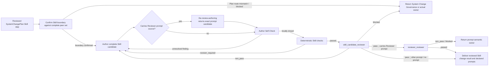

# Skill 编写（Skill Authoring）

## 0. AI-facing Authoring Rules

<!-- embedded-resource:soul:bestpractice_ai_facing_writing:start -->
## 核心原则

### 原则一：结果确定性优先于过程确定性

传统 skill 写法喜欢把任务拆成步骤：第一步做什么、第二步做什么、遇到 X 怎么办。这种写法把确定性押在过程上，本质上是在用自然语言写脚本。

问题在于：

- agent 有推理和工具调用能力，把它当脚本用是浪费
- 步骤式写法覆盖不了长尾 corner case
- 越是语义复杂、边界模糊的任务，越不适合靠固定流程硬写

更好的写法是把确定性从过程移到结果上：定义终点长什么样、如何验证到了终点，让 agent 自己决定路径。

一个 skill 文件至少要回答四个核心问题：

1. **目标**：要完成什么，用一句话说清楚
2. **验收标准**：什么结果算成功，写到 agent 能自行判断“我做完了没有”
3. **可用资源**：能用哪些工具、读哪些文件、必须遵守哪些边界
4. **输出规格**：产出物的格式、路径、schema

这四项是骨架。其他内容，例如方法论建议、领域知识、历史经验，都是围绕它们展开。

### 原则二：写 enabling 的指导，而非 SOP

Skill 的读者是一个有推理能力的 agent，它的 context window 是稀缺资源。每一段文字都应该增加 agent 成功完成任务的概率，而不是消耗它的注意力。

方法论建议可以写，但要以“建议”和“约束”的形式出现，而不是硬编码成唯一过程。例如：

- 按行业板块分组分析，是有效的分析视角
- 但如果当天核心只有一个宏观冲击，agent 应该有自由直接做全局分析

已知陷阱一定要写，因为这些往往是 agent 自己不容易从一轮上下文里可靠推断出来的。一个真实踩坑记录，通常比十条泛泛方法论更有价值。

判断一段内容是否值得写进 skill，可用两个标准：

1. 如果删掉这段话，agent 完成任务的质量或成功率会下降吗？
2. 这段话是在描述“怎么做”，还是在描述“做成什么样”？

优先保留后者。前者只在确实能提高成功率时保留。

---

### 原则三：AI-facing 文档先讲清 contract，再追求压缩表达

Skill 本身就是 AI-facing artifact。它不是给人类快速扫一眼的海报，而是给 agent 真正执行时消费的 contract。这条原则同样适用于一切**主要给 AI 消费**的稳定 doc：top-level design doc、routing doc、rule、axiom、entry doc（CLAUDE.md / AGENTS.md）。

#### 6 个必须能回答的问题

写 / 评审任何 AI-facing artifact 时，先确保它能直接回答：

1. **这一层是干什么的**（layer 用途）
2. **什么时候应该进入它**（进入条件 / 触发信号）
3. **进入后先读什么**（first authority / truth surface）
4. **应该产出什么**（输出形态 + reader-end-state）
5. **和相邻层如何交接**（handoff logic：上游期望什么 / 下游消费什么 / 失败时怎么 fall back）
6. **哪些邻近概念容易和它混淆**（disambiguation：和 X 区别在哪、什么时候不要用它而用 Y）

只有 1-6 都清楚时，再去考虑是否还能更短、更整洁。

#### 不要为了视觉清爽牺牲 contract

常见误区是为了"看起来清爽"，把关键边界压没了。AI-facing artifact 不需要 human skim-first 的整洁；它需要 agent 在执行时能找到 contract。

具体几条 anti-pattern：
- **任务主线收缩**：不要为了让 routing table 行数更少，就把 distinct 的 recurring task line 合并成一行。每条主线如果实际产出形态不同，就该独立一行
- **层级误读**：要显式区分 `task mainline` / `skill layer` / `writer gateway layer` / `deterministic builder / package layer` — 名字相近的层最容易被误用
- **靠命名承载含义**：如果一个名字容易误导（例如 "manager" 既可能指角色也可能指模块），不要只靠命名暗示，**直接在文档内写清楚它真正负责什么、以及它不负责什么**
- **summary 在 contract 之前**：可以有 summary，但只在详细 contract 已清晰之后再 summary

#### 检测：删一段后 agent 能否执行

写完一段后扫一遍：删掉这段，agent 还能完成 reader-end-state 列出的任务吗？
- 能 → 这段是 padding，删
- 不能 → 这段是 contract，保留

注意这个检测和 FP4 / `bestpractice_prose_without_editorial_meta.md` 的检测方向**相反但互补**：FP4 删的是"对世界判断没贡献的句子"（多写无益），本检测保留的是"对 agent 执行有贡献的 contract"（少写则模糊）。AI-facing artifact 在两者之间找平衡点。

---

### 原则四：钉「不变量」，不钉「实现路径」

「结果确定性优于过程确定性」回答了「该把确定性放在哪一层」。但实际写 skill 时还有一个更细的问题：在「结果」这一层内部，哪些必须钉死，哪些应该留给 agent 自由发挥。

如果什么都钉死，agent 失去 agency；如果什么都不钉，系统在每一轮都重新发明同一个东西，失去连贯性。

可用的划分：

- **必须钉死的不变量（invariant）**：
  - 产物的 canonical 路径与命名
  - 产物的 identity 字段（如 `report_date`、`asset_id`、`theme_id`）
  - 上游依赖的身份与新鲜度契约
  - 产出此节点的 canonical builder（不允许第二条产出路径）
  - 与相邻 skill / builder / writer 的接口形状
- **应该留开给 agent 的部分**：
  - 具体 prose 怎么写
  - 判断的具体路径与权衡
  - 中间过程怎么组织
  - 哪些证据要重点展开、哪些只点到为止

写 skill 时要把这两类显式分开。「钉死不变量」是为了让系统连贯、artifact 可追踪、跨任务可复用；「留开实现」是为了让 agent 可以根据当下 context 做最优判断。如果一个 skill 通篇都在规定 prose 结构和写作步骤，却没有讲清不变量，那么它一定既限制了 agent，又允许了 artifact 漂移——两头不讨好。

判断检查：

- 这条要求是不变量还是实现细节
- 如果不是不变量，能不能改写成「建议 + 失败信号」而不是「必须按 X 顺序做」
- 不变量是否足够少：少到 agent 能记住，多到系统不会漂移

### 原则五：边界有两面——禁止式 + 检测式

现有 skill 里的边界大多是禁止式：「不要做 X」「不要把 Y 误读为 Z」。这种 boundary 在 agent 注意到禁令时有效，但当 agent 用更短的路径绕过禁令、产出了一个表面合规的 artifact 时，禁止式 boundary 完全失效——它没有任何检测机制。

实际写 skill 时，每一条关键边界都应配一句**无声违反时长什么样**的描述。这是检测式 boundary。两面合在一起，agent 才有自我校验的把手。

例如：

- 禁止式：「不能在没跑完 data update 的情况下写 PM 报告」
- 检测式：「如果你在没看到 `daily_update_status.json` 显示 `blocking == false` 的情况下产出了 PM 报告，那就是无声违反；artifact 自己看不出问题，但上游 freshness 没满足，下次复盘会发现」

或：

- 禁止式：「不要让 theme overlay 替代 first authority」
- 检测式：「如果最终 artifact 的核心论述是 theme 的标准结论而不是当前 ticker / 当前市场 window 的解读，那就是无声违反——读者读完后判断的是 theme，不是 stock 或 today's tape」

写检测式 boundary 时尽量做到：

- 描述一个 agent 在产出后能自己回头检查的可观察特征
- 不要只说「读起来不对」，要说「读起来不对是因为缺了哪一类证据 / 用错了哪一层 truth surface」
- 如果违反只能在更下游被发现（比如下次复盘才能看出），明确说出在哪一层会被发现

这条原则的意义不是让 skill 文件变长，而是让 agent 拥有「我刚才那条路是不是已经无声越界」的自检能力。这正好弥补「结果确定性 + 留开实现」组合下的天然漏洞——agent 自由度高的地方，最容易出现自己看不见的偏移。

### 原则六：按冷读者的理解顺序组织概念

Skill 的执行者通常没有作者当时的讨论上下文。写作顺序必须从读者已经拥有的认知出发，让每个新概念只依赖前文已经建立的对象、任务或边界。

先确定两端：

- **读者起点**：进入 Skill 时已经知道哪些对象、字段、工具和上游事实
- **读者目标状态**：读完后能够判断何时进入、先信什么、产出什么、何时完成、何时停止或升级

概念进入正文时，优先按这个顺序提供理解支点：

1. 当前对象、任务或可观察问题是什么
2. 它与邻近对象、正常路径或已有认知有什么关键差异
3. 这项差异会改变什么执行、判断或 handoff
4. 最后给出需要长期复用的正式名称

这不是“定义永远不能先出现”的硬规则。Schema、协议对象或法律式术语可能需要先定义以保证精确；但读者在首次遇到它时仍应立即获得通俗角色、适用任务或操作影响，不能只拿到一个需要暂存的名称。

解释性段落应让冷读者恢复三个信息：正在描述什么、为什么需要这样规定、它会改变什么。纯字段表、枚举、代码块和引用块不强制套用段落三问，但它们前后必须有足够的用途说明。

交付前用统一缺陷极性检查。以下问题回答“是”表示发现缺陷，必须修改或形成 finding：

- 是否在建立任务或对象之前提前引入抽象术语，迫使读者暂存未理解的名称？
- 是否有解释性段落无法让冷读者恢复“什么、为什么、改变什么”？
- 是否存在机械编号、教科书口吻或不自然的概念堆叠？
- 是否在过短篇幅内引入过多相互独立的新概念？
- 是否存在段落间的 contract 或推理断层？
- 是否有改写改变了 governing source 中的数字、身份、权限、因果方向、不确定性、兼容性或停止条件？

最后一项是语义保护，不是普通风格偏好。作者只能改善投影的可理解性；如果更自然的措辞会改变 governing source 的含义，应保留原意或返回 owner，而不能替 authority 重写 contract。

---

<!-- embedded-resource:soul:bestpractice_ai_facing_writing:end -->

## 1. Task

本 Skill 接收一个 exact reviewed `SystemChangePlan` Skill step，核对目标 Skill 与完整 peer set 的责任
边界，并编写或修改一份完整 Skill candidate。

成功结果是一份完整 Skill；若结果仍需 managed execution，同时交付一份或多份完整、provider-neutral、
可供下游 Runtime registration 消费的 prompt。本 Skill 不注册 Module、
不生成 host projection、不选择 provider/model，也不发布或部署结果。

第一治理依据是 `designDoc/the_skill_management.md`。Owning Design 定义 product/domain Task meaning；
本 Skill 只把该 meaning 写成 Agent-facing instruction，不建立第二份 Design authority。

## 2. Reader Gain

Primary Agent 使用本 Skill 后可以：

- 判断哪个 Skill 应承载 reviewed update，并保持与相邻 Skill 的责任边界，而不是根据目标名字建立
  平行 Skill；
- 写出一份完整的 `SKILL.md`，使冷启动 Agent 无需历史对话或额外猜测，即可直接理解并执行 Task，
  并明确 entry、authority、output、completion、failure、boundary 和 Method；
- 在确有 managed execution 需要时写出无需读取 owning `SKILL.md` 或历史聊天的完整 prompt；
- 在 Plan 路由错误、authority 不清或 peer set 不完整时，停止并返回 System Change Governance 或真实 owner。

## 3. Entry and Exit

### 3.1 Entry

只有同时满足以下条件时进入：

1. 存在 exact reviewed `SystemChangePlan` step；
2. 该 step 把 authoring method 指向 `the-skill-authoring`；
3. 请求改变可重复 Agent 方法的 Task、Reader Gain、identity、class、entry/exit、inputs/authority、
   output/completion、boundary、Method 或 prompt；
4. owning Design meaning 和当前完整 Skill peer set 可取得。

目标名字、目录、`SKILL.md` 路径、prompt、Reviewer 或当前实现只能帮助定位，不能证明本 Skill 适用。

### 3.2 Exclusions

下列工作不进入本 Skill：

- 只修 hash、manifest、schema、fixture、generated inspection 或 projection 的机械漂移；
- 只改 Runtime registration、Module/Workflow Release、Execution Profile、provider binding 或 active pointer；
- 只改 product/domain Design、authorization、credential、data access、software release 或 deployment；
- 不改变 Agent 执行判断的纯格式修复。

机械修复若暴露 accepted Skill meaning 错误，必须先形成新的 `SystemChangePlan`，再重新进入本 Skill；
不能在 code repair 中顺手改 Skill 语义。

### 3.3 Exit

- Plan step 实际不属于 Skill update 时，停止并把 route mismatch evidence 返回 System Change Governance；
  不生成 Skill candidate 或新的结果类别。
- `blocked_owner`：owning Design meaning 或唯一 Skill owner 无法确定；返回 System Change Governance。
- `blocked_boundary`：candidate 会与现有 Skill、Design、Runtime、authorization 或 release boundary 冲突；
  返回真实冲突 owner，不加兼容 Skill 或旁路 prompt。
- `blocked_reproducibility`：Plan、peer set、current candidate、prompt closure 或 authority evidence 无法复现；
  恢复 exact input 后再进入。

## 4. Execution Contract

### 4.1 Inputs and Authority

只读取形成本次 Skill change 所需的 authority：

1. exact reviewed `SystemChangePlan` step；
2. `designDoc/the_skill_management.md`；
3. owning Charter、T0、T1 或 T2 Design meaning；
4. 当前完整 Skill peer set；
5. 更新时的 current accepted `SKILL.md`；
6. code-generated current-state inspection，只用于 identity、class、canonical source、declared prompt 和
   source-binding facts；
7. target host 对合法 Skill source 的 interface constraints。

冲突时按以下顺序判断：reviewed Plan step 决定本次 scope；owning Design 决定 Task meaning；Skill
Management 决定 Skill definition 和 boundary；code-generated inspection 只说明
当前实现；host guidance 只限制 interface format。Working code、prompt、provider session 或成功 CLI
command 不能覆盖上游 meaning。

### 4.2 Output and Completion

成功时返回完整 candidate `SKILL.md`，以及需要时的完整 prompt。Plan route 不匹配或输入不足时，返回
System Change Governance、真实 owner 或 `blocked_owner`、`blocked_boundary`、`blocked_reproducibility`，
不生成 candidate。

Authoring candidate 只有在以下结果全部成立时才完成：

- 冷启动 Agent 无需历史对话或 ambient repository search 即可判断 entry、input、output、completion、
  failure、boundary 与 Method；
- identity、唯一 owner、class、canonical source 和 owning Design meaning 一致；
- fixed result 与 Agent 可自行判断的 reasoning、prose、evidence emphasis 和 tool choice 已分开；
- 每条 critical prohibition 都有 observable violation；
- static instruction 不捕获 task-specific target、credential、authorization、provider choice、execution
  record 或 release state；
- 每份 declared prompt 都能独立闭合 Task、input/output、completion、failure、operation boundary、policy
  boundary 和 Skill handoff；
- Candidate 携带 Reviewer prompt source 时，author 同时交付该 prompt 的 exact bytes，但不宣称任何
  review 已通过；Skill candidate 先接受 `skill_candidate_reviewer`，通过后 exact prompt 再接受
  `reviewer_reviewer`，两者都通过后才能交付 Skill result；

本 Skill 不计算 candidate hash，不写 manifest/schema/fixture，不生成 projection，不调用 Reviewer，不改变
current Registry state，也不注册、admit、release 或 deploy Runtime result。

## 5. Boundaries

| Boundary | 本 Skill 保留的职责 | Observable violation |
| --- | --- | --- |
| Design 与 Skill | 保留 owning Design meaning，并把它写成 Agent instruction | 从当前代码、旧 prompt 或目录反推出新的 product meaning |
| Peer Skill | 比较完整 peer set，保持目标 Skill 的唯一责任边界 | 因目标名字不同而创建平行 Skill，或 candidate 与相邻 Skill 职责重叠 |
| Authoring 与 code | 写 semantic candidate 与完整 prompt；code 负责 schema、hash、writer 和 mechanical closure | Author 手改 generated hash/projection，或用 prose 声称 code gate 已通过 |
| Authoring 与 review | Author 返回 candidate；`skill_candidate_reviewer` 独立判断 exact bytes | Authoring invocation 加载 Reviewer prompt 自审，或自行返回 `pass` |
| Skill 与 prompt | Skill 定义稳定方法；每份 prompt 独立承载一个 managed execution role | Prompt 依赖 Runtime 读取 owning `SKILL.md` 才能执行，或携带 dynamic task data |
| Skill 与 Workflow/Runtime | Skill 交付 prompt 与 handoff；下游 owner 决定 composition、registration、execution 和 release | Skill candidate 声称 Module 已 registered/admitted、provider 已绑定或 Workflow 已发布 |
| Skill 与 authorization | Skill 声明需要的能力；Product Authorization 决定是否允许 | Skill 把 credential、entitlement 或 permission 当作自身 authority |
| Skill 与 persistence | Skill 定义结果；data owner 和 writer 决定 canonical write | Skill 直接取得数据库或 canonical-write authority |

同一 Skill folder 可以保存 authoring Skill 和 `skill_candidate_reviewer` source，但不构成作者自审：authoring
invocation 不加载 Reviewer prompt；Reviewer 由独立 execution identity 运行。Review Contract 注入 universal
review instruction，并拥有 `the-review-authoring` 与 `reviewer_reviewer` 的 Task meaning；Skill Management
拥有 `skill_candidate_reviewer` 的 subject-specific judging meaning 与 checklist。
Skill candidate 的必经 gate 是已注册的 `skill_candidate_reviewer` Runtime Module；它通过后，
carried Reviewer prompt 的必经 gate 是已注册的 `reviewer_reviewer` Runtime Module。任一 Module
route 不可用时，返回 Runtime registration 或 execution 的真实 owner，author 不自审也不换用相似 Reviewer。

## 6. Method

### 6.1 Confirm the Skill Boundary Against the Complete Peer Set

1. 列出完整 current Skill peer set，并按 Task、entry、inputs、outputs、completion、boundary 和 Method 比较；
2. 现有 Skill 已拥有结果时修改该 Skill，不能另建平行 Skill；
3. Candidate 必须让自身 Task responsibility 独立成立，并且不与相邻 Skill 重复或留下责任空缺；
4. Reviewed step 实际不是稳定、可重复的 Agent method update 时返回 System Change Governance 修正路由，
   不生成 Skill candidate。

### 6.2 Assign One Skill Class

| Class | Execution boundary |
| --- | --- |
| `primary_agent_development` | Primary Agent 在 governed repository 内直接使用的方法 |
| `product_agentic` | Product task 进入 Agent Runtime managed execution |
| `product_hybrid` | Deterministic outer responsibility 与 managed Agent responsibility 保持分离 |
| `projection_only` | 只提供稳定发现或兼容入口，不拥有被投影对象的执行语义 |

Class 只决定主要 entry 与 handoff，不定义 business meaning，也不授予 execution authority。

### 6.3 Author the Canonical Skill Structure

Frontmatter 承担 identity 与 discovery，正文不重复 `Identity`。每份 candidate `SKILL.md` 使用以下六个
带编号的一级 section。实际任务是编写稳定 artifact 的 authoring Skill 还必须在它们之前携带共同的
`## 0. AI-facing Authoring Rules`；第 0 章不计入以下六章。该章只能逐字使用 registered identifier
`soul:bestpractice_ai_facing_writing` 指向的 canonical selection；author 不手写、概括或改写它，code gate
检查 source ref、位置、exact bytes 和 hash。

六个一级 section 如下：

| Heading | Required result |
| --- | --- |
| `## 1. Task` | 目标 Agent 理解本 Skill完成什么任务、为什么存在 |
| `## 2. Reader Gain` | 目标 Agent 知道自己新增了什么可靠判断或动作 |
| `## 3. Entry and Exit` | 能判断何时进入、何时退出、blocked 时返回谁 |
| `## 4. Execution Contract` | 通过 `Inputs and Authority`、`Output and Completion` 闭合前置真相与完成合同 |
| `## 5. Boundaries` | 区分相邻职责，并给 critical prohibition 可观察的 violation |
| `## 6. Method` | 获得必要判断方法，同时保留合理 reasoning 和 tool-choice 自由 |

除共同第 0 章外，额外一级 section 只在增加不可替代的 Task meaning 时出现，并从 `7` 开始连续编号。子 section 使用
`### <parent>.<child> <name>`，同级编号连续。不要用自然语言重复 code-owned schema 或 validator。

### 6.4 Write for Result Certainty

- 先写 Agent 必须实现的结果，再写必要方法；不把 Skill 写成自然语言脚本。
- 每个概念只在一个主章节完整定义，其他位置只短引用。
- 每段都必须改变执行者的判断或成功概率；删除重复治理解释、过程复盘和无关例子。
- Known trap 只保留真实发生且高概率复现的失败模式。
- 中文为主，保留 exact English identifiers；首次出现的术语用普通语言说明作用。
- Reviewer finding 只是 evidence，不是修改命令；先核对 exact evidence、owner、scope 和 intended result。

### 6.5 Author Complete Prompts Only When Needed

只有 Skill candidate 仍需 managed execution 时才生成 prompt。每份 prompt 必须在没有聊天历史、没有读取 owning
`SKILL.md`、没有 ambient repository search 的情况下独立说明 Task、inputs、outputs、completion、
failure、operation boundary、policy boundary 和 Skill handoff。

Dynamic task data、credential、authorization decision、provider/model choice、execution state 和 release
state 不进入 fixed prompt。本 Skill 只编写普通 managed prompt。Reviewer prompt source 由
`the-review-authoring` 根据 owning Design meaning 编写 sections `1`–`3`，本 Skill 只把返回的 exact prompt
candidate 纳入 containing Skill candidate，不改写其 meaning。Runtime registration、schema/profile/policy
binding 与 release 留给下游 owner。

### 6.6 Author Self-Check

<!-- embedded-resource:t0:skill_author_self_check:start -->
调用外部 Reviewer 前，author 必须直接消费本 Skill 声明的、由 subject authority 拥有的 canonical checklist，不能手抄第二份 checklist。每次调用只形成临时结果表：

| `check_id` | `exact evidence` | `local result` | `unresolved finding` |
| --- | --- | --- | --- |

每个 required `check_id` 恰好出现一次，并绑定当前 exact candidate 的证据。历史 `prior_findings` 只作为需要在当前 candidate 上重新判断的 evidence，不能继承旧 verdict。任何 unresolved finding 都使 author 停止并留在本 Skill 内修订；只有本地 finding 全部关闭后，才冻结 exact candidate 并调用独立 Reviewer。

Author Self-Check 只防止作者把自己已经看见的缺口交给 Reviewer。它不产生 `passed`、approval、admission 或任何可替代独立审核的结果，也不创建持久化 record、Registry 或跨系统 schema。
<!-- embedded-resource:t0:skill_author_self_check:end -->

Canonical subject checklist：

<!-- embedded-resource:t0:skill_candidate_review_checklist:start -->
以下 11 项是完整 hard-gated checklist。Reviewer 按顺序逐项形成结果，完成全部检查后再给 verdict，并在
同一次调用中返回全部 actionable findings；不能命中首项后停止，也不能设置固定 finding 数量。一个根因
影响多项时保留逐项 assessment，但不复制 finding：

1. `identity_discovery_class_and_source`：frontmatter 的 stable identity、discriminating description、unique owner、四类之一的 Skill class 与 canonical source 是否完整一致；并根据 Task、Reader Gain 与实际产出判断共同首章和 Author Self-Check 各自是否适用，以及 candidate 是否表达了正确责任。
2. `task_and_reader_gain`：`Task` 是否说明准确任务；`Reader Gain` 是否说明目标 Agent 新增的可靠判断或动作，并与 Task、Output 和 authoring rationale 保持区分。
3. `entry_exit_and_routing`：entry、exclusion、blocked exit 与 return owner 是否闭合；candidate 与完整 peer set 的责任边界是否清楚，而不是依赖名称、目录或附近 prompt。
4. `inputs_authority_freshness_and_conflicts`：required inputs、first authority、owner、identity/freshness、缺失与冲突处理是否闭合，且 mutable state 没有被写成 static instruction。
5. `outputs_completion_failure_and_handoff`：output、completion、failure、partial/blocked result 与 downstream handoff 是否让冷读 Agent 能判断完成或停止，并且没有留下未声明的责任决定。
6. `boundaries_and_observable_violations`：与相邻 Skill、Tool、Workflow、prompt、Runtime、authorization、persistence、review 和 release 的边界是否准确；每条 critical prohibition 是否有 observable violation。
7. `method_result_certainty_and_agent_freedom`：Method 是否固定结果与必要判断，而没有把 reasoning、prose composition 或 tool choice 写成自然语言脚本；known traps 是否仅保留真实高概率失败模式；适用的 Author Self-Check 是否消费正确的 canonical subject checklist、逐项留下 exact evidence 与 local result、遇到 unresolved finding 时停止，并明确不能替代独立 Reviewer。
8. `design_and_revision_fidelity`：candidate 是否保留 owning Design meaning 与 reviewed change scope；与 peer set 的边界是否避免重复或责任缺口；是否从 current implementation 反推新的 product meaning。
9. `prompt_boundary_hygiene`：static Skill/prompt instruction 与 dynamic task input、credential、authorization、execution record、release state 和 provider/model choice 是否分离。
10. `skill_agent_workflow_tool_separation`：Tool、Skill、Workflow、prompt、Runtime Module 与 Agent objective 是否保持区分；Skill 没有取得 Runtime admission、canonical write 或 software release authority。
11. `runtime_ready_prompt_closure_if_declared`：普通 declared prompt 是否独立闭合 Task、input/output、completion、failure、operation boundary、policy boundary 和 Skill handoff；Reviewer prompt source 是否与 containing Skill 的 Task 和 handoff 一致，且不重复审核其 prompt meaning；Skill Package 携带 Reviewer source 时，containing Skill 是否声明 exact `module_id`、独立 Runtime execution identity、必经 handoff 和 Module route 不可用时的真实 owner；没有 declared prompt 时返回 `not_applicable` 并引用 candidate 中不需要 managed execution 的 exact evidence，不能推断一个 prompt。

每个 `check_results` entry 包含非空 `assessment`，引用当前 candidate 中足以支持判断的 exact evidence。
前十项只返回 `passed` 或 `finding`；第 11 项只有在没有 declared prompt 时可以返回 `not_applicable`。
只有 `block` 或 `fix` finding 才让 check disposition 成为 `finding`；只有 note 的 check 仍为 `passed`，
`finding_ids` 为空。
<!-- embedded-resource:t0:skill_candidate_review_checklist:end -->

本 Skill 修改自身时同样不能自审或自我准入。

### 6.7 Handoff

Authoring invocation 在交出 semantic candidate 或 exact exit 时结束。Deterministic checks、Reviewer 和
delivery 是 Skill Management 下游 gate，不能反向扩张 author authority；Runtime registration 与 Software
Delivery 在 Skill Management 完成之后另行执行。
