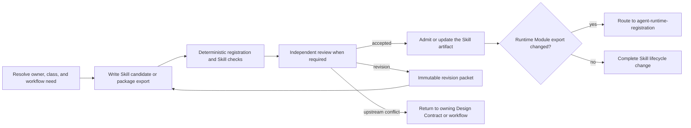

# Engineering Skill Authoring

## Identity

This is the Primary Agent development tool for one repository Skill. Its sole
governing Design Contract is `designDoc/the_skill_management.md`, under
`designDoc/the_design_doc_management.md`.

Its Primary Agent role is `authoring`. It may orchestrate a separately bound
independent reviewer, but it never supplies that review identity or verdict.

This Agent owns Skill authoring and migration work. It does not own the product
or domain workflow, Product Authorization, Dagster execution, Agent Runtime
execution, Claude SDK/Skill adapters, other provider adapters, software release
admission, or a canonical business write.

Use it when:

- creating a new repository Skill;
- materially changing a Skill's purpose, input, output, workflow, policy, or boundary;
- classifying a Skill as a Primary Agent tool or product workflow projection;
- advancing `developing`, `migration_planned`, `managed`, or `direct_entry_retired` state;
- repairing drift between an owning Design Contract, code registration, and `SKILL.md`;
- preparing one Skill for deterministic or Independent Review.

Cosmetic edits may bypass this workflow when identity, behavior, class,
migration state, and execution routing remain unchanged.

Registry data updates also bypass this workflow. Updating an Expertise Profile,
Release, Lens, query profile, or active pointer does not become a Skill change
because a Skill or Runtime workflow consumes that data. Enter this workflow
only when the repository Skill artifact or its own lifecycle changes.

Registry-owned data projections embedded beside a Skill are the narrow generic
exception: the registered generator may refresh them byte-for-byte from an
active data release when the owning Design Contract declares them to be
inspection or recovery projections rather than Skill semantic assets or
production inputs. A change to their layout, generator, or surrounding
`SKILL.md` still enters this workflow.

## Required Inputs

Resolve and read:

1. `designDoc/the_skill_management.md`;
2. `09_soul/axioms/a14_prompt_boundary_hygiene.md`;
3. `09_soul/axioms/a21_skill_agent_boundary.md`;
4. the owning T0 or T1 Design Contract;
5. the code-owned Skill registration and generated inspection, when present;
6. the existing target `SKILL.md` and every declared
   `runtime_modules/<module_id>/module_registration.json` plus `prompt.md`,
   when present;
7. the target host's Skill interface constraints;
8. the registered Dagster or Agent Runtime workflow and migration evidence when the Skill is product-facing;
9. for each product Agent Module export, the proposed `module_id`, exact input
   and output schema assets, operation set, context/evaluation/retry/output
   policies, workflow node binding, and positive/negative/schema-drift fixtures;
10. the applicable Contract Audit profile when Independent Review is required.

The two Axioms are the provider-neutral authoring judgment basis: A14 keeps
control-plane explanation out of the execution prompt, while A21 defines the
Skill capability contract and separates Tool, Skill, Workflow, and Agent. They
do not replace the governing Design Contract or code truth. Host-specific
guidance supplements this package only for interface format and validation.

Missing ownership, conflicting class, or an unresolved product execution target
blocks product migration. Do not infer authority from a directory name, prompt,
provider session, or working CLI command.

## Classification

Assign exactly one class:

| Class | Execution boundary |
| --- | --- |
| `primary_agent_development` | Primary Agent may invoke it directly for repository design, coding, migration, testing, engineering review, or external-review coordination |
| `product_deterministic` | Product execution occurs through Dagster |
| `product_agentic` | Product execution occurs through Agent Runtime |
| `product_hybrid` | Dagster owns the outer graph and every model-backed Module enters Agent Runtime |
| `projection_only` | The Skill explains or invokes an already managed target and is not a direct executor |

A Primary Agent development Skill cannot process tenant product work. A product
Skill cannot invoke a provider, unmanaged subprocess, or canonical writer
directly.

## Owned Workflow

1. Freeze Skill Governance, A14, A21, the owner, class, intended behavior,
   existing code truth, target workflow, and host constraints by
   reference and hash where available.
2. For every product Agent Module, create exactly one fixed
   `runtime_modules/<module_id>/` directory. Its
   `module_registration.json` declares the exact Module identity, owner,
   concrete schema files, operations, policies, and compatibility; its single
   `prompt.md` is the complete provider-neutral static instruction source. A
   symbolic schema ref, alternate prompt filename, or example JSON is not a
   closed registration.
3. Create one candidate `SKILL.md` that identifies the package, exported
   Modules, managed entry, and current code-owned registration. Do not repeat
   any exported Module prompt in `SKILL.md`, a host projection, or domain code.
   Keep governance and Axiom explanation in the authoring evidence rather than
   copying it into the task-plane prompt. The prompt may only require and emit
   fields declared by the exact registered schemas.
4. Run syntax, identity, reference, class, forbidden-direct-entry, schema,
   registration-closure, positive, negative, and schema-drift checks.
5. Run Independent Review when the registered profile requires it. The reviewer
   receives the frozen package and exact candidate, reports findings, and does
   not edit the candidate.
6. Apply findings through a new candidate and preserve revision lineage.
7. Admit or update the exact Skill artifact and regenerate Skill inspection.
   When a product-facing Module export is added or changed, hand the approved
   package to `agent-runtime-registration`; Skill Management does not
   register or admit the Runtime Module Release.
8. Advance migration state only when the state-specific evidence is complete.

## Migration Policy

### `developing`

The existing direct implementation may remain within its declared development
or comparison scope. Product expansion waits for an approved owning T1 workflow
and execution binding.

### `migration_planned`

This is an executable automated test and evaluation stage. Agent Runtime runs
Module tests, evaluations, sibling model or provider Variants, replay,
failure injection, authorization negatives, and observability checks. Fixed and
hybrid workflows also validate the Dagster binding. The direct entry remains
the production comparison path during this stage.

### `managed`

Product routing uses the admitted Dagster or Agent Runtime target. The Skill
remains active as the managed entry and Agent-facing semantic projection. Its
text references the managed target and contains no direct provider call,
unmanaged process, or canonical write path.

### `direct_entry_retired`

Keep the canonical managed Skill. Remove the legacy direct runner, embedded
prompt, compatibility alias, and direct write path from active and archived
discovery roots. Code retains a non-executable tombstone containing the old
entry identity, replacement workflow, final hash, reason, and retirement time.
Git history or an authorized audit store preserves historical recovery.

## Review and Completion

Before accepting any authored or revised `SKILL.md`, apply
the installed project-facing communication contract together with the portable
Skill-writing and Doc Self-Review contracts. Use defect polarity: a finding
means a defect is present; no finding means the check passes. Treat Skill ID,
class, owner, authority, canonical path, compatibility, schema references,
migration state, completion semantics, failure semantics, stop conditions, and
Runtime binding as protected meaning. Clarity edits that could change them
return to Skill Governance or the owning Design Contract.

A completed change identifies:

- Skill ID, owner, class, and target path;
- owning Design Contract and code registration;
- migration state and managed workflow binding when applicable;
- candidate hash and deterministic check results;
- Independent Review result and revision packets when required;
- direct-entry disposition and tombstone when retiring a legacy path;
- focused tests and regenerated inspection.

Stop with one of these outcomes:

- accepted Skill and registration change;
- accepted Skill candidate with an explicit remaining Software Delivery gate;
- owner-routed upstream conflict;
- blocked product migration because the managed target or required evidence is absent.

## Invariants

- The owning Design Contract defines behavior.
- Code registration defines current class, binding, and migration truth.
- Every material Skill change loads Skill Governance plus A14 and A21;
  host authoring guidance may supplement but cannot replace that basis.
- Governance and Axiom prose remains authoring control-plane evidence unless a
  specific instruction materially changes task execution.
- A Skill cannot grant Product Authorization, Runtime admission, release
  admission, or canonical-write authority.
- Updating a Registry-owned data object does not trigger Skill Management and
  cannot mutate a Skill, Agent, Module, Workflow, or Team artifact.
- Every model-backed product Module enters Agent Runtime.
- Product-agentic Skill drafting is registration-first: a concrete Module
  candidate and its schema assets exist before task-plane instructions are
  accepted.
- Every product-agentic Module export uses the fixed
  `runtime_modules/<module_id>/module_registration.json` and `prompt.md` read
  channel; the directory name, `export_id`, and `module_id` are identical.
- `prompt.md` is the only editable prompt source. The registered Runtime store
  retains the immutable copy used by production; `SKILL.md`, host projections,
  Runtime code, domain code, and Adapter code do not duplicate its body.
- Example output JSON never overrides the registered output schema, and a
  Reviewer cannot require fields the Producer Module is not allowed to emit.
- The managed Skill remains available after legacy direct-entry retirement.
- Retired direct-execution instructions remain outside active and archived Skill
  discovery.
- Provider, model, adapter, deployment, and current binding inventories come
  from code or generated inspection, not hand-maintained Skill prose.
- Claude SDK, Claude Skill, Codex CLI, and future provider-facing adapters are
  Agent Runtime registrations and never Skill Governance implementations.
