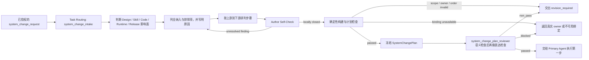

# 系统变更计划编写

## 0. AI-facing Authoring Rules

<!-- embedded-resource:soul:bestpractice_ai_facing_writing:start -->
## 核心原则

### 原则一：结果确定性优先于过程确定性

传统 skill 写法喜欢把任务拆成步骤：第一步做什么、第二步做什么、遇到 X 怎么办。这种写法把确定性押在过程上，本质上是在用自然语言写脚本。

问题在于：

- agent 有推理和工具调用能力，把它当脚本用是浪费
- 步骤式写法覆盖不了长尾 corner case
- 越是语义复杂、边界模糊的任务，越不适合靠固定流程硬写

更好的写法是把确定性从过程移到结果上：定义终点长什么样、如何验证到了终点，让 agent 自己决定路径。

一个 skill 文件至少要回答四个核心问题：

1. **目标**：要完成什么，用一句话说清楚
2. **验收标准**：什么结果算成功，写到 agent 能自行判断“我做完了没有”
3. **可用资源**：能用哪些工具、读哪些文件、必须遵守哪些边界
4. **输出规格**：产出物的格式、路径、schema

这四项是骨架。其他内容，例如方法论建议、领域知识、历史经验，都是围绕它们展开。

### 原则二：写 enabling 的指导，而非 SOP

Skill 的读者是一个有推理能力的 agent，它的 context window 是稀缺资源。每一段文字都应该增加 agent 成功完成任务的概率，而不是消耗它的注意力。

方法论建议可以写，但要以“建议”和“约束”的形式出现，而不是硬编码成唯一过程。例如：

- 按行业板块分组分析，是有效的分析视角
- 但如果当天核心只有一个宏观冲击，agent 应该有自由直接做全局分析

已知陷阱一定要写，因为这些往往是 agent 自己不容易从一轮上下文里可靠推断出来的。一个真实踩坑记录，通常比十条泛泛方法论更有价值。

判断一段内容是否值得写进 skill，可用两个标准：

1. 如果删掉这段话，agent 完成任务的质量或成功率会下降吗？
2. 这段话是在描述“怎么做”，还是在描述“做成什么样”？

优先保留后者。前者只在确实能提高成功率时保留。

---

### 原则三：AI-facing 文档先讲清 contract，再追求压缩表达

Skill 本身就是 AI-facing artifact。它不是给人类快速扫一眼的海报，而是给 agent 真正执行时消费的 contract。这条原则同样适用于一切**主要给 AI 消费**的稳定 doc：top-level design doc、routing doc、rule、axiom、entry doc（CLAUDE.md / AGENTS.md）。

#### 6 个必须能回答的问题

写 / 评审任何 AI-facing artifact 时，先确保它能直接回答：

1. **这一层是干什么的**（layer 用途）
2. **什么时候应该进入它**（进入条件 / 触发信号）
3. **进入后先读什么**（first authority / truth surface）
4. **应该产出什么**（输出形态 + reader-end-state）
5. **和相邻层如何交接**（handoff logic：上游期望什么 / 下游消费什么 / 失败时怎么 fall back）
6. **哪些邻近概念容易和它混淆**（disambiguation：和 X 区别在哪、什么时候不要用它而用 Y）

只有 1-6 都清楚时，再去考虑是否还能更短、更整洁。

#### 不要为了视觉清爽牺牲 contract

常见误区是为了"看起来清爽"，把关键边界压没了。AI-facing artifact 不需要 human skim-first 的整洁；它需要 agent 在执行时能找到 contract。

具体几条 anti-pattern：
- **任务主线收缩**：不要为了让 routing table 行数更少，就把 distinct 的 recurring task line 合并成一行。每条主线如果实际产出形态不同，就该独立一行
- **层级误读**：要显式区分 `task mainline` / `skill layer` / `writer gateway layer` / `deterministic builder / package layer` — 名字相近的层最容易被误用
- **靠命名承载含义**：如果一个名字容易误导（例如 "manager" 既可能指角色也可能指模块），不要只靠命名暗示，**直接在文档内写清楚它真正负责什么、以及它不负责什么**
- **summary 在 contract 之前**：可以有 summary，但只在详细 contract 已清晰之后再 summary

#### 检测：删一段后 agent 能否执行

写完一段后扫一遍：删掉这段，agent 还能完成 reader-end-state 列出的任务吗？
- 能 → 这段是 padding，删
- 不能 → 这段是 contract，保留

注意这个检测和 FP4 / `bestpractice_prose_without_editorial_meta.md` 的检测方向**相反但互补**：FP4 删的是"对世界判断没贡献的句子"（多写无益），本检测保留的是"对 agent 执行有贡献的 contract"（少写则模糊）。AI-facing artifact 在两者之间找平衡点。

---

### 原则四：钉「不变量」，不钉「实现路径」

「结果确定性优于过程确定性」回答了「该把确定性放在哪一层」。但实际写 skill 时还有一个更细的问题：在「结果」这一层内部，哪些必须钉死，哪些应该留给 agent 自由发挥。

如果什么都钉死，agent 失去 agency；如果什么都不钉，系统在每一轮都重新发明同一个东西，失去连贯性。

可用的划分：

- **必须钉死的不变量（invariant）**：
  - 产物的 canonical 路径与命名
  - 产物的 identity 字段（如 `report_date`、`asset_id`、`theme_id`）
  - 上游依赖的身份与新鲜度契约
  - 产出此节点的 canonical builder（不允许第二条产出路径）
  - 与相邻 skill / builder / writer 的接口形状
- **应该留开给 agent 的部分**：
  - 具体 prose 怎么写
  - 判断的具体路径与权衡
  - 中间过程怎么组织
  - 哪些证据要重点展开、哪些只点到为止

写 skill 时要把这两类显式分开。「钉死不变量」是为了让系统连贯、artifact 可追踪、跨任务可复用；「留开实现」是为了让 agent 可以根据当下 context 做最优判断。如果一个 skill 通篇都在规定 prose 结构和写作步骤，却没有讲清不变量，那么它一定既限制了 agent，又允许了 artifact 漂移——两头不讨好。

判断检查：

- 这条要求是不变量还是实现细节
- 如果不是不变量，能不能改写成「建议 + 失败信号」而不是「必须按 X 顺序做」
- 不变量是否足够少：少到 agent 能记住，多到系统不会漂移

### 原则五：边界有两面——禁止式 + 检测式

现有 skill 里的边界大多是禁止式：「不要做 X」「不要把 Y 误读为 Z」。这种 boundary 在 agent 注意到禁令时有效，但当 agent 用更短的路径绕过禁令、产出了一个表面合规的 artifact 时，禁止式 boundary 完全失效——它没有任何检测机制。

实际写 skill 时，每一条关键边界都应配一句**无声违反时长什么样**的描述。这是检测式 boundary。两面合在一起，agent 才有自我校验的把手。

例如：

- 禁止式：「不能在没跑完 data update 的情况下写 PM 报告」
- 检测式：「如果你在没看到 `daily_update_status.json` 显示 `blocking == false` 的情况下产出了 PM 报告，那就是无声违反；artifact 自己看不出问题，但上游 freshness 没满足，下次复盘会发现」

或：

- 禁止式：「不要让 theme overlay 替代 first authority」
- 检测式：「如果最终 artifact 的核心论述是 theme 的标准结论而不是当前 ticker / 当前市场 window 的解读，那就是无声违反——读者读完后判断的是 theme，不是 stock 或 today's tape」

写检测式 boundary 时尽量做到：

- 描述一个 agent 在产出后能自己回头检查的可观察特征
- 不要只说「读起来不对」，要说「读起来不对是因为缺了哪一类证据 / 用错了哪一层 truth surface」
- 如果违反只能在更下游被发现（比如下次复盘才能看出），明确说出在哪一层会被发现

这条原则的意义不是让 skill 文件变长，而是让 agent 拥有「我刚才那条路是不是已经无声越界」的自检能力。这正好弥补「结果确定性 + 留开实现」组合下的天然漏洞——agent 自由度高的地方，最容易出现自己看不见的偏移。

### 原则六：按冷读者的理解顺序组织概念

Skill 的执行者通常没有作者当时的讨论上下文。写作顺序必须从读者已经拥有的认知出发，让每个新概念只依赖前文已经建立的对象、任务或边界。

先确定两端：

- **读者起点**：进入 Skill 时已经知道哪些对象、字段、工具和上游事实
- **读者目标状态**：读完后能够判断何时进入、先信什么、产出什么、何时完成、何时停止或升级

概念进入正文时，优先按这个顺序提供理解支点：

1. 当前对象、任务或可观察问题是什么
2. 它与邻近对象、正常路径或已有认知有什么关键差异
3. 这项差异会改变什么执行、判断或 handoff
4. 最后给出需要长期复用的正式名称

这不是“定义永远不能先出现”的硬规则。Schema、协议对象或法律式术语可能需要先定义以保证精确；但读者在首次遇到它时仍应立即获得通俗角色、适用任务或操作影响，不能只拿到一个需要暂存的名称。

解释性段落应让冷读者恢复三个信息：正在描述什么、为什么需要这样规定、它会改变什么。纯字段表、枚举、代码块和引用块不强制套用段落三问，但它们前后必须有足够的用途说明。

交付前用统一缺陷极性检查。以下问题回答“是”表示发现缺陷，必须修改或形成 finding：

- 是否在建立任务或对象之前提前引入抽象术语，迫使读者暂存未理解的名称？
- 是否有解释性段落无法让冷读者恢复“什么、为什么、改变什么”？
- 是否存在机械编号、教科书口吻或不自然的概念堆叠？
- 是否在过短篇幅内引入过多相互独立的新概念？
- 是否存在段落间的 contract 或推理断层？
- 是否有改写改变了 governing source 中的数字、身份、权限、因果方向、不确定性、兼容性或停止条件？

最后一项是语义保护，不是普通风格偏好。作者只能改善投影的可理解性；如果更自然的措辞会改变 governing source 的含义，应保留原意或返回 owner，而不能替 authority 重写 contract。

---

<!-- embedded-resource:soul:bestpractice_ai_facing_writing:end -->

## 1. Task

本 Skill 接收 Task Routing 产生的 `system_change_intake`，编写一份完整、顺序正确且可直接
执行的 `SystemChangePlan`。它只负责规划和路由，不编写、审核、批准、准入、执行或跟踪
Design、Skill、Code、Runtime、Data 和 Release 的下游工作。

System Change Governance 拥有计划含义。本 Skill folder 同时保存独立
`system_change_plan_reviewer` 的 Prompt、Schema、Fixture 和注册源，但计划作者不会加载该
Reviewer 自审。Reviewer 由独立执行身份运行，并直接返回 System Change Governance 定义的
审核结果。冻结计划必须使用已注册的 `system_change_plan_reviewer` Runtime Module；Module
route 不可用时返回 `blocked_binding` 和 Runtime owner evidence，Primary Agent 不直审也不换用相似 Reviewer。

## 2. Reader Gain

Primary Agent 使用本 Skill 后可以一次判断：

- 哪些文件或受治理面需要修改，哪些明确不改，以及各自原因；
- 每项修改属于 Design、Skill、Code、Runtime 还是 Release；
- 从上游语义到下游实现的准确顺序；
- 每步的唯一责任人、authoring 或 implementation method、产出对象类型、审核门和完成条件；
- 何时可以执行计划，何时必须把待决事项或错误路由返回真实所有者。

## 3. Entry and Exit

### 3.1 Entry

只有明确声明的 `system_change_request` 已由 Task Routing 路由为 `system_change_intake` 时才进入。
相同目录、文件名、T0 名称或附近 Skill 只能帮助定位，不能证明路由正确。路由不匹配时停止，
把证据返回 Task Routing；只有证据证明逻辑所有者错误时，才报告已注册的
`wrong_logical_owner` Routing Gap。

编写前必须取得当前有效的 `SystemChangePlan` Schema、确定性构建器绑定、项目 Charter、T0
拓扑、受影响面的代码生成事实，以及已注册的编写方法和审核门。这些输入必须由
`system_change_intake` 携带 exact reference，或由该 intake 明确引用的 code-generated inspection
提供；本 Skill 不通过 ambient repository search 猜测绑定。缺少 exact reference 或任一必需
authority 时不生成计划，并进入 `blocked_binding`，把缺失证据返回对应 owner。

### 3.2 Exit

- `ready_for_execution`：计划没有 `unresolved_decisions`，通过确定性检查和
  `system_change_plan_reviewer`，交给 Primary Agent 执行第一步。
- `revision_required`：确定性检查或有效审核结果指出计划未闭合，返回计划作者；或计划包含
  `unresolved_decisions`，把每项待决事项返回该项声明的 accountable decision owner。当前调用随后
  停止，相关事项解决后重新进入本 Skill。
- `blocked_owner_or_layer`：Task Routing 无法确定语义任务主线时返回 Task Routing；代码生成的 Registry
  事实缺失、冲突或无法解析 owner 或 layer 时，返回 Artifact Graph 或对应 code-owned Design Registry
  的 owner；输入证据已表明确实需要上级结构决定时，按照 Project Charter 和当前 T0 拓扑返回其中
  登记的 accountable authority。
- `blocked_binding`：Schema、构建器、Reviewer 或验证绑定不可用，返回对应代码或治理 owner。
- `blocked_review`：Reviewer 已返回有效 `blocked` disposition，但 blocker 不属于上述两类；把 exact
  blocker 返回 Reviewer output 指定的 accountable owner。

本 Skill 在交出上述一种结果后结束。它不维护 Case、`ScopeAssessment`、`WorkPackage`、
`CandidateSet`、`ClosureRecord`、执行状态、生命周期或进度页面。

## 4. Execution Contract

### 4.1 Inputs and Authority

按以下 authority 形成计划：

1. 已授权的目标结果；
2. Task Routing 的 `system_change_intake`；
3. 由代码生成的当前文件、受审对象类型、所有者、层级和依赖事实；
4. Project Charter 和当前对等 T0 拓扑；
5. 已注册的编写方法、产出对象类型、Reviewer 和确定性检查门；
6. 代码拥有的 `SystemChangePlan` Schema 和确定性构建器绑定。

前序 finding 只作为证据。文件名、失败测试、模型、模型提供方、附近 Skill、旧计划或当前实现
都不能覆盖上述 authority，也不能代替 owner 或 layer 判断。

### 4.2 Output and Completion

计划正文必须闭合以下内容：

- `requested_result`；
- `affected_surfaces`：完整受影响范围；其中需要修改的文件或受治理面带有 subject kind、layer、
  owner 和 required change；
- `excluded_surfaces`：从完整受影响范围中明确不改的面及其原因；
- `ordered_steps`：每步的 prerequisite、authoring 或 implementation method、output kind、review gate 和 completion；
- `unresolved_decisions`：使计划暂时不能执行的待决事项；每项都写明 decision 和 accountable
  decision owner。

构建器按照已注册 Schema 派生计划 ID、版本、文件哈希、Registry 引用和权威时间。
模型不复制或自造这些元数据。只有 `unresolved_decisions` 为空、确定性检查通过、同一份冻结计划
取得 `system_change_plan_reviewer` 的 `passed` 时，计划才完成。`passed` 只允许执行该计划，不批准
任何下游候选产物。

未成功时使用 System Change Governance 已有错误码：

- `SYSTEM_CHANGE_PLAN_SCOPE_INCOMPLETE`、`SYSTEM_CHANGE_PLAN_OWNER_INVALID` 或
  `SYSTEM_CHANGE_PLAN_ORDER_INVALID`：返回确定性失败证据，不返回可执行计划；
- `SYSTEM_CHANGE_PLAN_REVIEW_UNAVAILABLE`：没有针对 exact frozen plan 的有效审核结果，返回
  route、execution、schema 或 semantic validation 的准确失败证据；
- `SYSTEM_CHANGE_PLAN_REVIEW_NOT_PASSED`：已有有效审核结果，但 disposition 为 `non_pass` 或
  `blocked`，返回该结果且不交付计划。

如果下游执行发现范围、所有者、顺序或目标结果已经变化，Primary Agent 重新请求并冻结一份完整
计划；本 Skill 不修改已经冻结的计划，也不接管执行。

## 5. Boundaries

| Boundary | 本 Skill 保留的职责 | Observable violation |
| --- | --- | --- |
| 计划与执行 | 只形成可执行计划和路由 | 输出包含候选产物状态、执行进度、准入汇总或闭包状态 |
| 完整范围 | 每个相关面要么纳入，要么说明排除原因 | 相关文件或受治理面未出现在任何清单，或排除没有原因 |
| 单步路由 | 每步只有一组 owner、method、output kind、review gate 和 completion | 某步缺字段、存在并行 owner，或要求执行者自行补决定 |
| 层级顺序 | 上游 Design meaning 先于 Skill、Code、Runtime 和 Release | 下游可在必需上游结果完成前启动 |
| Authoring authority | 只指定下游 authoring method | 计划直接编写 Design、Skill、Code、Runtime 注册或 Release 内容 |
| Reviewer routing | subject kind 是路由键，owning Design 登记该路由 | 文件名、T0 名、provider、model 或附近 Skill 决定 Reviewer |
| Reviewer independence | 计划作者与 Reviewer 使用不同的执行身份 | 审核证据缺少独立执行身份，或显示计划作者执行了自己的 Reviewer |
| Input provenance | Schema、构建器和 code-generated inspection 来自 `system_change_intake` 的 exact reference | 计划引用的绑定无法追溯到该 intake 或其明确引用的 inspection |
| 生命周期 | 交接后结束 | Skill 继续维护 WorkPackage、candidate、lifecycle 或进度记录 |

## 6. Method

### 6.1 Plan Flow



### 6.2 Dependency Order

固定依赖顺序是：

```text
需要时先完成结构决策
→ Design Intent
→ Skill 和 Module 源文件
→ Code Design 和实现
→ Runtime 注册和准入
→ Release、投影和部署
```

结构决策路由给适用的上级 authority。本 Skill 不拥有 `StructureChangeProposal` 或
`structure_change_reviewer`。未修改的上游层只作为冻结 prerequisite 引用；计划不制造空候选，
也不允许下游跳过上游验证。

### 6.3 Author Self-Check

<!-- embedded-resource:t0:skill_author_self_check:start -->
调用外部 Reviewer 前，author 必须直接消费本 Skill 声明的、由 subject authority 拥有的 canonical checklist，不能手抄第二份 checklist。每次调用只形成临时结果表：

| `check_id` | `exact evidence` | `local result` | `unresolved finding` |
| --- | --- | --- | --- |

每个 required `check_id` 恰好出现一次，并绑定当前 exact candidate 的证据。历史 `prior_findings` 只作为需要在当前 candidate 上重新判断的 evidence，不能继承旧 verdict。任何 unresolved finding 都使 author 停止并留在本 Skill 内修订；只有本地 finding 全部关闭后，才冻结 exact candidate 并调用独立 Reviewer。

Author Self-Check 只防止作者把自己已经看见的缺口交给 Reviewer。它不产生 `passed`、approval、admission 或任何可替代独立审核的结果，也不创建持久化 record、Registry 或跨系统 schema。
<!-- embedded-resource:t0:skill_author_self_check:end -->

Canonical subject checklist：

<!-- embedded-resource:t0:system_change_plan_review_checklist:start -->
目标特定 checklist 按以下顺序且完整包含八项：

1. 每个受影响文件或受治理面都已纳入或被明确排除，且不存在会让计划暂时无法执行的
   `unresolved_decisions`；
2. 每个受影响面都被正确归入 Design、Skill、Code、Runtime 或 Release；
3. 每项修改的目标结果和原因清楚；
4. 步骤严格遵守从上游到下游的依赖顺序；
5. 每个步骤都有一个最终问责负责人、一个编写方法、一个产出对象类型、一个审核门和一个完成条件；
6. 未修改的上游层以冻结前置结果形式引用，而不是制造空候选产物；
7. Reviewer 路由由产出对象类型决定，不能由文件名、所属 T0 名称、模型、provider 或附近 Skill 决定；
8. 计划在规划和路由处结束，不包含执行状态、生命周期、`CandidateSet`、闭包、批准或准入汇总。
<!-- embedded-resource:t0:system_change_plan_review_checklist:end -->

### 6.4 Deterministic and Independent Review

模型审核前，代码先检查范围覆盖、owner、registered method、Reviewer route、dependency order、
Schema 和 binding。确定性检查不能用附近错误码替未确定 layer 或 owner 做决定。

通过机械检查后，独立执行身份调用 `system_change_plan_reviewer`。Reviewer 只审同一份 exact frozen
plan：先逐项判断 System Change Governance 的八项语义检查，再在语义全部通过后做 prose check。
注册的 Review Contract binding 只注入通用审核规则；System Change Governance 拥有 subject-specific
checklist、output schema、semantic validator 和 disposition meaning。Agent Runtime 只执行 Module，
不取得这些语义的所有权。

### 6.5 Findings

Reviewer 不编辑计划。finding 是证据，不是修改命令。接受修正前，先核对 exact evidence、owner、
scope 和 intended result；所有者错误、前提错误、重复机制或越界建议返回 Reviewer owner。本次调用
交出 `revision_required` 后结束。Primary Agent 重新进入本 Skill，修订完整计划并生成新 hash；新候选
重新经过确定性检查和独立审核。

### 6.6 Fixed Authoring Instructions

第 0 节和本节以下的文字属于本 Primary Agent Skill 的固定静态指令面。它不授予独立 Module 身份或执行
权责。它消费两段 registered canonical instruction：

- `soul:communication_authoring_prose`，从父来源 `soul:communication` 选取，范围从
  `## 语言风格` 起，到 `## 冷读者与语义保护契约` 末尾；
- `soul:bestpractice_ai_facing_writing`，从父来源 `soul:bestpractice_skill_writing` 选取，
  范围从 `## 核心原则` 起，到 `### 原则六：按冷读者的理解顺序组织概念` 末尾。

`soul:communication_authoring_prose` 的源文件继续拥有其沟通规则。Skill Management 拥有
`soul:bestpractice_ai_facing_writing` 作为 authoring Skill 共同规则的语义、适用范围、登记的 exact
bytes 和变更决定；父来源文件不形成平行 authority。该 selection 或登记字节的变化先作为
Skill Management change 处理，再通过受影响 Skill 的新 candidate 进入。Manifest 和 candidate hash
固定当前所选字节，不会静默修改已接受 Skill。

在本 Skill 中，这两段文字只约束 `SystemChangePlan` 的沟通、结果闭包、冷读者可执行性和含义
保持。其中以 Skill writing 为对象的例子只提供 AI-facing 写作方法，不要求计划增加 Skill 字段、
路径、Schema、资源或 Runtime 产物，也不能扩大 System Change Governance 的 authority。

<!-- embedded-resource:soul:communication_authoring_prose:start -->
## 语言风格

Applicability: `always_on_surface`

务实、理性、克制。用思考深度体现专业，不堆砌宏大词藻，不用文学性比喻。

- 不用华丽辞藻，不用"惊喜"这类营销词汇
- 不说废话，不说客套话，直奔主题
- 用数据和逻辑说话，不靠形容词
- 不要用破折号（——/—/--）。能拆成两句的，拆开写；能用冒号或分句表达的，用冒号或分句。「主句——插入——主句」这种结构尤其要避免 <!-- prose-lint-ignore E1 -->
- 避免「长出来 / 长出了」用于系统或抽象事物的演化。用「逐步发展」「逐步形成」「演化为」等替代
- 避免否定句式，改用正向陈述。与其说 X 不是 Y，不如直接说 X 是什么
- **任何编号标签每条回复内首次出现都必须 inline 注明它讲什么；下一条回复再出现时必须再次注明**。涵盖 axiom（a17 / R07 / T10 / FP6 等）/ rule（M1 / S2 / N1 / D3 等 review 编号）/ method（M1-M6 distillation method）/ baseline（B0-B4）/ experiment（b1_language_delta 等）/ phase（Phase 3）/ gate（G1-G5）/ task（card_001）等所有 letter+digit identifier。`<label>（一句话讲什么）` 或 `<label>: 一句话讲什么` 都行，关键是读者每条回复都不需要 mental dictionary lookup。**没有 "上一条已经说过所以省略" 这种豁免**，因为用户可能从某条中间回复读起，每条必须 self-contained。同一回复内同标签反复出现，第二次起可省略

标签注解的例子：
- ❌ "M1 / S2 / N1 已 close"
- ✅ "M1（b6 概念错位）/ S2（version bump 规则）/ N1（serves_persona_decision 字段）已 close"
- ❌ "按 a17 axiom + R07 boundary，T10 也 cover 了"
- ✅ "按 a20（Reader Persona Primacy）+ R07（KB / AP boundary），T10（Index First）也 cover 了"
- ❌ "B3 在 G3 fail，要走 D2 default"
- ✅ "B3（M3 Hansen-McMahon 两轴 baseline）在 G3（toy validation gate）fail，要走 D2（每组合跑 1 次的默认配置）"

否定改正向的例子：
- `you're not a user of the tool` 改为 `you end up serving as a component of the tool`
- `it doesn't know your config` 改为 `it goes in blind: config unknown`
- `this isn't just faster` 改为 `this is a categorical shift`
- `not just coding` 改为 `brainstorming, drafting, planning, everything`

这一原则适用于中英文，在 slide 文案和 speaker notes 中需严格执行。

## 把句子说完整

Applicability: `always_on_surface`

读者是人。写作为阅读优化，不为压缩优化：读者的效率是理解速度，不是字数。机器格式（JSON 字段、代码、表格列）要求紧凑；给人读的散文遵守本节。

- **每句话有完整的主语和谓语**。电报体、名词短语堆叠、自造行话动词都算病句。"方向判断挂周期叙事"这种写法要求读者自己解压；应写成"方向判断什么时候允许修改，取决于周期叙事有没有触发登记的阈值"。
- **括号最多一层，只放次要补充**。条件、结论、出处这类主干信息写进正句。括号强迫读者把主句挂起、读完插入语再接回来；主句十五个字、括号六十个字，是典型病句。
- **散文里禁用符号连接词**：斜杠串、加号串、箭头链、等号都属于笔记压缩符号，不是给人读的语言。用"和""或""先……然后……""也就是说"把关系说出来。上一节的破折号禁令与本条同族。
- **句子要有节奏**。重点句配过渡句，长短错落；每句都满载，等于全文没有重点。允许一句话只说一件小事。
- **代号第一次出现时带一句人话**，隔远了再重述一次。这条是上一节编号标签规则的推广，覆盖仓内一切代号（阈值编号、行权价简称、财务缩写）。中文能表达的意思用中文，系统字段名需要引用原文时除外。
- **产品、架构和设计文档优先使用企业通行术语**。先写行业内普遍理解的名称，再在括号内标注内部 interface、字段或兼容角色名。确实需要自造术语时，第一次出现就用一句人话说明它负责什么、不负责什么。不要要求读者先学习一套内部词典。
- **技术架构合同以英文为 canonical language**。Taxonomy、interface、schema、diagram、comparison table 和 machine-auditable contract 使用英文，避免中文翻译压平 `authority`、`ownership`、`responsibility`、`control` 和 `system of record` 等不同概念。中文只作为 PM-facing explanation，不建立第二套合同词汇。
- **复杂结构先声明分类轴**。同一张表或同一级列表只比较同类对象。文档同时涉及角色、决策权、运行服务、数据记录或部署实现中的两个以上视图时，先用 Structure Index 或 Mermaid 图标明各视图和层级，再分别展开。禁止把不同层级对象放进一张平铺清单，让读者自行猜关系。
- **Mermaid 用于跨对象关系和过程变化**。Architecture dependency、cross-layer flow、stepwise workflow、state transition 或三个以上对象的交互优先用最小可用 Mermaid；同层比较继续用 table，单一事实继续用 prose。Diagram 必须增加关系、方向、顺序或状态信息，不能只是把相邻段落重新画一遍。
- 适用面：对话回复、doc 条款、框架与档案 JSON 里的散文字段、报告、review。
- 执行面由各项目在自己的 `PROJECT_ADAPTER.md`、validator registry 和测试中绑定。可确定判断的格式规则应由项目代码硬拦；缺少项目级 validator 时，本节仍是作者与 Reviewer 的交付门，但不得虚构已经存在的机器执法。

## 冷读者与语义保护契约

Applicability: `always_on_surface`, `artifact_gate`

多段的人类可读正文统一用**缺陷极性**审查：finding 表示缺陷存在，无 finding 表示通过。不得在同一 verdict 中混用“读者是否能理解”这类正向问法和“是否存在教材声”这类负向问法。

交付前检查六类缺陷：

1. 新术语是否早于它命名的现象、动作、身份或后果出现。正式市场、政策、法律、schema 或协议定义在精度需要时可以先到，但首次出现必须同时说明普通语言角色或分析后果。
2. 是否存在某一段，使冷读者无法回答“发生了什么、为什么重要、意味着什么”。
3. 是否存在翻译腔、教科书口吻、机械编号式展开或不自然的概念堆叠。
4. 新概念进入速度是否超过读者无需回读即可维持的认知负荷。
5. 相邻段落是否没有形成连续推理，只是互不相干的判断列表。
6. 清晰度修改是否可能改变数字、来源归属、因果方向、不确定性、置信边界、场景条件、时间口径或其他 governing semantics。

前五类回写作层修改。第六类回事实、分析或 contract owner；prose reviewer 只能报告风险，不能借润色改变含义。完整执行路径见 [`writing_workflows.md`](../skills/writing_workflows.md) 与 [`bestpractice_doc_self_review.md`](../skills/bestpractice_doc_self_review.md)。

<!-- embedded-resource:soul:communication_authoring_prose:end -->
