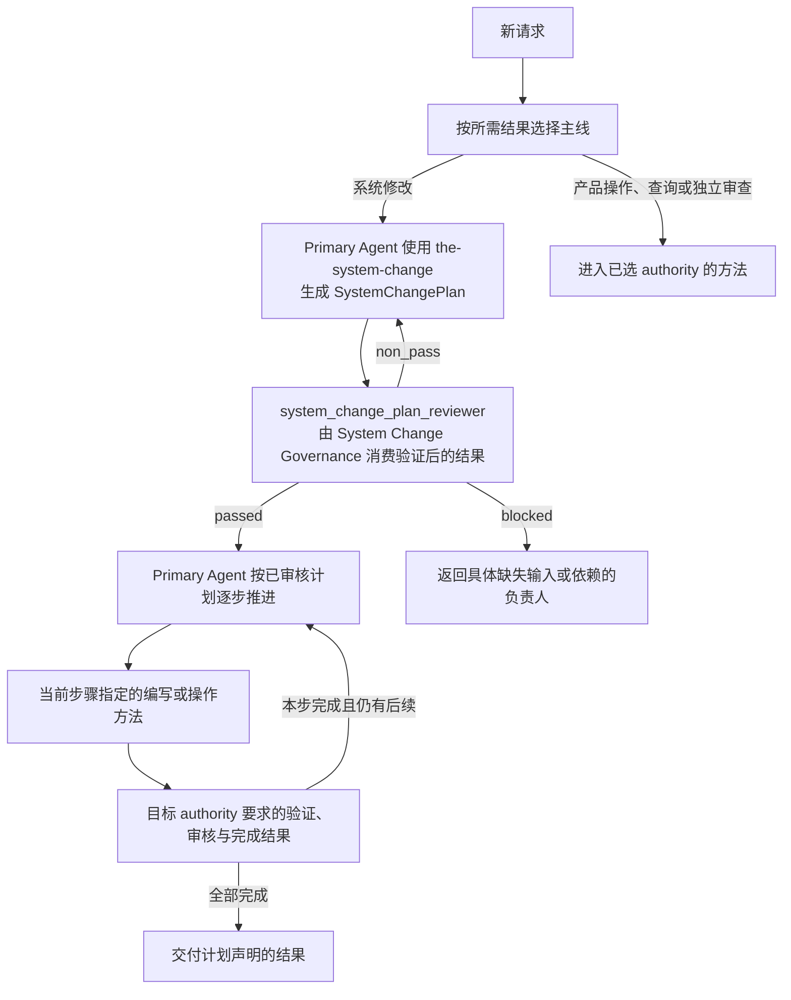

# 任务入口与工作交接

## 1. Task

帮助 Primary Agent 确定工作应该从哪里开始、交给谁，以及已有计划接下来应使用哪个方法。
新请求依据已准入的 Task Routing Registry 形成 `RoutingDecision`；已经进入计划的工作，依据精确的
已审核 `SystemChangePlan` 定位当前步骤，不重新生成顶层路由。

本 Skill 是 Primary Agent 直接读取的路由方法，不需要独立 managed prompt 或 Runtime Module。
它说明如何交接；计划编写、候选编写、独立审核和执行由相应方法承担。

## 2. Reader Gain

Primary Agent 使用本 Skill 后能够：

- 按用户所需结果选择系统变更、产品操作、查询或独立审查的入口，而不是根据出现的文件名或模型名猜测；
- 知道 `system_change_intake` 后应使用 `the-system-change`，计划经 `system_change_plan_reviewer`
  审核通过后由 Primary Agent 接着执行；
- 从已审核计划取得下一步的负责人、方法、输入依赖和完成条件，并找到对应 authority；
- 区分需要修候选、修计划、修执行依赖还是重新判断任务归属，避免每次失败都改选一个相近 Skill。

## 3. Entry and Exit

### 3.1 Entry

新的受治理修改必须进入本 Skill，即使用户已经明确负责人、文件或希望使用的方法。其他新请求的
主线或逻辑负责人尚不明确，或 Primary Agent 需要确认已审核计划如何交接时，也进入本 Skill。
先区分这是新请求，还是已经审核通过的计划中尚未完成的工作。用户说“继续”本身不产生新请求。

对同一请求，若已完成正式路由或正在执行有效的已审核计划步骤，且无需澄清入口或交接，就不再
进入本 Skill，直接使用已确定的 authority 或计划步骤。用户提出新的受治理修改时仍按新请求处理。

新请求的正式分类必须取得精确请求和已准入 Registry release。已知计划的后续交接直接引用计划步骤；
本 Skill 不把“指出下一步”写成重新编写或审核计划。

### 3.2 Exit

新请求使用 Task Routing 已定义的结果：

| 结果 | 何时返回 | 下一步 |
| --- | --- | --- |
| `routed` | 唯一 active 主线匹配所需结果，负责人及同一 row 声明的首份 authority 均可解析 | Primary Agent 读取该负责人的首份 authority，进入对应方法 |
| `clarification_required` | 多个 active 候选会产生实质不同的结果，请求不足以区分 | 提出一个足以区分结果的澄清问题 |
| `no_matching_route` | 没有 active 主线匹配所需结果 | 返回无匹配结果；不得选择相近主线或执行入口 |
| `request_contract_invalid` | 精确请求缺少必要结构或无效 | 返回请求提供方修正输入 |
| `routing_registry_unavailable` | Registry release 缺失、无效、冲突或无法验证；或其声明的负责人、首份 authority 引用缺失、冲突或不可解析 | 返回项目 Task Routing Registry owner |

计划续办时，指出已审核计划中的当前步骤及其所属 authority 后结束。若找不到需要的步骤、方法
或前置结果，把具体缺口交给 Primary Agent，按第 6.4 节返回真实负责人；不创造新的路由结果类别。

## 4. Execution Contract

### 4.1 Inputs and Authority

新请求需要：

1. 精确请求及其引用，包括用户所需结果和明确授权范围；
2. 已准入的 Task Routing Registry release，以及由代码提供的身份、hash 和有效性证据；
3. 请求显式提供的相关 context 引用。

计划续办需要精确的已审核 `SystemChangePlan`、当前步骤和已取得的前置结果证据。无需仅为查看
既有步骤重新分类请求或另建计划。

`designDoc/the_task_routing.md` 定义路由语义和 T0 工作导航；Registry 提供实际可选主线、负责人及
首份 authority；`SystemChangePlan` 提供本次具体步骤；目标 authority 定义方法与完成条件。
代码生成的 inspection 说明当前绑定是否存在、验证是否执行及其结果。文档中的要求不能证明实现已经可用。

本 Skill 不把数据库权限作为语义候选过滤条件。只有下游工作确需数据库访问时，调用方才按
Product Authorization 的规则取得访问决定；它不改变任务的逻辑归属。

### 4.2 Output and Completion

新请求成功时，`RoutingDecision` 必须绑定精确请求、Registry release、唯一主线与负责人、同一所选
Registry row 声明的首份 governing authority 引用、已登记的所需结果含义和选择理由。引用和 hash
由代码解析或生成，字段与序列化遵守项目已绑定的 schema，
本 Skill 不手写第二份输出 schema，也不编造不可取得的 release 或验证结果。

输出必须使 Primary Agent 能从 Registry 所指向的首份 authority 开始工作。路由完成不等于下游已经
执行，也不表示 Reviewer、Runtime 或数据库已经可用。

计划续办的交接说明引用已有步骤，并指出其负责人、方法、必需输入、完成条件和结果返回处；这些
内容从计划与目标 authority 取得，不作为新增字段塞进 `RoutingDecision`。

## 5. Boundaries

| 职责边界 | 可观察的越界表现 |
| --- | --- |
| 新请求归属由 Task Routing 判断 | 从模型、目录、文件名或现成工具反推主线，跳过用户所需结果 |
| 本次具体步骤由 System Change Governance 规划 | 路由时直接列出要修改的文件、设计方案或实现步骤，替代 `SystemChangePlan` |
| 通用工作导航引用既有 authority | 把导航表当成正式 Registry，或用它覆盖计划和目标 authority 的方法 |
| Primary Agent 负责推进已审核计划 | 本 Skill 执行候选编写、审核、注册或发布，或另建一个持续监督角色 |
| 候选、计划和执行失败分别返回真实负责人 | 把任何失败都重新分类，或以相近 Skill、Reviewer、模型替代不可用的方法 |
| 语义路由与执行配置、数据库权限分开 | `RoutingDecision` 包含 provider、Profile、Runtime target、credential 或访问许可 |
| 机器事实来自代码 | 仅凭本 Skill 或 Design Doc 的文字宣称 Registry 已准入、binding 可用或检查通过 |

## 6. Method

### 6.1 先判断用户要取得什么结果

文件、Skill、Theme、Source、模型和界面名称可以帮助定位背景，但不能独自决定主线。
例如，“审查这份 Skill”需要独立审查结果；“修改这份 Skill”需要系统变更；“继续已经审核的 Skill
修改计划”需要执行既有步骤。三者不会因为都出现 Skill 名称而进入同一个入口。

受治理面的修改先进入 `system_change_intake`。只读审查按被审对象进入其 authority 所属的已注册
审查主线；产品操作和查询按其所需结果选择项目主线。改变数据写入规则与按既有规则执行写入，
应按 Registry 声明的所需结果区分，不能把每次产品数据写入都重新解释为系统设计变更。

### 6.2 在真实 Registry 中判断，不用导航表替代

只比较所给 Registry release 的 active rows，结合它们声明的匹配、排除与歧义边界判断。
先用代码处理能够确定检查的身份、引用和结构事实；剩余语义判断由 Primary Agent 完成，或调用
项目明确绑定的分类能力。代码的字段检查不能证明语义归属正确。

缺少有效 Registry 时，返回 `routing_registry_unavailable`。可以解释 T0 的通用工作关系，但不能将
这段解释称为正式 `RoutingDecision`。Registry 与导航引用冲突时返回对应 owner，不静默挑选一版。

### 6.3 从入口交给具体方法

依据 `designDoc/the_task_routing.md` 第 1.2 节，使用以下对应关系理解计划；它们不构成项目主线注册：

| 当前步骤的结果 | 编写或操作方法 | 判断结果的 authority 与既有审核入口 |
| --- | --- | --- |
| Design candidate | `the-design-authoring` | DDM：适用的 `design_contract_reviewer` 及 Design owner 决策 |
| Skill candidate | `the-skill-authoring` | Skill Management：`skill_candidate_reviewer`；承载 Reviewer prompt 时，Skill 审核通过后还需 Review Contract 所属的 `reviewer_reviewer` |
| Reviewer prompt candidate | `the-review-authoring` | Review Contract：`reviewer_reviewer`；承载 Skill 仍按 Skill Management 规则审核 |
| Code Design 与代码实现 | `engineering-code-design`，随后交实现负责人 | Software Delivery：设计批准、代码验证与 `engineering_change_reviewer` |
| Module 或 Workflow 注册 | 项目绑定的 Runtime registration 方法 | Agent Runtime：注册校验与准入规则 |
| 发布、投影、部署或回滚 | 项目绑定的交付或操作方法 | Software Delivery 及目标面的所属 authority |

实际使用哪一行、需要修改哪些对象以及依赖顺序，由已审核 `SystemChangePlan` 指定。Reviewer 的
判断标准来自目标 authority，通用规则来自 Review Contract，执行来自 Runtime。导航不选择模型或
执行配置，也不暗示列出的 Module 已在当前项目注册。

### 6.4 失败时回到拥有问题的地方

- 候选没有满足本步标准：交给本步负责人修订，保留正确的计划与路由。
- 计划漏项、选错方法或依赖顺序已变化：由 Primary Agent 重新进入 `the-system-change`。
- Reviewer 或操作绑定不可用：交给对应 registration、execution 或操作 owner，不换主线。
- 原请求的逻辑负责人确实选错：把 wrong-owner evidence 返回 Task Routing Registry owner；重新路由
  时使用符合 T0 要求的新请求或新 Registry release，不改写旧 `RoutingDecision`。
- 用户要求的是新结果：先判断新请求归属，不沿用旧计划假装它已覆盖。

本 Skill 指明交接后结束。步骤执行与结果跟进留给 Primary Agent 和该步骤负责人。
