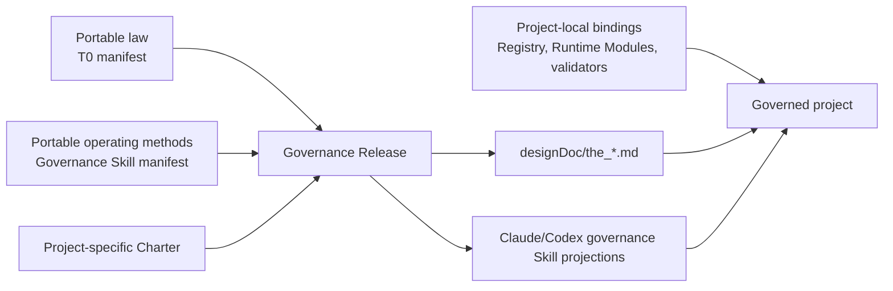

# Hoveath Governance Foundation

`09_soul/governance/` is the portable upstream for the complete T0 governance
system that Hoveath installs into a project. It carries reusable governance
intent, scaffolds, and deterministic release rules. The Charter is instantiated
for the target project during deployment; Hoveath does not impose one product's
Charter on another project.

## Deployment model



The reusable governance rules are reviewed when they change in Hoveath. A
project installation does not reclassify every T0 as product-specific and does
not create an aggregate governance-bundle review or announcement.
Project deployment generates the project Charter and performs deterministic
compatibility, projection, and enforcement checks.

Each released `the_*.md` file is portable law only. It may name logical
Registry, validator, inspection, and enforcement surfaces, but it must not
embed a consuming project's `src/`, test, temporary-review, repository, or
deployment paths. Project-local implementation truth stays in code-owned
registries and generated inspections. The project Charter states which parts
of the portable law are product-owned, externally enforced, or inapplicable.

## Boundary

Hoveath owns:

- reusable top-level governance intent;
- the complete reusable T0 baseline and scaffold used to instantiate a
  project's T0 system;
- projection and drift-checking rules shared across projects;
- portable authoring and review methods for design, code, Skill, data, Runtime,
  and software-delivery changes.

Each project owns:

- its product Charter;
- its instantiated T0 release as governed by that Charter;
- local T0 Registry bindings and Code Projections;
- product and domain specializations;
- implementation, deployment, and current operational state.

This is the Design Intent / Code Projection split at T0: Hoveath fixes the
portable law; local code and generated inspection fix the current facts. A
project does not edit portable law to make its present implementation look
complete.

## Release rule

Deploy `09_soul` first. Then generate the project-specific Charter and release
the full project T0 system from the installed Hoveath governance foundation.
A portable governance change is corrected upstream and re-projected; it is not
independently rewritten inside every consuming project.

Hash and compatibility checks prevent drift. They are mechanical deployment
checks, not a second semantic approval system.

## Three governed dimensions

The Governance Release keeps three dimensions distinct:

1. **Portable law**: `governance_t0_manifest.json` releases the reusable T0
   Design Intent into the project's `designDoc/the_*.md` authority surface.
2. **Portable operating methods**: `governance_skill_manifest.json` releases
   the Primary Agent methods used to route, design, author, and review governed
   changes. These Skills implement the law but do not become a second authority.
3. **Project-local bindings**: local Registries, validators, Runtime Modules,
   provider profiles, Skill binding addenda, and generated inspections state
   how the project currently enforces the installed law and methods.

One dimension may refer to another through typed IDs and hashes. They are never
flattened into one peer list: a Design Contract is not a Skill, a Skill is not
a Runtime Module, and a current implementation binding is not portable law.

The first portable governance method release contains:

| Skill | Entry role | Responsibility |
| --- | --- | --- |
| `the-task-routing` | routing | Select one authorized semantic mainline |
| `the-skill-management` | authoring | Author and govern one Skill candidate |
| `the-contract-audit` | review | Review one immutable contract subject |
| `engineering-code-design` | authoring | Freeze a reviewable Code Design Basis before implementation |
| `engineering-change-review` | review | Judge one frozen as-built engineering candidate |

`agent-runtime-registration` remains an Agent Runtime operator capability, and
`support-session-handoff` remains a session-support capability. They are not
silently promoted into this governance method release merely because the
current project routes to them.

## Module boundary

```text
09_soul/governance/
  governance_t0_manifest.json       portable T0 source/target/hash declarations
  governance_t0_release.py          stdlib-only check and projection module
  governance_skill_manifest.json    portable governance Skill declarations
  governance_skill_release.py       stdlib-only host projection and drift check
  t0/                               portable T0 Design Intent sources
  skills/                            portable Primary Agent governance methods
  tests/                            module-local deterministic tests

<project>/
  designDoc/the_charter.md          project-specific Charter
  designDoc/the_*.md                released T0 Design Intent projections
  governance_bindings/              hash-bound project Skill binding addenda
  .claude/skills/                   Claude governance Skill projections
  .agents/skills/                   Codex governance Skill projections
  <project code>                    local Registry, Code Projection and enforcement
```

`governance_t0_release.py` owns only four behaviors:

1. parse and validate the portable manifest;
2. reject missing, hash-drifted, absolute, escaping, or duplicate paths;
3. reject a portable source that embeds project-local implementation paths and
   check whether a project's T0 law projections equal their Hoveath sources;
4. write exact projections when explicitly run in apply mode.

It does not author a Charter, run project-specific validators, edit a Registry,
select T0 meaning, or announce a release. The consuming project's adapter owns
those local actions and must supply a project-specific Charter before treating
the released files as a complete local T0 system.

`governance_skill_release.py` validates Skill identity, role, subject, T0
dependency closure, source hash, host target, and exact projection bytes. A
project may declare a hash-bound addendum in
`governance_bindings/governance_skill_binding_manifest.json`; the release
mechanically composes the portable method followed by that project binding.
This keeps a local Runtime Module ID or workflow entry out of portable Hoveath
while leaving both host projections reproducible. The addendum may explain
reachability and binding; it cannot duplicate the model-ready prompt or grant
execution authority.

The release module does not register product Skills, create Runtime Modules,
choose a provider, or copy project-local business instructions into Hoveath.

A Governance Release is mechanically clean only when both release modules
report clean. Their manifests remain separate because law and operating method
are separate governed objects.

`the_design_doc_management` was the first migration slice used to validate this
interface. The manifest now carries every reusable peer T0 contract; the
project-specific Charter remains outside it.
