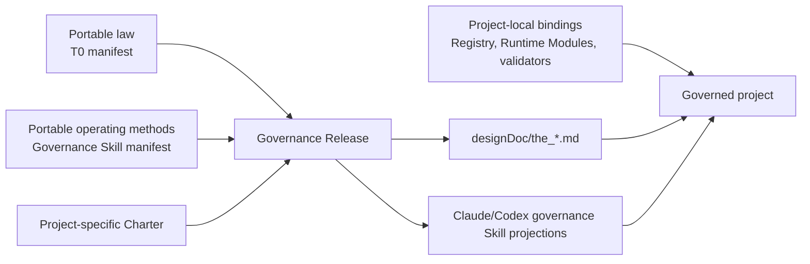

# Hoveath Governance Foundation

`09_soul/governance/` is the portable upstream for the complete T0 governance
system that Hoveath installs into a project. It carries reusable governance
intent, scaffolds, and deterministic release rules. The Charter is instantiated
for the target project during deployment; Hoveath does not impose one product's
Charter on another project.

## Deployment model



The reusable governance rules are reviewed when they change in Hoveath. A
project installation does not reclassify every T0 as product-specific and does
not create an aggregate governance-bundle review or announcement.
Project deployment generates the project Charter and performs deterministic
compatibility, projection, and enforcement checks.

Each released `the_*.md` file is portable law only. It may name logical
Registry, validator, inspection, and enforcement surfaces, but it must not
embed a consuming project's `src/`, test, temporary-review, repository, or
deployment paths. Project-local implementation truth stays in code-owned
registries and generated inspections. The project Charter states which parts
of the portable law are product-owned, externally enforced, or inapplicable.

## Boundary

Hoveath owns:

- reusable top-level governance intent;
- the complete reusable T0 baseline and scaffold used to instantiate a
  project's T0 system;
- projection and drift-checking rules shared across projects;
- portable authoring and review methods for design, code, Skill, data, Runtime,
  and software-delivery changes.

Each project owns:

- its product Charter;
- its instantiated T0 release as governed by that Charter;
- local T0 Registry bindings and Code Projections;
- product and domain specializations;
- implementation, deployment, and current operational state.

This is the Design Intent / Code Projection split at T0: Hoveath fixes the
portable law; local code and generated inspection fix the current facts. A
project does not edit portable law to make its present implementation look
complete.

## Release rule

Deploy `09_soul` first. Then the project adapter generates or supplies the
project-specific Charter before the release tool projects the full project T0
system from the installed Hoveath governance foundation. The portable release
tool validates and projects; it never authors the Charter.
A portable governance change is corrected upstream and re-projected; it is not
independently rewritten inside every consuming project.

Hash and compatibility checks prevent drift. They are mechanical deployment
checks, not a second semantic approval system.

Fresh-install order is fixed: the project adapter supplies the Charter, the T0
release applies and validates `designDoc/the_*.md`, then the Skill release
applies and validates host projections whose `first_authority_ref` now resolves.

### Governance 部署与首次系统修改

Portable Governance 的部署与项目第一次正式发起 governed system change 是两个阶段：

```text
部署 Portable Governance
  → 提供 project-specific Charter
  → 投影并校验 Portable T0
  → 投影并校验 Governance Skills
  → 部署完成

项目之后正式发起 governed system change
  → 项目的 code-owned Task Routing Registry 解析请求
  → system_change_intake
  → the-system-change 生成 SystemChangePlan
  → system_change_plan_reviewer 审核 exact frozen plan
```

部署流程不调用 Task Routing 或 `the-system-change`，因此项目尚未建立 Task Routing Registry
不构成 Portable Governance 部署缺陷，也不阻止 T0 与 Skills 完成部署。只有项目之后正式使用
Task Routing 时，才要求项目自己的 admitted Registry release。Registry 缺失、无效或无法验证时，
`the-task-routing` 返回 `routing_registry_unavailable`；该缺口属于目标项目的 Task Routing T1/T2
及其代码绑定，不属于 Portable T0。

因此，每个目标项目在正式使用 Task Routing 或发起 governed system change 之前，都必须建立、
验证并准入自己的 code-owned Task Routing Registry release。这是部署完成后的项目能力前置条件，
不是 Portable Governance 的部署步骤或部署通过条件。

Registry 建成前，项目可以形成探索性分析或本地 basis，但不得把它表述为已经路由、已经审核或
可以执行的正式 `SystemChangePlan`。修复该项目缺口也不得原位修改已经冻结的 Portable T0 release。

Universal leakage guards reject user paths, temporary Design paths,
implementation source and test paths, and virtual-environment paths. Each
project adapter may add product or repository identities through
`governance_bindings/governance_release_policy.json`; portable release code
does not hard-code one consuming project's name.

## Three governed dimensions

The Governance Release keeps three dimensions distinct:

1. **Portable law**: `governance_t0_manifest.json` releases the reusable T0
   Design Intent into the project's `designDoc/the_*.md` authority surface.
2. **Portable operating methods**: `governance_skill_manifest.json` releases
   the Primary Agent methods used to route, design, author, and review governed
   changes. These Skills implement the law but do not become a second authority.
3. **Project-local bindings**: local Registries, validators, Runtime Modules,
   provider profiles, Skill binding addenda, and generated inspections state
   how the project currently enforces the installed law and methods.

One dimension may refer to another through typed IDs and hashes. They are never
flattened into one peer list: a Design Contract is not a Skill, a Skill is not
a Runtime Module, and a current implementation binding is not portable law.

The portable governance method release contains:

| Skill | Entry role | Responsibility |
| --- | --- | --- |
| `the-task-routing` | routing | Select one authorized semantic mainline |
| `the-system-change` | authoring | Author and advance one System Change Case without taking subject authority |
| `the-design-authoring` | authoring | Author one Charter, T0, T1, or T2 Design Intent candidate for independent review |
| `the-skill-authoring` | authoring | Author one exact Skill candidate after validating the Skill Work Package |
| `the-review-authoring` | authoring | Author one complete Reviewer prompt source for its owning Design authority and independent execution |
| `engineering-code-design` | authoring | Freeze a reviewable Code Design Basis before implementation |
| `engineering-change-review` | review | Judge one frozen as-built engineering candidate |

`agent-runtime-registration` remains an Agent Runtime operator capability, and
`support-session-handoff` remains a session-support capability. Software
release, deployment, rollback, roll-forward, retirement admission, and their
terminal evidence remain a project-supplied Software Delivery capability.
Written-subject Reviewer Modules perform prose and communication review only
after semantic review passes; their registered output records `passed` or
`not_run` without introducing a separate Review authority.
These capabilities are not silently promoted into this governance method
release merely because the current project routes to them. A consuming project
must bind and verify them before a System Change Case that requires those
Work Packages may close.

The default Work Package method map is:

| Work Package kind | Portable method or declared external capability |
| --- | --- |
| Charter amendment | `the-design-authoring`, then the registered Design reviewer, plus the accountable Charter decision |
| Design Intent | `the-design-authoring`, then the registered Design reviewer |
| Skill | `the-skill-authoring`, then its registered independent reviewer |
| Engineering implementation | `engineering-code-design` followed by the implementation owner |
| Independent Engineering Review | `engineering-change-review` and its registered Runtime Module |
| Structural Design change | `the-design-authoring`, then `design_contract_reviewer` with the accountable parent and complete peer context |
| Governance Release install or upgrade | project adapter operator action: run T0 apply, then Skill apply, then inspect and remove only the exact reported retired roots; no portable authoring Skill |
| Agency Platform, Product Authorization, Artifact Graph, Data, Timestamp, or Audit policy | `the-design-authoring`; add Engineering methods only when code, schema, migration, or tests change |
| Runtime registration | project-supplied Agent Runtime registration capability |
| Release, deployment, rollback, roll-forward, or retirement | project-supplied Software Delivery capability |

The complete `09_soul` distribution is installed before the Governance
Release. Governance Skills may depend on stable Soul resources such as A14,
A21, `COMMUNICATION`, and `bestpractice_skill_writing`. When a Skill or Reviewer
must carry selected model-facing instructions by value, the Skill manifest
declares one read-only `instruction_resources` selector and the consuming
`package_files[]` row names it through `embedded_resource_ids`. The release
compiler replaces only the declared marker body and checks byte-exact parity;
it does not create another authority source. Project-specific communication
detail belongs in the project adapter rather than a second governance
contract.

## Module boundary

```text
09_soul/governance/
  governance_t0_manifest.json       portable T0 source/target/hash declarations
  governance_skill_manifest.json    portable governance Skill declarations
  t0/                               portable T0 Design Intent sources
    validation/
      t0_release.py                 stdlib-only T0 check and projection module
      skill_release.py              stdlib-only Skill projection and drift check
      artifact_contracts/           T0-owned Design and Skill artifact validators
      tests/                        portable T0 validation tests
  skills/                            portable Primary Agent governance methods

<project>/
  designDoc/the_charter.md          project-specific Charter
  designDoc/the_*.md                released T0 Design Intent projections
  governance_bindings/              hash-bound project Skill binding addenda
  .claude/skills/                   Claude governance Skill projections
  .agents/skills/                   Codex governance Skill projections
  <project code>                    local Registry, Code Projection and enforcement
```

`t0/validation/t0_release.py` owns only the portable T0 release mechanics:

1. parse and validate the portable manifest;
2. reject missing, hash-drifted, absolute, escaping, or duplicate paths;
3. reject a portable source that embeds project-local implementation paths and
   check whether a project's T0 law projections equal their Hoveath sources;
4. validate active and retired T0 reference closure in portable sources and the
   project Charter;
5. report undeclared, retired, missing, or drifted source and target members;
6. write exact projections when explicitly run in apply mode.

It does not author a Charter, run project-specific validators, edit a Registry,
select T0 meaning, or announce a release. The consuming project's adapter owns
those local actions and must supply a project-specific Charter before treating
the released files as a complete local T0 system.

`t0/validation/skill_release.py` validates Skill identity, role, subject, T0
dependency closure, instruction-resource selectors and hashes, every declared
package-file hash, embedded marker closure, host target, and exact projection
bytes. `SKILL.md` projects to both Primary Agent hosts. A portable
governance Runtime Module may additionally release its fixed prompt, semantic
schemas, and provider-neutral Module registration under the canonical Claude
Skill Package surface; those files remain part of the same portable package,
not project-local copies. A project may declare a hash-bound addendum in
`governance_bindings/governance_skill_binding_manifest.json`; the release
mechanically composes the portable method followed by that project binding.
This keeps a local Runtime Module ID or workflow entry out of portable Hoveath
while leaving both host projections reproducible. The addendum may explain
reachability and binding; it cannot duplicate the model-ready prompt or grant
execution authority. A new or materially changed addendum enters a Skill Work
Package and receives the registered `skill_candidate_reviewer` judgment before
its hash enters the binding manifest; an approved bootstrap review records its
limitation and successor cross-review obligation.

`governance_bindings/governance_release_policy.json` uses
`governance_release_policy_v3`. Every project policy supplies three arrays:
`forbidden_source_fragments`, `retired_t0_targets`, and
`project_specific_t0_targets`. The last array explicitly registers project-owned
`designDoc/the_*.md` surfaces that remain discoverable without becoming portable
T0 projections. Existing installations add the field with an empty array when
they have no project-specific target.

Shared-instruction projection follows one fixed flow:

```text
canonical source
  → selector + selected-byte hash validation
  → pure package-file composition (no write)
  → Skill authoring/review/acceptance outside the compiler
  → accepted full-file hash + embedded parity validation
  → check report or declared host-projection apply
```

`--check` reports `governance_skill_embedded_block_drift` for an accepted
consumer whose embedded bytes differ from its canonical selection, and reports
`governance_skill_projection_drift` when a host projection differs from the
validated projection payload. `--apply` fails before writing any projection if
embedded parity is not already satisfied. It writes only declared host
projections; it never rewrites portable Skill sources or the manifest.

Selector or selected-hash failures return
`GOVERNANCE_SKILL_INSTRUCTION_RESOURCE_INVALID`. Invalid or overlapping target
markers, undeclared resources, dependency-closure violations, and apply-time
embedded drift return `GOVERNANCE_SKILL_EMBEDDED_RESOURCE_INVALID`. Existing
source-closure and atomic projection-write failures retain their existing
stable error codes.

The release module does not register product Skills, admit Runtime releases,
choose a provider, or copy project-local business instructions into Hoveath.
Workflow topology, authorization, Execution Profiles, release versions, Code
Projections, and data-store admission remain consuming-project bindings.

In a Module registration, `skill_package_owner_contract_path` names the
contract that owns the Skill entry and subject lifecycle;
`module_owner_contract_path` names the contract that owns the Module's
semantic method. They may differ. Each Reviewer Module lives in the Skill
Package that belongs to its target Design authority: Design review under
`the-design-authoring`, Skill review under `the-skill-authoring`, System Change
Plan review under `the-system-change`, and Engineering review under
`engineering-change-review`. Review Contract's own prompt reviewer lives under
`the-review-authoring` as `reviewer_reviewer`. Review Contract supplies only the byte-exact
universal Reviewer rules and Reviewer-prompt authoring contract; it does not
take ownership of those subject-specific review methods.

A Governance Release is mechanically clean only when both release modules
report clean. Their manifests remain separate because law and operating method
are separate governed objects.

The Skill release apply mode is intentionally non-destructive: it writes only
declared projections. The project adapter handles findings by code:

- `governance_skill_retired_projection_present` and
  `governance_skill_undeclared_package_member` require inspection and removal of
  only the exact reported obsolete path;
- `governance_skill_retired_projection_reference` identifies an active,
  project-owned Skill that still names a retired identity. It returns to that
  Skill's owner through a Skill Work Package for reference migration. The
  adapter must not delete the referencing Skill;
- `governance_skill_undeclared_source_member` and
  `governance_skill_undeclared_source_directory` identify drift inside the
  installed portable source package. They return to the Governance Release
  owner for source/manifest correction rather than project-owned path deletion.

This separation prevents an automatic projector from deleting user-owned files
merely because a manifest or referenced identity changed.

Independent release review evaluates the project Charter, complete portable T0
set, complete portable governance Skill set, both manifests, release tools,
and deterministic evidence as one layered package. T0 contracts remain peers;
Skills remain operating-method projections and never enter the T0 peer table.

The manifest carries every reusable peer T0 contract; the project-specific
Charter remains outside it.
