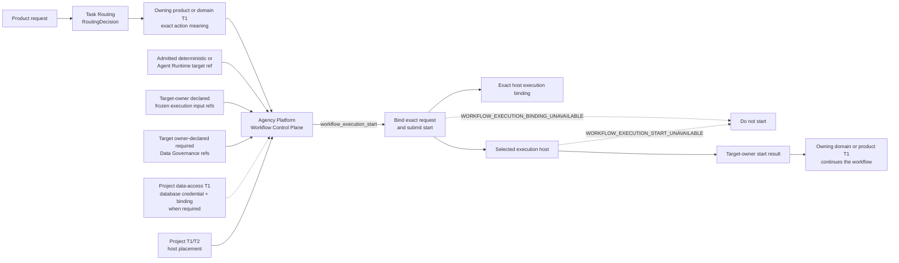

# Agency Platform 组合合同（Agency Platform Composition Contract）

本文只冻结 Agency Platform 的 portable 顶层语义：它把项目入口、共享平台服务、受控执行环境和
所属领域组合为一个产品，并通过 Workflow Control Plane 启动已经完成语义路由且已有执行实现的工作。
需要 database access 的 target 由 target owner-declared input closure 声明该需求，Project data-access owner
据此注入 database credential 与 binding；Product Authorization 的 allow/deny 仍在实际 database operation
发生时由 project data-access adapter 消费。具体服务、接口字段、Registry、部署拓扑和运行状态由项目
T1/T2 Design 与代码持有。

## 0. Intent Capsule

```yaml
layer: T0
t0_layer_id: the_agency_platform
status: candidate
canonical_owner: designDoc/the_agency_platform.md
owned_system_object: enterprise product host and Workflow Control Plane
scope:
  - enterprise product host composition
  - six portable service planes and their authority boundary
  - Workflow Control Plane ownership and execution-start obligation
  - separation of product hosting, semantic authority, database authorization, routing, execution, and domain acceptance
  - project-host handoff to deterministic execution and Agent Runtime
non_goals:
  - product or domain Workflow meaning, transition law, quality judgment, or canonical write
  - Product Authorization or Task Routing decisions
  - Agent Runtime release, execution, recovery, lineage, or provider behavior
  - Data Asset, database access, database credential, SQL, retention, or migration semantics
  - project service inventory, Registry field, schema, validator, storage, deployment, or release state
  - SystemChangePlan, Reviewer instruction, Design review, or software release admission
inputs:
  - exact reviewed SystemChangePlan step for an Agency Platform Design change
  - task request and exact RoutingDecision
  - domain-owned action identity and admitted execution-target references
  - selected target owner-declared frozen execution input references
  - host placement and target owner-declared required Data Governance references
  - project data-access owner-injected database credential and binding when database access is required
outputs:
  - Agency Platform composition boundary
  - six-plane placement law
  - Workflow Control Plane execution-start law
  - project T1/T2 and code implementation handoff
truth_surfaces:
  - designDoc/the_agency_platform.md
runtime_triggers:
  - a routed action requires project-host execution
downstream_consumers:
  - project platform T1/T2 contracts
  - product and domain Workflow owners
  - Agent Runtime and deterministic execution clients
  - Software Delivery
open_decisions: []
review_gate: Design Doc Management 所属 Reviewer 对 exact candidate 的独立 Design review；Agency Platform owner 单独作出 owner decision
runtime_surface_ledger: code-owned project inspection renders current services, bindings, deployments, releases, and conformance evidence
verification_hooks:
  - service-plane placement and authority-boundary closure
  - routed action, admitted target, frozen execution input, host placement, target owner-declared data-reference, and applicable database-binding closure
  - hosting does not transfer peer or domain semantic authority
```

## 1. Primary System Flow



| `interface_id` | 所属方 | 输入 | 输出 | 影响 | 错误码 |
| --- | --- | --- | --- | --- | --- |
| `workflow_execution_start` | Agency Platform | Exact `RoutingDecision`、domain-owned action ref、admitted execution-target ref、target owner-declared frozen execution input refs、host placement、target owner-declared required Data Governance refs，以及 target-declared database access 适用时由 project data-access owner 注入的 database credential + binding | Exact host execution binding，加上 selected target owner 的 execution-start result；或明确拒绝 | 把本次 request 和全部 required input refs 绑定到 exact host 并提交 start；Agency Platform 的义务止于 target owner 接受或拒绝 start，或 Platform 明确返回 start unavailable。它不解析 database credential，也不创建 route、database permission、Workflow meaning、Runtime release、execution result meaning、domain acceptance 或 data authority | `WORKFLOW_EXECUTION_BINDING_UNAVAILABLE` / `WORKFLOW_EXECUTION_START_UNAVAILABLE`；selected target owner 的 typed start failure 保留其 owner 与 error identity，不在本 T0 重定义 |

| `error_code` | 所属方 | 触发条件 | 含义 | 调用方动作 |
| --- | --- | --- | --- | --- |
| `WORKFLOW_EXECUTION_BINDING_UNAVAILABLE` | Agency Platform | Routed action、admitted target、target owner-declared frozen execution input refs、host placement、target owner-declared required Data Governance refs，或 target-declared database access 所需的 database credential + binding 缺失、冲突或不能绑定同一次 exact request | Workflow Control Plane 在 binding 形成和 dispatch 之前停止 | 不启动；把缺失或冲突的 exact ref 返回真实 owner，不替换 target、不扩大 scope，也不创建临时执行路径 |
| `WORKFLOW_EXECUTION_START_UNAVAILABLE` | Agency Platform | Exact binding 已形成并提交给 selected target，但 target host 无法返回 owner-qualified accepted 或 rejected start result | Product host 无法确认 target owner 是否接受了本次 start；Agency Platform 的 start obligation 以明确失败结束 | 停止等待并返回 selected target 或 host-integration 的真实 owner；不得假定执行已开始、重复提交、切换 target 或创建临时路径 |

Target owner-declared input closure 决定一次 start 是否需要 database credential 与 binding；project
data-access owner 负责注入。Product Authorization 的 allow/deny 由 project data-access adapter 在实际
database operation 时消费，不进入 `workflow_execution_start`。Selected target 已经收到 start 后产生的
accepted、rejected、resolved output 或 typed failure 继续属于 target owner；Agency Platform 只保留并
传递 owner-qualified result。
`WORKFLOW_EXECUTION_START_UNAVAILABLE` 只说明 product host 未取得 start result，不重新解释 selected target
是否执行、失败或需要 recovery。

## 2. User Intent

项目需要一个稳定的产品宿主，把入口、路由、执行、数据服务和结果交付组合起来，同时保持
每一项语义仍由其真正 owner 决定。Agency Platform 提供这个组合边界和 Workflow Control Plane，
使产品可以启动已经登记并具备 admitted implementation 的工作。需要 database access 时，Platform
只按 target-declared input closure 携带 project 注入的 credential 与 binding；实际 operation 的 allow/deny
留给 project data-access adapter。Hosting 不会因此取得领域、权限、数据或 Runtime 的所有权。

## 3. Reader Gain

- Product Architect 能判断一项能力属于 product host、领域 Workflow、Agent Runtime、Data Governance
  还是其他 peer T0，不再因服务被 Platform 承载而改变 owner。
- Platform Architect 能把项目服务放入稳定 plane，并判断一次 routed action 是否已经具备完整 host
  execution binding。
- Domain Workflow Owner 能保留 action meaning、transition、quality 和 acceptance authority，只向
  Workflow Control Plane 提供稳定 action identity 与执行需求。
- Runtime Maintainer 能看出 Agency Platform 只消费并携带 admitted Runtime target ref；Runtime 自己
  继续拥有 release admission、execution、recovery 和 lineage。

## 4. Owned System Object

本 T0 只拥有一个 system object：`enterprise product host and Workflow Control Plane`。

它包含两项不可分割的顶层责任：定义产品服务如何组合和放置，以及把一个已经完成语义路由的 action
解析为精确的 product-host execution binding。它不拥有 action 的业务含义、database permission、
执行实现、数据内容或最终领域判断。

## 5. Authority

只有 Agency Platform 可以定义：

1. portable product host 的 service-plane taxonomy；
2. hosted service 与 semantic owner 分离的组合规则；
3. Workflow Control Plane 的 product-host binding 与 execution-start responsibility；
4. routed action、admitted execution target、target owner-declared frozen input refs、host placement、data
   reference，以及 target-declared database access 适用时的 opaque database credential + binding 如何形成
   一个一致的 host execution binding；
5. Platform 在 deterministic execution、Agent Runtime 和 owning domain 之间承担的交接边界。

Agency Platform 不决定：

- action 应路由到哪个 owner；
- caller 是否有权访问 database；
- Workflow 或 Module 是否获得 Runtime admission；
- domain operation、state transition、quality gate 或 canonical write 的含义；
- Data Asset、database access、database credential、SQL、retention 或 migration law；
- software 是否可以发布或部署。

## 6. Product Host Composition

### 6.1 Hosting and semantic ownership

Agency Platform 可以承载 peer T0 和 domain service 的实现，但 hosting 只提供 product composition、
placement 和 enforcement location。一个 service 被放入 Platform，不会让 Platform 取得该 service
记录、决定或业务对象的 semantic authority。

Routing、database authorization、binding、execution 和 domain acceptance 是五个不同结果。任何
一个结果成功，都不能替代另一个 owner 的决定。

### 6.2 Six service planes

六个 plane 是 portable placement view，只回答一项服务在 product composition 中放在哪里。它们不
表达业务流程顺序、authority rank、具体网络结构或 deployment product。

| Plane | 顶层职责 | 明确不拥有 |
| --- | --- | --- |
| Access and Delivery | product entry、request transport、result delivery 和 human interaction | identity state、database permission、route、domain judgment 或 delivered record meaning |
| Product Control | product-level coordination、Workflow Control Plane、placement 和 shared control service hosting | domain content、Runtime execution、Data Asset meaning 或 commercial judgment |
| Execution Cell | admitted deterministic execution、Agent Runtime 和 domain implementation 的隔离运行环境 | product policy、cross-scope authority 或 domain acceptance |
| Controlled Integration | bounded model、tool、search、connector、event 和 external side-effect gateway | route selection、domain truth 或 unrestricted access |
| Cell Data | project-configured persistence、query、dereference 和 recovery implementation | stored object meaning、writer authority、database permission 或 Runtime lineage |
| Trust and Operations | workload trust、clock health、reliability 和 incident operation | database authorization、database credential、domain content 或 canonical decision |

Project T1/T2 可以把这些 plane 映射到具体 service、network、store、deployment zone 和 recovery unit，
但不能建立第二套竞争性的 plane taxonomy。

### 6.3 Workflow Control Plane

Workflow Control Plane 消费 Task Routing 已选择的 exact action owner 和 domain-owned action identity。
Project/domain authority 通过 code-owned project registration 提供该 action 的稳定 identity 与执行
需求。Agency Platform 不从文件名、目录、prompt 或当前工作树推断 action identity。

一个 binding 只能引用已经 admitted 的 execution target。该 target 由 owning product/domain T1 的
code-owned action registration 提供，Agency Platform 只验证并消费 exact ref，不选择或准入 target。
该 target 可以是 deterministic execution，
也可以是 Agent Runtime 的 Workflow 或允许直接执行的 Module。直接 Module 不需要为了满足 host 而
包装成 synthetic one-step Workflow。具体 target kind、release fields、entry policy、schema 和
validation 由 execution owner 的 T1/T2 Design 与代码定义，本 T0 不复制。

Host binding 只说明本次 product request 将由哪个 admitted target、在哪个 placement、携带哪些 target
owner-declared frozen input refs 和 target owner-declared required Data Governance refs，以及 target 声明需要 database access 时携带哪个 project
注入的 database credential + binding 执行。Agency Platform 只 opaque carry database credential，不解析、签发、
刷新、持久保管或扩大它。Host binding 不是第二份 Workflow registration，不授予 database permission，
也不创建 Runtime lineage 或 domain acceptance。

Workflow Control Plane 在 binding 闭合后把 exact binding 与 execution start 交给 selected target。
Agency Platform 的 start obligation 在 target owner 接受或拒绝 start，或 Platform 明确返回
`WORKFLOW_EXECUTION_START_UNAVAILABLE` 时完成；后续 execution、resolved output、typed failure、
recovery 和 domain acceptance 继续由 target owner 与 owning workflow 决定。

### 6.4 Project delegation

Project T1/T2 拥有具体 product API、Identity and Session、tenant service、notification、metering、
quota、billing handoff、service catalog、Workflow registration、Cell layout、integration gateway、
data-service composition、support operation 和 deployment topology。

Owning product/domain T1 拥有 action meaning、workflow graph、state、quality rule、human gate 和
terminal outcome。Agent Runtime T1/T2 拥有 Runtime release、execution、recovery、inspection 和
provider adapter。Data Governance 的 project specialization 拥有 DataAccessAdapter implementation、
database binding 和 domain data-service handoff。

### 6.5 Machine-enforcement result

代码必须能够登记并验证当前 Platform service placement 和 host execution binding，并生成只读
inspection。Validator 必须证明 binding 中的 action、admitted target、target owner-declared frozen input
refs、placement、target owner-declared required Data Governance refs，以及 target-declared database access 适用时的 opaque database
credential + binding 都绑定同一次 exact request；任何缺失或冲突都在 binding 形成与 dispatch 之前
fail closed。

具体 Registry、record family、field、hash、schema、validator path、store 和 inspection layout 都是
code-owned implementation。它们不进入本 T0，也不能反向定义 Agency Platform 的 Design authority。

## 7. System-wide Invariants

1. Hosting 不转移 semantic authority。
2. 每个 product action 只有一个 owning product 或 domain authority；Agency Platform 只消费其 exact
   identity 和执行需求。
3. Workflow Control Plane 只在 route、admitted target、target owner-declared frozen input refs、placement、
   target owner-declared required Data Governance refs，以及 target-declared database access 适用时的 opaque database credential + binding
   都绑定同一次 exact request 后形成 execution binding 并提交 start。
4. Host binding 不创建 route、database permission、Workflow/Module release、Runtime lineage、data
   authority 或 domain acceptance。
5. Deterministic、Runtime Workflow 和 direct Runtime Module entry 使用同一 product-host binding 与
   placement 标准；需要 database access 时，它们还必须满足同一 database authorization 标准。Direct
   Module 不需要 synthetic Workflow。
6. Service plane 只表达 placement；它不能被用来推导 call order、authority rank 或业务 ownership。
7. Platform unavailable 时不得静默改用 session Agent、direct provider call、neighboring workflow、
   unrestricted database credential 或 alternate canonical writer。
8. Current service、binding、deployment 和 release status 只能来自 code-owned inspection，不能从本
   Design Doc 推断。
9. Project T1/T2 specialization 可以增加具体服务与约束，但不能重定义本 T0 的 plane、hosting 或
   Workflow Control Plane boundary。

## 8. Peer Boundaries

Project Charter 是本 T0 的 constitutional parent，不属于 same-level peer。下表只列 Agency Platform
形成 product-host composition 时发生直接 handoff 的 peer T0。

| Peer T0 | Agency Platform 消费或提供什么 | Boundary |
| --- | --- | --- |
| System Change Governance | 消费 exact reviewed `SystemChangePlan` step | System Change 决定 changed surfaces、顺序和 owner；Agency Platform 只决定本 T0 的 host composition meaning |
| Product Authorization | 提供 project administration 与 data-access adapter 的 product host；Workflow Control Plane 不消费 operation allow/deny | Product Authorization 只决定 user_key 对 database 的 read/write permission；allow/deny 由 project data-access adapter 在实际 operation 时消费，Platform 不把 permission 扩展为 action-level authorization |
| Task Routing | 消费 exact `RoutingDecision`；提供 product task-intake host | Task Routing 选择 semantic owner；Platform 不重新路由 |
| Agent Runtime | 消费 Runtime admitted target ref 与 target-declared input closure；向 Runtime 提供 product-host binding 和 execution start；消费 Runtime owner-qualified start result | Runtime 决定 release admission、required Runtime input、execution、output/failure meaning、recovery 和 lineage；Platform 生成 host binding，但不选择或准入 Runtime target，也不重定义 Runtime result |
| Data Governance | 消费 selected target owner 声明的 required Data Governance refs；通过其指定的 project data-access owner 接收 database credential + binding 注入；提供 project data-service host seam | Selected target owner 决定本次 execution 需要哪些 data refs；Data Governance 决定这些 Data Asset、database access 和 physical binding 的含义；project data-access owner 取得并注入 database credential；Platform 只携带，不解析或持久保管 credential，也不持有 domain SQL |
| Timestamp and Clock Semantics | 消费 Platform record 与 cross-service comparison 使用的 time semantics | Platform 不定义第二套 time-field 或 clock law |
| Design Doc Management | 消费 Agency Platform Design authoring、review 和 lifecycle law | DDM 管 Design artifact；Agency Platform owner 决定本合同的具体 meaning |
| Software Delivery | 提供 intended product-host composition 与 host placement constraints | Software Delivery 决定对应 implementation、release、deployment、rollback 和 retirement admission；domain acceptance 仍属于 owning workflow |

## 9. References

- [Project Charter](the_charter.md)
- [System Change Governance](the_system_change_governance.md)
- [Product Authorization](the_product_authorization.md)
- [Task Routing](the_task_routing.md)
- [Agent Runtime](the_agent_runtime.md)
- [Data Governance](the_data_governance.md)
- [Timestamp and Clock Semantics](the_timestamp_semantic.md)
- [Design Doc Management](the_design_doc_management.md)
- [Software Delivery](the_software_delivery.md)
