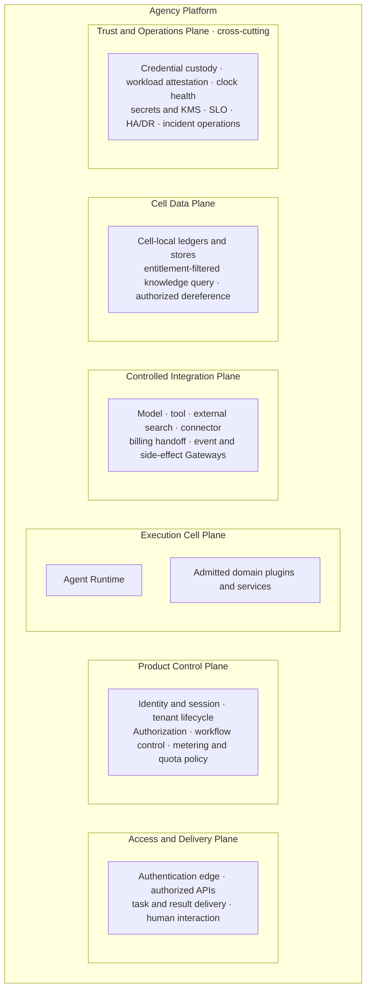
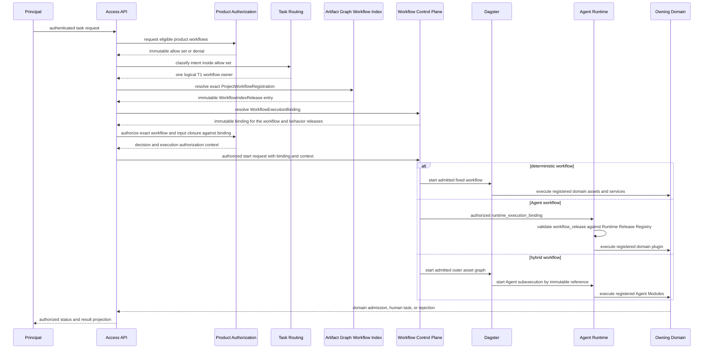
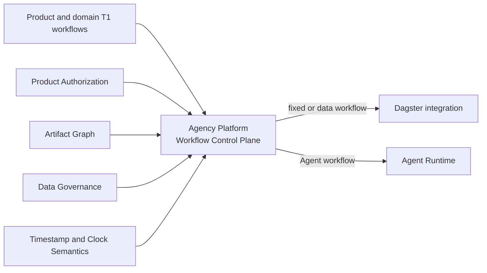

# Agency Platform Composition Contract

**Purpose**: Define the independently publishable enterprise Agency Platform as
the product composition around an independently publishable Agent Runtime,
place product services into six stable service planes, and keep placement,
semantic authority, and interaction sequence as separate architectural views.

**Required reader gain**: A reader can place a proposed service without
mistaking its host plane for its semantic owner, distinguish a product request
flow from authority delegation, and locate current implementation and delivery
status outside this T0 Design Intent contract.

## 0. Contract Capsule

```yaml
layer: T0
t0_layer_id: the_agency_platform
status: candidate
canonical_owner: designDoc/the_agency_platform.md
owned_system_object: enterprise product host and Workflow Control Plane
scope:
  - enterprise Agency Platform product composition
  - six stable service planes
  - shared Workflow Control Plane and execution-class binding
  - product-versus-Agent-Runtime boundary
  - separation of placement, semantic authority, and interaction views
  - host seams through which specialized T0 contracts are enforced
non_goals:
  - domain workflow graphs, Agent roles, writing behavior, or content-quality rubrics
  - Product Authorization policy language or Principal and Entitlement record schemas
  - Runtime record schemas, provider adapters, context mechanics, or workflow-engine behavior
  - current implementation inventory, evidence ledger, delivery horizon, or roadmap status
  - cloud-vendor, identity-provider, database-product, or UI-page selection
inputs:
  - designDoc/the_charter.md
  - designDoc/the_product_authorization.md
  - designDoc/the_agent_runtime.md
  - designDoc/the_task_routing.md
  - designDoc/the_artifact_graph.md
  - designDoc/the_data_governance.md
  - designDoc/the_timestamp_semantic.md
adjacent_contracts:
  - designDoc/the_design_doc_management.md
  - designDoc/the_contract_audit.md
  - designDoc/the_software_delivery.md
owned_specialization_contracts:
  - designDoc/agency_platform_00_standalone_package_and_execution_composition_contract.md
  - designDoc/agency_platform_10_identity_and_session_contract.md
  - designDoc/agency_platform_11_usage_metering_quota_and_billing_contract.md
  - designDoc/agency_platform_12_knowledge_and_external_search_gateway_contract.md
  - designDoc/agency_platform_13_execution_visibility_contract.md
  - designDoc/agent_runtime_02_product_target_topology.md
  - designDoc/agent_runtime_10_workflow_execution_binding_and_admission_contract.md
outputs:
  - Agency Platform boundary
  - six-plane placement taxonomy
  - Workflow Control Plane and WorkflowExecutionBinding law
  - product-versus-Runtime composition constraints
  - platform host seams for specialized authority owners
truth_surfaces:
  - designDoc/the_agency_platform.md
runtime_triggers: none
downstream_consumers:
  - Product Control services
  - Access and Delivery services
  - Execution Cell hosts
  - Controlled Integration Gateways
  - Cell Data services
  - Trust and Operations services
open_decisions: []
review_gate: design_doc_review and independent platform architecture review
runtime_surface_ledger: exact Platform infrastructure-service, package, plane, deployment-binding, dependency, and implementation status must be rendered by the code-owned Platform service inventory; Domain, Workflow, Runtime Module, and Dagster definition registrations remain with their owning systems
verification_hooks:
  - manual confirmation that placement, authority, and interaction claims remain separated
  - generated Platform service inspection and standalone package conformance
```

## 1. Product Boundary

The Agency Platform is an independently versioned and publishable enterprise
product backend. It composes customer access, product policy, execution,
integrations, data services, and operational control through public interfaces.
Agent Runtime is a separately versioned and independently publishable,
business-neutral execution subsystem inside that composition. Neither product
imports the other's implementation internals.

The Platform may host and connect services. Hosting does not transfer the
semantic authority owned by the Charter or another specialized contract.
Agent Runtime may coordinate and record admitted execution, but it does not own
tenant policy, entitlement, business routing, domain judgment, human approval,
artifact publication, billing, or canonical domain writes.

The current target architecture selects Dagster as the deterministic execution
integration under the Workflow Control Plane. Exact versions and deployment
bindings remain code-owned. Replacing Dagster requires an explicit Agency
Platform Design Intent decision and compatibility plan; it is not a routing or
per-workflow fallback decision. Dagster is required only in a deployment that
admits deterministic or hybrid execution bindings. `agency-platform-core`
itself requires neither Dagster nor Agent Runtime.

Agent Runtime is likewise an optional execution product from the Platform
package perspective. Enabling agentic execution installs a Platform Runtime
client that consumes the Runtime-owned product-host execution API. Runtime's durable
backend selection is not a Platform input, binding field, dependency, or
inspection surface.

Platform adoption is incremental, not a repository-wide migration gate. A
domain registers its logical Project Workflow with Artifact Graph, its Agent
Workflow and Runtime Module Releases with Agent Runtime, or its deterministic
implementation with Dagster. Agency Platform registers none of those objects.
It may create an immutable `workflow_execution_binding` that references their
already registered and admitted releases and selects an execution host and
Cell. That binding must close the exact data, authorization, execution, and
visibility dependencies used by the release. Predecessor domains may migrate
later, do not block either portable infrastructure release, and cannot be
counted as managed product capability before their own registration,
admission, and binding closure exists.

## 2. Placement View: Six Service Planes

This view answers only **where a service belongs in the product composition**.
It does not express call order, network policy, authority rank, or a business
workflow.



Trust and Operations is cross-cutting. It is not an additional request stage and
does not become the semantic owner of the records it observes or protects.

| Plane | Hosts or provides | Does not semantically own |
| --- | --- | --- |
| Access and Delivery | authentication edge, authorized product APIs, task submission and query, artifact delivery, human-task interaction, notifications | identity status, entitlement policy, workflow graph, content verdict, or records rendered through the interface |
| Product Control | Identity and Session, tenant lifecycle, Product Authorization, product workflow catalog, execution binding, placement, metering, and quota policy | customer content, provider execution, commercial billing judgment, domain judgment, or Runtime lineage |
| Execution Cell | Agent Runtime, admitted domain plugins, durable execution, task-scoped context, execution-local evaluation and coordination | product policy, cross-tenant content, UI behavior, or domain canonical acceptance |
| Controlled Integration | bounded model, tool, external-search, connector, event, billing-handoff, and protected-side-effect Gateways | internal knowledge visibility, route selection, factual verification, commercial rating, grant issuance, or unrestricted Cell access |
| Cell Data | isolated persistence, entitlement-filtered knowledge query, authorized dereference, retention, backup, restore, and migration | semantic authority of a stored decision, artifact, lineage record, domain object, Entitlement, or Runtime projection |
| Trust and Operations | credential custody, workload attestation, secrets, key management, clock health, security audit, compliance export, SLO, HA/DR orchestration, capacity, alerting, and incident response | identity or credential lifecycle meaning, business semantics, product authorization, storage content, or canonical domain admission |

The Product Target Topology [T1-Topology] may map these planes to deployment
zones, services, networks, stores, and recovery units. That specialization must
not create a competing plane taxonomy.

## 3. Authority View: Semantic Owners and Enforcement Hosts

This view answers **who decides the meaning of an action or record**. A hosted
plane provides an enforcement location; it never acquires the owner's Design
Intent merely by storing or transporting the record.

| Concern | Sole semantic owner | Typical host or enforcement boundary |
| --- | --- | --- |
| Federated subject binding, authentication result, session status, and credential lifecycle status | Identity and Session Service [T1-Identity] | Access edge transports proof; Identity and Session is hosted in Product Control and decides identity state; Trust and Operations protects secret material |
| Product Principal, Entitlement, route eligibility, workflow authorization, protected-operation decision, execution authorization context, bounded high-risk grant, and invalidation | Product Authorization [T0-Authz] | Product Authorization is hosted in Product Control and decides; Product APIs and resource services enforce decisions while Runtime carries an admitted context |
| Semantic task-mainline selection | Task Routing [T0-Routing] | Task Routing is hosted in Access and Delivery and selects only inside the authorized candidate set |
| Logical product action, workflow meaning, behavior contract, and lifecycle | Owning product or domain T1 | The Workflow Control Plane consumes the exact registered T1 workflow or action identity |
| Execution class and host binding for a registered workflow release | Workflow Control Plane | The host resolves one admitted deterministic, Agent, or hybrid binding without granting permission or redefining domain behavior |
| Runtime Module and Workflow Release admission | Runtime Release Registry | Runtime validates and admits its own executable releases; the host cannot insert or mutate them |
| Domain intent, workflow graph, transition legality, and content-quality verdict | Owning domain contract and domain service | Execution Cell hosts the domain implementation and its sole canonical writer |
| Execution admission, coordination, recovery, context mechanics, Attempt lineage, evaluation mechanics, and output resolution | Agent Runtime [T0-Runtime] | Execution Cell Runtime validates and records execution; completion is not domain acceptance |
| Project Workflow, Operation, Artifact, and owning-Design-Contract index; dependency, readiness, and provenance semantics | Artifact Graph [T0-Artifact] | Platform services consume the generated index; Cell artifact services persist instances; owning domains decide workflow and Artifact semantics |
| Managed Data Asset, System-of-Record and writer binding, isolation, lifecycle, migration, and recovery policy | Data Governance [T0-Data] | Cell Data and Trust and Operations execute the approved placement and recovery plan |
| Time-field meaning and cross-clock comparison law | Timestamp and Clock Semantics [T0-Time] | Every writer validates semantics; Trust and Operations produces clock-health evidence |
| PostgreSQL timestamp-schema audit requests, target bindings, results, and findings | Timestamp Schema Audit Workflow [T1-Time-Audit] | Cell Data hosts the Agency Platform submodule and PostgreSQL System of Record; Dagster executes its deterministic job |
| Internal knowledge object, index, and retrieval semantics | Owning Knowledge service | Cell Data `KnowledgeQueryGateway` queries the admitted index [T1-Search] |
| Internal knowledge candidate visibility permission | Product Authorization [T0-Authz] | Cell Data `KnowledgeQueryGateway` applies the authorized filter before candidate generation [T1-Search] |
| External discovery request, egress effect, and provenance capture | External Search Gateway [T1-Search] | Controlled Integration validates disclosure and records the network effect; downstream domains verify content |
| Canonical product usage meter | Metering Service [T1-Usage] | Product Control consumes immutable Runtime and Gateway facts |
| Quota reservation, consumption, release, and denial | Quota Service [T1-Usage] | The Quota Service is hosted in Product Control and decides; execution hosts enforce the exact disposition |
| Commercial rate, charge, invoice, credit, tax, payment, and balance | Rating and Billing authority outside Runtime and Metering | Controlled Integration performs the bounded usage handoff and reconciliation [T1-Usage] |
| Runtime execution inspection, ledger query, projection, and rendering | Agent Runtime [T0-Runtime] | Agency Platform mounts the Runtime Inspector and supplies authenticated context plus current Product read authorization [T1-Visibility] |
| Resource-local precondition, mutation, and side-effect semantics | Owning resource service | Controlled Integration or domain Gateway validates local state plus the current Product Authorization decision; high-risk action classes additionally require a bounded grant |
| Human belief, publication, or portfolio judgment reserved to the Principal Manager | Owning domain under the Charter | Access and Delivery captures a typed authenticated decision; it does not own that judgment |

Authorization, routing, binding, execution, domain acceptance, and delivery are
therefore different decisions. No success record from one may stand in for a
record owned by another.

## 4. Interaction View: Authorized Task Start

This sequence illustrates one product interaction. It does not redefine the
placement or authority views and is not a universal workflow for every event.



Every protected read, model call, tool call, external search, canonical write,
or side effect receives a current Product Authorization decision at the
enforcing service boundary. A high-risk externally visible or asynchronous
effect additionally requires a bounded grant. The sequence omits those repeated
calls so that it can show only task-start interaction.

An unavailable service or Module must not be replaced silently by a session Agent,
direct provider call, unrestricted credential, stale policy copy, neighboring
workflow, or alternate canonical writer.

## 5. Peer T0 Boundary

Agency Platform owns enterprise host composition and the shared Workflow
Control Plane. It hosts or integrates peer T0 implementations without owning
their semantic decisions.



Product Authorization decides permission. Task Routing selects the semantic
owner. Artifact Graph resolves the registered Workflow, Operation, Artifact,
and owning Design Contract relationships. Data Governance and Timestamp
Semantics constrain the records. Software Delivery admits the deployed
implementation. Contract Audit supplies Independent Review evidence when an
owning profile requires it.

The Timestamp Schema Audit Workflow [T1-Time-Audit] is a concrete cross-T0
hosting example. Timestamp Semantics owns the audit law. Agency Platform hosts
the service and PostgreSQL records. The Workflow Control Plane binds its
deterministic release to Dagster. Dagster history remains execution evidence
and never becomes the audit-result System of Record.

## 6. Design Intent, As-built Inspection, and Delivery Planning

This contract owns the stable product boundary and plane taxonomy. It must not
carry a manually maintained table of implemented modules, evidence status,
release versions, cloud bindings, or delivery horizons.

The exact as-built inventory belongs to the code-owned Platform service
inventory and persistent deployment bindings. This inventory describes only
Platform infrastructure services; it is not a Domain, Workflow, or Runtime
Module registry. A generated platform inspection must render at least service
ID, release, owning contract, hosted plane, deployment binding, implementation
status, dependency closure, and evidence references. Any subsystem-specific
inspection is scope-limited and must not be represented as complete platform
truth.

Target deployment topology belongs to the T1 Product Target Topology
[T1-Topology]. Standalone Runtime delivery sequencing belongs to the Runtime
Delivery Roadmap [T1-Runtime-Roadmap]. Agency product milestones and launch
horizons belong to a T1 product delivery roadmap. Roadmap progress never amends
this T0 boundary.

## 7. Platform Invariants

The product composition is non-conformant when:

- tenant, entitlement, billing, human-task, UI, domain-quality, or incident
  semantics enter the standalone Runtime core;
- Runtime success is treated as authorization, domain acceptance, human
  approval, publication, or canonical write;
- a hosted plane is treated as the semantic owner of every record it stores or
  presents;
- Product Control reads customer Source, prompt, Draft, provider output, or
  complete search trace without a separately authorized support operation;
- a caller-supplied tenant, Principal, Cell, workflow binding, workflow, or
  resource scope is trusted without server-side resolution;
- an authentication assertion or valid session is treated as an Entitlement,
  decision, execution authorization context, or operation grant;
- a Runtime or Gateway usage fact is treated as a monetary charge, or quota is
  treated as Product Authorization;
- a Cell-local knowledge query and an egressing external search share one
  implicit workflow authority, grant, data boundary, or fallback path;
- model, tool, external-search, or connector credentials provide unrestricted
  cross-Cell access;
- high availability introduces a second semantic writer or an unobserved,
  unauthorized failover path; or
- manually edited architecture prose is used as proof of current implementation
  or production readiness;
- a Domain, Project Workflow, Runtime Module, Agent Workflow Release, or Dagster
  asset is registered to Agency Platform instead of its owning domain,
  Artifact Graph, Agent Runtime, or Dagster package; or
- a `workflow_execution_binding` is treated as a second workflow or Module
  registration.

## References

- `[T0-Charter]` [Product Charter](the_charter.md)
- `[T0-Authz]` [Product Authorization and Entitlement Governance Contract](the_product_authorization.md)
- `[T0-Routing]` [Task Intake Routing Contract](the_task_routing.md)
- `[T0-Runtime]` [Agent Runtime Contract](the_agent_runtime.md)
- `[T0-Artifact]` [Artifact Graph Contract](the_artifact_graph.md)
- `[T0-Data]` [Data Governance, Residency, and Records Management](the_data_governance.md)
- `[T0-Time]` [Timestamp Semantic Contract](the_timestamp_semantic.md)
- `[T0-Delivery]` [Software Delivery and Change Governance](the_software_delivery.md)
- `[T1-Topology]` [Agent Runtime Product Target Topology Contract](agent_runtime_02_product_target_topology.md)
- `[T1-Runtime-Roadmap]` [Agent Runtime Architecture Delivery Roadmap](agent_runtime_05_delivery_roadmap.md)
- `[T1-Authz]` [Product Authorization Principal and Entitlement Specialization](product_authorization_00_service_and_persistence_contract.md)
- `[T1-Identity]` [Identity and Session Service Contract](agency_platform_10_identity_and_session_contract.md)
- `[T1-Usage]` [Usage Metering, Quota, and Billing Handoff Contract](agency_platform_11_usage_metering_quota_and_billing_contract.md)
- `[T1-Search]` [Knowledge Query and External Search Gateway Contract](agency_platform_12_knowledge_and_external_search_gateway_contract.md)
- `[T1-Visibility]` [Agency Platform Runtime Inspector Hosting Contract](agency_platform_13_execution_visibility_contract.md)
- `[T1-Time-Audit]` [PostgreSQL Timestamp Schema Audit Workflow Contract](timestamp_10_schema_audit_workflow.md)
