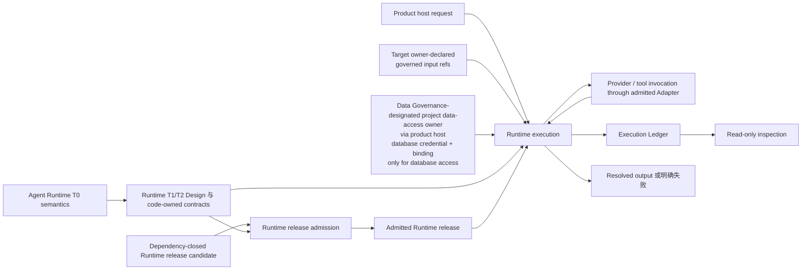

# Agent Runtime 合同（Agent Runtime Contract）

本文只冻结 Agent Runtime 的 portable 顶层语义：它准入并执行 provider-neutral Agent Module
与 Workflow，形成可重现、可检查的 execution result。Runtime 的当前开发进度、object field、
state transition、provider、durable backend、database、host binding、deployment 与 project-local
specialization 不属于本 T0，由代码或 Agent Runtime 自己的 T1/T2 Design 持有。

## 0. Intent Capsule

```yaml
layer: T0
t0_layer_id: the_agent_runtime
status: candidate
canonical_owner: designDoc/the_agent_runtime.md
owned_system_object: provider-neutral Agent execution
scope:
  - executable Module 与 Workflow release admission
  - provider-neutral Module 与 Workflow execution
  - immutable execution identity、lineage、outcome 与 usage fact
  - replaceable provider、durability、record-store、data-access 与 host integration seam
  - independently publishable Runtime core 与 conformance surface
non_goals:
  - current Runtime implementation progress、schema、field、state、release version 或 deployment
  - product objective、domain workflow meaning、content quality 或 terminal business decision
  - permission assignment、authorization policy 或 data-access decision
  - canonical domain data、domain SQL、migration 或 write approval
  - database credential 的解析、签发、刷新或保管，以及 connection pool、provider account 或 deployment topology
  - provider、model、durable backend、database product 或 host-product selection
  - software build、deployment、publication 或 product release admission
inputs:
  - dependency-closed Runtime release candidate
  - admitted Runtime target reference
  - frozen Module input closure
  - target owner-declared governed-data references
  - host-injected database credential 与 binding（仅在 database access 时）
outputs:
  - immutable Runtime release disposition
  - execution root 与 Runtime-owned lineage
  - resolved execution output 或明确失败
  - read-only inspection projection
truth_surfaces:
  - logical:agent_runtime_release_registry
  - logical:agent_runtime_execution_ledger
runtime_triggers:
  - admitted direct Module request
  - admitted Workflow request
  - Runtime release qualification request
downstream_consumers:
  - product host
  - domain workflow owner
  - assurance 与 software-delivery gate
open_decisions: []
review_gate: Design Doc Management 所属 Reviewer 对 exact candidate 的独立 Design review；Agent Runtime owner 单独作出 owner decision
runtime_surface_ledger:
  - current implementation 与 release fact 只来自 code-owned Runtime registry、validator 与 committed execution record
verification_hooks:
  - release closure 与 single-authority enforcement
  - provider-neutral execution、adapter conformance 与 database credential opaque-carry/non-custody checks
  - execution lineage、replay、isolation 与 inspection test
  - standalone import-boundary conformance
```

## 1. Primary System Flow



| `interface_id` | Owner | 输入 | 输出 | Effect | `error_code` |
| --- | --- | --- | --- | --- | --- |
| `runtime_release_admission` | Agent Runtime | Dependency-closed Runtime release candidate 与 conformance evidence | Immutable admitted release ref 或 rejection | 只在成功时创建一项 Runtime execution authority | `RUNTIME_RELEASE_CLOSURE_INVALID` |
| `runtime_execution` | Agent Runtime | Execution-start identity、admitted target ref、frozen input closure、target owner-declared governed-data refs，以及 host-injected database credential 与 binding（仅在 database access 时） | Execution ref 加 resolved output，或明确失败 | 创建一个 execution root，并提交该 root 的 Runtime lineage；同一已确认 identity 只返回既有 committed facts | `RUNTIME_EXECUTION_INPUT_INVALID` / `RUNTIME_EXECUTION_TERMINAL_FAILURE`；database operation 的 Product Authorization 或 adapter failure 保留真实 owner，不在 Runtime 重定义 |
| `runtime_inspection` | Agent Runtime | Exact query over committed Runtime facts | Read-only inspection projection | 不修改 Registry、Ledger 或 domain state；需要 database read 时使用 project data-access adapter，并保留其 allow/deny 或 failure identity | — |

| `error_code` | Owner | 触发条件 | 含义 | Caller action |
| --- | --- | --- | --- | --- |
| `RUNTIME_RELEASE_CLOSURE_INVALID` | Agent Runtime | Candidate identity、dependency、contract 或 conformance closure 不完整 | Candidate 没有 Runtime execution authority | 修复同一 owner 的 candidate closure，生成新 candidate 后重新请求 admission |
| `RUNTIME_EXECUTION_INPUT_INVALID` | Agent Runtime | Target、input closure 或 required binding 不完整或不一致 | 本次 request 无法建立合法 execution root | 修复 request/input binding，并以新 request identity 重试 |
| `RUNTIME_EXECUTION_TERMINAL_FAILURE` | Agent Runtime | 已准入执行无法产生 resolved output | Execution 已 terminal，但没有可推进的 Runtime output | 读取 committed failure lineage；按 owning workflow 的 recovery/stop rule 决定后续动作 |

## 2. User Intent

产品可以把已准入的 Agent Module 或 Workflow 交给一个可独立分发、provider-neutral 的 Runtime
执行，并获得可重现、可检查的结果；调用方不需要把 provider session、host directory、domain
data store 或 product-specific workflow 当作 Runtime truth。

## 3. Reader Gain

- Platform Architect 能判断一项能力属于 Runtime 顶层 authority、下层 Runtime specialization，
  还是相邻 product、data、authorization 或 delivery authority。
- Runtime Maintainer 能沿 admitted release、execution root、Invocation、Ledger 与 Inspection
  追踪一次执行，同时把当前 object schema 与 lifecycle 留给代码和下层 Design。
- Domain Plugin Owner 能把 domain semantics 当作 opaque input/output 使用，而不把 domain SQL、database
  credential 解析、acceptance 或 publication 责任塞进 Runtime。
- Security Reviewer 能确认 provider、tool、workspace 与 network 只使用已声明 capability；database access
  只通过 project data-access adapter，并且 Runtime 不解析 `user_key`、permission result 或 database credential。

## 4. Owned System Object

Agent Runtime 只拥有一个 system object：`provider-neutral Agent execution`。该对象包括 Runtime
release admission、统一 execution kernel、Runtime-owned execution facts、replaceable integration seam
与 read-only inspection。具体 release type、record field、state transition、retry、checkpoint、adapter
profile、storage schema 与 host composition 都是下层或 code-owned projection，不形成第二个 T0 object。

## 5. Authority

只有 Agent Runtime 可以定义：

1. 什么条件使一个 executable Runtime release 获得 Runtime execution authority；
2. direct Module 与 Workflow node 必须共用的 provider-neutral execution boundary；
3. 哪些 identity、lineage、outcome 与 usage fact 属于 Runtime record authority；
4. Invocation、Execution、Ledger 与 Inspection 之间的顶层 fact ownership；
5. provider、durability、record-store 与 host integration 必须可替换的 conformance boundary；
6. Runtime release admission 只授予 Runtime execution authority，不能推出 software deployment、
   domain acceptance 或 product publication。

Agent Runtime 不定义 product action、domain meaning、permission、data policy、domain write、software
deployment 或 publication decision，也不把当前 Runtime implementation 状态写入 portable T0。

## 6. Runtime 顶层语义

### 6.1 Release 与 execution 分离

Runtime release admission 只回答一个 executable release 是否可被 Runtime 执行；Software Delivery
单独回答软件是否可安装或部署，product/domain authority 单独回答 output 是否可被业务使用。行为变化
必须产生新的 immutable release；既有 execution 继续固定在原 release。

### 6.2 统一 execution kernel

Standalone-capable Module 可以直接启动，Workflow 可以组织多个 Module 与 durable transition；两者
必须进入同一套 execution identity、frozen input、invocation、lineage、resolution 与 inspection
control。Direct execution 不是 synthetic Workflow，也不能获得更弱的 control。

### 6.3 Provider-neutral invocation

Model 或 tool call 只能通过 admitted Adapter。Module 定义 task behavior；Execution Profile 定义
provider-facing execution choice；Adapter 负责执行并规范化 provider result。Provider-native session
可以优化 continuation，但不能成为唯一 canonical state 或跨越 incompatible isolation boundary。

### 6.4 Frozen input 与 bounded capability

每次 execution 接收一个 exact frozen input closure 与显式 capability。Model 或 provider process
不获得 ambient repository、host filesystem、authorization table 或 undeclared prior state。只有 database
access 会携带 database credential：product host 把 exact credential 与 binding 注入 Runtime execution
context，Runtime 与 Module 原样携带到受控 `DataAccessAdapter`，不读取其内容，不签发、不刷新、不持久
保管，也不扩大 scope。非数据库 provider/tool invocation 不进入这一 credential 模型。Data Governance
指定的 project data-access owner 负责 database credential 的取得与注入以及 Adapter implementation；
Data Governance 定义 admitted database binding 与 shared `DataAccessAdapter` boundary；domain owner
定义 domain SQL、migration、query 与 canonical write。这里固定的是 portable authority boundary，不要求或
修改任何 project T1/T2 contract。

### 6.5 Runtime facts、recovery 与 inspection

Invocation 返回 observation；Execution 验证并提交 Runtime fact；Execution Ledger 保存 authoritative
committed fact；Inspection 只做 read-only projection。Recovery 不能重复已 committed provider
call 或 protected effect，也不能暗中采用新的 release、input、Profile、data scope 或 owner-supplied binding。
同一已确认 execution-start identity 的重复提交返回既有 committed facts；实质不同的 request 使用新的
identity 并创建新的 execution root。Identity field、claim 与 crash-window rule 由下层 contract 持有。

Runtime 自己的 T1/T2 Design 与 code-owned contracts 承担 object family、field、state machine、retry、
checkpoint、durability、provider request、record-store schema、adapter profile、test fixture 与 current
release binding。portable T0 不维护这些 inventory 或开发进度。

## 7. System-wide Invariants

1. Runtime core 不 import host 或 domain implementation。
2. 超过一个 authority 不得准入或修改 Runtime release。
3. Provider、host、Skill file、generated projection 或 handwritten log 不能成为 Runtime truth。
4. Model 或 tool call 必须具有可重建的 release、execution、input、capability、output 与 usage lineage。
5. Runtime 不解释 domain meaning、permission、review result、product acceptance 或 publication decision。
6. Runtime 或 Module 只携带 host 注入的 database credential 与 binding，不解析、不签发、不刷新、不扩大
   scope、不持久保管，也不创建 ambient database connection 或持有 domain SQL/write；非数据库
   provider/tool 与该 credential 无关。
7. Direct Module 不得绕过 Workflow Module node 所受的 execution control。
8. Recovery 不得重复 committed invocation，或暗中采用新的 release、input、Profile、data scope 或 owner-supplied binding。
9. Provider-native state 不得成为唯一 continuity source，也不得跨 isolation boundary。
10. Inspection、telemetry 或 durable history 不得创建 fact、修改 Ledger，或越权暴露 protected content。
11. 未 resolved 的 output 不得推进为 Runtime success。
12. Runtime output 不得被表述为 domain admission、artifact readiness、product publication 或 software deployment evidence。

Code-owned registry、validator、persisted Runtime record 与 generated inspection 是 implemented/current
状态的 truth。portable T0 只定义上述 stable meaning 与 enforcement obligation。

## 8. Peer Boundaries

| External authority | Runtime consumes | Runtime must not do |
| --- | --- | --- |
| Product 或 domain owner | Exact executable target 与 opaque task semantics | 选择 product action 或重新解释 domain decision |
| Product Authorization | Runtime 可以把 `user_key` 作为 frozen target input 原样交给 project data-access adapter | 判断、缓存或扩大 database permission，或把 database permission 当作 workflow-start authorization |
| Governed data owner | Exact input ref 与 bounded read result | 选择 data policy 或持有 domain SQL |
| Data Governance 指定的 project data-access owner | 经 product host 注入的 database credential 与 binding | 取得、解析、签发、刷新、持久保管或扩大 database credential |
| Data Governance | Admitted database binding 与 shared `DataAccessAdapter` boundary | 绕过 admitted binding，或接管 domain SQL 与 canonical write |
| Subject Design authority | Reviewer meaning、subject boundary 与 subject-specific checklist | 让 Runtime 推断 Reviewer 语义或改写 review result |
| Review Contract | 通用 Reviewer instruction 与 prompt layout | 把 Review Contract 当作通用 review 入口或 subject checklist owner |
| Skill Management | Immutable Skill 与 declared Module export | 把 working-tree Skill 当作 execution authority |
| Agency Platform 或 product host | Exact Runtime target binding 与 compatible host composition | 允许 host composition 修改 Runtime release authority |
| Software Delivery | Installed software 与 deployment evidence | 把 Runtime release admission 当作 software deployment admission |
| Timestamp Semantics | Runtime fact 的 timestamp role、clock-domain 与 comparison law | 自行发明 time-field meaning 或用 wall-clock order 替代 causal/runtime order |

Reviewer 执行遵循唯一分工：subject authority 提供 Reviewer meaning 与 subject-specific checklist；
Review Contract 提供通用 instruction；Agent Runtime 只按已注册 Module Release、frozen subject、input
closure 与 Execution Profile 执行 Reviewer Module，并记录 Runtime execution evidence。Runtime 不决定
Reviewer 是否适用、不补写 finding、不解释 verdict。

Frozen Runtime Design candidate 接受 Design Doc Management 所属 Reviewer 的 independent semantic
review，由 Agent Runtime owner 决定是否接受 Design。后续 Code Design、software release、Runtime
release admission 与 product/domain acceptance 分别由各自 authority 决定，任何一个 decision 都不能
替代另一个。

## 9. References

- [Project Charter](the_charter.md)
- [Design Doc Management](the_design_doc_management.md)
- [Review Contract](the_review_contract.md)
- [Agency Platform](the_agency_platform.md)
- [Product Authorization](the_product_authorization.md)
- [Data Governance](the_data_governance.md)
- [Timestamp and Clock Semantics](the_timestamp_semantic.md)
- [Software Delivery](the_software_delivery.md)
- [Skill Management](the_skill_management.md)
