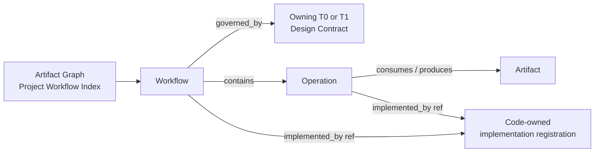
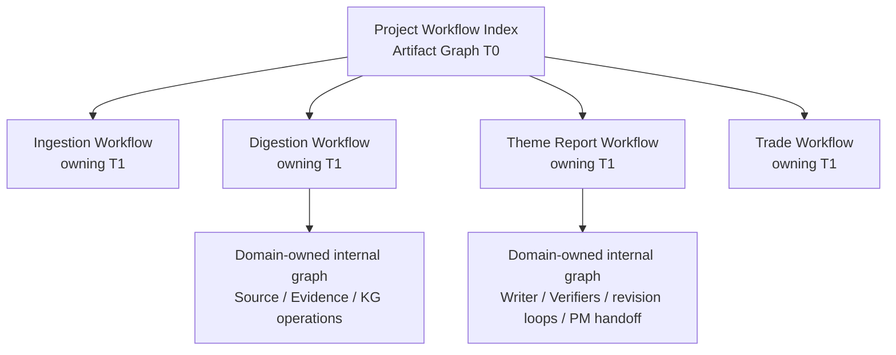

# Artifact Graph and Project Workflow Index

**Purpose**: Define the project-wide graph that indexes every registered
Workflow, Operation, Artifact, owning Design Contract, and typed dependency.

**Required reader gain**: A reader can start from any product workflow,
operation, or artifact; find its owning Design Doc and code registration;
understand its upstream, downstream, gate, optional, and loop relationships;
and distinguish this logical index from routing, authorization, and execution.

## 0. Intent Capsule

```yaml
layer: T0
t0_layer_id: the_artifact_graph
status: candidate
canonical_owner: designDoc/the_artifact_graph.md
owned_system_object: project Workflow, Operation, Artifact, and Design Contract graph
scope:
  - project-wide Workflow and Operation index
  - Workflow-to-owning-Design-Contract resolution
  - Operation-to-Workflow membership
  - Artifact input, output, dependency, readiness, freshness, and provenance relations
  - required, optional, gate, trigger, loop, and supersession edge law
  - code-owned graph registration and generated Project Workflow Index
non_goals:
  - semantic task classification or route selection
  - Product Authorization or Entitlement evaluation
  - domain workflow state meaning, quality rubric, or business transition policy
  - Dagster, Agent Runtime, provider, model, adapter, retry, or context execution
  - physical data placement, retention, backup, or migration
inputs:
  - registered T0 and T1 Design Contract identities
  - domain-owned Workflow and Operation registrations
  - Artifact type and dependency registrations
  - code-owned implementation and execution-binding references
outputs:
  - ProjectWorkflowRegistration law
  - OperationRegistration law
  - ArtifactTypeRegistration law
  - typed GraphEdgeRegistration law
  - immutable WorkflowIndexRelease law
  - generated Project Workflow Index
truth_surfaces:
  - designDoc/the_artifact_graph.md
  - logical:artifact_graph_registry
runtime_triggers:
  - workflow, operation, artifact, owner, or graph-edge registration change
  - generated Project Workflow Index inspection request
downstream_consumers:
  - Task Routing and Workflow Control Plane
  - Product Authorization, Agent Runtime, Data Governance, and Software Delivery
open_decisions:
  - target normalized graph-registry schema and release store
  - dynamic Artifact-instance graph persistence
review_gate: design_doc_review and independent graph-closure review
runtime_surface_ledger: generated from code-owned graph registrations; the predecessor projection remains explicitly non-admitted
verification_hooks:
  - owner, dependency, edge, and immutable-provenance closure
  - predecessor identity and dependency parity during migration
```

## 1. Authority

Artifact Graph answers one system-wide question:

> What work exists in this project, where is it defined, and how does it
> connect to other work and artifacts?

It is the canonical index for locating workflows and their relationships. It
does not own the internal business meaning of a workflow and does not execute
the graph.



The owning T1 defines what a workflow means, its legal states, quality rules,
human decisions, and terminal outcomes. Artifact Graph owns the stable identity
and project-wide relationships needed to find and compose that work.

## 2. Graph Objects

The graph has five first-class machine objects.

| Object | Owned meaning |
| --- | --- |
| `ProjectWorkflowRegistration` | One stable logical workflow, its owning Design Contract, requested outcome, public input/output contract references, registration lifecycle, and graph entry points |
| `OperationRegistration` | One stable logical operation inside a workflow, its owner, operation contract, input/output slots, and allowed relationship types |
| `ArtifactTypeRegistration` | One stable produced or consumed information object, its owning domain, identity contract, schema ref, versioning mode, and readiness policy ref |
| `GraphEdgeRegistration` | One typed relationship between registered graph objects with scope, owner, contract, and validation rule |
| `WorkflowIndexRelease` | One immutable, hash-bound closure of registrations used to reproduce and audit a complete project index |

Exact field names, versions, active registrations, implementation paths, and
current status belong to code. This T0 owns the meaning and minimum closure of
those records.

Business graph content, input and output schemas, quality rules, human gates,
and terminal outcomes remain in the owning T1 `WorkflowBehaviorRelease`.
`ProjectWorkflowRegistration` references that authority; it does not copy or
release business behavior.

Artifact types may be project-wide, but every produced Artifact instance must
bind its tenant, Cell, data scope, governing type, immutable version, and
provenance. The owning domain persists the instance. Artifact Graph owns the
cross-project relation and eligibility law applied to that instance.

An Operation is a logical unit of work. It is not a provider call, CLI command,
Dagster op, Agent Runtime Step, UI action, or Skill merely because one of those
surfaces implements or projects it. Implementation identities attach by typed
reference and may change without silently changing logical Operation identity.

## 3. Typed Relations

The graph must distinguish structural, data, control, and lifecycle relations.
The code-owned registry may add narrower subtypes but cannot change these
meanings.

| Relation | Meaning |
| --- | --- |
| `governed_by` | The target Design Contract owns the source Workflow, Operation, or Artifact meaning |
| `contains_operation` | A Workflow contains the Operation as part of its logical graph |
| `consumes` | An Operation or Workflow reads the Artifact under its owning contract |
| `produces` | An Operation or Workflow may produce a candidate Artifact |
| `required_upstream` | The downstream object cannot become eligible until the upstream condition passes |
| `optional_overlay` | The downstream object may consume the upstream object when present and authorized; absence alone does not block |
| `must_pass_gate` | A registered deterministic, Agent, domain, or human decision must pass before the declared transition |
| `triggers` | Completion or an event may start another registered Workflow or Operation under its owning trigger policy |
| `revision_loop` | A typed finding or decision returns work to an earlier Operation under an explicit loop contract |
| `derived_from` | An Artifact materially derives from one exact upstream Artifact version |
| `supersedes` | A Workflow, Operation, Artifact type, or Artifact version replaces an earlier identity for a declared scope without erasing history |
| `implemented_by` | A non-authoritative reference to the code-owned implementation or execution binding |

A graph relation is never inferred from filenames, directory proximity,
creation order, a prompt, or a working command. Both endpoints and the edge
type must be registered.

A relation may not cross tenant, Cell, or data scope directly. Cross-scope use
requires an authorized destination-scoped share or export Artifact governed by
Product Authorization and Data Governance. The graph records that mediating
Artifact and its typed edges rather than treating an allow decision as an
implicit dependency.

## 4. Project Index versus Domain Workflow

Artifact Graph owns the cross-project index. Each domain owns the detailed
workflow beneath its registered entry.



The project graph records that a Workflow exists, where its contract lives,
which public Artifacts and Operations connect it to the rest of the system, and
which code registrations implement it. The domain T1 remains authoritative for
the internal graph and may expose a generated detailed projection linked from
the project index.

Only Workflow identities emitted by the code-owned Project Workflow registry
may appear in the generated execution index. A Design registration by itself
never implies that an executable Workflow release exists.

Every project workflow must therefore resolve to exactly one owning T1 Design
Contract. A Design Doc that describes executable work but has no Workflow
registration is unindexed. A Workflow registration with no resolvable owning
Design Contract is invalid.

## 5. Loops and Cycles

Workflow control graphs may be cyclic. Revision, review, retry-after-human-
decision, debate, and repair loops are valid only when the cycle declares:

- one stable loop ID and owning T1 contract;
- the edge that enters and exits the loop;
- the typed finding, decision, or state that permits another iteration;
- termination, exhaustion, cancellation, and escalation behavior;
- the Artifact version or immutable input closure for each iteration; and
- the execution system responsible for checkpoint and recovery.

An undeclared cycle is invalid. Artifact derivation between immutable Artifact
versions remains acyclic; a revision creates a new version and a typed
`supersedes` or `derived_from` edge rather than rewriting prior provenance.

## 6. Artifact Readiness and Provenance

An Artifact is a registered logical information object, not merely a file,
database row, provider response, Runtime output, or successful process exit.

A candidate Artifact is eligible for a declared downstream use only when:

1. its exact type, version, identity, hash, and governed store reference resolve;
2. all `required_upstream` and `must_pass_gate` relations pass;
3. freshness and readiness predicates required by its type pass;
4. producer and immutable input lineage resolve;
5. required authorization and execution evidence references match;
6. the owning domain has issued the required acceptance decision; and
7. its tenant, Cell, and data-scope bindings match the consuming scope, or an
   authorized destination-scoped share or export Artifact mediates the edge.

Artifact Graph records and derives graph eligibility. It does not replace the
owning domain's semantic judgment, Product Authorization, Agent Runtime output
resolution, or Data Governance placement authority.

## 7. Generated Project Workflow Index

The current project index is generated from code-owned registrations. It must
provide at least these views:

- each Workflow, its owning Design Contract, and its requested outcome;
- each Workflow, its Operations, and their input and output Artifacts;
- upstream, downstream, required, optional, gate, trigger, and loop edges;
- domain-level and cross-domain Mermaid graphs;
- implementation, Dagster, Agent Runtime, Skill, CLI, and service references
  as non-authoritative projections;
- registration lifecycle and implementation coverage;
- unresolved owners, missing docs, missing endpoints, illegal cycles, and stale
  implementation references; and
- commands or service endpoints for registered deterministic health checks.

The generated index is disposable and reproducible. It cannot create a
Workflow, Operation, Artifact, edge, owner, or implementation binding. A
hand-maintained workflow table or diagram is explanatory only.

## 8. Cross-T0 Handoffs

| Peer T0 | Boundary |
| --- | --- |
| Task Routing | Selects one authorized logical workflow or owner; it may resolve candidate identities through the Project Workflow Index but does not modify the graph |
| Product Authorization | Decides whether a Principal may discover, invoke, read, mutate, share, or export a registered object; graph visibility is not permission and cross-scope permission is not an implicit edge |
| Agency Platform | Resolves a selected Workflow to its admitted execution class and target through the Workflow Control Plane |
| Agent Runtime | Executes registered Agent work and returns execution-output lineage; it does not own project Workflow or Artifact identity |
| Data Governance | Owns physical store, isolation, residency, retention, backup, migration, and governed share or export bindings for graph records and Artifact payloads |
| Timestamp and Clock Semantics | Owns every time field and freshness-comparison meaning used by the graph |
| Design Doc Management | Governs the owning T0 and T1 Design Contracts referenced by graph registrations |
| Contract Audit | Audits an immutable graph registration or release under a registered profile |
| Software Delivery | Admits the code, schema, migration, and generated projection implementing the graph |

## 9. Migration Constraint

Any project-local predecessor inventory remains code-owned and may contain
valuable project knowledge: Modules, Nodes, builders,
checks, required dependencies, optional dependencies, routing signals, and
health commands. Migration to the target registration model must prove
identity and edge parity before retiring any predecessor entry. A new schema or
Design Doc is not permission to discard an existing workflow or dependency.

The target implementation may normalize or split the predecessor registry, but
the generated Project Workflow Index must preserve every still-valid Workflow,
Operation, Artifact, owner, and relationship and must expose unresolved legacy
rows explicitly rather than omitting them.

## 10. Invariants

The project graph is non-conformant when:

- a Workflow, Operation, or Artifact cannot resolve to exactly one semantic
  owner and governing Design Contract;
- a project workflow is discoverable only through a Skill, filename, prompt,
  command, or human memory;
- a relation is inferred rather than registered;
- a current workflow or edge disappears during schema or platform migration
  without explicit retirement evidence;
- Task Routing, Product Authorization, Dagster, Agent Runtime, a provider, or a
  UI silently becomes the owner of graph semantics;
- an implementation reference is treated as logical identity or permission;
- an undeclared control cycle exists, or an immutable Artifact provenance cycle
  is introduced;
- a Runtime output or successful build is treated as an accepted Artifact
  without the required graph and domain gates;
- an Artifact dependency crosses tenant, Cell, or data scope without an
  authorized destination-scoped share or export Artifact;
- a manually edited diagram is treated as current project truth.

## References

- [Enterprise Constitution](the_charter.md)
- [Agency Platform](the_agency_platform.md)
- [Agent Runtime](the_agent_runtime.md)
- [Product Authorization](the_product_authorization.md)
- [Task Routing](the_task_routing.md)
- [Data Governance](the_data_governance.md)
- [Timestamp and Clock Semantics](the_timestamp_semantic.md)
- [Design Doc Management](the_design_doc_management.md)
- [Contract Audit](the_contract_audit.md)
- [Software Delivery](the_software_delivery.md)
