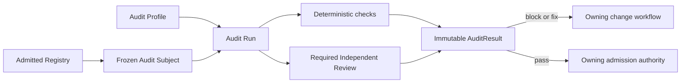

# Contract Audit

**Purpose**: Define external audit and Independent Review for immutable subjects
declared by admitted Registries.

**Required reader gain**: A reader can determine which registered objects may
be audited, how an audit profile selects deterministic and judgment-bearing
checks, what makes a reviewer independent, and how the resulting verdict
returns to the owning admission workflow without becoming self-approval.

## 0. Intent Capsule

```yaml
layer: T0
t0_layer_id: the_contract_audit
status: candidate
canonical_owner: designDoc/the_contract_audit.md
owned_system_object: Audit Profile, Audit Execution, and AuditResult
scope:
  - external audit of immutable subjects declared by admitted Registries
  - deterministic, semantic, engineering, security, data, and prose review profiles
  - reviewer independence, finding, verdict, evidence, and re-audit semantics
  - executor-neutral audit semantics with a target fixed Agent Runtime workflow
non_goals:
  - authoring or repairing the audited subject
  - defining the subject's business, design, data, Runtime, or release rules
  - admitting, publishing, deploying, or activating the subject
  - requiring every subject family to expose prose or the same implementation surfaces
  - requiring Agent Runtime to be admitted before Agent Runtime itself can receive bootstrap audit
inputs:
  - immutable registered subject package and hash
  - registered Audit Profile and reviewer-independence evidence
outputs:
  - immutable AuditResult
  - structured findings routed to accountable owners
  - evidence-bound pass, non-pass, or blocked verdict
truth_surfaces:
  - designDoc/the_contract_audit.md
  - logical:contract_audit_profile_registry
  - logical:contract_audit_execution_registry
runtime_triggers:
  - audit request for one immutable registered subject
  - re-audit request after a new subject revision
downstream_consumers:
  - subject-owning revision workflow
  - Software Delivery or another registered admission authority
open_decisions: []
review_gate: independent review of this T0 contract and its machine implementation
runtime_surface_ledger: generated from audit target, profile, execution, finding, and verdict registrations
verification_hooks:
  - audit-profile closure and deterministic check replay
  - reviewer-independence and immutable-subject-hash validation
```

## 1. Authority

Contract Audit owns the common protocol for Independent Review. It answers:

1. What exact registered subject is being reviewed?
2. Which audit profile and checks apply to that subject type?
3. Is the reviewer independent of the subject author and admission decision?
4. What findings and verdict did the audit produce?
5. Can the owning workflow reproduce and consume that result?

The Registry that declares a subject owns its identity and immutable package.
The subject's governing T0 or T1 owns the rule being checked. Contract Audit
executes the declared checks and records an independent result. The owning
admission workflow decides what that result permits.

Contract Audit does not own the audited subject. It owns the `AuditProfile`,
`AuditExecution`, finding set, reviewer-independence evidence, and
`AuditResult` that refer to that immutable subject.

## 2. Auditable Subject

An auditable subject is an immutable package resolved through one admitted
Registry. During the registered genesis ceremony, the subject may instead
resolve through the exact genesis-approved Registry release named by the
bootstrap profile. An unadmitted predecessor subject is auditable only under an
explicit `legacy_unadmitted` disposition and cannot receive an admitted verdict.
Examples include:

- a T0 or T1 Design Contract release;
- a machine Contract Specification release;
- a Workflow or Agent component registration;
- a Data Asset or schema registration;
- an Artifact Type registration;
- a routing, authorization, or policy release;
- a software change set, package, migration, or Release Manifest;
- a Skill or other generated Agent projection when its owner requires review.

Each subject package binds:

- subject type, stable identity, version, owner, and immutable hash;
- declaring Registry and governing contract;
- exact surfaces and dependencies included in the review closure;
- applicable Audit Profile;
- admission authority that will consume the result.

Contract Audit does not discover authority by guessing from filenames or prose.
An unresolved, mutable, or mixed-version subject is blocked before review.

## 3. Audit Profile

An Audit Profile is a versioned code-owned policy selected by subject type and
risk. It defines:

- required deterministic checks;
- required independent judgment checks;
- optional communication or prose review;
- required reviewer qualification and independence rule;
- finding severity and aggregate verdict policy;
- evidence, retention, expiry, and re-audit requirements.

It also records an explicit requirement for every audit layer: `required` or
`not_required`. A profile cannot leave a layer implicit. A later profile
revision may change a layer only through a new policy release and hash.

Audit layers are composable. Every profile requires deterministic subject
resolution. Other layers depend on the subject:

| Audit layer | Question | Typical subjects |
| --- | --- | --- |
| Deterministic Conformance | Does the frozen subject satisfy machine-decidable identity, schema, dependency, and test rules? | All subjects |
| Independent Semantic Review | Are authority, behavior, handoffs, risks, and declared meaning coherent? | Design, workflow, policy, and component contracts |
| Independent Engineering Review | Does the change or release satisfy architecture, implementation, compatibility, security, migration, and recovery intent? | Code, package, schema, migration, and release subjects |
| Prose and Communication Review | Does a human-facing artifact communicate the approved meaning clearly without misleading the reader? | Design Docs, reports, and other prose-bearing subjects |

A profile may mark a non-applicable layer `not_required`. A code release does
not need a prose layer merely because a Design Doc does. Silence and omitted
results are not valid substitutes for an explicit profile decision.

For a T0, T1, or T2 Design Intent subject, Design Doc Management owns the
semantic check method and Contract Audit owns the immutable subject, profile,
reviewer binding, execution, findings, and result. The profile binds a fixed
Design Contract reviewer Workflow. It does not reuse an Engineering Change
Reviewer, because a Design candidate has no implementation diff, test plan, or
Code Design Basis to reproduce. The later implementation ChangeSet is a
separate subject with a separate engineering-review result.

Engineering Change Governance may reuse this T0 layer's independence, evidence,
finding, and verdict rules for `engineering-change-review`. That reuse does not
make Contract Audit the owner of the engineering workflow or its frozen change
subject. Contract Audit owns only a formal `ContractSubjectManifest` audit;
Engineering Change Governance owns the as-built change review and Software
Delivery handoff.

## 4. Independent Review

A reviewer is independent only when all of the following hold:

- the reviewer did not author or modify the exact subject version;
- the reviewer cannot admit, publish, deploy, or activate its own result;
- the reviewer receives the immutable subject closure and declared profile;
- the reviewer identity, component or human role, release, and execution are
  recorded;
- the reviewer cannot silently widen the subject, evidence, tools, or policy;
- the reviewer result is bound to the exact subject and profile hashes.

Provider or model identity is execution metadata. It does not create review
authority. A direct model response, terminal log, or manually written summary
is advisory until it enters the registered audit protocol.

The audit contract is executor-neutral. During bootstrap, the Primary Agent may
assemble the frozen package and invoke an approved external reviewer directly.
The target implementation is a fixed Agent Runtime workflow that implements the
same subject, profile, finding, and verdict interfaces. Changing the executor
does not change audit semantics or review authority.

The Runtime-reviewer genesis path is a single-use root-of-trust ceremony. It
must be restricted to the minimum reviewer bundle, must forbid a reviewer
release or binding from reviewing itself, and may admit no business workflow or
ordinary Runtime release. A distinct admitted successor reviewer must formally
cross-review every bootstrap-admitted surface. One immutable
`BootstrapClosureRecord` binds that evidence and permanently disables the
genesis path. No bootstrap result can substitute for that successor review or
closure record.

## 5. Audit Execution



Deterministic checks run in code against the exact frozen subject. A reviewer
cannot waive a failed deterministic invariant. The target judgment-bearing
review runs as a registered fixed Agent Runtime workflow. Runtime owns model
invocation, context, retry, recovery, input and output records, usage, tool
traces, and cost fields. Contract Audit owns the review profile, findings, and
verdict.

Before that Runtime workflow is admitted, the Primary Agent may use the same
contract through an approved external-review runner. This bootstrap path keeps
Design Doc Management and Contract Audit usable while Runtime is incomplete or
itself under review. Bootstrap output must enter the same AuditResult boundary
and cannot silently claim Runtime execution evidence.

## 6. Findings and Verdict

Every finding records:

- audit layer and check identity;
- severity: `block`, `fix`, or `note`;
- subject surface and precise location;
- evidence or reproduced failure;
- accountable owner;
- required disposition.

Every required audit layer records one disposition:

- `passed`: the layer completed with no actionable finding;
- `non_pass`: the layer completed with at least one `block` or `fix`;
- `blocked`: the layer could not form a valid judgment;
- `not_required`: the Audit Profile explicitly excludes the layer.

The aggregate verdict is `pass` only when every required layer is `passed` and
no `block` or `fix` remains. A `blocked` layer never becomes pass through an
author statement or a successful result from another layer.

## 7. Fix and Re-audit

Contract Audit never edits the subject. Findings return to the owning change
workflow. The responsible owner creates a new subject version and submits it
for a new audit.

Prior results remain immutable. The system may reuse unaffected deterministic
evidence or rerun only affected review components for efficiency, but the final
AuditResult must bind a coherent result set for one exact subject version and
one exact profile release.

## 8. Admission Handoff

An AuditResult is evidence, not authority to activate the subject:

- Design Doc Management decides Design Contract lifecycle and admission.
- Agent Runtime decides Runtime registration admission under its contract.
- Data Governance decides Data Asset and storage admission.
- Software Delivery decides software and release admission.
- A domain T1 decides business acceptance of its artifacts and workflow output.

The consuming authority verifies the result identity, subject hash, profile,
reviewer independence, expiry, and terminal disposition before using it.

## 9. Required Machine Contract

The implementation of this T0 requires code-owned contracts for:

- `AuditTargetType` and declaring Registry binding;
- `AuditSubject` and immutable package closure;
- `AuditProfile` and check selection;
- subject-kind-to-reviewer-Workflow binding, including the fixed Design
  Contract reviewer for Design Intent profiles;
- per-layer `required` or `not_required` applicability;
- `ReviewerBinding` and independence policy;
- `AuditRun`, layer result, finding, and aggregate verdict;
- executor binding and evidence references for bootstrap or Agent Runtime review;
- result expiry, invalidation, dependency impact, and re-audit.

Exact schemas, provider bindings, reviewer inventories, commands, and current
results belong to code and persistent stores. Generated inspection renders
them for operators and reviewers.

## 10. Invariants

1. Every audit consumes one immutable registered subject.
2. Every subject resolves one governing contract and Audit Profile.
3. The subject author cannot supply the Independent Review verdict.
4. The reviewer cannot edit or admit its own subject.
5. Deterministic failures cannot be waived by prose or model judgment.
6. Non-applicable layers are explicitly `not_required` by profile.
7. Findings identify evidence, owner, and required disposition.
8. AuditResult is bound to exact subject, profile, and reviewer evidence.
9. Admission remains with the owning authority.
10. Every correction creates a new subject version and re-audit record.
11. A reviewer binding must match the subject kind and semantic-review gate;
    selecting a nearby reviewer is a blocked routing defect, not a valid audit.

## References

- [Product Charter](the_charter.md)
- [Design Doc Management](the_design_doc_management.md)
- [Agent Runtime](the_agent_runtime.md)
- [Data Governance](the_data_governance.md)
- [Software Delivery](the_software_delivery.md)
