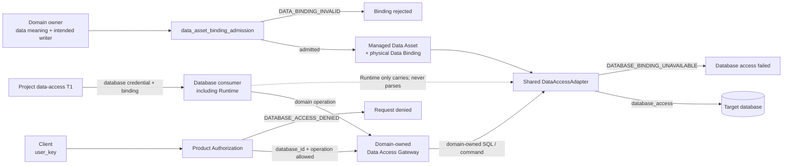

# 数据治理（Data Governance）

本文只冻结 portable Data Governance 的顶层语义：一个受管理的数据对象由谁负责、哪个物理位置是
System of Record、谁可以写，以及所有数据库消费者如何经过同一条受控数据库访问边界。具体 schema、
SQL、driver、connection pool、transaction、retry、credential provider、migration command 和部署配置
属于项目 T1/T2 与代码，不在本 T0 展开。

## 0. Intent Capsule

```yaml
layer: T0
t0_layer_id: the_data_governance
status: candidate
canonical_owner: designDoc/the_data_governance.md
owned_system_object: managed Data Asset and physical Data Binding
scope:
  - managed Data Asset 的语义 owner、System of Record 与 canonical writer boundary
  - physical Data Binding 及其 isolation、classification、residency 与 lifecycle constraints
  - portable database-access mechanism boundary
  - shared DataAccessAdapter 与 domain-owned Data Access Gateway 的职责分界
  - code-owned registration 与 generated inspection obligation
non_goals:
  - domain record meaning、schema、SQL、query semantics、result mapping 或 writer rule
  - user_key permission assignment 或 Product Authorization decision
  - database credential 的签发、保管、轮换或具体 provider
  - Runtime、Module、provider 或 tool execution behavior
  - concrete database、driver、pool、transaction、retry、buffer 或 deployment implementation
  - SystemChangePlan、software release 或 review verdict
inputs:
  - domain-owned Data Asset intent
  - physical binding 与 data-handling constraint candidate
  - Product Authorization database allow result
  - project data-access composition 提供的 database credential 与 binding
outputs:
  - admitted Data Asset 与 physical Data Binding meaning
  - System of Record、canonical writer 与 data-handling constraints
  - portable DataAccessAdapter boundary
  - code-generated current registration 与 inspection
truth_surfaces:
  - designDoc/the_data_governance.md
  - code-owned Data Governance registry and inspection
runtime_triggers:
  - managed Data Asset 或 physical binding change
  - database access composition change
  - retention、backup、restore、migration、export 或 retirement change
downstream_consumers:
  - domain data owners
  - database-access implementations
  - Product Authorization
  - Agent Runtime
  - Software Delivery
open_decisions:
  - none at T0
review_gate: material Design change 进入 DDM-owned design_contract_reviewer 与 accountable owner decision
runtime_surface_ledger: 实现后从 code-owned Data Governance registrations 生成
verification_hooks:
  - System of Record uniqueness 与 canonical writer checks
  - physical binding 与 data-handling constraint checks
  - database-access boundary 与 credential non-disclosure checks
```

## 1. Primary System Flow



| `interface_id` | Owner | 输入 | 输出 | Effect | `error_code` |
| --- | --- | --- | --- | --- | --- |
| `data_asset_binding_admission` | Data Governance | Domain-owned Data Asset intent、intended writer、physical binding 与 applicable constraints | Admitted binding meaning 或 rejection | 只建立 Data Governance-owned authority 与 handling boundary；不创建 domain schema 或 writer | `DATA_BINDING_INVALID` |
| `database_access` | Data Governance | Admitted physical binding、Product Authorization allow result、domain-owned command，以及 project 提供的 database credential | Database operation result 或明确失败 | 只执行受控数据库访问；不解释 `user_key`、domain meaning 或 SQL meaning | `DATABASE_BINDING_UNAVAILABLE` |

| `error_code` | Owner | 触发条件 | 含义 | Caller action |
| --- | --- | --- | --- | --- |
| `DATA_BINDING_INVALID` | Data Governance | Candidate 无法唯一确定 semantic owner、System of Record、canonical writer 或适用约束 | Data Asset 没有形成可用的 physical authority | 修正 binding candidate；不得以未准入位置承载 canonical write |
| `DATABASE_BINDING_UNAVAILABLE` | Data Governance | Exact physical binding 或 database credential 不可用，或两者不对应同一受控目标 | 本次数据库访问不能安全建立 | 停止访问并返回 project data-access T1 owner；不得绕过 Adapter 自建连接 |

`DATABASE_ACCESS_DENIED` 是 Product Authorization 的正常 deny result，不属于 Data Governance error。

## 2. User Intent

不同 domain 可以共享同一套数据库访问机制，但不能因此共享 schema、SQL、writer authority 或数据所有权。
每个受管理的数据对象必须有唯一可识别的 semantic owner、System of Record 和 canonical writer；每个数据库
访问请求必须经过 Product Authorization、domain boundary 和受控 DataAccessAdapter，而不是由 Runtime、
Module 或其他消费者自行解析 credential、选择数据库或直连内部表。

## 3. Reader Gain

- Product Architect 能判断一个数据对象的语义 owner、物理 authority 和 canonical writer 是否清楚。
- Data Architect 能区分共享的 `DataAccessAdapter` 机制与 domain-owned schema、SQL 和 writer rule。
- Domain Service Owner 能明确自己必须提供的 Data Access Gateway，以及自己不能外包给 Adapter 的职责。
- Platform Engineer 能确认 Runtime 与其他消费者只携带 project 注入的 database credential 与 binding，
  不解析、不签发、不刷新；同时能区分 T0 语义与代码或 T1/T2 持有的 exact implementation。

## 4. Owned System Object

Data Governance 只拥有 `managed Data Asset and physical Data Binding`：一个受管理的数据对象由哪个
semantic owner 负责，哪个物理位置是 System of Record，哪个边界可以提交 canonical write，以及该 binding
受哪些 system-wide data-handling constraints 约束。

`DataAccessAdapter` 是 physical Data Binding 的 portable database-access mechanism boundary，不是第二个
数据 authority。Exact record、field、registry schema、adapter implementation、current connection 与 migration
状态属于代码或下层 Design。

## 5. Authority

Data Governance 可以定义：

1. managed Data Asset、System of Record 与 physical Data Binding 的稳定含义；
2. canonical writer、replica、projection、cache、backup 与 migration target 的 authority 关系；
3. isolation、classification、residency、retention、backup、restore、export、migration 与 retirement 的
   system-wide constraints；
4. shared `DataAccessAdapter` 与 domain-owned Data Access Gateway 的职责边界；以及
5. database credential 在访问链中必须保持受控、不可向 Client 暴露、不可被非数据库消费者解释的边界。

Data Governance 不拥有：

- domain 数据含义、schema、SQL、query、result mapping 或 business acceptance；
- `user_key` 的生成、验证、permission assignment 或 allow/deny meaning；
- database credential 的 secret value、provider、custody lifecycle 或具体 resolution implementation；
- Runtime execution、Module capability、provider/tool invocation 或 workflow meaning；以及
- code build、release、deployment 或 rollback decision。

## 6. Data Authority and Database Access Boundary

### 6.1 Data authority

每个 record family 与 scope 只有一个 registered System of Record 和一个 canonical writer boundary。Replica、
projection、cache、index、backup、workflow history 与 export 可以保存 bytes，但不能因此取得 semantic ownership
或接受独立 canonical write。

Version-controlled source authority 持有 code、Design、schema definition、migration 与 test。Registered database
持有 managed runtime state。Object store 可以保存大型 immutable payload，但其 identity、owner、hash、policy、
lifecycle 与 locator 仍由 registered System of Record 持有。具体产品与物理拓扑由项目 T1/T2 决定。

### 6.2 Shared Adapter and domain Gateway

`DataAccessAdapter` 只提供可复用的数据库访问机制。它可以在项目实现中负责 connection acquisition、
transaction mechanics、tenant context、retry classification 和 access audit，但这些 exact 能力、字段与算法
属于 T1/T2 和代码。

Domain-owned Data Access Gateway 负责把已经允许的 domain operation 转成 domain SQL 或 command，并保留
schema、query semantics、result mapping 和 writer rule。共享同一个 Adapter 不会共享这些 domain authority。

### 6.3 Database credential and user_key

`user_key` 只用于 Product Authorization 判断 `database_id + operation`。它不是 database credential，也不能
兑换、返回或暴露 database credential。

Database credential 只存在于数据库访问链。Project data-access T1 是 credential 取得、注入与
`DATABASE_BINDING_UNAVAILABLE` 处置的下层 implementation owner；具体 secret provider 与 resolution 由该
T1/T2 和代码决定。Runtime 或其他消费者只携带被注入的 database credential 与 exact binding 到受控
Adapter，不读取其内容，不签发、不刷新、不扩权，也不把它用于非数据库 provider/tool 调用。

### 6.4 Lifecycle and migration

Retention、legal hold、backup、restore、export、migration、rollback 与 retirement 必须遵守 admitted physical
binding 和 applicable data-handling constraints。T0 只定义这些结果不得产生第二个 System of Record、第二个
writer 或 silent fallback；exact state machine、deadline、job、evidence schema 与 recovery procedure 下沉至
T1/T2 和代码。

### 6.5 Design and code boundary

本 T0 持有 stable intent、authority、invariant 与 peer handoff。Code 持有 exact Registry、ID、schema、current
binding、policy version、migration state、implementation ref、coverage 与 generated inspection。当前代码与本
目标语义之间的差异是显式 implementation debt，不通过在 T0 复制现行字段解决。

Material Data Governance Design candidate 由 DDM 定义的 `design_contract_reviewer` 审核 exact frozen subject；
Review Contract 只注入通用审核规则。Accountable Data Governance owner 决定是否接受 Design。Adapter、schema、
migration 与 database implementation 另行进入 Software Delivery。

## 7. System-wide Invariants

1. 每个 managed Data Asset 和 scope 只有一个 semantic owner、一个 System of Record 和一个 canonical writer。
2. Physical custody、replica、projection、cache、backup 或 export 不转移 semantic ownership。
3. Canonical write 只能经过 registered writer boundary；不得通过内部表、跨 domain 文件或旁路连接写入。
4. Product Authorization allow、Data Governance binding、domain rule 与 database enforcement 是独立条件；任何
   一方 deny 都不得执行 database operation。
5. `user_key` 不是 database credential，Client 永远不接收 DSN、password、token 或 service credential。
6. Database credential 只用于数据库访问；非数据库 provider/tool 不得进入这一 credential 模型。
7. Runtime 与其他消费者只携带注入的 database credential 与 binding，不解析、不签发、不刷新或扩大 scope。
8. `DataAccessAdapter` 不拥有 domain schema、SQL、query meaning、result mapping、writer rule 或 permission policy。
9. 共享 Adapter implementation 不代表共享 credential、database target、tenant scope 或 writer authority。
10. Migration、restore、rollback 或 fallback 不得产生第二个 active writer 或未经声明的 authority switch。
11. Current registration、implementation 和 coverage 只能由 code-owned truth 与 generated inspection 声明。

## 8. Peer Boundaries

| Peer authority | Data Governance handoff | Peer 保留的职责 |
| --- | --- | --- |
| Product Authorization | 消费 `database_id + operation` allow/deny result；提供受控 database resource boundary | `user_key` permission assignment、visibility 与 allow/deny meaning；不解析或暴露 database credential |
| Agent Runtime | 提供 exact database binding boundary；Runtime 可携带 project 注入的 database credential 与 binding | Module/Workflow execution；不解析 credential、不选择 database、不持有 domain SQL |
| Domain T1 | 接收 admitted Data Asset 与 physical binding constraints | Record meaning、schema、SQL、query semantics、result mapping、migration content 与 canonical writer rule |
| System Change Governance | 消费 exact reviewed `SystemChangePlan` step | 修改范围、顺序、owner 与 route；不决定 data meaning |
| Timestamp and Clock Semantics | 消费 time-field 与 clock comparison semantics | Timestamp role、clock、expiry 与 comparison meaning |
| Design Doc Management | 交付 exact Data Governance Design candidate | Design structure、lifecycle 与 `design_contract_reviewer` contract |
| Review Contract | 由 Data Governance Reviewer source 消费通用审核规则 | Universal Reviewer instruction；不拥有 Data Governance checklist 或 verdict |
| Software Delivery | 提供 data safety、binding 与 writer constraints | Code Design、implementation、test、release、deployment、rollback 与 retirement |

## 9. References

- [Project Charter](the_charter.md)
- [Product Authorization](the_product_authorization.md)
- [Agent Runtime](the_agent_runtime.md)
- [System Change Governance](the_system_change_governance.md)
- [Timestamp and Clock Semantics](the_timestamp_semantic.md)
- [Design Doc Management](the_design_doc_management.md)
- [Review Contract](the_review_contract.md)
- [Software Delivery](the_software_delivery.md)
