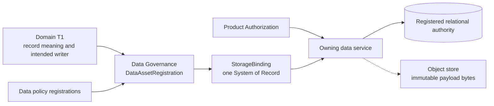

# Data Governance

**Purpose**: Define system-wide law for managed data authority, physical
binding, isolation, residency, lifecycle, recovery, and migration.

**Required reader gain**: A reader can identify the System of Record for a
record family, distinguish semantic ownership from physical custody, and know
which policy and evidence must accompany storage, migration, backup, restore,
export, and deletion. The reader can also distinguish a shared database-access
mechanism from the domain service that owns schema, SQL, and canonical writes.

## 0. Intent Capsule

```yaml
layer: T0
t0_layer_id: the_data_governance
status: candidate
canonical_owner: designDoc/the_data_governance.md
owned_system_object: managed Data Asset and physical Data Binding
scope:
  - managed Data Asset identity
  - System-of-Record and single-writer binding
  - tenant, Cell, classification, residency, licence, and export constraints
  - boundary between the shared DataAccessAdapter and the domain-owned Data Access Gateway
  - retention, legal hold, purge, backup, restore, migration, and retirement law
  - code-owned registration and generated inspection
non_goals:
  - domain record meaning, schema meaning, or business acceptance
  - concrete database product, driver, pool, credential backend, or deployment binding
  - System Change Case intake, scope assessment, Work Package coordination, Candidate Set assembly, or case closure
  - Principal, Entitlement, or authorization decisions
  - time-field meaning
  - workflow execution, evaluation, or provider behavior
  - software release or Independent Review verdicts
inputs:
  - domain-owned record-family contract
  - exact System Change Data Work Package when the Data candidate belongs to a governed mutation
  - Product Authorization data-access boundary
  - Timestamp Semantic requirements
  - code-owned storage and policy registrations
outputs:
  - DataAssetRegistration law
  - StorageBinding law
  - DataPolicyBinding law
  - DataMigrationRegistration law
  - DataAccessAdapter law
  - DataAccessBinding law
  - generated Data Governance inspection
truth_surfaces:
  - designDoc/the_data_governance.md
  - logical:data_governance_contract_registry
runtime_triggers:
  - managed Data Asset or Storage Binding change
  - migration, backup, restore, export, purge, or retirement request
downstream_consumers:
  - every T1 data owner and physical data service
  - Product Authorization, Agent Runtime, Contract Audit, and Software Delivery
open_decisions:
  - normalized target schema replacing predecessor assurance-specific records
  - complete registration coverage for managed data families
review_gate: design_doc_review and registered data-governance conformance
runtime_surface_ledger: generated from code-owned Data Asset, Storage Binding, DataAccessAdapter, DataAccessBinding, policy, migration, and lifecycle registrations
verification_hooks:
  - System-of-Record uniqueness and single-writer closure
  - tenant, Cell, residency, retention, migration, backup, restore, and purge policy tests
  - Adapter release, consumer binding, credential-reference, scope, retry, and audit-boundary tests
```

## 1. Authority

Data Governance answers:

> Which physical system is authoritative for this managed record family, and
> under which data-handling constraints?

The owning product or domain T1 defines record meaning, schema meaning,
business transitions, and the intended canonical write. Data Governance binds
that record family to one physical authority, one writer boundary, and one set
of handling policies.



Physical custody does not transfer semantic ownership. A database, replica,
backup, object store, search index, workflow history, cache, or exported file
does not become a second semantic authority because it stores readable bytes.

## 2. Target Data Authority

The enterprise target has three deliberate authority classes:

1. Git is authoritative for code, Design Docs, schemas, migrations, tests, and
   infrastructure definitions.
2. The registered relational System of Record is authoritative for managed metadata, domain state, identity,
   policy assignments, lineage, decisions, access evidence, and lifecycle
   records.
3. An admitted object store may hold large immutable payload bytes while
   the relational System of Record retains authoritative identity, ownership, hash, policy,
   lifecycle, and locator records.

Secret values belong to an admitted secret or key-management service. Managed
stores retain only the permitted secret identity, scope, lifecycle, and opaque
locator.

New managed product data must not introduce a file-authoritative business
state lane. Existing file-authoritative lanes require explicit migration
registration until retired.

## 3. Required Machine Contracts

| Machine contract | Responsibility |
| --- | --- |
| `DataAssetRegistration` | Identifies one managed record family, semantic owner, intended writer, System-of-Record binding, policy bindings, consumers, and lifecycle state |
| `StorageBinding` | Identifies one physical role such as System of Record, immutable payload, replica, projection, cache, backup, or migration source |
| `DataPolicyBinding` | Binds one exact tenant/Cell, classification, residency, retention, legal-hold, licence, export, or backup policy to an asset |
| `DataMigrationRegistration` | Defines current and target authority, legal forward and rollback transitions, reconciliation requirements, and retirement condition |
| `DataLifecycleEvidence` | Records backup, restore, migration, reconciliation, export, purge, legal-hold, or retirement evidence without becoming a release decision |
| `DataAccessAdapter` | Defines the shared mechanism interface for connection acquisition, transaction mechanics, workload-credential resolution, trusted tenant and Cell context injection, retry classification, and operation audit. It owns no domain schema, SQL, migration, query meaning, result mapping, writer rule, or authorization decision |
| `DataAccessBinding` | Binds one consumer to one exact DataAccessAdapter release, StorageBinding target, opaque workload-credential reference, server-resolved tenant and Cell scope, permitted operation class, and registered audit Data Asset. It is a data-boundary registration and never grants Product access |

Code owns exact IDs, schemas, bindings, policy versions, migration states,
implementation references, current coverage, and test results. Generated
inspection is the human-readable current inventory.

## 4. Core Data Laws

### 4.1 Sole authority and writer

- Each record family and scope has exactly one registered System of Record.
- Each canonical mutation enters through the registered writer boundary.
- Replicas, projections, caches, indexes, backups, workflow state, and exports
  cannot accept independent canonical writes.
- Cross-domain access uses an authorized service contract rather than direct
  internal-table or cross-domain filesystem access.

### 4.2 Tenant, Cell, authorization, and shared access mechanism

- Tenant and Cell identity are resolved by trusted services, never accepted
  from caller input as authority.
- Data isolation and Product Authorization are independent gates; both pass
  before access.
- A Dedicated Cell has independent credentials, key scope, Artifact namespace,
  backup scope, worker identity, and audit boundary. A pooled Cell must prove
  equivalent isolation.
- Agent Runtime, the admitted deterministic integration, providers, and tools receive bounded service or data
  handles rather than unrestricted database, filesystem, or object-store
  credentials.
- Database-backed domain services enforce authorized Agent operations through
  the shared Data Access Gateway contract. The Gateway combines Runtime Module
  authority with Product Authorization and creates no independent permission
  policy.

`DataAccessAdapter` and Data Access Gateway are different contracts. The
Adapter supplies reusable database-access mechanics. A Data Access Gateway is
the domain-owned enforcement surface that translates an authorized logical
operation into domain SQL or a domain command under the Product Authorization
enforcement law. Sharing one Adapter release or implementation never shares
domain SQL, schema ownership, data ownership, or canonical-writer authority.

The project host composition root, through its Code Projection, selects one
admitted Adapter implementation and injects it only through exact
`DataAccessBinding` registrations. Agency Platform may fulfill that host role
when installed; a standalone subsystem host may fulfill the same seam without
Agency Platform. Every consumer therefore receives its own target, credential
reference, tenant and Cell scope, operation class, and audit destination. The
Adapter cannot select a domain query, widen the authorized resource scope, or
become a cross-domain all-powerful Gateway.

Workload credential resolution is a hook into the admitted secret or
key-management custody service. The Adapter obtains one scope-bound credential
for the exact binding; it does not issue, mint, own lifecycle for, persist,
expose, or cache that credential beyond the bounded connection lease.

Retry classification is evidence, not execution authority. The Adapter reports
`retryable`, `non_retryable`, or `fenced`; the consuming writer's registered
recovery policy decides whether another transaction is legal. Transparent
Adapter re-execution of a non-idempotent operation or an operation with an
unknown commit outcome is forbidden.

Adapter operation audit is a registered Data Asset owned by the consuming
service and written inside that consumer's tenant and Cell audit boundary. Its
Timestamp-registered record class may carry identities, references, timing,
failure classification, and outcome class, but no domain content or secret. It
never substitutes for a Product Authorization decision record, a domain writer
record, or Runtime execution lineage.

The owning domain retains its schema contract, migrations, SQL and typed
result mapping, query semantics, and writer rules. Runtime-owned record stores
retain the same responsibilities for Runtime records. Models and Agent
processes receive neither raw database credentials nor an unrestricted
Adapter; an admitted Module may use only the exact domain-scoped operation
surface supplied through its execution binding.

### 4.3 Classification and derivatives

The stable classification order is:

```text
public < internal < confidential < restricted
```

Derived data inherits the strictest applicable tenant, Cell, classification,
licence, residency, retention, and export restrictions from its complete input
closure unless a registered declassification or projection policy proves a
narrower result.

An export is a governed derivative. It records source identity, recipient
scope, redaction policy, expiry, retention, and deletion behavior. Export does
not transfer System-of-Record authority.

### 4.4 Retention, backup, and recovery

- Legal hold suspends purge for its exact scope without rewriting the retention
  policy.
- Purge covers registered canonical content, payloads, replicas, projections,
  caches, indexes, exports, and backup-expiry obligations.
- A synchronization mirror is not a backup.
- Backup conformance requires independent failure protection and recurring
  restore evidence.
- Restore reconciles the same logical authority and cannot create a second
  active writer or reintroduce data beyond its retention boundary.

### 4.5 Migration and rollback

- Greenfield managed data starts on the target authority and does not traverse
  a predecessor migration state machine.
- Existing predecessors move only through registered adjacent transitions.
- Forward and rollback transitions are separately registered.
- Cutover requires writer fencing, consumer switch, reconciliation, and an
  explicit rollback window.
- Silent fallback to a predecessor reader or writer is forbidden.
- Retirement requires negative read/write evidence and final reconciliation.

## 5. Cross-T0 Handoffs

| Peer T0 | Boundary |
| --- | --- |
| System Change Governance | Supplies the exact Data Work Package and current Case/Plan lineage; Data Governance alone decides Data Asset, writer, placement, migration, retention, and recovery meaning |
| Artifact Graph | Owns the project Workflow, Operation, Artifact, and Design Contract index plus Artifact dependency and freshness relations; Data Governance owns physical record and payload bindings |
| Product Authorization | Decides who may perform an exact data operation; Data Governance supplies the resource, tenant, Cell, classification, residency, and lifecycle boundary enforced by the data service |
| Timestamp and Clock Semantics | Owns time-field roles and comparisons used by retention, expiry, migration, backup, and evidence records |
| Agency Platform | When it is the project host composition root, implements the registered DataAccessBinding injection seam and hosts Cell Data and Product Control services without becoming the semantic owner of their records |
| Agent Runtime | Consumes an injected DataAccessAdapter or domain-scoped data service and preserves isolation; Runtime history is not a domain System of Record, and Runtime does not resolve database credentials or select a driver or pool |
| Design Doc Management | Governs the intent contracts referenced by data registrations |
| Contract Audit | Audits immutable data registrations or evidence packages when a registered profile requires it |
| Software Delivery | Admits storage code, schemas, migrations, deployment, rollback, and retirement; Data Governance supplies the data-safety constraints |

Contract Audit may issue an Independent Review verdict and Software Delivery
may issue a release decision. Data Governance does not create a separate
generic verifier or production-release authority.

## 6. Code-as-Truth Boundary

This T0 contains no manually maintained asset, table, writer, storage,
migration, test, or admission inventory.

- The project-local Data Governance contract and registries own the current
  Data Asset, StorageBinding, DataAccessAdapter, and DataAccessBinding records
  and coverage.
- A project-local Platform service inventory may reference the exact
  DataAccessBinding and concrete implementation release that it hosts; it does
  not copy the binding fields or become their authority. Domain registries
  continue to own their schemas, migrations, operations, and writers.
- Generated Contract Reference and Current Status pages project code-owned
  definitions and registrations.
- Missing coverage remains explicitly missing or pending implementation.

Assurance-specific types and responsibility nodes never define a second Data
Governance authority. The target record families remain `pending
implementation`; current coverage and migration state come only from the
code-owned Registry and generated inspection.

## 7. Invariants

Data Governance is non-conformant when:

- one record family or scope has multiple active Systems of Record or writers;
- a file, replica, cache, backup, index, workflow history, or object store is
  treated as an independent domain authority;
- storage is treated as permission or semantic acceptance;
- a shared DataAccessAdapter contains domain SQL, schema, migration, query
  semantics, writer rules, or an independent authorization policy;
- a consumer receives database access without one exact DataAccessBinding, or
  a Platform inventory duplicates or overrides that binding;
- sharing an Adapter implementation is treated as permission to share a
  credential, tenant scope, Cell scope, or canonical writer;
- Adapter retry classification is treated as permission to re-execute a
  non-idempotent or unknown-outcome operation;
- Adapter operation audit crosses a tenant or Cell boundary, has no registered
  owning Data Asset, contains domain content or secrets, or substitutes for an
  authorization, domain, or Runtime record;
- Runtime or a domain service bypasses the registered Adapter binding to
  construct an unrestricted database connection;
- Product Authorization, Contract Audit, Software Delivery, or a domain owner
  is absorbed into Data Governance;
- a caller-supplied tenant or Cell identity selects the data boundary;
- derived or exported data silently weakens upstream restrictions;
- a migration skips registered transitions or silently falls back;
- restore, failover, or rollback creates a second writer;
- data is purged without closing registered derivatives and backup obligations;
  or
- prose or a generated view is used to override code-owned current bindings.

## References

- [Project Charter](the_charter.md)
- [System Change Governance](the_system_change_governance.md)
- [Agency Platform](the_agency_platform.md)
- [Agent Runtime](the_agent_runtime.md)
- [Product Authorization](the_product_authorization.md)
- [Artifact Graph](the_artifact_graph.md)
- [Timestamp and Clock Semantics](the_timestamp_semantic.md)
- [Design Doc Management](the_design_doc_management.md)
- [Contract Audit](the_contract_audit.md)
- [Software Delivery](the_software_delivery.md)
