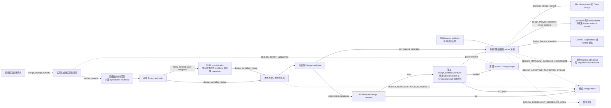
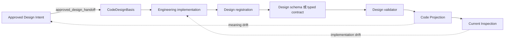
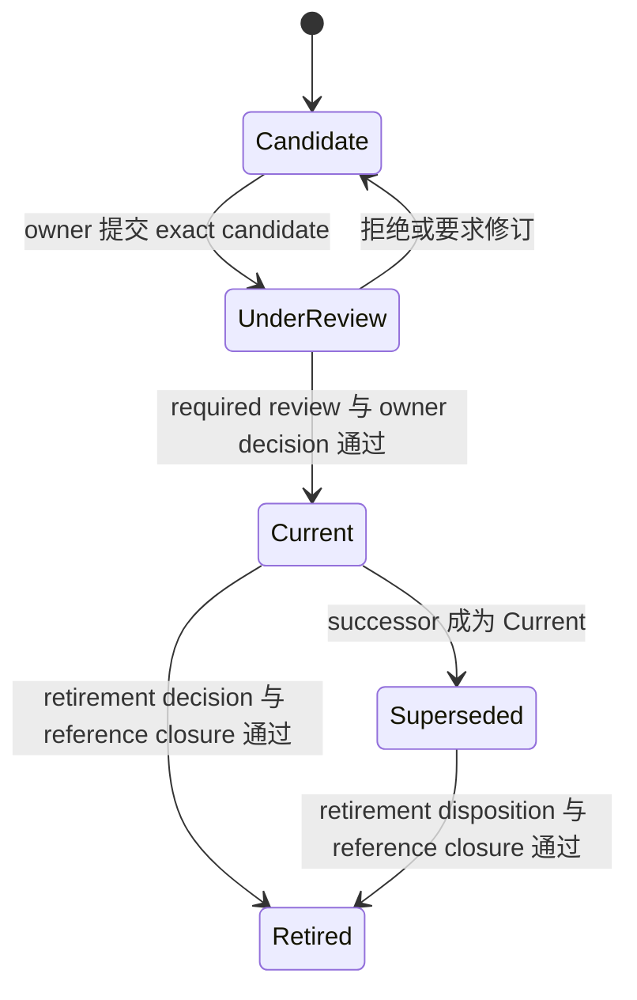

# 设计文档管理（Design Doc Management）

## 0. Intent Capsule

```yaml
layer: T0
t0_layer_id: the_design_doc_management
status: candidate
canonical_owner: designDoc/the_design_doc_management.md
owned_system_object: Design Intent
scope:
  - 项目 Charter 以及所有 T0、T1 和 T2 Design Doc
  - Design Doc 的创建、变更、批准、审计、生命周期和退役
  - 由可移植治理基线和项目 Charter 组装而成的项目 T0 authority
  - 分离 human intent、machine contract、code registration、persistent state、Skill projection 和 generated inspection
  - design-first 变更控制
  - 与层级相符的表达：Charter 的 constitutional authority，以及 T0、T1 和 T2 的 owner-local 流程、接口和错误语义
non_goals:
  - 由另一个 T0、T1 或 T2 拥有的业务语义
  - SystemChangePlan 创作和跨 owner 变更路由
  - 实现清单、当前 binding、release state 或测试结果
  - 外部 Independent Review 执行
  - 软件发布准入
inputs:
  - Principal Manager 或承担问责责任的 owner 意图
  - 拟议的 Charter、T0、T1 或 T2 设计变更及受影响的 contract 集合
  - Design 请求对应的精确、已审查 SystemChangePlan step
outputs:
  - 已批准或已拒绝的 Design Intent
  - material-change 分类
  - 所需的 machine-contract 和 implementation handoff
  - Design Doc 生命周期决策
truth_surfaces:
  - designDoc/the_design_doc_management.md
  - logical:t0_contract_registry
runtime_triggers:
  - 新 Design Doc 提案
  - material Design Intent 变更或退役提案
downstream_consumers:
  - Charter owner 以及每一位 T0、T1 和 T2 design owner
  - design_contract_reviewer、implementation 和 Software Delivery workflow
open_decisions: []
review_gate: material change 必须通过 design_contract_reviewer 语义审查，并获得 Principal Manager 或获委派 design owner 的批准
runtime_surface_ledger: 实现后从 code-owned design registrations 生成
verification_hooks:
  - Intent Capsule 验证和 canonical-owner 唯一性
  - 适用 layer 的 required-section schema、连续编号与 protected heading-name 闭合
  - 与层级相符的 Charter authority 闭合，或 owner-local primary-flow、interface-input/output 和 error-code 闭合
  - layer、parent、naming、materiality 和 lifecycle semantics 闭合
  - Design Intent、Code Projection 和 Current Inspection 分离
  - Design 退役之前，由 DDM-owned Design reference validator 解析的 active inbound-reference 闭合
```

## 1. Primary System Flow



| `interface_id` | 所属方 | 输入 | 输出 | 影响 | 错误码 |
| --- | --- | --- | --- | --- | --- |
| `design_change_classify` | Design Doc Management | 拟议的 Design 变更和受影响的 authority boundary | Material 或 non-material 分类 | 选择适用的 Design lifecycle gates；不创建 candidate | none |
| `design_request` | Design Doc Management | 已分类的问责意图，以及精确、已审查的 SystemChangePlan step | 已接受的创作范围，以及 layer、owner 和 required-result boundary | 允许所属 Design owner 形成 candidate，但不转移 Design Intent authority | `DESIGN_ENTRY_MISMATCH` |
| `design_candidate_freeze` | Design Doc Management | 已接受的创作范围，以及完整、由该层拥有的 Design Intent | 冻结的 Design candidate | 冻结一个可审查的语义 subject；不创建批准或实现状态 | `DESIGN_REPRESENTATION_INCOMPLETE` |
| `approved_design_handoff` | Design Doc Management | 精确冻结的 material candidate、通过 DDM schema 与 semantic validator 且 registered verdict 为 `passed` 的 `design_contract_reviewer` output，以及明确授权 implementation handoff 的问责 owner 决策；non-material 或 non-approving decision 不调用此接口 | 已批准的 machine-contract 和 Code Design handoff | 仅授权已声明的下一个设计或实现决策；不创建审查或发布准入 | `DESIGN_APPROVAL_EVIDENCE_INCOMPLETE` |
| `design_lifecycle_transition` | Design Doc Management | 当前 Design 状态和明确的 lifecycle-admission decision；material candidate 进入 `Current` 时还包括精确冻结 candidate，以及通过 DDM validator 且 registered verdict 为 `passed` 的 Reviewer output；`Current` 直接退役时还包括明确 retirement decision 和类型化引用闭合结果；`Superseded` 退役时还包括类型化引用闭合结果，以及已记录于 replacement/supersession decision 的 retirement disposition，缺少该 disposition 时则需明确 retirement decision | `Candidate`、`UnderReview`、`Current`、`Superseded` 或 `Retired` 生命周期状态 | 仅改变 Design 生命周期状态 | `DESIGN_APPROVAL_EVIDENCE_INCOMPLETE`、`DESIGN_LIFECYCLE_TRANSITION_INVALID`、`DESIGN_RETIREMENT_REFERENCE_OPEN` |

| `error_code` | 所属方 | 触发条件 | 含义 | 调用方动作 |
| --- | --- | --- | --- | --- |
| `DESIGN_ENTRY_MISMATCH` | Design Doc Management | 缺少所需的 SystemChangePlan step，或其 layer、owner、required result 或 produced subject kind 与 Design change 不匹配 | 未形成 Design candidate | 返回后继 SystemChangePlan |
| `DESIGN_REPRESENTATION_INCOMPLETE` | Design Doc Management | 所属 layer 的 required section 缺失、重复、乱序、为空、使用占位内容或承载错误含义，或其 constitutional authority、Primary System Flow、interface input/output 或 observable failure-code closure 不完整 | Candidate 无法指导实现或审查 | 修订同一个 Design candidate |
| `DESIGN_APPROVAL_EVIDENCE_INCOMPLETE` | Design Doc Management | Material candidate 进入 `Current` 或调用 material handoff 时，缺少绑定 exact candidate、覆盖全部 DDM checks、通过 DDM validator 且 registered verdict 为 `passed` 的 `design_contract_reviewer` output，或缺少分别明确授权 lifecycle admission 或 implementation 的 decision | 未发生 `Current` admission 或 implementation handoff | 返回承担问责责任的 Design owner；在补齐证据并取得对应 decision 前不得重试 |
| `DESIGN_LIFECYCLE_TRANSITION_INVALID` | Design Doc Management | 请求的生命周期转换或所需的问责决策无效 | Design 生命周期状态未改变 | 返回所属 Design owner |
| `DESIGN_RETIREMENT_REFERENCE_OPEN` | Design Doc Management | DDM-owned Design reference validator 报告存在未解决的 active inbound reference | 未发生退役 | 解决该引用或确定其 disposition，之后再重试退役 |

Design Doc Management 自己拥有 Design review 的 checklist、Reviewer prompt source、input/output
schema、host semantic validator 和完成证据语义。Review Contract 只提供机械注入的通用阶段与
instruction；Agent Runtime 只执行 Reviewer Module。两者都不取得 Design review result 或 owner
decision authority。

## 2. User Intent

Design Doc Management 让项目 Charter 和每一份 T0、T1、T2 Design Doc 都能在实现之前
明确表达 human intent。Design Doc Management 同时把这些 Design Intent 与
code-owned implementation truth 分开。它管理 Design Intent 的创建、修改、审查、
决策、生命周期和 `Retired` 状态，同时不接管各领域的业务语义。

## 3. Reader Gain

- Principal Manager 读完一份 Design Intent 后，能判断其中提出的变更是否属于
  material change，以及是否必须先批准再实现。
- Design Owner 读完 candidate Design Intent 后，能判断它属于 Charter、T0、T1 还是
  T2，该层必须表达什么，以及是否完整说明 `Retired` 条件。
- Architecture Reviewer 读完 frozen Design Intent candidate 后，能判断 owner、parent、
  peer、Flowmap、I/O 和 error boundary 是否闭合。
- Implementation Owner 读完 approved Design Intent 后，能判断它是否足以形成
  CodeDesignBasis，以及哪些缺失语义仍需 Design Owner 补齐。

## 4. Owned System Object

本 T0 拥有 `Design Intent`：它是承载稳定人类判断的陈述，用于说明一个 Charter、T0、
T1 或 T2 owner 在代码可以实现结果之前，表达什么含义、作出什么决策、委派什么事项，
以及提出什么要求。作为 `Design Intent` 管理的一部分，本 T0 同时拥有 Design review 的
checklist、`design_contract_reviewer` prompt source、input/output schema、semantic validator、
output/verdict meaning 和 accountable owner evidence requirement；这些 control surfaces 不构成第二个
owned system object。本 T0 不拥有 SystemChangePlan、实现、Runtime execution evidence 或软件发布。

项目 T1/T2 specialization 拥有具体的创作 workflow、tool 和领域特定 Design operation。
代码拥有 Registry、projection、validation 和 persistence mechanics。本 T0 定义通用的
intent law，并委派这些具体职责，而不维护其当前清单。

## 5. Authority

Design Doc Management 拥有作为一类 artifact 的 Design Doc 规则。每份 Design Doc 的
owner 拥有该文档内部的意图。Principal Manager 拥有 material product 和 architecture
决策。

正确的系统结果优先于形式化流程的完成。完成 authoring 或 review sequence 并不会让错误
设计变得正确。当证据暴露出错误的 boundary、contract 或 implementation 时，应在源头
修正所属 Design Doc 和 code truth；不得仅为保留既有流程或结构而增加补偿性的 shadow
path。

本合同回答：

1. Charter 或 T0、T1、T2 Design Doc 必须传达什么？
2. 哪种变更属于 material change，因而要求代码工作开始前获得批准？
3. 哪些陈述属于 human-maintained intent，哪些属于 machine-readable 或 generated
   surface？
4. Candidate 如何成为 `Current`、成为 `Superseded` 或退役？
5. Exact Design candidate 接受什么 Design review，什么 Reviewer output 可以作为 accountable owner
   decision 的 evidence？

本合同不判断研究结论是否正确、Runtime execution 是否成功，也不判断软件发布能否安全
部署。

## 6. 设计生产

本章只定义 Design Intent 如何在正确层级表达完整结果。它不拥有 Skill packaging、Reviewer
execution、代码布局或当前 implementation inventory。

### 6.1 合同层级与固定语义

<!-- design-layer-semantics:start -->
Charter、T0、T1 和 T2 都必须明确 `User Intent` 与 `Reader Gain`。`User Intent` 说明
contract 为什么存在以及它服务的 product outcome。`Reader Gain` 同时写明读者，以及
读完后新增的区分、决策或执行能力。

所有 Design Doc 的解释性正文以中文为主体；受保护 heading、registered identifier、
`interface_id`、`error_code`、schema field、code symbol、path 和需要精确匹配的引用标识符
保持原样，不另造翻译名。标题以下的 section 使用连续数字编号；编号只服务
阅读导航，不表达 authority、priority、lifecycle 或执行顺序。

| Layer | 拥有的设计问题 | 必须表达的结果 | 必须下沉的内容 |
| --- | --- | --- | --- |
| Charter | 项目的 constitutional identity 与 human authority | product identity、scope、Principal Manager authority、constitutional invariants、Design/code boundary、amendment authority，以及对当前 T0 topology projection 的类型化引用 | Operational flow、peer interface/error、Runtime binding、Reviewer execution 和当前 T0 inventory |
| T0 | 多个独立 T1 必须一致回答的一个 system-wide question | `User Intent`、`Reader Gain`、`Owned System Object`、`Authority`、`System-wide Invariants`、`Peer Boundaries`，以及 T1 delegation、machine-enforcement result 和 review requirement | T1/T2 workflow、code field、provider、directory、database、Reviewer Module execution 和 peer internal contract |
| T1 | 一个 project domain 或 independently governed product boundary | Domain outcome、objects/states、architecture/lifecycle、public boundary、quality rules、loops、human decision gates、inherited T0 constraints、dependencies、T2 partition、completion 和 failure | T2 operation detail，以及其他 T0 拥有的 authorization、data、time、Runtime、audit 和 delivery law |
| T2 | 一个 T1 domain 内的有界 capability，以及它与 code truth 的稳定交界 | Capability intent、boundary，以及实现该 capability 所需的最小适用 machine-contract/code-truth 集合；按实际需要表达 operation、I/O、effect、failure、interface/Protocol、state、transaction、replay/recovery、Schema/Registry/Validator identity、Code Projection/Current Inspection binding 和 verification | 第二个 domain root、parent authority 扩张、cross-domain ownership，以及与本 capability 无关的 machine surface；exact path、当前 class/module layout、物理 schema/table、current version/hash/binding、测试数量和 deployment state |

T2 的 machine-contract/code-truth 项不是统一必填清单。Pure transformation 不必发明 state、transaction、
idempotency 或 rollback；没有 public operation 的 internal capability 不必发明 public interface；不使用
Schema、Registry 或 Validator 的 capability 不得为形式闭包创建它们。T2 只冻结下一层无需重新设计所必需的
最小适用集合，并对不适用的 required section 明确写 `none` 或 `not applicable` 及原因。

新 capability 尚无 implementation 时，T2 固定 required code-truth result 与 implementation handoff；已有
implementation 时，T2 绑定适用的 immutable `Code Projection`，并把 mutable current version、binding、
inventory 和 gate result 留给 `Current Inspection`。两种情况都不能从 current code 反向发明 capability intent。
<!-- design-layer-semantics:end -->

T0 的六个 authority headings 是 `User Intent`、`Reader Gain`、`Owned System Object`、
`Authority`、`System-wide Invariants` 和 `Peer Boundaries`。§6.2 另行登记每个 layer 的完整
protected required-section sequence；两者承担不同作用。T1 delegation、machine-enforcement result
和 review requirement 是 T0 的全文义务，不要求新增同名 heading。某项义务不能成为复制 child、
peer、code 或 Reviewer control plane 的理由。

Charter、T0、T1 和 T2 都使用 `## 0. Intent Capsule`。其中的 fenced YAML 保留以下 stable fields：
`layer`、`status`、`canonical_owner`、`owned_system_object`、
`scope`、`non_goals`、`inputs`、`outputs`、`truth_surfaces`、`runtime_triggers`、
`downstream_consumers`、`open_decisions`、`review_gate`、`runtime_surface_ledger` 和
`verification_hooks`。T0 另外必须包含唯一的 `t0_layer_id`；T1 和 T2 另外必须包含唯一
`parent`；Charter 不包含 `t0_layer_id` 或 domain parent。
`inputs` 只放本 authority 接受的
work-plane input 或精确、已审查的 SystemChangePlan step；parent、peer 和 dependency
reference 留在对应 boundary 与 reference section。

T1 的 canonical 文件名是 `<domain>_00_<subject>.md`。每个 active domain 恰好有一个
active `00` root。T2 的 canonical 文件名是 `<domain>_<NN>_<subject>.md`，其中 `NN`
不能是 `00`；相同 domain prefix 将它绑定到唯一 T1 root。Cross-domain reference 是
dependency，不是额外 parent。Numeric family 只服务人类导航，不表示 authority、lifecycle
或执行顺序。

### 6.2 Layer-specific required sections

每一份 Charter、T0、T1 或 T2 Design candidate 都必须符合所属 layer 的 required-section
schema。下表中的 heading name 是 protected identifiers，必须恰好出现一次并保持表中顺序；
连续数字编号仍按文档实际章节位置生成。`<layer-owned sections>` 是所属 owner 可以增加的连续
编号章节，但不能删除、改名、重排或复制 protected headings，也不能借扩展章节吸收 parent、peer
或 child authority。

| Layer | Required section sequence |
| --- | --- |
| Charter | `Intent Capsule` → `Constitutional Authority Map` → `User Intent` → `Reader Gain` → `Product Identity and Scope` → `Human Authority` → `<constitutional sections>` → `Constitutional Invariants` → `Design and Code Boundary` → `Amendment Authority` → `T0 Topology Reference` → `References` |
| T0 | `Intent Capsule` → `Primary System Flow` → `User Intent` → `Reader Gain` → `Owned System Object` → `Authority` → `<T0-owned sections>` → `System-wide Invariants` → `Peer Boundaries` → `References` |
| T1 | `Intent Capsule` → `Primary System Flow` → `User Intent` → `Reader Gain` → `Domain Outcome and Owned Objects` → `<domain-owned sections>` → `Architecture and Lifecycle` → `Public Boundaries and Quality Rules` → `T2 Partition and Dependencies` → `Completion and Failure` → `References` |
| T2 | `Intent Capsule` → `Primary System Flow` → `User Intent` → `Reader Gain` → `Capability and Operation` → `<capability-owned sections>` → `Public Interface and Effects` → `Completion, Failure, and Recovery` → `Dependencies and Verification` → `References` |

Required section 存在只证明 representation closure。对应章节仍必须表达本层在 §6.1 中拥有的
结果；空章节、占位文字或把同一含义搬入错误章节均返回
`DESIGN_REPRESENTATION_INCOMPLETE`。新增一种 Design layer、修改 protected heading、改变顺序
或改变 extension slot 都是 material DDM change。

`none` 或 `not applicable` 只有在同时说明该 capability 为什么不需要对应 machine surface 时，才是有效的
layer result；没有理由的空章节或占位词仍属于 `DESIGN_REPRESENTATION_INCOMPLETE`。

Code-owned Governance Release control 在 Design Doc Management 名下登记唯一的 Design-document
schema binding。Schema 验证从 Markdown 确定性解析出的 Design candidate，而不把 Markdown 文件本身
当 JSON。Design parser、validator 和 projector 可以拥有各自 code layout，但都必须解析同一个
schema binding，不能保存第二份 required-section list。Schema 的 physical path、hash、projector
version 和当前 binding 属于 code truth，并由 generated inspection 展示；本 T0 只规定它们必须唯一、
可解析并形成 hash closure。消费项目只提供 project-specific Charter、Design registration 和
Current Inspection binding，不复制或改写 portable schema。新 candidate 和发生 material revision
的既有 Design Doc 必须绑定 current schema release；尚未迁移的既有文档保持已登记状态，并在下一次
material revision 前不得被投影为符合 current schema。

### 6.3 流程优先的表达

Charter 必须提供 `Constitutional Authority Map`，但不要求 operational flow。每个 T0、T1
和 T2 candidate 都在 extended prose 之前提供 `## 1. Primary System Flow`，并按所属层
展示最小充分关系：

| Layer | Flowmap 必须使读者看见的结果 |
| --- | --- |
| T0 | System responsibility、authority、peer handoff 和 T1 delegation |
| T1 | Domain objects/states、architecture/lifecycle、public boundary、quality rules、loops、human decision gates、dependencies 和 T2 partition |
| T2 | Concrete operation、effect、completion 和 recovery |

Flowmap 只使用 logical responsibility、state 和 governed resource。每条 owner-local
public handoff 解析到一行 interface contract，包含 `interface_id`、owner、input、output、
effects 和 error codes。每条 caller-visible failure 解析到一行 error contract，包含
`error_code`、owner、condition、meaning 和 caller action。Internal diagnostic 留在 code
和 telemetry。

如果该层没有 owner-local public operation 或 caller-visible failure，相应表格明确写
`none`。Peer 只作为 owner-qualified input、output、decision 或 result 出现；消费方不能
复制 peer 的 internal flow、interface、error 或 caller action。

本规则适用于新 candidate，以及 material revision 实际改变的完整 surface。已准入的旧
文档在下一次 material revision 时迁移，projector 不会只为增加 syntax 而改写其语义。

### 6.4 创作边界与退出条件

Design owner 只创作本层拥有的语义。Layer、parent、same-level peer 或 authority 尚未解决
时，authoring 必须返回对应 Design owner 或 System Change scope；filename、附近 Skill、
current code 和 ambient repository state 不能替代该决定。

Skill Package 可以保存完整的 Agent-facing authoring instruction，也可以作为
`design_contract_reviewer` prompt 的物理承载位置，但它不因此取得 Design authority。Design Doc
Management 拥有 Design review checklist、prompt source、schema、semantic validator 和 output
meaning。Skill Management 只治理承载该 source 的 Skill definition、candidate、artifact envelope、
完整性和 Skill review，不能修改 Design Reviewer instruction meaning，也不拥有 retirement 或整体删除
disposition。Design Reviewer prompt 的语义变更先形成 DDM-owned Design candidate，并由
`design_contract_reviewer` 审核。Design meaning 通过后，DDM 把 exact approved meaning 交给 Skill
Management，作为 containing Skill candidate 的语义输入。Skill Management 按自己的 contract 消费
Review Contract-owned prompt authoring/review results，并把最终完整、已审核的 Skill result 返回 DDM。
DDM 不控制或复制 peer 的 internal review flow、checklist 或 caller action。

## 7. 代码生产

本章只定义 approved Design Intent 交给代码时必须保持的结果。它不规定 physical module、
field、table、storage、validator implementation 或 current binding。

### 7.1 三个 truth surface

| Truth surface | 拥有的含义 | 不拥有的含义 |
| --- | --- | --- |
| `Design Intent` | Human-judged outcome、authority、invariant、boundary、target behavior、public handoff 和 material open decision；T2 还包含 capability 所需的最小适用 machine-contract/code-truth requirement | Physical implementation layout、当前 binding、implementation status 或 operational inventory |
| `Code Projection` | Approved identity、parent、dependency，以及适用的 interface、Schema/Registry/Validator identity 和 enforcement result 的不可变机器表示 | Mutable lifecycle、deployment、test 或 current pointer；T2 未要求的 machine surface |
| `Current Inspection` | 当前 lifecycle、admission、implementation、evidence 和 operational fact 的 generated view | Design authority 或 release identity |

Design Doc 可以要求 logical machine contract，并说明代码执行后必须观察到的结果。T2 只要求本 capability
实际需要的 machine contract；它可以固定 stable interface/Protocol 或 Schema/Registry/Validator identity，
但不能把这些可能项变成所有 T2 的必填项。Code Design 与 implementation 决定 physical path、具体 class、
field、module layout、validator implementation 和 storage。Prose 中的当前 implementation fact 只是解释，
不成为 manually maintained inventory。

新 T2 在 implementation 前可以只有 required code-truth result。Implementation 产生 `Code Projection` 后，
该 projection 在被用作 Design review、drift 或 closure evidence 前，必须通过 §9.1 已登记的确定性验证并与
exact T2 identity 绑定；缺失或无法解析时返回 implementation owner，不能用 prose 声称 closure。没有
applicable machine surface 的 T2 不为满足该规则创建空 Registry、Schema、Validator 或 projection。

当 Design identity 同时包含 `Design Intent` 和 immutable `Code Projection` 时，review
subject 绑定二者；任一变化都形成新的 subject。刷新 `Current Inspection` 不改变 Design
identity。Inspection 暴露的 drift 返回真实 Design 或 implementation owner。

### 7.2 Design-to-code handoff



`approved_design_handoff` 交付 approved outcome、authority、invariant，以及本层已经决定的最小适用
machine contract。后续实现不能静默改变这些已批准 meaning；仍未由 Design Intent 决定的 code-design
事项全部交给 Software Delivery 拥有的 `CodeDesignBasis`。DDM 不重述或收窄该 peer contract 的内部范围。
T2 未声明为 applicable 的 machine surface 不因进入 Code Design 自动变成必需。
Software Delivery 拥有 implementation、release、deployment 和 rollback admission。

Design Doc 的机器闭包固定为 `register → validate → project → inspect`。其中 registration、
schema 或 typed contract、validator、projection 和 inspection 都只服务 Design artifact；Skill
和 Runtime Module 分别使用自己 authority 下的 registration、schema 和 validator。三类对象可以
复用相同机械顺序，但不得共用字段集合、生命周期或准入 authority。

Governance Release control 统一执行整个 portable T0 portfolio 的 source hash、schema binding、
projection dependency 和 drift closure。Design Doc Management 只登记自己拥有的 Design schema、
Design projection 和 Design Reviewer checklist projection；其他 artifact authority 登记自己的
contract。共同代码只计算、验证和投影，不取得 Design 或 Skill 的语义 authority，也不把两类
artifact 合并成一个通用 schema。

DDM required-section validator 只从上述唯一 Design schema binding 读取，并独立拒绝 required section
缺失、重复、乱序或为空。DDM Reviewer projection 只把 §9.2 的 authoritative check set 及其顺序和
meaning 机械投影到 `design_contract_reviewer` 的受控 checklist block；不得把 section existence、顺序、
hash 或其他 machine-decidable representation checks 再交给 Reviewer 判断。该 prompt 属于
DDM-owned Design review source，并物理存放在 `the-design-authoring` Skill Package；存放位置、Skill
artifact validation 或投影不会把 source authority 转移给 Skill Management。共同 release
记录必须绑定 DDM source release、Design schema hash、projector hash 和 prompt target hash；任一
不一致时，Design Reviewer candidate 不得通过 deterministic gate。Reviewer prompt 不得手抄、增删
或重排 DDM-owned semantic checklist。共同代码还必须按 Review Contract 的 canonical marker/source
binding 验证 universal instruction block 的 exact-byte parity；该验证不把 universal instruction authority
转移给 DDM。DDM 不另建一套 release manifest 或 hash mechanism。

代码必须能够机械验证以下结果：Design identity 与 owner 唯一；Charter/T0/T1/T2 layer 和
parent closure 正确；materiality 与 lifecycle transition 合法；required Design review 和
accountable decision 绑定 exact candidate；active reference 在 retirement 前闭合；generated
inspection 可由 code 和 persistent record 复现。实现这些结果的 Registry、Schema、字段和
Validator 由代码拥有。

## 8. 设计管理

本章管理 Design lifecycle、materiality 和 project-facing projection。它不重新定义 Design
内容、Reviewer execution 或软件交付状态。

### 8.1 Lifecycle



`Candidate`、`UnderReview`、`Current`、`Superseded` 和 `Retired` 只描述 Design Contract
release。被拒绝的 `UnderReview` candidate 回到 `Candidate`，保持 non-current；不新增
rejection state。Successor 在审查期间不改变 predecessor 的 `Current` authority；successor
成为 `Current` 后，predecessor 才成为 `Superseded`。

进入 `Current`、授权 implementation handoff 和 Software Delivery admission 是三个不同
结果。Material candidate 进入 `Current` 需要 exact review evidence 和 accountable lifecycle
decision；implementation handoff 另需明确授权。一个 owner decision 可以分别表达两项决定，
但任何一项都不自动推出另一项。

Design retirement 消费 DDM-owned Design reference validator 产生的 owner-qualified reference-closure result。
有 replacement 时，supersession decision 可以预先记录 reference closure 后的 retirement
disposition；否则仍需明确 retirement decision。没有 replacement 的整体下线必须取得明确
retirement decision。`Retired` identity 保持可追溯且不再可路由。

### 8.2 Material change

改变下列任一含义属于 material change：

- canonical identity、owner、layer、parent 或 responsibility boundary；
- authority、entitlement、human gate 或 canonical-write decision；
- public input、output、state、error 或 compatibility semantics；
- evidence、quality gate、review requirement 或 accountable decision；
- data authority、residency、retention、migration 或 Timestamp meaning；
- workflow graph、loop、execution class、Runtime contract 或 release unit；
- protected side effect、recovery 或 rollback obligation。

Editorial clarification、corrected link 和 generated projection refresh 只有在保持上述全部
含义不变时才是 non-material。Non-material classification 免除 material review 和 approval，
不免除 SystemChangePlan、owner resolution 或 exact change scope。

### 8.3 Portable 与 project-facing Design

Portable governance distribution 提供 reusable T0 Design Intent；消费项目提供自己的
Charter，并以 deterministic tooling 投影 project-facing T0 authority。Charter 决定需要的
constitutional authority classes；code-owned Design Registry 生成当前 identity、owner binding、
Design reference 与 topology。Directory membership 或 filename glob 不创建 authority。

安装未变化的 portable intent 只运行 compatibility、hash 和 projection checks，不创建第二次
semantic review 或第二个 Design authority。`Current Inspection` 展示安装版本、lifecycle、
binding、reference、conformance 和 drift；编辑 generated output 不能改变任何 Design state。

## 9. 审查与完成

Design Doc Management 拥有 Design Intent 的 review subject、semantic criteria 和
accountable decision 所需 evidence，也拥有 `design_contract_reviewer` 的 checklist、target-specific
prompt source、input/output schema、semantic validator 和 output meaning。同级 T0
`the_review_contract.md` 拥有 universal instruction 与 `审查与完成` 四部分的共同含义；Agent Runtime
只拥有 execution 和 execution evidence。

任何 Design Doc 需要为其 owned subject 增加 `审查与完成` 时，都把它放在所属 layer 的 registered
extension slot 最后，紧邻该 slot 的下一 protected heading，并使用以下四个连续子章节：`确定性检查`、
`语义审查`、`表达审查`、`完成条件`。因此 T0 位于 `System-wide Invariants` 前；Charter、T1 和 T2
分别位于 §6.2 为其声明的下一 protected heading 前。DDM 不决定某份 Design 是否需要该章节；owning
Design 根据自己的 subject 与 required result 作出该决定。

DDM 只固定章节位置与结构；同级 T0 `the_review_contract.md` 定义四部分的共同含义；使用该章节的
subject authority 填写自己的 code gate、semantic checklist、Reviewer output 和 completion evidence。

### 9.1 确定性检查

进入 `design_contract_reviewer` 前，code 必须先检查 Design structure、required section、identity、owner、
layer/parent binding、exact bytes、schema、hash、checklist projection 和 Reviewer prompt source closure。
DDM 定义必须得到什么确定性结果；code-owned Registry、Schema、Validator 和 generated inspection 保存并
报告当前机器 truth。Design Doc 不复制 current code state，也不能用 prose 声称 gate 已通过。失败时
code 直接返回 Design 或 implementation owner，不调用 semantic Reviewer。

### 9.2 语义审查

Design review 只审 exact frozen Charter、T0、T1 或 T2 candidate。Subject 包含完整 candidate
Design Intent，以及判断该 candidate 所必需的 Charter、parent、same-level peer、dependency
和 inherited-constraint context。当 immutable `Code Projection` 属于 Design identity 时，
subject 同时包含该 projection。`Current Inspection` 只作为 drift 或 implementability evidence。
新增、拆分、合并或改变同级 responsibility boundary 时，context 必须包含完整 same-level peer
set，使 Reviewer 能判断新结构是否重复、遗漏或侵入既有 authority。

Context 不会因为被提供给 Reviewer 就成为 candidate。跨 owner 变更形成分别由各 owner
拥有的 candidates。Filename、directory、file count、ambient repository search、模型或
provider 都不能创建 subject identity、Design authority 或 Reviewer routing。

下表是 Design review 的唯一 authoritative check set。它的 `check_id`、顺序和 meaning 同时定义
本文件所称的 `required checks`、`全部 DDM checks` 与 Reviewer 必须执行的完整集合。前十项属于
semantic stage；只有前十项全部通过后，才对同一份 exact candidate bytes 执行第十一项。§7.2
只把本表机械投影进 `design_contract_reviewer`，不能另造、删减或重排 check。

| 顺序 | `check_id` | 必须确定的结果 | `finding_class` |
| --- | --- | --- | --- |
| 1 | `intent_and_reader_result` | `intended_result`、`User Intent`、`Reader Gain` 和 material Design choice 清楚一致；`Reader Gain` 说明 reader 与新增能力 | `intent_gap` |
| 2 | `layer_owner_and_parent` | layer、identity、owner、parent、same-level peer、dependency 和 structural disposition 一致；完整 peer set 不重复、不遗漏、不侵入 authority | `layer_or_owner_defect` |
| 3 | `layer_content_fit` | owned object 唯一；authority、inheritance、delegation 和 layer scaffold 正确；只包含本层相关内容；T2 只闭合 capability 所需的最小适用 machine-contract/code-truth 集合，不为形式完整发明不适用的 surface | `layer_content_misfit` |
| 4 | `peer_authority_and_inheritance` | inherited constraints、peer handoff、dependency direction 和结构变更 coverage 闭合；不复制 peer internal contract | `peer_or_inheritance_conflict` |
| 5 | `boundary_coherence` | semantic owner、author、operator、Reviewer、persistence owner、implementation binding 与 approval authority 保持可区分 | `boundary_ambiguity` |
| 6 | `design_and_code_truth_separation` | Design Intent、required code-truth result、immutable Code Projection 与 mutable Current Inspection 分离；T2 的 applicable binding 不遗漏，也不把所有可能 machine surface 变成必填项 | `code_truth_leakage` |
| 7 | `flow_interface_and_error_closure` | 适用的 layer Flowmap、owner-local interface/error、图、表和正文互相解析；parent 不复制 child row | `flow_or_interface_closure_gap` |
| 8 | `failure_completion_and_rollback` | invariant、public handoff、failure、completion、recovery、rollback、materiality 和 lifecycle obligation 属于正确 layer | `failure_or_completion_gap` |
| 9 | `implementability_without_redesign` | 下一层无需补一个未声明的 authority、product behavior、boundary、payload、failure、peer decision 或 applicable stable machine-contract identity；不适用的 machine surface 无需占位实现 | `implementability_gap` |
| 10 | `review_approval_and_admission` | independent review、owner decision、Design admission、implementation completion 与 release 是不同决定 | `review_or_admission_conflict` |
| 11 | `prose_and_meaning_preservation` | Semantic stage 全部通过后，同一份 exact candidate bytes 可被冷读并准确复述，且不改变 governing meaning | `prose_or_communication_defect` |

每个 check 只接受表中登记的 `finding_class`。同一根因影响同一 class 的多个判断时只生成一条 finding；
跨不同 class 时分别生成 finding，并在 `required_change` 中指向同一个待恢复结果，不能把一个 finding ID
挂到不匹配的 check。

Reviewer 只能基于 exact evidence 报告 finding，并把 correction 路由给拥有相关含义的 owner；
它不能编辑 candidate、替 owner 选择设计或审查 peer implementation。Machine-decidable
representation check 由 code validator 执行；semantic Reviewer 不能用散文替代失败的
deterministic gate。

### 9.3 表达审查

全部适用的 semantic criteria 通过以后，同一份 exact candidate bytes 还必须让冷读者准确复述
governing meaning，而且不能改变数字、归因、
authority、因果、不确定性、compatibility 或停止条件。Review Contract 决定统一的阶段顺序；本 T0
定义 Design review 必须保留的 semantic 与 prose 结果。

### 9.4 完成条件

Material Design candidate 必须取得 `design_contract_reviewer` 对 exact subject 的完整判断。
该 Reviewer 必须独立判断本章定义的 semantic 与 prose 结果，并返回符合 DDM-owned output schema
且通过 DDM-owned semantic validator 的 output。Reviewer prompt source 和 checklist 由 DDM 拥有；
Review Contract 提供通用规则；Agent Runtime 提供执行。DDM 不复制 Runtime 内部流程或 error codes。

只有该 output 与 exact candidate、required checks 和 registered verdict 一致时，它才可作为
accountable owner decision 的 evidence。相近 Reviewer、unmanaged prose review 或缺失 binding
不能满足 gate。Design owner 决定接受、拒绝或修订；Reviewer finding 本身不改变 lifecycle、
authority 或 implementation authorization。

Registered verdict meaning：

- `passed`：前十项 semantic checks 与第十一项 prose check 全部通过，且没有 `block` 或 `fix` finding；
- `non_pass`：required closure 足以判断，但存在 candidate 或 authoritative context owner 可以修正的
  `block` 或 `fix` finding；
- `blocked`：required authority 或 semantic context 缺失、冲突，导致至少一项 required judgment 无法
  成立，并返回至少一条 `block` finding 给真实 owner。

Registered severity meaning：`block` 表示当前结果不能安全推进；`fix` 表示 exact candidate 中存在由
candidate owner 可修正的缺口；`note` 只记录不阻止当前 verdict 的观察，不使 check disposition 失败。

## 10. System-wide Invariants

1. 每份 Design Doc 都有一个 canonical identity 和一个 Design owner。
2. Charter、T0、T1 和 T2 的 authority 不得由 filename、directory、Skill、Runtime 或 current code 反向推断。
3. 每个 T0 只拥有一个 system-wide object 或 decision；每个 T1 命名 inherited T0 constraints；每个 T2 只拥有一个 T1 内的有界 capability。
4. 每个 active domain 恰好有一个 active `<domain>_00_*` root；same-domain、non-`00` Design Contract 都是该 root 下的 T2。
5. 每个 T0、T1 和 T2 都提供 layer-specific Flowmap、owner-local I/O 和 stable caller-visible error semantics。
6. Design Intent、Code Projection 和 Current Inspection 始终保持分离；generated view 绝不成为 editable authority。
7. Material Design review 和 accountable approval 先于 production implementation；production implementation 还必须绑定 approved `CodeDesignBasis`。
8. Machine-decidable Design obligation 必须由 code 执行；prose 不能声称一个不存在的 validator 已经执法。
9. Independent Review 不成为 authoring、repair、approval 或 self-admission。
10. Lifecycle state、implementation authorization 和 Software Delivery admission 是不同决定；任一结果都不能静默推出另一个结果。
11. `Superseded` 和 `Retired` identity 保持可追溯；active inbound reference 未闭合时不能退役。
12. 每个 Design candidate 绑定其 exact reviewed SystemChangePlan step；该 binding 不把 Design lifecycle 或 authority 转移给 System Change Governance。
## 11. Peer Boundaries

| 交接事项 | Design Doc Management 负责 | Peer authority 负责 |
| --- | --- | --- |
| System change | 声明 Design candidate 的 layer、owner、required result 和 review requirement | System Change Governance 规划跨 owner 顺序和 exact step |
| Design content | 定义 artifact law、layer semantics、lifecycle 和 review criteria | 各 Charter、T0、T1 或 T2 owner 定义本 contract 内的 intent |
| Product decision | 标记 materiality 和所需 evidence | Principal Manager 或明确获委派的 owner 作出 product-level decision |
| Design references | 声明 required parent、peer、dependency 和 retirement condition，并由 DDM-owned validator 生成 inbound-reference closure result | 被引用的 Design owner 决定其自身 lifecycle 与 reference disposition |
| Agent-facing method | 定义必须保持的 Design semantics，并拥有 `design_contract_reviewer` source meaning | Skill Management 拥有 authoring Skill definition、candidate、artifact envelope 与 Skill review；System Change Governance 拥有 Skill retirement/整体删除 disposition 与 owner routing；code 拥有 projection mechanics；均不拥有 Design Reviewer source meaning |
| Independent review | 拥有 Design checklist、`design_contract_reviewer` prompt/schema/validator/output，并消费验证结果；固定可选 `审查与完成` 章节的结构 | Review Contract 拥有 universal instruction 与 `审查与完成` 四段的共同含义；Agent Runtime 拥有 Module execution |
| Machine implementation | 提供 approved Design Intent 与 logical enforcement result | Code 拥有 Registry、Schema、field、validator、persistence 和 generated inspection |
| Software delivery | 提供 approved Design handoff 和 material obligation | Software Delivery 拥有 CodeDesignBasis、implementation、release、deployment 和 rollback admission |
| Portable deployment | 提供 reusable T0 Design Intent 和 DDM-owned Design artifact binding | Governance Release code 统一维护 hash、schema-binding 和 projection mechanics；消费项目提供 Charter 和 local bindings |

## 12. References

- Project Charter（由消费项目提供）
- [System Change Governance](the_system_change_governance.md)
- [Skill Management](the_skill_management.md)
- [Review Contract](the_review_contract.md)
- [Agent Runtime](the_agent_runtime.md)
- [Software Delivery](the_software_delivery.md)
