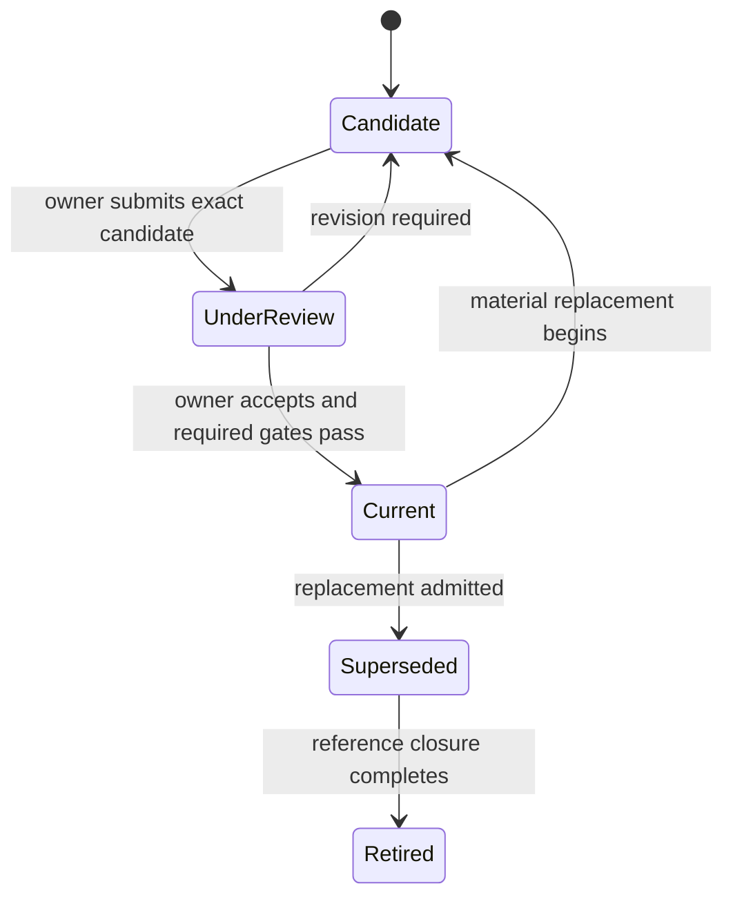
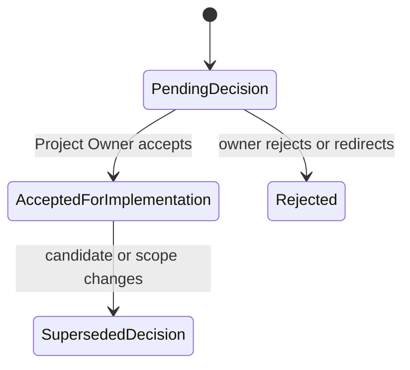
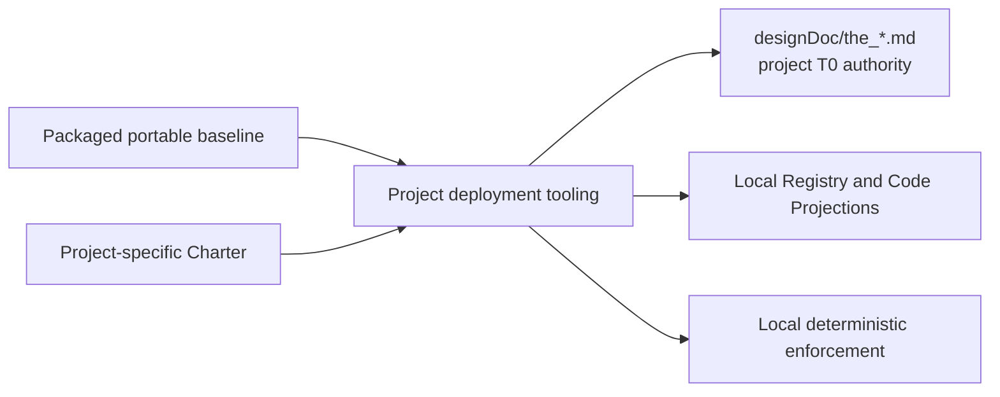

# Design Doc Management

**Purpose**: Govern the creation, change, review, lifecycle, and auditability of
every T0, T1, and T2 Design Doc while keeping human intent separate from code-owned
implementation truth.

**Required reader gain**: A reader can write the minimum sufficient Design Doc,
decide whether a proposed change requires owner acceptance before implementation,
identify which facts belong in code, and distinguish Design Doc review from an
external Independent Review.

## 0. Intent Capsule

```yaml
layer: T0
t0_layer_id: the_design_doc_management
status: candidate
canonical_owner: designDoc/the_design_doc_management.md
owned_system_object: Design Intent
scope:
  - all T0, T1, and T2 Design Docs
  - Design Doc creation, change, approval, audit, lifecycle, and retirement
  - project T0 authority assembled from the portable governance baseline and project Charter
  - separation of human intent, machine contract, code registration, persistent state, Skill projection, and generated inspection
  - design-first change control
non_goals:
  - business semantics owned by another T0, T1, or T2
  - implementation inventories, current bindings, release state, or test results
  - external Independent Review execution
  - software release admission
inputs:
  - Project Owner or delegated design-owner intent
  - proposed T0, T1, or T2 design change and affected contract set
owned_specialization_contracts:
  - designDoc/the_skill_management.md
outputs:
  - approved or rejected design intent
  - material-change classification
  - approved Code Design handoff for material implementation
  - required machine-contract and implementation handoff
  - Design Doc lifecycle decision
  - project-local T0 Design Intent surface, including the product Charter
truth_surfaces:
  - designDoc/the_design_doc_management.md
  - logical:t0_contract_registry
runtime_triggers:
  - new Design Doc proposal
  - material Design Intent change or retirement proposal
downstream_consumers:
  - every T0, T1, and T2 design owner
  - implementation, Contract Audit, and Software Delivery workflows
open_decisions:
  - one registered T1 lifecycle vocabulary replacing proposal and candidate aliases
review_gate: Project Owner or delegated design-owner acceptance for material changes
runtime_surface_ledger: generated from code-owned design registrations after implementation
verification_hooks:
  - Contract Capsule validation and canonical-owner uniqueness
  - registry, frontmatter, specialization-owner, and generated-index parity
```

## 1. Authority

Design Doc Management owns the rules for Design Docs as a class. Each Design
Doc owner owns the intent inside that document. The Project Owner or an
explicitly delegated design owner accepts material product and architecture
decisions.

Correct system outcomes take precedence over ceremonial process completion.
Passing an authoring or review sequence does not make an incorrect design
correct. When evidence exposes a wrong boundary, contract, or implementation,
the owning Design Doc and code truth are corrected at the source; a compensating
shadow path is not added merely to preserve the prior process or structure.

This contract answers:

1. What must a T0, T1, or T2 Design Doc communicate?
2. Which change is material and therefore requires owner acceptance before code work?
3. Which statements belong in human-maintained intent and which belong in
   machine-readable or generated surfaces?
4. How does a candidate become current, become superseded, or retire?

It does not judge whether a research conclusion is correct, whether a Runtime
execution succeeded, or whether a software release is safe to deploy.

## 2. Contract Hierarchy and Naming Law

### 2.1 T0 contract

A T0 owns one stable system-wide question that multiple independent T1
contracts must answer consistently. Every T0 uses this minimum scaffold:

1. **User Intent**: the product outcome and reader decision the contract serves.
2. **Owned System Object**: the one object or decision this T0 governs.
3. **Authority**: decisions this T0 alone may define.
4. **System-wide Invariants**: rules every affected T1 must obey.
5. **Peer Boundaries**: explicit handoffs to other T0 authorities.
6. **T1 Delegation**: business and workflow detail intentionally left to T1.
7. **Required Machine Contract**: the logical Registry, Specification,
   Validator, State Machine, or enforcement surface required to implement the
   intent.
8. **Review and Admission**: evidence and decision needed for the contract and
   its implementation to advance.

A T0 may use diagrams and examples to explain the design. It does not carry
current implementation inventories or delivery logs.

### 2.2 T1 contract

A T1 owns one project domain or independently governed product boundary. Its
canonical Design Doc name is `<domain>_00_<subject>.md`. Each active domain has
exactly one active `00` root. A missing root or multiple active `00` documents
in the same domain is a structural error, not a Registry choice.

A T1 states:

- business outcome and owning domain;
- admitted inputs and outputs;
- domain states, decisions, quality rules, loops, and human gates;
- inherited T0 constraints;
- machine-contract interfaces required for implementation;
- completion, failure, and handoff semantics.

A T1 may define a complete workflow. It cannot redefine Product Authorization,
Artifact identity, Data storage authority, Timestamp meaning, Runtime execution
identity, Independent Review, or Software release law.

### 2.3 T2 contract

A T2 is a Design Contract inside one T1 domain. Its canonical name is
`<domain>_<NN>_<subject>.md`, where `NN` is not `00`. The matching domain prefix
mechanically binds it to that domain's unique `00` root. A Registry validates
this relation; it does not choose, infer, or override the parent from prose.

A T2 may define a concrete Module, Workflow, Service, Adapter, Connector,
Schema family, UI surface, report contract, or operating capability. It
inherits its T1 outcome and T0 constraints. It cannot create a second domain
root or widen its parent's semantic authority. Cross-domain references are
dependencies, not additional parents.

The numeric family groups related contracts for human navigation; it is not a
lifecycle state, execution order, or authority ranking. Every active T1/T2
Design Contract follows this naming law. A log, generated inspection, temporary
review package, or runtime record does not become T2 merely because it has a
numbered filename.

### 2.4 Skill and Agent projection

A Skill tells an Agent how to perform one admitted task under an owning T0,
T1, or T2 contract. It may project workflow semantics and invoke registered code. It
does not own the workflow, permission, data, model binding, release, or audit
decision.

When a governing Design Doc changes, affected Skills are regenerated or
rewritten after the machine contract and implementation have been aligned.

[Skill Governance](the_skill_management.md) is the sole owner of Skill
classification, authoring, migration, managed projection, and direct-entry
retirement. This T0 requires Design Docs to name affected Skills and their
governance owner; it does not duplicate Skill rules.

## 3. Intent and Code-as-Truth Boundary

One managed Design Contract has one human-maintained intent and two code-owned
projections with separate truth rules:

1. **User Intent** is human-maintained in the owning Design Doc.
2. **Code Projection** is the code-owned side of the contract. Its immutable
   release form, the **Release Projection**, mechanically declares the exact
   identity, parent role, dependency and interface closure that enters a release
   subject.
3. **Current Inspection** is a replaceable view of lifecycle, admission,
   implementation, evidence and operational state keyed by release identity.

Design Docs contain in their User Intent:

- purpose, user intent, product outcome, and reader gain;
- owned object, authority, invariants, and non-goals;
- stable logical interfaces and responsibility handoffs;
- target-state behavior, failure semantics, and accepted tradeoffs;
- material open decisions that still require owner judgment.

Code-owned surfaces contain:

- exact identifiers, schemas, enums, mappings, dependency edges, and legal
  transitions;
- Registry declarations, bindings, versions and dependency closure;
- lifecycle and deployment state;
- current implementation and operational state;
- commands, providers, models, adapters, deployment targets, paths, and test
  selections;
- deterministic validation and enforcement;
- generated As-Built inspection.

A Design Doc may require a logical type such as `WorkflowRegistration`,
`DataAssetRegistration`, or `ReleaseManifest`. The exact fields, current
instances, physical module, and validator belong to code after the design is
approved.

Current implementation facts appearing in prose are explanatory examples only.
They cannot become authoritative or remain as a manually maintained inventory.

The immutable Release Projection contains no lifecycle, deployment,
implementation-status, test-result, or current-pointer field. Current
Inspection may summarize those mutable facts and exact evidence references, but
it is never part of the release hash it describes. Volatile test runs, logs,
current commands, and mutable inventories remain in generated or persistent
evidence stores rather than the User Intent body. Editing either projection
cannot change code truth.

An exact Design Contract review subject binds the User Intent hash and immutable
Code Projection hash when both exist. A Code Projection change invalidates the
in-flight subject even when prose is unchanged. A Current Inspection refresh
does not change design identity; if it exposes semantic or implementation
drift, the correction routes to the owning intent or implementation owner.
Current Inspection enters review as referenced evidence and is never a source
of Design Intent.

## 4. Design Lifecycle and Approval Decision



Design lifecycle records whether one Design Contract release is candidate,
under review, current, superseded, or retired. Design acceptance is a separate
decision about whether the reviewed intent may become canonical and guide
production implementation.



The Project Owner's acceptance is recorded against the exact reviewed candidate
in the project change record, review artifact, or commit history. This T0 does
not require a universal approval service or a separate portfolio object.
Implementation progress belongs to Software Delivery and never acts as design
acceptance evidence.

The required order for a material design change is:

1. Record the intended result, affected authority boundary, and current code
   truth.
2. When the proposal creates, promotes, splits, merges, replaces, or renames a
   registered structure, compare the complete same-level peer set and record
   every keep, merge, move, replace, or retire disposition in the candidate or
   its rewrite plan. This analysis is part of the design subject, not a separate
   `PeerStructureDecision` service or approval object.
3. Freeze the complete Design Intent candidate and run Independent Review when
   the registered profile requires it.
4. The Project Owner or delegated design owner accepts, rejects, or redirects
   the reviewed candidate.
5. Freeze the Code Design Basis and define or change the machine contract.
6. Implement code, migrations, tests, and generated inspection.
7. Run deterministic conformance and independent Engineering Change Review.
8. Admit the canonical design, implementation, and software release through
   their separate owning gates.

Implementation work may explore a disposable prototype before approval when it
is explicitly isolated and cannot become production truth. Production code,
canonical schema, routing, authorization, Runtime, or release behavior cannot
silently establish a new design.

## 5. Material Change

A change is material when it changes any of the following:

- canonical identity or owner;
- T0, T1, or T2 responsibility boundary;
- authority, entitlement, human gate, or canonical-write decision;
- public input, output, state, error, or compatibility semantics;
- required evidence, quality gate, or Independent Review condition;
- data authority, residency, retention, migration, or Timestamp meaning;
- workflow graph, loop, execution class, Runtime contract, or release unit;
- protected side effect or rollback obligation.

Editorial clarification, corrected links, and generated projection refreshes
are non-material when they preserve all of those meanings.

## 5.1 Project-Facing T0 Authority

Inside a consuming project, `designDoc/the_*.md` is the complete project-facing
T0 authority surface. Primary Agents, T1/T2 owners, and reviewers route against
that surface. They do not need to locate, read, or modify the physical source
tree from which the reusable baseline was installed.

Deployment tooling installs the reusable baseline together with the
project-specific Charter and verifies release identity, hashes, compatibility,
and projection integrity. The baseline package location and synchronization
mechanism are deployment implementation facts, not additional Design Doc
authority.



The Charter supplies product identity, scope, and human decision authority.
The other T0 contracts remain reusable governance definitions and do not need
to be reclassified as trading-platform-specific, Runtime-specific, or
Knowledge-Graph-specific. Product differences belong in the Charter, local Code
Projection, and T1/T2 specialization.

Reusable governance intent is reviewed when its portable release changes.
Installing that release into a project does not create an aggregate governance
review, extra admission ceremony, or announcement.
Project release runs deterministic compatibility, Registry, projection, and
enforcement checks. A failed mechanical check blocks the local release; it does
not reopen the semantic review of every unchanged upstream T0.

The project owns its installed T0 Design Docs and code truth. A project Agent
proposes or reviews a T0 change against `designDoc/the_*.md`; deployment tooling
and the governance distribution owner handle portable-source synchronization
without exposing a second project authority. Project-specific additions remain
in the Charter or an owned T1/T2; they do not silently mutate reusable law.

## 6. Design Doc Audit Boundary

Design Doc Management owns the audit rules applied to every Design Doc during
authoring and change review. These checks include:

- required scaffold completeness;
- canonical owner and identity uniqueness;
- T0 versus T1 versus T2 naming, scope, and parent validity;
- peer-boundary and inherited-constraint closure;
- absence of mutable implementation inventories in intent prose;
- declared machine-contract and enforcement handoff;
- consistency between approved intent and generated As-Built inspection.

Design authoring and review must also run a **boundary coherence** check. A
candidate must keep these dimensions distinguishable:

1. semantic owner — who may define the meaning;
2. authoring authority — who may form or revise the candidate;
3. operator or execution surface — what performs the approved behavior;
4. independent review method — who judges the frozen candidate and under which
   profile;
5. persistence or data owner — what owns durable truth and write policy;
6. implementation binding — which current technology realizes the contract;
7. approval or admission authority — who may make the candidate effective.

A paragraph, table, or diagram may relate several dimensions, but it must label
the relation and cannot present unlike dimensions as peer responsibilities.
Using a directory, database, framework, UI, Agent, Reviewer, or current
implementation as semantic ownership is a design finding. Ambiguous prose is
not merely a writing defect when it changes who can decide, write, review, or
admit.

Machine-decidable checks become validators. Semantic design review determines
whether the intent, authority, and boundaries are coherent. The Design Doc
owner applies every correction.

Contract Audit owns external Independent Review. The Primary Agent submits one
immutable registered subject and profile, receives the verdict, and applies any
correction. The target reviewer executes as a fixed Agent Runtime workflow;
the bootstrap path may use an approved direct external-review runner. Contract
Audit does not author or repair the Design Doc.

### 6.1 Independent semantic design review

Independent semantic design review applies to a frozen T0, T1, or T2 Design
Intent candidate. It is not an Engineering Change Review. A candidate becomes
an engineering-review subject only after an approved design has been expressed
as an exact implementation ChangeSet with its own Code Design Basis, paths,
tests, and rollback boundary.

The Design Contract review subject contains only the semantic material needed
to judge the design:

- the complete candidate Design Intent set;
- the applicable Charter, parent, peer, dependency, and inherited-constraint
  closure;
- the declared decision being requested and the complete same-level structure
  when a peer boundary changes;
- the immutable Code Projection when one is part of the Design Contract
  identity; and
- referenced Current Inspection only as evidence of drift or implementability,
  never as Design Intent.

Subject identity, hashes, profile identity, reviewer release, authorization,
execution lineage, and admission state remain outside model-authored output.
The model receives the complete authorized semantic bodies and does not copy or
invent control-plane metadata.

The semantic reviewer judges:

1. intended user result and reader decision;
2. T0, T1, or T2 identity, owner, parent, and same-level peer coherence;
3. owned-object uniqueness, authority direction, inheritance, and dependency
   closure;
4. separation of semantic owner, author, operator, reviewer, persistence owner,
   implementation binding, and approval or admission authority;
5. separation of stable intent from mutable implementation truth;
6. completeness of invariants, public handoffs, failure semantics, completion,
   and rollback obligations at the appropriate layer; and
7. whether the design can guide implementation without forcing the reviewer to
   redesign it or infer missing authority.

The reviewer returns a verdict, complete check coverage, evidence-bound
findings, accountable owner routes, and the smallest safe next step. It never
edits the candidate. Contract Audit binds that semantic result to the exact
subject and profile. The Design Doc owner decides and applies any revision.

Every semantic finding distinguishes the candidate whose admission or design
decision is affected from the document that owns the required correction. The
correction target may be one supplied parent, peer, dependency, or prior
decision context only when the candidate cannot safely resolve that
contradiction itself. Reporting such a conflict does not make the context
document part of the candidate set, admit it, or claim a comprehensive review
of it. The recorded accountable owner is always the owner of the correction
target, while the aggregate verdict remains a verdict on the frozen candidate
subject.

The portable semantic Module identity is `design_contract_reviewer`. Each
project Code Projection binds that fixed Module through one Design Contract
review Workflow to the applicable Design Intent profiles. If that binding is
missing, the correct outcome is a review-routing gap or advisory-only review.
The project must not substitute an Engineering Change Reviewer or a nearby
domain reviewer.

## 7. Required Machine Contract

The implementation of this T0 requires code-owned contracts for:

- Design Doc identity, owner, layer, lifecycle, and version;
- installed governance-baseline release identity and source hashes;
- project Charter generation and local T0 release mapping;
- deterministic upstream-to-project projection and drift detection;
- T0, T1, and T2 registration, unique-domain-root, and dependency closure;
- material-change classification;
- approved `CodeDesignBasis` identity and its binding to the owning Design Intent;
- exact candidate hash and project-owned acceptance evidence when material
  intent becomes canonical;
- required scaffold and conformance profile;
- Design Contract review subject, semantic-check profile, fixed reviewer
  binding, complete check coverage, and immutable review-result reference;
- generated projection routing;
- User Intent hash, immutable Code Projection hash (the Release Projection), and exact combined review-subject identity;
- mutable Current Inspection derived from release, lifecycle, admission, implementation, and evidence records;
- supersession, compatibility, and retirement records;
- deterministic validation results and Independent Review references.

The physical schema and module layout are implementation decisions. They must
be reviewable against the responsibilities above and exposed through generated
inspection.

## 8. Generated Inspection

Generated inspection presents the installed baseline release, project Charter,
registered T0 system, lifecycle, implementation bindings, unresolved
references, conformance status, and drift. It is reproducible from code and
persistent records.

A portal or index may link to the generated inspection. Editing generated
Markdown cannot change identity, lifecycle, implementation state, or audit
status.

## 9. Responsibility Boundaries

| Concern | Canonical owner |
| --- | --- |
| Design Doc class, scaffold, lifecycle, and design audit | Design Doc Management |
| Intent inside one contract | That T0, T1, or T2 design owner |
| Product-level material decision | Project Owner or explicitly delegated design owner |
| Portable governance package and deployment scaffold | Governance distribution owner |
| Project Charter and `designDoc/the_*.md` T0 authority | The consuming project |
| Finite machine representation of approved intent | Owning machine contract and code |
| Current implementation and operational facts | Code-owned Registry and persistent store |
| External audit and Independent Review verdict | Contract Audit |
| Software change, release, deployment, and rollback admission | Software Delivery |
| Target reviewer workflow execution, context, usage, and recovery | Agent Runtime |
| Bootstrap external-review invocation record | Contract Audit supporting code |

## 10. Invariants

1. Every Design Doc has one canonical identity and owner.
2. Every T0 owns one system-wide object or decision.
3. Every T1 names its inherited T0 constraints.
4. Every active domain has exactly one active `<domain>_00_*` T1 root.
5. Every active same-domain non-`00` Design Contract is T2 under that root.
6. Material Design Intent is independently reviewed and accepted before
   production implementation.
7. Material production implementation also requires an approved Code Design Basis that converts the accepted intent into independently reviewable logical modules without making physical file layout the design authority.
8. Machine-decidable obligations are implemented in code.
9. Current implementation state comes from code and persistent records.
10. Generated views never become editable authority.
11. Independent Review never becomes authoring, repair, or self-admission.
12. Superseded identities remain traceable and cannot silently regain authority.
13. The portable governance distribution supplies the reusable T0 baseline; each project supplies its own Charter and local Code Projection.
14. Installing that baseline does not create an aggregate governance-bundle review or announcement.
15. Mutable lifecycle, deployment, implementation state, and current pointers never enter immutable Design Intent.
16. A Design Intent candidate never enters Engineering Change Review unless an
    exact implementation ChangeSet and approved Code Design Basis also exist.
17. Missing Design Contract reviewer binding is reported as a routing gap; a
    nearby reviewer cannot satisfy the independent semantic design-review gate.

## References

- [Product Charter](the_charter.md)
- [Contract Audit](the_contract_audit.md)
- [Software Delivery](the_software_delivery.md)
- [Agent Runtime](the_agent_runtime.md)
- [Skill Governance](the_skill_management.md)
