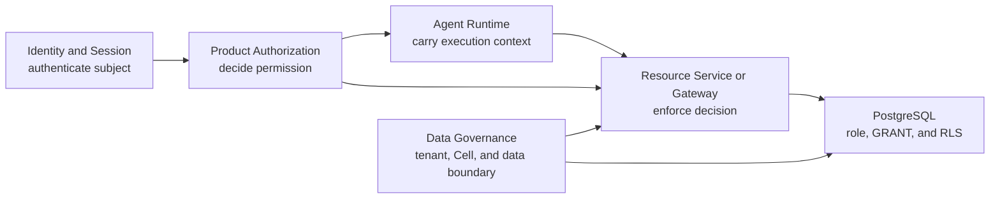

# Product Authorization

**Purpose**: Define the product-wide law for Product Principals,
Entitlements, permissions, authorization decisions, execution authorization
contexts, and bounded grants.

**Required reader gain**: A reader can distinguish authentication, product
authorization, delegated workload execution, tenant and Cell isolation, and
database permission enforcement, then identify which service decides and which
service enforces one protected action.

## 0. Intent Capsule

```yaml
layer: T0
t0_layer_id: the_product_authorization
status: candidate
canonical_owner: designDoc/the_product_authorization.md
owned_system_object: Principal, Entitlement, and Authorization Decision
scope:
  - Product Principal and Principal Group semantics
  - versioned Entitlement definitions and assignments
  - atomic permission and resource authorization vocabulary
  - principal, action, resource, and context decision law
  - execution authorization context, revocation, and invalidation
  - bounded OperationGrant law for high-risk delegated effects
  - default-deny enforcement and decision auditability
non_goals:
  - authentication protocol, identity-provider choice, or credential custody
  - workload credential issuance or service-mesh implementation
  - tenant or Cell storage placement and database role implementation
  - semantic routing, workflow definition, or Runtime execution
  - domain quality, human approval, or Artifact acceptance
inputs:
  - validated identity and session evidence
  - Product Principal, Group, Entitlement, and assignment state
  - code-owned ResourcePermissionManifest and policy releases
  - exact requested principal, action, resource, and trusted context
owned_specialization_contracts:
  - designDoc/product_authorization_00_service_and_persistence_contract.md
outputs:
  - AuthorizationDecision
  - ExecutionAuthorizationContext
  - bounded OperationGrant when the action class requires one
  - revocation and invalidation evidence
truth_surfaces:
  - designDoc/the_product_authorization.md
runtime_triggers:
  - route eligibility, workflow admission, protected resource access, or side-effect request
  - Entitlement assignment, expiry, suspension, revocation, or invalidation
downstream_consumers:
  - authorized Product APIs
  - Agent Runtime
  - resource-owning services and Gateways
open_decisions:
  - production policy-engine adoption after the local request model is stable
review_gate: design_doc_review and independent authorization-boundary review
runtime_surface_ledger: generated from code-owned authorization releases and PostgreSQL records
verification_hooks:
  - default-deny, scope, expiry, revocation, cross-tenant, and enforcement negatives
  - workload actor and initiating Principal audit reconstruction
```

## 1. Authority and Layer Separation

Product Authorization answers one question:

> May this Product Principal perform this action on this resource in this
> trusted context?

It does not answer who presented credentials, where data is stored, which
Workflow should be selected, how an Agent executes, or whether an output is
correct.



| Concern | Semantic owner |
| --- | --- |
| Subject authentication, session validity, and credential lifecycle | Identity and Session |
| Product Principal, Entitlement, policy evaluation, and decision | Product Authorization |
| Workload credential and service attestation | Trust and Operations infrastructure |
| Tenant, Cell, classification, residency, and System-of-Record boundary | Data Governance |
| Execution context, ordering, retry, and trace | Agent Runtime |
| Final Module and user permission conjunction | Data Access Gateway |
| Business operation invariants | Owning Domain Contract |
| Database object and row enforcement | PostgreSQL role, privilege, and RLS configuration |

Authentication is not authorization. Authorization is not tenant isolation.
Tenant isolation is not database ownership. A successful result from one layer
cannot substitute for another layer's evidence.

## 2. Principal, Permission, and Entitlement

A `ProductPrincipal` is a stable product identity representing a human,
organization, or controlled service. A Runtime execution is not a new Product
Principal. It is an execution record whose audit context preserves both:

- the initiating Product Principal as the subject; and
- the authenticated Runtime or Gateway workload as the actor.

`PrincipalGroup` supports scalable assignment. A Group is not permission by
itself.

A `Permission` is one atomic action over a registered resource type. An
`EntitlementDefinition` is a versioned product bundle of permissions and
constraints. An `EntitlementAssignment` binds one immutable Entitlement version
to a Principal or Group within an explicit tenant, product, validity, and scope
boundary.

Effective access is generated, never manually copied onto a user profile:

```text
effective operation scope
  = active direct and Group Entitlement assignments
  intersect admitted Module operation permissions
```

The model is default-deny and allow-only. Adding an Entitlement or permission
never requires a new column on the Product Principal record.

This is an intersection. A union would allow the initiating Principal to borrow
authority from a Module or allow a Module to borrow authority from the
Principal. A Workflow owns no permission. Its execution context binds the
request, input, resource reference, tenant, Cell, and audit lineage without
becoming another authorization factor.

## 3. Authorization Request and Decision

Every decision resolves one canonical request shape:

```text
principal + action + resource + context
```

Trusted context may include tenant, Cell, purpose, data classification,
workflow release, resource ownership, environment, or request time. Caller
input is never trusted merely because it has the correct field name. The
Product API and resource-owning service resolve authoritative values
server-side.

An `AuthorizationDecision` is an immutable allow or deny result for one exact
request. It identifies the policy and Entitlement releases used, the enforcing
audience, validity, and a stable reason code. Exact schemas, identifiers,
indexes, hashes used for content-addressed releases, and persistence fields are
code-owned.

Product Authorization separates three outputs:

| Output | Use | Consumer |
| --- | --- | --- |
| `AuthorizationDecision` | One current allow or deny | Product API or resource-owning Gateway |
| `ExecutionAuthorizationContext` | Immutable maximum envelope admitted for one Runtime execution | Agent Runtime and its Gateways |
| `OperationGrant` | Short-lived, audience-bound delegated capability for one high-risk asynchronous or externally visible effect | Exact enforcing Gateway |

An ordinary internal read, search, or model request requires authorization at
its enforcement point but does not require a single-use `OperationGrant` unless
its registered permission class says so. Publication, external sending,
sensitive export, trading, and cross-service asynchronous mutation require a
bounded grant by default.

The stable semantic record families are `ProductPrincipal`,
`ResourcePermissionManifest`, `EntitlementDefinition`, `EntitlementVersion`,
`EntitlementAssignment`, `AuthorizationRequest`, `AuthorizationDecision`,
`ExecutionAuthorizationContext`, `OperationGrant`, and
`AuthorizationStatusEvent`. Exact code projections remain code-owned.

## 4. Resource and Permission Ownership

Each resource-owning service publishes a code-owned
`ResourcePermissionManifest` containing its resource types, atomic actions,
scope forms, condition schema, and grant requirement class. Product
Authorization consumes the admitted release and does not invent another
service's resource semantics.

Workflow permission does not imply permission to read all possible data, use
every model or tool, publish output, or execute side effects.

Product Authorization performs none of the routing, Workflow binding,
execution, search, or protected resource operation itself.

Internal Knowledge and external discovery remain separate enforcing services.
Knowledge candidate visibility is filtered before candidate ranking, count, facet,
snippet, or body disclosure. External Search separately authorizes query
disclosure and records the third-party effect. Neither service silently falls
back to the other.

## 5. Enforcement and Runtime Binding

The resource-owning service or Gateway is the Policy Enforcement Point. It
must:

1. authenticate its calling workload;
2. preserve the initiating Product Principal and actor workload identities;
3. resolve the exact action, resource, tenant, Cell, and trusted context;
4. obtain or validate the current Product Authorization decision;
5. invoke Data Governance enforcement for universal data boundaries;
6. enforce the owning Domain Contract's business operation invariants;
7. execute through its assigned database or external-service credential; and
8. record decision and operation evidence.

A database-backed resource service implements this boundary as a Data Access
Gateway. Agent Runtime submits an execution-context reference, Module release,
requested operation, and bounded resource reference. The Gateway converts that
logical request into an admitted query or command and executes it with its own
workload credential. Agents, Modules, Workflow Executions, models, and end
users never receive a database credential.

The deployment pattern is one common Gateway protocol with separate
domain-owned services. A single all-powerful database Gateway would collapse
independent data boundaries and is therefore non-conformant.

Data Governance owns cross-domain data constraints such as tenant, Cell,
classification, residency, retention, legal hold, archival, and physical
deletion. The owning Domain Contract owns business invariants such as whether an
Evidence item may enter a Thesis, a Report may publish, or an Order may cancel.
Both may deny an operation after authorization; neither grants Product access.

Agent Runtime receives an immutable `ExecutionAuthorizationContext`. Runtime
may validate identity equality, Workflow release, tenant, Cell, validity, and
revocation status, but it never reads Entitlement bodies or evaluates Product
policy.

Runtime records the context reference on its execution and carries it to
protected calls. The Gateway still owns the current decision and enforcement.
No Agent, model, adapter, Workflow engine, or UI can manufacture authority.

## 6. Change, Revocation, and Run Consistency

An execution pins the authorization and policy versions used at admission.
Later Entitlement expansion never widens the existing execution. PM-requested
revision may continue in the same execution only while the authorization
context remains effective and unchanged.

Expiry, suspension, revocation, tenant or Cell change, or a reduced scope fences
new protected operations. Continuation under changed authority requires a new
execution. Historical execution and decision evidence remain attached to the
original context.

Break-glass authority is an explicit, time-bounded Entitlement assignment with
reason, scope, issuer, expiry, use evidence, and closure. Database superuser,
table ownership, `BYPASSRLS`, or an unrestricted service credential is never a
Product Authorization break-glass mechanism.

## 7. Cross-T0 Handoffs

| Peer T0 | Boundary |
| --- | --- |
| Artifact Graph | Supplies registered Workflow, Operation, Artifact, and owner identities; graph visibility is not permission |
| Task Routing | Consumes route eligibility and selects only inside the permitted set; it never grants access |
| Agency Platform | Hosts Product Authorization and user or tenant administration without owning policy semantics |
| Agent Runtime | Consumes an execution authorization context and decision or grant references; it does not interpret Entitlements |
| Data Governance | Supplies tenant, Cell, classification, residency, retention, licence, export, and storage boundaries |
| Timestamp and Clock Semantics | Defines issued, effective, expiry, revocation, recorded, and observed time semantics |
| Contract Audit | Audits immutable authorization contracts and releases under registered profiles |
| Software Delivery | Admits authorization code, schemas, migrations, deployment, rollback, and retirement |

## 8. Code-as-Truth Boundary

This T0 owns vocabulary, authority boundaries, decision law, and invariants. It
does not manually maintain current Principals, assignments, resource catalogs,
database roles, tables, policies, coverage, or implementation status.

Code owns:

- permission, Entitlement, resource-manifest, and evaluator releases;
- exact request, decision, context, grant, and status schemas;
- PostgreSQL DDL, roles, privileges, RLS policies, and migrations;
- service and enforcement bindings; and
- conformance and negative-test results.

The PostgreSQL Product Authorization store owns operational Principal, Group,
assignment, decision, and revocation state. Generated inspection renders the
current surface without exposing policy bodies or customer data.

## 9. Invariants

Product Authorization is non-conformant when:

- authentication, a role label, UI profile, Workflow registration, database
  role, or storage location is treated as Product permission;
- a caller-selected Principal, tenant, Cell, action, resource, or context is
  trusted without server-side resolution;
- effective permissions are manually copied onto a user profile;
- Runtime, Task Routing, an Agent, model, Gateway, or database creates or
  widens an Entitlement;
- an execution becomes broader after admission;
- an unauthorized route, search candidate, count, snippet, log, or timing
  signal is disclosed;
- a resource operation executes without a current decision or the required
  high-risk grant;
- a database role, table owner, or `BYPASSRLS` attribute substitutes for
  Product Authorization; or
- a decision is treated as content quality, domain acceptance, release
  admission, or human approval.

## References

- [Enterprise Constitution](the_charter.md)
- [Agency Platform](the_agency_platform.md)
- [Agent Runtime](the_agent_runtime.md)
- [Task Routing](the_task_routing.md)
- [Artifact Graph](the_artifact_graph.md)
- [Data Governance](the_data_governance.md)
- [Timestamp and Clock Semantics](the_timestamp_semantic.md)
- [Contract Audit](the_contract_audit.md)
- [Software Delivery](the_software_delivery.md)
- [Product Authorization Service and Persistence](product_authorization_00_service_and_persistence_contract.md)
- [Data Access Gateway Authorization Enforcement](data_governance_10_data_access_gateway_contract.md)
