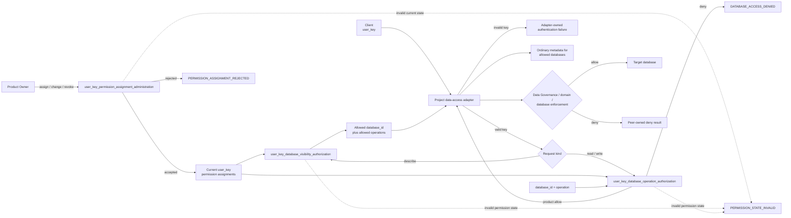

# 产品授权（Product Authorization）

本文只冻结 Product Authorization 的 T0 概念边界；adapter 与 database 的具体 implementation 留待后续
T1/T2 Code Design 和 Software Delivery，不在本文实现。

## 0. Intent Capsule

```yaml
layer: T0
t0_layer_id: the_product_authorization
status: candidate
canonical_owner: designDoc/the_product_authorization.md
owned_system_object: user_key permission assignment
scope:
  - client user_key 与 permission assignment
  - database metadata visibility
  - database read 与 write authorization
  - permission activation 与 revocation
  - default-deny 与 no-metadata-leakage
non_goals:
  - 区分 human、Agent、Module 或 Runtime caller
  - user_key 的签发、保存、轮换或 credential custody
  - database credential、DSN、connection pool 或 transaction management
  - SQL、schema、migration、domain writer rule 或 data ownership
  - Runtime admission、Module permission 或 Workflow execution
inputs:
  - data-access adapter 提交的 user_key
  - requested database metadata 或 database operation
  - Product Owner 提交的 permission assignment change
  - current user_key permission assignment
outputs:
  - 该 user_key 可访问的 database_id 与 allowed operation
  - database operation 的 allow 或 deny result
  - permission assignment change 的 accepted 或 rejected result
truth_surfaces:
  - designDoc/the_product_authorization.md
  - code-owned user_key permission store
runtime_triggers:
  - client 查询可访问 database metadata
  - client 请求 database read 或 write
  - permission assignment 创建、撤销或变更
downstream_consumers:
  - project data-access adapter
  - database-owning service
open_decisions:
  - 无
review_gate: material change 必须通过 design_contract_reviewer，并取得 accountable Product Authorization owner decision
runtime_surface_ledger: 从 code-owned permission assignment 生成
verification_hooks:
  - unknown user_key、missing permission 与 revoked permission 均 fail closed
  - 不可访问 database 的 identity、count、name、schema 与 metadata 均不可披露
  - user_key 永远不能换取或暴露 database credential
```

## 1. Primary System Flow



| `interface_id` | Owner | Input | Output | Effects | Error codes |
| --- | --- | --- | --- | --- | --- |
| `user_key_permission_assignment_administration` | Product Authorization | Product Owner 提交的 `user_key`、`database_id`、allowed operation 与 assign/change/revoke command | accepted 或 rejected result；assign/change accepted 后 assignment 为 active，revoke accepted 后为 revoked；invalid current state 时不改变现有 assignment | 只验证并改变 Product Authorization-owned assignment；不签发 user_key、不定义 database、不连接 database | `PERMISSION_ASSIGNMENT_REJECTED`, `PERMISSION_STATE_INVALID` |
| `user_key_database_visibility_authorization` | Product Authorization | `user_key` 与 current permission assignments | 该 key 当前可访问的 `database_id` 与每个 database 的 allowed operations；没有权限时返回空集合 | 只计算 permission visibility；不定义或生成 metadata、不连接 database、不返回 credential | `PERMISSION_STATE_INVALID` |
| `user_key_database_operation_authorization` | Product Authorization | `user_key`、`database_id`、requested operation 与 current permission assignment | 一个 allow 或 deny result；allow 只表示该 key 对该 `database_id` 有对应 permission | 提交 authorization result；不执行 SQL、不创建 connection、不扩大 permission | `DATABASE_ACCESS_DENIED`, `PERMISSION_STATE_INVALID` |

| `error_code` | Owner | Condition | Meaning | Caller action |
| --- | --- | --- | --- | --- |
| `PERMISSION_ASSIGNMENT_REJECTED` | Product Authorization | assignment change 使用未支持 operation | 请求没有形成或改变 permission assignment | 改为 `read` 或 `write` 后重试；不得把 rejected request 当作 current permission |
| `DATABASE_ACCESS_DENIED` | Product Authorization | `user_key` 没有 active matching permission，或 assignment 已 revoked 或不覆盖 requested `database_id`/operation | 当前请求没有有效 database permission；不区分具体 denial 原因 | 不执行 database operation；由 Product Owner 检查或重新分配 permission |
| `PERMISSION_STATE_INVALID` | Product Authorization | Permission assignment 无法通过 Product Authorization schema 或 current-state validation | 系统无法可信地计算权限，必须 fail closed；administration 调用不得改变现有 assignment | 不返回 visibility result、不执行 operation、不提交 assignment change；由 Product Authorization code owner 修复 permission-store 状态后重试 |

`deny` 是 authorization 的正常结果，不是系统故障。没有权限的 database 不进入 visibility result；普通
metadata 的内容与 schema 由 adapter 和 database owner 决定，不由 Product Authorization 特殊建模。

## 2. User Intent

一个 Client 持有一个 `user_key`。Product owner 可以给这个 key 分配 database permission。Project
data-access adapter 验证 key，并用同一个 key 查询可以访问哪些 database、返回这些 database 的普通
metadata，以及判断能否执行 read 或 write。

Product Authorization 不判断 Client 是人、Agent、Module 还是 Runtime。它只回答一个问题：

> 这个 `user_key` 当前是否拥有 requested database permission？

## 3. Reader Gain

- Product Owner 可以给 `user_key` 分配、变更或撤销 database permission。
- Client Developer 可以通过 adapter 取得该 key 可访问的 database metadata，再提交允许的 read/write request。
- Data Access Owner 可以在后续设计 adapter：验证 `user_key`、调用 Product Authorization，再返回普通
  metadata 或执行已允许的 operation；Client 永远拿不到实际 database credential。

## 4. Owned System Object

本 T0 只拥有 `user_key permission assignment` 的系统语义：一个 `user_key` 当前被允许访问哪些
`database_id`、执行哪些 operation，以及该 permission 是 active 或 revoked。

Exact record、field、schema、table、index、hash、store 和 generated inspection 由代码持有。T0 不新增
Principal、Group、Runtime identity、Module permission、delegated grant 或 execution-specific
authorization object。

## 5. Authority

Product Authorization 可以定义：

1. 一个 `user_key` 如何绑定 database permission；
2. permission 如何约束 `database_id` 与 `read`/`write` operation；
3. assign/change 如何产生 active permission，revoke 如何产生 revoked permission；
4. database visibility 与 database operation 如何 default-deny；以及
5. allow/deny result 的稳定含义。

Product Authorization 不拥有：

- `user_key` 如何生成、保存、轮换或验证其 credential material；
- Product Owner 或 administration caller 的 identity、authentication 与 administration authority；
- database metadata 的内容与 schema；
- database credential、secret resolution、connection pool、transaction、retry 或 SQL；
- Runtime、Module、Workflow 或 caller-kind-specific permission；以及
- data classification、tenant/Cell isolation、domain writer rule 或 database migration。

项目 administration surface 负责确认 Product Owner authority 并把 command 交给 Product Authorization；
它不能直接写 permission assignment 或改变本 T0 的 permission meaning。

## 6. Permission and Database Visibility Rules

Permission assignment 至少绑定：

```text
user_key + database_id + allowed operation + active/revoked status
```

本 T0 的 database operation set 固定为 `read` 与 `write`。`user_key_permission_assignment_administration`
只能接受这两个 operation，其他 operation 一律返回 `PERMISSION_ASSIGNMENT_REJECTED`。
`user_key_database_visibility_authorization` 只返回
该 key 当前可访问的 `database_id` 和 allowed operations；它不定义 metadata schema。Project data-access
adapter 可以把这份 visibility result 转成普通 database metadata，但只能包含允许访问的 database，且不能
返回 DSN、password、token、service credential 或其他 secret。`describe` 只是 adapter 的查询入口，不是
独立 permission operation。

Schema、table、domain operation 与 metadata 内容均不改变本 T0 的 `database_id + operation` 判断。

## 7. Adapter Delegation

Data Governance 定义 portable `DataAccessAdapter` mechanism boundary；domain owner 定义 Data Access
Gateway boundary。Product Authorization 只提交 database visibility 或 operation permission result，不拥有
credential resolution、connection、transaction、retry、domain SQL 或 execution mechanism。后续 adapter
设计的最小职责是：

```text
authenticate(user_key)
  -> valid / invalid

describe(user_key)
  -> allowed database_id + allowed operations
  -> ordinary database metadata

execute(user_key, database_id, operation, request)
  -> authorization allow
  -> controlled database execution
  -> operation result
```

Adapter 在每次 database operation 前重新调用 Product Authorization；不能把一次 visibility 或 metadata
result 当成后续 operation 的永久授权。Allow 后，adapter 使用项目受控 database credential 执行。
`user_key` 既不是 database credential，也不能被兑换成 database credential。

Exact adapter implementation、database-specific connection、transaction、retry、buffer、SQL mapping、
metadata 与 result schema 属于后续项目 data-access T1/T2 和代码，不属于本 T0。

## 8. Code-as-Truth Boundary

本 T0 持有 user intent、permission meaning、default-deny 和 credential non-disclosure invariant。代码持有：

- `user_key` permission assignment schema 与 current store；
- Product Authorization interface input/output schema；
- permission lookup、revocation 与 visibility validator；以及
- deterministic allow、deny、visibility 与 credential-isolation tests。

Design 文档不手工维护 current key、permission、database、schema、table 或 connection status。

## 9. Review and Admission

Material Product Authorization Design candidate 在 implementation 前由 DDM 定义的
`design_contract_reviewer` 审核 exact frozen candidate，并取得 accountable Product Authorization owner
decision。`the-design-authoring` Skill Package 保存 Reviewer source；Review Contract 只注入通用审核规则；
Agent Runtime 只执行 Reviewer。

Adapter code、schema、permission store、migration 与 database implementation 进入 Software Delivery 的
Code Design、implementation、deterministic test、`engineering_change_reviewer` 和 release admission。

## 10. System-wide Invariants

1. Product Authorization 只按 `user_key` 的 current permission assignment 作出结果，不区分 human、Agent、Module 或 Runtime。
2. Unknown key、没有 active matching permission、revoked 或 invalid state 全部 fail closed。
3. Database visibility 由 active database operation permission 派生；没有 permission 的 `database_id` 不进入 visibility result。
4. Adapter 返回的普通 metadata 不构成后续 operation 的永久授权。
5. 每次 database operation 都重新检查 current permission。
6. `user_key` 不是 database credential，Client 永远不接收 DSN、password、token 或 service credential。
7. Product Authorization allow 只满足 product permission；Data Governance、domain rule 和 database enforcement 仍可独立 deny database operation。
8. Adapter 不能创建、扩大或推断 permission。

## 11. Peer Boundaries

| Peer authority | Product Authorization handoff | Peer 保留的职责 |
| --- | --- | --- |
| Agency Platform | 承载 project administration surface，并把 Product Owner command 送入 `user_key_permission_assignment_administration` | Host composition；不决定 permission meaning，也不直接写 permission assignment |
| Data Governance | 定义 portable data-access mechanism，并在 authorized operation 上继续执行 tenant、Cell、classification、residency 与 retention boundary | Data-access mechanism、data boundary 与 data lifecycle；可以独立 deny operation，但不能授予 Product permission |
| Agent Runtime | 作为普通 Client 使用 `user_key` | Runtime admission、Module/Workflow execution 与 evidence；不改变 user_key permission |
| Design Doc Management | 定义本 T0 Design candidate 的结构与 `design_contract_reviewer` contract | Design lifecycle、Design review 与 owner decision evidence |
| Review Contract | 向 Design Reviewer source 注入通用审核规则 | Universal Reviewer instruction；不拥有 Product Authorization checklist 或 result |
| Software Delivery | 准入 adapter、permission store、schema、migration 与 database implementation | Code Design、engineering review、release、deployment、rollback 与 retirement |

项目 data-access T1 是本 T0 未来的主要 implementation consumer，但不是 portable peer T0。它将在后续
Code Design 与 Software Delivery 中实现 adapter，并与项目内数据库、Ingestion、KG 或其他 domain-owned
Data Access Gateway 对接。

## 12. References

- [Project Charter](the_charter.md)
- [Agency Platform](the_agency_platform.md)
- [Data Governance](the_data_governance.md)
- [Agent Runtime](the_agent_runtime.md)
- [Design Doc Management](the_design_doc_management.md)
- [Review Contract](the_review_contract.md)
- [Software Delivery](the_software_delivery.md)
