# 审核合同（Review Contract）

## 0. Intent Capsule

```yaml
layer: T0
t0_layer_id: the_review_contract
status: candidate
canonical_owner: designDoc/the_review_contract.md
owned_system_object: Review Contract
scope:
  - 所有独立审核共用的阶段顺序
  - exact frozen subject 边界
  - finding 与 required change 的通用约束
  - meaning-preserving prose review 的通用约束
  - 可机械注入各 Reviewer Module 的 universal review instruction
  - Reviewer prompt 的五章节布局、instruction ownership 和编写边界
  - `reviewer_reviewer` 对 Reviewer prompt candidate 的审核标准、结果含义与验证责任
  - Design Doc 采用 `审查与完成` 时四个子章节的共同含义
non_goals:
  - 为 Review Contract 之外的 Design、Skill、Code 或其他 subject 定义专用 checklist、schema、validator 或 verdict meaning
  - 选择 subject 应由哪个 Reviewer Module 审核
  - 执行 Reviewer Module、选择 provider/model/profile 或管理 Runtime Attempt
  - 定义、汇总、持久化或验证一个跨 subject 的通用审核结果对象
  - 批准、准入、发布、回滚或修改被审对象
  - 提供跨 subject 的通用 review-entry Skill，或把 `the-review-authoring` 当作 subject review 入口
inputs:
  - exact Reviewer prompt candidate
  - sections `0`/`4` canonical source evidence
  - 目标 Reviewer identity、subject kind 和目标 Design authority
  - 目标 governing Design 的 exact content
outputs:
  - 所有 Reviewer Module 必须遵守的通用审核阶段与 universal review instruction
  - 五章节 Reviewer prompt contract
  - `reviewer_reviewer` 的审核要求、registered result meaning 与 semantic validation obligation
  - `审查与完成` 四段的共同审核语义
truth_surfaces:
  - designDoc/the_review_contract.md
runtime_triggers:
  - 编写或修订 Reviewer prompt source
  - subject authority 准备注册或执行独立 Reviewer Module
downstream_consumers:
  - Design Doc Management
  - Skill Management
  - Software Delivery
  - 其他拥有 subject-specific review 的 authority
open_decisions: []
review_gate: design_contract_reviewer 对本 T0 exact candidate 的独立 Design review，并取得 Review Contract owner decision
runtime_surface_ledger: 由 code-owned governance inspection 展示 universal instruction source 与 consumer binding
verification_hooks:
  - universal instruction source 唯一且可解析
  - 五个 Reviewer prompt 章节唯一、连续且顺序固定
  - universal instruction 与 subject-specific checklist 各自绑定 canonical source
  - Reviewer prompt 中的受控 instruction block 与 canonical bytes 一致
  - deterministic、semantic、prose 阶段顺序不可倒置
  - exact subject 与 finding evidence boundary 闭合
```

## 1. Primary System Flow

```mermaid
flowchart TB
    subgraph AUTHORING["Reviewer prompt source"]
      U["Review Contract<br/>section 0 universal instruction"] --> C["组成 Reviewer prompt candidate"]
      T["Subject authority<br/>sections 1–4 meaning"] --> C
      A["the-review-authoring<br/>编写 sections 1–3"] --> C
      C --> D["Deterministic layout/source checks"]
      D --> Q["reviewer_prompt_source_review<br/>由 reviewer_reviewer 审查 sections 1–3"]
      Q --> H["Reviewer prompt review result<br/>返回 Skill Management completion"]
    end

    subgraph EXECUTION["Independent review execution"]
      S["Subject authority 冻结 exact candidate<br/>并运行 owner-specific deterministic validator"]
      S -->|"deterministic pass"| I["使用已注册 Reviewer instruction"]
      S -->|"deterministic fail"| F["返回 subject owner 修复<br/>不调用 semantic Reviewer"]
      I --> M["Owner-specific semantic review"]
      M -->|"semantic success"| P["对同一份 exact bytes<br/>执行 prose review"]
      M -->|"semantic finding 或 blocked"| O["按 owner-specific schema<br/>返回 Reviewer output"]
      P --> O
      O --> V["Subject authority 的 validator<br/>校验 output 与 checklist closure"]
      V --> R["返回 subject authority<br/>由其决定后续动作"]
    end
```



这张图只定义 Reviewer source 的组成边界和审核时的共同顺序。`reviewer_prompt_source_review`
是本 T0 唯一的逻辑审核接口；其 Runtime execution、持久化、Skill lifecycle 和具体 code field
分别由对应 authority 拥有，本 T0 不复制。

| `interface_id` | Owner | 输入 | 输出 | 影响 | `error_code` |
| --- | --- | --- | --- | --- | --- |
| `reviewer_prompt_source_review` | Review Contract | exact Reviewer prompt candidate、sections `0`/`4` source evidence、目标 Reviewer identity、subject kind、目标 Design authority、目标 governing Design 的 exact content | 覆盖 §6.3 六项 checklist 的逐项结果，以及 `passed`、`non_pass` 或 `blocked` verdict | 只判断 prompt source；不修改 candidate、不准入 Skill 或 Runtime | none |

| `error_code` | Owner | 触发条件 | 含义 | 调用方动作 |
| --- | --- | --- | --- | --- |
| `none` | Review Contract | none | 本 T0 不定义 caller-visible operational failure | none |

## 2. User Intent

不同类型的 Reviewer 可以使用不同 checklist、schema 和判断方法，但不能各自发明审查边界与基本顺序。
Review Contract 固定所有独立审核都必须遵守的最小共同规则，使 Reviewer 聚焦 exact subject 的结果
是否闭合，不把背景材料、过程偏好或相邻 owner 的问题扩张成当前 finding。

## 3. Reader Gain

- Review Contract Owner 能维护一份唯一的 universal instruction 与 prompt layout，同时不吸收目标
  subject 的 judging meaning。
- Subject Authority 能把自己的判断标准交给独立 Reviewer，并确认 Reviewer output 经过本 authority
  拥有的 schema 与 semantic validator，而不把 subject ownership 交给通用审核层。
- Reviewer Module Owner 能明确哪些 instruction 必须统一注入，哪些 checklist 和 output 必须由目标
  authority 自己定义。
- Primary Agent 能按五章节布局形成完整 Reviewer prompt，并判断一条 finding 是否真的属于当前
  frozen subject，而不是 Reviewer 新增的设计要求。

## 4. Owned System Object

Review Contract 只拥有一个逻辑对象：`Review Contract`。它包含所有独立审核共同遵守的阶段顺序、
subject boundary、通用 instruction、prompt layout，以及验证 Reviewer prompt source 是否符合这份
合同的判断语义。`reviewer_reviewer` 是同一个 owned object 的 owner-local review surface，不形成
第二个 owned object。Review Contract 不是产品 subject 的审核结果，也不是 Reviewer Registry、
Runtime Module、Execution Profile 或持久化记录。

## 5. Authority

只有 Review Contract 可以定义：

1. deterministic validation 必须先于 semantic review；
2. semantic review 成功后，written subject 才能对同一份 exact bytes 进行 prose review；
3. Reviewer 只能审 exact frozen subject 与 declared closure；
4. finding、severity、required change、prior finding 和 prose correction 的通用使用边界；
5. universal review instruction 的 canonical source meaning；
6. Reviewer prompt 的五章节布局与三种 instruction ownership；
7. `reviewer_reviewer` 对 Reviewer prompt candidate 的 checklist、input/output meaning、registered
   verdict 与 semantic validation obligation。
8. Design Doc 采用 `审查与完成` 时，`确定性检查`、`语义审查`、`表达审查` 和 `完成条件` 四段的共同
   审核语义。

Review Contract 不定义其他 authority 的 subject-specific checklist，不选择 Reviewer，不执行审核，
不拥有跨 subject 的通用结果对象，也不决定 candidate 是否获批。Design review、Skill review、
Engineering review 和其他领域审核分别由对应 authority 定义并消费；`reviewer_reviewer` 只验证
Reviewer prompt source 是否符合本 T0 自己定义的 Review Contract。

## 6. 通用审核规则

### 6.1 Universal review instruction

<!-- universal-review-style:start -->
- 先做 subject-specific semantic review；只有 semantic review 通过后，才对同一份 exact candidate bytes 做 prose and communication review；最后只按 owner-specific registered output schema 返回结果。任何阶段缺失、倒序或换用另一份 bytes 都不能形成成功 verdict。
- 只审 exact frozen subject 和 declared closure。背景材料只用于理解 subject，不能扩大被审候选。
- 判断候选按当前写法能否实现其声明的 `Reader Gain` 和 intended result；如果作者、实施者或使用者仍需自行补一个未声明的决定，结果就没有闭包。
- 每个 actionable finding 必须引用 exact subject evidence，并指出哪一个已声明结果仍无法确定；不能先判断某个概念“该不该存在”。
- `required_change` 只说明必须恢复清楚的结果，不替作者选择删除、补全、替换，也不新增 governing contract 未要求的 object、field、workflow、state、lifecycle、policy 或 mechanism。
- parent、peer、child 或 implementation 的问题返回真实 owner；不能借当前 review 审查或重写其他 subject。
- severity 只使用 owner-specific registered meaning；不能为凑 finding 数量、提高措辞强度或强行通过而改变 severity。
- prose check 只能提高可读性，不能改变事实、数字、归因、authority、不确定性、因果、兼容性、停止条件或 governing meaning。
- prior finding 只作为 evidence；必须在当前 hash 上重新判断，不能继承 verdict。
- 只返回 owner-specific registered output object。
<!-- universal-review-style:end -->

以上 block 是本 T0 唯一 canonical universal instruction source。Code 可以按注册 binding 机械提取并
注入目标 Reviewer prompt；不得概括、重排或在 consumer 处维护第二份手抄版本。Code 只验证 source、
hash、marker、target 和 byte equality，不替代 owner-specific semantic judgment。

### 6.2 Reviewer prompt 固定布局

所有受本 T0 约束的 Reviewer prompt——即由目标 Design authority 定义判断语义、由 containing
Skill Package 承载 source、并交给 Agent Runtime 独立执行的 Reviewer prompt——按以下顺序包含
五个且只包含五个一级章节：

| 章节 | 语义 owner | 内容 |
| --- | --- | --- |
| `0. review_contract_universal` | Review Contract | 第 6.1 节 canonical bytes；由 code 机械注入 |
| `1. Review Task` | 被审对象的 Design authority | Reviewer 目的、目标读者获得的判断能力、exact subject 和 intended result |
| `2. Inputs, Decision, and Output` | 被审对象的 Design authority | 必需输入、允许的 context、判断顺序、output contract 和 registered verdict meaning |
| `3. Boundaries and Failure Routing` | 被审对象的 Design authority | 禁止动作、不得扩大的 subject、证据不足时的结果与真实 owner 路由 |
| `4. Subject Review Checklist` | 被审对象的 Design authority | 该类 subject 必须一次检查完整的 ordered hard-gated checklist；由 code 机械注入 |

三种 instruction source 不能合并：Review Contract 拥有 section `0`；目标 Design authority 拥有
sections `1`–`4` 的语义；containing Skill Package 只承载这些 source。`the-review-authoring`
依据准入的 Design 和 exact task 编写 sections `1`–`3`，不修改 sections `0` 或 `4`。

Invocation 中的 frozen subject、allowed context、prior findings 和 output schema 是运行时输入，
不写入 Reviewer prompt source。Provider、model、tool permission、context window 和 retry 属于
Agent Runtime execution，不写入 sections `1`–`4` 的 judging meaning。

### 6.3 Reviewer source 编写与审核边界

Reviewer prompt candidate 先通过 deterministic gate。Code 只检查五个章节的唯一性、连续性与
顺序，sections `0` 和 `4` 的 canonical source/hash/byte equality，schema 以及 projection
closure。这些失败不交给语义 Reviewer 重新判断。

同一分工适用于所有 subject-specific Reviewer：code 负责 schema、hash、projection 与 registration
closure；Reviewer 只审 exact subject 的语义边界和声明结果。

Deterministic gate 通过后，`reviewer_reviewer` 只判断 sections `1`–`3` 是否：

<!-- reviewer-prompt-review-checklist:start -->
1. 完整说明 purpose、读者所需判断、subject、allowed context、output、verdict、boundary 和 failure routing；
2. 准确承载目标 Design authority，没有重复或改写 sections `0` 和 `4`；
3. 不要求模型替代 schema、hash、projection、registration 或其他确定性检查；
4. 不新增 governing Design 没有要求的 object、field、workflow、state、policy 或 mechanism；
5. 让冷启动 Reviewer 只读完整 prompt 和 invocation input 就能返回注册结果，无需从文件名、
   历史对话或 ambient repository 补一个未声明决定。
6. 前五项全部通过后，同一份 exact prompt candidate 的 prose and communication 不会改变事实、
   authority、boundary、failure、verdict 或 governing meaning。
<!-- reviewer-prompt-review-checklist:end -->

`reviewer_reviewer` 的 input meaning 必须绑定 exact prompt candidate、sections `0`/`4` source evidence、
目标 Reviewer identity、subject kind、目标 Design authority，以及该 authority 的 exact governing
Design content。Output meaning 必须逐项覆盖本节六项 checklist；第六项只有前五项全部通过后才执行，
并只使用三种 registered verdict：`passed` 表示 prompt meaning 完整，可在 containing Skill review 通过后
支持 Skill result completion；
`non_pass` 表示存在当前 prompt owner 可修正的 actionable defect；`blocked` 表示 required frozen
input、authority 或 deterministic evidence 缺失，当前无法做语义判断。该 output 只属于
`reviewer_reviewer` 的目标特定结果，不形成跨 subject 的通用审核结果，也不批准 Skill、Module 或
Runtime registration。

Review Contract 拥有上述 checklist、input/output meaning、verdict meaning 和 semantic validator
必须保证的结果；Skill Management 拥有承载这些 source 的 Skill artifact 与 fixture closure；code
拥有具体 schema、field、validator implementation 和 deterministic projection。`blocked` 只表示
required frozen input、authority 或 deterministic evidence 缺失，不得伪装成 prompt candidate
finding；具体 output shape 由 code-owned schema 表达，不在 T0 Design 中复制。

## 7. 审查与完成

任何 Design Doc 选择为其 owned subject 增加 `审查与完成` 时，都使用本章定义的同一四段含义。DDM
固定章节结构；本 T0 固定共同审核语义；使用该章节的 subject authority 填写自身检查与完成结果。
本 T0 不决定哪份 Design 必须增加该章节。本 T0 自己拥有的 `reviewer_reviewer` checklist、input/output
和 verdict meaning 仍由 §6.3 定义；本章不复制该 subject-specific contract。

### 7.1 确定性检查

Subject authority 必须在调用 Reviewer 前由 code 完成能够机械判断的检查，包括其自身需要的 schema、
identity、exact bytes、hash、projection、registration 和 required-input closure。失败时不调用 Reviewer，
直接把 typed failure 返回真实 Design 或 implementation owner。具体检查项、schema 和字段由 subject
authority 与 code 拥有，不进入 Reviewer prompt。

### 7.2 语义审查

通过确定性检查后，subject-specific Reviewer 只使用 subject authority 定义的 semantic checklist，判断
exact frozen subject 的语义边界与声明结果是否闭合。它不重新执行机械检查，也不能把 code-owned field、
fixture、process preference 或 context 文件变成新的语义要求。

### 7.3 表达审查

只有全部 semantic checks 通过后，Reviewer 才对同一份 exact subject bytes 判断表达是否能被目标读者
准确理解，且没有改变事实、数字、归因、authority、因果、不确定性、compatibility、failure 或停止条件。
表达审查不能修复 semantic finding，也不能换用另一份 candidate。

### 7.4 完成条件

审核完成要求 Reviewer output 绑定 exact subject、覆盖 subject authority 的完整 checklist，并通过该
authority 的 output schema 与 semantic validator。Reviewer output 只是 subject authority 作决定所消费的
evidence，不批准、准入、发布或修改 subject。使用 `审查与完成` 的 Design 必须在本章直接定义，或以
exact section reference 解析到同一文档内定义的具体 verdict meaning、completion evidence、失败返回对象
和 accountable decision；无需复制已经在同一 Design 中闭合的 subject-specific contract。

## 8. System-wide Invariants

1. Machine-decidable failure 在进入 semantic Reviewer 前由 subject owner 的 code validator 拒绝。
2. 每个 Reviewer 使用 subject owner 定义的完整 checklist、schema 和 semantic validator。
3. Universal instruction 与 owner-specific checklist 是两个不同 source；前者不能扩张或覆盖后者。
4. Background context 不会因为被 Reviewer 读取而成为 review subject。
5. Reviewer output、批准决定、准入决定、Runtime execution evidence 和持久化记录保持不同 ownership。
6. Review Contract 不提供跨 subject 的通用 review-entry Skill，也不以 renamed Skill、compatibility
   Skill 或空壳 Skill 提供该入口。`the-review-authoring` 是本 T0 的 authoring method：它以
   Review Contract 作为其 Task meaning 的 Design authority；Skill Management 仍拥有该 Skill 的
   definition、candidate、artifact envelope、Skill review 与 delivery；code 拥有 projection mechanics；
   System Change Governance 拥有 retirement/整体删除 disposition 与 owner routing。
   `the-review-authoring` 不审任何 subject，也不能替代 owner-specific Reviewer Module。
7. Review Contract 不拥有跨 subject 的通用审核结果对象。
8. Reviewer 发现 peer 或 implementation 问题时返回真实 owner，不在当前 subject 中补旁路机制。
9. 所有受本 T0 约束的 Reviewer prompt 只使用第 6.2 节的五章节布局；不增加并行 universal、
   checklist 或 runtime-config 章节。
10. Sections `0` 和 `4` 只由 code 从 canonical source 机械注入；sections `1`–`3` 只承载
    task-specific judging instruction。
11. `reviewer_reviewer` 只审 Reviewer prompt candidate；不审该 Reviewer 未来处理的产品 subject、
    containing Skill lifecycle 或 Runtime registration。
12. Reviewer prompt source 通过审核只说明 source meaning 完整；不直接产生 Skill admission、
    Module release 或 execution authorization。

## 9. Peer Boundaries

| Peer authority | Review Contract 提供 | Peer authority 继续拥有 |
| --- | --- | --- |
| 被审对象的 Design authority | 五章节布局与 universal instruction | Sections `1`–`4` 的 judging meaning、subject-specific checklist、schema、validator 和 output meaning |
| Design Doc Management | 通用阶段、universal instruction 与 `审查与完成` 四部分的共同含义 | Design candidate、Design checklist、`design_contract_reviewer` prompt/schema/validator/output、章节结构和 owner decision |
| System Change Governance | 通用阶段与 universal instruction | `SystemChangePlan` candidate、plan checklist、`system_change_plan_reviewer` prompt/schema/validator/output 和 owner decision |
| Skill Management | 五章节布局、universal instruction、`the-review-authoring` 的 Task meaning，以及 `reviewer_reviewer` 的 checklist、input/output meaning、verdict meaning 与 semantic validation obligation | `the-review-authoring` 与其他 Skill candidate、Skill artifact envelope、containing Skill Package、fixtures 和 Skill change delivery；Skill retirement/整体删除由 System Change Governance 定义和路由 |
| Software Delivery | 通用阶段与 universal instruction | Code candidate、Engineering checklist、Reviewer contract、code validation 和 release decision |
| Agent Runtime | Reviewer Module 必须执行的 instruction closure | Module registration、execution identity、provider/profile、Attempt、tool permission 和 execution evidence |
| Product Authorization | 不提供 permission decision | Reviewer invocation 所需的 entitlement 与 protected-operation authorization |

## 10. References

- [Design Doc Management](the_design_doc_management.md)
- [System Change Governance](the_system_change_governance.md)
- [Skill Management](the_skill_management.md)
- [Software Delivery](the_software_delivery.md)
- [Agent Runtime](the_agent_runtime.md)
- [Product Authorization](the_product_authorization.md)
