# Skill 管理（Skill Management）

## 0. Intent Capsule

```yaml
layer: T0
t0_layer_id: the_skill_management
status: candidate
canonical_owner: designDoc/the_skill_management.md
owned_system_object: Skill Definition
scope:
  - 定义一项可重复 Agent 方法由 Skill 承载时必须实现的结果与边界
  - 定义一份完整 Skill 必须实现的系统级结果
  - 定义 authoring Skill 必须携带的 AI-facing 通用写作规则及其机械投影边界
  - 定义适用 authoring Skill 在调用独立 Reviewer 前必须完成的 Author Self-Check
  - 在需要下游 Runtime registration 时交付完整、provider-neutral 的 prompt
  - 定义 Skill change 的独立审核要求
non_goals:
  - Design Intent、product 或 domain behavior
  - Skill source、registration、projection、discovery、host entry 或 active reference 的整体删除
  - host projection、Agent Runtime registration、Module admission、execution 或 release
  - provider、model、adapter、credential、data access 或 permission
  - software implementation、release、deployment 或 rollback
inputs:
  - 携带稳定 Agent 方法请求的 exact reviewed SystemChangePlan step
  - owning Design meaning 和当前 Skill inspection
outputs:
  - 完成独立审核的完整 Skill change result
  - 对仍需 managed execution 的结果，供下游 Runtime registration 使用的完整 prompt
truth_surfaces:
  - designDoc/the_skill_management.md
  - logical:skill_registry
runtime_triggers:
  - Task Routing 把 Skill 或 Module-source change 路由到 `system_change_intake`
  - reviewed SystemChangePlan 要求编写或修改 Skill
downstream_consumers:
  - Primary Agent
  - skill_candidate_reviewer
  - Runtime Registration owner
  - Software Delivery
open_decisions: []
review_gate: design_contract_reviewer 对本 T0 exact Design candidate 的独立 Design review 与 Skill Management owner decision；Skill candidate review 另由第 8 节定义
runtime_surface_ledger: 由 code-owned Skill Registry 生成的只读 inspection
verification_hooks:
  - Skill identity、owner、class 和 canonical source uniqueness
  - 完整 Skill change result 与 declared prompt closure
  - authoring Skill 的 `## 0. AI-facing Authoring Rules` 来源、位置、字节与 hash closure
  - 适用 authoring Skill 的 `Author Self-Check` 章节、canonical checklist ref 与 invocation-local result closure
  - containing Skill 对独立 Reviewer `module_id` 和必经 handoff 的 candidate closure
  - candidate hash、review coverage 和 boundary closure
```

## 1. Primary System Flow

```mermaid
flowchart LR
    R["Reviewed SystemChangePlan Skill step"] --> A["下游 the-skill-authoring<br/>比较完整 peer set 并编写 Skill candidate"]
    A --> P{"需要 declared prompt?"}
    P -->|"普通 managed prompt"| G["the-skill-authoring<br/>编写完整 prompt"]
    P -->|"Reviewer prompt source"| W["the-review-authoring<br/>编写并冻结 exact prompt candidate"]
    P -->|"无 prompt"| C["适用时执行 Author Self-Check<br/>逐项消费 canonical subject checklist"]
    G --> C
    W --> C
    C -->|"没有 unresolved finding"| D["Skill 确定性检查"]
    C -->|"存在 unresolved finding"| A
    D -->|"deterministic pass / skill_candidate_submission"| V["独立 skill_candidate_reviewer<br/>使用 Skill checklist 与 Review Contract 通用规则"]
    D -->|"deterministic fail"| Z["返回 deterministic finding 指定的真实 owner"]
    V --> Q["Skill Management-owned<br/>output schema 与 semantic validator"]
    Q -->|"passed；含 Reviewer prompt"| X["prompt 确定性检查<br/>再由 reviewer_reviewer 审核 prompt meaning"]
    Q -->|"passed；其他 prompt / 无 prompt"| S["完整、已审核的 Skill change result"]
    Q -->|"layer_disposition: non_pass"| A
    Q -->|"layer_disposition: blocked"| O["返回 blocker 的真实 owner"]
    X -->|"passed"| S
    X -->|"non_pass / blocked"| Y["返回 prompt 的真实 semantic owner"]
    S -->|"skill_result_delivery"| H["交给 Primary Agent 或下游 registration owner"]
```



| `interface_id` | Owner | 输入 | 成功输出 | 影响 | `error_code` |
| --- | --- | --- | --- | --- | --- |
| `skill_candidate_submission` | Skill Management | 完整 Skill candidate、需要时的完整 prompt、确定性检查结果，以及适用时已关闭本地 finding 的 invocation-local Author Self-Check | 绑定 exact bytes 的独立 Skill review subject | 不编辑 current source，不注册 Runtime；Self-Check 不成为 review verdict；Skill review 只判断 Skill 边界与结果，不审核 Reviewer prompt meaning | `revision_required`、`blocked_boundary`、`blocked_reproducibility` |
| `skill_result_delivery` | Skill Management | Exact Skill change candidate，以及绑定该 exact candidate、覆盖全部 Skill checks、通过 Skill Management-owned schema 与 semantic validator 且 `layer_disposition` 为 `passed` 的 `skill_candidate_reviewer` output；若承载 Reviewer prompt source，还包括随后取得、与 exact prompt bytes 绑定且 verdict 为 `passed` 的 `reviewer_reviewer` output | 完整、已审核的 Skill change result；仍需 managed execution 时包含完整 prompt | 只交付仍存在的 Skill artifact；不执行删除、projection、registration、execution 或 release | `blocked_boundary`、`blocked_reproducibility` |

| `error_code` | Owner | 触发条件 | 含义 | 调用方动作 |
| --- | --- | --- | --- | --- |
| `revision_required` | Skill Management | Candidate 自身的 identity、required section、declared prompt 或其他 author-owned representation 不闭合 | Candidate 尚不完整，不能形成 review subject | 返回全部 candidate-local deterministic findings 给 Skill author；修订后形成新的 exact candidate |
| `blocked_boundary` | Skill Management | Candidate 与现有 Skill peer、Design、Runtime、authorization 或 release boundary 冲突 | 当前写法会产生重复或跨权责 Skill | 返回真实冲突 owner；不得加平行 Skill 或兼容绕路 |
| `blocked_reproducibility` | Skill Management | Plan、peer set、candidate bytes、prompt closure 或与 exact subject 绑定的 Reviewer output 无法重现 | 没有 exact result 可以交付 | 恢复缺失的确定性输入后重跑 owning gate |

Schema、hash、projection、registration 或 validator implementation 失败不改写成上述 owner-local errors；
Flowmap 的 `deterministic fail` 边直接消费对应 code owner 已定义的 typed failure，并返回该 owner。

## 2. User Intent

当用户希望把一项会反复使用的 Agent 方法固定或更新下来时，系统需要确认该方法应由哪个 Skill
负责，以及它与相邻 Skill 的责任边界。Skill Management 的正确结果不是“多写一个
`SKILL.md`”，而是形成边界清楚、可发现、可独立审核、可由冷启动 Agent 单独执行的完整 Skill；
结果仍需 managed execution 时，还同时交付不依赖聊天历史的完整 prompt。整体删除由 System Change
Governance 规划并路由，不形成 Skill candidate，也不进入 Skill Management 的 authoring 或 review。

## 3. Reader Gain

- Primary Agent 能根据 reviewed Skill step 判断哪个 Skill 应承载本次更新，并保持与 peer Skill 的责任边界。
- Skill author 能知道一份完整 Skill 必须让目标 Agent 获得什么能力，而不是从目录、旧 prompt 或
  当前实现反推任务。
- Skill reviewer 能一次检查完整候选的任务、边界、输入、输出、完成条件、方法和 prompt closure。
- Owning Design authority 能确认 Skill 保留其 Task meaning，并与 Skill author、独立 Reviewer 和下游
  registration owner 保持不同职责。
- Runtime Registration owner 能在确有 managed execution 需要时直接消费完整 prompt，同时清楚 Skill Management 没有替它完成
  registration、Module admission、execution profile 或 release 决策，并能确认 containing Skill 已声明独立
  Reviewer Module、必经 handoff 和 route 不可用时的 fail-closed 返回。

## 4. Owned System Object

Skill Management 只拥有一个逻辑对象：`Skill Definition`。它表示
当前系统中每项可重复 Agent
方法由哪个 Skill 负责、各 Skill 之间如何避免重复或缺口，以及一份完整 Skill 必须实现什么结果。

单个 Skill 是该集合中的 provider-neutral Agent instruction artifact。它描述一个稳定任务，但不拥有
该任务的 Design Intent、运行实例、权限、数据、provider 或 software release。

本文中的 `Skill owner` 就是为该 Skill 提供稳定 Task meaning 的唯一 owning Design authority，不是另设
一个批准角色。Skill author 编写候选，独立 Reviewer 判断候选，Skill Management 在有效 `passed` 证据
齐全后交付结果；三者都不取代 owning Design authority 对 Task meaning 的所有权。

## 5. Authority

只有 Skill Management 可以定义：

1. 已路由的 Skill change 由哪一个 Skill 对该任务结果负责；
2. 每个 Skill 的稳定 identity、唯一 owner、class 和 canonical source 语义；
3. 一份完整 Skill 必须实现的 Agent-facing 结果；
4. 适用 authoring Skill 在独立审核前必须完成的 Author Self-Check，以及 Skill candidate 必须接受的独立审核；
5. 需要下游 Runtime registration 时，Skill 必须交付什么样的完整 prompt；
6. authoring Skill 必须在正文第一个章节携带哪一份 AI-facing 通用写作规则，以及该规则如何保持同源。

Skill Management 不定义 product/domain behavior，不给 Agent 授权，不执行 workflow，不选择 provider
或 model，不注册 Runtime Module，不准入 release，也不管理 host projection。上述决定分别留给 owning
Design、Product Authorization、Agent Runtime、Agency Platform 和 Software Delivery。

## 6. Skill 定义

### 6.1 完整 Skill

一份完整 Skill 必须独立回答：

1. `Task`：目标 Agent 要完成什么稳定任务；
2. `Reader Gain`：读完后目标 Agent 新增什么可靠判断或执行能力；
3. `Entry and Exit`：何时进入、何时不进入、blocked 时返回哪个 owner；
4. `Execution Contract`：需要哪些输入和 authority，产出什么，什么结果算完成；
5. `Boundaries`：与相邻 Skill、Design、Tool、Workflow、Runtime、authorization、persistence、review
   和 release 如何分工，以及无声越界时有什么可观察表现；
6. `Method`：完成结果所需的判断方法和真实陷阱，同时保留不影响结果的 reasoning、tool choice 和
   prose freedom。

这些是系统级完整性要求。具体 heading 编号、frontmatter 字段、schema、目录和 validator 属于
`the-skill-authoring` 与 code-owned enforcement，不在本 T0 重复定义；第 6.5 节固定共同首章，第 6.6 节
固定适用 authoring Skill 的 Author Self-Check 结果与边界。

### 6.2 Skill class

每个 Skill 恰好有一个 class。Class 只决定主要 entry 与下游 handoff，不定义业务含义。

| Class | 系统级含义 |
| --- | --- |
| `primary_agent_development` | Primary Agent 在 governed repository 内直接使用的方法 |
| `product_agentic` | 面向 product task、需要 managed Agent execution 的方法 |
| `product_hybrid` | 同时包含 deterministic 与 managed Agent responsibility 的方法 |
| `projection_only` | 只提供稳定发现与兼容入口，不拥有被投影对象的执行语义 |

一个 Skill 可以不产生 Runtime-ready prompt，也可以因同一稳定任务的不同 managed role 产生多个完整
prompt。每个 prompt 都必须保持在该 Skill 的 Task 与 Boundaries 内；它们只是下游 registration 输入，
不是 Module identity、release、execution profile 或 admission decision。

### 6.3 Skill 边界

编写或修改 Skill 前必须比较完整 peer set，确认目标 Skill 对任务结果具有唯一责任。若现有 Skill 已经
覆盖同一结果，就修改该 Skill；若一份 candidate 会与相邻 Skill 重复、留下责任空缺，或无法独立闭合
输入、输出与完成条件，就返回真实 owner 修正边界，不能因为目标名字不同再建平行 Skill。

整体删除旧 source、registration、projection、discovery、host entry 或 active reference 由 System Change
Governance 规划并路由，不调用 `the-skill-authoring` 或 `skill_candidate_reviewer`。

### 6.4 完整 prompt

Runtime-ready prompt 是 Skill 方法的完整、provider-neutral 执行指令。它必须让下游 execution identity
在没有聊天历史、没有读取 Skill source、没有 ambient repository search 的情况下理解 Task、输入输出、
完成条件、失败边界和允许的 operations。

Dynamic task data、credential、authorization decision、provider/model choice、execution state 和 release
state 不进入固定 prompt。Skill Management 只交付 prompt；何时注册、注册成哪个 Module、绑定什么
schema/profile/policy、如何执行与发布，全部属于下游 owner。

Skill Management 拥有 `skill_candidate_reviewer` 的 subject-specific judging meaning 与 checklist；Review
Contract 拥有 `the-review-authoring` 的 Task meaning，该 method 编写 Reviewer prompt sections `1`–`3`。
Prompt 必须机械包含 Skill Management 拥有的 checklist projection 与 Review Contract 拥有的 universal
instruction；projection 与 prompt target hash 由共同 Governance Release control 验证，缺失、手改、增删、
重排或 hash drift 时不能形成可冻结 prompt。Skill Management 验证 exact Skill subject、prompt 的机械组合
和最终 Reviewer output。Skill candidate
先接受 `skill_candidate_reviewer` 对 Skill 边界与结果的审核；通过后，Reviewer prompt source 的 sections
`1`–`3` 再取得与 exact bytes 绑定的 `reviewer_reviewer` output。

当一个 Skill Package 物理承载任何 Reviewer prompt source——包括 Skill Management 自己拥有的
`skill_candidate_reviewer` prompt 与 peer authority 拥有的 prompt——`skill_candidate_reviewer` 先审核
containing Skill 的 artifact boundary 与 result，不审核 prompt meaning。Skill review 通过后，
`reviewer_reviewer` 再审核 exact prompt；只有两份 output 都为 `passed` 时才允许交付 Skill result。

承载 Reviewer source 的 containing `SKILL.md` 必须同时声明 Reviewer `module_id`、独立
Runtime execution identity、必须调用该 Reviewer 的 handoff 位置，以及 Module route 不可用时
返回的真实 owner。Code 在进入 semantic Reviewer 前的 candidate 确定性检查中验证 Skill 对 `module_id` 的 exact declaration；semantic
review 检查该 Module 是否确实是必经 gate，而不是同目录的可选文件。未注册、未准入或
不可执行时，containing Skill 停止并返回 Runtime registration 或 execution 的真实 owner；不得由
author、Primary Agent 或相似 Reviewer 替代。Skill Management 只拥有这项 Skill artifact 闭包要求，
不因此取得 Module registration、execution 或 admission authority。

Skill Management 验证 Skill artifact envelope、declared source identity、两份 output 的 exact binding 和
机械投影闭合。关于 peer-owned
checklist、instruction、schema 或 output meaning 的 finding 返回真实 peer owner。Skill Management 不取得
peer review semantics、universal review semantics、Runtime registration 或 release authority。

### 6.5 Authoring Skill 的共同首章

Authoring Skill 必须在 frontmatter 后首先出现 `## 0. AI-facing Authoring Rules`。该章节逐字使用
registered identifier `soul:bestpractice_ai_facing_writing` 指向的 canonical selection；该 selection 来源于
`bestpractice_skill_writing` 中适用于全部 AI-facing artifact 的内容。Skill Management
拥有该 canonical selection 作为 authoring Skill 共同规则的语义、适用范围、登记的 exact bytes 和变更
决定；source file 不形成平行 authority。每个候选必须
与 code-owned manifest 登记的 source ref、selection 和 hash 保持一致。各 Skill 不手抄、概括或改写
第二份共同规则。

本要求适用于实际任务是编写稳定 artifact 的 Skill。Skill author 与 `skill_candidate_reviewer` 根据
candidate 的 `Task`、`Reader Gain` 和实际产出作出适用性判断；code 不重新判断语义、不新增 authoring
metadata tag，也不根据目录名或 Skill 名字机械套用。适用结果由 exact Skill candidate 是否包含固定
`## 0. AI-facing Authoring Rules` 表达。任何携带该首章的 candidate 都必须在 semantic review 前，由
现有 code-owned validator 直接对照已登记的 canonical selection 检查 source ref、selection、位置、
exact bytes 和 hash；首次进入的 target 不要求先登记到 manifest。第 8.2 节第 1 项只判断该 candidate
是否应当携带共同首章，并消费上述确定性结果，不自行比较字节。只有确定性检查和 semantic review
均通过后，code 才把适用 target 登记到 manifest。

第 0 节只提供共同的 AI-facing 写作方法。每个 authoring Skill 继续独立拥有自己的 Task、authority、
inputs、outputs、completion、boundaries 和 Method；Skill Management 不借共同首章规定这些 task-specific
内容，也不取得 `bestpractice_skill_writing` 中 canonical selection 之外内容的权责。

Canonical selection、manifest binding 或 Skill 中的第 0 节发生缺失、重复、错序、字节差异或 hash drift
时，该 Skill candidate 不能形成有效 `passed` 结果。Code-owned inspection 把已存在 host projection 的
dependency drift 交给 Agency Platform；是否冻结 host projection 仍由 Agency Platform 决定。Canonical
selection 或登记 exact bytes 的变化先作为 Skill Management change 处理，再通过受影响 Skill 的新
candidate 进入，不能静默改变已经接受的 Skill。

### 6.6 Author Self-Check

当一份 Skill 的 Task 由 Primary Agent 编写 material candidate，并声明该 candidate 随后必须交给独立
Reviewer 时，该 Skill 必须在自己的 Method 内包含标准 `Author Self-Check` 子章节。适用性根据 Skill 已有
Task、Reader Gain、output 和 Reviewer handoff 判断；不新增 metadata tag，也不按 Skill 名称或目录猜测。

该子章节必须让 author 在调用 Reviewer 前直接消费 subject authority 拥有的 canonical checklist，不能在
Skill 中手抄第二份 checklist。每次调用只形成临时结果表：

| `check_id` | `exact evidence` | `local result` | `unresolved finding` |
| --- | --- | --- | --- |

每个 required `check_id` 恰好出现一次，并绑定当前 exact candidate 的证据。历史 `prior_findings` 只是需要在
当前 candidate 上重新判断的 evidence，不能继承旧 verdict。任何 unresolved finding 都使 author 停止并
留在本 Skill 内修订；只有本地 finding 全部关闭后，才冻结 exact candidate 并调用独立 Reviewer。

Author Self-Check 只防止作者把自己已经看见的缺口交给 Reviewer。它不产生 `passed`、approval、admission
或任何可替代独立审核的结果，也不创建持久化 record、Registry 或跨系统 schema。纯 operator、
deterministic builder、Reviewer Module、read-only query、projection-only Skill，以及不由当前 Skill 编写并
立即送独立 Reviewer 的结果不适用。

## 7. T1 Delegation 与 Machine Enforcement

### 7.1 T1 delegation

Skill Management 的下游 Design 和 authoring method 负责具体的 Skill 写作、revision、peer comparison、
project binding 和 prompt authoring。它们可以选择适合结果的工作方法，但不能改变
本 T0 的 Skill definition、完整性要求或 peer boundary。

`the-skill-authoring` 是 Primary Agent 使用的 authoring method。它必须能只依赖本 T0、owning Design
meaning、当前 peer set 和本次请求，形成完整 Skill 与需要时的普通 managed prompt。Reviewer prompt
source 由 Review Contract 所属 `the-review-authoring` 编写 sections `1`–`3`；Skill Management 只承载其
artifact envelope 并在 Skill review 中判断它与 Skill Task/handoff 的关系。两种 method 都不取得 review、
Runtime registration、projection 或 release authority。

### 7.2 Machine enforcement

代码必须执行以下系统级结果：

- Skill identity、owner、class 和 canonical source 唯一且可解析；
- 每项 candidate 绑定 exact bytes 和 review subject；
- 完整 Skill 的必需语义面存在且结构闭合；
- 对任何携带共同首章的 candidate，在 semantic review 前确认该章节位于固定位置，并与登记的
  canonical selection 逐字一致；该检查不以 target 已进入 manifest 为前提；
- 对声明适用的 authoring Skill，确认标准 `Author Self-Check` 子章节存在、canonical checklist ref 唯一可
  解析、required `check_id` 完整且无重复、candidate hash 一致、evidence 非空并且没有 unresolved finding；
- 声明的每个 prompt 都能独立形成完整输入；
- Reviewer check coverage、finding 与 verdict 不矛盾；

精确 Registry、Schema、field、path、hash encoding、validator、writer 和 generated inspection 属于 code。
Code 不能判断 Task、Reader Gain、boundary、peer overlap、Author Self-Check 的适用性、evidence 是否真实，
或 Method 在语义上是否正确。

Skill Management 把 Skill schema、Skill package、complete prompt 和 Skill Reviewer checklist projection
登记到共同的 code-owned Governance Release control。共同代码统一处理 source hash、schema
binding、projection dependency 和 drift closure；Skill Management 仍是 Skill artifact 语义的唯一
owner。Design Doc Management 以同样机械框架登记 Design artifact，但两者使用不同
schema、不同字段集和不同准入判准。Skill Management 不另建第二套 hash 或 release
mechanism。

第 8.2 节是 Skill Reviewer checklist 的唯一可编辑语义来源。Code-owned Skill artifact contract 只把该节
的 exact `check_id`、顺序和 required result 表示成机器合同，再机械投影进固定
`skill_candidate_reviewer` subject-specific prompt；同时绑定 Skill Management source release、Skill
schema hash、projector hash 和 prompt target hash。第 8.2 节、机器合同或 prompt target 任一不一致时，
projection 都不能冻结，必须返回 Skill Management 或 implementation owner 消除 drift。Review Contract
的 universal instruction 仍由 Review Contract 单独拥有并机械注入，不成为 Skill checklist 的第二份
source，也不取得 Skill review output 的验证或消费 authority。

## 8. 审查与完成

每个 Skill candidate 都由 `skill_candidate_reviewer` 独立审核。Reviewer 自己不得编辑 candidate、
准入自己的 review result、注册 Module 或发布 release。

Skill review 必须一次覆盖完整 Skill 的 Task、Reader Gain、entry/exit、inputs/authority、outputs/completion、
boundaries、Method、Design fidelity，以及 declared prompt 与 Skill Task/handoff 的关系；它不审核 Reviewer
prompt meaning，也不能作为 Skill finding 要求 Skill author 改写 peer-owned semantics。Skill review 通过后，
`reviewer_reviewer` 再审核 exact Reviewer prompt。两份 review output 与各自 exact bytes 绑定且都为
`passed`，才能形成完整 Skill result。

### 8.1 确定性检查

进入 semantic Reviewer 前，code 完成 Skill structure、schema、identity、hash、共同首章、适用 candidate
声明的 Author Self-Check 结构与 invocation-local closure、prompt source、containing Skill 对 declared
Reviewer `module_id` 的 exact declaration、projection 与 registration closure 的确定性检查。失败时不调用 Reviewer；deterministic finding 必须明确
真实 owner 和 caller action。Candidate 内容不完整时返回 Skill author 修订；schema、hash、projection、
registration 或 validator implementation 失败时返回 implementation owner。

### 8.2 语义审查

以下 11 项是 Skill Management 拥有的完整 checklist。`skill_candidate_reviewer` 必须按顺序逐项形成
结果，完成全部检查后再给 verdict，并在同一次调用中返回全部 actionable findings；不能命中首项后
停止，也不能设置固定 finding 数量。一个根因影响多项时保留逐项 assessment，但不复制 finding：

1. `identity_discovery_class_and_source`：frontmatter 的 stable identity、discriminating description、
   unique owner、四类之一的 Skill class 与 canonical source 是否完整一致；并根据 Task、Reader Gain 与
   实际产出判断共同首章和 Author Self-Check 各自是否适用，以及 candidate 是否表达了正确责任。
2. `task_and_reader_gain`：`Task` 是否说明准确任务；`Reader Gain` 是否说明目标 Agent 新增的可靠判断
   或动作，并与 Task、Output 和 authoring rationale 保持区分。
3. `entry_exit_and_routing`：entry、exclusion、blocked exit 与 return owner 是否闭合；candidate 与完整
   peer set 的责任边界是否清楚，而不是依赖名称、目录或附近 prompt。
4. `inputs_authority_freshness_and_conflicts`：required inputs、first authority、owner、identity/freshness、
   缺失与冲突处理是否闭合，且 mutable state 没有被写成 static instruction。
5. `outputs_completion_failure_and_handoff`：output、completion、failure、partial/blocked result 与
   downstream handoff 是否让冷读 Agent 能判断完成或停止，并且没有留下未声明的责任决定。
6. `boundaries_and_observable_violations`：与相邻 Skill、Tool、Workflow、prompt、Runtime、authorization、
   persistence、review 和 release 的边界是否准确；每条 critical prohibition 是否有 observable
   violation。
7. `method_result_certainty_and_agent_freedom`：Method 是否固定结果与必要判断，而没有把 reasoning、prose
   composition 或 tool choice 写成自然语言脚本；known traps 是否仅保留真实高概率失败模式；适用的
   Author Self-Check 是否消费正确的 canonical subject checklist、逐项留下 exact evidence 与 local result、
   遇到 unresolved finding 时停止，并明确不能替代独立 Reviewer。
8. `design_and_revision_fidelity`：candidate 是否保留 owning Design meaning 与 reviewed change scope；
   与 peer set 的边界是否避免重复或责任缺口；是否从 current implementation 反推新的 product meaning。
9. `prompt_boundary_hygiene`：static Skill/prompt instruction 与 dynamic task input、credential、
   authorization、execution record、release state 和 provider/model choice 是否分离。
10. `skill_agent_workflow_tool_separation`：Tool、Skill、Workflow、prompt、Runtime Module 与 Agent
    objective 是否保持区分；Skill 没有取得 Runtime admission、canonical write 或 software release
    authority。
11. `runtime_ready_prompt_closure_if_declared`：普通 declared prompt 是否独立闭合 Task、input/output、
    completion、failure、operation boundary、policy boundary 和 Skill handoff；Reviewer prompt source
    是否与 containing Skill 的 Task 和 handoff 一致，且不重复审核其 prompt meaning；Skill Package 携带
    Reviewer source 时，containing Skill 是否声明 exact `module_id`、独立 Runtime execution identity、必经
    handoff 和 Module route 不可用时的真实 owner；没有 declared prompt
    时返回 `not_applicable` 并引用 candidate 中不需要 managed execution 的 exact evidence，不能推断一个
    prompt。

每个 check result 必须包含引用当前 candidate exact evidence 的非空 assessment。前十项只返回 `passed`
或 `finding`；第 11 项只有在没有 declared prompt 时可以返回 `not_applicable`。只有 `block` 或 `fix`
finding 才让 check disposition 成为 `finding`；只有 note 时 check 保持 `passed` 且不引用 finding ID。

Registered severity meaning：

- `block`：required authority 或 supplied semantic context 缺失、冲突，当前无法形成有效判断；对应
  `layer_disposition: blocked`，返回真实 owner；
- `fix`：exact Skill candidate 存在当前 author 可以修正的语义缺口；对应
  `layer_disposition: non_pass`；
- `note`：不阻止当前结果的观察，不使 check disposition 失败。

### 8.3 表达审查

全部 semantic checks 通过后，Reviewer 必须按 Review Contract 对同一份 exact candidate bytes 完成
prose and communication review；缺少该阶段的 output 不能形成 `layer_disposition: passed`。

### 8.4 完成条件

Skill Management 拥有 `skill_candidate_reviewer` 的 input/output schema 和 semantic validator，并只消费
与 exact Skill review subject 绑定、通过这些 gates 的 Reviewer output。其 `layer_disposition` 只有
`passed`、`non_pass` 和 `blocked`：

- `passed`：Skill Management 可以交付 exact 完整 Skill change result，以及需要时的完整 prompt；
- `non_pass`：把本轮全部 actionable findings 返回 author，修订形成新 exact candidate；
- `blocked`：把无法由当前 candidate owner 解决的 exact blocker 返回真实 owner。

只有上述 schema-valid、semantically valid 且 `layer_disposition: passed` 的 output 是本 T0 的审核完成
证据。Review 不替代 Design meaning、Runtime registration、Software Delivery admission 或任何 human
product decision。

## 9. System-wide Invariants

1. 每个 Skill 只有一个 stable identity、一个 owner、一个 class 和一个 canonical source。
2. 每项稳定 Agent 方法在当前 Skill 集合中只有一个清楚的责任归属；重叠或空缺必须显式处置。
3. 新建同级 Skill 前必须比较完整 peer set；名字或目录相近不能替代职责判断。
4. 每份完整 Skill 都能让冷启动 Agent 判断 Task、entry/exit、inputs、outputs、completion、boundaries
   和 Method。
5. 每个 Skill candidate 绑定 exact bytes，并接受独立 `skill_candidate_reviewer` 审核。
6. Reviewer 一次返回当前可见的全部 actionable findings，不按固定数量截断，也不命中首项后停止。
7. Skill author、Reviewer、Runtime Registration owner 和 execution identity 保持分离。
8. Runtime-ready prompt 完整且 provider-neutral，不携带 dynamic task data、credential、authorization、
   provider/model choice、execution state 或 release state。
9. Authoring Skill 的正文第一个章节是 `## 0. AI-facing Authoring Rules`，并与
   `bestpractice_skill_writing` 的登记 selection 保持同源；适用性由 Task、Reader Gain 和实际产出判断。
10. 一个 Skill 可以交付多个 prompt，但不能因此取得 Module identity、Runtime admission 或 release authority。
11. Machine-decidable obligation 由 code 执法；Task、Reader Gain、boundary、peer overlap 和 Method 由
    semantic owner 与独立 Reviewer 判断。
12. Skill review 只判断 candidate 的边界和结果；Skill retirement 与整体删除 disposition 由 System
    Change Governance 在 `SystemChangePlan` 中定义和路由，各 surface owner 执行，不进入 Skill authoring
    或 review。
13. Skill Management 的终点是完整、已审核的 Skill change result，以及需要时的完整 prompt；不是
    projection、registration、execution、release 或 deployment。
14. 物理承载 Reviewer source 的 containing Skill 必须声明该独立 Runtime Module 及必经 handoff；
    Module route 不可用时 fail closed，不回退到 author 自审、Primary Agent 直审或相似 Reviewer。
15. 适用 authoring Skill 在调用独立 Reviewer 前必须完成 Author Self-Check；本地 finding 未关闭时停止，
    self-check 永远不产生 `passed`、approval 或 admission。

## 10. Peer Boundaries

| Peer authority | 向 Skill Management 提供 | Skill Management 返回 | 不转移的 authority |
| --- | --- | --- | --- |
| System Change Governance | Exact reviewed `SystemChangePlan` step 和依赖顺序；Skill retirement/整体删除请求不生成 Skill authoring step | 对应 Skill update step 的完整结果 | Skill retirement/整体删除 disposition、受影响面盘点、依赖排序和 owner routing；各 surface 的实际删除由对应 owner 执行 |
| Task Routing | 把已经识别为 Skill 或 Module-source change 的请求选择为 `system_change_intake` 的 `RoutingDecision` | 完整、已审核的 Skill result 供后续已路由工作消费 | 全系统 task selection；不直接启动 Skill authoring，也不要求 Skill Management 重新分类请求 |
| Design Doc Management 与 owning Design | Design layer 规则、稳定 Task meaning，以及 DDM-owned Design Reviewer prompt source | 保持该 meaning 的完整 Skill，或机械承载 exact peer-owned prompt bytes | Design Intent、layer、product behavior 和 Design Reviewer prompt source meaning |
| Review Contract | 提供 universal Reviewer instruction、通用阶段顺序、`the-review-authoring` Task meaning，以及 Reviewer prompt source 的 exact `reviewer_reviewer` output | Exact Skill review subject、Skill checklist、`skill_candidate_reviewer` prompt/schema/validator/output，以及 carried prompt 的 artifact envelope 与 Skill-boundary judgment | Universal instruction、Reviewer prompt authoring/review meaning；不拥有 Skill result、Skill review、Reviewer routing 或执行 |
| Agent Runtime | 下游 registration 与 execution contract | 完整、provider-neutral prompt | Module identity、schema/profile/policy binding、admission、execution、release 和 registration 删除 |
| Agency Platform | Host exposure 与 project composition constraint | 可被 host 消费的 Skill result | Host projection、agent composition、product exposure 和 host entry 删除 |
| Product Authorization | Tool、data、model 和 protected operation 的 permission decision | Skill identity 与 declared operation boundary | Permission、credential 和 entitlement |
| Software Delivery | Code Design、implementation 和 release gate | Skill invariants 与 deterministic acceptance criteria | Code、test、实际删除、release、deployment 和 rollback |

任何 peer 的内部 workflow、field、error code、provider binding 或 current implementation 都不复制进本
T0。Peer 冲突返回真实 owner；Skill Management 不通过增加新 Skill、兼容 shim 或旁路 prompt 解决。

## 11. References

- [System Change Governance](the_system_change_governance.md)
- [Design Doc Management](the_design_doc_management.md)
- [Task Routing](the_task_routing.md)
- [Review Contract](the_review_contract.md)
- [Agent Runtime](the_agent_runtime.md)
- [Agency Platform](the_agency_platform.md)
- [Product Authorization](the_product_authorization.md)
- [Software Delivery](the_software_delivery.md)
