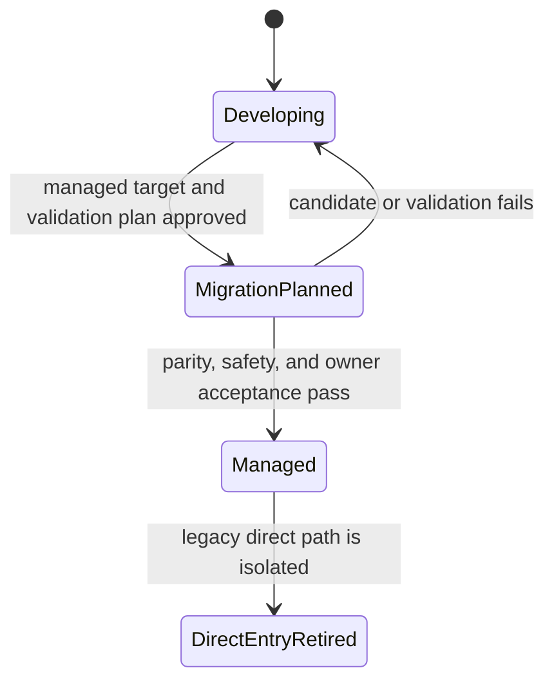

# Skill Management

**Purpose**: Govern a Skill as a provider-neutral instruction artifact with one
identity, owner, class, authoring source, candidate lineage, projection set, and
lifecycle.

**Required reader gain**: A reader can decide whether a requested change is a
Skill change, identify the authority and source that must be read first, produce
one reviewable Skill candidate, and hand product execution to the correct
Runtime or Workflow owner without giving the Skill execution or admission
authority.

## 0. Intent Capsule

```yaml
layer: T0
t0_layer_id: the_skill_management
status: candidate
canonical_owner: designDoc/the_skill_management.md
owned_system_object: Skill Definition, Classification, and Lifecycle
scope:
  - Skill identity, owner, class, authoring source, candidate lineage, projection, migration, and retirement
  - Primary Agent development Skills
  - product Skills that define Runtime Module registration sources or managed Workflow entries
  - separation of Skill authoring, independent review, Runtime registration, product execution, and software release
non_goals:
  - product or domain workflow meaning
  - System Change Case scope, cross-owner Work Package selection, Candidate Set assembly, or case closure
  - Product Authorization, Entitlement, or canonical-write policy
  - Runtime Module, Workflow, provider, model, adapter, or execution semantics
  - deterministic workflow execution mechanics
  - software release admission or deployment
inputs:
  - proposed Skill behavior and its owning Design Contract
  - exact System Change Skill Work Package when the Skill candidate belongs to a governed mutation
  - current Skill registration, authoring source, projections, and managed execution bindings
outputs:
  - classified Skill candidate with immutable review identity
  - accepted authoring source and exact host projections
  - managed-execution handoff or lifecycle disposition
  - direct-entry retirement evidence and tombstone
truth_surfaces:
  - designDoc/the_skill_management.md
  - logical:skill_registry
  - logical:skill_candidate_registry
runtime_triggers:
  - material Skill creation, revision, migration, or retirement request
  - detected drift between a Skill source, registration, and projection
downstream_consumers:
  - Primary Agent host projections
  - owning product and domain workflows
  - Agent Runtime registration and Software Delivery workflows
open_decisions: []
review_gate: independent review of every material Skill candidate before acceptance
runtime_surface_ledger: generated from the consuming project's code-owned Skill registration
verification_hooks:
  - Skill identity, owner, class, candidate-hash, source, projection, and lifecycle closure
  - Runtime Module source and managed Workflow binding boundary checks
  - Skill Work Package applicability and retired inbound-reference closure
```

## 1. When Skill Management Applies

Skill Management applies when the governed object is the Skill itself. Enter
this authority when a change creates, materially revises, classifies, projects,
migrates, or retires a Skill. A material revision changes purpose, admitted
inputs or outputs, judgment method, authority boundary, execution handoff, or
lifecycle state.

Changes to a domain record, Expertise Profile, data release, Runtime release,
Workflow release, provider profile, or active pointer remain with their own
authority. A Skill may consume or describe those objects without owning them.
The observable test is the review subject: if the proposed candidate can be
accepted without changing the Skill artifact, its registration, or its
lifecycle, the request belongs to another owner.

The presence of `skill`, `Skill Management`, a Skill ID, a Skill directory, or
a `SKILL.md` path in the request does not establish applicability. Before
authoring begins, the operating method must verify the exact Skill Work Package,
its specialist owner, its declared entry-subject class, and the proposed change
to Skill identity, instruction meaning, registration, projection, or lifecycle.
If that check fails, the method exits without editing or reviewing the target
and returns `not_a_skill_change` with the observed subject kind, governed layer,
likely accountable owner, and evidence that disproved Skill applicability. It
must not reinterpret adjacent work as a Skill change or fall through to a
similarly named method.

Cosmetic corrections may use the local bounded-edit path when identity,
meaning, class, routing, and lifecycle remain unchanged. The consuming project
must define how that path proves semantic non-change. The edit still binds a
lightweight System Change Case and exact Skill Work Package; bounded-edit
classification removes material Skill review gates, not change capture.

Once the request is classified as a Skill change, read this T0 first, then the
owning Design Contract, the code-owned Skill registration and accepted source,
the target host constraints, and any managed Workflow or Runtime binding. This
order separates intended task meaning from current implementation facts.

## 2. Owned Object and Authority

A Skill is a provider-neutral instruction artifact that tells an Agent how to
perform one governed task under an owning Design Contract. Skill Management
owns the rules that make this artifact stable and governable:

- one stable `skill_id` and one accountable owner;
- one Skill class and, for a Primary Agent entry, one entry role and subject;
- one canonical authoring source for each accepted Skill revision;
- immutable candidate identity and independent review lineage;
- exact host projections and drift recovery;
- product-execution handoff, migration state, and direct-entry retirement.

The owning T0, T1, or T2 Design Contract defines the task's product or domain
meaning. Skill Management defines how that meaning becomes a governed Agent
instruction artifact. A Skill can reference registered code and managed
execution, while authorization, execution, persistence, admission, and release
remain with their respective owners.

This separation prevents two common authority errors. A working prompt cannot
create a product capability, and a Runtime release cannot silently become the
editable source of Skill meaning.

## 3. Skill Model

### 3.1 Skill identity

One Skill has one stable `skill_id`, owner, class, and canonical source. The
identity remains stable across candidate revisions, host projections, and
Runtime registrations. A rename or ownership transfer is a governed lifecycle
change with predecessor lineage.

Skill review identifies an exact authoring candidate with three separate
fields:

```yaml
skill_id: the-contract-audit
candidate_revision: 33
candidate_sha256: <sha256 of the exact Skill candidate>
```

`candidate_revision` orders Skill authoring candidates. Runtime Module and
Workflow Releases keep their own typed identities and versions. A Runtime
record may retain `source_skill_id` for provenance; it does not inherit the
Skill candidate revision as an execution dependency.

The shape `<skill_id>@candidate_vN` is reserved from Skill candidate identity.
Its use makes Skill authoring look like Runtime release admission and must be
rejected by candidate validation.

### 3.2 Skill classes

Every Skill has exactly one class. The class determines the execution handoff,
not the task's business meaning.

A Runtime Module registration source is an editable, provider-neutral prompt,
schema, and policy input submitted to Agent Runtime for an independently
versioned release. It defines a release candidate and is not itself executable.

| Class | Direct entry | Product execution owner |
| --- | --- | --- |
| `primary_agent_development` | A Primary Agent may invoke the Skill for governed repository work; an independent governance-review Skill may also export a managed reviewer Module | No tenant product execution; Agent Runtime owns any exported reviewer Module release and execution |
| `product_deterministic` | The Skill routes to a registered deterministic Workflow | The admitted deterministic execution integration |
| `product_agentic` | The Skill defines Runtime Module registration sources or routes to an admitted Agent Workflow | Agent Runtime |
| `product_hybrid` | The Skill defines the Agent Module sources used by a hybrid graph | The fixed outer graph and Agent Runtime keep separate execution ownership |
| `projection_only` | The Skill explains or invokes an already managed target | The projected logical object's owner |

A governance Skill directly callable by a Primary Agent also declares one
`primary_agent_entry_role` and one `primary_agent_entry_subject`. The role
states what the entry does. The subject states the exact governed input-object
class accepted at entry, not the artifact the Skill later produces. Routing,
authoring, operation, review, and support remain distinct
roles even when one larger workflow composes them.

Product Runtime roles such as Writer, Verifier, Router, and Debater belong to
Runtime Modules. They do not replace the Primary Agent entry role and subject.

### 3.3 Source and projection

The canonical authoring source owns the accepted Skill text. A host projection
is an exact or deterministically composed interface copy for one Agent host.
Editing a projection cannot change the Skill identity or accepted meaning.

Portable governance Skills keep their canonical sources inside the installed
governance distribution. A consuming project may supply a hash-bound local
binding that adds project reachability or interface facts. The binding cannot
duplicate the portable method, grant authority, or introduce product execution
semantics. Project-local Skills use the authoring source and projection rules
declared by that project's Skill Registry.

A new or materially changed project binding addendum is a Skill Work Package
subject. It must receive the registered `skill_candidate_reviewer` judgment
before its hash enters the binding manifest; an approved bootstrap direct
review records its limitation and successor cross-review obligation when that
managed binding is not yet available. Hash validation alone is not semantic
admission of the addendum.

Projection drift is repaired from the accepted source. If a host needs a
semantic change, the change begins as a new Skill candidate rather than a local
projection patch.

## 4. Authoring Contract

### 4.1 Required authoring basis

Before a material candidate is written, the author freezes:

1. this T0 and the owning Design Contract;
2. the current Skill registration, accepted source, and projections;
3. the intended reader, task outcome, admitted inputs, output contract, and
   failure boundary;
4. applicable prompt-boundary and Skill-to-Agent separation axioms;
5. the managed Workflow or Runtime registration when the Skill is
   product-facing; and
6. the required candidate checks and independent review profile.

The owning Design Contract decides what the task means. Current registration
and execution records describe what exists. Host guidance supplies interface
constraints. None of those adjacent surfaces can independently redefine the
Skill's owner, class, source, or lifecycle.

Missing ownership, conflicting class, unresolved source identity, or an
unknown product execution target blocks material authoring. A directory name,
working prompt, provider session, or successful command provides evidence only.

### 4.2 Candidate content

The candidate contains the task-plane instructions an Agent needs to complete
the governed task. Authoring rationale, governance explanation, review notes,
provider selection, credentials, release state, and mutable execution facts
remain outside the task-plane instruction unless they directly change task
execution.

The candidate fixes outcome, boundaries, required inputs, output contract,
completion conditions, failure semantics, and known traps. It leaves reasoning
and tool choice open where the governing task permits agent judgment. This
keeps result invariants stable without turning the Skill into a natural-language
script.

Every critical prohibition also has an observable failure signal. For example,
a product Skill that directly invokes a provider has crossed the Runtime
boundary; a host projection with unique semantic text has crossed the source
boundary; and a Reviewer that edits the candidate has crossed the independence
boundary.

### 4.3 Candidate checks and review

Deterministic checks validate identity, owner, class, required references,
source closure, projection closure, schemas where declared, lifecycle state,
and prohibited direct-entry behavior. They establish structural
reproducibility and cannot supply a semantic verdict.

An independent reviewer receives the exact candidate, its immutable identity,
the frozen authoring basis, and the registered review criteria. The reviewer
reports findings and a disposition. It cannot edit, accept, register, release,
or deploy the candidate. Any semantic correction creates a new candidate
revision and hash.

The portable Skill-review Module identity is `skill_candidate_reviewer`.
Contract Audit packages and executes the reviewer; Skill Management owns its
semantic method. A missing or mismatched binding is a routing gap and cannot be
replaced by a Design, System Change, or Engineering reviewer.

Acceptance updates the canonical Skill source and registration through the
project's admitted writer. Host projections are then regenerated or checked
for exact composition. Runtime registration and software release remain
separate downstream decisions.

## 5. Runtime Module and Workflow Handoff

A product-facing Skill or independent governance-review Skill can define zero,
one, or many Runtime Module
registration sources. Each Module source has its own stable `module_id`, fixed
provider-neutral prompt, concrete input and output schema references,
operations, policies, and validation fixtures. The Skill explains the managed
entry and the relation among its declared Modules without duplicating a
Module's fixed prompt.

The portable logical layout is:

```text
<skill-authoring-root>/<skill_id>/
├── SKILL.md
└── runtime_modules/
    └── <module_id>/
        ├── module_registration.json
        ├── prompt.md
        ├── schemas/
        │   ├── input.schema.json
        │   └── output.schema.json
        └── validation_cases/
```

The Module directory name and declared `module_id` are identical. `prompt.md`
is the editable next-release source for that Module's fixed instructions. The
registration source contains provider-neutral machine fields and references
concrete schemas. Validation fixtures remain outside model input.

Every Module export includes positive, negative, and schema-drift validation
cases in its authoring closure. Governance reviewer Modules may share a
package-level deterministic harness, but the package manifest and tests must
still bind the exact fixture identities to that Module; absence of both a
`validation_cases/` directory and registered fixture refs is invalid.

Portable validation-case JSON files are declarations of the cases an executing
harness must run. Their presence, `case_kind`, mutation label, or expected
disposition is not execution evidence. The consuming project's Runtime or
conformance binding owns the executable harness and immutable result. Module or
Workflow activation remains blocked until that binding demonstrates the
positive, negative, and schema-drift outcomes required by Contract Audit.

Agent Runtime converts an approved Module source into an immutable Runtime
Module Release. It owns release versioning, prompt assembly, provider and model
profiles, execution policy, admission, persistence, evaluation, and execution
lineage. All provider-facing Skill and model adapters are
registered, admitted, tested, and observed
by Agent Runtime rather than Skill Management. A Workflow
references exact Runtime Module Releases rather than a Skill path or candidate
revision.

A Workflow-entry Skill may define no Runtime Module source and instead point to
one admitted Workflow identity. A `projection_only` Skill may carry stable
discovery information while the projected Registry owns all release and
execution semantics. Production execution never reads an editable Skill file
as its authority.

Task-specific targets, evidence, references, and output destinations enter a
Runtime invocation as authorized input. Static reusable instructions belong in
the Module source. Mixing these surfaces creates either a task-specific prompt
fork or a static prompt that captures mutable task data.

## 6. Migration and Retirement

Skill lifecycle state describes the transition from a repository instruction
artifact to a managed execution surface. It does not describe Runtime release
admission or software deployment.



| State | Required meaning |
| --- | --- |
| `developing` | The Skill may serve its declared repository purpose. Product scope cannot expand beyond the approved boundary. |
| `migration_planned` | A concrete managed target, parity plan, negative tests, recovery path, and owner acceptance gate exist. |
| `managed` | Product routing resolves to an admitted Workflow or Runtime Module. The Skill remains the governed instruction or interface source. |
| `direct_entry_retired` | Legacy direct execution is absent from active discovery. A tombstone preserves predecessor identity, replacement, reason, final hash, and retirement time. |

Moving to `managed` requires behavior parity for admitted use, authorization
negatives, failure recovery, observability, and accountable owner acceptance.
Moving to `direct_entry_retired` additionally requires proof that legacy
aliases, embedded prompts, direct provider calls, and direct canonical writes
cannot be reached through normal or archived discovery.

Retirement also requires active-reference closure. Every admitted inbound
reference to the predecessor Skill identity must resolve to the replacement,
receive an explicit owning-authority disposition, or be removed from active
discovery. A tombstone preserves lineage but cannot remain an executable or
routable reference.

Historical recovery uses version control or an authorized audit store. A
retired direct path cannot silently regain routing authority.

## 7. Adjacent Authority Handoffs

| Adjacent authority | It supplies | Skill Management supplies back |
| --- | --- | --- |
| System Change Governance | Exact Skill Work Package and current Case/Plan lineage | Skill candidate, review, acceptance, and terminal evidence refs without transferring Skill authority |
| Design Doc Management | Design Contract lifecycle and approval rules | A Skill impact record and candidate tied to the owning Design Contract |
| Owning product or domain Design Contract | Task meaning, inputs, outputs, quality, and business failure semantics | A provider-neutral Agent instruction artifact that preserves that meaning |
| Task Routing | One authorized semantic task owner | A classified Skill entry that cannot widen the selected authority |
| Artifact Graph | Registered Workflow, Artifact, and Design Contract identities that a Skill may reference | Stable references that reuse those identities without creating a second graph |
| Product Authorization | Permission for workflow, data, model, tool, publication, and protected operations | Stable Skill identity and declared execution handoff for policy evaluation |
| Agent Runtime | Module and Workflow registration, release, admission, and execution | Approved Module registration sources and Skill provenance |
| Agency Platform and deterministic execution integration | Managed product exposure and fixed-workflow execution | A deterministic or hybrid Skill classification and exact Workflow reference |
| Contract Audit or registered independent reviewer | Review profile, immutable-subject review, and evidence-bound result | Exact Skill candidate, authoring basis, checks, and accountable owner route |
| Software Delivery | Change-set, release, deployment, rollback, and retirement admission | Accepted Skill source, projections, tests, and lifecycle evidence |

These handoffs preserve one authority per decision. A Skill definition cannot
authorize execution, a Runtime release cannot approve Skill meaning, and a
software release cannot repair a missing Skill owner.

## 8. Required Machine Contract

Each consuming project maintains a code-owned Skill Registry. At minimum it
records:

- stable Skill identity, owner, class, and canonical source identity;
- Primary Agent entry role and subject when direct Primary Agent entry exists;
- candidate revision, candidate hash, predecessor, review result, and
  acceptance decision;
- exact source members and host projection bindings;
- required installed Soul resource IDs and their resolved source paths;
- zero-to-many Runtime Module registration-source declarations;
- optional admitted Workflow reference and product exposure state;
- lifecycle state, managed target, direct-entry disposition, and retirement
  tombstone; and
- generated inspection references and drift status.

Machine validation enforces identity uniqueness, owner resolution, legal
class-to-execution mappings, candidate immutability, source and projection
hashes, Module-source closure, legal lifecycle transitions, and retirement
non-reachability. It also fails closed when a required Soul resource ID is
unknown, missing, or resolves through an escaping or symlinked path. Generated inspection reports current registration and drift;
it remains a read-only projection of Registry truth.

Portable governance releases validate their own Skill sources and exact host
projections. Project-local bindings add local reachability and execution facts
through separately hash-bound records. Portable intent stays independent of a
project's providers, repository paths, persistent store, and deployment state.

## 9. Failure and Recovery Semantics

Skill Management stops with an explicit disposition:

- `accepted`: the exact candidate passed required checks and independent review;
- `revision_required`: findings return to the author and create a new candidate;
- `blocked_owner`: no unique owning Design Contract or accountable owner exists;
- `blocked_boundary`: class, source, Runtime, Workflow, authorization, or release
  ownership is contradictory;
- `blocked_reproducibility`: the candidate, source closure, projection, or
  review identity cannot be reproduced; or
- `not_a_skill_change`: the request routes to the owner of the actual changed
  object.

Projection drift is recovered from the accepted canonical source. Registration
drift is resolved by the Registry owner. Runtime or Workflow drift is resolved
by the corresponding execution owner. A failed product migration leaves the
prior admitted path active within its existing authority and returns the Skill
to `developing` or keeps it in `migration_planned` with an explicit blocker.

Recovery never accepts an unreviewed semantic edit, restores a retired direct
entry as current, or treats a working provider call as proof of admission.

## 10. System-wide Invariants

1. Every Skill has one stable identity, one owner, one class, and one canonical
   authoring source.
2. Every material Skill candidate has an immutable revision, content hash,
   predecessor relation, and independent review result.
3. Primary Agent development Skills never process tenant product work.
4. Product execution resolves through an admitted deterministic Workflow,
   Runtime Module, Agent Workflow, hybrid graph, or projected managed target.
5. A Skill defines provider-neutral instructions and execution handoffs. It
   never grants permission, canonical-write authority, Runtime admission, or
   software release admission.
6. Host projections derive exactly or deterministically from the accepted
   source and never become independent semantic authorities.
7. Every product Agent Module has one registration source, one fixed prompt
   source, concrete schema references, and an independent Runtime release.
8. A Workflow references exact Module Releases rather than a Skill path or
   Skill candidate revision.
9. Static reusable instructions and task-specific invocation input remain
   separate.
10. Managed migration preserves task meaning, authorization, Artifact lineage,
    Data Governance, Timestamp semantics, failure recovery, and observability.
11. Direct-entry retirement removes active reachability and preserves an
    immutable tombstone.
12. Current registration, release, provider, execution, and deployment facts
    come from code-owned and persistent surfaces rather than Skill prose.

## References

- [Project Charter](the_charter.md)
- [System Change Governance](the_system_change_governance.md)
- [Design Doc Management](the_design_doc_management.md)
- [Task Routing](the_task_routing.md)
- [Product Authorization](the_product_authorization.md)
- [Agent Runtime](the_agent_runtime.md)
- [Contract Audit](the_contract_audit.md)
- [Software Delivery](the_software_delivery.md)
- A14 Prompt Boundary Hygiene
- A21 Skill and Agent Boundary
