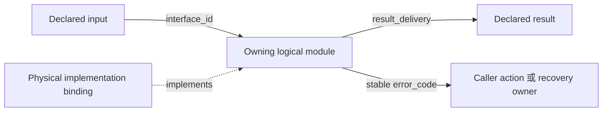

# 软件交付与发布治理（Software Delivery and Release Governance）

## 0. Intent Capsule

```yaml
layer: T0
t0_layer_id: the_software_delivery
status: candidate
canonical_owner: designDoc/the_software_delivery.md
owned_system_object: Production Software Delivery Lifecycle
scope:
  - production software ownership 与 release-unit boundary
  - pre-implementation Code Design 与 logical-module boundary
  - flow-first code-path design、显式 interface input/output contract 与稳定 error-code semantics
  - change impact、validation、build、package 与 release admission
  - deployment、canary、rollback、recovery、retirement 与 audit evidence
  - 跨所有 T1 与 platform component 的 CI 和 CD enforcement
non_goals:
  - product 或 domain behavior
  - Design Doc authoring 或 design approval
  - SystemChangePlan authoring、affected-surface classification、dependency ordering、plan review
  - business-quality、portfolio 或 publication judgment
  - Runtime execution semantics 或 workflow graph meaning
  - current package、command、service、model、deployment 或 release inventory
inputs:
  - approved Design Intent、CodeDesignBasis 与已有 parent 的 exact commit
  - 每个 production software change 的精确 reviewed SystemChangePlan step
  - build、test、migration、audit、compatibility 与 recovery evidence
outputs:
  - common Code Design 与 logical-module invariant
  - common software-delivery lifecycle 与 admission invariant
  - CI 和 CD 所需的 machine-contract family
  - generated release 与 deployment inspection requirement
truth_surfaces:
  - designDoc/the_software_delivery.md
  - 由代码持有的 software、change、release 与 deployment registry
runtime_triggers:
  - production-bearing software change proposal
  - release、deployment、rollback 或 retirement request
downstream_consumers:
  - CI 与 CD enforcement
  - service、platform、data 与 domain release owner
open_decisions:
  - target release-registry schema 与 deployment integration
  - 供 deterministic error routing 使用且由代码持有的 CodeDesignBasis caller-action vocabulary
review_gate: 每个 production software change 在 release admission 前都要求 approved Design Intent、deterministic validation，以及 engineering_change_reviewer output 的 engineering_layer_disposition 为 passed、software_delivery_readiness 为 accepted
runtime_surface_ledger: 从由代码持有的 software、change、release、deployment 与 rollback record 生成
verification_hooks:
  - primary-flow、interface-input/output 与 error-code closure
  - change-impact 与 dependency closure
  - build、test、migration、rollback 与 immutable release parity
  - 每个 required deterministic result 和 engineering-review result 的 exact-subject binding 与 semantic validation
```

## 1. Primary System Flow

```mermaid
flowchart LR
    PLAN["Reviewed SystemChangePlan<br/>精确 Software Delivery step"] -->|"code_design_request"| BASIS
    INTENT["Approved Design Intent"] -->|"code_design_request"| BASIS["Approved CodeDesignBasis"]
    BASIS -->|"implementation_candidate"| CHANGE["Source change"]
    CHANGE -->|"commit_submission"| COMMIT["Exact commit"]
    COMMIT -->|"validation_submission"| GATES["Validation gates"]
    COMMIT -->|"review_subject_submission"| RUNTIME
    RUNTIME["Agent Runtime<br/>独立 Reviewer 执行"] -->|"review_evidence_submission"| REVIEW["Software Delivery<br/>review evidence validation"]
    REVIEW -->|"release_candidate"| RELEASE
    GATES -->|"release_candidate"| RELEASE["Release admission"]
    RELEASE -->|"deployment_candidate"| DEPLOY["Deployment 与 observation"]
    DEPLOY -->|"activation_result"| ACTIVE["Active release 或 recovery"]
    ACTIVE -->|"retirement_request"| RETIRE["Retirement admission"]
    RETIRE -->|"retirement_result"| RETIRED["Retired release"]
    BASIS -->|"CODE_DESIGN_BASIS_INCOMPLETE"| REDESIGN["退回 Code Design"]
    CHANGE -->|"CHANGESET_DESIGN_DRIFT"| REDESIGN
    GATES -->|"VALIDATION_EVIDENCE_INCOMPLETE"| REWORK["退回 evidence owner"]
    RELEASE -->|"VALIDATION_EVIDENCE_INCOMPLETE"| REWORK
    DEPLOY -->|"DEPLOYMENT_RECOVERY_UNAVAILABLE"| HOLD["暂停 deployment"]
    RETIRE -->|"RETIREMENT_OBLIGATION_OPEN"| HOLD
```



| `interface_id` | Owner | Input | Output | Effects | Error codes |
| --- | --- | --- | --- | --- | --- |
| `code_design_request` | Software Delivery | Approved Design Intent，加上 reviewed `SystemChangePlan` 为该 production software change 指定的精确 Software Delivery step | Approved 或 rejected `CodeDesignBasis` | 验证 step 的 required result、owner、prerequisite result、authoring method、candidate type、review gate 与 completion condition；在批准前不授权任何 source change | `CODE_DESIGN_BASIS_INCOMPLETE` |
| `implementation_candidate` | Implementation owner | Approved `CodeDesignBasis` | 精确 source candidate | 不改变 active release | `CHANGESET_DESIGN_DRIFT` |
| `commit_submission` | Software Delivery | 有唯一 parent、绑定 exact reviewed `SystemChangePlan` step 与 approved `CodeDesignBasis` 的 exact commit | Reproducible engineering subject | 冻结 source identity；不准入 release | `CHANGESET_DESIGN_DRIFT` |
| `validation_submission` | Software Delivery | Exact commit 加 commit-bound deterministic evidence | Reproducible validation subject | 开启所需 deterministic validation gate | `VALIDATION_EVIDENCE_INCOMPLETE` |
| `review_subject_submission` | Software Delivery | Exact commit、parent、reviewed `SystemChangePlan` step、approved `CodeDesignBasis` 与 commit-bound test evidence | Agent Runtime 可执行的 Engineering Review input | 请求独立审查；不准入 release | `VALIDATION_EVIDENCE_INCOMPLETE` |
| `review_evidence_submission` | Software Delivery | Agent Runtime 以独立 Reviewer identity 执行已注册 `engineering_change_reviewer` 后返回、且绑定 exact commit 的 output | Schema-valid、semantic-valid 的 engineering review evidence，或明确拒绝该 evidence | 只形成 release admission 的输入 evidence；不准入 release | `VALIDATION_EVIDENCE_INCOMPLETE` |
| `release_candidate` | Software Delivery | Exact commit、完整 deterministic evidence，以及绑定该 commit、`engineering_layer_disposition: passed` 且 `software_delivery_readiness: accepted` 的 `engineering_change_reviewer` output | Admitted、held 或 rejected immutable release | 可以创建 environment-scoped release decision | `VALIDATION_EVIDENCE_INCOMPLETE` |
| `deployment_candidate` | Software Delivery | Admitted release 加 deployment 与 recovery plan | Observable deployment | 可以在声明的 scope 内改变 environment state | `DEPLOYMENT_RECOVERY_UNAVAILABLE` |
| `activation_result` | Software Delivery | Deployment observation 与 recovery evidence | Active release、hold、rollback 或 roll-forward result | 记录 terminal environment state | `DEPLOYMENT_RECOVERY_UNAVAILABLE` |
| `retirement_request` | Software Delivery | Active 或 superseded release，加 consumer、data、execution 与 access obligation closure evidence | Retirement validation subject | 开启 retirement admission，不改变 release state | `RETIREMENT_OBLIGATION_OPEN` |
| `retirement_result` | Software Delivery | 已通过 obligation-closure validation 的 retirement subject | Retired release result | 记录 terminal retirement state并保留所需 evidence | `RETIREMENT_OBLIGATION_OPEN` |

| `error_code` | Owner | Condition | Meaning | Caller action |
| --- | --- | --- | --- | --- |
| `CODE_DESIGN_BASIS_INCOMPLETE` | Software Delivery | Production software change 所需的 reviewed `SystemChangePlan` step 缺失、绑定到其他 plan 或 owner，或指定了错误的 required result、prerequisite result、authoring method、candidate type、review gate 或 completion condition；或者 primary flow、interface input/output、error-code、module、Slice、test、migration 或 rollback closure 不完整 | Implementation 未获授权 | 把 Plan mismatch 退回 Primary Agent，或把 design gap 退回 Code Design；不得创建 source candidate |
| `CHANGESET_DESIGN_DRIFT` | Software Delivery | As-built path、behavior、interface、effect 或 error 超出或违背 approved basis | Candidate 没有实现 approved design | 在 validation 前修订 basis 或 implementation |
| `VALIDATION_EVIDENCE_INCOMPLETE` | Software Delivery | Required deterministic gate 缺少可重现的 passing evidence；Agent Runtime 未返回已注册 Reviewer 的 output；或者 exact change set 的 `engineering_change_reviewer` output 缺失、`engineering_layer_disposition` 不是 `passed`、`software_delivery_readiness` 不是 `accepted`、绑定到其他 subject，或未通过 registered schema 或 semantic validator | Release admission 不可用 | 把 deterministic evidence gap 退回 gate owner，把 Reviewer execution 或 transport failure 退回 Agent Runtime，把 Design Basis insufficiency 退回 Design owner，把其他 actionable implementation finding 退回 implementation owner，或把 output identity、schema、semantic-validation 和 readiness failure 退回 Software Delivery review gate；不得准入 release |
| `DEPLOYMENT_RECOVERY_UNAVAILABLE` | Software Delivery | Deployment scope 缺少有效 canary、rollback、roll-forward 或 reconciliation path | Environment mutation 不安全 | 暂停 deployment 并修复 recovery closure |
| `RETIREMENT_OBLIGATION_OPEN` | Software Delivery | Consumer、data、execution 或 access obligation 未关闭，或 closure evidence 不完整 | Release 不得退役 | 保持当前 release state，把缺口退回对应 obligation owner；不得记录 retired result |

## 2. User Intent

定义一个系统级 production software delivery lifecycle，使每个受影响 T1 都在相同 ownership、
evidence 与 fail-closed rule 下修改、验证、发布、部署、恢复和退役 production software。该结果
阻止 implementation、passing test、Reviewer verdict 或 deployment action 暗中替代其他必需 decision。

## 3. Reader Gain

Engineering Lead、Service Owner 与 Release Engineer 可以判断一个 production software change
能否从 reviewed plan step 推进到 Code Design、implementation、validation、release、deployment、
recovery 与 retirement。Platform Architect 可以区分 logical responsibility 与 physical
implementation，并检查每个 public seam。Independent Engineering Reviewer 可以依据 approved
basis 判断精确 change，同时识别其 verdict 是 evidence，不是 release 或 deployment authority。

## 4. Owned System Object

Software Delivery 持有一个 logical object：`Production Software Delivery Lifecycle`。它是系统级
decision surface，治理 production software change 如何从 approved `CodeDesignBasis` 推进到
immutable release、deployment、recovery 与 retirement。

它不持有 product intent、`SystemChangePlan` authoring 或 routing、current code truth、
universal review rule、Runtime execution semantics 或 domain acceptance。本合同中的 code-owned record
实现并证明 lifecycle；它们不是额外的 T0-owned object。

## 5. Authority

Software Delivery 持有 production software change 与 release 的 admission。它不决定产品应当做
什么。所属 T0 或 T1 Design Contract 定义 intent，代码实现 approved intent。

以下 decision 相互独立：

| Decision | Canonical owner |
| --- | --- |
| Production software change 需要哪些 cross-owner work 与 terminal evidence | System Change Governance |
| 预期的 behavior 或 boundary 是什么 | 所属 T0 或 T1 Design Contract |
| Intended behavior 与 boundary 在 implementation 前是否具有 approved Design Intent | Design Doc Management 与 accountable design owner |
| Implementation 当前做什么 | Code、schema、test 与 code-owned Registry |
| 精确 engineering change 是否通过 registered independent engineering review | Software Delivery 通过 `engineering_change_reviewer` 判断 |
| Software change 或 release 是否可以进入 environment | Software Delivery |
| Deployed business output 是否被接受 | 所属 product 或 domain T1 |

一行中的 successful decision 不能替代另一行。Design approval 不证明 implementation。Passing
test 不准入 release。Independent Review verdict 是 Software Delivery 消费的 evidence；它不是
deployment authority。

## 6. 覆盖的软件

本合同适用于每个 production-bearing software asset，包括：

- service、API、worker、scheduled job、event consumer 与 user interface；
- library、package、command-line interface、generated client 与 shared SDK；
- Agent Runtime core、adapter、domain plugin、deterministic-workflow definition 与 host composition；
- router、validator、data connector、gateway 与 canonical writer；
- database schema、migration、backfill 与 compatibility projection；
- infrastructure definition、configuration schema、deployment manifest 与 operational automation。

Repository path 或 executable file 是 implementation material。Production admission 要求 registered
owner 与 release unit。

每个 product 或 domain T1 继续持有其 business workflow 与 acceptance criteria。本 T0 提供这些
T1 contract 必须遵守的 delivery invariant；它不在此扩展其 operation。

## 7. Required Machine Contracts

Software Delivery 要求以下 logical record family。它们的精确 schema、ID、validator、storage 与
current instance 属于代码。

| Machine contract | Responsibility |
| --- | --- |
| `SoftwareAssetRegistration` | 标识一个 production-bearing asset、其 owner、public contract、side effect、dependency 与 required validation class |
| `ReleaseUnitRegistration` | 定义一个独立 versioned、buildable、deployable 或 distributable unit 及其 member asset |
| `LogicalModuleRegistration` | 定义一项 independently reviewable responsibility、其 resource、public interface、dependency direction、failure 与 recovery behavior、required test、future capability 与 current implementation binding |
| `CodeDesignBasis` | 为一个 production software change 冻结 approved pre-implementation primary flow、interface 与 error-code identity、owner 与 uniqueness、interface input/output contract、registered caller-action vocabulary、error-code semantics、logical-module design、Slice boundary、architecture disposition、seam、migration 与 compatibility obligation、rollback boundary 与 acceptance criteria |
| `ValidationGateRegistration` | 声明一个 risk class 要求的 deterministic 或 judgment-bearing evidence |
| `ReleaseManifest` | 绑定 immutable build input、artifact、version、compatibility evidence、validation result 与 release decision |
| `DeploymentRecord` | 记录精确 release、environment、scope、configuration、activation result 与 observation evidence |
| `RollbackRecord` | 记录已执行的 rollback 或 roll-forward recovery 及其 reconciliation result |
| `RetirementRecord` | 证明 consumer closure、data obligation、access revocation 与 final disposition |

上面的 primary flow 是供人阅读的关系。精确 `CodeDesignBasis`、asset、change-set、validation、
release、deployment、rollback 与 retirement schema 和 record 由代码持有。Current file、command、
version、dependency、test selection、environment 与 release state 从这些 record 生成，不作为
Markdown inventory 手工维护。

## 8. Change 与 Release Lifecycle

Production software change 按以下顺序进行：

1. 对每个 production software change，解析所属 Design Contract 与 approved intended result，
   再验证分配给 Software Delivery 的精确 reviewed `SystemChangePlan` step。该 step 必须命名
   required result、owner、prerequisite result、authoring method、candidate type、review gate 与
   completion condition。
2. 冻结一个 `CodeDesignBasis`。它先展示 primary code path，再定义每个 public interface input
   与 output 以及每个 stable error code，随后定义 affected logical module、responsibility、resource、
   dependency、Slice boundary、recovery behavior、test、future capability、implementation binding 与 rollback boundary。
3. 只实现 declared design，并计算 affected software asset、release unit、public contract、data
   surface、consumer 与 operational effect。
4. 创建有唯一 parent 的 exact commit。代码从 commit 与 parent 机械取得 changed paths、content、diff
   与 subject hash，并把 reviewed `SystemChangePlan` step、approved `CodeDesignBasis` 和 deterministic
   evidence 直接绑定到该 commit；不创建第二份 change manifest。
5. 执行每个 affected risk dimension 要求的 validation gate 并集。
6. 由 Agent Runtime 以独立 Reviewer identity 执行已注册的 `engineering_change_reviewer`，取得绑定 exact commit 的 output，其中
   `engineering_layer_disposition: passed` 且 `software_delivery_readiness: accepted`；risk policy
   可以要求 additional bounded review evidence。
7. 构建 immutable release，并在 `ReleaseManifest` 中绑定其 evidence。
8. 为声明的 environment 与 rollout scope 准入 release。
9. 观察 release，然后 activate、通过 registered rollback 或 roll-forward path 恢复，或者 hold。
10. 通过 `retirement_request` 验证 consumer、data、execution 与 access obligation closure；未关闭时返回
    `RETIREMENT_OBLIGATION_OPEN` 并保持当前 state，全部关闭后才记录 `retirement_result` 并退役 superseded release。

Validation 前，代码把 exact commit 相对 parent 的 diff 与其绑定的 `CodeDesignBasis` 进行比较。
Undeclared resource、path、dependency、public effect 或 rollback obligation 会 fail closed，并退回所属
change workflow。

Exploratory prototype 可以在 design approval 前存在，前提是它与 production registry、canonical
data、active routing、customer access 与 release admission 隔离。

### 8.1 Logical responsibility 与 physical implementation

Logical module 是 independently reviewable responsibility unit。它不是 file、directory、class、
process、package、service、Agent Runtime Module、deployment unit、database schema 或 technology
choice 的同义词。

`Slice boundary` 是一个 `CodeDesignBasis` 中可独立实现、验证、审查和回滚的最小结果范围，
其 governing meaning 由 Software Delivery 定义。完整的 boundary 必须明确本 Slice 要交付的
intended result、所含 logical module、public seam、resource、test 与 rollback obligation、已经
满足的 predecessor dependency，以及明确不在本 Slice 完成的后续结果。被排除的后续 integration
不能成为当前 Slice 的 pass 条件；当前 Slice 的 declared result 必须能够在 frozen predecessor 上
独立验证。

Code Design 先固定 logical responsibility、resource boundary、public interface、dependency
direction、failure 与 recovery behavior、test 和 future capability need。随后把 physical file 与
technology 记录为可替换的 implementation binding。Diagram 或 module map 在未标示各自关系的
情况下，不能把 logical responsibility、physical source organization 与 concrete technology
呈现为 peer dimension。

如果 current architecture 要求 duplicated authority、hidden cross-module dependency、
compatibility shadow 或其他 local bypass，change 就退回 Code Design。Temporary side
implementation 不能替代对 blocking architecture 的解决。

### 8.2 Flow、interface 与 error contract

每个 production software 的 `CodeDesignBasis` 都以 primary flow diagram 开始，先于 module
inventory、file mapping 或 explanatory prose。Diagram 沿 intended result，从 entry 经每项 logical
responsibility 到 successful output。每条 handoff edge 命名一个 `interface_id`，并解析到一条
interface row；每条 failure edge 命名其 stable `error_code`，并解析到一条 error row。随后立即为
每个 interface 定义 exact logical input、successful output、externally visible effect 与可能的
`error_code` value。

Primary flow 或 public seam 中的每条 failure path 都有一个 stable error code。Error contract
定义 producing owner、trigger condition、meaning 与 required caller action。Retry、fallback、
recovery 与 routing decision 消费这些 code。Log message、exception class、prose phrase 或 provider
response 是 diagnostic detail，不能替代 stable code。`interface_id` 或 `error_code` 由其 owning
logical module 声明一次；其他 basis 或 module 可以引用该 identity，但不能重新定义其 meaning。

Diagram 保持 logical contract 的规范性，并只通过已标记的 non-peer relation 展示 physical
implementation binding：



Primary flow 与 contract 在 logical design level 具有规范性。Physical path 与 technology 保持
replaceable implementation binding。Test 在 owning seam 证明 success output 与每个 declared
error code。Implementation 或 review package 都不能引入 approved basis 未声明的新 public input、
output、effect、fallback 或 failure code。

## 9. Risk 与 Validation Policy

Risk policy 由代码持有并 versioned。它依据 public compatibility、stored data、authorization、
tenant 或 Cell isolation、external effect、infrastructure、supply chain 与 recovery 等 dimension
评估 change。Required gate set 是每个 applicable dimension 的并集。

Machine-decidable obligation 作为 deterministic CI 或 release gate 运行。典型例子包括 schema
validation、dependency closure、test、compatibility、migration rehearsal、secret scanning、artifact
hashing、signature validation 与 rollback availability。

每个 registered deterministic gate 都提供 versioned Software Delivery risk policy 要求的 paired
executable evidence。Software Delivery 在 admission 前验证该 evidence 解析到精确 gate、change set
与 release candidate；它不重新定义 evidence-quality rule。

每个 production change set 都接受 subject-specific `engineering_change_reviewer` judgment。Software
Delivery 拥有该 Reviewer 的 subject-specific checklist、input/output meaning、schema、semantic
validator 与 release-readiness interpretation。Review Contract 只提供机械注入 Reviewer instruction 的
common review order、exact-subject boundary 与 finding discipline。Risk policy 可以要求 additional
bounded architecture、security 或 semantic review evidence。Exact subject 与 evidence 保持
immutable。Reviewer 不能豁免 failed deterministic gate，也不能准入被审 release。

下方 marker body 是该 subject-specific checklist 的唯一 editable source；Skill package 中的 Reviewer
prompt 必须 byte-exact 投影该 body，任何不一致都由 deterministic projection gate 拒绝。

<!-- engineering-change-review-checklist:start -->
`engineering_change_reviewer` 必须在一次审核中完整判断以下结果：

1. 已注册 deterministic evidence 证明 exact commit、其 parent、reviewed `SystemChangePlan` step、approved `CodeDesignBasis` 与 commit-bound test evidence 彼此绑定；changed paths、content、diff 与 subject hash 已由代码从 commit 机械生成，Reviewer 不用自然语言重新执行 hash、schema、Git parsing 或 registration check；
2. approved Design Basis 足以实施；若仍需补 T1/T2 intent、改变 parent/peer authority 或复制 peer contract，返回 Design owner，不在工程审核中补设计；
3. selected Slice 的行为、failure、recovery、public interface、in-scope seam 与明确延期项完整一致，且没有 undeclared scope、dependency、effect、migration、projection 或 compatibility behavior；
4. 每个 public handoff 与 declared `interface_id` 的 input、success output、effect 一致；每个 observable failure 与 declared stable `error_code` 及 caller action 一致；
5. final-state source、test、comment、document、compatibility path 与 release note 不保留只用于解释 rejected alternative 的残留；
6. 每个新增责任进入 Design Basis 指定的 owner 与 canonical path；不存在未声明的 parallel path、wrapper、adapter、registry、state store、schema 或 orchestration layer，superseded path 已删除或明确延期；
7. 每项 required gate 都有绑定 exact subject 的 registered result；failed 或 missing deterministic gate 不能被 Reviewer 覆盖；
8. semantic review 通过后，才对同一 candidate 的 human-facing Design Docs、README、comments、error messages、migration notes 与 release notes 做 prose and meaning-preservation check；
9. `engineering_layer_disposition`、`software_delivery_readiness`、`subject_closure`、`gate_results`、findings 与 `safe_next_step` 互相一致。
<!-- engineering-change-review-checklist:end -->

Focused test 只证明其 registered surface。除非 complete required gate set 已通过，否则 focused
pass 不能被表述为 repository-wide、platform-wide 或 release-wide conformance。

Gate completion 是关于 declared release surface 的 evidence。所属 product 或 domain acceptance
criteria 仍决定 delivered result 是否正确且有用。Completed CI/CD sequence 不能替代 outcome judgment。

## 10. Deployment 与 Recovery

每个 admitted release 遵守以下约束：

- build input 与 release artifact immutable 且绑定 hash；
- deployment scope、configuration、identity 与 environment 显式；
- schema 与 data change 声明 writer order、compatibility window、reconciliation、cutover 与 recovery；
- protected external action 与 canonical write 使用已授权且 idempotent 的 service boundary；
- canary criteria 与 observation window 在 activation 前声明；
- rollback 或 roll-forward recovery 按 policy 要求的 risk level 测试；
- in-flight workflow 继续固定到 compatible release，或者遵守显式 drain、suspension、cancellation
  或 restart policy；
- retirement 保留 replay、incident review、compliance 与 dependency tracing 所需 evidence。

任何 deployment 都不能暗中选择 unregistered fallback、扩大 tenant 或 Cell scope、改变 canonical
writer，或在 pinned execution 内采用 newer component。

## 11. Enforcement 与 Generated Inspection

实现必须提供：

- 由代码持有的 software asset 与 release-unit Registry；
- deterministic change-impact closure；
- risk-to-gate resolution；
- immutable validation、release、deployment、rollback 与 retirement record；
- 每个 registered admission boundary 上的 CI 与 CD enforcement；
- current owner、asset、release、dependency、required gate、evidence、environment、compatibility
  window 与 unresolved failure 的 generated inspection。

Generated inspection 是 explanatory output。编辑它不能改变 owner、gate、release、deployment、
rollback 或 retirement decision。

## 12. System-wide Invariants

1. 每个 production software asset 有一个 canonical owner 与一个 release unit。
2. 每个 production software change 在 implementation 前都有 approved `CodeDesignBasis`。
3. 每个 logical module 声明其 responsibility、resource boundary、public interface、dependency
   direction、failure 与 recovery behavior、required test、future capability 与 current implementation binding。
4. 每个 production software 的 `CodeDesignBasis` 在 implementation detail 前展示一条 primary
   code path；每条 handoff edge 解析到一个显式 interface input/output contract。
5. 每条 externally observable failure path 有一个 stable error code 与 owner-defined caller action。
6. 每个 production software change 在 release admission 前解析完整 impact。
7. Material design approval 先于 production implementation。
8. 每个 release immutable，并可从 registered build input 重现。
9. Required validation 从由代码持有的 risk policy 推导。
10. 每个 production change set 有一个精确 `engineering_change_reviewer` judgment；该 judgment 与
    Software Delivery 的 release admission 是不同结果。
11. Schema、data、authorization、side-effect 与 recovery obligation 不能被 author summary 省略。
12. Deployment、activation、rollback 与 retirement 是显式 recorded state。
13. Current delivery truth 来自 code 与 persistent record。
14. Missing ownership、impact、evidence、compatibility 或 recovery closure 会 fail closed。
15. Reviewed `SystemChangePlan` 可以要求 Software Delivery evidence，并把一个精确 step 路由到
    本 authority，但不能 build、admit、deploy、roll back 或 retire release。

## 13. Peer Boundaries

| Peer contract | Handoff to Software Delivery |
| --- | --- |
| System Change Governance | 提供 reviewed `SystemChangePlan`，其精确 Software Delivery step 命名 required result、owner、prerequisite result、authoring method、candidate type、review gate 与 completion condition；Software Delivery 在 entry 验证该 step，并把任何 mismatch 退回 Primary Agent，不接管 planning |
| Design Doc Management | 提供 approved design identity 与 material-change disposition |
| Review Contract | 提供 common review order、exact-subject boundary、finding discipline 和机械注入的 universal instruction；不拥有 engineering checklist、Reviewer output、release readiness 或 admission decision |
| Agent Runtime | 以独立 Reviewer identity 执行已注册的 `engineering_change_reviewer`，并把绑定精确 change set 的 output 返回 `review_evidence_submission`；Agent Runtime 只拥有 Reviewer execution 与 transport，不解释 Software Delivery 的 checklist、result meaning 或 readiness。它同时提供作为 software asset 交付的 versioned Runtime、adapter、plugin、execution 与 conformance surface |
| Agency Platform | 提供 product composition、environment、Cell 与 host placement constraint |
| Product Authorization | 提供 deployment operation 与 protected effect 的 authorization requirement |
| Data Governance | 提供 Data Asset、System-of-Record 与 writer binding、migration、residency、retention、backup、recovery、export 与 destruction obligation |
| Timestamp and Clock Semantics | 提供 build、release、deployment 与 audit record 的 time-field 和 clock requirement |

所属 product 或 domain T1 提供 business test 与 acceptance criteria。Software Delivery 把它们作为
registered release evidence 应用，但不取得其 meaning 的 ownership。

## 14. References

- [Project Charter](the_charter.md)
- [System Change Governance](the_system_change_governance.md)
- [Design Doc Management](the_design_doc_management.md)
- [Review Contract](the_review_contract.md)
- [Agent Runtime](the_agent_runtime.md)
- [Agency Platform](the_agency_platform.md)
- [Product Authorization](the_product_authorization.md)
- [Data Governance](the_data_governance.md)
- [Timestamp and Clock Semantics](the_timestamp_semantic.md)
