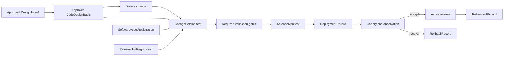

# Software Delivery and Release Governance

**Purpose**: Define the system-wide rules for changing, validating, releasing,
deploying, rolling back, and retiring production software.

**Required reader gain**: A reader can distinguish approved design, implemented
code, validation evidence, Independent Review, release admission, and deployment
state; identify the machine contracts required to enforce that separation; and
reject a production change whose ownership, impact, test, migration, or recovery
closure is incomplete.

## 0. Intent Capsule

```yaml
layer: T0
t0_layer_id: the_software_delivery
status: candidate
canonical_owner: designDoc/the_software_delivery.md
owned_system_object: Software Change, Release, and Deployment
scope:
  - production software ownership and release-unit boundaries
  - pre-implementation Code Design and logical-module boundaries
  - change impact, validation, build, package, and release admission
  - deployment, canary, rollback, recovery, retirement, and audit evidence
  - CI and CD enforcement across every T1 and platform component
non_goals:
  - product or domain behavior
  - Design Doc authoring or design approval
  - business-quality, portfolio, or publication judgment
  - Runtime execution semantics or workflow graph meaning
  - current package, command, service, model, deployment, or release inventory
inputs:
  - approved Design Intent, CodeDesignBasis, and exact ChangeSetManifest
  - build, test, migration, audit, compatibility, and recovery evidence
owned_specialization_contracts:
  - designDoc/agent_runtime_05_delivery_roadmap.md
outputs:
  - common Code Design and logical-module invariants
  - common software-delivery lifecycle and admission invariants
  - required machine-contract families for CI and CD
  - generated release and deployment inspection requirements
truth_surfaces:
  - designDoc/the_software_delivery.md
  - code-owned software, change, release, and deployment registries
runtime_triggers:
  - production-bearing software change proposal
  - release, deployment, rollback, or retirement request
downstream_consumers:
  - CI and CD enforcement
  - service, platform, data, and domain release owners
open_decisions:
  - target release-registry schema and deployment integration
review_gate: approved Design Intent followed by deterministic validation and independent engineering review when required by risk policy
runtime_surface_ledger: generated from code-owned software, change, release, deployment, and rollback records
verification_hooks:
  - change-impact and dependency closure
  - build, test, migration, rollback, and immutable release parity
```

## 1. Authority

Software Delivery owns the admission of production software changes and
releases. It does not decide what the product should do. The owning T0 or T1
Design Contract defines intent, and code implements that approved intent.

These decisions remain separate:

| Decision | Canonical owner |
| --- | --- |
| What behavior or boundary is intended | Owning T0 or T1 Design Contract |
| Whether a material design may proceed to implementation | Design Doc Management and the accountable design owner |
| What the implementation currently does | Code, schemas, tests, and code-owned Registries |
| Whether an immutable subject passed Independent Review | Contract Audit |
| Whether a software change or release may enter an environment | Software Delivery |
| Whether a deployed business output is accepted | Owning product or domain T1 |

A successful decision in one row cannot substitute for another. Design
approval does not prove implementation. Passing tests does not admit a release.
An Independent Review verdict is evidence consumed by Software Delivery; it is
not deployment authority.

## 2. Covered Software

This contract applies to every production-bearing software asset, including:

- services, APIs, workers, scheduled jobs, event consumers, and user interfaces;
- libraries, packages, command-line interfaces, generated clients, and shared SDKs;
- Agent Runtime core, adapters, domain plugins, Dagster definitions, and host composition;
- routers, validators, data connectors, gateways, and canonical writers;
- database schemas, migrations, backfills, and compatibility projections;
- infrastructure definitions, configuration schemas, deployment manifests, and operational automation.

A repository path or executable file is implementation material. Production
admission requires a registered owner and release unit.

## 3. Required Machine Contracts

Software Delivery requires the following logical record families. Their exact
schemas, IDs, validators, storage, and current instances belong to code.

| Machine contract | Responsibility |
| --- | --- |
| `SoftwareAssetRegistration` | Identifies one production-bearing asset, its owner, public contracts, side effects, dependencies, and required validation classes |
| `ReleaseUnitRegistration` | Defines one independently versioned, buildable, deployable, or distributable unit and its member assets |
| `LogicalModuleRegistration` | Defines one independently reviewable responsibility, its resources, public interfaces, dependency direction, failure and recovery behavior, required tests, future capabilities, and current implementation bindings |
| `CodeDesignBasis` | Freezes the approved pre-implementation logical-module design, architecture disposition, seams, migration and compatibility obligations, rollback boundary, and acceptance criteria for one material change |
| `ChangeSetManifest` | Binds one exact source change to its approved `CodeDesignBasis` ref/hash and to the affected assets, contracts, consumers, data surfaces, tests, migrations, and release units |
| `ValidationGateRegistration` | Declares the deterministic or judgment-bearing evidence required for a risk class |
| `ReleaseManifest` | Binds immutable build inputs, artifacts, versions, compatibility evidence, validation results, and release decision |
| `DeploymentRecord` | Records the exact release, environment, scope, configuration, activation result, and observation evidence |
| `RollbackRecord` | Records an executed rollback or roll-forward recovery and its reconciliation result |
| `RetirementRecord` | Proves consumer closure, data obligations, access revocation, and final disposition |

The code-owned relationship is:



Current files, commands, versions, dependencies, test selections, environments,
and release states are generated from these records. They are not maintained
as a Markdown inventory.

## 4. Change and Release Lifecycle

A material production change follows this sequence:

1. Resolve the owning Design Contract and approved intended result.
2. Freeze a `CodeDesignBasis` that defines the affected logical modules, responsibilities, resources, interfaces, dependencies, failure and recovery behavior, tests, future capabilities, implementation bindings, and rollback boundary.
3. Implement only the declared design and compute the affected software assets, release units, public contracts, data surfaces, consumers, and operational effects.
4. Freeze a `ChangeSetManifest` for the exact as-built change, including the `design_basis_ref` and `design_basis_sha256` of the approved `CodeDesignBasis`.
5. Execute the union of validation gates required by every affected risk dimension.
6. Run Contract Audit when the registered policy requires Independent Review.
7. Build an immutable release and bind its evidence in a `ReleaseManifest`.
8. Admit the release for a declared environment and rollout scope.
9. Observe the release and either activate it, recover through the registered rollback or roll-forward path, or hold it.
10. Retire superseded releases only after consumer, data, execution, and access obligations close.

Before validation, code compares the `ChangeSetManifest` with its referenced
`CodeDesignBasis`. Undeclared resources, paths, dependencies, public effects, or
rollback obligations fail closed and return to the owning change workflow.

Exploratory prototypes may precede design approval when they are isolated from
production registries, canonical data, active routing, customer access, and
release admission.

### 4.1 Logical responsibility and physical implementation

A logical module is an independently reviewable unit of responsibility. It is
not a synonym for a file, directory, class, process, package, service, Agent
Runtime Module, deployment unit, database schema, or technology choice.

Code Design first fixes logical responsibility, resource boundary, public
interface, dependency direction, failure and recovery behavior, tests, and
future capability needs. It then records physical files and technologies as
replaceable implementation bindings. A diagram or module map must not present
logical responsibilities, physical source organization, and concrete
technology as peer dimensions without labeling their relationship.

When the current architecture would require duplicated authority, hidden
cross-module dependency, a compatibility shadow, or another local bypass, the
change returns to Code Design. A temporary side implementation is not an
acceptable substitute for resolving the blocking architecture.

## 5. Risk and Validation Policy

Risk policy is code-owned and versioned. It evaluates the change against
dimensions such as public compatibility, stored data, authorization, tenant or
Cell isolation, external effects, infrastructure, supply chain, and recovery.
The required gate set is the union of every applicable dimension.

Machine-decidable obligations run as deterministic CI or release gates. Typical
examples include schema validation, dependency closure, tests, compatibility,
migration rehearsal, secret scanning, artifact hashing, signature validation,
and rollback availability.

Architecture, semantic consistency, security judgment, and other bounded
review questions run through registered Independent Review profiles. The exact
subject and evidence remain immutable. A reviewer cannot waive a failed
deterministic gate or admit the reviewed release.

Focused tests prove only their registered surface. A focused pass cannot be
reported as repository-wide, platform-wide, or release-wide conformance unless
the complete required gate set passed.

## 6. Deployment and Recovery Invariants

Every admitted release obeys these constraints:

- build inputs and release artifacts are immutable and hash-bound;
- deployment scope, configuration, identity, and environment are explicit;
- schema and data changes declare writer order, compatibility window, reconciliation, cutover, and recovery;
- protected external actions and canonical writes use their authorized, idempotent service boundary;
- canary criteria and observation windows are declared before activation;
- rollback or roll-forward recovery is tested at the risk level required by policy;
- in-flight workflows remain pinned to compatible releases or follow an explicit drain, suspension, cancellation, or restart policy;
- retirement preserves the evidence required for replay, incident review, compliance, and dependency tracing.

No deployment may silently select an unregistered fallback, widen tenant or
Cell scope, change a canonical writer, or adopt a newer component inside a
pinned execution.

## 7. Peer T0 Boundaries

| Peer contract | Handoff to Software Delivery |
| --- | --- |
| Design Doc Management | Supplies approved design identity and material-change disposition |
| Contract Audit | Supplies immutable Independent Review evidence for the registered subject and profile |
| Agent Runtime | Supplies versioned Runtime, adapter, plugin, execution, and conformance surfaces that are delivered as software assets |
| Agency Platform | Supplies product composition, environment, Cell, and host placement constraints |
| Product Authorization | Supplies authorization requirements for deployment operations and protected effects |
| Data Governance | Supplies Data Asset, System-of-Record and writer binding, migration, residency, retention, backup, recovery, export, and destruction obligations |
| Timestamp and Clock Semantics | Supplies time-field and clock requirements for build, release, deployment, and audit records |
| Artifact Graph | Supplies the registered Workflow, Operation, Artifact, owning Design Contract, dependency, provenance, readiness, and invalidation relationships affected by a change |

The owning product or domain T1 supplies business tests and acceptance criteria.
Software Delivery applies them as registered release evidence without taking
ownership of their meaning.

## 8. Enforcement and Generated Inspection

The implementation must provide:

- a code-owned software asset and release-unit Registry;
- deterministic change-impact closure;
- risk-to-gate resolution;
- immutable validation, release, deployment, rollback, and retirement records;
- CI and CD enforcement at every registered admission boundary;
- generated inspection of current owners, assets, releases, dependencies, required gates, evidence, environments, compatibility windows, and unresolved failures.

Generated inspection is explanatory output. Editing it cannot change an owner,
gate, release, deployment, rollback, or retirement decision.

## 9. Invariants

1. Every production software asset has one canonical owner and one release unit.
2. Every material production change has an approved `CodeDesignBasis` before implementation.
3. Every logical module states its responsibility, resource boundary, public interfaces, dependency direction, failure and recovery behavior, required tests, future capabilities, and current implementation bindings.
4. Every material change resolves its complete impact before release admission.
5. Material design approval precedes production implementation.
6. Every release is immutable and reproducible from registered build inputs.
7. Required validation is derived from code-owned risk policy.
8. Independent Review and release admission use separate identities and records.
9. Schema, data, authorization, side-effect, and recovery obligations cannot be omitted by an author summary.
10. Deployment, activation, rollback, and retirement are explicit recorded states.
11. Current delivery truth comes from code and persistent records.
12. Missing ownership, impact, evidence, compatibility, or recovery closure fails closed.

## References

- [Product Charter](the_charter.md)
- [Design Doc Management](the_design_doc_management.md)
- [Contract Audit](the_contract_audit.md)
- [Agent Runtime](the_agent_runtime.md)
- [Agency Platform](the_agency_platform.md)
- [Product Authorization](the_product_authorization.md)
- [Artifact Graph](the_artifact_graph.md)
- [Data Governance](the_data_governance.md)
- [Timestamp and Clock Semantics](the_timestamp_semantic.md)
