# System Change Governance

**Purpose**: Govern one coherent change from authorized intake through scope,
owner decisions, specialist work, independent assurance, subject-specific
admission, and cross-owner closure without taking authority from any changed
subject.

**Required reader gain**: A reader can decide whether a request changes a
governed system surface, identify every affected authority and implementation
surface, send each part to its real owner, and determine whether the overall
change is complete without treating coordination as design, review, or release
authority.

## 0. Intent Capsule

```yaml
layer: T0
t0_layer_id: the_system_change_governance
status: candidate
canonical_owner: designDoc/the_system_change_governance.md
owned_system_object: System Change Case
scope:
  - universal intake for every governed system mutation
  - immutable change-scope assessment and cross-owner impact closure
  - versioned System Change Plan and specialist Work Package coordination
  - coherent candidate-set freeze, revision lineage, and case closure
  - structure-change coordination and self-change bootstrap law
non_goals:
  - semantic task classification
  - defining or approving the meaning of any changed Charter, T0, T1, T2, Skill, Runtime, Data, or software subject
  - owning an Audit Profile, reviewer binding, finding, verdict, or subject admission
  - authoring Design, Skill, Runtime registration, code, schema, migration, release, or deployment candidates
  - selecting a provider, model, workflow engine, database, repository layout, or user interface
inputs:
  - authorized system-change request and immutable RoutingDecision
  - current authority topology and registered subject identities
  - owner-supplied decisions, candidates, assurance results, and admission results
outputs:
  - immutable SystemChangeCase and SystemChangeScopeAssessment
  - versioned SystemChangePlan and SystemChangeWorkPackage bindings
  - coherent SystemChangeCandidateSet and SystemChangeClosureRecord
truth_surfaces:
  - designDoc/the_system_change_governance.md
  - logical:system_change_registry
runtime_triggers:
  - authorized request to create, update, promote, split, merge, replace, rename, retire, release, or deploy a governed system surface
downstream_consumers:
  - every affected Design, Skill, Runtime, Engineering, Data, Audit, and Software Delivery owner
  - change inspection, release admission, and governance assurance workflows
open_decisions:
  - admitted machine schemas and persistence binding for the target record model
  - predecessor-record migration and final retirement evidence
review_gate: accountable Charter approval for T0 topology and independent `system_change_governance_reviewer` review
runtime_surface_ledger: generated from code-owned System Change records and external terminal evidence
verification_hooks:
  - scope-to-impact-to-Work-Package closure
  - candidate-set coherence and current-head lineage
  - external review and admission reference resolution
  - self-change predecessor and bootstrap closure
  - specialist owner and entry-subject applicability rejection
```

## 1. Authority

System Change Governance owns the `SystemChangeCase`: the stable identity and
cross-owner coordination record for one governed mutation. It decides neither
what a changed subject should mean nor whether that subject may become active.

A system change is any request that mutates a governed surface, including a
Charter, T0, T1, T2, Design projection, Skill, prompt, Runtime Module or
Workflow registration, code, schema, Registry, maintained configuration,
migration, test gate, release, deployment, rollback, or retirement. Normal
execution of an already admitted business Workflow remains with that Workflow.
Changing its contract, implementation, registration, permission boundary, or
release state opens a System Change Case.

Every bounded fix and every cross-authority redesign enters the same intake.
Materiality changes the required decisions, Work Packages, assurance, and
admission. It never exempts a governed mutation from case capture.

Correctness of the requested result has priority over completion of the
coordination sequence. A complete Case record cannot make a wrongly scoped,
wrongly owned, semantically incorrect, or operationally ineffective subject
correct. When evidence invalidates the intended result, scope, owner, or
acceptance criteria, the Case returns to the owning decision instead of
preserving the previous process path for procedural continuity.

## 2. Parent Authority and Peer T0 Boundaries

The following objects and decisions remain separate:

| Authority | Owned object or decision | Handoff to System Change Governance |
| --- | --- | --- |
| Project Charter (parent authority) | Product constitution and peer T0 topology | Supplies accountable decisions for constitutional and T0-topology changes |
| Product Authorization | Principal, Entitlement, and Authorization Decision | Supplies request eligibility and authorization evidence for protected operations |
| Task Routing | Requested-outcome classification and `RoutingDecision` | Routes a request that mutates a governed surface to `system_change_intake` |
| Agency Platform | Enterprise product host and Workflow Control Plane | Owns host composition, Cell placement, product exposure, and Workflow Control Plane decisions required by a change |
| Artifact Graph | Registered Workflow, Operation, Artifact, Design Contract, and dependency graph | Supplies registered identity and impact evidence without deciding change scope |
| Timestamp and Clock Semantics | Time-bearing data semantics | Owns time-field, clock, calendar, ordering, and freshness meaning required by a change |
| Design Doc Management | Design Intent, Design approval, and Design lifecycle | Authors and admits each required Design candidate through a Design Work Package |
| Skill Management | Skill definition, classification, projection, and lifecycle | Authors and accepts each required Skill candidate through a Skill Work Package |
| Agent Runtime | Provider-neutral Agent execution and Runtime release admission | Owns Runtime registration, conformance, execution, and Runtime admission decisions |
| Data Governance | Managed Data Asset and physical Data Binding | Owns schema, writer, placement, migration, retention, and recovery decisions |
| Contract Audit | Audit Profile, Audit Execution, findings, and `AuditResult` | Returns exact subject-bound assurance results without editing or admitting the subject |
| Software Delivery | Software Change, Release, Deployment, and recovery | Owns as-built change, release, deployment, rollback, and retirement admission |

System Change Governance stores references to those decisions and verifies
their relation to the current Case. It does not copy their contents into a new
authority or aggregate them into a substitute approval.

## 3. Intake and Scope Assessment

Task Routing performs one semantic decision. When the requested durable result
is a mutation of a governed system surface, it selects
`system_change_intake`. Design, Skill, Runtime, Engineering, Audit, and
Delivery are specialist Work Packages or external requirements inside the
resulting Case. Their names do not bypass intake.

The first Case result is an immutable `SystemChangeScopeAssessment` that
states:

- the requested durable result;
- primary changed subject kind, identity, layer, and current owner;
- every affected subject, its owner, and its relation to the primary subject;
- the operation: `create`, `update`, `promote`, `split`, `merge`, `replace`,
  `rename`, `retire`, `release`, `deploy`, `rollback`, or `roll_forward`;
- the change scope: within-object, cross-layer handoff, peer responsibility,
  authority topology, or implementation-only;
- materiality and its effect on required gates;
- authority impacts and implementation impacts as separate sets;
- parent authority, peer context when applicable, unresolved ambiguity, and
  required accountable decisions; and
- exact evidence references used to form the assessment.

Scope Assessment does not classify the original user task again. It describes
which governed objects the already-routed system change would mutate.
Contradictory or unresolved owner, layer, operation, or peer context stops the
Case before specialist authoring begins.

Case-level materiality determines only which owners, Work Packages, external
results, and terminal evidence the Plan must invoke. Each affected subject's
owning authority remains the sole classifier of that subject's material-change
or risk disposition. The Case may add an omitted required owner. It may require
an external result or gate only when that requirement already follows from the
subject owner's registered assurance or risk policy. It can never invent,
downgrade, or waive the subject owner's classification or gate.

## 4. Structure Changes

A change that creates, promotes, splits, merges, replaces, renames, or retires
a durable registered structure requires four separately owned inputs:

1. `StructureChangeProposal`: the System Change Registry freezes one immutable
   Contract Audit `AuditSubject` projection from the current Case head and
   Scope Assessment, bound to the proposed structure fields,
   `StructureKindProfileRef`, parent authority, and exact peer snapshot. It is
   not a seventh System Change lifecycle record and has no independent
   lifecycle or admission authority;
2. `PeerRegistrySnapshotRef`: the owning Registry freezes the complete current
   peer set under the applicable parent authority;
3. `StructureReviewResultRef`: Contract Audit reviews that immutable subject
   under the registered structure-change assurance profile using the fixed
   `structure_change_reviewer` semantic method. The Module method owns the
   closed review-check vocabulary; this T0 owns the required subject and
   handoffs; and
4. `ParentAuthorityDecisionRef`: the accountable parent authority selects
   `create_new`, `promote_existing`, `split_existing`, `merge_existing`,
   `specialize_existing`, `replace_existing`, `rename_existing`,
   `retire_existing`, or `reject`.

The System Change Registry stores only exact refs, hashes, and their use in the
Case. It does not own a combined `PeerStructureDecision`, reproduce the peer
Registry, relabel an `AuditResult`, or issue the accountable decision.
The structure review is required by the Contract-Audit-owned registered
assurance policy for structural operations; the Case does not invent the gate
or reviewer.

## 5. Plan and Specialist Work Packages

After scope and required authority decisions are sufficient, the current Case
head receives one versioned `SystemChangePlan`. The Plan maps every authority
impact and implementation impact to exactly one registered specialist owner or
external requirement.

An affected subject or implementation surface creates a
`SystemChangeWorkPackage` only for its real owner:

- a peer T0 or domain semantic decision remains with that authority; when its
  Design Intent changes, Design Doc Management receives the Design Work
  Package while the peer owner retains the decision;
- Design Intent enters Design Doc Management;
- host composition, Cell placement, product exposure, or Workflow Control
  Plane changes enter Agency Platform;
- Principal, Entitlement, permission, delegation, grant, or revocation
  changes enter Product Authorization;
- Workflow, Operation, Artifact, Design Contract graph, or typed edge
  registration changes enter Artifact Graph;
- a Skill source, registration, projection, or lifecycle enters Skill
  Management;
- Runtime Module or Workflow registration enters Agent Runtime registration;
- code, schema implementation, migration implementation, or tests enter the
  Engineering Change path under Software Delivery;
- Data Asset, writer, placement, or data migration decisions enter Data
  Governance;
- time-field, clock, calendar, ordering, or freshness semantics enter Timestamp
  and Clock Semantics;
- Audit Profile, reviewer binding, independence, finding, or verdict policy
  changes enter Contract Audit; and
- release, deployment, rollback, roll-forward, or retirement enters Software
  Delivery.

Each Work Package binds the Case and Plan head, specialist owner, input
contract, expected candidate kind, completion contract, and returned candidate
or terminal evidence. It does not copy the specialist artifact or recreate its
lifecycle.

The Plan selects a specialist owner from the changed subject kind, governed
layer, requested operation, and accountable authority. A target name,
directory, filename, nearby Skill, or current implementation component is not
sufficient routing evidence. Before authoring, every specialist method must
verify that the exact Work Package names its owner and declared entry-subject
class. A mismatch stops that method without modifying the subject and returns
an applicability rejection to Scope Assessment and Plan revision. The subject
owner may map that rejection to its existing disposition vocabulary. The
rejection does not authorize a fallback to a similarly named specialist.

Independent Review is an external result requirement, not an authoring Work
Package. The Plan records only the exact subject ref, assurance-policy ref, and
required result kind. Audit Profile content, reviewer binding, findings, and
verdict stay with their assurance owner.

## 6. Candidate, Review, Admission, and Closure

The current candidate-producing Work Packages join into one immutable
`SystemChangeCandidateSet`. The set is coherent only when it contains every
Work Package whose completion contract returns a reviewable candidate for the
exact current Case and Plan heads. A caller cannot omit such a Work Package or
add an unrelated candidate. Evidence-only Work Packages, including deployment,
rollback, roll-forward, retirement, and other post-admission operations, enter
the `SystemChangeClosureRecord` join when their terminal evidence exists; they
are not fabricated as pre-review candidates.
When the Plan has zero candidate-producing Work Packages, one empty
`SystemChangeCandidateSet` is coherent and hash-bound to the exact Case and
Plan. It creates no synthetic candidate or review requirement.

Each frozen subject enters its registered assurance method. Findings return to
the accountable specialist owner:

- a candidate defect produces a new specialist candidate and hash;
- a scope or owner defect produces a new Scope Assessment, Plan, Work Package
  set, and Candidate Set; and
- prior candidates and results remain immutable lineage rather than current
  evidence.

Each subject's own authority decides admission. Design Doc Management admits a
Design Contract, Agent Runtime admits a Runtime release, Data Governance admits
a Data or storage decision, and Software Delivery admits a software release or
deployment. A review pass does not perform any of those decisions.

The Case closes only when the exact current Case, Scope Assessment, Plan, Work
Packages, Candidate Set, required assurance results, subject admissions,
dependency obligations, and recovery obligations all resolve to allowed
terminal states. `SystemChangeClosureRecord` proves that join. It activates
nothing by itself.

## 7. Record Model

System Change Governance owns only these logical record families:

| Record | Responsibility |
| --- | --- |
| `SystemChangeCase` | Stable change identity, state, current head, and predecessor lineage |
| `SystemChangeScopeAssessment` | Immutable changed-subject, layer, owner, operation, peer-context, impact, and materiality assessment |
| `SystemChangePlan` | Versioned authority-impact, implementation-impact, Work Package, external-result, and closure requirements |
| `SystemChangeWorkPackage` | Reference-only coordination binding to one specialist owner and its candidate or terminal evidence |
| `SystemChangeCandidateSet` | Exact coherent freeze of every current candidate-producing Work Package |
| `SystemChangeClosureRecord` | Exact terminal join over external decisions, assurance, admission, dependency, and recovery evidence |

The model has no separate stable `SystemChangeRoute`, `ChangeReviewPlan`, or
combined `PeerStructureDecision`. `RoutingDecision`, `AuditResult`,
`DesignApprovalDecision`, Skill and Runtime admission results,
`ChangeSetManifest`, `ReleaseManifest`, `DeploymentRecord`, `RollbackRecord`,
and Artifact Graph releases remain externally owned records referenced by the
Case.

## 8. Lifecycle

```mermaid
stateDiagram-v2
    [*] --> Captured
    Captured --> Scoped: valid scope assessment
    Scoped --> AwaitingAuthorityDecision: accountable decision required
    Scoped --> Planned: no new authority decision required
    AwaitingAuthorityDecision --> Planned: exact decision accepted
    AwaitingAuthorityDecision --> Rejected: accountable owner rejects
    Planned --> InProgress: Plan closure passes
    Planned --> Rejected: accountable owner rejects
    Planned --> Withdrawn: requester withdraws before candidate freeze
    InProgress --> CandidateFrozen: coherent candidate set
    InProgress --> Withdrawn: requester withdraws before candidate freeze
    InProgress --> Scoped: discovered impact invalidates scope
    CandidateFrozen --> UnderReview: review requests accepted
    CandidateFrozen --> AwaitingCompletion: empty candidate set and prerequisite admissions resolved
    CandidateFrozen --> InProgress: author retracts before accepted review result
    UnderReview --> InProgress: finding requires candidate revision
    UnderReview --> Scoped: finding invalidates scope or owner
    UnderReview --> AwaitingAdmission: every required review passes
    AwaitingAdmission --> Closed: admissions close and no evidence-only Work Package remains
    AwaitingAdmission --> AwaitingCompletion: admissions close and terminal operational evidence remains
    AwaitingAdmission --> InProgress: admission requires candidate revision
    AwaitingAdmission --> Scoped: admission invalidates scope or owner
    AwaitingCompletion --> Closed: every evidence-only Work Package reaches an allowed terminal state
    AwaitingCompletion --> InProgress: operational result requires candidate revision
    AwaitingCompletion --> Scoped: operational result invalidates scope or owner
    Captured --> Withdrawn: requester withdraws
    Scoped --> Withdrawn: requester withdraws
    AwaitingAuthorityDecision --> Withdrawn: requester withdraws
    Captured --> Aborted: accountable cancellation
    Scoped --> Aborted: accountable cancellation
    AwaitingAuthorityDecision --> Aborted: accountable cancellation
    Planned --> Aborted: accountable cancellation
    InProgress --> Aborted: accountable cancellation
    CandidateFrozen --> Aborted: accountable cancellation
    UnderReview --> Aborted: accountable cancellation
    AwaitingAdmission --> Aborted: accountable cancellation
    AwaitingCompletion --> Aborted: accountable cancellation
    Captured --> Blocked: bounded pre-scope external blocker
    Scoped --> Blocked: bounded external blocker
    AwaitingAuthorityDecision --> Blocked: bounded external blocker
    Planned --> Blocked: bounded external blocker
    InProgress --> Blocked: bounded external blocker
    CandidateFrozen --> Blocked: bounded external blocker
    UnderReview --> Blocked: bounded external blocker
    AwaitingAdmission --> Blocked: bounded external blocker
    AwaitingCompletion --> Blocked: bounded external blocker
    Blocked --> Captured: resume recorded prior state
    Blocked --> Scoped: blocker invalidated scope, owner, or candidate identity
    Blocked --> AwaitingAuthorityDecision: resume recorded prior state
    Blocked --> Planned: resume recorded prior state
    Blocked --> InProgress: resume recorded prior state
    Blocked --> CandidateFrozen: resume recorded prior state
    Blocked --> UnderReview: resume recorded prior state
    Blocked --> AwaitingAdmission: resume recorded prior state
    Blocked --> AwaitingCompletion: resume recorded prior state
    Blocked --> Withdrawn: requester withdraws before candidate freeze
    Blocked --> Aborted: accountable cancellation
```



`Blocked` always names a bounded reason and recovery condition. `Rejected` is
an accountable decision, while `non_pass` is an assurance result. Returning to
`Scoped` creates a new Scope Assessment and Plan head. When the blocker changed
no scope, owner, current head, candidate hash, review result, or admission
subject, the Blocked record carries one exact `resume_state` and resolution
returns to that recorded prior state. Withdrawal and accountable cancellation
preserve all existing lineage.

`AwaitingCompletion` is the post-admission state for deployment, rollback,
roll-forward, retirement, and other evidence-only Work Packages. It does not
reopen admission merely because terminal operational evidence is still
pending.

## 9. Self-Change and Bootstrap

System Change Governance changes itself under its previous admitted release.
Its candidate Design, Registry, validator, reviewer, or software cannot approve
or admit itself.

When no admitted predecessor exists, one explicit bootstrap may freeze the
minimum candidate closure, use the already established Charter, Design Doc
Management, Contract Audit, and Software Delivery authorities, obtain
independent advisory review and accountable approval, and record its limits.
The bootstrap Case's `SystemChangeClosureRecord` records the limits, review and
approval evidence, required successor cross-review, and permanent disablement
condition. The first admitted successor cross-reviews every bootstrap surface.
Its closure permanently disables the bootstrap path; no additional bootstrap
record family is created.

## 10. Required Machine Contract

The target implementation provides:

- one code-owned Registry for the six System Change record families;
- exact current-head and predecessor validation;
- exact Case, Plan, and Work Package validation before any specialist branch
  entry, exposed as a bounded guard that Task Routing may invoke without
  owning the decision;
- scope, impact, Work Package, Candidate Set, and closure-set parity checks;
- typed resolution of every external decision, assurance, admission,
  dependency, and recovery reference;
- deterministic protection against undeclared governed mutations before
  candidate freeze, commit, registration, or release. System Change Governance
  owns the required Case/Plan/Work-Package condition. Each enforcing host owns
  its registered gate and accepts that condition through its own contract; the
  System Change T0 cannot unilaterally install a guard in another authority;
- append-only revision and terminal evidence; and
- generated inspection of current Cases, Plans, Work Packages, blockers,
  findings, admissions, and unresolved closure obligations.

Implementation paths, schemas, persistence technology, commands, current
records, and release status belong to code and persistent state. Generated
inspection is disposable and cannot change a Case or any external decision.

### 10.1 Fixed independent review method

The portable semantic reviewer Module identities are:

- `system_change_governance_reviewer` for one frozen System Change Governance
  Design candidate; and
- `structure_change_reviewer` for one immutable `StructureChangeProposal`
  plus its admitted complete peer snapshot.

Contract Audit packages and executes both reviewers; System Change Governance
owns their semantic methods. A missing or mismatched subject-to-reviewer
binding is a routing gap and cannot be replaced by a nearby Design, Skill, or
Engineering reviewer.

## 11. Invariants

1. Every governed mutation enters one System Change Case.
2. Every Case has one current immutable Scope Assessment and one current Plan
   before specialist work begins.
3. Authority impacts and implementation impacts remain separate.
4. Every affected surface maps to exactly one specialist owner or external
   requirement.
5. Structure changes use separately owned peer snapshot, independent review,
   and parent-authority decision records.
6. System Change Governance coordinates but never authors, reviews, approves,
   admits, releases, or deploys an affected subject.
7. Candidate Set membership equals the complete current
   candidate-producing Work Package set; evidence-only Work Packages close in
   the Closure Record join.
8. Every material revision creates a new hash and preserves predecessor
   lineage.
9. Case closure verifies terminal evidence and activates nothing.
10. Candidate governance cannot validate or admit itself.
11. Specialist entry is valid only for the exact Work Package owner and
    entry-subject class; rejection returns to Scope Assessment rather than
    continuing by target-name similarity.

## References

- [Project Charter](the_charter.md)
- [Agency Platform](the_agency_platform.md)
- [Product Authorization](the_product_authorization.md)
- [Task Routing](the_task_routing.md)
- [Artifact Graph](the_artifact_graph.md)
- [Design Doc Management](the_design_doc_management.md)
- [Skill Management](the_skill_management.md)
- [Agent Runtime](the_agent_runtime.md)
- [Data Governance](the_data_governance.md)
- [Timestamp and Clock Semantics](the_timestamp_semantic.md)
- [Contract Audit](the_contract_audit.md)
- [Software Delivery](the_software_delivery.md)
