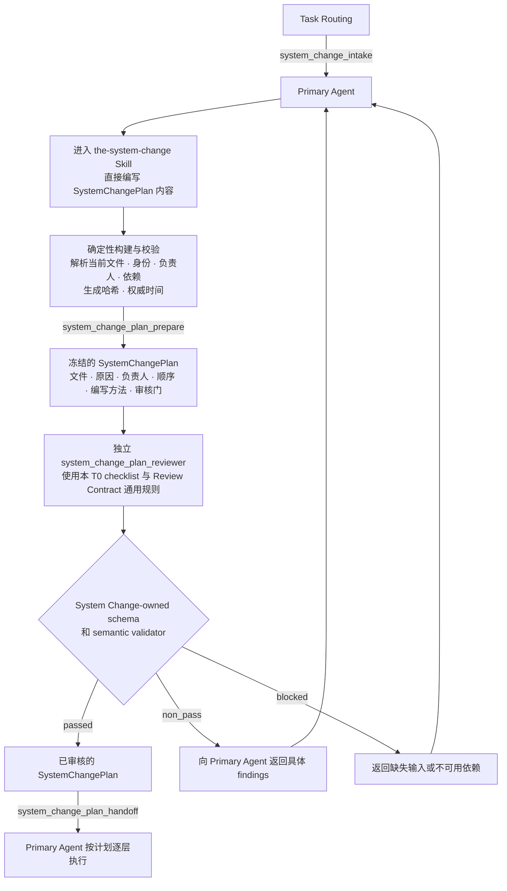

# 系统变更治理（System Change Governance）

本 T0 只负责把一个系统修改请求变成完整、顺序正确、可以直接执行的
`SystemChangePlan`。它不负责执行计划，也不接管下游 Design、Skill、Code、Runtime
或 Release 的编写、审核、批准、准入和生命周期。

## 0. Intent Capsule

```yaml
layer: T0
t0_layer_id: the_system_change_governance
status: candidate
canonical_owner: designDoc/the_system_change_governance.md
owned_system_object: SystemChangePlan
scope:
  - 为一次受治理的系统变更完整盘点受影响面
  - 解析层级、负责人、编写路径、审核门和依赖顺序
  - 生成一份冻结的 SystemChangePlan；范围变化时重新生成一份完整计划
  - 对已授权的 Skill retirement 或整体删除请求定义完整 deletion disposition、受影响面、依赖顺序和 surface owner routing
non_goals:
  - 执行或监督下游工作
  - 拥有候选产物、审核、批准、准入、发布、部署或回滚状态
  - 拥有 SystemChangeCase、ScopeAssessment、WorkPackage、CandidateSet、ClosureRecord 或生命周期记录
  - 定义受影响 Charter、T0、T1、T2、Skill、Module、代码、结构定义、Runtime 或 Release 对象的含义
  - 选择模型提供方、模型、数据库、工作流引擎、仓库布局或用户界面
inputs:
  - 对一个或多个受治理面的授权修改请求
  - 由代码生成的当前文件、身份、负责人、层级和依赖事实
outputs:
  - 一份经过审核并交给 Primary Agent 的 SystemChangePlan
truth_surfaces:
  - designDoc/the_system_change_governance.md
  - logical:system_change_plan_contract
runtime_triggers:
  - 修改受治理的 Design、Skill、Module 源文件、代码、结构定义、迁移、Runtime 注册、Release、部署、回滚或退役面的授权请求
downstream_consumers:
  - Primary Agent
  - SystemChangePlan 指定的每个编写负责人和审核负责人
open_decisions:
  - 代码拥有的 SystemChangePlan 结构定义和确定性构建器绑定
review_gate: 本 T0 Design 由独立 design_contract_reviewer 审核；具体 SystemChangePlan 实例由 system_change_plan_reviewer 审核
runtime_surface_ledger: 只读 SystemChangePlan inspection；本 T0 不拥有运行账本或执行进度
verification_hooks:
  - 受影响面闭包
  - 精确负责人和受审对象类型路由
  - 严格的上游到下游顺序
  - system_change_plan_reviewer checklist 覆盖和 output schema / semantic validator 结果
  - 生成元数据与冻结输入的一致性
```

## 1. Primary System Flow



`the-system-change` 是 Primary Agent 使用的编写 Skill，不注册为 Runtime Module。它负责判断
受影响层级、拆分修改内容、排列依赖顺序，并直接生成 `SystemChangePlan` 的语义正文。版本、哈希、
权威时间和 Registry 引用由确定性代码生成；通过校验后，正文与生成元数据一起冻结为精确受审对象。

本 T0 要求使用固定的 `system_change_plan_reviewer`，并只消费绑定精确冻结计划、通过本 T0
拥有的 output schema 和 semantic validator 的 Reviewer output。`passed` 把精确冻结的计划交给 Primary Agent；
`non_pass` 携带可执行的 findings，由 Primary Agent 重新进入同一 Skill 修订完整计划；`blocked`
表示缺少审核所需输入或依赖不可用，由 Primary Agent 补齐后重新进入，而不是把它伪装成计划内容错误。

`system_change_plan_reviewer` 的目标特定判断标准由本 Design Intent 第 7 节完整定义；其
prompt、schema、fixtures 和 registration source 保存在 `the-system-change` Skill Package。
Review Contract 只拥有通用审核阶段、exact-subject boundary 和 universal instruction source；Skill
Management 管理 Skill definition、candidate 与 Skill review；Skill retirement 或整体删除由本 T0 形成
完整 disposition 与 owner routing；按 Review Contract registered binding
执行的代码把通用规则机械注入 Reviewer Module source；Agent Runtime 只执行已注册 Module。
本 T0 拥有 `system_change_plan_reviewer` 的目标特定 checklist、output schema、semantic validator 和
Reviewer output 的完成语义，但不定义 Skill 编译、Runtime 注册或执行过程。

| `interface_id` | 所有者 | 输入 | 成功输出 | 产生的影响 | 错误码 |
| --- | --- | --- | --- | --- | --- |
| `system_change_plan_prepare` | System Change Governance | Task Routing 产出的 `system_change_intake`；由代码生成的当前文件、受审对象类型、负责人、层级和依赖事实；Primary Agent 通过 `the-system-change` 生成的计划正文 | 一份通过确定性校验、包含生成元数据且冻结的 `SystemChangePlan` | 编写 Skill 只生成语义正文；确定性代码只生成元数据并冻结受审对象；两者都不创建下游候选产物，也不执行任何受治理的修改 | `SYSTEM_CHANGE_PLAN_SCOPE_INCOMPLETE`、`SYSTEM_CHANGE_PLAN_OWNER_INVALID`、`SYSTEM_CHANGE_PLAN_ORDER_INVALID` |
| `system_change_plan_handoff` | System Change Governance | 精确冻结的 `SystemChangePlan`，以及绑定该计划、覆盖本 T0 完整 checklist、通过本 T0 output schema 和 semantic validator 且 disposition 为 `passed` 的 `system_change_plan_reviewer` output | 把已审核的 `SystemChangePlan` 交给 Primary Agent | 只授权 Primary Agent 使用该计划；不创建下游候选产物、批准、准入或持续监督义务 | `SYSTEM_CHANGE_PLAN_REVIEW_UNAVAILABLE`、`SYSTEM_CHANGE_PLAN_REVIEW_NOT_PASSED` |

| `error_code` | 所有者 | 触发条件 | 含义 | 调用方动作 |
| --- | --- | --- | --- | --- |
| `SYSTEM_CHANGE_PLAN_SCOPE_INCOMPLETE` | System Change Governance | 某个受影响文件或受治理面既未进入纳入清单，也未进入排除清单 | Primary Agent 无法确定完整更新范围 | 重建完整清单并冻结一份新的 `SystemChangePlan` |
| `SYSTEM_CHANGE_PLAN_OWNER_INVALID` | System Change Governance | 某一步缺少最终问责负责人、使用了不适用的编写方法，或把产出的受审对象类型路由给错误审核器 | 计划会把工作交给错误的权责主体 | 在审核前修正负责人和路由证据 |
| `SYSTEM_CHANGE_PLAN_ORDER_INVALID` | System Change Governance | 下游步骤能够在所需上游结果冻结并获准之前启动 | 计划会让下游基于不稳定的依赖工作 | 重排计划，并为每一步指定所需的精确前序结果 |
| `SYSTEM_CHANGE_PLAN_REVIEW_UNAVAILABLE` | System Change Governance | Registered Reviewer route、Runtime execution 或 output validation 不可用，因而不存在绑定该 exact `SystemChangePlan` 且通过本 T0 schema 和 semantic validator 的 Reviewer output；绑定其他计划的 output 也不满足本接口 | 当前无法形成对该计划的有效审核判断 | 按缺失或失配依赖携带的 owner-qualified failure 返回真实 peer owner；禁止用相近审核器或另一份计划的 output 替代 |
| `SYSTEM_CHANGE_PLAN_REVIEW_NOT_PASSED` | System Change Governance | 已存在绑定该 exact `SystemChangePlan`、通过本 T0 schema 和 semantic validator 的 Reviewer output，但 disposition 为 `non_pass` 或 `blocked` | 当前不存在可以交给 Primary Agent 的已审核计划 | `non_pass` 时按 findings 修订完整计划；`blocked` 时把 exact blocker 返回其真实 owner；之后只对新的 exact candidate 或恢复后的依赖重新审核 |

上图只定义 `SystemChangePlan` 从编写到审核再到 Primary Agent 执行的主流程。Reviewer Module 的
注册、执行、Attempt 和执行证据遵守 Agent Runtime 合同；Runtime 可以机械执行 registered output-schema
enforcement，但不拥有 schema 或 verdict meaning。本 T0 定义目标特定 checklist、完整 output schema、
semantic validator 和 handoff 完成语义，并据此判断 Runtime 返回的 output 能否支持
`system_change_plan_handoff`。

## 2. User Intent

系统修改经常同时触及 Design、Skill、Code、Runtime 和 Release。System Change
Governance 先判断本次请求具体改变哪些层，再把每个受影响文件或受治理面拆进
对应层级的计划步骤。分类决定编写路径和候选产物类型；依赖关系决定执行顺序；受审对象
类型决定所需的审核类型。

Primary Agent 需要一份完整更新计划，而不是从文件名、当前工作树、对话历史或附近
Skill 猜测影响面、层级和顺序。

覆盖面大小只改变每一层包含多少对象，不改变层级顺序。`SystemChangePlan` 必须按上游语义到下游
实现排列：

```text
需要时先完成结构决策
  → Design Intent
  → Skill 和 Module 源文件
  → Code Design 和实现
  → Runtime 注册和准入
  → Release、投影和部署
```

一个层级不需要修改时，`SystemChangePlan` 引用该层已冻结且仍有效的前置结果。它不制造空的候选
产物，也不允许下游静默绕过上游验证。

## 3. Reader Gain

读完本 Design Intent 和一份符合它的 `SystemChangePlan` 后，Primary Agent 能直接判断：

- 哪些文件或受治理面要改，以及为什么要改；
- 每个修改属于 Design、Skill、Code、Runtime 还是 Release；
- 必须按什么顺序处理；
- 每一步归哪个最终问责负责人；
- 使用哪个编写方法；
- 产出什么候选产物或确定性结果；以及
- 由哪一种独立审核或确定性审核门判断该步完成。

Primary Agent 无需重新扫描仓库、回读对话或推断相邻 Skill，就能从第一步开始执行。
Principal Manager 和 System Owner 能判断计划是否完整覆盖授权结果、真实 owner 和依赖顺序；
Independent Reviewer 能判断计划是否达到第 4、6 和 7 节定义的审查结果。

## 4. Owned System Object

System Change Governance 只拥有 `SystemChangePlan`。

`system_change_plan_reviewer` 的目标特定 checklist、output schema、semantic validator 和完成语义，
都是判断一份 `SystemChangePlan` 是否达到本 T0 要求的治理规则，不是第二个 owned object。Reviewer
output 是对 exact plan 的独立判断；它不成为跨 subject 的共享审核结果对象，也不转移计划、批准、
Runtime 或发布权。

一份 `SystemChangePlan` 表达五类语义：

1. `requested_result`：Primary Agent 最终必须交付的有限范围结果；
2. `affected_surfaces`：纳入或明确排除的文件与受治理面，以及各自的受审对象类型、
   层级、负责人和所需修改；
3. `ordered_steps`：每一步的输入依赖、编写方法、候选产物类型、审核门和完成条件；
4. `excluded_surfaces`：容易被误纳入、但不属于本次结果的邻近面；
5. `unresolved_decisions`：使计划暂时无法执行的真实负责人决策。

`plan_id`、文件哈希、Registry 引用和权威时间由代码生成。模型只判断语义，不手抄元数据。

Skill retirement 或整体删除不是一个缺少 authoring method 的通用 deletion step。`SystemChangePlan` 先把
它分解为 Design reference、Skill source、Runtime registration、host projection、routing/code 等受影响
surface；每个 surface step 使用其真实 owner 已登记的 authoring 或 implementation method、既有 output
type、review gate 与 completion condition。继续存在的 Skill definition 才进入 `the-skill-authoring`；实际
删除步骤不调用该 method，也不发明 deletion-specific method 或 candidate type。

范围是 `affected_surfaces` 的闭包；路由是 `ordered_steps` 的顺序。它们都是 `SystemChangePlan` 内部
内容，不是独立的逻辑记录。执行中发现漏项、负责人错误或依赖变化时，Primary Agent
重新请求并冻结一份完整的新 `SystemChangePlan`。本 T0 不维护前序关系、进度或状态转换。

## 5. Authority

本 T0 可以决定：

- 一个修改请求需要覆盖哪些受治理面；
- 每个受影响面属于 Design、Skill、Code、Runtime 或 Release 哪一层；
- 每个受影响面的层级、语义所有者和编写路径；
- 各层必须按什么依赖顺序处理；
- 每一步产出什么受审对象类型，并要求哪一种独立审核或确定性审核门；
- 哪些邻近面明确不属于本次结果。

本 T0 同时可以定义 `system_change_plan_reviewer` 对 `SystemChangePlan` 必须判断的目标特定 checklist、
Reviewer output 的逻辑 schema、semantic validator 和达到 handoff 所需的完成语义。这些决定只解释
什么样的独立判断足以支持 `SystemChangePlan` handoff；Reviewer 自己形成判断，Agent Runtime 执行
Module，Skill Management 管理 Skill artifact，Primary Agent 消费通过审核的计划。

受影响面的所有者决定对应内容应该写什么。结构、产品、Reviewer 独立判断、Design/Skill/Runtime
准入和发布决定分别留在各自的权责主体；本 T0 只定义计划审核必须判断什么以及什么结果足以完成
`SystemChangePlan` handoff。结构改变由 `SystemChangePlan` 路由给适用的上级权责主体；本 T0 不定义
结构决策对象或结构审查方法。

System Change Governance 的工作在 `SystemChangePlan` 通过独立审查并交给 Primary Agent 后结束。
Primary Agent 按计划执行。只有计划本身失效时，工作才重新进入本 T0。

## 6. T1 委派与机器执法

项目 T1 合同和代码负责实现具体的 `SystemChangePlan` 构建器、Registry 读取器、文件系统
清单、结构定义、校验和可选的只读检查视图。它们可以选择存储和用户界面技术，但不能
改变本 T0 只拥有一个对象的边界。

机器合同必须：

- 从代码拥有的 Registries 和声明路径解析候选文件与逻辑面；
- 生成标识符、版本、引用、哈希值和权威时间戳；
- 校验纳入范围和排除范围的完整性；
- 校验每个步骤只有一个所有者，并且编写路径和审核路径合法；
- 校验严格的依赖顺序；
- 校验 `system_change_plan_reviewer` output 绑定 exact plan、覆盖第 7 节全部检查项，并通过本 T0
  注册的完整 output schema 和 semantic validator；
- 生成一份不可变的 `SystemChangePlan` 正文，供审核和 Primary Agent 使用；
- 提供始终可以从该计划重新生成的只读投影。

机器合同不创建 `SystemChangeCase` 状态机、`WorkPackage` 数据库、`CandidateSet`、`ClosureRecord`、
执行监督器或批准汇总器。

## 7. 审核与完成

固定的 `system_change_plan_reviewer` 只审核一份冻结的
`SystemChangePlan`。其 Reader Gain 是明确的：审核后，Primary Agent 可以直接执行更新，
无需重新梳理受影响文件、负责人、顺序、编写路径或审核门。

<!-- system-change-plan-review-checklist:start -->
目标特定 checklist 按以下顺序且完整包含八项：

1. 每个受影响文件或受治理面都已纳入或被明确排除，且不存在会让计划暂时无法执行的
   `unresolved_decisions`；
2. 每个受影响面都被正确归入 Design、Skill、Code、Runtime 或 Release；
3. 每项修改的目标结果和原因清楚；
4. 步骤严格遵守从上游到下游的依赖顺序；
5. 每个步骤都有一个最终问责负责人、一个编写方法、一个产出对象类型、一个审核门和一个完成条件；
6. 未修改的上游层以冻结前置结果形式引用，而不是制造空候选产物；
7. Reviewer 路由由产出对象类型决定，不能由文件名、所属 T0 名称、模型、provider 或附近 Skill 决定；
8. 计划在规划和路由处结束，不包含执行状态、生命周期、`CandidateSet`、闭包、批准或准入汇总。
<!-- system-change-plan-review-checklist:end -->

Output schema 必须逐项记录以上八项 semantic checklist 的判断，并由本 T0 的 semantic validator 校验
checklist 覆盖、exact-plan binding、disposition 与 findings 一致性。只有八项 semantic 判断全部通过后，
才对同一 exact plan bytes 执行 Review Contract instruction 注入的 prose and communication check；output
schema 也必须记录该项结果。Semantic 未通过时 prose 结果只能是 `not_run`；semantic 或 prose 任一存在
`block` / `fix` 时 disposition 不能是 `passed`。只有八项 semantic 判断和 prose 判断均通过时，
`system_change_plan_handoff` 才能消费 disposition `passed`。Prose check 不能改变上述八项的含义或替代其中
任一项。

定义本 T0 的 Design Doc 本身属于 `t0_design` 对象，由
`design_contract_reviewer` 审核。修改所属 T0 不会改变 Design 审核器。

只有 `system_change_plan_reviewer` 的已注册执行结果绑定精确冻结的 `SystemChangePlan`、覆盖本 T0
完整 checklist，并通过本 T0 拥有的完整 output schema 和 semantic validator 且 disposition 为 `passed` 时，
该计划才算完成。
`non_pass` 和 `blocked` 均不产生 Primary Agent 交接。`passed` 只授权 Primary Agent
使用该计划；它不批准任何下游候选产物，也不产生持续的 System Change Governance 监督义务。

## 8. System-wide Invariants

1. 每个受治理的系统变更在下游编写开始前先获得一份完整
   `SystemChangePlan`。
2. `SystemChangePlan` 覆盖每个受影响面，或明确记录其排除理由。
3. 每个步骤只有一个最终问责负责人、一个编写方法、一个产出对象类型、一个审核门和
   一个完成条件。
4. `SystemChangePlan` 只使用已注册的 `system_change_plan_reviewer`。文件名、模型、模型提供方和
   附近 Skill 均不参与 Reviewer Module 选择。
5. Design、Skill、Code、Runtime 和 Release 严格按依赖顺序推进。下游发现上游错误时，
   把问题返回上游所有者。依赖错误结果的下游候选产物由其自身所有者
   处理，本 T0 不维护其状态。
6. `SystemChangePlan` 只保存意图和路由。候选产物、审核结果、批准、准入、执行、发布和部署记录
   留在各自所有者。
7. Primary Agent 消费 `SystemChangePlan`；人类页面只投影该计划，不形成第二份人工维护的计划。
8. 结果正确性优先于按旧计划完成流程。新证据改变范围或顺序时，重新生成并审核完整的
   `SystemChangePlan`。

## 9. Peer Boundaries

Project Charter 是本 T0 的 constitutional parent，不是 same-level peer。计划会改变产品宪制或
所需 T0 authority class 时，Charter 提供 constitutional decision；它继续拥有产品宪章和人类决策权，
不维护当前 T0 inventory。

| 对等权责主体 | 向 `SystemChangePlan` 提供的内容 | 继续独立拥有的内容 |
| --- | --- | --- |
| Agency Platform | 受影响面所需的宿主组合事实或 Workflow Control Plane 变更事实 | 企业产品宿主、执行宿主绑定和 Workflow Control Plane 决策 |
| Product Authorization | 计划动作执行前所需的资格决定或受保护操作决定 | Principal、Entitlement 和 Authorization Decision |
| Task Routing | 已被分类为受治理系统变更的授权请求 | 语义任务主线选择 |
| 各 authority 的 code-owned Registry | 当前 T0 topology、对象身份、owner、layer 与生成文件事实；项目 Workflow、Operation、Artifact dependency 来自其项目所属 authority | 各 Registry 的 object meaning、current record 与 relation meaning |
| Design Doc Management | 适用的 Design 编写方法和 Design 审核边界 | Design Intent、批准和生命周期 |
| Skill Management | 适用的 Skill 编写方法和 Skill 审核边界 | Skill definition、candidate 与 Skill review；Skill retirement/整体删除 disposition 和 owner routing 由本 T0 拥有，各 surface owner 执行实际删除 |
| Review Contract | 供 Reviewer Module 机械消费的通用审核阶段、exact-subject boundary 和 universal instruction | 不拥有 `SystemChangePlan`、目标特定 checklist、Reviewer output 或 handoff decision |
| Agent Runtime | 已注册 `system_change_plan_reviewer` 的 Module execution result | Module execution、ExecutionProfile、Attempt 和 Ledger 证据 |
| Data Governance | 计划步骤所需的数据、写入器、放置、迁移和保留决策 | Managed Data Asset 和物理 Data Binding |
| Timestamp and Clock Semantics | 时间字段和顺序要求 | 时间数据语义 |
| Software Delivery | Code Design、实现、工程审核、发布和恢复方法 | 软件变更、发布、部署和回滚准入 |
| Primary Agent | 逐步执行已审核的 `SystemChangePlan`，并在计划失效时请求一份新计划 | 任务执行判断和当前工作上下文 |

`SystemChangePlan` 引用类型明确的对等输入和所需输出。它不复制对等主体的内部工作流、错误表、数据库
状态或批准记录。

## 10. References

- [Project Charter](the_charter.md)
- [Task Routing](the_task_routing.md)
- [Design Doc Management](the_design_doc_management.md)
- [Skill Management](the_skill_management.md)
- [Review Contract](the_review_contract.md)
- [Agent Runtime](the_agent_runtime.md)
- [Data Governance](the_data_governance.md)
- [Timestamp and Clock Semantics](the_timestamp_semantic.md)
- [Software Delivery](the_software_delivery.md)
