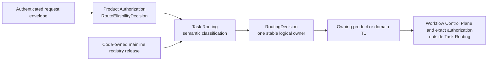
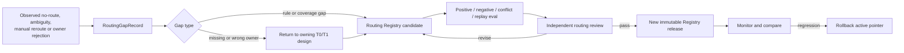

# Task Routing Contract

**Purpose**: Define semantic task routing from one authorized request to one
stable logical owner without selecting an executable binding, provider, model,
profile, adapter, process, or presentation surface.

**Required reader gain**: A reader can distinguish route eligibility from
intent classification, understand what a `RoutingDecision` may contain, and
resolve ambiguity or failure without exposing unauthorized routes or silently
falling back to a nearby workflow.

## 0. Contract Capsule

```yaml
layer: T0
t0_layer_id: the_task_routing
status: candidate
canonical_owner: designDoc/the_task_routing.md
owned_system_object: semantic task-owner selection and RoutingDecision
scope:
  - semantic classification of an authorized request into one task mainline
  - selection of one stable logical owner
  - routing ambiguity, clarification, denial-safe, and failure law
  - code-owned task-mainline registration and generated projections
non_goals:
  - Principal, Entitlement, route-eligibility, workflow, or operation authorization
  - product workflow release lifecycle or executable workflow binding
  - provider, model, execution profile, adapter, Runtime release, process, or host selection
  - domain workflow graph, context management, evaluation, recovery, or artifact readiness
  - writer, renderer, UI, or delivery behavior
  - manually maintained project mainline rows or host-specific routing matrices
inputs:
  - authenticated request envelope
  - Product Authorization RouteEligibilityDecision
  - code-owned task-mainline registry release
  - Artifact Graph WorkflowIndexRelease
outputs:
  - immutable RoutingDecision or bounded routing failure
truth_surfaces:
  - designDoc/the_task_routing.md
  - logical:task_routing_registry
runtime_triggers:
  - authenticated task intake after Product Authorization returns an eligible logical-owner set
  - explicit reroute request against a new immutable request or registry release
downstream_consumers:
  - Product task-intake services
  - Artifact Graph Project Workflow Index and Workflow Control Plane
  - selected domain or engineering owner
open_decisions:
  - executable semantic classifier and admission-grade match/conflict rule schema
  - immutable release persistence and Product Authorization integration design
  - immutable RoutingDecision persistence and replay service
review_gate: design_doc_review and independent routing-registry review
runtime_surface_ledger: generated from code-owned mainline, classifier, registry-release, authorization-input, and RoutingDecision records; current facts are never copied into this contract
verification_hooks:
  - mainline identity, classifier-rule, authorized-candidate, ambiguity, failure, release, and decision-replay conformance
```

This contract defines the admission target. The generated
[Task Routing inspection](generated/task_routing_index.md) owns current
implementation coverage and failure boundaries. A catalog row alone never
proves semantic classification, registry-release admission, authorization
integration, decision persistence, or execution.

## 1. Routing Authority

Task Routing answers one question:

> Which authorized logical owner is responsible for the result requested by
> this request?

In the target topology, Product Authorization [T0-Authz] first evaluates the trusted Principal,
tenant, Cell, product ceiling, policy, and logical resource scope. It issues an
immutable `RouteEligibilityDecision` containing only the mainlines and logical
T1 targets the Principal may request. Task Routing classifies intent only
inside that allow set.



Authorization does not infer user intent. Routing does not grant access. A
route is valid only when its mainline and logical owner occur in the exact
eligibility decision consumed by the router.

## 2. Semantic Classification

Routing begins with the requested outcome, not with a noun mentioned in the
request. A ticker, Theme, account, Source, file, model, framework, or UI surface
may be context without being the requested result.

The router keeps these dimensions separate:

| Dimension | Question | Owner after routing |
| --- | --- | --- |
| Requested outcome | What durable result or decision is being requested? | Task Routing selects the registered mainline |
| Logical authority | Which domain or engineering contract owns that result? | Registered mainline owner |
| Required truth | Which authoritative inputs must the owner consume? | Owning domain contract and typed input contracts |
| Context overlay | What may affect the work without changing ownership? | Owning domain consumes authorized overlay refs |
| Presentation | How is an already prepared result expressed or delivered? | Writer, renderer, or delivery surface |
| Execution | Which admitted release and infrastructure perform the work? | Workflow Control Plane, Product Authorization, Dagster, and Agent Runtime |

A logical target is a product or domain T1 contract registered as an eligible
mainline and resolvable as a Workflow or owner in the Artifact Graph Project
Workflow Index. Its Skill, model, workflow engine, adapter, and deployment path
are execution projections rather than route identity. A writer is not a
mainline unless writing itself is the registered requested outcome. A workflow
engine is never a business route.

## 3. Routing Decision

A successful decision is immutable and contains only semantic and audit data:

```yaml
RoutingDecision:
  routing_decision_id: stable opaque ID
  request_ref: exact authenticated request envelope ref
  request_sha256: sha256
  route_eligibility_decision_ref: exact Product Authorization decision ref
  route_eligibility_decision_sha256: sha256
  routing_registry_release_ref: exact registry release ref
  routing_registry_release_sha256: sha256
  matched_mainline_id: stable logical mainline ID
  logical_owner_ref: stable product, domain, or engineering owner ref
  governing_intent_ref: exact owning intent contract ref
  requested_output_contract_ref: exact logical output contract ref
  context_overlay_refs: bounded optional refs already present in the pinned RouteEligibilityDecision
  classification_reason_code: bounded code
  classification_explanation: bounded semantic explanation
  recorded_at_utc: authoritative decision-store commit time
  routing_decision_sha256: sha256
```

The exact admitted schema belongs to the code-owned registry release and
routing service. These fields express the T0 minimum: authorization lineage,
registry version, logical identity, output meaning, bounded context, and
reconstructable classification.

The decision must not contain a provider, model, reasoning effort, execution
profile, prompt, adapter, workflow-engine reference, Runtime release, worker,
process, CLI, SDK, Skill projection path, or physical deployment address.

## 4. Code-owned Mainline Registry

Concrete project mainlines belong in the code-owned Task Mainline
Registry [Routing-Registry], not in this Design Doc. Each admitted row declares
at least:

- a stable `mainline_id` and lifecycle status;
- requested-output and governing-intent contract references;
- one stable logical owner;
- positive match rules and explicit non-match boundaries;
- materially conflicting mainlines and clarification conditions;
- allowed context-overlay classes;
- required logical truth-surface classes;
- compatibility and supersession metadata; and
- bounded failure and reason codes.

Registry rows contain no provider, model, Runtime target, execution profile,
host projection, or UI location. Those choices can change without changing the
semantic route.

Every active mainline resolves to one active Artifact Graph
`ProjectWorkflowRegistration` or to one registered owner that exposes such a
Workflow. Task Routing may add match, conflict, and clarification rules, but it
must not create a second workflow identity, owning Design Contract, Operation
graph, or Artifact dependency catalog.

An admitted registry release must be code-reviewed, immutable for decision
replay, and the sole source for concrete project rows. Session guidance, Agent
instructions, documentation tables, and product UI catalogs must be generated
projections. A projection may add interface-specific help but cannot add or
rename a route.

### 4.1 Implementation inspection boundary

The requirements above define admission law, not implementation inventory.
The code-owned routing registry and its generated
[Task Routing Index](generated/task_routing_index.md) report independently
whether the selected release provides a catalog, executable classifier,
admission-grade rule schema, authorized-candidate resolver, immutable release,
authorization integration, and decision persistence. Descriptive request
signals or catalog rows never count as executable match rules.

No generated row may be treated as admitted unless its exact release and
required dependency closure carry admission evidence under the applicable
conformance profile.

### 4.2 Routing coverage contract

Routing completeness is evaluated over registered requested outcomes, not over
the number of Skills, filenames, teams, technologies, or UI entries. A routing
release is complete for a declared scope only when every admitted governance
and product outcome has:

- one stable `mainline_id`, logical owner, governing Intent and output contract;
- positive-match, explicit non-match, overlap and clarification cases;
- an eligible-set behavior that does not disclose unauthorized alternatives;
- a completion type and downstream handoff;
- a lifecycle, supersession and replay rule; and
- at least one positive, negative, ambiguity and owner-rejection evaluation.

The governance subset must distinguish at least design authoring, Skill
authoring, Runtime Module registration, engineering implementation,
engineering change review, formal contract audit, software release/deployment,
and bounded session handoff. A broad label such as `artifact_review` may remain
only when its dynamic owner and output contract are deterministically
resolvable; it cannot hide several incompatible review authorities.

For System Change Governance, completeness is evaluated on two routes and their
join:

- initiation routing resolves the change request, primary authority, affected
  authorities, implementation surfaces, authoring branches, and candidate
  freeze point;
- review routing resolves the exact frozen subject, applicable independent
  review methods, accountable finding recipients, re-review rules, and the
  distinct approval or admission owner.

A route that can start work but cannot select the correct review path is
incomplete. A review request with no originating `SystemChangeCase`, exact
candidate, or accountable revision branch is also incomplete.

## 5. Ambiguity and Failure Law

The router returns one of these semantic outcomes:

| Outcome | Meaning | Required behavior |
| --- | --- | --- |
| `routed` | Exactly one authorized mainline wins under the admitted rules | Emit one immutable `RoutingDecision` |
| `clarification_required` | Two or more authorized candidates would produce materially different outputs and the request cannot distinguish them | Ask one bounded outcome-level question exposing only authorized choices |
| `no_authorized_route` | No eligible mainline matches, or only unauthorized mainlines would match | Return a denial-safe result without revealing hidden route identities or configuration |
| `routing_registry_unavailable` | The pinned registry release is missing, invalid, ambiguous, or unverifiable | Fail closed and preserve the request for retry or operator review |
| `request_contract_invalid` | Required trusted request identity or structure is absent | Reject before classification |

When several candidates exist but one is a strict semantic specialization of
the requested output, the registered conflict rule may select the narrowest
one. Otherwise the router must clarify. It must not guess from model preference,
conversation length, file proximity, current implementation availability, or a
workflow that happens to have a working execution binding.

An unavailable selected workflow, missing executable binding, exact workflow
authorization denial, Runtime admission failure, or provider failure occurs
after routing and retains its own owner and error code. None may be relabeled
as a routing decision or cause the router to choose a nearby mainline.

## 6. Downstream Boundary

After an admitted routing decision:

1. the Artifact Graph resolves the selected identity in the exact
   `WorkflowIndexRelease`, including its owning T1 workflow or action release;
2. the Workflow Control Plane resolves the admitted execution class and target;
3. Product Authorization evaluates that exact target and input closure;
4. Dagster or Agent Runtime records the execution under its admitted contract;
5. the owning domain decides semantic acceptance of the resulting Artifact.

This list identifies authority handoffs, not a protocol owned by Task Routing.
Their exact records, retries, clock fencing, invalidation, context, and recovery
belong to their respective contracts.

## 7. Routing Invariants

Routing is non-conformant when:

- the router considers a mainline outside the pinned eligibility allow set;
- an unauthorized candidate is disclosed through clarification, logging, count,
  timing, or error detail;
- a mentioned entity or implementation surface replaces the requested outcome
  as the classification anchor;
- a provider, model, profile, adapter, Runtime release, workflow engine, or
  physical Skill projection is selected by Task Routing;
- logical owner identity changes because an executable binding is absent;
- two materially different authorized outcomes are guessed rather than
  clarified;
- a downstream authorization, binding, Runtime, or provider failure is
  mislabeled as routing;
- a manually edited projection or Design Doc table is treated as the concrete
  mainline registry; or
- a routing mainline has no resolvable Workflow or owner in the pinned Artifact
  Graph `WorkflowIndexRelease`.

## 8. Routing Gap and Release Iteration

Routing improves through immutable evidence and a new Registry release, not by
quietly editing a prompt or teaching one Agent an undocumented exception.



`RoutingGapRecord` records the exact authorized request class, prior decision
or failure, expected outcome, observed downstream rejection or reroute,
registry release, and privacy-safe evidence. Its bounded `gap_kind` is:

- `missing_mainline`;
- `wrong_logical_owner`;
- `overlapping_mainlines`;
- `missing_non_match_rule`;
- `missing_clarification_rule`;
- `missing_completion_contract`;
- `host_projection_gap`; or
- `downstream_failure_mislabeled_as_routing`.

The Task Routing owner triages the record. A semantic owner or output change
returns to the owning T0/T1 design before registry work; a classifier-only gap
may produce a bounded Registry candidate. Every candidate adds regression
cases, receives independent review, creates a new immutable release, regenerates
inspection, and preserves the prior release for replay and rollback.

Operational evaluation tracks at least authorized no-route rate,
clarification rate, manual-reroute rate, downstream owner-rejection rate,
misroute overturn rate, unauthorized-disclosure defects, and replay drift by
Registry release. These metrics identify candidates for change; they do not
authorize automatic semantic-owner changes.

## References

- `[T0-Charter]` [Product Charter](the_charter.md)
- `[T0-Authz]` [Product Authorization and Entitlement Governance Contract](the_product_authorization.md)
- `[T0-Runtime]` [Agent Runtime Contract](the_agent_runtime.md)
- `[T0-Artifact]` [Artifact Graph Contract](the_artifact_graph.md)
- `[Routing-Registry]` project-local code-owned Task Routing registry
