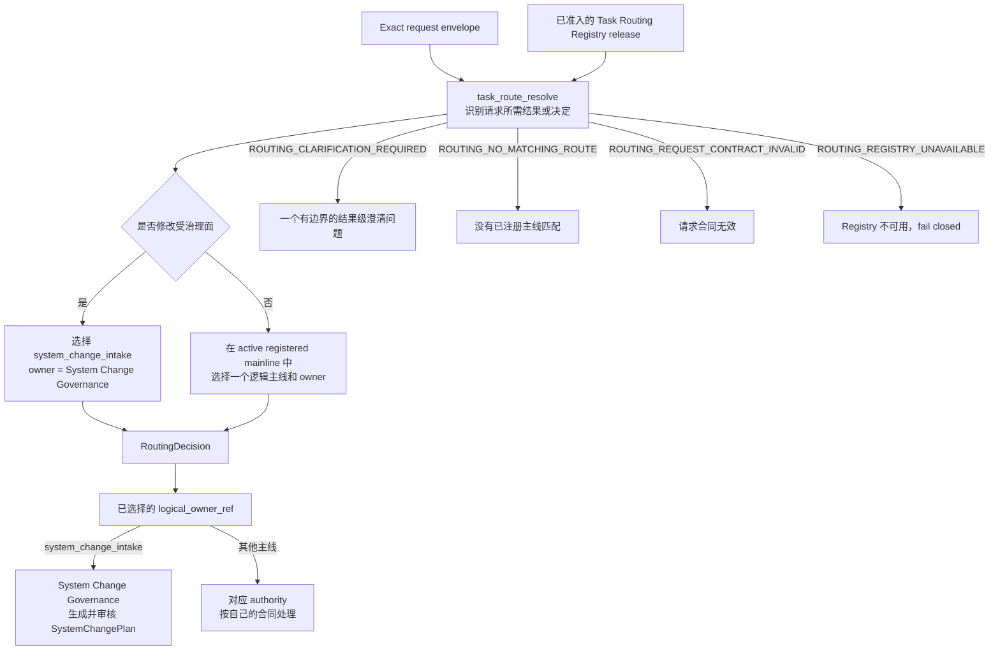
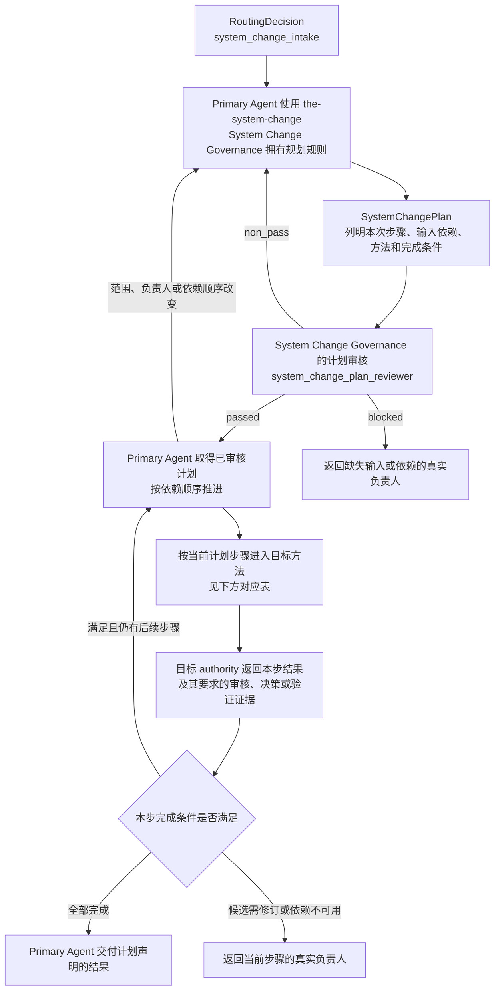

# 任务路由（Task Routing）

Task Routing 是 Primary Agent 判断工作入口、理解 T0 之间交接关系的起点。对新请求，它根据所需结果
选择一个已准入的逻辑主线和负责人，形成 `RoutingDecision`；对已经进入系统变更的工作，本文件展示
各 T0 已定义的编写与审核路径，使 Primary Agent 知道从哪里取得下一步方法。

通用工作路径与一次修改的具体计划分开：System Change Governance 决定本次改什么、按什么顺序改；
Primary Agent 执行审核通过的计划；各目标 authority 拥有自己的方法、审核标准和完成条件。
Task Routing 引用这些关系，不重新定义它们，也不选择模型、Execution Profile、Runtime binding 或授予权限。

## 0. Intent Capsule

```yaml
layer: T0
t0_layer_id: the_task_routing
status: candidate
canonical_owner: designDoc/the_task_routing.md
owned_system_object: RoutingDecision
scope:
  - 在已准入的逻辑主线中识别请求所需的结果或决定
  - 选择一个已注册的逻辑主线和一个稳定逻辑负责人
  - 展示 T0 之间的通用工作路径及其所属 authority，供 Primary Agent 定位下一步方法
  - 定义 routed、clarification_required、no_matching_route、request_contract_invalid 和 routing_registry_unavailable 的边界
  - 把每项受治理的系统修改统一路由到 system_change_intake
non_goals:
  - 授予产品、数据、工具、网络、文件系统或执行权限
  - 判断系统修改会影响哪些层、文件、Skill、代码、Runtime 或 Release
  - 编写、审核或执行 SystemChangePlan
  - 替 SystemChangePlan 选择本次修改的具体步骤，或改写目标 authority 的编写与审核方法
  - 选择 Workflow、Module、模型、provider、Execution Profile、adapter、进程或界面
  - 拥有领域工作流、执行、审核、准入、发布、恢复或产物生命周期
inputs:
  - exact request envelope
  - exact admitted Task Routing Registry release
  - 已审核的 SystemChangePlan 与当前步骤，仅用于既有工作的交接导航
outputs:
  - one immutable RoutingDecision or one bounded routing outcome
  - 对已有计划指出当前步骤及目标 authority，不新增 RoutingDecision
truth_surfaces:
  - designDoc/the_task_routing.md
  - logical:task_routing_registry
runtime_triggers:
  - 需要解析 logical owner 的新请求
  - 绑定新请求或新 Registry release 的显式重新路由请求
  - Primary Agent 需要确认已路由工作如何交接
downstream_consumers:
  - System Change Governance
  - 已选中的产品、领域、Design、Skill 或工程负责人
  - downstream workflow and execution control surfaces
open_decisions:
  - T1/T2 的 Registry schema、分类器、持久化、回放和运行检查设计
review_gate: Design Doc Management 所属 design_contract_reviewer 对本 T0 exact candidate 的独立 Design review；Task Routing owner 单独作出 owner decision
runtime_surface_ledger: code-owned generated routing inspection；本 T0 不拥有运行账本
verification_hooks:
  - admitted-registry-only classification
  - one-mainline and one-owner routing
  - governed-mutation-to-system_change_intake
  - ambiguity and denial-safe behavior
  - no review-method or execution selection
```

## 1. Primary System Flow

### 1.1 新请求的入口选择



Task Routing 只在 exact admitted Registry release 的 active mainline 中分类。一个逻辑主线和逻辑
负责人只有同时出现在该 release 的同一条有效 row 中，才可能进入 `RoutingDecision`。该结果只说明
谁拥有所需结果，不授予访问、database operation、execution 或 release 权限。

| `interface_id` | 所有者 | 输入 | 成功输出 | 产生的影响 | 错误码 |
| --- | --- | --- | --- | --- | --- |
| `task_route_resolve` | Task Routing | exact request envelope、exact Task Routing Registry release | 一个不可变的 `RoutingDecision` | 只决定逻辑主线和逻辑负责人；不选择下游编写、审核或执行方法，也不授权该负责人执行 | `ROUTING_CLARIFICATION_REQUIRED`、`ROUTING_NO_MATCHING_ROUTE`、`ROUTING_REQUEST_CONTRACT_INVALID`、`ROUTING_REGISTRY_UNAVAILABLE` |

| `error_code` | 所有者 | 触发条件 | 含义 | 调用方动作 |
| --- | --- | --- | --- | --- |
| `ROUTING_CLARIFICATION_REQUIRED` | Task Routing | 两个或以上 active 候选会产生实质不同的结果，请求无法区分 | 当前不能确定唯一逻辑负责人 | 只询问一个结果级问题，并且只展示足以区分这些候选的结果差异 |
| `ROUTING_NO_MATCHING_ROUTE` | Task Routing | 没有 active registered mainline 匹配 requested result | 当前没有可返回的逻辑路由 | 返回无匹配结果；不得选择相近主线或执行入口 |
| `ROUTING_REQUEST_CONTRACT_INVALID` | Task Routing | request envelope 的必要结构缺失或无效 | 分类输入不成立 | 在分类前拒绝，并把输入缺口返回 request owner |
| `ROUTING_REGISTRY_UNAVAILABLE` | Task Routing | 固定 Registry release 缺失、无效、冲突或无法验证；或其声明的 owner、首份 authority 缺失、冲突或不可解析 | 当前没有可依赖的路由事实 | fail closed，并把缺口返回 Task Routing Registry T1/T2 owner；不得使用文档表格、对话或附近 Skill 替代 |

### 1.2 T0 工作路径与计划交接

以下是各 authority 已定义的工作关系，不是第二份 Task Routing Registry，也不是每次都要走完的清单。
图中下游节点表示 peer 提供的方法或结果；其内部流程、schema、错误码和准入规则仍以所属 Design 为准。



| 计划步骤要产出的结果 | 方法及其所属 authority | 审核或验证归属 | 完成后交给谁 |
| --- | --- | --- | --- |
| `SystemChangePlan` | System Change Governance：`the-system-change` | `system_change_plan_reviewer` | Primary Agent 开始已审核计划的第一步 |
| Charter、T0、T1 或 T2 Design candidate | Design Doc Management：`the-design-authoring`；目标 Design owner 决定具体含义 | DDM 规定的确定性检查、适用的 `design_contract_reviewer` 和 Design owner 决策 | Primary Agent 按计划使用获准的 Design 结果 |
| 完整 Skill candidate | Skill Management：`the-skill-authoring` | `skill_candidate_reviewer`；含 Reviewer prompt 时，还需 Review Contract 所属的 prompt 审核 | Primary Agent；计划需要注册时再交 registration owner |
| Reviewer prompt candidate | Review Contract：`the-review-authoring`；目标 Design authority 提供专用判断标准 | `reviewer_reviewer`；承载它的 Skill 仍按 Skill Management 规则审核 | 承载该 prompt 的 Skill 步骤，或计划指定的下游步骤 |
| `CodeDesignBasis` 和代码实现 | Software Delivery：`engineering-code-design`，随后由实现负责人工作 | Software Delivery 规定的设计批准、代码验证与 `engineering_change_reviewer` | Primary Agent 按计划推进注册、发布或结果交付 |
| Module 或 Workflow 注册结果 | Agent Runtime：项目已绑定的 registration 能力 | Runtime registration 校验与准入规则 | Primary Agent 或计划指定的执行、发布步骤 |
| 发布、投影、部署或回滚结果 | Software Delivery 及目标面的所属 authority：项目已绑定的操作能力 | 对应 authority 的确定性 gate 和发布决定 | Primary Agent 确认计划声明的交付结果 |

Primary Agent 从已审核 `SystemChangePlan` 的当前步骤取得负责人、方法、输入依赖和完成条件，并按
目标 authority 的要求取得本步结果。完成一个步骤不会生成新的顶层请求，也无需重新运行 Task Routing。
计划遗漏工作或选错方法时返回 System Change Governance；已选方法的候选问题返回该方法的负责人。
原请求的逻辑归属错误、用户提出新请求，或明确要求依据新 Registry release 重新路由时，才重新判断
任务主线；普通步骤完成或执行失败不触发重新分类。

Review Contract 提供共同审核规则；Agent Runtime 执行已注册 Reviewer。它们不决定计划中的下一步。
Product Authorization、Data Governance、Timestamp and Clock Semantics 等 T0 在工作触及各自约束时
提供相关规则，不成为每个请求必经的串行步骤。项目业务工作流仍由项目所属 authority 定义。

## 2. User Intent

Primary Agent 收到的请求经常同时提到公司、Theme、Source、文件、Skill、Reviewer、模型或界面，
但这些名词不一定是用户要取得的结果。Task Routing 必须先识别请求希望取得的结果或决定，再从
active registered mainline 中选择真正拥有该结果的逻辑主线。

凡是会修改受治理的 Design、Skill、Module source、代码、结构定义、迁移规则、数据写入规则、
Runtime 注册、Release、部署、回滚或退役面的请求，都先路由到 `system_change_intake`。后续具体改
哪些层、采用什么 authoring method 和 reviewer，由已审核的 `SystemChangePlan` 决定；Task Routing
不提前拆分计划。Primary Agent 还需要看清选择之后如何开始工作、计划审核后由谁接手，以及各类
产出对应哪个既有方法。因此 Task Routing 同时提供第 1.2 节的通用工作导航，而具体步骤留在计划中。

## 3. Reader Gain

- Primary Agent 能根据请求所需结果，判断应先进入 `system_change_intake`，还是进入产品操作、查询
  或独立审查主线，并找到所选负责人的首份 authority。
- Primary Agent 能沿第 1.2 节找到计划编写、计划审核和各类候选的编写与审核方法；取得已审核
  `SystemChangePlan` 后，能知道下一步由自己按计划推进，而不是等待另一个路由器。
- Primary Agent 能区分候选修订、计划修订、执行依赖失败和新请求，知道应该返回当前负责人、
  System Change Governance、执行 owner，还是重新进入 Task Routing。
- Principal Manager 和 Product Architect 能看清整套 T0 如何协作，同时确认具体方法仍归所属 authority，
  通用工作导航没有变成权限授予、执行配置或第二份计划。
- Routing Maintainer 与下游负责人能核对 `RoutingDecision` 绑定的精确请求、逻辑主线、负责人和
  Registry release；既有路由与计划可直接交接，无需从对话历史或文件名猜测下一步。

## 4. Owned System Object

Task Routing 只拥有 `RoutingDecision`。它表达：对一个精确请求，在一个精确的 Task Routing
Registry release 下，哪一个已注册逻辑主线和逻辑负责人拥有所需结果，以及该判断使用的有边界理由。

第 1.2 节是对既有 T0 职责和交接的导航，不创建新的运行记录。`SystemChangePlan` 继续拥有本次修改的
具体步骤，Primary Agent 继续负责执行；导航表不会成为第二份计划或项目工作流。

成功的 `RoutingDecision` 至少绑定：

- exact request ref 与 hash；
- exact Registry release ref 与 hash；
- 一个 `matched_mainline_id`；
- 一个 `logical_owner_ref`；
- 同一 Registry row 声明的首份 governing authority 引用；
- 已注册的 requested-result meaning；
- 有边界的 `reason_code` 与解释；
- Registry row 允许的可选 context refs。

首份 authority 是进入所选主线时必须先读取的 governing contract。它由同一精确 Registry release 的
所选 row 声明，不能从 owner 名称、文件名或当前可用 Skill 推断。该引用只定位任务 authority，
不选择编写方法、Reviewer、provider 或 Runtime binding。

当请求修改受治理面时，`matched_mainline_id` 必须是 `system_change_intake`，`logical_owner_ref` 必须
是同一条已准入 Registry row 所声明的 System Change Governance owner。字段名称、序列化、标识符、
时间、存储和索引由下层机器合同拥有。本 T0 只规定这些语义可重建，并且 `RoutingDecision` 不得包含
Reviewer Module、模型、provider、Execution Profile、Runtime release、adapter、worker、CLI、SDK、
Skill projection path 或物理地址。

## 5. Authority

只有 Task Routing 可以定义：

1. 什么是语义任务主线和稳定逻辑负责人；
2. 如何以请求所需的结果或决定，而不是附近名词，作为分类依据；
3. 路由只能在 exact admitted Registry release 的 active mainline 中发生；
4. 何时返回 routed、clarification、no-matching-route、invalid-request 或 unavailable-registry；
5. 所有受治理的系统修改都先进入 `system_change_intake`；
6. `RoutingDecision` 可以表达什么，以及不得夹带什么 authoring、review 或 execution 选择。

Task Routing 汇总各 authority 已声明的入口与交接关系，让 Primary Agent 找到正确方法；它不修改
这些方法或其审核要求。展示 `the-design-authoring` 与 `design_contract_reviewer` 的既有关系，不等于
Task Routing 为某次 Design change 自行选审核器或执行配置。

System Change Governance 决定一次系统修改涉及哪些层、文件、负责人、authoring method、review gate
和依赖顺序。各 subject authority 决定自己的结果语义与 Reviewer；Product Authorization 决定
`user_key` 的 database permission；Workflow 和 Runtime owner 决定如何执行。Task Routing 不取得这些权力。

## 6. 路由语义与 T1 委派

### 6.1 分类依据

路由从 requested result 开始，不从请求中出现的名词开始。Ticker、Theme、account、Source、文件、
Design 标题、Skill ID、Reviewer 名称、模型、framework 或 UI surface 可以是 context，但不能靠字面
相似决定 owner。一个 writer 只有在 writing 本身就是已注册 requested result 时才是主线；workflow
engine 永远不是业务或治理主线。

只读的 review 请求按被审 subject 与所需 review result 路由到该 subject authority 所拥有的已注册
review mainline。Review Contract 只提供 Reviewer 共用规则，不是通用 review service，也不选择
subject route。任何需要修改 Design、Skill、Reviewer source 或 code 的请求仍先进入
`system_change_intake`，由 `SystemChangePlan` 决定后续 authoring 与 review 路径。

### 6.2 Code-owned Registry

具体 mainline 属于 code-owned Task Routing Registry，不写入本 Design Doc。每个 active row 至少声明
稳定 `mainline_id`、一个 logical owner、该主线唯一且可解析的首份 governing authority 引用、
requested-result meaning、positive match、explicit non-match、
conflict/clarification boundary、allowed context class、lifecycle 与 supersession meaning。Registry row
不得包含 provider、model、Runtime target、Execution Profile、host projection 或 UI location。

项目 T1/T2 Design 和代码拥有 Registry schema、分类器、冲突与澄清规则、immutable release、decision
store、持久化、回放、privacy protection、Routing Gap、评测和 generated inspection。它们必须证明：

- 只在 exact admitted Registry release 的 active row 中分类；
- 每个成功结果只有一个 active mainline 和一个可解析 logical owner；
- 成功结果的首份 authority 引用来自同一所选 row，且可解析；缺失、冲突或不可解析时使用
  `ROUTING_REGISTRY_UNAVAILABLE`，不回退到另一主线或相近文件；
- 每个受治理修改都由 `system_change_intake` 覆盖；
- positive、negative、ambiguity、wrong-owner 与 downstream-rejection 用例可重复验证；
- 决策绑定 exact request 和 Registry release，可重放且不会被静默改写。

具体 schema field、数据库、缓存、重试、监控、指标和界面都属于下层实现。下游 authority 拒绝一个
不适用的 routed request 时，调用方把 wrong-owner evidence 返回 Task Routing Registry T1/T2 owner；
它不能继续执行同一方法，也不能静默尝试附近主线。既有 `RoutingDecision` 不被改写；需要重新路由时
必须绑定新请求或新 Registry release。

## 7. System-wide Invariants

1. Task Routing 只在 exact admitted Registry release 的 active mainline 中分类；手工表格、对话、
   current directory 或 execution availability 不能扩展候选集合。
2. 路由先判断 requested result。公司、Ticker、Theme、Source、文件、Design、T0、Skill、Reviewer、
   目录、模型、framework 或界面名称只能作为定位证据，不能靠字面相似决定主线。
3. 成功结果恰好包含一个已注册逻辑主线和一个 logical owner。存在实质不同的 active 候选且无法区分
   时必须澄清，不能猜测。
4. 受治理修改先路由到 `system_change_intake`；Task Routing 不选择 `SystemChangePlan` 内的 Design、
   Skill、Code、Runtime 或 Release 步骤。
5. 只读 review 路由到 subject authority 所拥有的 review mainline；Review Contract 不成为通用审核路由。
6. 执行 binding 是否存在或可用，不改变 logical owner。Workflow、authorization、Runtime、model 或
   provider failure 保留其真实 owner，不能促使 router 改选相近主线。
7. 具体 mainline 只来自 exact admitted Registry release。Design Doc、对话、手工表格、Agent
   instruction、Skill projection 和 UI 都不能形成第二份路由事实。
8. Task Routing 完成后不拥有下游 candidate、review、execution、release、recovery 或 lifecycle。
9. 重新路由必须绑定新请求或新 Registry release；不得静默改写既有 `RoutingDecision`。

## 8. Peer Boundaries

Project Charter 是 constitutional parent，不是 peer T0。它只提供项目范围和 constitutional constraint；
当前 Task Routing identity、owner binding、dependency 与 Registry fact 不由 Charter 维护。

| Peer authority | 向 Task Routing 提供 | Task Routing 返回 | Peer authority 继续拥有 |
| --- | --- | --- | --- |
| Product Authorization | 不提供 routing candidate 或 route identity | 已选 logical owner 后，只有确需 database access 的 caller 才提交独立 authorization request | `user_key` 的 database visibility 与 read/write permission；不推断 request intent |
| System Change Governance | `system_change_intake` 的稳定 requested-result meaning 和 logical owner | 受治理修改的 `RoutingDecision` | `SystemChangePlan` 的 scope、layer、owner、order、authoring method 与 reviewer |
| Design Doc Management | Design-owned result 与 Design review result 的 meaning | 只读 Design 请求可指向已注册 Design mainline；Design 修改只返回 `system_change_intake` | Design Intent、layer law、Design Reviewer 与 owner decision |
| Skill Management | Skill-owned result 与 Skill review result 的 meaning | 只读 Skill 请求可指向已注册 Skill mainline；Skill/Module source 修改与 retirement 请求只返回 `system_change_intake` | Skill definition、candidate、Reviewer source 与 Skill Reviewer；System Change Governance 拥有 retirement/整体删除 disposition 与 owner routing |
| Software Delivery | Code/Schema/Release-owned result 与 Engineering review result 的 meaning | 只读 engineering 请求可指向已注册 owner；production change 只返回 `system_change_intake` | Code Design、implementation、deterministic gate、Engineering Reviewer 与 release lifecycle |
| Review Contract | 不提供 subject route；提供共同审核规则及 Reviewer prompt 编写与审核的既有方法 | none | universal review instruction、Reviewer prompt layout、`the-review-authoring`，以及 `reviewer_reviewer` 的审核标准与结果含义 |
| Agent Runtime | 不参与 semantic route selection | 已路由请求后续所需的 logical entry | Module、Workflow、Execution Profile、Attempt、execution 与 Ledger evidence |
| Agency Platform | 不参与 semantic route selection | 已路由请求所需的 logical service entry | service hosting、composition 与 project-specific implementation |

Task Routing 只消费或返回上表声明的 owner-qualified meaning，不复制 peer 的 Flowmap、interface、error、
Reviewer prompt、schema、state 或内部 execution path。第 1.2 节只连接各 peer 已声明的方法与交接结果，
不展开这些方法内部如何工作。

## 9. References

- [Project Charter](the_charter.md)
- [Product Authorization](the_product_authorization.md)
- [Data Governance](the_data_governance.md)
- [Timestamp and Clock Semantics](the_timestamp_semantic.md)
- [System Change Governance](the_system_change_governance.md)
- [Design Doc Management](the_design_doc_management.md)
- [Skill Management](the_skill_management.md)
- [Software Delivery](the_software_delivery.md)
- [Review Contract](the_review_contract.md)
- [Agent Runtime](the_agent_runtime.md)
- [Agency Platform](the_agency_platform.md)
