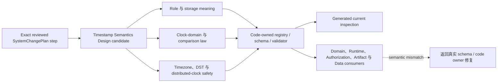

# 时间戳语义合同（Timestamp Semantic Contract）

本文只冻结适用于整个产品的 timestamp role、storage form、clock-domain semantics、comparison
law、daylight-saving-time handling 与 distributed-clock safety。Object-class inventory、scheduler
policy、market-specific helper 和 implementation history 不属于本 T0。

## 0. Intent Capsule

```yaml
layer: T0
t0_layer_id: the_timestamp_semantic
status: candidate
canonical_owner: designDoc/the_timestamp_semantic.md
owned_system_object: time-bearing data semantics
scope:
  - 稳定的 timestamp role vocabulary
  - 稳定的 instant、calendar-day 与 market-session storage form
  - persisted-record 与 mutable-record time invariant
  - clock-domain ownership 与 comparison law
  - IANA timezone 与 daylight-saving-time law
  - distributed-clock profile、health evidence 与 conservative validity law
  - 由代码持有的 per-class time-role registration 与 generated projection boundary
non_goals:
  - Design Doc prose 中的 per-object-class role matrix row
  - SystemChangePlan 的编写、routing、dependency ordering 或 completion tracking
  - artifact freshness threshold 或 domain lifecycle policy
  - scheduler timezone、cron expression、task cadence 或 trading-session anchor policy
  - exchange-calendar helper name 或 market-data refresh behavior
  - legacy migration inventory、implementation history 或 changelog
  - non-time schema 与 domain semantics
inputs:
  - 要求新建或修改 time-bearing data semantics 的 exact reviewed SystemChangePlan step
outputs:
  - timestamp role 与 storage vocabulary
  - comparison 与 clock-domain invariant
  - per-class registration contract
truth_surfaces:
  - designDoc/the_timestamp_semantic.md
  - logical:timestamp_semantic_registry
  - logical:timestamp_comparison_validator
runtime_triggers: none; schema validator 消费由代码持有的 registry
downstream_consumers:
  - 每一个具有 time-bearing field 的 schema、API、event、Artifact、decision 与 Runtime record
  - domain freshness 与 scheduling contract
  - Product Authorization 与 Agent Runtime clock-fencing contract
open_decisions:
  - exact persisted-class registration 的 release 与 compatibility model
  - semantic-role 与 distributed-clock predicate registry 的 service ownership 与 versioning
  - class、predicate 与 clock-profile coverage 的 public generated-inspection schema
review_gate: Design Doc Management 所属 design_contract_reviewer 对 exact candidate 的独立 Design review；Timestamp Semantics owner 单独作出 owner decision
runtime_surface_ledger: 由代码持有的 registration 与 generated inspection 是 role、storage form、exact class、predicate、converter、calendar 与 distributed-clock profile 的 implementation 和 admission fact 的唯一允许 owner；本合同不携带 current coverage inventory
verification_hooks:
  - role、storage、exact-class、predicate、converter、calendar、DST 与 distributed-clock conformance
```

## 1. Primary System Flow



本图只表达本 T0 的语义决策如何进入 code-owned enforcement，再被下游消费。Timestamp Semantics
不编写 `SystemChangePlan`，不维护 current class inventory，也不执行 domain workflow。

| `interface_id` | Owner | 输入 | 输出 | 影响 | `error_code` |
| --- | --- | --- | --- | --- | --- |
| `none` | Timestamp Semantics | none | none | 本 T0 不提供 owner-local public operation；具体 validator interface 与 error code 由 code-owned projection 定义 | none |

| `error_code` | Owner | 触发条件 | 含义 | 调用方动作 |
| --- | --- | --- | --- | --- |
| `none` | Timestamp Semantics | none | 本 T0 不定义 caller-visible operational failure | none |

## 2. User Intent

所有包含时间的 Design、schema、API、event、Artifact 与 Runtime record 必须用同一套语义表达“这个
时间代表什么、精确到什么、由哪个 clock authority 产生、能否与另一个时间比较”。任何 caller
都不能从字段名、UTC 表示或本地惯例自行发明时间含义。

## 3. Reader Gain

- Domain Architect 能按 time field 的实际含义选择 semantic role，而不是按对象名或现有字段猜测。
- Schema Owner 能在不虚构 precision 的前提下选择 storage form，并知道哪些 class registration
  属于 code-and-schema change。
- Runtime Maintainer 能区分 authoritative commit time、provider observation、durable history time
  与 local process time，避免用 wall clock 替代 causal order。
- Distributed Systems Engineer 能判断 comparison 是否合法，以及 protected cross-clock decision
  需要哪些 profile 与 health evidence。

## 4. Owned System Object

Timestamp Semantics 只拥有一个逻辑对象：`time-bearing data semantics`。它包含稳定 role、storage、
clock-domain、comparison、calendar、DST 与 distributed-clock safety meaning。Exact class row、
predicate registration、converter、current coverage 与 validator implementation 是这个对象的
code-owned projection，不形成第二份人工维护的 T0 truth。

## 5. Authority

只有 Timestamp Semantics 可以定义：

1. 稳定 timestamp role vocabulary 及其互斥边界；
2. stable storage form 及 role/storage compatibility；
3. authoritative store、Source、worker、provider、durable backend 与 monotonic clock 的 authority；
4. same-role、cross-role、cross-calendar 与 cross-clock comparison law；
5. IANA timezone、calendar、DST 与 typed conversion 的最低要求；
6. protected distributed decision 所需的 profile、health evidence 与 conservative validity law；
7. per-class exact registration 必须由 code 持有并生成 inspection 的 enforcement result。

Timestamp Semantics 不选择 domain freshness threshold、scheduler cadence、market anchor、object lifecycle、
Runtime retry policy、Product permission 或具体 implementation。下游 T1/T2 可以在本 T0 允许的范围内
定义自己的 class、calendar、predicate、threshold 与 workflow，但不能改写本 T0 的 role、storage、
clock 或 comparison meaning。

## 6. 时间语义（Timestamp Semantics）

本章保留既有 `Timestamp §1` 至 `Timestamp §8` 逻辑锚点，供当前 code comment、test 与 peer
contract 继续解析；这些锚点不改变 T0 required heading 的层级。

### Timestamp §1 · 双轴字段模型

每个 time-bearing field 结合两个相互独立的维度：

```text
semantic role + storage form
```

字段名把 semantic role token 与 storage suffix 结合起来。当 suffix 已经携带同样的 instant
或 date 含义时，以 `_at` 或 `_date` 结尾的 role 会移除该结尾。例如：

```text
observed_at_utc
period_start_at_utc
effective_session_date_market
expiry_at_utc
recorded_at_utc
horizon_calendar_day_utc
```

包含该字段的对象提供 object identity。不要在 time field 内重复 object name。新合同以及对既有
class 的新增或修改 registration，不准入 `date`、`timestamp`、`as_of`、`generated_at` 或
`report_date` 等裸名或依赖上下文的名称。既有字段只有在当前 code-owned exact registration
已经显式绑定其 role 与 storage form 时，才是已准入的 compatibility surface；caller 不得从裸名
推断语义。该 exact row 在 Software Delivery 管理的 migration 中被取代或退役之前继续有效；没有
exact registration 的既有字段仍然 fail closed。本 T0 不维护这些既有 row 的 inventory。

时间值绝不能暗示比来源更高的精度。当外部 Source 只提供一个 date 时，所属 domain 使用已
准入的 date storage，或者使用明确记录 precision 与 timezone metadata 的保守投影。该投影
不得被表述为精确 event instant。

### Timestamp §2 · 稳定的 Role Vocabulary

产品识别九种 role，代表八个 concept。Interval start 与 end 是两个独立 role，但共同组成
一个成对 concept。

| Role | 含义 | Boundary |
| --- | --- | --- |
| `observed_at` | event 发生或 material 在外部世界或 domain 中变得可观察的时间 | 不是本地系统存储它的时间 |
| `period_start_at` | 覆盖 interval 的 inclusive start | 与 `period_end_at` 配对 |
| `period_end_at` | 按照所属 interval policy 确定的覆盖 interval end | 与 `period_start_at` 配对；必须满足 ordering |
| `effective_at` / `effective_date` | rule、policy、appointment、decision 或 state 开始适用的时间 | 不是其 announcement 或 recording time |
| `expiry_at` / `expiry_date` | authority、rule、grant、request 或 validity window 停止适用的时间 | 不是安排未来工作的时间 |
| `recorded_at` | authoritative store 原子提交这条记录的时间 | 由该 store 分配，不由 caller、worker 或 provider 分配 |
| `updated_at` | mutable record 或 projection 最后一次变化的时间 | immutable event 或 archive record 禁止使用 |
| `horizon_date` | content 或 data 在实质上保持 current 的最晚日期 | 不是 publication 或 commit time |
| `scheduled_for_at` | 系统计划执行未来工作的时间 | 不是 expiry、deadline 或 validity end |

每个持久化 record 都有 `recorded_at_utc`。未独立持久化的 embedded immutable value 可以依赖
其 containing record，并且不得复制该 commit time，仿佛它拥有第二个 record identity。

Immutable fact 通过追加新 record 表达，不使用 `updated_at`。Mutable projection 可以使用
`updated_at_utc`，但其 source event chain 继续作为 authority。`received`、`issued`、
`requested`、`committed`、`projected` 与 `built` 描述 action，不构成额外 timestamp role。
所属 record 的 `recorded_at_utc` 表示其 authoritative commit。

### Timestamp §3 · 稳定的 Storage Form

| Storage suffix | 含义 | Required representation |
| --- | --- | --- |
| `_at_utc` | UTC timeline 上的一个 instant | 带 UTC offset 的 RFC 3339 / ISO 8601 value，canonical form 为 `Z` |
| `_calendar_day_utc` | UTC calendar-day slice，通常用于 24/7 domain | ISO date `YYYY-MM-DD` |
| `_session_date_market` | 特定 domain 或 asset 的 market-session date | ISO date，加上 sibling IANA `market_tz` 与所属 calendar policy |

Role 与 storage 必须兼容：

- `recorded_at`、`updated_at` 与 `scheduled_for_at` 只能使用 `_at_utc`。
- `period_start_at` 与 `period_end_at` 使用同一个 storage family，并且同时出现。Instant
  interval 使用 `_at_utc`；session interval 使用一种共同的 session-date form。
- `effective` 与 `expiry` 在精度为 instant 时使用 `*_at_utc`，在精度为 date 时使用
  calendar 或 session date form。
- `horizon_date` 使用 calendar 或 session date form，不能使用虚构的 instant。
- `observed_at` 通常使用 `_at_utc`；date-precision observation 使用已准入的 date
  representation，或者显式类型化的 conservative projection。

Instant 与 date 不可互换。Midnight、end-of-day、market close 与 session membership
属于 domain conversion，必须具有显式 calendar、timezone、precision policy 与 typed converter。

### Timestamp §4 · 由代码持有的 Per-class Registration

精确的 class-by-role matrix 由 Timekeeping Class Registry [Time-Registry] 持有。每个已注册
class 为每种 role 指定一种 state：

- `REQ`：该 role 必须有一个 compatible field；
- `OPT`：允许但不要求该 role 有 compatible field；或者
- `FORBIDDEN`：该 class 上不能出现该 role。

未注册 persisted class 与未经授权的 time field 无法通过 validation。Nested record 使用精确的
typed class ID。Registration lookup 必须精确。Wildcard class identifier 不构成 registration，
必须被拒绝。因此，每个 concrete persisted class 都需要自己的 exact registration。未来如果
引入 closed-family mechanism，必须有 typed member set、一个 owner 与显式 validator support；
包含 `*` 的 string 绝不提供该 authority。

普通 class registration 或 `REQ`/`OPT`/`FORBIDDEN` row change 属于 production code-and-schema
change。所属 domain owner 定义 row 的 domain meaning；Software Delivery 拥有其 Code Design、
deterministic validation、独立 engineering review 与 release admission 路径。只要该 change 没有
改变本 T0 的稳定 semantic role、storage form、comparison meaning 或 clock invariant，就不要求
编辑本 T0。改变这些稳定含义时，先形成 Timestamp Semantics Design candidate 并通过 Design Doc
Management 所属的 Design review；只有改变 constitutional commitment 时才需要 Charter amendment。

生成的 matrix projection 是供人阅读的 current inventory。复制到 Design Doc、schema comment、
Skill 或 UI 中的 table 不具有 registration authority。

### Timestamp §5 · Clock Domain

Clock domain 标识哪个 authority 产生了一项 time claim，以及适用哪些 error 或 ordering guarantee。

| Clock 或 chronology | Permitted authority |
| --- | --- |
| Authoritative store clock | 在 atomic commit 时分配该 store 的 `recorded_at_utc` |
| External Source clock | 在具有 provenance 与 declared precision 时支持 `observed_at`；绝不能替代 local commit time |
| Worker 或 process wall clock | 可以在 admitted profile 下调度或观察 local work；不能分配另一个 store 的 authoritative commit time |
| Provider timestamps | 只能作为 observational execution evidence，除非 typed domain projection 对其作出准入 |
| Durable backend history time | 只是 infrastructure chronology；不会自动成为 domain event、Artifact freshness anchor 或 Runtime ledger commit time |
| Monotonic process clock | 测量 local duration 与 timeout；绝不作为 cross-process business timestamp 持久化 |

采用 UTC representation 并不使两个 clock 相同。两个 service 都可以发出 UTC，同时具有不同的
uncertainty 与 health。跨 authoritative ledger 的 ordering 应在可用时使用 immutable causal
reference 与 monotonic version 或 high-water mark；wall-clock time 不能替代 causal order。

### Timestamp §6 · Comparison Law

默认合法 comparison 具有相同 semantic role、compatible storage、适用时已声明 calendar，
以及已准入的 clock-domain relationship。除此以外的 raw comparison 均被禁止。

1. Instant comparison 在 UTC timeline 上进行。
2. Calendar-day comparison 要求相同 calendar meaning。
3. Session-date comparison 要求相同 market timezone 与 calendar policy。
4. Date-to-instant 或 session-to-instant comparison 要求一个命名的 typed conversion；caller
   不得在本地自行设定 midnight 或 close。
5. Cross-role comparison 要求一个具有固定 business meaning 与 typed operand 的已注册 predicate。
6. Validity interval 默认为 half-open，除非其所属 contract 显式注册另一种 semantics：
   `effective <= t < expiry`。
7. Semantic mismatch、missing converter、unknown calendar 或 incompatible clock profile 会抛出
   typed error，绝不能静默降级为 boolean、`UNKNOWN` 或附近的 fallback。

#### Timestamp §6.7 · Protected Predicates

受保护的 cross-role 或 cross-clock decision 使用一个在代码中注册且具名的 predicate。其
registration 绑定 operand role、storage form、calendar、clock domain、distributed-clock profile、
health-evidence requirement、comparison meaning 与 permitted operation purpose。

本 heading 是依赖它的 authorization 与 Runtime contract 使用的稳定 `Timestamp §6.7` contract
anchor。Cross-clock predicate 还应用 `Timestamp §8` 的 conservative validity-window law。

精确 predicate ID 与 current coverage 属于由代码持有的 predicate registry 和 generated
inspection。Caller 消费已注册 predicate，而不在 SQL、adapter、prompt 或 local utility 中复制
comparison logic。只验证 timestamp syntax 的 storage-wrapper helper 不能授权 protected decision。

### Timestamp §7 · Timezone 与 DST Law

Local civil time 使用 IANA timezone identifier。`-05:00` 等 fixed offset 不能代表会随 daylight
saving time 改变 offset 的 region。

- 持久化 UTC instant，并保留解释 local wall-clock intent 所需的 IANA timezone 或 calendar identity。
- 通过所属 exchange 或 domain calendar 解析 market-session date，包括 holiday、early close 与
  session boundary。
- 只有显式注册的 policy 才能解析不存在的 spring-forward time 或有歧义的 fall-back time。
  结果记录 timezone 与 disambiguation decision，或者拒绝 input。
- 使用 UTC instant 或 monotonic duration 测量 physical-hour lookback，不能使用 local wall-clock arithmetic。
- 通过所属 calendar 计算 business day 与 session，不能加减固定天数。
- Scheduler timezone、task cadence 与 market anchor choice 委派给所属 T1 scheduler 或 domain contract。

Parser 应依赖标准 timezone 与 ISO 8601 implementation，再把 parser failure 转换为 typed semantic
error。手写 timezone allowlist、fixed-offset substitution 或 partial timestamp regex 不等同于 validation。

### Timestamp §8 · Distributed Clock Safety

当 authorization、grant、lease、execution fence 或其他 protected action 比较由不同 clock domain
提交的 instant 时，该 operation 固定使用一个 immutable `DistributedClockProfile`。Profile 标识：

- 参与的 clock domain 与 admitted time source；
- 每个 domain 的 maximum uncertainty；
- conservative safety margin；
- required clock-health evidence 与 freshness policy；
- 它适用的 predicate 与 operation purpose；以及
- fail-closed behavior。

每个参与 service 提供 fresh、immutable `ClockHealthEvidence`，其中包含 source、measured offset
与 uncertainty、health result、observation time、validity end、authoritative commit time 与 profile
identity。Protected record 通过 exact ID 与 hash 引用 profile 和 evidence。

凡 protected predicate 仍比较两个或更多 clock-domain instant，authoritative commit 只有在以下
conservative half-open window 内才会被接受：

```text
effective_at_utc + safety_margin
    <= recorded_at_utc
    < expiry_at_utc - safety_margin
```

Deployment profile 提供 measured numeric bound。本 T0 contract 不虚构一个 universal skew
constant。Profile 或 health evidence 只要 missing、expired、unhealthy、regressed、mismatched 或
unverifiable，就 fail closed。

Product Authorization owner 可以准入一个 product-owned online protocol，使某个 registered
protected predicate 的 decision input 不再作任何 cross-clock instant assertion。只有该 predicate
的 registration 明确记录这一点，并由 Product Authorization contract 定义其替代 evidence 与
fail-closed result 时，该 operation 才不进入上述 window；caller、adapter 或 Module 不能自行声称
例外。只要 operation 仍比较 cross-clock instant，本节的 profile、health evidence 与 conservative
window 义务就全部保留。

Monotonic authority version 与 event high-water mark 建立 causal ordering。它们不能证明 clock
health 或 validity。反过来，synchronized clock 也不能证明 causal order、current authorization
或 single-writer fencing。Protected distributed decision 需要其所属 contract 指定的每一种 evidence。

任何 protected cross-clock action 都不能只凭 storage-wrapper helper 声称 conformance。

## 7. System-wide Invariants

1. 每个 persisted record 都有 `recorded_at_utc`；未独立持久化的 embedded immutable value 依赖
   containing record，不复制第二份 commit identity。
2. Immutable fact 通过追加新 record 表达；`updated_at` 只属于 mutable record 或 projection。
3. Role 与 storage 必须兼容；instant、calendar day 与 market session date 不可静默互换。
4. 未注册 persisted class、wildcard registration 与 unauthorized time field 必须 fail closed。
5. Authoritative store、Source、worker、provider、durable backend 与 monotonic clock 不能互相替代。
6. Raw code 不能比较不同 role、calendar 或 clock domain；cross-boundary comparison 必须使用注册的
   typed converter 或 protected predicate。
7. UTC representation 不证明 clock identity、clock health 或 causal order。
8. IANA timezone、calendar 与 DST disambiguation 不能被 fixed offset、本地 timezone 或固定天数替代。
9. Distributed protected decision 缺少、过期、不健康、回退、不匹配或不可验证的 profile/evidence 时
   必须 fail closed。
10. 手工复制的 per-class matrix、predicate list 或 coverage table 永远不成为 current registration truth。
11. 每个 material Timestamp Design candidate 绑定要求该变更的 exact reviewed `SystemChangePlan` step；
    该 binding 不把 Timestamp authority 转移给 System Change Governance。

## 8. Peer Boundaries

| Peer T0 | Timestamp Semantics 提供 | Peer T0 继续拥有 |
| --- | --- | --- |
| Design Doc Management | 本 T0 的 owned object、authority 与 required design result | Design layer law、`design_contract_reviewer` 的 checklist 与 output meaning，以及 Design candidate 的 review requirement |
| System Change Governance | 供 planning 判断 Timestamp Design 是否受影响的 scope boundary，并消费 exact reviewed `SystemChangePlan` step | change scope、affected surfaces、dependency order、owner、authoring method、reviewer 与 completion plan |
| Product Authorization | protected authorization/grant 的 time role 与 cross-clock comparison law | permission、entitlement、allow/deny 与 authorization lifecycle |
| Agent Runtime | execution、lease、retry 与 recovery record 的 time-role、clock-domain、ordering 与 fencing requirement | Module/Workflow execution、Attempt、retry、recovery 与 Runtime record ownership |
| Data Governance | retention、migration、backup、restore 与 destruction policy 使用的 time role 和 comparison law | 数据政策、residency、retention duration、migration 与 destruction decision |
| Software Delivery | code/schema/build/release/deployment/rollback/retirement record 的 time-role，以及 per-class registration 与 distributed-clock requirement | Code Design、deterministic validation、独立 engineering review、release、deployment、migration、rollback 与 retirement lifecycle |
| Agency Platform | timestamp-governed service 与 record 的通用 time semantics | service hosting、composition 与 project-specific implementation |

## 9. References

- `[T0-Charter]` [Project Charter](the_charter.md)
- `[T0-DDM]` [Design Doc Management](the_design_doc_management.md)
- `[T0-Change]` [System Change Governance](the_system_change_governance.md)
- `[T0-Authz]` [Product Authorization and Entitlement Governance Contract](the_product_authorization.md)
- `[T0-Runtime]` [Agent Runtime Contract](the_agent_runtime.md)
- [Agency Platform](the_agency_platform.md)
- [Data Governance](the_data_governance.md)
- [Software Delivery](the_software_delivery.md)
- `[Time-Registry]` 项目本地且由代码持有的 timestamp semantic registry
