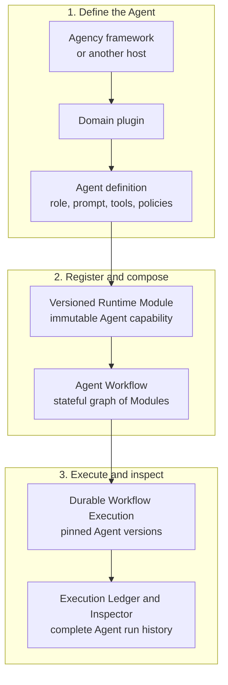
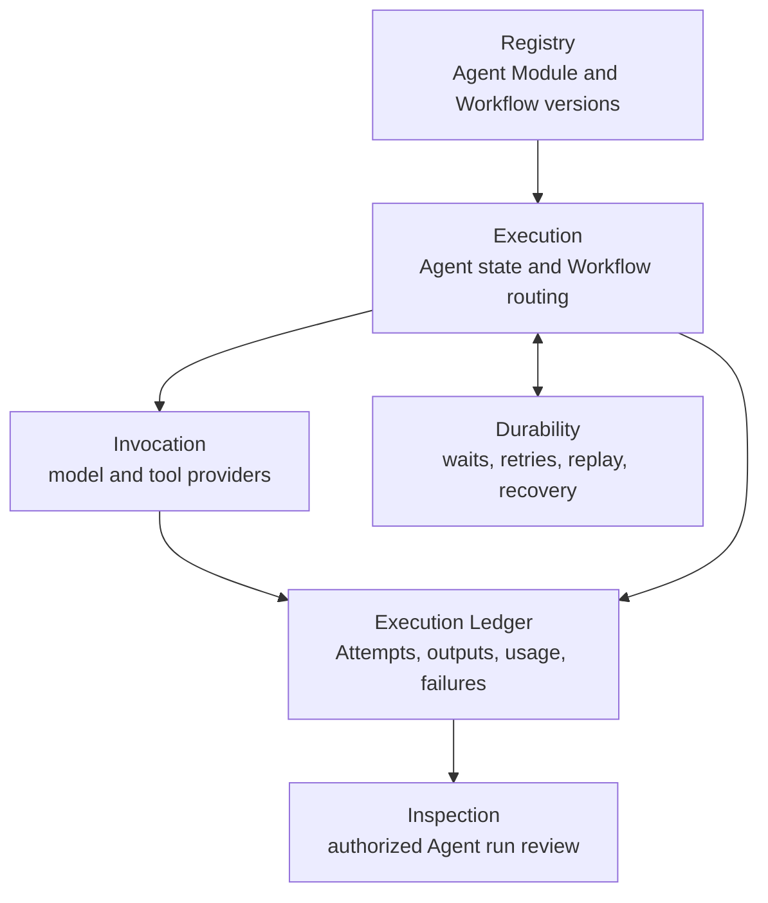
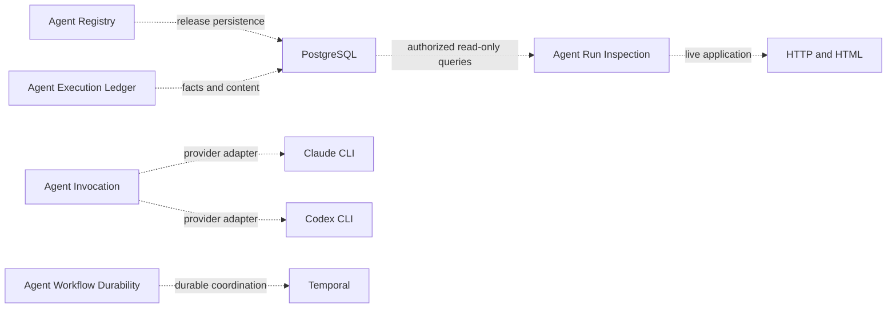
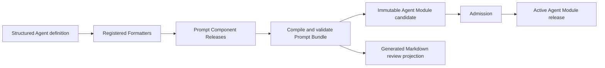
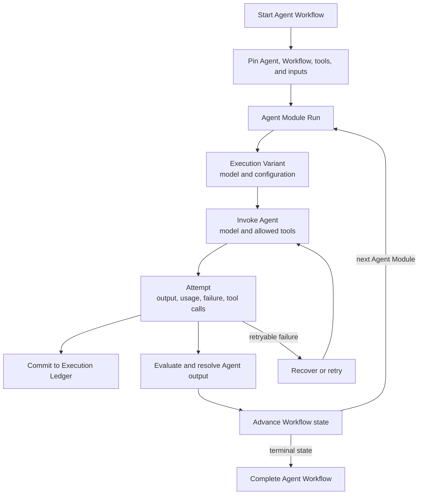

# Agent Runtime

## 第一次使用：先看运行配置与职责

Runtime 把任务定义、运行环境、执行配置和执行记录分开管理。外部调用者不需要从生产代码里
拼装这些部分，也不需要为每个 Reviewer 另配一套底座。

| 组成 | 负责方 | 外部调用者需要知道什么 |
| --- | --- | --- |
| Module / ModuleReviewer / Workflow | Registry；任务 owner 提供 prompt、schema 与业务含义 | Module 是通用任务定义；ModuleReviewer 继承固定默认能力；单节点 Workflow 默认与 Module 同名 |
| root、Python、程序、材料及依赖 | Foundation 做 setup；Invocation 使用运行资源；宿主提供资源与授权 | Python 默认固定为启动 Runtime 的当前环境；root 不自动授权读取整个项目，也不绑定模型 |
| Execution Profile / Variant | Execution.prepare 生成，Registry 承载准确定义 | Module 决定能力要求，模型与 transport 独立选择；无需调用者手拼 Profile |
| CLI 与工具、Attempt 和结果 | Invocation 负责实际调用及原始记录；Execution 负责执行生命周期 | 工具错误与整次执行失败分开；业务是否通过由任务 owner 校验 |
| 记录、恢复与查询 | Ledger / Durability / Inspection | 普通自测不依赖 PG；未请求持久化时返回本次记录，不承诺跨进程恢复 |

**完整运行配置、默认值、接口字段与责任边界**见[由代码导出的 Runtime run profile](docs/agent_runtime_reviewer_api.md#runtime-run-profile)。
该页先给整体组成，再列真实的 Module、ModuleReviewer 默认、ExecutionProfileRelease、Variant、
执行入口和 CLI 参数。完整值来自代码与 docstring，不是另一份手工 Profile 配置。

`agent-runtime-evaluate --help` 同时显示职责摘要和当前 Python 路径。Runtime CLI 管注册、执行和查询；
Portable CLI 管审核对象的准备与结果校验，两套 CLI 保持分开。宿主不复制模型启动或日志解析逻辑。

## 按任务开始 / Start by task

使用 Runtime 时先按任务找操作步骤，不必先知道类名或搜索生产源码。

| 我想做什么 | 从哪里开始 |
| --- | --- |
| 在指定 root 使用 Runtime 工具 | [轻量运行前 setup](docs/agent_runtime_registration_runbook.md#local-runtime-setup)；现有命令自动完成，无需另装 Skill |
| 注册新的 Reviewer / register a new reviewer | [准备资料与注册](docs/agent_runtime_registration_runbook.md#new-reviewer) |
| 用宿主环境首次测试 Reviewer / test a reviewer | [从已注册定义执行测试](docs/agent_runtime_registration_runbook.md#test-reviewer) |
| 查询审核结果、执行日志或失败 / inspect a review | [按执行 ID 查询](docs/agent_runtime_registration_runbook.md#inspect-reviewer) |
| 查完整运行配置、接口参数、返回值和错误 | [自动生成的 Module 与执行 API reference](docs/agent_runtime_reviewer_api.md) |
| 开发 Runtime，运行回归测试 | [开发者能力与测试样例](docs/agent_runtime_capabilities.md) |
| 运行多 Agent 示例或独立评价 | [随包多 Agent 样例](docs/agent_runtime_capability_runbook.md#随包多agent样例)；同一个 `agent-runtime-evaluate` 命令提供 `--example` |

注册保存 Module/Workflow 定义；执行时由 Runtime 固定准确版本并准备本次配置，不要求先给宿主
root 绑定模型或 Profile。宿主提供资源、授权和薄操作入口，不能把测试 fixture 当作正式配置。
本目录提供任务发现与操作导航，不证明某个宿主或 Profile 已完成集成。

随包样例使用普通 Module、同一 Workflow 执行和真实受控工具接口。`agent_capability_example` 包含
查询、写作、并行审核、修订及同进程等待事件；`agent_evaluation_example` 让被测 Agent 自行请求
任务内审核，再由独立 Agent 依据 Runtime 记录评价。工具读取的 fixture 与生产 Gateway 分开，
样例不取得生产数据权限。源代码中的替身测试和显式开启的真实 Provider 测试分别报告。

Agent Runtime is a reusable management and execution layer for stateful AI
agents. It is the part of an agent framework that answers operational
questions: Which version of the agent ran? Which prompt, tools, model profile,
and inputs were pinned? What happened on each retry? Can the run recover after
a crash? What may the current reviewer inspect?

Agent Runtime is the Agent execution and management runtime at the core of the
broader Agency framework. It occupies a role similar to LangGraph's stateful
Agent orchestration layer: applications register versioned Agent capabilities,
connect them into durable Workflows, execute them through model and tool
providers, and inspect every run from an authoritative Execution Ledger.

In Runtime terminology, an Agent capability is registered as a Module, a graph
of Modules is a Workflow, and each provider invocation or retry is an Attempt.
Runtime pins the exact registered versions used by an execution, coordinates
state transitions and recovery, records complete lineage, and exposes
authorized inspection of what happened.

Agent Runtime is also an independently installable, domain-neutral Python
package. The Agency framework—or another host application—extends it with
domain plugins that supply roles, prompts, tools, policies, and business
meaning. Writer, Router, Verifier, Reviewer, or Expert are therefore possible
Agent roles built on Runtime, not hard-coded concepts in Runtime itself. A
Module may also wrap a deterministic function, human task, or external service.

## Agent model

The Agency framework defines what an Agent means for a domain. Agent Runtime
turns that definition into an immutable, executable Module and manages it as
part of a stateful Workflow.



The same Agent Module can be reused in multiple Workflows, and a Workflow can
combine model-backed Agents with deterministic functions, human tasks, and
external services. Runtime manages their execution contracts and lineage
without owning their domain-specific meaning.

## Relationship to other Agent frameworks

Agent Runtime is closest to the orchestration-runtime layer of
[LangGraph](https://docs.langchain.com/oss/python/langgraph/overview), not to a
high-level prompt or role library. LangGraph emphasizes stateful graphs,
durable execution, streaming, persistence, and human-in-the-loop control.
Agent Runtime focuses more narrowly on independently operated infrastructure:
immutable Agent Module and Workflow releases, exact version pinning, atomic
recovery records, a PostgreSQL Execution Ledger, and query-time-authorized
inspection.

Other frameworks optimize for different entry points:

| Framework | Primary strength | Agent Runtime's different focus |
| --- | --- | --- |
| LangGraph | Low-level graphs for long-running stateful agents | Registered immutable releases and an authoritative operational ledger are first-class Runtime contracts |
| [OpenAI Agents SDK](https://openai.github.io/openai-agents-python/) | Lightweight agent loops, tools, handoffs, guardrails, sessions, and tracing | Provider-neutral execution facts, durable backend coordination, and host-supplied authorization boundaries |
| [AutoGen](https://microsoft.github.io/autogen/stable/user-guide/core-user-guide/index.html) | Message-driven single-process and distributed multi-agent runtimes | Version-pinned Workflow execution, transactional recovery, and formal inspection records |
| [CrewAI](https://docs.crewai.com/) | High-level role-based crews plus structured Flows | Domain-neutral infrastructure that does not prescribe roles, goals, or collaboration metaphors |

These are not mutually exclusive ideas. A host can adapt another framework's
agent implementation behind a Runtime Module while using Agent Runtime for
release authority, durable execution, ledgering, and review. The tradeoff is
intentional: Runtime requires more explicit contracts and host integration, and
it does not provide another framework's ecosystem of ready-made roles, tools,
memory strategies, or managed deployment.

## Agent execution responsibility flow

Each Runtime responsibility owns one part of the Agent lifecycle. Arrows mean
Runtime calls or committed execution facts.



Concrete technologies are registered separately as implementation bindings:



This diagram shows the currently registered bindings. The generated
architecture projection is the exhaustive current set.

The Runtime distribution uses Claude CLI and Codex CLI. It does not import or
depend on Claude Agent SDK and no longer provides its SDK executor classes.
Previously recorded SDK Profile identities remain readable as historical data;
they do not select a CLI implementation or recreate a removed executor.

PostgreSQL, Temporal, provider SDKs, CLIs, and renderers are replaceable
implementations. None is a peer logical responsibility or execution authority.

## Logical responsibilities

| Logical responsibility | Owns | Does not own |
| --- | --- | --- |
| Registry | Compile, validate, register, and load immutable Module and Workflow releases | Workflow execution or business meaning |
| Execution | Start and advance Workflow executions; stage admitted content; coordinate authorization, Evaluation, and Resolution | Product Entitlements, provider implementation, or canonical execution facts |
| Invocation | Assemble admitted model context and invoke one registered model or tool profile | Workflow routing, release selection, or canonical records |
| Durability | Coordinate acknowledged commands, waits, retries, replay, and recovery | Prompt, output, usage, or product data storage |
| Ledger | Commit authoritative execution lineage, Attempts, usage, outcomes, and Resolution facts | Workflow decisions, provider sessions, or inspection presentation |
| Inspection | Project and render authorized, read-only Runtime release and execution views | Execution mutation, approval, retry, or publication |

Product Authorization and governed Data Access remain external authorities.
Runtime carries the admitted authorization context and calls those authorities
when an execution requires a current decision or authorized product data.

## Capability documentation

从能力索引按使用任务找到样例，再用 runbook 的单例、分组或全仓命令执行测试。
样例指向真实 pytest 函数，说明输入、预期结果与所需环境；测试代码位于同版本源码 checkout 的
`tests/`，wheel 随附文档。批量测试直接使用 pytest 自动收集，结果中的跳过项不算通过。

- [Agent Runtime capabilities](docs/agent_runtime_capabilities.md)
- [Agent Runtime capability runbook](docs/agent_runtime_capability_runbook.md)
- [Registration runbook](docs/agent_runtime_registration_runbook.md)
- [Claude CLI 工具、宿主环境与 PG sample](docs/agent_runtime_claude_native_tools.md)

公开仓库不携带宿主的私有 Governance/Reviewer source。相关集成用例通过
`AGENT_RUNTIME_REVIEWER_SOURCE_ROOT` 指向已经安装该包的宿主；未配置时明确跳过，不算审核已完成。

### Reviewer interface documentation

The [Reviewer API reference](docs/agent_runtime_reviewer_api.md) is generated
from class/method docstrings, signatures, fields and error constants. Edit
those source definitions, then run these commands in the matching source
checkout; `--check` verifies both repository and wheel-bound documentation
without writing:

```sh
python -B tools/build_agent_runtime_api_reference.py
python -B tools/build_agent_runtime_api_reference.py --check
```

The wheel contains the generated reference under `agent_runtime/docs`.
Its scope is Reviewer authoring and the registered single-node evaluation
entry, not the complete Runtime API.

### Durable parallel groups

A Workflow Release may declare an `all_required` parallel group at one control
node. Every branch remains an ordinary registered Module with its own Module
Run, Variant, Attempt, output, usage, failure, and retry lineage. Runtime keeps
the durable backend cursor at the control node, dispatches missing branches
concurrently, reuses already committed sibling outcomes after recovery, and
advances once to the declared join only after all branches succeed. Parallel
branches cannot wait for external events; waits belong after the join or in a
separate graph position. A committed branch result that cannot enter the join
returns auditable `blocked` progress instead of wedging replay behind a repeated
exception. Runtime also enforces an explicit per-group dispatch-concurrency
limit, and the Cell Activity Bridge contract requires concurrency-safe shared
state.

## Naming

Runtime-owned code uses one three-part semantic name:

```text
module_subject_nominalized_action
```

Examples:

```text
registry_release_registration.py
execution_module_invocation.py
ledger_record_persistence.py
invocation_prompt_assembly.py
durability_temporal_coordination.py
registry_postgres_persistence.py
ledger_postgres_persistence.py
inspection_release_rendering.py
inspection_http_serving.py
inspection_postgres_querying.py
```

The first term identifies the responsible module, the second identifies the
subject, and the third states the action as a noun. Generic filenames such as
`service.py`, `store.py`, `utils.py`, `manager.py`, `api.py`, or `adapter.py`
are not valid Runtime source names.

Python classes may use the `PascalCase` projection of the same semantic name.
Serialized identifiers, functions, variables, schemas, tables, and fields stay
in `snake_case`.

## Source and Design Contract map

The target source distribution is organized by product responsibility, not by
generic Clean Architecture vocabulary.

```text
agent_runtime/
  README.md
  design_contract/
  foundation/
  conformance/
  contracts/
  registry/
  execution/
  invocation/
  durability/
  ledger/
  inspection/
  testing/
```

| Default code family | Primary Design Contract |
| --- | --- |
| `registry_*_*` | `agent_runtime_01_module_contract_and_assembly.md` |
| `execution_*_*` | `agent_runtime_00_execution_charter.md` and `agent_runtime_06_standalone_package_and_lifecycle_contract.md` |
| `execution_authorization_*` and `execution_data_*` | `agent_runtime_09_authorization_integration_contract.md` |
| `invocation_*_*` | `agent_runtime_08_agent_execution_adapter_contract.md` |
| `durability_*_*` | `agent_runtime_07_temporal_durable_adapter_contract.md` |
| `ledger_*_*` | `agent_runtime_06_standalone_package_and_lifecycle_contract.md` |
| `inspection_*_*` | `agent_runtime_06_standalone_package_and_lifecycle_contract.md` |
| `foundation_*_*` | approved Runtime source-architecture and Code Design Basis |
| `conformance_*_*` | approved Runtime source-architecture and Code Design Basis |

The code-owned architecture registration keeps logical responsibilities,
supporting planes, physical source directories, and concrete technology
bindings as separate dimensions. Every target source file maps to one logical
responsibility or one supporting plane and one physical directory. Only a
concrete adapter maps to an implementation binding.

`agent_runtime.conformance` validates the registered source closure, the
one-way responsibility import graph, exact public exports, and shrinking
migration-debt baselines. Existing forbidden imports are frozen by exact source
and target module. A removed debt edge is accepted; a new debt edge fails CI.
Runtime execution code never imports Conformance.
Conformance ships with the standalone wheel so the published package carries
its own assurance tools; shipping it does not place it on the execution call
path. `agent_runtime.testing` is a stable public facade for shipped evaluation
and Adapter-conformance entry points, not a temporary compatibility slice.
Each file below that directory retains its registered logical responsibility or
supporting-plane owner; explicit test composition does not enter ordinary execution.

`agent_runtime.foundation` contains responsibility-neutral validation and JSON
Schema traversal primitives. It imports no Runtime responsibility. Schema
traversal distinguishes schema-bearing positions from container maps such as
`properties` and `$defs`, so a user field named `items` or `properties` is not
misread as a schema keyword.

The current wheel still contains five explicitly enumerated predecessor
semantic surfaces while migration is in progress. They are listed in
`RUNTIME_MIGRATION_DEBT_PATHS`; the generated architecture report, not this
illustrative tree, is the exhaustive current source map.

Before retiring a compatibility facade, use Conformance's
`build_downstream_consumer_manifest` to capture the affected host's import sites,
then `validate_downstream_consumer_retirement_readiness` to check the owner's
decisions. The generated `keep`, `replace` or `retire` defaults identify work;
they do not authorize a cutover. Each site requires an explicit `owner_decision`.
These functions live in `conformance/conformance_consumer_manifesting.py`; a
historical work document is not a package dependency or a current consumer inventory.

Package initializers temporarily re-export some predecessor types for existing
downstream callers. Those re-exports are compatibility-only, must not be used
by a new integration, and retire with the corresponding debt path; a
structural `__init__.py` does not turn the imported predecessor into target
implementation.

The unreleased `0.x.dev` series is the first standalone extraction and has
no tagged public wheel
predecessor. It intentionally does not recreate the former host repository's
physical `postgres`, `provider`, or `review` packages. A host must migrate
those vendored imports to the registered `registry`, `invocation`,
`inspection`, and `ledger` surfaces before pinning the first standalone
release; this wheel is not an in-place upgrade until that migration gate passes.

## Release registration

A domain plugin submits one structured instruction, its input and output
schemas, execution profiles, and registration metadata.
Registered Formatters create immutable Prompt Component Releases;
Runtime orders them into one Prompt Bundle Release and persists both in
PostgreSQL. Admission and activation are explicit later decisions. A generated
Markdown file may project the complete bundle for review and recovery, but it
is never the production read authority.

Execution-selected domain context remains owned by the domain database. The
authorized Runtime caller resolves and freezes it as a hashed Module input
after routing. Runtime does not compile a specialized Module release for it.



Production execution reads the admitted PostgreSQL release. It never rebuilds
a Prompt, Schema, Skill, Module, or Workflow by reopening Git.

## Workflow execution

The Product host requests an already authorized Workflow start. Runtime freezes
the exact Workflow release, Module releases, authorized input closure, and
execution profiles before the first invocation. Later release activation cannot
change an execution already in progress.

For each Agent Module occurrence, Runtime:

1. creates one Module Run;
2. creates one Variant for each selected model or configuration;
3. records every invocation or retry as a separate Attempt;
4. commits output, usage, failure, and evaluation records; and
5. resolves the accepted output before advancing the Workflow.



### 已注册 Module 的一节点执行

宿主已有一节点 Workflow 和选择其 Profile 的 Variant Policy 时，使用
`run_registered_workflow_module`。Stores、Adapter、授权接口和注册绑定配置一次，日常只传
目标 Module、JSON 输入和本次 key。Key 在使用的 record store 命名空间内唯一。

```python
from functools import partial
from agent_runtime import run_registered_workflow_module
from agent_runtime.ledger import PostgresRuntimeExecutionQueryStore

review = partial(
    run_registered_workflow_module,
    release_registry=registry,
    workflow=registry.get_workflow(workflow_ref, workflow_sha256),
    variant_policy=registry.get_execution_variant_policy(variant_ref, variant_sha256),
    authorize=host.authorize,
    context_client=host.context_client,
    operation_client=host.operation_client,
    enforcing_gateway_id=enforcing_gateway_id,
    environment_id=environment_id,
    adapters=adapters,
    artifact_host=cell,
    record_store=execution_store,
    content_store=execution_store,
    claim_token_secret=host_claim_secret,
)

result = review(
    module_id=target_module_id,
    input_payload=payload,
    idempotency_key=review_key,
)
execution_id = result.module_run.workflow_execution_id

query = PostgresRuntimeExecutionQueryStore.from_dsn(database_url, schema=execution_schema)
trace = query.load_trace(execution_id)
for output in result.outputs:
    content = query.load_content(execution_id, output.output_ref)
    assert content.content_sha256 == output.output_sha256
```

宿主提供已初始化的 Registry、Cell staging 接口、明确的 PostgreSQL 记录及内容存储，以及
已配置的执行 Adapter。Staging 可以使用 `InMemoryCellArtifactStore`，需提供 `put_bytes`、
`read_bytes`、`artifact` 和 `resolve_artifact_ref`。Provider 登录和独立 CLI 环境继续由现有
Adapter 配置处理；这个入口不读取环境文件，不执行注册或 activation。

`authorize(request)` 接收已冻结的 `WorkflowModuleExecutionRequest`，返回一个 tuple：
`ExecutionAuthorizationContextEnvelope`，以及依次代表 decision、delegation、entitlement snapshot
的三个 `ResolvedArtifactRef`。它们对应现有记录槽位，不是新增 grant。宿主拥有这些引用的含义，
并将精确内容放入 artifact host。Runtime 校验身份，通过原有 controller 绑定 context，再调用
宿主提供的接口取得操作决定。授权内容和 claim secret 不进入模型 Prompt；同一 execution 使用
相同的 claim secret。

入口从已注册 Workflow 和 Variant Policy 派生 Module、节点与 Profile，并核对它们确实指向
`target_module_id`。当前支持 tool-free inline `evaluation`，不执行多节点图，也不代表
无 Workflow 的持久 standalone 已实现。入口冻结任务与 Prompt，记录执行起点和输入，再通过
`run_workflow_module` 完成实际 Attempt 与原子提交。

返回值是原始 `ModuleRunResult`，业务审核结论由所属 Reviewer 解释。`evaluated_single` 在
尚未独立选择结果时保持 `resolution=None`，重放也一样；只有 `direct_single` 可以从已提交输出
补全缺少的直接 Resolution。同 key、同输入和绑定会复用已提交结果，不再次调用 Provider；
内容冲突会被拒绝。未完成执行返回现有 Runtime 恢复路径，Store 失败不能当作落库成功。
使用示例中的新查询连接核对实际记录和内容。

并发首次调用使用 PG 原生 `CommitReceipt.replayed` 判定进入权，只有首次提交者进入模型执行。
竞争调用取得已提交结果，或在结果尚未完成时返回既有恢复路径。
`WorkflowExecutionLedgerRecorder.record_execution_start` 现在返回这份已有 receipt；
它的输入和写入行为不变，原有忽略返回值的调用可以继续使用。

## Workflow Inspector

The installed Runtime exposes a read-only web interface backed by its formal
PostgreSQL records. The page itself contains no embedded execution snapshot.

An authorized user can:

- list every Workflow Execution allowed by the current Product grant;
- open the frozen Workflow graph;
- select every occurrence of a Module in a loop;
- inspect every Variant, Attempt, retry, failure, Prompt, output, usage,
  Evaluation, and Resolution; and
- refresh a running execution without creating or mutating Runtime records.

Prompt, input, output, and failure bodies are returned only after an exact
content-read authorization decision. The Product host may embed or proxy the
Inspector, but it does not define another execution schema.

The package also retains an explicit offline snapshot exporter for portable
review artifacts. It is a secondary export path, not the primary interface or
a second persisted source of truth, and it is never created automatically.

## PostgreSQL and Live Inspector quick start

Install the optional PostgreSQL client and initialize both Runtime-owned
schemas:

```bash
pip install "agent-runtime-core[postgres]"
```

```python
from agent_runtime.ledger import PostgresRuntimeExecutionRecordStore
from agent_runtime.registry import PostgresRuntimeReleaseStore

database_url = "postgresql://runtime@localhost/runtime"
PostgresRuntimeReleaseStore.from_dsn(database_url).create_schema(
    installed_at_utc="2026-08-17T20:00:00Z",
)
PostgresRuntimeExecutionRecordStore.from_dsn(database_url).initialize_schema()
```

The live application deliberately has no allow-all mode and does not trust a
request header by default. A host supplies its authenticated request context
and current Product authorization checks, then assembles the read-only query
stores:

```python
from agent_runtime.inspection import (
    LiveInspectionAssembly,
    PostgresWorkflowInspectionRepository,
)
from agent_runtime.ledger import PostgresRuntimeExecutionQueryStore
from agent_runtime.registry import PostgresRuntimeReleaseQueryStore

def build_inspector():
    repository = PostgresWorkflowInspectionRepository(
        PostgresRuntimeExecutionQueryStore.from_dsn(DATABASE_URL),
        release_queries=PostgresRuntimeReleaseQueryStore.from_dsn(DATABASE_URL),
    )
    return LiveInspectionAssembly(
        repository=repository,
        authorizer=product_inspection_authorizer,
        request_context_resolver=resolve_authenticated_request,
        frame_ancestors=("https://product.example.com",),
    )
```

```bash
agent-runtime-live-inspect \
  --application-factory host.inspector:build_inspector \
  --host 127.0.0.1 \
  --port 8080
```

The console command uses Python's reference WSGI server for a direct package
entry point. A production deployment should load the same assembled WSGI
application in its hardened process manager or application server.

The query adapters execute PostgreSQL transactions in explicit read-only mode.
Production deployments should additionally give the Inspector connection a
database role with `SELECT` privileges only.

## Published release

Every published Runtime release contains:

- this README;
- a generated, hash-bound bundle of Runtime-owned Design Contracts;
- the public Python API and JSON schemas;
- deterministic PostgreSQL schema installers for releases, executions,
  records, content, and query indexes;
- the live Workflow Inspector assets; and
- architecture, clean-wheel, execution, recovery, invocation, and inspection tests.

The README is the human entry point. Design Contracts define intent and stable
invariants. Code, PostgreSQL records, and generated architecture reports define
current executable truth.

## Current maturity

`0.2.0.dev0` contains working PostgreSQL release registration, an
append-only PostgreSQL Execution Ledger with restart recovery and immutable
content verification, provider A/B adapters, Temporal recovery, and an
authorized read-only Live Inspector over the formal records. These surfaces
are implemented and tested; they are no longer listed as future work.

The public execution kernel has two entry points over the same registered
Module and provider-adapter contracts. `run_module()` owns isolated Test or
Evaluation runs. `run_workflow_module()` owns a durable Module Activity inside
an admitted Workflow Execution and writes the canonical Execution Ledger
before and after provider entry. Every invocation — explicitly registered provider adapters
and in-process test doubles alike — crosses the canonical
`AuthorizedAgentExecutionAdapter` contract, and a Module that declares a model
operation requires a `ModuleExecutionAuthority`: its AR09 execution
authorization binding, fence, protected-operation intent, and Product
operation decision are resolved and validated before the provider transport is
entered, and the committed fence is re-read inside the atomic finalization
that makes outputs authoritative. The following terms describe separate
dimensions and must not be used interchangeably:

Workflow hosts use `WorkflowExecutionLedgerRecorder` for the surrounding
execution facts: the frozen execution input package, deterministic derived
outputs with their source-artifact refs, and each atomic Domain Outcome plus
recovery checkpoint. Business plugins therefore do not construct ledger rows
or keep a parallel shadow trace.

| Dimension | Question answered | Current values or examples |
| --- | --- | --- |
| Execution purpose | Why is this run being performed? | `test`, `evaluation`, `workflow`, `standalone`, `replay` |
| Provider transport | How is the adapter reached? | Bundled model transports: `claude_cli`, `codex_cli`; test doubles use their declared binding. Generic transport families remain `in_process`, `sdk`, `cli`, `api` |
| Capability profile | What may the model do and receive? | `execution_mode`, semantic input delivery, Attempt workspace, Gateway tools, and network policy |
| Runtime execution gate | May this exact request execute now? | Purpose gate, exact registered releases, Module operations, exact profile, registered adapter identity and capability coverage, and — for model operations — committed AR09 authorization evidence must all pass; Workflow/Standalone entry additionally resolves its active pointer |

`production` is not a `ModuleExecutionPurpose` value. It describes a deployment
scope normally entered through `workflow` or `standalone`; those
purposes are not admitted by the current public entry point.

### Current Module-execution admission matrix

| Purpose and Module shape | Capability profile | Registered transport | Current result |
| --- | --- | --- | --- |
| `test` or `evaluation`, no protected operation | Exact registered profile | `in_process` transport family only; a provider transport requires a declared model operation | Admitted without authorization evidence, subject to exact release and adapter checks |
| `test` or `evaluation`, exactly one model operation (`invoke_model` or `model_execute`) and no other operation | `tool_free` + `inline` + workspace `none` + empty tool policy + network `denied` | Compatible Claude CLI or Codex CLI adapter | Admitted with explicit execution authority or Runtime-hosted self-test resources; self-tests do not synthesize production decisions |
| `test` or `evaluation`, exactly one model operation and no other operation | `agent` + `inline` + workspace `none` or `own_draft_read_write` + an explicit subset of `read/search/shell` + network `denied` | ClaudeAdapter | Admitted within the CLI's implemented resource window. Materials remain read-only and permitted draft writes use the bounded scratch area |
| `test` or `evaluation`, exactly one model operation plus one or more declared Gateway read operations | `agent` + `gateway_read` + workspace `none` + exact non-empty tool policy and access reason + network `gateway_only` | No bundled CLI Gateway adapter | The generic operation protocol and in-memory conformance tests remain; a real CLI Gateway bridge is not provided. No SDK fallback is available |
| `test` or `evaluation`, any other protected-operation/profile conjunction | Any | Any | Rejected before Provider invocation, including `hybrid`, Gateway-plus-draft, attachments, direct egress, Codex workspace/Gateway, or a descriptor without dynamic authorization support |
| Workflow-bound `evaluation`, `test`, `workflow`, or `replay` through `run_workflow_module()` | Same exact reviewed capability conjunctions as above | Same registered adapters | Admitted for one Variant per durable dispatch. Module Run/Variant and Attempt claim precede Provider entry; operation authorization precedes each effect; terminal Attempt/calls/usage/outputs are atomically finalized. Model and Gateway calls retain their AR09 evidence and immutable tool content refs. A committed invocation replays without a Provider call, and a missing direct-output resolution is healed from the committed Attempt bundle. |
| `standalone` through either entry point | Any | Any | Not admitted by the current public entry points |

These rows are exact reviewed conjunctions, not a rule that every
Test/Evaluation capability may be freely combined. Adapter implementation and
public-entry admission remain separate facts: adding a representable profile
dimension or registering an adapter cannot implicitly admit a new hybrid.

One durable Workflow dispatch currently carries exactly one Variant. A/B arms
therefore use separate dispatches under the same Module Release and frozen
input closure; evaluation and selection remain downstream Runtime records.

| Capability profile | Semantic input | Attempt workspace | Model-visible tools | Agent network | Adapter status | Model-backed `run_module()` admission |
| --- | --- | --- | --- | --- | --- | --- |
| Tool-free inline | `inline` | `none` | None | `denied` | Claude CLI and Codex CLI implemented | `test` / `evaluation` admitted |
| Agent with private drafts | `inline` | `own_draft_read_write` | Explicit native read/search/shell subset | `denied` | Claude CLI implemented; Codex workspace remains an unadmitted candidate | Claude CLI `test` / `evaluation` admitted; Codex workspace not admitted |
| Agent with governed reads | `gateway_read` | `none` | Exact registered Runtime Gateway tools | `gateway_only` | Generic protocol only; no bundled CLI Gateway implementation | Requires an applicable implementation; not provided by the bundled CLIs |
| Agent with direct sandboxed egress | Profile-specific | Profile-specific | Profile-specific | `direct_sandboxed` | No current public-entry slice | Not admitted |

In the tool-free and Gateway-read profiles, workspace `none` means the model receives no
writable Attempt draft capability; the Runtime may still create an isolated
Attempt directory as an execution boundary. An empty tool policy means no
model-visible tools. Network `denied` means no Agent-initiated general outbound
or tool network access; the registered CLI transport may still connect to
its model Provider control plane. Transport connectivity is not an Agent
capability. In the Gateway slice, `gateway_only` exposes only the exact
Profile/Module tool intersection. A validated and recorded `DENY` prevents that
resource call and returns `OperationAuthorizationDenied`; an Adapter may deliver
it as a tool error and continue. A closed fence, mismatched Attempt lineage,
invalid decision or required-record failure still prevents continuation and
result acceptance, even when the Adapter catches the error. Allowed Gateway
calls retain their exact request/response lineage; denied operations never gain
an ALLOW receipt.

Claude permission events and ordinary tool failures are recorded independently
of the invocation outcome. Codex completion requires a successful process, an
unambiguous successful Provider terminal and valid output. Both CLI paths retain
captured stdout/stderr and public tool events in the existing private trace,
including failure and cancellation prefixes. `read_execution_log` returns these
facts with explicit capture or content limitations. A valid business `non_pass`
or `blocked` response remains a completed technical execution, not a reason to
retry the model. Tool, Provider, Attempt and business outcomes stay distinct.

Ordinary execution extracts basic metadata and the final result, and archives
raw logs; it does not parse tool behavior to decide success or retry. Inspection's
`read_execution_log` parses detailed tool events only when private content is
requested. Historical traces that already contain `tool_log` retain their saved
interpretation. A log gap affects the view's completeness, not the recorded
Attempt status. The explicit evaluation API and CLI request this detailed view
before their temporary resources close; a behavioral assessment remains separate.

Claude's current binding is `claude_cli_adapter@v3`. Its complete stdin prompt,
including relative resource locations, is frozen before the Prompt Envelope is
stored. Old Claude v1/v2 and `claude_cli_native_tools_executor@v2` records remain
readable, and committed requests replay without an Adapter; new executions use
an explicitly prepared current Profile. Hosts must migrate their current entry
points before adopting this package rather than reinterpret saved bindings.

The existing evaluation CLI accepts `--resources FILE` for an explicitly frozen
file tree, read-only dependency directories and task-supplied command IDs. On
macOS, Claude can use its ordinary Read/Grep/Bash tools and, when commands are
supplied, an additional Runtime-owned local MCP tool. The `cli_tools` extra is
required for the local command or task-callback bridge. Each selected command runs in its own
actual OS sandbox under the same live resource guard; it supplies real argv,
cwd, returncode and captured bytes. Ordinary Bash is not restricted to this
command list, and the list does not define a business verdict or domain grant.
The original CLI observations remain available alongside parent-process facts;
only uniquely proven correlations become one unified call.

Optional `root/.runtime/config.json` stores executable and read-only dependency
locators, not models, Profiles, task material or database permissions. Explicit
arguments override the selected resource defaults, including an empty dependency
tuple. Unused defaults do not expose resources to tool-free Modules. See
`load_runtime_config` and `evaluate_local_workflow_module` in the generated API
for the exact fields, relative-path rules and error boundaries. This ordinary
self-test remains non-persistent and does not connect to PostgreSQL.

Opt-in live smoke tests cover the remaining CLI implementations. The Codex
test below covers the tool-free path. Claude CLI's native-tool cases and their
environment prerequisites are documented in
`docs/agent_runtime_claude_native_tools.md`; none invokes Claude Agent SDK.

For a registered tool-free Module, the existing `agent-runtime-evaluate` command
also accepts `--transport codex_cli --model MODEL --effort EFFORT`. Both model
fields are explicit for Codex; omitting transport keeps the Claude defaults.
Codex v4 uses a fresh private Provider state and the host's one standard
file-based login source, with Skills, plugins, MCP and task tools disabled.
The real process launch is ordered against temporary-resource closure; no
Product Authorization decision is fabricated for this path. A replaced
authentication reference is retained in a separate private state and reported
as cleanup failure, not silently deleted or written back to the host credential.

The v4 configuration replaces the executable v3 binding. Historical v3 Profiles
and committed results remain readable; exact committed requests can replay
without the retired Adapter. New execution requires an explicitly prepared v4
Profile rather than rewriting a saved v3 record. Codex's tool-enabled workspace
candidate remains unavailable; a Module's required tools are never dropped to
fit this tool-free path. See the generated Codex API and registration runbook
for the actual resource parameters, errors and supported combinations.

```bash
RUN_PROVIDER_INTEGRATION=1 python -m pytest \
  tests/test_agent_runtime_native_structured_output.py \
  -k 'live_codex'
```

The development version remains appropriate because a Product host must still
supply and validate its authentication, authorization, governed-data, and
deployment assembly. The shadow `ModuleExecutor` compatibility seam is retired:
the canonical `AuthorizedAgentExecutionAdapter` DTOs and the bounded failure
taxonomy are the only execution contract, with no compatibility aliases.
End-to-end consumer migration remains a release gate, not an implied
capability.

Two boundaries are intentionally still explicit integration gates. Runtime
defines `AgentRuntimeProductHostApi`, but a concrete product-host controller
belongs to the composing host rather than this domain-neutral package.
`ExecutionVariantPolicyRelease` is the admitted pre-execution selection
contract. PostgreSQL execution authorities pin the resolved profile in Variant
and Attempt facts rather than creating a second control-plane selection
authority. A production host must close and test that registered selection
handoff for its own start path.
