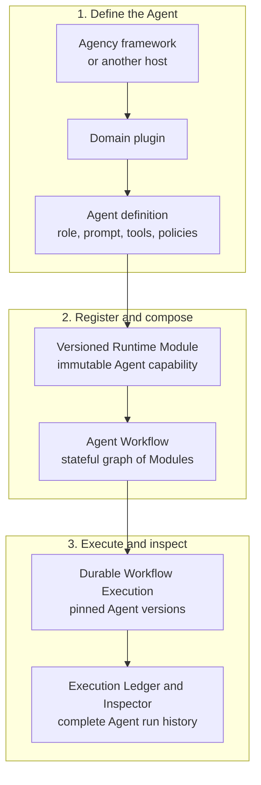
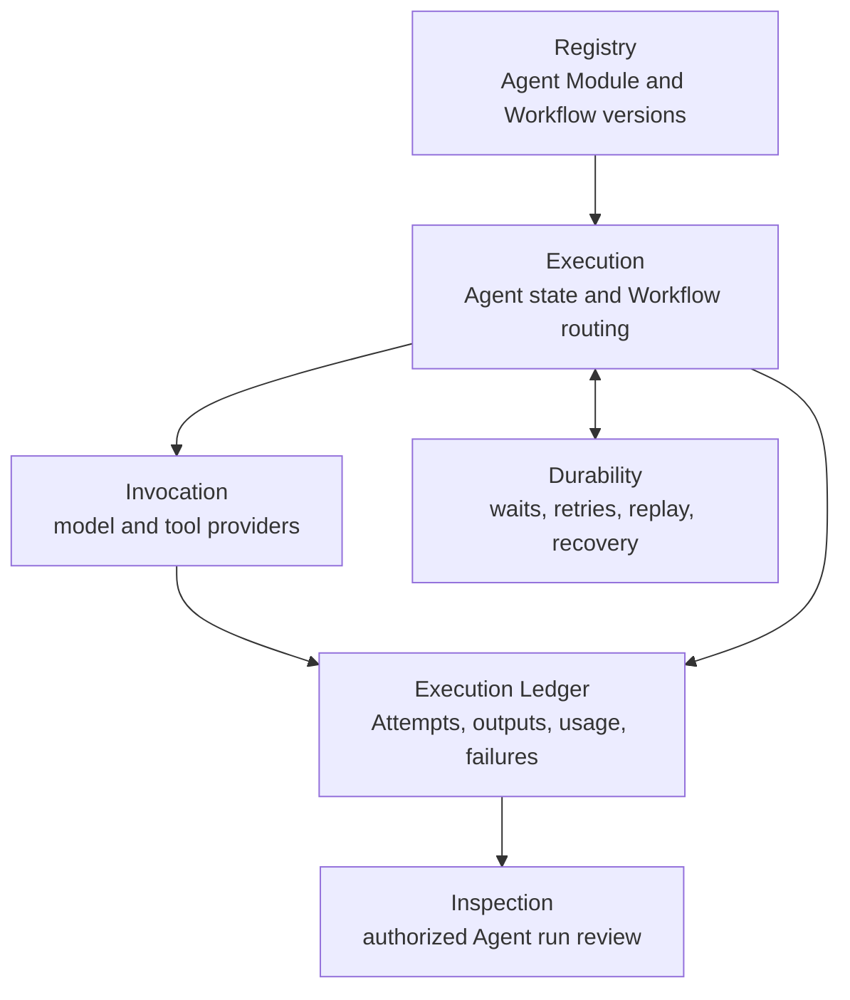
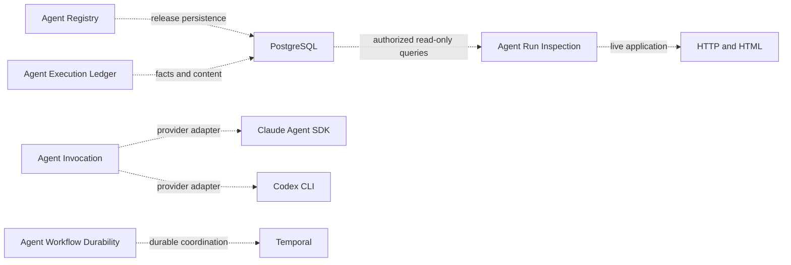
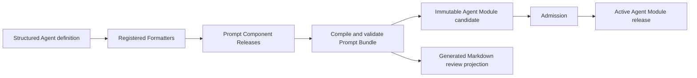
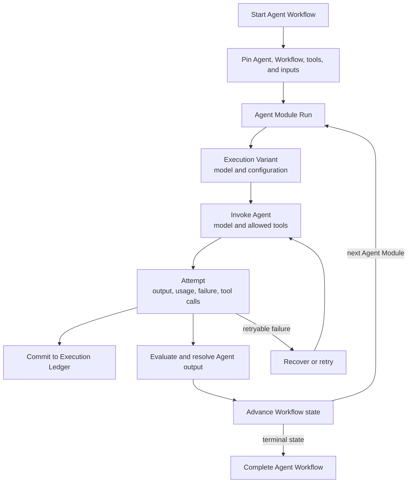

# Agent Runtime

Agent Runtime is a reusable management and execution layer for stateful AI
agents. It is the part of an agent framework that answers operational
questions: Which version of the agent ran? Which prompt, tools, model profile,
and inputs were pinned? What happened on each retry? Can the run recover after
a crash? What may the current reviewer inspect?

Agent Runtime is the Agent execution and management runtime at the core of the
broader Agency framework. It occupies a role similar to LangGraph's stateful
Agent orchestration layer: applications register versioned Agent capabilities,
connect them into durable Workflows, execute them through model and tool
providers, and inspect every run from an authoritative Execution Ledger.

In Runtime terminology, an Agent capability is registered as a Module, a graph
of Modules is a Workflow, and each provider invocation or retry is an Attempt.
Runtime pins the exact registered versions used by an execution, coordinates
state transitions and recovery, records complete lineage, and exposes
authorized inspection of what happened.

Agent Runtime is also an independently installable, domain-neutral Python
package. The Agency framework—or another host application—extends it with
domain plugins that supply roles, prompts, tools, policies, and business
meaning. Writer, Router, Verifier, Reviewer, or Expert are therefore possible
Agent roles built on Runtime, not hard-coded concepts in Runtime itself. A
Module may also wrap a deterministic function, human task, or external service.

## Agent model

The Agency framework defines what an Agent means for a domain. Agent Runtime
turns that definition into an immutable, executable Module and manages it as
part of a stateful Workflow.



The same Agent Module can be reused in multiple Workflows, and a Workflow can
combine model-backed Agents with deterministic functions, human tasks, and
external services. Runtime manages their execution contracts and lineage
without owning their domain-specific meaning.

## Relationship to other Agent frameworks

Agent Runtime is closest to the orchestration-runtime layer of
[LangGraph](https://docs.langchain.com/oss/python/langgraph/overview), not to a
high-level prompt or role library. LangGraph emphasizes stateful graphs,
durable execution, streaming, persistence, and human-in-the-loop control.
Agent Runtime focuses more narrowly on independently operated infrastructure:
immutable Agent Module and Workflow releases, exact version pinning, atomic
recovery records, a PostgreSQL Execution Ledger, and query-time-authorized
inspection.

Other frameworks optimize for different entry points:

| Framework | Primary strength | Agent Runtime's different focus |
| --- | --- | --- |
| LangGraph | Low-level graphs for long-running stateful agents | Registered immutable releases and an authoritative operational ledger are first-class Runtime contracts |
| [OpenAI Agents SDK](https://openai.github.io/openai-agents-python/) | Lightweight agent loops, tools, handoffs, guardrails, sessions, and tracing | Provider-neutral execution facts, durable backend coordination, and host-supplied authorization boundaries |
| [AutoGen](https://microsoft.github.io/autogen/stable/user-guide/core-user-guide/index.html) | Message-driven single-process and distributed multi-agent runtimes | Version-pinned Workflow execution, transactional recovery, and formal inspection records |
| [CrewAI](https://docs.crewai.com/) | High-level role-based crews plus structured Flows | Domain-neutral infrastructure that does not prescribe roles, goals, or collaboration metaphors |

These are not mutually exclusive ideas. A host can adapt another framework's
agent implementation behind a Runtime Module while using Agent Runtime for
release authority, durable execution, ledgering, and review. The tradeoff is
intentional: Runtime requires more explicit contracts and host integration, and
it does not provide another framework's ecosystem of ready-made roles, tools,
memory strategies, or managed deployment.

## Agent execution responsibility flow

Each Runtime responsibility owns one part of the Agent lifecycle. Arrows mean
Runtime calls or committed execution facts.



Concrete technologies are registered separately as implementation bindings:



This diagram shows the currently registered bindings. The generated
architecture projection is the exhaustive current set.

PostgreSQL, Temporal, provider SDKs, CLIs, and renderers are replaceable
implementations. None is a peer logical responsibility or execution authority.

## Logical responsibilities

| Logical responsibility | Owns | Does not own |
| --- | --- | --- |
| Registry | Compile, validate, register, and activate immutable Module and Workflow releases | Workflow execution or business meaning |
| Execution | Start and advance Workflow executions; stage admitted content; coordinate authorization, Evaluation, and Resolution | Product Entitlements, provider implementation, or canonical execution facts |
| Invocation | Assemble admitted model context and invoke one registered model or tool profile | Workflow routing, release selection, or canonical records |
| Durability | Coordinate acknowledged commands, waits, retries, replay, and recovery | Prompt, output, usage, or product data storage |
| Ledger | Commit authoritative execution lineage, Attempts, usage, outcomes, and Resolution facts | Workflow decisions, provider sessions, or inspection presentation |
| Inspection | Project and render authorized, read-only Runtime release and execution views | Execution mutation, approval, retry, or publication |

Product Authorization and governed Data Access remain external authorities.
Runtime carries the admitted authorization context and calls those authorities
when an execution requires a current decision or authorized product data.

### Durable parallel groups

A Workflow Release may declare an `all_required` parallel group at one control
node. Every branch remains an ordinary registered Module with its own Module
Run, Variant, Attempt, output, usage, failure, and retry lineage. Runtime keeps
the durable backend cursor at the control node, dispatches missing branches
concurrently, reuses already committed sibling outcomes after recovery, and
advances once to the declared join only after all branches succeed. Parallel
branches cannot wait for external events; waits belong after the join or in a
separate graph position. A committed branch result that cannot enter the join
returns auditable `blocked` progress instead of wedging replay behind a repeated
exception. Runtime also enforces an explicit per-group dispatch-concurrency
limit, and the Cell Activity Bridge contract requires concurrency-safe shared
state.

## Naming

Runtime-owned code uses one three-part semantic name:

```text
module_subject_nominalized_action
```

Examples:

```text
registry_release_registration.py
execution_module_invocation.py
ledger_record_persistence.py
invocation_prompt_assembly.py
durability_temporal_coordination.py
registry_postgres_persistence.py
ledger_postgres_persistence.py
inspection_release_rendering.py
inspection_http_serving.py
inspection_postgres_querying.py
```

The first term identifies the responsible module, the second identifies the
subject, and the third states the action as a noun. Generic filenames such as
`service.py`, `store.py`, `utils.py`, `manager.py`, `api.py`, or `adapter.py`
are not valid Runtime source names.

Python classes may use the `PascalCase` projection of the same semantic name.
Serialized identifiers, functions, variables, schemas, tables, and fields stay
in `snake_case`.

## Source and Design Contract map

The target source distribution is organized by product responsibility, not by
generic Clean Architecture vocabulary.

```text
agent_runtime/
  README.md
  design_contract/
  foundation/
  conformance/
  contracts/
  registry/
  execution/
  invocation/
  durability/
  ledger/
  inspection/
  testing/
```

| Default code family | Primary Design Contract |
| --- | --- |
| `registry_*_*` | `agent_runtime_01_module_contract_and_assembly.md` |
| `execution_*_*` | `agent_runtime_00_execution_charter.md` and `agent_runtime_06_standalone_package_and_lifecycle_contract.md` |
| `execution_authorization_*` and `execution_data_*` | `agent_runtime_09_authorization_integration_contract.md` |
| `invocation_*_*` | `agent_runtime_08_agent_execution_adapter_contract.md` |
| `durability_*_*` | `agent_runtime_07_temporal_durable_adapter_contract.md` |
| `ledger_*_*` | `agent_runtime_06_standalone_package_and_lifecycle_contract.md` |
| `inspection_*_*` | `agent_runtime_06_standalone_package_and_lifecycle_contract.md` |
| `foundation_*_*` | approved Runtime source-architecture and Code Design Basis |
| `conformance_*_*` | approved Runtime source-architecture and Code Design Basis |

The code-owned architecture registration keeps logical responsibilities,
supporting planes, physical source directories, and concrete technology
bindings as separate dimensions. Every target source file maps to one logical
responsibility or one supporting plane and one physical directory. Only a
concrete adapter maps to an implementation binding.

`agent_runtime.conformance` validates the registered source closure, the
one-way responsibility import graph, exact public exports, and shrinking
migration-debt baselines. Existing forbidden imports are frozen by exact source
and target module. A removed debt edge is accepted; a new debt edge fails CI.
Runtime execution code never imports Conformance.
Conformance ships with the standalone wheel so the published package carries
its own assurance tools; shipping it does not place it on the execution call
path. `agent_runtime.testing` is a stable public facade for shipped evaluation
and Adapter-conformance entry points, not a temporary compatibility slice.
Each file below that directory retains its registered Registry, Execution, or
Durability owner.

`agent_runtime.foundation` contains responsibility-neutral validation and JSON
Schema traversal primitives. It imports no Runtime responsibility. Schema
traversal distinguishes schema-bearing positions from container maps such as
`properties` and `$defs`, so a user field named `items` or `properties` is not
misread as a schema keyword.

The current wheel still contains five explicitly enumerated predecessor
semantic surfaces while migration is in progress. They are listed in
`RUNTIME_MIGRATION_DEBT_PATHS`; the generated architecture report, not this
illustrative tree, is the exhaustive current source map.

Before a public cutover, Conformance freezes every downstream Runtime import at
symbol level in a host-owned consumer manifest. Derived dispositions can
inventory migration work, while compatibility-facade retirement remains
blocked until every affected site carries an explicit owner decision.

Package initializers temporarily re-export some predecessor types for existing
downstream callers. Those re-exports are compatibility-only, must not be used
by a new integration, and retire with the corresponding debt path; a
structural `__init__.py` does not turn the imported predecessor into target
implementation.

The unreleased `0.x.dev` series is the first standalone extraction and has
no tagged public wheel
predecessor. It intentionally does not recreate the former host repository's
physical `postgres`, `provider`, or `review` packages. A host must migrate
those vendored imports to the registered `registry`, `invocation`,
`inspection`, and `ledger` surfaces before pinning the first standalone
release; this wheel is not an in-place upgrade until that migration gate passes.

## Release registration

A domain plugin submits one structured instruction, its input and output
schemas, execution profiles, and registration metadata.
Registered Formatters create immutable Prompt Component Releases;
Runtime orders them into one Prompt Bundle Release and persists both in
PostgreSQL. Admission and activation are explicit later decisions. A generated
Markdown file may project the complete bundle for review and recovery, but it
is never the production read authority.

Execution-selected domain context remains owned by the domain database. The
authorized Runtime caller resolves and freezes it as a hashed Module input
after routing. Runtime does not compile a specialized Module release for it.



Production execution reads the admitted PostgreSQL release. It never rebuilds
a Prompt, Schema, Skill, Module, or Workflow by reopening Git.

Every host uses the same explicit authoring client. The host owns only its
inventory and selected source files:

```python
from pathlib import Path

from agent_runtime.registry import (
    RuntimeReleaseRegistry,
    build_runtime_release_set,
    load_runtime_authoring_inventory,
    register_runtime_release_set,
)

sources = load_runtime_authoring_inventory(
    Path.cwd(),
    "runtime_authoring_inventory.json",
)
build = build_runtime_release_set(sources)
report = register_runtime_release_set(RuntimeReleaseRegistry(), build)
```

The same submission call accepts `PostgresRuntimeReleaseStore` after an
administrator has installed the Registry schema. The client performs no source
discovery, schema creation, migration, provider invocation, or business
routing. Its report contains Release identities only.

## Workflow execution

The Product host requests an already authorized Workflow start. Runtime freezes
the exact Workflow release, Module releases, authorized input closure, and
execution profiles before the first invocation. Later release activation cannot
change an execution already in progress.

For each Agent Module occurrence, Runtime:

1. creates one Module Run;
2. creates one Variant for each selected model or configuration;
3. records every invocation or retry as a separate Attempt;
4. commits output, usage, failure, and evaluation records; and
5. resolves the accepted output before advancing the Workflow.



## Workflow Inspector

The installed Runtime exposes a read-only web interface backed by its formal
PostgreSQL records. The page itself contains no embedded execution snapshot.

An authorized user can:

- list every Workflow Execution allowed by the current Product grant;
- open the frozen Workflow graph;
- select every occurrence of a Module in a loop;
- inspect every Variant, Attempt, retry, failure, Prompt, output, usage,
  Evaluation, and Resolution; and
- refresh a running execution without creating or mutating Runtime records.

Prompt, input, output, and failure bodies are returned only after an exact
content-read authorization decision. The Product host may embed or proxy the
Inspector, but it does not define another execution schema.

The package also retains an explicit offline snapshot exporter for portable
review artifacts. It is a secondary export path, not the primary interface or
a second persisted source of truth, and it is never created automatically.

## External contract references

The packaged Design Contract manifest may name adjacent authority contracts
published by a host, Agency Platform, Product Authorization, Data Governance,
or Software Delivery. Those names document interface dependencies only. Their
files and content are not part of the Runtime repository or wheel.

## Development verification

Install the complete development test environment with:

```bash
pip install -e ".[test]"
```

The default suite includes every deterministic test and collects the Claude,
Temporal, and PostgreSQL adapter surfaces. Live Provider, PostgreSQL, and
Temporal integration calls remain explicitly environment-gated.

## PostgreSQL first-time provisioning and Live Inspector

This development candidate is not published on PyPI. From a local checkout,
install the package and optional PostgreSQL client, then provision the
Runtime-owned schemas:

```bash
pip install -e ".[postgres]"
```

```python
from agent_runtime.ledger import PostgresRuntimeExecutionRecordStore
from agent_runtime.registry import PostgresRuntimeReleaseStore

database_url = "postgresql://runtime@localhost/runtime"
PostgresRuntimeReleaseStore.from_dsn(database_url).create_schema()
PostgresRuntimeExecutionRecordStore.from_dsn(database_url).initialize_schema()
```

`create_schema()` is an administrator-only, absent-namespace operation. It is
deliberately non-idempotent and never runs during application startup. Registry
startup uses `installed_schema_release()` and refuses every state except the
exact ready release.

The live application deliberately has no allow-all mode and does not trust a
request header by default. A host supplies its authenticated request context
and current Product authorization checks, then assembles the read-only query
stores:

```python
from agent_runtime.inspection import (
    LiveInspectionAssembly,
    PostgresWorkflowInspectionRepository,
)
from agent_runtime.ledger import PostgresRuntimeExecutionQueryStore
from agent_runtime.registry import PostgresRuntimeReleaseQueryStore

def build_inspector():
    repository = PostgresWorkflowInspectionRepository(
        PostgresRuntimeExecutionQueryStore.from_dsn(DATABASE_URL),
        release_queries=PostgresRuntimeReleaseQueryStore.from_dsn(DATABASE_URL),
    )
    return LiveInspectionAssembly(
        repository=repository,
        authorizer=product_inspection_authorizer,
        request_context_resolver=resolve_authenticated_request,
        frame_ancestors=("https://product.example.com",),
    )
```

```bash
agent-runtime-live-inspect \
  --application-factory host.inspector:build_inspector \
  --host 127.0.0.1 \
  --port 8080
```

The console command uses Python's reference WSGI server for a direct package
entry point. A production deployment should load the same assembled WSGI
application in its hardened process manager or application server.

The query adapters execute PostgreSQL transactions in explicit read-only mode.
Production deployments should additionally give the Inspector connection a
database role with `SELECT` privileges only.

## Published release

Every published Runtime release contains:

- this README;
- a generated, hash-bound bundle of Runtime-owned Design Contracts;
- the public Python API and JSON schemas;
- deterministic PostgreSQL schema installers for releases, executions,
  records, content, and query indexes;
- the live Workflow Inspector assets; and
- architecture, clean-wheel, execution, recovery, invocation, and inspection tests.

The README is the human entry point. Design Contracts define intent and stable
invariants. Code, PostgreSQL records, and generated architecture reports define
current executable truth.

## Current maturity

`0.2.0.dev0` contains working PostgreSQL release registration, an
append-only PostgreSQL Execution Ledger with restart recovery and immutable
content verification, provider A/B adapters, Temporal recovery, and an
authorized read-only Live Inspector over the formal records. These surfaces
are implemented and tested; they are no longer listed as future work.

The public execution kernel has two entry points over the same registered
Module and provider-adapter contracts. `run_module()` owns isolated Test or
Evaluation runs. `run_workflow_module()` owns a durable Module Activity inside
an admitted Workflow Execution and writes the canonical Execution Ledger
before and after provider entry. Every invocation — explicitly registered provider adapters
and in-process test doubles alike — crosses the canonical
`AuthorizedAgentExecutionAdapter` contract, and a Module that declares a model
operation requires a `ModuleExecutionAuthority`: its AR09 execution
authorization binding, fence, protected-operation intent, and Product
operation decision are resolved and validated before the provider transport is
entered, and the committed fence is re-read inside the atomic finalization
that makes outputs authoritative. The following terms describe separate
dimensions and must not be used interchangeably:

Workflow hosts use `WorkflowExecutionLedgerRecorder` for the surrounding
execution facts: the frozen execution input package, deterministic derived
outputs with their source-artifact refs, and each atomic Domain Outcome plus
recovery checkpoint. Business plugins therefore do not construct ledger rows
or keep a parallel shadow trace.

| Dimension | Question answered | Current values or examples |
| --- | --- | --- |
| Execution purpose | Why is this run being performed? | `test`, `evaluation`, `workflow`, `standalone`, `replay` |
| Provider transport | How is the adapter reached? | `transport_kind`: `in_process_test`, `claude_agent_sdk`, `codex_cli`; `transport_family`: `in_process`, `sdk`, `cli`, `api` |
| Capability profile | What may the model do and receive? | `execution_mode`, semantic input delivery, Attempt workspace, Gateway tools, and network policy |
| Runtime admission | May this exact request execute now? | Purpose gate, release state, Module operations, exact profile, registered adapter identity and capability coverage, and — for model operations — committed AR09 authorization evidence must all pass |

`production` is not a `ModuleExecutionPurpose` value. It describes a lifecycle
and admission scope normally entered through `workflow` or `standalone`; those
purposes are not admitted by the current public entry point.

### Current Module-execution admission matrix

| Purpose and Module shape | Capability profile | Registered transport | Current result |
| --- | --- | --- | --- |
| `test` or `evaluation`, no protected operation | Exact registered profile | `in_process` transport family only; a provider transport requires a declared model operation | Admitted without authorization evidence, subject to release and adapter checks |
| `test` or `evaluation`, exactly one model operation (`invoke_model` or `model_execute`) and no other operation | `tool_free` + `inline` + workspace `none` + empty tool policy + network `denied` | Compatible, explicitly registered Claude SDK or Codex CLI adapter | Admitted with a required `ModuleExecutionAuthority`; a Product `DENY` or closed fence fails the Attempt with zero Provider invocation |
| `test` or `evaluation`, exactly one model operation and no other operation | `agent` + `inline` + workspace `own_draft_read_write` + empty Gateway tool policy + network `denied` | Exact Claude SDK inline-draft adapter revision | Admitted. Every exposed Read/Write/Edit is checked against the Attempt root; the model receives no governed Gateway resource and no general network |
| `test` or `evaluation`, exactly one model operation plus one or more declared Gateway read operations | `agent` + `gateway_read` + workspace `none` + exact non-empty tool policy and access reason + network `gateway_only` | Claude SDK Gateway adapter with dynamic-operation authorization support | Admitted. Model dispatch is authorized first; every tool call then requires a fresh Stack-A decision and Runtime receipt before the resource callable is entered |
| `test` or `evaluation`, any other protected-operation/profile conjunction | Any | Any | Rejected before Provider invocation, including `hybrid`, Gateway-plus-draft, attachments, direct egress, Codex workspace/Gateway, or a descriptor without dynamic authorization support |
| Workflow-bound `evaluation`, `test`, `workflow`, or `replay` through `run_workflow_module()` | Same exact reviewed capability conjunctions as above | Same registered adapters | Admitted for one Variant per durable dispatch. Module Run/Variant and Attempt claim precede Provider entry; operation authorization precedes each effect; terminal Attempt/calls/usage/outputs are atomically finalized. Model and Gateway calls retain their AR09 evidence and immutable tool content refs. A committed invocation replays without a Provider call, and a missing direct-output resolution is healed from the committed Attempt bundle. |
| `standalone` through either entry point | Any | Any | Not admitted by the current public entry points |

These rows are exact reviewed conjunctions, not a rule that every
Test/Evaluation capability may be freely combined. Adapter implementation and
public-entry admission remain separate facts: adding a representable profile
dimension or registering an adapter cannot implicitly admit a new hybrid.

One durable Workflow dispatch currently carries exactly one Variant. A/B arms
therefore use separate dispatches under the same Module Release and frozen
input closure; evaluation and selection remain downstream Runtime records.

| Capability profile | Semantic input | Attempt workspace | Model-visible tools | Agent network | Adapter status | Model-backed `run_module()` admission |
| --- | --- | --- | --- | --- | --- | --- |
| Tool-free inline | `inline` | `none` | None | `denied` | Claude SDK and Codex CLI implemented | `test` / `evaluation` admitted |
| Agent with private drafts | `inline` | `own_draft_read_write` | Draft-only local capabilities | `denied` | Claude SDK admitted; Codex CLI adapter is implemented but its sandbox does not prove Attempt-only reads | Claude SDK `test` / `evaluation` admitted; Codex not admitted |
| Agent with governed reads | `gateway_read` | `none` | Exact registered Runtime Gateway tools | `gateway_only` | Claude SDK implemented with per-tool Runtime callback | `test` / `evaluation` admitted |
| Agent with direct sandboxed egress | Profile-specific | Profile-specific | Profile-specific | `direct_sandboxed` | No current public-entry slice | Not admitted |

In the tool-free and Gateway-read profiles, workspace `none` means the model receives no
writable Attempt draft capability; the Runtime may still create an isolated
Attempt directory as an execution boundary. An empty tool policy means no
model-visible tools. Network `denied` means no Agent-initiated general outbound
or tool network access; the registered SDK/CLI transport may still connect to
its model Provider control plane. Transport connectivity is not an Agent
capability. In the Gateway slice, `gateway_only` exposes only the exact
Profile/Module tool intersection; `DENY`, a closed fence, mismatched Attempt
lineage, or a missing receipt prevents the governed resource call and taints
the Attempt even if the Provider SDK swallows the callback error; exact
request/response lineage is retained on the terminal Attempt.

Opt-in live smoke tests exercise both Claude Agent SDK and Codex CLI through
this exact entry point: both transports cover tool-free execution, while the
Claude cases additionally cover the admitted workspace and Gateway slices.

```bash
RUN_PROVIDER_INTEGRATION=1 python -m pytest \
  tests/test_agent_runtime_native_structured_output.py \
  -k 'live_codex or live_claude'
```

The development version remains appropriate because a Product host must still
supply and validate its authentication, authorization, governed-data, and
deployment assembly. The shadow `ModuleExecutor` compatibility seam is retired:
the canonical `AuthorizedAgentExecutionAdapter` DTOs and the bounded failure
taxonomy are the only execution contract, with no compatibility aliases.
End-to-end consumer migration remains a release gate, not an implied
capability.

Two boundaries are intentionally still explicit integration gates. Runtime
defines `AgentRuntimeProductHostApi`, but a concrete product-host controller
belongs to the composing host rather than this domain-neutral package.
`ExecutionVariantPolicyRelease` is the admitted pre-execution selection
contract. PostgreSQL execution authorities pin the resolved profile in Variant
and Attempt facts rather than creating a second control-plane selection
authority. A production host must close and test that registered selection
handoff for its own start path.
