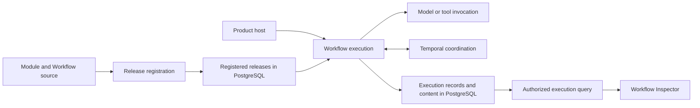
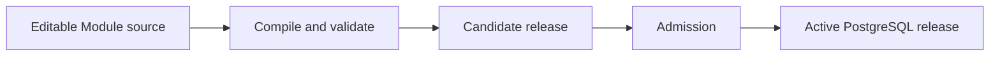
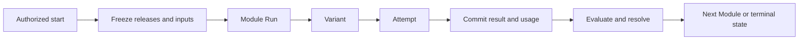

# Agent Runtime

Agent Runtime is an independently publishable infrastructure product for
registering AI Modules, executing durable Workflows, recording every execution,
and reviewing those executions from their authoritative PostgreSQL records.

Business roles such as Writer, Router, Verifier, Reviewer, or Expert come from
domain plugins. Runtime does not define their business meaning. It guarantees
that the exact registered version is executed, every invocation is recorded,
failed work can be recovered, and an authorized reviewer can inspect what
happened.

## Product flow



PostgreSQL is the system of record for Runtime releases, execution records, and
recorded execution content. Temporal coordinates durable progress; it is not
the execution ledger. Claude, Codex, and future providers execute one admitted
Module invocation; they do not own Workflow state.

## Product modules

| Module | Responsibility | Does not own |
| --- | --- | --- |
| Registry | Compile, validate, register, and activate immutable Module and Workflow releases | Workflow execution or business meaning |
| Execution | Start Workflow executions; create Module Runs, Variants, and Attempts; own portable execution-record interfaces and Cell-local staging; evaluate, resolve, and recover work | Product Entitlements, provider implementation, or production PostgreSQL storage |
| Provider | Assemble the admitted model context and invoke the selected provider profile | Workflow routing, release selection, or canonical records |
| Durability | Coordinate waits, retries, external events, and recovery through Temporal | Prompt, output, usage, or product data storage |
| PostgreSQL | Implement production PostgreSQL persistence for Runtime releases, execution records, and recorded content | Portable execution contracts, domain data policy, or Workflow decisions |
| Review | Query authorized Runtime records and render the live read-only Workflow Inspector | Execution mutation, approval, retry, or publication |

Product Authorization and governed Data Access remain external authorities.
Runtime carries the admitted authorization context and calls those authorities
when an execution requires a current decision or authorized product data.

## Naming

Runtime-owned code uses one three-part semantic name:

```text
module_subject_nominalized_action
```

Examples:

```text
registry_release_registration.py
execution_module_invocation.py
execution_record_persistence.py
provider_prompt_assembly.py
durability_temporal_coordination.py
postgres_release_persistence.py
review_release_rendering.py
```

The first term identifies the responsible module, the second identifies the
subject, and the third states the action as a noun. Generic filenames such as
`service.py`, `store.py`, `utils.py`, `manager.py`, `api.py`, or `adapter.py`
are not valid Runtime source names.

Python classes may use the `PascalCase` projection of the same semantic name.
Serialized identifiers, functions, variables, schemas, tables, and fields stay
in `snake_case`.

## Source and Design Contract map

The target source distribution is organized by product responsibility, not by
generic Clean Architecture vocabulary.

```text
agent_runtime/
  README.md
  design_contract/
  contracts/
  registry/
  execution/
  provider/
  durability/
  postgres/
  review/
  testing/
```

| Default code family | Primary Design Contract |
| --- | --- |
| `registry_*_*` | `agent_runtime_01_module_contract_and_assembly.md` |
| `execution_*_*` | `agent_runtime_00_execution_charter.md` and `agent_runtime_06_standalone_package_and_lifecycle_contract.md` |
| `execution_authorization_*` and `execution_data_*` | `agent_runtime_09_authorization_integration_contract.md` |
| `provider_*_*` | `agent_runtime_08_agent_execution_adapter_contract.md` |
| `durability_*_*` | `agent_runtime_07_temporal_durable_adapter_contract.md` |
| `postgres_*_*` | the contract for the Runtime fact being persisted |
| `review_*_*` | `agent_runtime_06_standalone_package_and_lifecycle_contract.md` |

Per-file exceptions are code-owned and appear in the generated architecture
report. In particular, `registry_architecture_registration` is owned by
`agent_runtime_06`, `registry_migration_validation` by `agent_runtime_05`, and
the portable topology plus retired-backend evaluations by `agent_runtime_02`.

The code-owned `registry_architecture_registration` assigns every target source
file to one logical product module, one physical source directory, and one
canonical Design Contract. Repository tests scan every Runtime Python file and
reject unregistered or misplaced files, missing contracts, generic filenames,
duplicate dispositions, and stale migration-debt paths.

The current wheel still contains five explicitly enumerated predecessor
semantic surfaces while migration is in progress. They are listed in
`RUNTIME_MIGRATION_DEBT_PATHS`; the generated architecture report, not this
illustrative tree, is the exhaustive current source map.

Package initializers temporarily re-export some predecessor types for existing
downstream callers. Those re-exports are compatibility-only, must not be used
by a new integration, and retire with the corresponding debt path; a
structural `__init__.py` does not turn the imported predecessor into target
implementation.

## Release registration

A domain plugin keeps each Module's editable source together: its instruction,
input schema, output schema, execution profiles, and registration metadata.
Registration compiles those files into one immutable candidate release.
Admission and activation are explicit later decisions.



Production execution reads the admitted PostgreSQL release. It never rebuilds
a Prompt, Schema, Skill, Module, or Workflow by reopening Git.

## Workflow execution

The Product host requests an already authorized Workflow start. Runtime freezes
the exact Workflow release, Module releases, authorized input closure, and
execution profiles before the first invocation. Later release activation cannot
change an execution already in progress.

For each Module occurrence, Runtime:

1. creates one Module Run;
2. creates one Variant for each selected model or configuration;
3. records every invocation or retry as a separate Attempt;
4. commits output, usage, failure, and evaluation records; and
5. resolves the accepted output before advancing the Workflow.



## Workflow Inspector

The installed Runtime exposes a read-only web interface backed by its formal
PostgreSQL records. The page itself contains no embedded execution snapshot.

An authorized user can:

- list every Workflow Execution allowed by the current Product grant;
- open the frozen Workflow graph;
- select every occurrence of a Module in a loop;
- inspect every Variant, Attempt, retry, failure, Prompt, output, usage,
  Evaluation, and Resolution; and
- refresh a running execution without creating or mutating Runtime records.

Prompt, input, output, and failure bodies are returned only after an exact
content-read authorization decision. The Product host may embed or proxy the
Inspector, but it does not define another execution schema.

An offline snapshot may be added later as an explicit export operation. It is
not the primary review interface and is not created automatically.

## Published release

Every published Runtime release contains:

- this README;
- a generated, hash-bound bundle of Runtime-owned Design Contracts;
- the public Python API and JSON schemas;
- PostgreSQL schema migrations;
- the live Workflow Inspector assets; and
- architecture, clean-wheel, execution, recovery, provider, and review tests.

The README is the human entry point. Design Contracts define intent and stable
invariants. Code, PostgreSQL records, and generated architecture reports define
current executable truth.

## Current maturity

The repository currently contains working release-registration, provider A/B,
Temporal recovery, PostgreSQL trace projection, and execution-inspection
slices. It does not yet contain the final PostgreSQL execution ledger or the
final live Inspector described above. The shadow `ModuleExecutor` test seam
must also converge into the canonical `AuthorizedAgentExecutionAdapter` DTOs
and normalized failure taxonomy before production admission. Those are release
gates, not implied capabilities.
