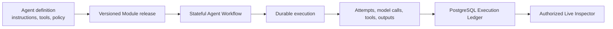

# Superlinear Academy Project: Agent Runtime

## One-sentence description

I built Agent Runtime, a domain-neutral Python infrastructure package for
registering versioned AI agents, composing them into durable stateful
workflows, recovering their execution after failure, recording an authoritative
history of every run, and letting authorized reviewers inspect what happened.

## Why I built it

Most agent demos answer the creative question: “How should an LLM call tools or
delegate to another agent?” I wanted to answer the operational questions that
appear when that demo becomes a long-running system:

- Which exact version of the agent, prompt, tool policy, model profile, and
  workflow graph produced this result?
- If a worker crashes after calling a model but before advancing the workflow,
  can the system recover without repeating or losing the committed work?
- Can retries, failures, model calls, tool calls, usage, evaluations, and output
  selection be reconstructed from immutable records?
- Can a reviewer inspect a live run without receiving data they are not
  currently authorized to read?
- Can the infrastructure be reused for research, support, coding, operations,
  or another domain without hard-coding roles such as Writer or Reviewer?

Agent Runtime is my answer: separate the definition of an agent from the
operational authority that registers, runs, recovers, records, and exposes it.

## How the Agent model works

In this project, an Agent capability becomes an immutable **Module release**.
A stateful graph of Modules becomes a **Workflow release**. Each occurrence of
a Module creates a **Module Run**; model/configuration choices are **Variants**;
and every provider invocation or retry is a separate **Attempt**.

Domain plugins decide what an agent means. Runtime guarantees that the exact
registered version executes and that its operational history remains durable
and reviewable.

## Comparison with current Agent frameworks

The closest comparison is
[LangGraph](https://docs.langchain.com/oss/python/langgraph/overview). Its
official documentation describes it as a low-level orchestration runtime for
long-running, stateful agents, with durable execution, streaming, persistence,
memory, and human-in-the-loop support. That is the same general layer of the
stack I am exploring.

The difference is emphasis. Agent Runtime makes immutable release registration,
version pinning, the append-only execution ledger, transactional recovery
records, provider-neutral adapters, and query-time authorization of inspection
data explicit product contracts. It is deliberately stricter and more
infrastructure-oriented than a graph-construction API.

| Framework | What it optimizes for | What I explored differently |
| --- | --- | --- |
| [LangGraph](https://docs.langchain.com/oss/python/langgraph/overview) | Low-level stateful graphs, durable execution, persistence, streaming, and human oversight | Immutable Module/Workflow releases, exact execution closure, authoritative PostgreSQL facts, and authorized review |
| [OpenAI Agents SDK](https://openai.github.io/openai-agents-python/) | A small set of accessible primitives for agent loops, tools, handoffs, guardrails, sessions, and tracing | Provider-neutral execution records, explicit durable-backend coordination, and host-owned authorization boundaries |
| [AutoGen](https://microsoft.github.io/autogen/stable/user-guide/core-user-guide/core-concepts/architecture.html) | Message-driven agent communication and lifecycle management in standalone or distributed runtimes | Version-pinned workflow state, atomic crash recovery, and formal ledger/inspection schemas |
| [CrewAI](https://docs.crewai.com/) | High-level role-based agent teams (“Crews”) and structured event-driven “Flows” | A domain-neutral runtime that intentionally does not prescribe roles, goals, backstories, or a collaboration metaphor |

I do not view these projects as simple competitors. A host could adapt an agent
built with another framework behind a Runtime Module, then use Agent Runtime as
the release, durability, ledger, and review layer. The project asks whether
those operational guarantees can be made portable and explicit instead of
being implicit in application code or split across several services.

## Advantages and tradeoffs

Agent Runtime's main advantages are:

- reproducibility through immutable, hash-bound releases and pinned execution
  versions;
- recovery through idempotent transactions, durable attempt claims,
  checkpoints, and backend acknowledgements;
- auditability through an authoritative append-only PostgreSQL ledger rather
  than best-effort logs;
- provider and durability portability through Runtime-owned interfaces;
- domain extensibility through plugins rather than built-in business roles;
- least-authority review through read-only database queries and separate trace
  and content authorization checks.

The tradeoffs are also deliberate. This is a lower-level package with more
contracts and schema discipline than frameworks optimized for a five-minute
agent prototype. It does not supply a library of ready-made roles, tools,
memory strategies, UI builders, or managed deployment. A host must integrate
authentication, product authorization, governed data access, deployment, and
domain meaning.

## What the prototype can do now

The `0.1.0.dev0` implementation now includes:

- immutable Module and Workflow release registration in PostgreSQL;
- provider-neutral invocation contracts plus Claude Agent SDK and Codex CLI
  bindings;
- Temporal-backed durable workflow coordination and recovery tests;
- an append-only PostgreSQL Execution Ledger containing atomic batches,
  individual records, immutable referenced content, query indexes, and
  database triggers that reject updates and deletes;
- restart-safe active Attempt claim reconstruction and idempotent finalize,
  outcome, checkpoint, and acknowledgement operations;
- dedicated PostgreSQL query stores whose transactions are explicitly
  read-only;
- a live HTTP Inspector that contains no embedded execution data, has no write
  routes, polls authorized records, renders the Agent graph and every committed
  execution category, and performs a separate authorization decision before
  returning a content body; and
- architecture, packaging, lifecycle, authorization, recovery, and real
  PostgreSQL integration tests.

The project remains `0.1.0.dev0`, but no longer because the PostgreSQL Execution
Ledger or Live Inspector is missing. It remains a development release because
production admission still requires a real host's authentication and
authorization assembly, deployment validation, downstream consumer migration,
and removal of the documented compatibility seam around the older executor
DTOs.

## Short submission version

I built Agent Runtime, a reusable infrastructure layer for stateful AI agents.
It occupies a layer similar to LangGraph's orchestration runtime, but focuses on
the operational guarantees needed after an agent prototype becomes a durable
system: immutable versioned Agent Modules and Workflows, exact execution
pinning, crash-safe recovery, an authoritative PostgreSQL Execution Ledger,
provider-neutral invocation, and authorized live inspection.

Unlike high-level frameworks such as CrewAI, Runtime does not define roles such
as Researcher or Writer. Domain plugins provide prompts, tools, policies, and
business meaning. Unlike a tracing-only design, every Attempt, model/tool call,
output, failure, usage event, evaluation, selection, checkpoint, and backend
acknowledgement is a formal immutable execution fact. The Live Inspector reads
those facts through explicit read-only PostgreSQL transactions and performs a
separate authorization check before returning content.

The project helped me explore a question beyond agent prompting: how can an AI
agent be operated as reproducible, recoverable, inspectable infrastructure? The
current `0.1.0.dev0` prototype implements and tests the release registry,
execution ledger, Temporal recovery, provider bindings, and Live Inspector. It
still requires host-specific authentication, authorization, governed-data, and
deployment integration before production admission.
