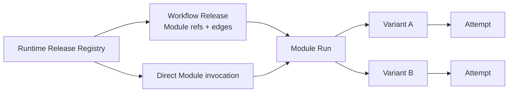
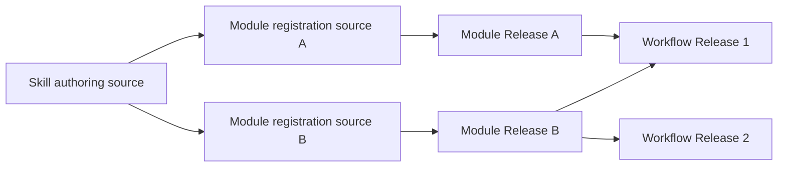
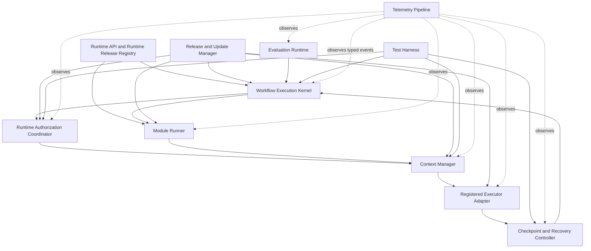
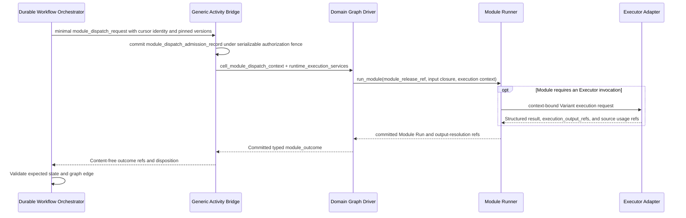
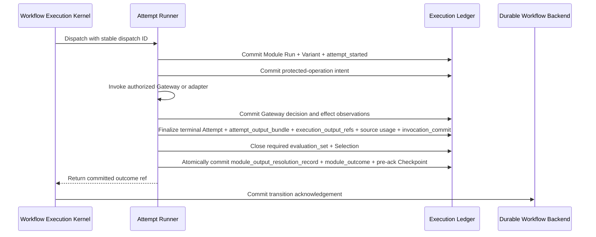

# Agent Runtime Execution Charter

**Purpose**: Define domain-neutral execution behavior for workflows assembled
from registered Runtime Modules and for independently invoked Modules,
including identity, graph advancement, authorization binding, context,
telemetry, recovery, evaluation, testing, and Module evolution.

**Required reader gain**: A reader can determine whether one Workflow Execution conforms to the Runtime contract, distinguish the responsibilities of the Domain Graph Driver, Module Runner, Durable Workflow Orchestrator, Product Authorization, and Protected Operation Service, and classify a failure as retry, external wait, suspension, fail-closed rejection, cancellation, or domain completion.

## 0. Contract Capsule

```yaml
layer: T1
status: proposal
canonical_owner: designDoc/agent_runtime_00_execution_charter.md
parent: designDoc/the_agent_runtime.md
scope:
  - workflow execution identity and lifecycle
  - external authorization-decision/result binding, start/dispatch fences, and authorization-invalidation closure
  - context lifecycle and provider-neutral reconstruction
  - automatic trace, usage, and audit emission
  - checkpoint, retry, recovery, cancellation, and terminal-state law
  - Workflow Release, Runtime Module Release, Module Run, Variant, and Attempt execution model
  - independently executable Module test, evaluation, replay, and A/B entry
  - evaluation runtime, test harness, and Module update lifecycle
non_goals:
  - product deployment topology and Cell isolation, owned by the host platform
  - exact Release Registry, graph-binding, Variant, Attempt, Evaluation, and As-Built schemas, owned by agent_runtime_01
  - domain roles, artifacts, graph meaning, content quality, or terminal decisions
  - provider SDK, API, CLI, prompt, or model-profile implementation
inputs:
  - designDoc/the_charter.md
  - designDoc/the_agent_runtime.md
  - external:agency_platform
  - external:timestamp_semantics
  - external:product_authorization
adjacent_engineering_contracts:
  - designDoc/agent_runtime_01_module_contract_and_assembly.md
  - designDoc/agent_runtime_03_authorized_external_event_ingress.md
  - designDoc/agent_runtime_06_standalone_package_and_lifecycle_contract.md
  - designDoc/agent_runtime_07_temporal_durable_adapter_contract.md
  - designDoc/agent_runtime_08_agent_execution_adapter_contract.md
  - designDoc/agent_runtime_09_authorization_integration_contract.md
outputs:
  - shared execution lifecycle
  - Workflow Execution Kernel contract
  - authorization-binding/fence/invalidation, context, telemetry, and recovery contracts
  - evaluation, testing, and Module-update contracts
truth_surfaces:
  - src/agent_runtime/contracts/execution_module_definition.py
  - src/agent_runtime/contracts/registry_release_definition.py
  - src/agent_runtime/registry/registry_release_registration.py
  - src/agent_runtime/execution/execution_module_invocation.py
  - src/agent_runtime/testing/registry_migration_validation.py
runtime_triggers: none
downstream_consumers:
  - domain Workflow Releases
  - durable backends and Agent Execution Adapters
  - Product Control and authorized external-event ingress
  - protected-operation services
open_decisions:
  - cancellation and offboarding behavior for production Cells
review_gate: document self-review before handoff; engineering-project-review after implementation commit
runtime_surface_ledger:
  - "target design: Workflow Release -> Runtime Module Release -> Module Run -> Variant -> Attempt"
  - "implementation status comes only from generated Runtime inspection and deterministic cutover checks"
verification_hooks:
  - ./.venv/bin/python -m pytest tests/test_agent_runtime_conformance.py tests/test_runtime_architecture_validation.py -q
```

## 1. Runtime Scope

Agent Runtime manages two admitted execution entries:

1. a complete Workflow Release assembled from exact Runtime Module Releases;
2. one Runtime Module Release invoked independently for testing, Evaluation, A/B,
   replay, repair, or an explicitly allowed standalone product action.

The same infrastructure can host Research, Digestion, Technical, or other
domain plugins while every plugin retains its own business objects, graph
meaning, and quality contract.

The canonical object model is:



There is no separate Step or Component authority. A graph node is one binding
to an exact Runtime Module Release. When the same Module appears more than
once, a workflow-local `node_id` distinguishes graph positions; `node_id` is
not registered and does not become another executable object.

A workflow becomes executable only through an admitted immutable
`workflow_release`. Its graph contains Module release refs, local node IDs when
required, legal edges, input mappings, branch conditions, loops, waits, and
terminal conditions. A Module becomes executable only through an admitted
immutable `runtime_module_release`. The releases share one
`runtime_release_registry`; no stable registration DTO or second graph registry
exists beside that registry. Registry presence alone does not grant product
entry, permission, or release admission.

A Module declares one production entry policy:

- `workflow_bound`: production invocation must originate from an admitted
  Workflow Graph; isolated test and Evaluation runs remain allowed;
- `standalone_allowed`: an authorized caller may start the Module directly.

Both paths call the same `run_module()` execution service and produce the same
Module Run, Variant, Attempt, output, authorization, Context, usage, and audit
lineage. A one-Module Workflow is valid when it owns an independent product
trigger, execution lifecycle, and terminal output. A Module embedded in a
larger graph does not become a nested Workflow merely because it can be tested
independently.

When execution originates from a managed product workflow, the Agency Platform
host resolves one Artifact Graph `project_workflow_registration`, one owning T1
`workflow_behavior_release`, and one active `workflow_execution_binding` before
Runtime admission. After Product Authorization allows the exact target, the
host supplies one `runtime_execution_binding`. Runtime consumes those opaque refs
and hashes plus the referenced Workflow and Module Releases. It never chooses
the logical owner from a Skill name. The exact Workflow Release, Module
Releases, execution release, and authorization binding are pinned when
the Workflow Execution starts.

A product-facing Skill is an authoring surface. It may declare zero, one, or
many Runtime Module registration sources. Writer, Verifier, Debater, Reviewer,
Router, and Expert Modules may share one Skill while each source compiles into
an independent Module Release with its own input/output, authorization, Prompt,
Evaluation, release, and execution contracts. The Skill itself is not a
Runtime Release.



Skill Governance owns the provider-neutral Skill authoring source and its
Module declarations. Runtime owns each compiled Module's executable contract,
admission, exact Prompt and Schema hashes, Executor binding, authorization
requirements, Evaluation, and execution lineage. A Module may retain only the
exact owner-contract ref/hash as authoring provenance; Skill identity remains
outside the Runtime Release payload. A Workflow references
`module_release_ref`, never a Skill path or Skill candidate revision. A Primary
Agent development Skill may declare no product Module. A workflow-entry Skill
may project one `workflow_release_ref` without itself becoming a Module.

### 1.1 Runtime subsystem index

The rows below are peer Runtime subsystems. Each owns one engineering concern and exchanges typed records with the others.

| Runtime subsystem | Engineering concern | Primary records | Contract section |
| --- | --- | --- | --- |
| Workflow Execution Kernel | Durable creation receipt, Module dispatch, cursor, wait, transition, terminal status | `backend_start_receipt_record`, `module_dispatch_request`, `module_outcome`, `execution_snapshot` | §3 |
| Release Registry and Module Runner | Admit immutable releases and execute one Module binding or standalone Module request | `runtime_release_registry`, `runtime_module_release`, `module_run`, `variant`, `attempt` | §3 |
| Execution Authorization Controller | Bind one external execution authorization context, validate it at durable boundaries, propagate protected-operation context, and fence invalidated work | `execution_authorization_context_binding`, `execution_authorization_status_observation`, `execution_control_fence`, `protected_operation_observation` | §4 |
| Context Manager | Provider context create, resume, reconstruction, closure | `context_binding`, `context_event` | §5 |
| Telemetry Pipeline | Automatic trace, usage, tool, search, and security events | `runtime_event`, `usage_event`, `audit_event` | §6 |
| Checkpoint and Recovery Controller | Commit boundary, replay, crash recovery, cancellation | `checkpoint_record`, committed `module_outcome` | §7 |
| Evaluation Runtime | Evaluator execution, candidate-set closure, Selection, and Module output resolution | `evaluation_run`, `evaluation_result`, `evaluation_set`, `selection`, `module_output_resolution_record` | §8 |
| Test Harness | Contract, graph, adapter, isolation, failure, upgrade tests | `test_fixture`, `test_execution`, `test_result` | §9 |
| Release and Update Manager | Version pinning, compatibility, rollout, rollback | `runtime_module_release`, `execution_release`, `update_plan` | §10 |



The arrows show typed execution-record interaction, not authority rank or
deployment containment. Subsystem ownership remains in the peer table above.

Domain roles, content-quality gates, client personas, and user-interface implementations remain outside this diagram.

## 2. Execution Identity and Lifecycle

One Module invocation uses this stable identity chain:

```text
tenant_id
cell_id
initiating_principal_id
execution_principal_id
origin_kind: workflow_graph | standalone_module | evaluation | test
product_workflow_registration_id | null
product_workflow_registration_version | null
product_workflow_registration_sha256 | null
workflow_execution_binding_id | null
workflow_execution_binding_version | null
workflow_execution_binding_sha256 | null
workflow_execution_resolution_id | null
workflow_execution_resolution_sha256 | null
workflow_id | null
workflow_release_ref | null
workflow_release_sha256 | null
execution_release_ref
execution_release_sha256
workflow_execution_id | null
node_id | null
module_id
module_version
module_release_ref
module_release_sha256
module_run_id
authorization_decision_id
execution_authorization_context_id
execution_authorization_context_binding_id
variant_id
attempt_id
attempt_output_bundle_id
execution_output_id
```

Workflow fields form one closed discriminator group. They are present for
`origin_kind=workflow_graph` and absent for a root standalone, Evaluation, or
test Module Run. `node_id` is present only when graph position must be
distinguished from Module identity. Every origin pins the exact Module Release,
input closure, execution profile, and authorization closure before invocation.

The owning product or domain T1 owns `product_workflow_registration_*`; the
Workflow Execution Binding and Admission Contract owns
`workflow_execution_binding_*` and `workflow_execution_resolution_*`. Runtime
pins those authorities for a graph origin and creates none of their identities.
For a direct Module origin, Product Authorization evaluates the exact Module
action and Runtime creates a root `module_run` without inventing a Workflow.

`workflow_execution_id` spans the complete graph lifecycle when a Workflow is
the origin. `module_run_id` spans one independently executable Module work unit
under either origin. A backend workflow ID, task ID, queue ID, or provider
session ID is an infrastructure mapping and never replaces either identity.

```text
accept authorized workflow intake
validate the complete admission_authority_tuple
bind workflow_authorization_decision, execution_authorization_context, and `execution_input_package` input references
resolve current context status/window and commit execution_start_admission_record
construct start_execution_request with that exact start-admission ref/hash
create the durable backend execution idempotently
commit backend_start_receipt_record or reconcile the same idempotent start
load the execution-pinned graph projection and release
for each current graph node, resolve its exact Module Release
commit one exact module_dispatch_admission_record
run the admitted Module through run_module()
persist content-free cursor and wait state
accept an authorized external_event while waiting
continue until domain terminal state or Runtime cancellation
```

A nonterminal external event continues the same execution and immutable
authorization binding. `execution_input_package` means the immutable intake refs and hash
carried by `start_execution_request`; new scope, a new `execution_input_package`, or
an invalidated authorization binding creates a new execution. A domain may create a
`domain_package_artifact` later in that execution; `logical_name` is its only
Runtime-visible domain package label. Replacing that `domain_package_artifact`
changes the next `module_input_closure` and creates a new Module Run; it does not
by itself replace the `execution_input_package` or Workflow Execution.

Each execution carries two orthogonal state axes:

- `domain_state` advances only along the pinned domain graph.
- `runtime_status` expresses `starting`, `running`, `waiting`, `suspended`, `completed`, `failed`, `cancelled`, or terminal `authorization_invalidated`.

Worker failure, timeout, operator cancellation, authorization invalidation, or a missing pinned release changes `runtime_status` while preserving the last committed `domain_state`.

## 3. Workflow Execution Contract

This section defines execution mechanics. Authorization policy, content quality, human interaction, persistence semantics, and publication decisions remain with their owning contracts.

### 3.1 Runtime subsystem responsibilities

| Runtime subsystem | Responsibility | Explicit non-responsibility |
| --- | --- | --- |
| Durable Workflow Orchestrator | Persist graph cursor, timer, retry, external wait, acknowledged event, and Runtime status | Module behavior, authorization policy, content evaluation, formal write |
| Generic Activity Bridge | Translate a content-free Module dispatch into a Cell-local Module Run request and return typed references | Domain edge meaning, model policy, artifact interpretation |
| Domain Graph Driver | Resolve the current graph node, input mapping, and legal successor from the pinned domain graph | Infrastructure recovery, tenant authorization, provider-session durability |
| Module Runner | Validate one admitted Module Release and frozen input closure; create Variant and Attempt lineage; return a typed `module_outcome` | Workflow edge selection, product permission, provider implementation |
| Executor Adapter | Invoke the Executor selected by one Variant: Agent, deterministic code, human-task service, or external service | Workflow cursor, legal-successor choice, candidate Selection |

The Generic Activity Bridge resolves a durable `module_dispatch_request` into a
Cell-local `cell_module_dispatch_context` using the pinned Cell binding and
`execution_authorization_context_binding`. Before Domain Graph Driver entry, it
validates the current execution context and control fence. It gives the Domain Graph Driver only
`runtime_execution_services`: the pinned record store, authorized artifact
resolver, execution-profile resolver, Module Run factory, `run_module()`
service, and idempotent Outcome commit. A driver cannot construct or call an
Executor Adapter directly. For each protected operation, the Module Runner
commits the declared intent and calls the enforcing Gateway with the execution
authorization context. The Gateway obtains or validates the current Product
Authorization decision. A deny invokes no protected resource. A high-risk action
additionally carries the exact Product-issued `operation_grant` required by its
resource manifest. Runtime then records the returned decision and effect
references with the terminal Attempt, `attempt_output_bundle`, member
`execution_output_ref` records, model/tool calls, source usage observations, and
terminal status.

### 3.2 Module dispatch interaction



### 3.3 Execution invariants

The exact execution-pinned `workflow_release` defines legal Module bindings and
edges. The Domain Graph Driver interprets domain outcomes.
The Durable Workflow Orchestrator validates identity, pinned versions,
idempotency, and structural edge legality. No Runtime subsystem infers
semantics from a state name, Module name, Agent role, finding prose, or
artifact content.

Domain content revision is represented as an ordinary typed transition plus a
domain-owned feedback artifact. Runtime never inserts a verifier, reviewer, or
other Module into a graph on its own.

## 4. Runtime Authorization Integration

Product Authorization owns Product Principal and Entitlement lifecycle, policy
evaluation, decisions, execution authorization contexts, revocation, and
high-risk grant issuance. Agent Runtime owns only the execution-local binding,
ordering, propagation, status observation, and fencing mechanics defined by
`agent_runtime_09`.

Before first graph dispatch or standalone Module execution, Runtime validates
and commits one immutable `execution_authorization_context_binding`. It binds
the exact Workflow Execution and releases, initiating Product Principal,
authenticated Runtime workload actor, tenant, Cell, input package, Product
decision and context, policy and catalog versions, validity, and revocation
status reference. The binding contains no Entitlement body, policy expression,
credential, database role, or mutable permission list.

Runtime revalidates the context before durable start, process re-entry, Module
dispatch after a wait, and PM-requested revision. These checks are execution
fences, not new Product authority. An Entitlement expansion never widens the
existing binding.

For a dynamic data, search, model, tool, publication, or side-effect operation,
Runtime records one typed intent from trusted execution state and the Runtime
Module Release declaration, then calls the enforcing Gateway. The Gateway
resolves the actual resource and request context, obtains or validates a current
Product Authorization decision, applies Data Governance and resource-local
preconditions, and performs the operation through its own credential. Runtime
records only the returned decision and effect references.

An action classified as publication, external send, sensitive export, trade, or
asynchronous cross-service mutation additionally requires a short-lived,
audience-bound `operation_grant`. Ordinary authorized operations do not require a
single-use grant. Domain approval, Evaluation, or Selection substitutes for
neither a Product decision nor a required high-risk grant.

Runtime rejects caller-supplied tenant or Principal expansion, cross-Cell reuse,
mismatched or expired contexts, replayed high-risk grants, and operations absent
from the registered declaration. Context invalidation fences new dispatch and
event application, sets the old execution to terminal
`runtime_status=authorization_invalidated`, preserves its last committed
`domain_state`, quarantines returned-but-uncommitted output, closes live provider
contexts, and reconciles already issued effects. The old execution cannot
resume; continuation under changed authority requires a newly authorized
Workflow Execution.

## 5. Context Management

Context belongs to one Module Variant lineage.

`context_binding` pins the Agent execution adapter, model profile, adapter
revision, context type, resume mode, read isolation, tool policy,
`prompt_bundle` hash, `module_input_closure` hash, authorization-binding hash, and contract version. Native
resume requires compatibility across every pinned field.

When native resume is unavailable or incompatible, Context Manager creates a
new Variant context from exact authorized input refs, including admitted
Artifact Graph `artifact_instance` refs when applicable, the resolved prior
`execution_output_ref`, continuity state, and the current typed task or
`revision_packet`. It never copies an opaque provider workspace across Variants,
models, SDKs, CLIs, tenants, or Cells.

Context Manager appends `context_event` records for create, resume, reconstruct, compact, close, and invalidation. A domain revision may continue a compatible lineage. A model or adapter change creates a sibling or successor Variant. Domain completion, Runtime cancellation, or authorization invalidation closes every live provider context.

## 6. Automatic Logging and Usage

Runtime code records execution logs and provider/resource source usage
observations. An Agent never authors its own execution, token, search,
authorization, or usage observation. Runtime records no rate, charge, invoice,
or other authoritative billing object; Rating and Billing remain separate
owners.

Every Runtime event binds its declared execution scope, Cell, Module Release,
event type, its own ledger-assigned `recorded_at_utc`, applicable input and output
references and hashes, and terminal classification. Attempt-scoped events bind
Workflow Execution when present, Module Run, Variant, and Attempt; workflow- or Module-scoped events
must not fabricate narrower identities. Model usage records normalized total
input, output, cache-read, and cache-creation tokens. `input_tokens` includes
cached input; cache-read and cache-creation are subset breakdowns and must not
be added to it again. Adapters normalize provider differences before committing
the record. A value the provider does not expose remains `null`; the Telemetry
Pipeline aggregates the corresponding unknown-field count. Null preservation
and aggregate admission are enforced by the telemetry schema and release tests.

Tool calls, external search, semantic search, authorization decisions, context events, checkpoints, evaluations, and update events use separate typed event families. Durable-backend history and shared infrastructure logs contain identities, references, hashes, bounded classifications, and timings. Customer content and secrets remain in authorized Cell-local stores.

Every `model_call_record`, `tool_call_record`, and corresponding `usage_event`
binds the execution authorization context plus the Gateway decision or
pre-materialized-input reference used for that operation. A high-risk operation
also binds the Product-issued `operation_grant` disposition. The execution ledger
rejects an Attempt commit when the required authorization observation is
missing, belongs to another lineage, or lacks a required grant. A direct
provider or tool call therefore has no committable conformant path.

## 7. Checkpoint and Recovery

One dispatch uses this authoritative commit order:



This ordering is the production-provider admission invariant. A provider
adapter cannot be admitted for production unless the implementation durably
commits Attempt start and the protected-operation intent before the real SDK,
API, CLI, or Gateway invocation, then records the returned authorization and
effect references. A grant is pre-bound only for a registered high-risk action.

Crash recovery distinguishes three commit windows:

1. Before `invocation_commit_record`, the active Attempt is orphaned or
   terminalized according to policy; a retry may create a new business Attempt.
2. After `invocation_commit_record` and before `module_outcome` commit, the same
   dispatch reconstructs the committed invocation result and continues
   evaluation and output resolution. It creates no new Attempt and repeats no
   provider call or protected operation.
3. After `module_outcome` and its pre-ack checkpoint commit but before backend
   acknowledgement, replay returns the existing Outcome for the exact dispatch
   ID and appends only the missing acknowledgement.

A committed `retryable_failure` preserves the domain transition sequence and
creates the next Runtime `retry_sequence`; that new dispatch may append a new
Attempt under the compatible Module Run and Variant.

`checkpoint_record` binds dispatch ID, execution release, graph hash,
authorization-binding hash, current domain state, Runtime status, committed
Outcome ref, and backend acknowledgement state. Recovery requires the
execution-pinned release. Missing pinned code suspends the execution.

Cancellation or authorization invalidation changes `runtime_status` and preserves the last committed `domain_state`. Runtime failure, suspension, cancellation, and authorization invalidation never fabricate a domain transition.

## 8. Evaluation Runtime

The domain registers evaluator identity, rubric schema, required evaluator set,
required inputs, veto semantics, and one Module-output selection policy. Runtime
owns scheduling, isolation, lineage, storage, candidate-set closure, comparison,
immutable Selection, and mechanical downstream enforcement.

Each `evaluation_run` binds one evaluator release and one exact candidate Variant,
terminal Attempt, output-bundle hash, rubric hash, immutable evaluation input
refs/hash, and result identity. A deterministic evaluator may execute through an admitted
deterministic evaluator adapter. A model-backed evaluator executes as an
admitted Runtime Module Release through the ordinary Module Run/Variant/Attempt invocation
and authorization path. Its `evaluation_result` references the evaluator's
producing Workflow Execution when present, Module Run, Variant, Attempt, resolved
`execution_output_ref`, execution
release, and operation-grant lineage. Evaluators run in contexts isolated from
the candidate Agent and sibling evaluators; an evaluator result with no admitted
producing Attempt cannot satisfy a formal gate.

For every Module Run requiring evaluation, Runtime commits an immutable
`evaluation_set` that binds the complete candidate set, required evaluator set,
rubric set, candidate-by-evaluator `evaluation_result` refs/hashes, veto state,
and a coverage hash. Closure succeeds only when every eligible candidate has
all required results over its exact terminal Attempt and output bundle. A
multi-Variant `selection` references this closed evaluation_set and the exact
selected candidate; a single evaluation ref is insufficient.

Every Runtime Module Release can be evaluated independently and declares
`selection_policy: direct_single | evaluated_single | selected` in its
immutable release. Each policy produces one immutable `module_output_resolution_record`
that is the only downstream-consumption authority:

- `direct_single` resolves the sole eligible Variant, terminal Attempt, and
  canonical output bundle without an evaluation_set or Selection;
- `evaluated_single` resolves the sole eligible candidate only after its closed
  evaluation_set passes without veto;
- `selected` requires a closed evaluation_set and one immutable Selection; every
  Module Run with multiple eligible Variants must use this policy.

Runtime rejects downstream consumption of a raw Attempt, unresolved
`execution_output_ref`,
evaluation_result, or Selection that is not named by the Module Run's exact
`module_output_resolution_record`.

`attempt_output_bundle` and its member `execution_output_ref` records are the sole
canonical Runtime output types. Neither denotes an Artifact Graph
`artifact_instance` or grants product delivery, readiness, domain acceptance,
or canonical-admission authority.

After Resolution, Runtime returns the exact resolved `execution_output_ref` and
its bundle and Resolution lineage. Artifact Service may then register that
output as a candidate, after which the owning domain independently decides
admission. Only that external candidate-registration and domain-admission chain
can create or advance an Artifact Graph `artifact_instance`.

## 9. Test Harness

Testing proves deterministic engineering behavior. Evaluation measures candidate behavior against a registered domain rubric.

| Suite | Verifies |
| --- | --- |
| Module contract | Admitted release, input/output schema, declared permissions, standalone-entry policy, Attempt, and Outcome lineage |
| Graph simulation | Legal edge, wait, loop, terminal state, dispatch guardrail |
| Adapter conformance | SDK, CLI, model API, durable backend, and storage contracts |
| Authorization isolation | Tenant, Cell, Principal, actor workload, execution context, decision, high-risk grant, resource, expiry, invalidation, and replay negatives |
| Context portability | Native resume, incompatible rebuild, cross-model switch, context closure |
| Failure injection | Crash before invocation_commit, after invocation_commit before Outcome, after Outcome before acknowledgement, duplicate event, lost acknowledgement, partial side effect |
| Evaluation closure | Model evaluator producing-Attempt lineage, candidate/evaluator-set completeness, veto, Selection, and module_output_resolution_record policy enforcement |
| Observability | Trace linkage, token components, unknown semantics, secret absence |
| Upgrade compatibility | Pinned recovery, drain/cancel, forked replacement execution, rollback, revoked-release behavior |

Shared fixtures use opaque state IDs and synthetic artifacts. Domain fixtures appear only in domain-owned tests.

`execution_context_resolution` is the provider-neutral boundary for resolving
registered task-context slots. The host supplies an authorized content
resolver and category/key/release selectors; Runtime validates the returned
immutable releases, applies the registered JSON Schema, freezes provenance,
and exposes only the semantic content tree to the model. Runtime does not
interpret domain categories and does not grant content access.

`agent_runtime.testing.execution_module_evaluation` is the portable isolated
Module Test/Evaluation entry. Runtime owns input staging, Prompt assembly,
adapter dispatch, execution ledgering, and result projection. The host must
supply the exact Product authorization authority; the helper cannot issue an
Entitlement, manufacture an execution context, or bypass a closed execution
fence. Domain packages supply only their registered releases, semantic input,
adapters, authorization composition, and evaluation assertions.
When a test freezes time, the same injected clock must drive both authority
issuance/revalidation and Runtime invocation; mixing a frozen authority clock
with the process clock correctly closes the execution fence.

## 10. Release and Module Update Management

Every executable Module is versioned independently. Workflow graph, Domain
Graph Driver, Behavior Policy, Evaluation Policy, Retry Policy, Executor
Adapter, `prompt_bundle`, model profile, tool policy, artifact schema, durable
adapter, and worker are separately pinned release dependencies rather than
unnamed parts of a second executable layer.

`execution_release` pins the compatible set used by one Workflow Execution.
`execution_release`, `runtime_module_release`, and `update_plan` are immutable records
with their own `recorded_at_utc`. `runtime_module_release` records one immutable
Module version, contract version, artifact hash, dependency set, admission
state, and rollback target. `update_plan` records affected workflows,
compatibility result, required tests, rollout policy, and recovery policy.

A Module update follows this sequence because order changes safety:

1. Register a new immutable release while the active release remains unchanged.
2. Compute affected Release Registry bindings and execution-release combinations.
3. Run Module tests and every impacted contract, conformance, isolation, and recovery suite.
4. Run a shadow or sibling-Variant comparison when behavior can change.
5. Admit the release for new or canary executions.
6. Keep in-flight executions pinned, drain or cancel them, or create a new
   forked Workflow Execution with freshly authorized immutable pins. An
   executable or Module hash is never patched inside an in-flight execution.
7. Promote or roll back through release state.

`resume`, domain `revision`, A/B comparison, and Module update are separate operations with separate records.

## 11. Failure Classification

| Signal | Runtime behavior |
| --- | --- |
| Provider timeout, CLI interrupt, temporary network error | Preserve `domain_state`; record `retryable_failure`; apply the exact registered Module Retry Policy budget |
| Worker crashes before invocation_commit | Orphan or terminalize the Attempt according to policy; a retry may create a new Attempt |
| Worker crashes after invocation_commit and before Outcome commit | Reconstruct the committed invocation; perform no duplicate provider/tool call or protected operation |
| Worker crashes after local Outcome commit and before backend acknowledgement | Return the committed Outcome for the same dispatch ID; perform no duplicate call or side effect |
| Expected state, graph hash, or transition mismatch | Reject Outcome; preserve cursor and current domain state |
| Execution authorization context or Cell binding becomes invalid | Atomically enter the invalidation fence; set terminal `runtime_status=authorization_invalidated`; preserve domain state; quarantine uncommitted output; close contexts; reconcile committed effects and high-risk grants; prohibit resume; require a new execution for any continuation |
| Domain Graph Driver returns external wait | Set `runtime_status=waiting`; preserve domain state and wait-policy ref |
| Missing pinned release, operator suspension, or exhausted Runtime dispatch safety ceiling | Set `runtime_status=suspended`; preserve domain state; only the authorized operator or release-recovery path may resume the same dispatch ID |
| Authorized external_event is acknowledged | Apply exactly one pinned-graph transition and return the acknowledged snapshot |
| Runtime cancellation | Set `runtime_status=cancelled`; preserve the last domain state |
| Domain Graph Driver returns a legal terminal Outcome | Commit the terminal transition and set `runtime_status=completed` |

An admitted `external_event` is an ingress transport object. External Event
Ingress first commits an `external_event_ingress_record`; that record proves a
validated outbox intent was durably accepted, but not that backend delivery or
application occurred. A backend acknowledgement proves delivery. The
Cell-local Activity Bridge
then atomically commits the sole `external_event_application_record`, bound to the
ingress receipt, decision Artifact, authorization ref, execution graph,
expected state, and target state, before acknowledging the transition. The
application record, not an in-memory callback argument or ingress receipt, is
the continuation evidence consumed by the next domain state.

Runtime does not interpret content quality or finding prose. Domain contracts and the Domain Graph Driver own revision routes and domain terminal states.

## 12. Required Machine Contract

The machine contract has four surfaces joined through immutable refs and
hashes:

1. **Runtime Release Registry**: Schema Asset, Prompt Component, Prompt Bundle,
   Behavior Policy, Evaluation Policy, Retry Policy, Execution Variant Policy,
   Execution Profile, Runtime Module, Workflow, admission, and active-release
   records.
   `workflow_release` owns its graph; `runtime_module_release` owns its executable
   contract. No parallel stable registration table owns either identity.
2. **Module Execution Ledger**: Module Run, Variant, Attempt, outputs,
   Evaluation, Selection, Resolution, Context, authorization, usage, and
   recovery lineage.
3. **Skill Governance authority**: provider-neutral Skill authoring, review,
   lifecycle, and zero-to-many Module registration sources. Runtime compiles
   one selected source into an immutable Module Release and cannot rewrite the
   Skill candidate.
4. **Cell-local execution content**: dynamic input packages, Prompt Envelopes,
   provider inputs and outputs, and governed content. The shared Runtime ledger
   retains bounded refs, hashes, status, time, and usage.

For managed execution, the Runtime Release Registry is the logical system of
record for all ten admitted release families and their active pointers.
PostgreSQL is one persistence binding for that Registry. Code owns their
schemas, validators, compiler, seed
manifests, and deterministic inspection. Repository Skill and prompt files are
authoring or compatibility projections after managed cutover; Runtime does not
read a mutable working-tree file as production instruction authority.

The graph node shape is deliberately small:

```yaml
node_id: optional_workflow_local_identity
module_release_ref: runtime-module:source_fidelity_verifier@1
module_release_sha256: <sha256>
input_mapping_ref: runtime-input-map:source_fidelity_verifier@1
input_mapping_sha256: <sha256>
```

`node_id` exists only when the same Module Release is bound more than once or a
stable graph-position identity is required. Module purpose, schemas,
permissions, Executor, Skill, retry defaults, and Evaluation contract are not
copied into the node.

Every executable graph position resolves one exact `runtime_module_release`.
Every isolated invocation enters `run_module()`; every admitted Workflow
Module Activity enters `run_workflow_module()`. Both produce `module_run_record`,
`module_execution_variant_record`, Attempt, and output-resolution lineage. The
deterministic removed-surface scan must be empty across source, package exports,
registries, codecs, persistence schemas, workers, and generated inspection.

## 13. Adjacent Contracts

- `the_agent_runtime.md` is the T0 authority for standalone boundaries, public modules, plugin admission, execution identity, adapters, evaluation mechanics, and releases.
- `agent_runtime_01` owns Module and Workflow Releases, Module Run/Variant/Attempt/
`attempt_output_bundle`/`execution_output_ref`,
  evaluation_run/evaluation_result/evaluation_set, Selection,
  module_output_resolution_record, graph assembly, and generated inspection.
- `agent_runtime_02` owns deployment planes, Cell isolation, data placement, durable-backend selection, and backend conformance.
- `designDoc/product_authorization_00_service_and_persistence_contract.md` owns Product Principal, Group, Entitlement, assignment, policy, decision, execution-context, high-risk grant, and break-glass semantics.
- `agent_runtime_03` owns trusted-request conversion into an authorized, domain-valid external event.
- `agent_runtime_04` owns the isolated publication transaction after domain intent and operation authorization exist.
- `agent_runtime_06` owns the standalone namespace and append-only Attempt, protected-operation observation, invocation-commit, checkpoint, and backend-acknowledgement lifecycle.
- `agent_runtime_07` owns the Temporal durable adapter and acknowledged Update semantics.
- `agent_runtime_08` owns the provider-neutral Agent Execution Adapter protocol and provider admission.
- `agent_runtime_09` owns Product Authorization client integration, execution authorization context binding, protected-operation handoff, fencing, and authorization conformance.
- The owning product or domain T1 owns logical workflow behavior and lifecycle.
- `agent_runtime_10` owns host-side `workflow_execution_binding` validation,
  target resolution, compatibility mapping, cutover, and fail-closed admission.
- `the_agency_platform` owns the enterprise host/product composition around the independently publishable Runtime.
- Agent Runtime owns the mechanical ledger-to-Inspector projection, read-only
  Runtime query contract, live Inspector application, and portable review
  bundle. Agency Platform may host those surfaces and supply current Product
  authentication and authorization; it does not copy the Runtime ledger or
  maintain a second execution projection model.
- Each domain Design Doc owns business objects, role names, content-quality criteria, evaluator semantics, revision rules, and domain terminal states.
