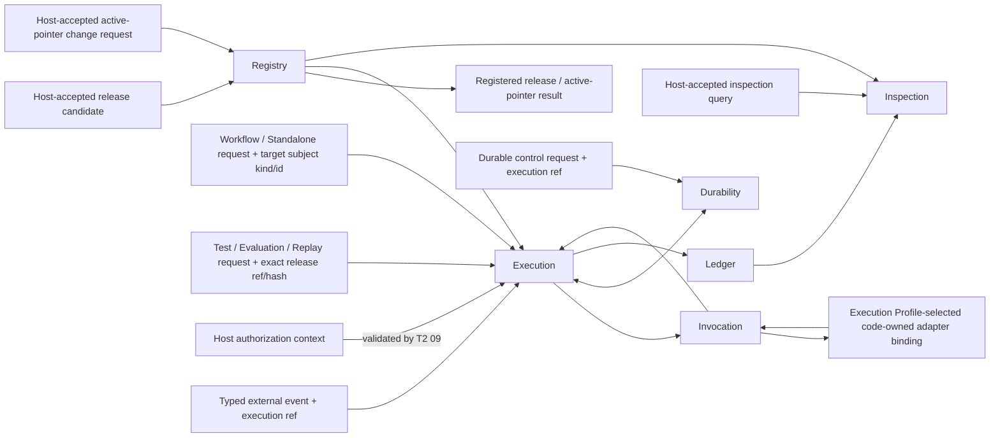
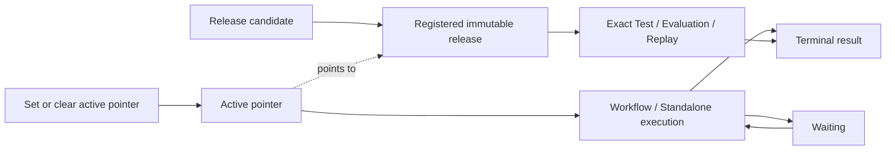

# Agent Runtime Domain Root

## 0. Intent Capsule

```yaml
layer: T1
status: candidate
canonical_owner: designDoc/agent_runtime_00_execution_charter.md
parent: designDoc/the_agent_runtime.md
owned_system_object: Agent Runtime domain
scope:
  - Registry, Execution, Invocation, Durability, Ledger, and Inspection architecture
  - immutable Module and Workflow release identity and active-pointer selection
  - Workflow Execution, Module Run, Variant, Attempt, Outcome, and Resolution lifecycle
  - provider-neutral execution and host integration boundary
  - Runtime-owned release and execution evidence
non_goals:
  - business workflow meaning, domain role semantics, prompt content, or quality rubric
  - Product Authorization policy or Entitlement issuance
  - domain database schema, SQL, writer rule, or canonical business write
  - Agency Platform product composition and control plane
  - provider, database, or durable-backend product selection
inputs:
  - host-accepted Runtime public request from the classes defined in section 8
  - external authorization and data-access decisions carried as opaque context
outputs:
  - registered immutable Runtime releases and active-pointer result
  - durable execution receipt, snapshot, and terminal result
  - external-event acknowledgement and durable control result
  - authoritative release, Attempt, usage, failure, recovery, Outcome, and Resolution evidence
  - authorized read-only inspection projection
truth_surfaces:
  - designDoc/agent_runtime_00_execution_charter.md
  - code-owned Runtime release Registry and provider/tool adapter bindings
  - authoritative Runtime execution records
  - generated Runtime inspection
runtime_triggers:
  - Runtime release registration request
  - Registry active-pointer change request
  - authorized Workflow or standalone Module execution request
  - typed external event for an existing execution
  - durable wait, retry, replay, recovery, or cancellation request for an existing execution
  - authorized release or execution inspection request
downstream_consumers:
  - Runtime T2 Design owners and implementation modules
  - host integrations and domain plugin owners
  - Software Delivery and Runtime operators
open_decisions: []
review_gate: independent design_contract_reviewer review and accountable Runtime domain-owner decision before implementation
runtime_surface_ledger: generated from code-owned Runtime release and execution records
verification_hooks:
  - T1/T2 parent and responsibility closure
  - public release and execution boundary conformance
  - standalone package and host-independence tests
  - durable execution, Ledger, and Inspection consistency
```

## 1. Primary System Flow



上图只表达 Runtime domain responsibilities 和权威事实流。每个 public operation、failure code、
state machine 和 concrete binding 由对应 T2 定义。所有进入图中的 external request 都已经通过 host public
API access gate；该 gate 不在每条 edge 上重复绘制。

## 2. User Intent

Agent Runtime domain 让宿主注册和执行任意业务无关的 Agent capability，同时保持 release identity、
执行可靠性、授权边界、恢复能力和可审计事实一致。宿主继续拥有业务意义，Runtime 只拥有执行合同。

## 3. Reader Gain

- Runtime Product Owner 能判断一项能力属于哪个 Runtime responsibility 和 T2。
- Runtime Maintainer 能判断 release、execution、durability、ledger 与 inspection 的依赖方向。
- Host Integrator 能判断必须提供哪些 binding 和外部决定，以及 Runtime 返回什么稳定结果。
- Domain Plugin Owner 能独立注册、测试和组合 Module，不把 Skill 或业务 Workflow 写进 Runtime core。
- Security Reviewer 能追踪授权 context、protected operation、Attempt 和 inspection 的边界。

§9 的 delegation matrix 是能力到 responsibility、T2 family、public boundary 和 failure owner 的完整
解析表；§1 和 §5 固定 dependency direction。任何能力未能唯一落入该矩阵时，必须返回 T1 owner，
不能由实现者选择附近 T2。

## 4. Domain Outcome and Owned Objects

本 T1 拥有一个 `Agent Runtime domain`。该 domain 通过六项同层 responsibility 共同产生一个结果：
已注册 capability 在精确 release、authorization context 和 input 下可靠执行，并留下可恢复、可解析、
可授权检查的权威事实。

核心对象族分为三组：

| Object family | Stable meaning |
| --- | --- |
| Release | Module、Workflow、Prompt、Schema、Policy 与 Execution Profile 的 immutable release 和 active pointer |
| Execution | Workflow Execution、Module Run、Variant、Attempt、Outcome 与 Resolution |
| Evidence | release、input、authorization、usage、failure、checkpoint、recovery、output 与 inspection facts |

本表中的 Policy 只指 Runtime-owned Behavior、Evaluation、Retry 和 Execution Variant Policy
release。它们约束执行机制，不表达 Product Authorization policy、业务规则或 domain quality rubric。

具体 schema、field、storage 和 active pointer 属于 T2 machine contract 与 code truth。

## 5. Responsibility Architecture

| Responsibility | Domain-level result | Prohibited takeover |
| --- | --- | --- |
| Registry | 产生可精确解析的 immutable Runtime releases 和 active pointer | 不执行 Module，不选择业务 owner |
| Execution | 协调 Workflow、Module、Evaluation、Selection 和 terminal Resolution | 不调用 provider，不拥有 durability backend |
| Invocation | 组装 Context，并调用 Execution Profile 选择的 code-owned provider/tool adapter binding | 不选择 release 或 Workflow edge |
| Durability | 协调 wait、retry、replay、recovery 和 cancellation | 不改变业务结果或 Ledger facts |
| Ledger | 保存权威 Attempt、usage、failure、Outcome 和 Resolution | 不驱动执行或形成 UI authority |
| Inspection | 提供授权只读 release/execution projection | 不修改 Registry、Execution 或 Ledger |

六项 responsibility 是同一 T1 下的架构分区，不是目录、进程、服务或技术产品。
依赖方向固定为 Registry 向 Execution 提供 registered release 与 active pointer；Execution 调度 Invocation，与 Durability
交换 durable command/state，并向 Ledger 提交事实；Inspection 只读取 Registry 与 Ledger。其他方向必须由
具名 public interface 证明，不能由 source import 或当前技术反向推断。

## 6. Inherited T0 Constraints

- Agent Runtime T0 定义 provider-neutral execution 与外部 authority handoff。
- Product Authorization 的 `user_key` 只随 database operation 原样进入 project data-access adapter；它不授权
  Workflow start、Module start 或 Runtime inspection。
- Data Governance 与 domain owner 提供受控 data-access boundary；Runtime 不解析 credential 或接管 SQL。
- Timestamp Semantics 约束 Runtime time-bearing records。
- Design Doc Management、Skill Management、Review Contract 和 Software Delivery 分别拥有 Design、
  Skill、Reviewer common rules 与 delivery admission；Runtime 只执行已注册 Module。

## 7. Architecture and Lifecycle



Registry 不给 immutable release 维护一套可变 lifecycle state。某个 `(subject_kind, subject_id)` 的
active pointer 指向哪一份 registered release，该 release 就是 active；其余 registered release 都是
inactive。正常 Workflow/Standalone 通过 active pointer 解析目标；Test/Evaluation/Replay 通过 exact
release ref/hash 使用任意 registered release。Active pointer 不授权 caller 执行。Authorized execution
固定所用 release 和外部 authorization context。Durability 可以恢复同一
execution，但不能创建第二个 logical run。Terminal result 必须解析到 Ledger facts。

Parent T0 所称 Runtime release admission 在本层没有第三种 state：成功 registration 证明 release 可按
exact ref 使用；active pointer 只决定 Workflow/Standalone 的默认可解析目标。

## 8. Public Boundaries and Quality Rules

Runtime public boundary 接受以下外部 request/input classes：

1. content-addressed release candidate；
2. subject kind/id、exact registered release ref/hash 或 clear target 组成的 active-pointer change request；
3. target subject kind/id、Workflow 或 Standalone `execution_purpose`、authorization context 与 typed input
   组成的正常 execution request；
4. exact registered release ref/hash、Test、Evaluation 或 Replay `execution_purpose`、authorization context
   与 typed input 组成的 exact execution request；
5. exact execution ref 绑定的 typed external event；
6. exact execution ref 绑定的 wait、retry、replay、recovery 或 cancellation control request；
7. exact release 或 execution query 组成的 inspection request。

Host integration 决定谁可以调用任何 Runtime public operation；这是 public API access，不是 Runtime release
selection、execution authorization 或 database permission。Host denial 在请求进入 Runtime 前结束并保留 host
owner。Runtime 各 responsibility 不复判 caller eligibility，只校验本 operation 的 payload、exact identity、
current precondition，以及 request 明确携带的 external decision ref。Registry 因此只校验 candidate、exact
target、hash、dependency closure 和 current-pointer precondition，并只产生 §9 row 01 的 Registry failure。

对应稳定结果是 immutable release/active-pointer fact、durable execution receipt/snapshot、external-event
acknowledgement、durable control result、terminal result 和 authorized inspection projection。每一类
request/result 的 exact interface 继续由 §9 对应 T2 定义。

Execution 在创建 run 前，使用 Workflow/Standalone request 的 target subject kind/id 查询 Registry active
pointer；使用 Test/Evaluation/Replay request 的 exact registered release ref/hash 直接解析目标，不查询 active
pointer。Request 的 target identity 与 `execution_purpose` 类型不匹配或无法解析时，由 Execution 拒绝并产生
execution-invalid failure；Registry 不执行 run，也不把 pointer failure 改写成 authorization denial。

质量规则：

1. Runtime core 保持 domain-neutral 和 provider-neutral。
2. release、execution 和 evidence identity 可重放且不会依赖 timestamp 生成同一性。
3. 每个 observable failure 由 owning T2 产生 stable error code 和 caller action。
4. wait、retry、replay 和 recovery 不重复已提交 effect。
5. Ledger 是 execution fact authority；Inspection 只投影。
6. Module 可独立运行测试；Workflow 只组合 exact Module releases。
7. Runtime 不读取宿主 editable authoring tree；host adapter 提交 repository-independent candidate content。

本 T1 不声明 owner-local public operation。Public interfaces 与 caller-visible failure 全部按 §9
逐项委派；T2 必须进一步定义 exact input、success output、effect、stable error code 和 caller action。

## 9. T2 Partition and Dependencies

| T2 family | Primary responsibility | Public boundary delegated by this T1 | Failure family and true owner |
| --- | --- | --- | --- |
| 01 Registry | Registry | compile、register、set/clear active pointer、resolve immutable release | release invalid / conflict / active-pointer invalid，Registry owns |
| 02 Source Architecture | T1-delegated cross-cutting conformance | validate source ownership、import direction、public surface 与 naming | architecture conformance failed，Source Architecture owns |
| 03 External Event Ingress | Execution | accept and acknowledge typed external event | event invalid / stale，External Event Ingress owns |
| 04 Ledger | Ledger | commit and read Attempt、usage、failure、Outcome、Resolution 与 checkpoint facts | ledger commit failed，Ledger owns |
| 05 Standalone Release | T1-delegated cross-cutting conformance | verify package、Design bundle、dependency isolation 与 release unit | release conformance failed，Standalone Release owns |
| 06 Inspection | Inspection | validate exact query；read and project release/execution facts | inspection query invalid / unavailable，Inspection owns；host denial retains host owner |
| 07 Durability | Durability | wait、timer、retry、replay、recovery、cancel 与 backend coordination | durability unavailable / recovery conflict，Durability owns |
| 08 Invocation | Invocation | prepare Context and invoke Execution Profile-selected code-owned provider/tool adapter binding | adapter binding unavailable / invocation failed / output invalid，Invocation owns |
| 09 External Authority Integration | Execution boundary integration | validate and carry authorization context、protected-operation intent 与 data-access handoff | external denial retains Product Authorization or Data Governance/domain owner；Runtime owns only invalid ref、fence and late-result quarantine |
| 10 Execution | Execution | resolve target by execution_purpose；start、advance、evaluate、select、resolve and terminate Workflow/Module execution | execution purpose/target invalid / terminal failure，Execution owns |

每个 T2 只拥有表中一个 bounded capability。T2 之间只能通过公开 interface 和 stable facts 依赖，不能读取
sibling private implementation。当前文件 identity、implementation binding 和 migration status 来自
code-owned Design registration 与 generated inspection，不由本表维护。

02 和 05 的 cross-cutting authority 只来自本 T1 对 source/package conformance 的明确委派。它们可以
拒绝不符合已批准 responsibility contract 的 representation 或 release unit，但不能重新定义 Registry、
Execution、Invocation、Durability、Ledger、Inspection 的语义、状态或 public behavior。

## 10. Completion and Failure

Agent Runtime domain 在以下结果同时成立时完成最低产品闭包：

1. 外部 host 只通过公开 Registry interface 即可注册 immutable Module/Workflow releases。
2. authorized caller 可启动 Workflow 或允许 standalone 的 Module，并获得 durable receipt。
3. Invocation、Durability、Ledger 和 Inspection 对同一 execution identity 保持一致。
4. crash、wait、retry、replay、cancellation 和 recovery 有可重复验证的正向与失败用例。
5. Runtime package 不 import host product、domain Skill tree 或业务数据库实现。
6. canonical Design bundle、public exports、schema 与 code-owned registrations 通过 deterministic parity gate。

Runtime-owned failure family 与 §9 一一对应：01 release invalid/conflict/active-pointer invalid；02 architecture conformance
failed；03 event invalid/stale；04 ledger commit failed；05 release conformance failed；06 inspection query
invalid/unavailable；07 durability unavailable/recovery conflict；08 adapter binding unavailable/invocation failed/output invalid；
09 external-authority context invalid、invalidation fence 与 late-result quarantine；10 execution
invalid/terminal failure。Product Authorization 的 denial 与 Data Governance/domain Gateway 的
data-access denial 是 peer decision；Runtime 09 只验证引用、执行 fence 并保留原 owner identity。
具体 error code、retryability、caller action 与 rollback 由 §9 对应 T2 定义。T1 不把 peer denial 或一个
T2 failure 重写成另一个 owner 的 failure。Host 对任一 Runtime public operation caller 的 denial 都在进入
Runtime interface 前结束并保留 host owner；Runtime 不把该 denial 改写成 Registry、Execution、Event、
Durability、Inspection 或其他 T2 failure。

## 11. References

- [Agent Runtime Charter](the_charter.md)
- [Agent Runtime T0](the_agent_runtime.md)
- [Design Doc Management](the_design_doc_management.md)
- [Product Authorization](the_product_authorization.md)
- [Data Governance](the_data_governance.md)
- [Timestamp Semantics](the_timestamp_semantic.md)
- [Review Contract](the_review_contract.md)
- [Software Delivery](the_software_delivery.md)
