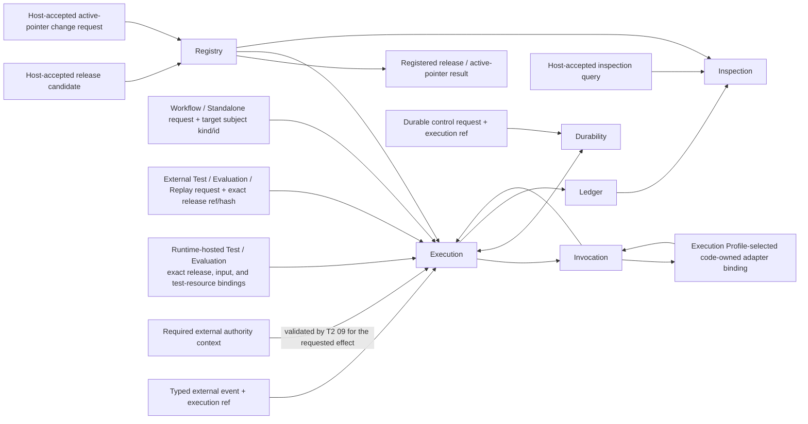
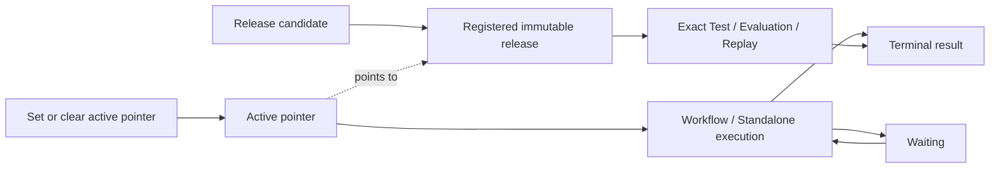

# Agent Runtime Domain Root

## 0. Intent Capsule

```yaml
layer: T1
status: candidate
canonical_owner: designDoc/agent_runtime_00_execution_charter.md
parent: designDoc/the_agent_runtime.md
owned_system_object: Agent Runtime domain
scope:
  - Registry, Execution, Invocation, Durability, Ledger, and Inspection architecture
  - immutable Module and Workflow release identity and active-pointer selection
  - Workflow Execution, Module Run, Variant, Attempt, Outcome, and Resolution lifecycle
  - provider-neutral execution and host integration boundary
  - Runtime-owned Reviewer defaults separated from model selection and host resources
  - Runtime-hosted self-test independence and explicit test-resource boundaries
  - Runtime-owned release and execution evidence
non_goals:
  - business workflow meaning, domain role semantics, prompt content, or quality rubric
  - Product Authorization policy or Entitlement issuance
  - domain database schema, SQL, writer rule, or canonical business write
  - Agency Platform product composition and control plane
  - provider, database, or durable-backend product selection
inputs:
  - host-accepted Runtime public request or Runtime-hosted self-test request from the classes defined in section 8
  - exact test-resource bindings for Runtime-hosted self-tests
  - external authorization and data-access decisions carried as opaque context where the requested effect requires them
outputs:
  - registered immutable Runtime releases and active-pointer result
  - durable execution receipt, snapshot, and terminal result
  - external-event acknowledgement and durable control result
  - authoritative release, Attempt, usage, failure, recovery, Outcome, and Resolution evidence
  - authorized read-only inspection projection
truth_surfaces:
  - designDoc/agent_runtime_00_execution_charter.md
  - code-owned Runtime release Registry and provider/tool adapter bindings
  - authoritative Runtime execution records
  - generated Runtime inspection
runtime_triggers:
  - Runtime release registration request
  - Registry active-pointer change request
  - authorized Workflow or standalone Module execution request
  - Runtime-hosted Test or Evaluation request over exact registered releases
  - typed external event for an existing execution
  - durable wait, retry, replay, recovery, or cancellation request for an existing execution
  - authorized release or execution inspection request
downstream_consumers:
  - Runtime T2 Design owners and implementation modules
  - host integrations and domain plugin owners
  - Software Delivery and Runtime operators
open_decisions: []
review_gate: independent design_contract_reviewer review and accountable Runtime domain-owner decision before implementation
runtime_surface_ledger: generated from code-owned Runtime release and execution records
verification_hooks:
  - T1/T2 parent and responsibility closure
  - public release and execution boundary conformance
  - standalone package and host-independence tests
  - self-test independence, test-resource isolation, and explicit external-persistence checks
  - durable execution, Ledger, and Inspection consistency
```

## 1. Primary System Flow



上图只表达 Runtime domain responsibilities 和权威事实流。每个 public operation、failure code、
state machine 和 concrete binding 由对应 T2 定义。外部请求先通过其宿主的 public API access gate。
Runtime-hosted self-test 指由 Runtime 测试宿主组织、仅使用明确绑定测试资源的执行；其入口边界见
§8.1，不依赖另一个产品的生产授权服务。两类请求进入相同的 Runtime execution 和 evidence 边界。

## 2. User Intent

Agent Runtime domain 让宿主注册和执行任意业务无关的 Agent capability，同时保持 release identity、
执行可靠性、授权边界、恢复能力和可审计事实一致。宿主继续拥有业务意义，Runtime 只拥有执行合同。
Runtime 维护者也可以独立验证已注册 capability，无需为普通自测部署业务产品的授权服务。

## 3. Reader Gain

- Runtime Product Owner 能判断一项能力属于哪个 Runtime responsibility 和 T2。
- Runtime Maintainer 能判断 release、execution、durability、ledger 与 inspection 的依赖方向。
- Host Integrator 能判断必须提供哪些 binding 和外部决定，以及 Runtime 返回什么稳定结果。
- Domain Plugin Owner 能独立注册、测试和组合 Module，不把 Skill 或业务 Workflow 写进 Runtime core。
- Security Reviewer 能追踪授权 context、protected operation、Attempt 和 inspection 的边界。
- Runtime Maintainer 和 Host Integrator 能区分自测资源准入、外部生产访问与 provider 登录，
  并判断测试证据何时仅在本地保留、何时可以写入明确提供的外部存储。

§9 的 delegation matrix 是能力到 responsibility、当前 Design 承接者、public boundary 和 failure owner
的解析表；§1 和 §5 固定 dependency direction。Execution 的领域级意图由本 T1 直接承接，具体接口
由其 code-owned contract 和 docstring 定义。其他能力按对应 T2 承接；归属不明确时返回 T1 owner，
不能由实现者选择附近文档或恢复归档合同。

## 4. Domain Outcome and Owned Objects

本 T1 拥有一个 `Agent Runtime domain`。该 domain 通过六项同层 responsibility 共同产生一个结果：
已注册 capability 在精确 release、input 和适用的资源边界下可靠执行，并留下可恢复、可解析、
可授权检查的权威事实。外部受保护效果还绑定其所需的 authorization context；普通自测绑定测试宿主
明确提供的资源，不构造生产授权决定。

核心对象族分为三组：

| Object family | Stable meaning |
| --- | --- |
| Release | Module、Workflow、Prompt、Schema、Policy 与 Execution Profile 的 immutable release 和 active pointer |
| Execution | Workflow Execution、Module Run、Variant、Attempt、Outcome 与 Resolution |
| Evidence | release、input、authorization、usage、failure、checkpoint、recovery、output 与 inspection facts |

本表中的 Policy 只指 Runtime-owned Behavior、Evaluation、Retry 和 Execution Variant Policy
release。它们约束执行机制，不表达 Product Authorization policy、业务规则或 domain quality rubric。

具体 schema、field、storage 和 active pointer 属于 T2 machine contract 与 code truth。

## 5. Responsibility Architecture

| Responsibility | Domain-level result | Prohibited takeover |
| --- | --- | --- |
| Registry | 产生可精确解析的 immutable Runtime releases 和 active pointer | 不执行 Module，不选择业务 owner |
| Execution | 协调 Workflow、Module、Evaluation、Selection 和 terminal Resolution | 不调用 provider，不拥有 durability backend |
| Invocation | 组装 Context，并调用 Execution Profile 选择的 code-owned provider/tool adapter binding | 不选择 release 或 Workflow edge |
| Durability | 协调 wait、retry、replay、recovery 和 cancellation | 不改变业务结果或 Ledger facts |
| Ledger | 保存权威 Attempt、usage、failure、Outcome 和 Resolution | 不驱动执行或形成 UI authority |
| Inspection | 提供授权只读 release/execution projection | 不修改 Registry、Execution 或 Ledger |

六项 responsibility 是同一 T1 下的架构分区，不是目录、进程、服务或技术产品。
依赖方向固定为 Registry 向 Execution 提供 registered release 与 active pointer；Execution 调度 Invocation，与 Durability
交换 durable command/state，并向 Ledger 提交事实；Inspection 只读取 Registry 与 Ledger。其他方向必须由
具名 public interface 证明，不能由 source import 或当前技术反向推断。

Reviewer 的共同运行底座由 Runtime 提供，业务审核定义由 Module owner 提供。Registry 冻结能力和
默认规则依赖；独立模型配置选择执行该定义的模型；Invocation 映射并执行能力。宿主提供安装资源、
存储和适用授权，Skill 说明其使用入口。环境名称不决定 Reviewer 默认能力，模型选择不改变工具权限。
ModuleReviewer 是通用 Module authoring 的特化，不增加同层 Runtime responsibility，也不将 Reviewer
默认能力传播给其他角色。具体定义和兼容边界由 Registry 与 Invocation T2 共同闭合。

Runtime 提供注册与 evaluation 的操作 Skill，作为自身产品的随包使用说明。宿主通过明确的
Workspace root 将它们接入已有 Skill 发现位置，使 Agent 能找到并使用 Runtime 的公开入口。
Runtime 拥有这些操作内容，Skill Management 保留 Skill 的结构、发现和审核规则；宿主自有 Skill
仍由宿主管理。操作 Skill 不形成新的执行 Module 或同层 responsibility，内核也不依赖宿主 Skill 树。
随包资源与 Workspace 接入的交付要求由 Standalone Release T2 承接。

宿主入口可以接受一个明确的项目 root，据此定位已准备的运行资源和连接配置，并允许显式指定
凭据位置。该 root 是配置定位，不是模型可读范围，也不决定默认模型或工具能力。凭据只交给相应
可信存储或授权接口，模型仅获得本次允许的材料和隔离工作区。配置目录、临时运行目录和数据库
自身的存储分别管理；提供项目 root 不自动授权创建数据库或向模型开放项目全集。

## 6. Inherited T0 Constraints

- Agent Runtime T0 定义 provider-neutral execution 与外部 authority handoff。
- Product Authorization 的 `user_key` 只随 database operation 原样进入 project data-access adapter；它不授权
  Workflow start、Module start 或 Runtime inspection。
- Data Governance 与 domain owner 提供受控 data-access boundary；Runtime 不解析 credential 或接管 SQL。
- 普通自测不要求生产 Entitlement、execution grant 或模拟的 allow-all 决定。涉及外部受治理数据库时，
  仍由数据所属方提供适用的访问决定；测试用途不扩大其权限。
- Timestamp Semantics 约束 Runtime time-bearing records。
- Design Doc Management、Skill Management、Review Contract 和 Software Delivery 分别拥有 Design、
  Skill、Reviewer common rules 与 delivery admission；Runtime 只执行已注册 Module。

## 7. Architecture and Lifecycle



Registry 不给 immutable release 维护一套可变 lifecycle state。某个 `(subject_kind, subject_id)` 的
active pointer 指向哪一份 registered release，该 release 就是 active；其余 registered release 都是
inactive。正常 Workflow/Standalone 通过 active pointer 解析目标；Test/Evaluation/Replay 通过 exact
release ref/hash 使用任意 registered release。Active pointer 不授权 caller 执行。Execution 固定所用
release、input 和适用的资源绑定；需要外部授权时，同时固定该 context。Durability 可以恢复同一
execution，但不能创建第二个 logical run，也不能扩大原资源范围。Terminal result 必须解析到 Ledger facts。

自测仍产生同一类 Runtime execution facts，其保留期限由明确的测试资源策略决定。临时存储在存续期间
是该次执行的事实权威；清理后不能声称仍可从已销毁资源恢复或检查。已有持久 Release Registry records
保持原保留规则，不因某次测试使用了其 release 而成为可删除的测试资源。

Parent T0 所称 Runtime release admission 在本层没有第三种 state：成功 registration 证明 release 可按
exact ref 使用；active pointer 只决定 Workflow/Standalone 的默认可解析目标。

### 7.1 逻辑请求、尝试与技术重试

一次逻辑请求保持同一冻结定义、输入和执行身份。宿主调用入口在首次效果发生前保存可恢复的请求
身份与准确注册结果，并在响应丢失、调用者重启或重发时继续传递它；不能每次重发都生成新身份。
Runtime 验证该身份与定义、输入及调用者范围一致。成功提交后的重放只返回原结果，改变输入或
定义的同身份请求拒绝；新材料或明确的新审核形成新的逻辑请求。

Execution 拥有该请求内的 Attempt 及技术重试决定。Retry Policy 给出包含首次尝试的确定上限，
Invocation 报告可重试性，Durability 只协调已授权的新尝试或已有尝试的恢复。达到上限、不可重试
失败和未解决的效果不确定性都会停止，不把未知状态当作没有执行过。新的 Attempt 使用独立工作区，
继续固定原模型、能力和任务，保留失败与重试关系。

CLI 内部工具调用失败不自动创建 Runtime Attempt。Reviewer 对内容返回有效 non_pass 或 blocked
是已取得的审核判断；作者修改材料后再审属于新请求，不通过技术重试追求通过结论。候选用途准入、
运行后输出 Evaluation 和业务质量标准各有原责任，不能因共享 evaluation 一词而合并。

只有次数检查不能证明自动重试已实现；只有 Runtime 相同 key 的单元测试不能证明宿主重发安全。
相应完成条件要求实际调用链保存、传递和恢复同一身份，并证明不重复已提交的 Provider 效果。

## 8. Public Boundaries and Quality Rules

Runtime public boundary 接受以下 request/input classes：

1. content-addressed release candidate；
2. subject kind/id、exact registered release ref/hash 或 clear target 组成的 active-pointer change request；
3. target subject kind/id、Workflow 或 Standalone `execution_purpose`、authorization context 与 typed input
   组成的正常 execution request；
4. exact registered release ref/hash、Test、Evaluation 或 Replay `execution_purpose` 与 typed input
   组成的 exact execution request；外部请求携带其受保护效果所需的 authorization context，
   Runtime-hosted Test/Evaluation 按 §8.1 携带测试资源绑定；
5. exact execution ref 绑定的 typed external event；
6. exact execution ref 绑定的 wait、retry、replay、recovery 或 cancellation control request；
7. exact release 或 execution query 组成的 inspection request。

请求所属的 host integration 决定谁可以调用 Runtime public operation；Runtime 自测由其测试宿主负责入口。
这是 public API access，不是 Runtime release selection、execution authorization 或 database permission。
Host denial 在请求进入 Runtime 前结束并保留 host
owner。Runtime 各 responsibility 不复判 caller eligibility，只校验本 operation 的 payload、exact identity、
current precondition，以及 request 明确携带的 external decision ref。Registry 因此只校验 candidate、exact
target、hash、dependency closure 和 current-pointer precondition，并只产生 §9 row 01 的 Registry failure。

对应稳定结果是 immutable release/active-pointer fact、durable execution receipt/snapshot、external-event
acknowledgement、durable control result、terminal result 和 authorized inspection projection。每一类
request/result 由 §9 对应 Design owner 承接；Execution 的接口语义遵守本 T1，准确类型、默认值、
错误和副作用由其公开代码合同及 docstring 定义，不再依赖归档 Execution T2。

Execution 在创建 run 前，使用 Workflow/Standalone request 的 target subject kind/id 查询 Registry active
pointer；使用 Test/Evaluation/Replay request 的 exact registered release ref/hash 直接解析目标，不查询 active
pointer。Request 的 target identity 与 `execution_purpose` 类型不匹配或无法解析时，由 Execution 拒绝并产生
execution-invalid failure；Registry 不执行 run，也不把 pointer failure 改写成 authorization denial。

质量规则：

1. Runtime core 保持 domain-neutral 和 provider-neutral。
2. release、execution 和 evidence identity 可重放且不会依赖 timestamp 生成同一性。
3. 每个 observable failure 由 owning T2 产生 stable error code 和 caller action。
4. wait、retry、replay 和 recovery 不重复已提交 effect。
5. Ledger 是 execution fact authority；Inspection 只投影。
6. Module 可独立运行测试；Workflow 只组合 exact Module releases。
7. Registry 的公开 authoring loader 只读取调用者明确给出的项目 root 和 source closure，返回 path-free
   candidate。编译消费已捕获内容，注册和生产执行解析已冻结定义；不进行环境发现或在执行时重读
   宿主的可变 authoring tree。宿主也可直接提交等价的 repository-independent candidate content。
8. 测试用途不会放宽 exact identity、declared operation、Profile/Adapter compatibility、workspace、network
   或 output validation；资源越界在相应效果发生前拒绝。
9. Reviewer 的默认能力与模型选择分别确定并冻结；参数可以省略，但其来源与生效值不可缺失。
10. 已交付宿主入口消费完整注册结果。采用单节点 Workflow 时，必须形成准确的 Workflow 与节点 Variant；
    standalone Variant 不可替代。宿主只组合公开接口，不重新实现默认底座或 Provider 启动器。

本 T1 直接拥有 Execution 的启动、推进、用途、尝试及结果意图；其公开接口和 caller-visible failure
由 Execution code-owned contract 在这些边界内落实。其他 capability 按 §9 委派给对应 T2。每项
接口都须在所属公开代码和 docstring 中说明准确输入、输出、默认、effect、error 和 caller action。

### 8.1 Runtime-hosted self-test

普通自测使用 Test 或 Evaluation purpose，经既有 execution kernel 执行 exact registered release 和
frozen input。Runtime 测试宿主明确提供可用的测试资源，调用者仅设置 purpose 不能获得该资源范围，
也不能据此读取生产数据、触发生产操作或取得外部服务权限。对不满足这一路径资源约束的请求，
Runtime 在效果发生前拒绝，不自动补生产授权或转入生产入口。

自测的必要条件是 release/input closure、compatible Execution Profile、admitted Adapter、declared
operations，以及可执行的 workspace、network 和资源限制。它不需要 Product Authorization client、
生产 Entitlement、execution grant 或伪造的生产批准。Provider 登录由已有 Adapter 和宿主环境处理，
登录失败保留 Invocation/environment failure，不改写为缺少产品授权。

Runtime 自测宿主提供临时 record store、artifact store 和其他测试资源。没有明确的外部 Ledger binding
时，测试结果只写入这些资源。外部保存需要宿主显式提供目标 binding 及其必要的访问凭据，不能从业务
环境配置自动选取目标。凭据由宿主取得并交给对应 storage/data-access adapter；Runtime core 不读取、
解析、签发、刷新或持久保管凭据。模型进程不能取得 storage adapter 的凭据或未声明的资源。

测试资源的创建、证据导出、保留和清理由测试宿主的显式策略决定。可选外部保存只改变证据目的地，
不授予模型生产操作能力；未提供外部保存时仍可完成普通自测。请求已明确要求的外部保存失败，必须保留
失败结果，不能用本地结果冒充保存成功。测试宿主只清理它创建并拥有的临时资源，不删除已有持久
Registry 或外部记录。独立进程的重试与恢复继续遵守 §7 的同一 execution lineage 和资源边界。

这一路径不改变外部生产请求的 acceptance、Replay/control request 的既有约束，也不把测试通过解释成
业务接受、生产部署或 subject-specific review approval。Registry 提供 release facts，Execution 与
Invocation 执行资源边界，Ledger 保存执行事实；Agent Capability Verification 组织并汇总其验证证据。

## 9. T2 Partition and Dependencies

本表列明 T2 委派及由本 T1 直接承接的 Execution。标题保留既有文档结构，不将 Execution 重新
交给归档 T2，也不改变其同层逻辑职责。

| Design family | Primary responsibility | Public boundary and Design owner | Failure family and true owner |
| --- | --- | --- | --- |
| 01 Registry | Registry | compile、register、set/clear active pointer、resolve immutable release | release invalid / conflict / active-pointer invalid，Registry owns |
| 02 Source Architecture | T1-delegated cross-cutting conformance | validate source ownership、import direction、public surface 与 naming | architecture conformance failed，Source Architecture owns |
| 03 External Event Ingress | Execution | accept and acknowledge typed external event | event invalid / stale，External Event Ingress owns |
| 04 Ledger | Ledger | commit and read Attempt、usage、failure、Outcome、Resolution 与 checkpoint facts | ledger commit failed，Ledger owns |
| 05 Standalone Release | T1-delegated cross-cutting conformance | verify package、Design bundle、dependency isolation 与 release unit | release conformance failed，Standalone Release owns |
| 06 Inspection | Inspection | validate exact query；read and project release/execution facts | inspection query invalid / unavailable，Inspection owns；host denial retains host owner |
| 07 Durability | Durability | wait、timer、retry、replay、recovery、cancel 与 backend coordination | durability unavailable / recovery conflict，Durability owns |
| 08 Invocation | Invocation | prepare Context and invoke Execution Profile-selected code-owned provider/tool adapter binding；在自测中同样执行声明的 capability 与资源限制，隔离 provider 登录和产品授权 | adapter binding unavailable / invocation failed / output invalid，Invocation owns |
| 09 External Authority Integration | Execution boundary integration | 区分自测资源边界与外部受保护效果；仅对需要外部决定的效果 validate and carry authorization context、protected-operation intent 与 data-access handoff；普通自测不要求生产批准 | external denial retains its actual external authority；database permission retains Product Authorization or Data Governance/domain owner；Runtime owns only invalid ref、fence and late-result quarantine |
| Execution；本 T1 直接承接 | Execution | resolve target by execution_purpose；start、advance、evaluate、select、resolve and terminate Workflow/Module execution；接口与错误由 Execution code-owned contract 落实 | execution purpose/target invalid / terminal failure，Execution owns；不交给归档 T2 |
| 11 Agent Capability Verification | T1-delegated cross-cutting conformance | consume owner-qualified peer capability evidence，verify complete inventory、canonical Example/runbook 与 required environment-gate closure；验证自测独立性、临时资源策略与显式外部保存边界，不接管 peer 的存储或执行语义 | verification case failed / environment unavailable / coverage incomplete，Agent Capability Verification owns；peer capability failure retains its peer owner |

每个 T2 只拥有表中一个 bounded capability；Execution 保持六项同层 responsibility 之一，不因本 T1
直接承接其意图而成为其他职责的私有实现。各职责只能通过公开 interface 和 stable facts 依赖，不能
读取 sibling private implementation。当前文件 identity、implementation binding 和 migration status
来自 code-owned Design registration 与 generated inspection，不由本表维护。

02 和 05 的 cross-cutting authority 只来自本 T1 对 source/package conformance 的明确委派。它们可以
拒绝不符合已批准 responsibility contract 的 representation 或 release unit，但不能重新定义 Registry、
Execution、Invocation、Durability、Ledger、Inspection 的语义、状态或 public behavior。

## 10. Completion and Failure

Agent Runtime domain 在以下结果同时成立时完成最低产品闭包：

1. 外部 host 只通过公开 Registry interface 即可注册 immutable Module/Workflow releases。
2. authorized caller 可启动 Workflow 或允许 standalone 的 Module，并获得 durable receipt。
3. Invocation、Durability、Ledger 和 Inspection 对同一 execution identity 保持一致。
4. crash、wait、retry、replay、cancellation 和 recovery 有可重复验证的正向与失败用例。
5. Runtime package 不 import host product、domain Skill tree 或业务数据库实现。
6. canonical Design bundle、public exports、schema 与 code-owned registrations 通过 deterministic parity gate。
7. Agent capability inventory、canonical Example/runbook、owner-qualified peer results、local deterministic gates 与 release-required environment gates 形成 exact aggregate verification result；该结果不复制 peer conformance authority。
8. Runtime-hosted Test/Evaluation 在没有生产授权服务或外部 Ledger binding 时可重复执行；资源越界、
   incompatible Profile/Adapter、provider 登录失败和外部保存失败都有真实、可重现的失败证据。

Runtime-owned failure family 与 §9 一一对应：01 release invalid/conflict/active-pointer invalid；02 architecture conformance
failed；03 event invalid/stale；04 ledger commit failed；05 release conformance failed；06 inspection query
invalid/unavailable；07 durability unavailable/recovery conflict；08 adapter binding unavailable/invocation failed/output invalid；
09 external-authority context invalid、invalidation fence 与 late-result quarantine；Execution 的
invalid/terminal failure；11 capability test failed/environment unavailable/coverage incomplete。Product Authorization 的 denial 与 Data Governance/domain Gateway 的
data-access denial 是 peer decision；Runtime 09 只验证引用、执行 fence 并保留原 owner identity。
具体 error code、retryability、caller action 与 rollback 由 §9 对应 Design owner 的公开代码合同定义；
Execution 消费本 T1 的意图，其他职责同时遵守对应 T2。T1 不把 peer denial 或一个
T2 failure 重写成另一个 owner 的 failure。Host 对任一 Runtime public operation caller 的 denial 都在进入
Runtime interface 前结束并保留 host owner；Runtime 不把该 denial 改写成 Registry、Execution、Event、
Durability、Inspection 或其他 T2 failure。

## 11. References

- [Agent Runtime Charter](the_charter.md)
- [Agent Runtime T0](the_agent_runtime.md)
- [Design Doc Management](the_design_doc_management.md)
- [Product Authorization](the_product_authorization.md)
- [Data Governance](the_data_governance.md)
- [Timestamp Semantics](the_timestamp_semantic.md)
- [Review Contract](the_review_contract.md)
- [Software Delivery](the_software_delivery.md)
- [Agent Capability Verification](agent_runtime_11_agent_capability_verification.md)
