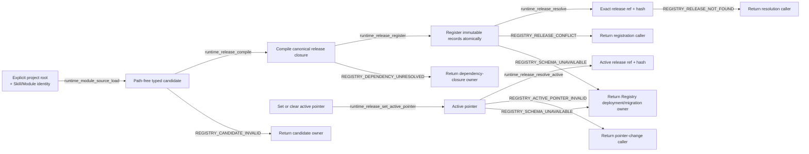

# Agent Runtime Release Registry

## 0. Intent Capsule

```yaml
layer: T2
status: candidate
canonical_owner: designDoc/agent_runtime_01_module_contract_and_assembly.md
parent: designDoc/agent_runtime_00_execution_charter.md
owned_system_object: Runtime Release Registry
scope:
  - explicit authoring-time Module source loading from a caller-supplied project root
  - path-free Runtime release candidate compilation
  - immutable Schema, Prompt, Policy, Profile, Module, and Workflow releases
  - dependency-closed atomic registration
  - one optional active pointer per Module or Workflow subject
  - exact ref-and-hash release resolution
non_goals:
  - ambient or production-time repository discovery, Skill lifecycle, or editable authoring-source governance
  - Module Run, Attempt, Evaluation execution, Selection, Outcome, or Resolution
  - provider invocation, durable coordination, execution Ledger, or Inspection rendering
  - persistent-store product selection, credential handling, connection pooling, or physical deployment
  - business Workflow meaning, role semantics, prompt quality, or domain decisions
inputs:
  - explicit authoring root plus exact Skill and Module identity for authoring-time loading
  - repository-independent typed candidate content
  - exact dependency release refs and SHA-256 hashes
  - Module-or-Workflow-subject-bound set-or-clear active-pointer request
outputs:
  - immutable Runtime release closure
  - atomic Registry registration result
  - active-pointer change result
  - exact resolved release or stable Registry failure
truth_surfaces:
  - designDoc/agent_runtime_01_module_contract_and_assembly.md
  - code-owned Runtime release records and Registry contracts
  - authoritative Runtime Registry store
runtime_triggers:
  - release candidate compilation
  - dependency-closed bundle registration
  - set, clear, or resolve active pointer
  - exact release retrieval
downstream_consumers:
  - Execution, Invocation, Ledger, Inspection, and Durability T2 capabilities
  - host registration adapters and Software Delivery
open_decisions: []
review_gate: independent design_contract_reviewer review and accountable Registry owner decision before implementation
runtime_surface_ledger: generated from registered immutable release records and active pointers
verification_hooks:
  - canonical payload/hash and dependency-closure tests
  - atomic registration, replay, conflict, and active-pointer tests
  - exact ref/hash retrieval and active-pointer tests
  - selected persistent-store binding parity tests
```

## 1. Primary System Flow



## 2. User Intent

Runtime Release Registry 让任何宿主以 repository-independent content 注册可复现的 Module 与 Workflow，
同时保证 Prompt、Schema、Policy、Profile 和 dependency identity 在执行前已经固定。Registry 只决定
“什么 release 存在并可被引用”，不决定业务 owner、产品资格或一次执行是否被授权。

## 3. Reader Gain

- Module Author 能判断哪些 bytes 和 dependencies 决定一个 Module release identity。
- Workflow Designer 能用 exact Module refs 组装 Workflow，不创建第二个 Step/Component Registry。
- Host Integrator 能从 editable source 生成 path-free candidate，并在注册后停止读取 authoring tree。
- Runtime Maintainer 能判断 compilation、registration、active pointer 和 resolution 的边界。
- Engineering Reviewer 能为每条 ref/hash edge 找到 canonical hash domain 和 false-green test。

## 4. Capability and Operation

本 T2 拥有一个 `Runtime Release Registry`。它在 authoring time 提供一个显式 source loader，
对所有 release family 执行三项共同 capability，并对 Module/Workflow 提供一项入口选择
capability：

1. 从 caller 显式提供的 project root 和 exact Skill/Module identity 读取固定 authoring source，
   返回 path-free content；
2. 把 typed candidate 编译为 canonical immutable release closure；
3. 原子注册 closure 中的全部 records；
4. 按 exact ref 和 SHA-256 解析任意 registered release；
5. 只对 Module/Workflow subject 设置、清除和解析 active pointer。

`Module.from_registration(...)` 与 `ModuleReviewer.from_registration(...)` 是 Runtime 发布的显式
authoring-time API。它们只在 caller 传入 project root 和 exact identities 时读取固定 source，
不扫描 sibling Module、不发现 ambient repository、不在 import time 运行。Loader 返回的
`module_registration_source` 包含 content 和不可变 identity，不把 project path 带入 candidate、release
或 production Registry。Compilation、registration 和 production Execution 都不读取 repository path、
ambient session、provider profile discovery 或 sibling project。

## 5. Immutable Release Model

Registry 管理以下 release families：

| Release family | Stable content |
| --- | --- |
| Schema Asset | canonical JSON Schema identity、document 与 hash |
| Prompt Component | typed instruction/context component 与 ordered source-member hashes |
| Prompt Bundle | ordered Prompt Component release refs/hashes |
| Behavior Policy | Runtime context-isolation 与 behavior mechanics |
| Evaluation Policy | candidate/evaluation mode mechanics |
| Retry Policy | bounded attempt policy，例如 `max_attempts` |
| Execution Variant Policy | Module/Workflow position 到 exact Execution Profile 的 binding |
| Execution Profile | provider-neutral execution mode、transport、model/config、tool/network/workspace capability |
| Runtime Module | executable contract、owner、I/O Schema、Prompt/Policy refs、entry 与 output-resolution policy |
| Workflow | workflow-local node/edge graph 和 exact Module release refs |

每个 release 的 `release_ref` 与 `release_sha256` 绑定同一个 canonical payload。Timestamp、active pointer、
provider session、source path 和 current store location 不参与 immutable identity。
相同 ref/hash replay 幂等；相同 ref 不同 hash 永久冲突。

## 6. Module and Prompt Closure

Agent Module release 绑定：

- stable `module_id` 与 version；
- exact owner Design ref/hash；
- input/output Schema refs/hashes；
- one Prompt Bundle ref/hash；
- Behavior、Evaluation 和 Retry Policy refs/hashes；
- declared operation IDs 与 compatible transport kinds；
- `workflow_bound` 或 `standalone_allowed` entry policy；
- `direct_single`、`evaluated_single` 或 `selected` output-resolution policy。

Prompt authoring source 在 compilation 时成为 immutable Prompt Component/Bundle release。生产 Execution
只读取 Registry release，不读取 `.claude/skills`、`SKILL.md` 或其他 editable repository file。
`source_skill_id` 只作为 stable provenance；Skill candidate version、hash 和 lifecycle 不进入 Module
release identity。

Execution Profile 与 Execution Variant Policy 都不进入 Module release hash。Execution Variant Policy 是
独立 immutable release：它绑定一个 exact Workflow 或 standalone Module origin release，并把该 origin 的
exact positions 绑定到 exact Execution Profile releases。同一个 Module/Workflow 可拥有多份 Variant Policy，
以比较不同 Profile 而不改变 origin release。Provider/model/profile 改变形成新的 Profile release 和新的
Variant Policy release；Module/Workflow content 未变时不制造新的 origin release。Behavior、Evaluation、
Retry 和 Variant Policy 都是 Runtime execution mechanics，不表达 Product Authorization 或业务规则。

Registry 在 Variant Policy registration 时验证 exact origin release 与全部 exact Profile bindings 已注册且
hash 匹配。Execution T2 在运行时选择一份 exact registered Variant Policy，并负责确认其 origin ref/hash
等于本次解析出的 Module/Workflow target；不匹配是 Execution target failure，不是新的 Registry operation。

## 7. Workflow Assembly

Workflow release 只引用 exact Module release refs/hashes。每个 `node_id` 是 workflow-local graph position，
用于区分同一 Module 的多次出现；它不成为可独立注册的 Step 或 Component。

Workflow candidate 定义 module/control node、typed edge、input mapping、branch、loop、wait 和 terminal
condition。Compiler 校验所有 referenced release、node identity、edge target、parallel join 和 terminal
closure。Workflow graph 不包含 Skill path、provider session、current authorization decision 或 execution
state。

Module 可在 Test、Evaluation、Replay 或允许的 standalone purpose 中独立执行；这些 execution purposes
属于 Execution T2，不改变 Registry release 或 active-pointer law。

## 8. Active Pointer

Registry 不给 release 保存一套可变 lifecycle state。对每个 Module/Workflow
`(subject_kind, subject_id)`，Registry 只保存零个或一个 active pointer：

```text
active   := active_pointer == release_ref
inactive := registered && active_pointer != release_ref
```

`runtime_release_set_active_pointer` 绑定 exact Module/Workflow subject kind/id 与 exact registered release
ref/hash，并在一个 transaction 中把该 subject 的 pointer 指向目标 release。重复 set 当前 exact target
返回同一 pointer result，不产生写入。`clear` 的 request 同时携带 expected current release ref/hash：pointer
指向该 target 时清除；pointer 已为空时返回同一个 `active_release_ref: null` 成功结果；pointer 指向另一份
release 时返回 `REGISTRY_ACTIVE_POINTER_INVALID`。Pointer 变更不修改任何 immutable release record，也不
修改 release 的 exact dependency closure。

Caller eligibility 由 parent T1 的 host public API access gate 在进入 Runtime 前决定。Registry 不读取或复判
host caller identity，也不把 host denial 改写成 Registry error。

Active pointer 只存在于 Module 或 Workflow subject，并只选择入口 release，不向 dependencies 传播。被选中
的 Module 继续使用自己已固定的 exact Prompt、Schema、Behavior、Evaluation 和 Retry Policy dependencies；
被选中的 Workflow 继续使用 exact Module refs、graph 和 mapping closure。这些 dependency 只需已注册且 hash
匹配。Execution Profile 与 Execution Variant Policy 不属于 Module/Workflow 的 fixed dependency closure。

Workflow/Standalone 由 Execution 通过 `runtime_release_resolve_active` 取得目标。Test/Evaluation/Replay
通过 `runtime_release_resolve` 按 exact ref/hash 取得任意 registered release。需要回到旧 release 时，只把
active pointer 重新指向旧的 immutable release。Execution 对 exact Variant Policy 与 target origin 的运行时
一致性检查遵循 §6 的责任分工；pointer switch 不选择或改写 Variant Policy/Profile。

## 9. Public Interface and Effects

| `interface_id` | Input | Successful output | Effect | Errors |
| --- | --- | --- | --- | --- |
| `runtime_module_source_load` | explicit project root plus exact `skill_id` and `module_id` | one validated, path-free `module_registration_source` | read-only authoring-time file access; no Registry mutation | `REGISTRY_CANDIDATE_INVALID` |
| `runtime_release_compile` | one typed path-free candidate plus exact dependency refs/hashes | canonical immutable release closure | none | `REGISTRY_CANDIDATE_INVALID`, `REGISTRY_DEPENDENCY_UNRESOLVED` |
| `runtime_release_register` | dependency-closed release bundle | exact registered records and canonical catalog snapshot | atomic append of previously absent immutable records | `REGISTRY_DEPENDENCY_UNRESOLVED`, `REGISTRY_RELEASE_CONFLICT`, `REGISTRY_SCHEMA_UNAVAILABLE` |
| `runtime_release_set_active_pointer` | Module/Workflow subject kind/id plus exact registered release ref/hash, or clear plus expected current ref/hash | active-pointer result with exact ref/hash or `active_release_ref: null` | atomically set or clear one pointer; immutable release records unchanged | `REGISTRY_RELEASE_NOT_FOUND`, `REGISTRY_ACTIVE_POINTER_INVALID`, `REGISTRY_HASH_MISMATCH`, `REGISTRY_SCHEMA_UNAVAILABLE` |
| `runtime_release_resolve` | subject kind/id plus exact release ref/hash | exact immutable release | none | `REGISTRY_RELEASE_NOT_FOUND`, `REGISTRY_HASH_MISMATCH`, `REGISTRY_SCHEMA_UNAVAILABLE` |
| `runtime_release_resolve_active` | subject kind/id | exact immutable release selected by the current pointer | none | `REGISTRY_RELEASE_NOT_FOUND`, `REGISTRY_SCHEMA_UNAVAILABLE` |

Compilation helpers for each release family are typed specializations of `runtime_release_compile`，不是新的
parallel Registry。In-memory store 与 deployment-selected persistent store 实现相同 interface 和
transaction semantics；本 Design 不选择 persistent-store 产品。

`canonical catalog snapshot` 是 registration transaction 完成后，对全部 registered release records 和
active pointers 的 deterministic、stable-order、read-only serialization。
它只用于返回注册后的完整 Registry facts、replay comparison 和 test；它不成为第二个 store、mutable
catalog authority 或 Inspection projection。

## 10. Completion, Failure, and Recovery

| `error_code` | Condition | Meaning | Caller action |
| --- | --- | --- | --- |
| `REGISTRY_CANDIDATE_INVALID` | candidate shape、identity、Schema 或 policy field 无效 | 没有编译 release | 修 candidate，冻结新 bytes 后重试 |
| `REGISTRY_DEPENDENCY_UNRESOLVED` | required ref/hash 不存在、未包含于 bundle 或 hash domain 不匹配 | closure 未成立 | 提供 exact dependency closure，不猜附近 release |
| `REGISTRY_RELEASE_CONFLICT` | 同一 release ref 已存在不同 payload/hash | Registry 未改变 | 生成合法新 version/ref；不得覆盖 |
| `REGISTRY_ACTIVE_POINTER_INVALID` | set/clear request 的 subject、target 或 current-pointer precondition 不成立 | pointer 未改变 | 使用 exact subject、release ref/hash 和 current target 重试；不得猜测 latest-like release |
| `REGISTRY_RELEASE_NOT_FOUND` | exact ref/hash 或 active pointer 无可解析 release | 没有返回 release | 返回 caller；不得 fallback 到 latest-like release |
| `REGISTRY_HASH_MISMATCH` | supplied hash 与 stored canonical hash 不同 | release identity 不成立 | 拒绝并重新取得 exact ref/hash |
| `REGISTRY_SCHEMA_UNAVAILABLE` | configured Registry store schema absent、installing、changed 或 unsupported | store 不可安全读写 | 停止当前 register、pointer-change 或 resolve operation；由 Registry deployment/migration owner 修复后，以同一 exact request 重试 |

Registration 与 pointer change 必须分别事务性：任一 dependency、conflict、schema、target 或 current-pointer
validation 失败时不产生部分写入。Crash 后在没有后继 pointer commit 时 replay exact bundle、set 或 clear
request，必须返回相同 records/pointer result；后继 pointer 已指向另一 release 时，旧 clear request 按
current-pointer precondition 返回 `REGISTRY_ACTIVE_POINTER_INVALID`。

Rollback 不删除或改写任何 immutable release。Caller 用 exact ref/hash 把 active pointer 重新指向先前 release；
该 release 的原 dependency closure 保持不变。由于 registration dependency-closed 且 release immutable，
已注册 dependency 不产生单独的 rollback failure；目标 release 无法解析时，pointer 不改变并返回
`REGISTRY_RELEASE_NOT_FOUND`。

## 11. Dependencies and Verification

Allowed dependencies：

- parent T1 domain law 和 Agent Runtime T0；
- Foundation-owned canonical JSON、hash、name、timestamp 和 Schema validation primitives；
- deployment-supplied Registry store interface；
- Timestamp Semantics 对 Registry facts 的 timestamp role 与 comparison law。

Prohibited dependencies：

- host product、business Workflow、domain Skill tree 或 prompt-quality rubric；
- ambient repository discovery、implicit absolute path、sibling repository scan，或 production-time authoring read；
- Invocation、Durability、Ledger 或 Inspection private implementation；
- provider SDK/CLI 和 business database implementation。

最低 verification closure：

1. 每个 release family 的 canonical payload/hash 正负例；
2. exact ref/hash dependency resolution，而非只检查 key 存在；
3. atomic bundle registration、idempotent replay 和 conflict refusal；
4. set/clear active pointer、idempotent replay、exact-target precondition 与 rollback；
5. Module hash 对 Execution Profile 选择独立；
6. Workflow graph、node/edge、wait/loop/terminal closure；
7. in-memory 与 selected persistent store 的 record/transaction parity；
8. source/package boundary test 证明 Runtime production 不读 host authoring tree；
9. explicit authoring loader 只读指定 project root 下的固定 Module closure，并返回无 path candidate；
10. public export、Design bundle 和 generated Registry inspection parity。

## 12. References

- [Agent Runtime Charter](the_charter.md)
- [Agent Runtime T0](the_agent_runtime.md)
- [Agent Runtime Domain Root](agent_runtime_00_execution_charter.md)
- [Skill Management](the_skill_management.md)
- [Timestamp Semantics](the_timestamp_semantic.md)
