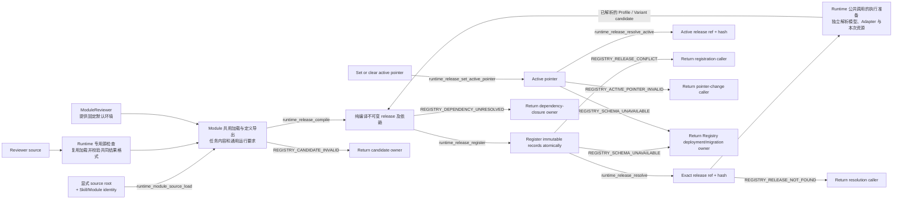

# Agent Runtime Release Registry

本文规定 Registry 的目标职责与交接。实际已支持的接口、source 格式和执行组合以发布代码、测试与随包文档为准；定义编译成功不证明后续注册、执行或部署已经完成。

## 0. Intent Capsule

```yaml
layer: T2
status: candidate
canonical_owner: designDoc/agent_runtime_01_module_contract_and_assembly.md
parent: designDoc/agent_runtime_00_execution_charter.md
owned_system_object: Runtime Release Registry
scope:
  - explicit authoring-time Module source loading from a caller-supplied project root
  - path-free Runtime release candidate compilation
  - shared Module authoring and Runtime-owned Reviewer default environment
  - immutable Schema, Prompt, Policy, Profile, Module, and Workflow releases
  - dependency-closed atomic registration
  - one optional active pointer per Module or Workflow subject
  - exact ref-and-hash release resolution
non_goals:
  - ambient or production-time repository discovery, Skill lifecycle, or editable authoring-source governance
  - Module Run, Attempt, Evaluation execution, Selection, Outcome, or Resolution
  - provider invocation, durable coordination, execution Ledger, or Inspection rendering
  - persistent-store product selection, credential handling, connection pooling, or physical deployment
  - business Workflow meaning, role semantics, prompt quality, or domain decisions
inputs:
  - explicit authoring root plus exact Skill and Module identity for authoring-time loading
  - repository-independent typed candidate content
  - exact dependency release refs and SHA-256 hashes
  - Module-or-Workflow-subject-bound set-or-clear active-pointer request
outputs:
  - immutable Runtime release closure
  - atomic Registry registration result
  - active-pointer change result
  - exact resolved release or stable Registry failure
truth_surfaces:
  - designDoc/agent_runtime_01_module_contract_and_assembly.md
  - code-owned Runtime release records and Registry contracts
  - authoritative Runtime Registry store
runtime_triggers:
  - release candidate compilation
  - dependency-closed bundle registration
  - set, clear, or resolve active pointer
  - exact release retrieval
downstream_consumers:
  - Execution, Invocation, Ledger, Inspection, and Durability T2 capabilities
  - host registration adapters and Software Delivery
open_decisions: []
review_gate: independent design_contract_reviewer review and accountable Registry owner decision before implementation
runtime_surface_ledger: generated from registered immutable release records and active pointers
verification_hooks:
  - canonical payload/hash and dependency-closure tests
  - atomic registration, replay, conflict, and active-pointer tests
  - exact ref/hash retrieval and active-pointer tests
  - selected persistent-store binding parity tests
```

## 1. Primary System Flow



## 2. User Intent

Runtime Release Registry 让任何宿主以 repository-independent content 注册可复现的 Module 与 Workflow，
同时保证 Prompt、Schema、Policy、Profile 和 dependency identity 在执行前已经固定。Registry 只决定
“什么 release 存在并可被引用”，不决定业务 owner、产品资格或一次执行是否被授权。

普通 Module author 明确任务内容及运行要求，使用共用加载、导出、投影和构图能力。Reviewer author
提供审核指令和相关契约文件；ModuleReviewer 在上游提供固定默认环境，其余行为继承 Module。
Portable source 不声明运行配置；宿主提供明确存储和本机资源，Runtime 公共调用负责执行准备。

## 3. Reader Gain

- Module Author 能判断哪些 bytes 和 dependencies 决定一个 Module release identity。
- Workflow Designer 能用 exact Module refs 组装 Workflow，不创建第二个 Step/Component Registry。
- Host Integrator 能通过共用入口生成 path-free candidate，并区分定义注册与一次调用所需的执行准备。
- Reviewer Author 能区分必须提供的审核定义、Runtime 自动提供的默认能力和独立的模型选择。
- Runtime Maintainer 能判断 compilation、registration、active pointer 和 resolution 的边界。
- Engineering Reviewer 能为每条 ref/hash edge 找到 canonical hash domain 和 false-green test。

## 4. Capability and Operation

本 T2 拥有一个 `Runtime Release Registry`。它在 authoring time 提供一个显式 source loader，
对所有 release family 执行三项共同 capability，并对 Module/Workflow 提供一项入口选择
capability：

1. 从 caller 显式提供的 project root 和 exact Skill/Module identity 读取固定 authoring source，
   返回 path-free content；
2. 把 typed candidate 编译为 canonical immutable release closure；
3. 原子注册 closure 中的全部 records；
4. 按 exact ref 和 SHA-256 解析任意 registered release；
5. 只对 Module/Workflow subject 设置、清除和解析 active pointer。

Module 共用加载、导出、投影和单节点构图行为；特化只提供默认环境。定义导出返回任务与运行要求的
固定内容及依赖，不选择模型或 Adapter，不调用 Provider、不访问存储，也不判断本机能否执行。

`Module.from_registration(...)` 与 `ModuleReviewer.from_registration(...)` 是 Runtime 发布的显式
authoring-time API。它们只在 caller 传入 project root 和 exact identities 时读取固定 source，
不扫描 sibling Module、不发现 ambient repository、不在 import time 运行。Loader 返回的
`module_registration_source` 包含 content 和不可变 identity，不把 project path 带入 candidate、release
或 production Registry。Compilation、registration 和 production Execution 都不从 authoring path
重新加载 Module 定义。Invocation 按已解析执行能力读取授权项目材料的规则由 T2 08 定义；
该能力不参与 Registry source discovery，也不把项目中的可变 Skill 文件当作已注册 Module prompt。

## 5. Immutable Release Model

Registry 管理以下 release families：

| Release family | Stable content |
| --- | --- |
| Schema Asset | canonical JSON Schema identity、document 与 hash |
| Prompt Component | typed instruction/context component 与 ordered source-member hashes |
| Prompt Bundle | ordered Prompt Component release refs/hashes |
| Behavior Policy | Runtime context-isolation 与 behavior mechanics；标准 Reviewer 由 Runtime 提供确定默认 |
| Evaluation Policy | 执行用途准入机制，与业务审核标准、输出 Evaluation 分开 |
| Retry Policy | 有界技术尝试规则；默认上限及失败处理来自同一版本化 Runtime 规则 |
| Execution Variant Policy | Module/Workflow position 到 exact Execution Profile 的 binding |
| Execution Profile | 独立模型选择与 Module 固定能力解析后的不可变执行配置；保存完整生效值及来源，不成为 Reviewer 工具权限的定义者 |
| Runtime Module | executable contract、owner、I/O Schema、Prompt/Policy refs、通用运行要求、entry 与 output-resolution policy |
| Workflow | workflow-local node/edge graph 和 exact Module release refs |

每个 release 的 `release_ref` 与 `release_sha256` 绑定同一个 canonical payload。Timestamp、active pointer、
provider session、authoring source path 和 current store location 不参与 immutable identity。
生效能力和模型配置的引用与内容参与执行配置的校验；宿主实际路径、一次任务的材料位置和凭据
不成为可移植 Module 的来源身份。相同 ref/hash replay 幂等；相同 ref 不同 hash 永久冲突。

## 6. Module and Prompt Closure

Agent Module release 绑定：

- stable `module_id` 与 version；
- exact owner Design ref/hash；
- input/output Schema refs/hashes；
- one Prompt Bundle ref/hash；
- Behavior、Evaluation 和 Retry Policy refs/hashes；
- 模型调用与真实领域 operation 的声明；
- 适用的通用运行要求及其技术 Policy 依赖；
- `workflow_bound` 或 `standalone_allowed` entry policy；
- `direct_single`、`evaluated_single` 或 `selected` output-resolution policy。

Prompt authoring source 在 compilation 时成为 immutable Prompt Component/Bundle release。生产 Execution
从 Registry 取得固定 Module prompt，不从可变 Skill 文件重新组装它。项目 Agent 是否发现和读取
项目 Skill，由 T2 08 的显式工具、上下文与资源配置决定；所读内容是任务材料。
`source_skill_id` 只作为 stable provenance；Skill candidate version、hash 和 lifecycle 不进入 Module
release identity。

模型选择和完整 Execution Profile 与 Execution Variant Policy 都不进入 Module release hash。
Module 自身的通用运行要求及派生 Policy 进入其定义闭包；改变模型不会改变这组要求。默认环境由特化
在构造时提供，之后以同一通用定义被消费，不成为下游额外要求的 Reviewer 身份。
Execution Variant Policy 是
独立 immutable release：它绑定一个 exact Workflow 或 standalone Module origin release，并把该 origin 的
exact positions 绑定到 exact Execution Profile releases。同一个 Module/Workflow 可拥有多份 Variant Policy，
以比较不同 Profile 而不改变 origin release。Provider/model/profile 改变形成新的 Profile release 和新的
Variant Policy release；Module/Workflow content 未变时不制造新的 origin release。Behavior、Evaluation、
Retry 和 Variant Policy 都是 Runtime execution mechanics，不表达 Product Authorization 或业务规则。

完整执行配置显式保存生效工具和约束，并能追溯到 Module 的通用运行要求。普通 Module 明确其所需
能力，Reviewer 由固定预设提供要求；没有要求依据时不能隐含开工具。Runtime 的公共调用负责解析
本次模型、Adapter 和资源，Registry 只编译并保存已经明确的内容。工具、资源与参数映射由 T2 08
执行；Registry 不导入 Provider SDK 或宿主配置来作选择。

Registry 在 Variant Policy registration 时验证 exact origin release 与全部 exact Profile bindings 已注册且
hash 匹配。Execution T2 在运行时选择一份 exact registered Variant Policy，并负责确认其 origin ref/hash
等于本次解析出的 Module/Workflow target；不匹配是 Execution target failure，不是新的 Registry operation。

### 6.1 Module 共用行为与 Reviewer 默认环境

Module 拥有通用任务定义与运行契约，其加载、导出、投影和构图行为由基类提供。ModuleReviewer
只提供 Runtime 发布的一套固定默认环境，继承共用行为。普通 Module 可以明确要求相同能力，
也可以使用无工具配置；下游 Registry、Execution 和 Invocation 都消费通用定义，不检查 Reviewer
类名、Module 名称或专用默认字段来决定执行资格。

单节点 Workflow 从同一份准确 Module 定义构造，保留定义和依赖，不重读 source 或重新解析默认值。
定义导出与只读投影只回答任务和依赖是什么；本次模型、执行配置与可执行性由公共调用的执行准备回答。

标准 Reviewer 环境提供独立上下文、读取、搜索、受限 Shell、审核材料只读、私有 scratch、关闭工具
网络和有界尝试预算。具体默认值、调用参数和编码由发布代码及其文档定义。默认环境在构造时成为
通用运行要求，后续升级不补写已注册内容。重试次数包含首次尝试；次数上限本身不承诺自动调度。

Runtime 拥有 Reviewer 共同结果格式及机械检查。该角色检查在专用 Reviewer source 检查入口执行，
使用同一次加载取得的准确 schema；正式 Reviewer 注册入口负责消费这个保证。继承的通用加载和
导出不暗含 Reviewer 格式审查，普通 Module、通用 compiler 与 Registry 不强制采用审核输出结构。
通用路径仍校验声明的完整 JSON Schema。业务 prompt、checklist、具体输入输出和结果判定继续属于
subject owner；共同格式检查不会代替其语义审核，也不另建一套 checker 框架。

### 6.2 定义编译与本次执行选择

Module 定义导出只固定任务内容、通用运行要求及依赖。模型、transport、Adapter、Profile 和 Variant
选择在 Runtime 统一公共调用的执行准备中完成，定义编译不承担这一选择。已经解析的 Profile/Variant
内容继续使用 Registry 的共用纯编译、注册和读取接口，不产生第二套 Registry。

省略模型选择时，Runtime 使用随包公开的当前模型预设；显式选择不会被自动替换。宿主名称、
active pointer 或相邻项目配置不决定模型默认。实际程序和运行资源由宿主明确提供。

本次 Profile 必须保持 Module 的运行要求及技术 Policy 约束。更换模型不能增加工具、改变隔离或
突破执行预算。实际 Adapter 无法履行要求时，执行准备返回准确缺口，不降级能力或自动换 Provider。
结构合法的定义不等于某个执行组合已被实现。

### 6.3 任务源、运行能力与真实领域操作

Portable source 提供任务身份、归属、prompt、完整输入输出 schema 和相关文件，不声明模型、
transport、工具、Runtime 技术 Policy 或宿主运行配置。普通 Module 的运行要求与任务执行规则由
Runtime 共用构造合同明确；标准 Reviewer 使用 Runtime 固定环境，调用者无需逐项组装底座。

原生读取、搜索和 Shell 是运行能力；真实领域 operation 保留在 Module 的操作声明及授权边界中。
Engineering 必须执行哪些命令是本次任务及其结果验证要求，不等于为每个 Reviewer 选择一套工具。
Runtime 负责把合法本地操作要求映射到受限执行能力，保留材料与命令约束，不以工具 ID 与操作 ID
字符串集合相等、或“没有非模型操作”的条件排除这条正常通路。

未知领域操作、没有资源权限或无法落实限制的组合必须拒绝。Shell 能力不授予领域写入或数据库权限，
也不能据名称相似就认定映射等价。source 格式变化与其消费者按工程方案迁移，不以清空旧操作声明
或临时补 transport 清单来制造通过。

### 6.4 用途准入与历史兼容

Evaluation Policy 表达执行用途限制，不保存 Reviewer 质量标准，也不替代运行后的结果判定。
新正常定义的用途由通用 entry、request 和适用 Policy 决定；Reviewer 身份本身不增加候选测试限制。
普通无工具和非 Agent Module 保持各自明确能力，不能因共用基类而获得模型、Prompt 或原生工具。

已有 release 的内容、ref、hash 和已提交执行事实按原编码保真读取。旧快照存在时，只从已存内容和
原合同明确含义取得运行要求；没有快照不等于缺少 Reviewer 身份，也不自动补入当前默认。
旧 Profile 与操作等已有事实足以支持的通路继续由 Runtime 统一入口判断；信息不足时返回具体缺口。

保留旧 payload 中的 transport 清单用于历史读取，不恢复它对新调用的 source-owned 否决权。
新调用按准确 Module 运行要求、Profile/Adapter 和实际权限判断；历史已提交执行按记录回放，不重新
选择配置或调用 Provider。显式用途、无工具、真实操作与资源限制仍然有效。

读取兼容与新定义采用分别验证。新旧编码不能混写；相同 ref 不同内容仍冲突。迁移采用新定义及其
消费者，不原地补写历史记录。读者支持新旧记录后才能写入新格式；能读旧记录不证明旧软件能读新记录。

### 6.5 公共调用与宿主资源

Runtime 公共调用接收目标 root、任务输入、本次明确材料与依赖，以及适用的存储和授权。Runtime
负责目标解析、模型与 Adapter 选择、执行配置组装和调用；宿主不另建执行组装器，也不逐次补写启动
或日志脚本。Registry 核心继续只处理准确 release 内容、依赖和存取。

随包 docstring 与 CLI 帮助说明 root 的含义、资源读取或准备的时机、已有内容与冲突处理、返回和错误。
具体目录、参数及生效值由代码定义并导出；Skill 引用当前入口。环境 root 用于定位配置，不等于模型
可读范围，安装准备也不自动授权建立数据库或迁移 schema。

凭据由相应可信接口处理，不进入 prompt、CLI argv 或公开日志。配置、临时运行目录与 Release Store
各守其用途；存储已准备且明确授权时才执行相应写入。定义导出不承担这些环境动作。

## 7. Workflow Assembly

Workflow release 只引用 exact Module release refs/hashes。每个 `node_id` 是 workflow-local graph position，
用于区分同一 Module 的多次出现；它不成为可独立注册的 Step 或 Component。

通用单节点构造默认沿用 Module 的名称和版本，调用者可以明确指定另一个 Workflow 名称。
Module 与 Workflow 由对象种类区分身份；相同名称不会使两者成为同一个对象，也无需添加审核后缀。
该默认只适用于从一个准确 Module 定义构造新图，不改写显式图的名称、节点或任何已注册版本。
多节点 Workflow 继续由调用者定义名称和编排。单节点结果仍是独立的 Workflow，通过既有图编译、
注册与解析接口处理；构造不注册记录、不选择模型、不授予执行权限，也不改变直接 Module 执行的准入条件。

Workflow candidate 定义 module/control node、typed edge、input mapping、branch、loop、wait 和 terminal
condition。Compiler 校验所有 referenced release、node identity、edge target、parallel join 和 terminal
closure。Workflow graph 不包含 Skill path、provider session、current authorization decision 或 execution
state。

Module 可在 Test、Evaluation、Replay 或允许的 standalone purpose 中独立执行；这些 execution purposes
属于 Execution T2，不改变 Registry release 或 active-pointer law。

Runtime 的单节点调用入口消费准确 Module/Workflow 定义及完整固定依赖，在本次执行准备中形成
属于该目标和节点的 Variant。定义注册不选择模型或要求预先保存本次执行配置；公共调用负责内部
组装，宿主无需补另一份执行 bundle。standalone Variant 与 Workflow Variant 不可互换。

这项共用构图与调用不改变直接 Module 执行的定义，也不为独立测试伪造 Workflow。采用 Workflow 路径时，
它必须是一份真实编译、注册并被调用的 graph，其授权和输入映射由所属宿主明确提供。

## 8. Active Pointer

Registry 不给 release 保存一套可变 lifecycle state。对每个 Module/Workflow
`(subject_kind, subject_id)`，Registry 只保存零个或一个 active pointer：

```text
active   := active_pointer == release_ref
inactive := registered && active_pointer != release_ref
```

`runtime_release_set_active_pointer` 绑定 exact Module/Workflow subject kind/id 与 exact registered release
ref/hash，并在一个 transaction 中把该 subject 的 pointer 指向目标 release。重复 set 当前 exact target
返回同一 pointer result，不产生写入。`clear` 的 request 同时携带 expected current release ref/hash：pointer
指向该 target 时清除；pointer 已为空时返回同一个 `active_release_ref: null` 成功结果；pointer 指向另一份
release 时返回 `REGISTRY_ACTIVE_POINTER_INVALID`。Pointer 变更不修改任何 immutable release record，也不
修改 release 的 exact dependency closure。

Caller eligibility 由 parent T1 的 host public API access gate 在进入 Runtime 前决定。Registry 不读取或复判
host caller identity，也不把 host denial 改写成 Registry error。

Active pointer 只存在于 Module 或 Workflow subject，并只选择入口 release，不向 dependencies 传播。被选中
的 Module 继续使用自己已固定的 exact Prompt、Schema、Behavior、Evaluation 和 Retry Policy dependencies；
被选中的 Workflow 继续使用 exact Module refs、graph 和 mapping closure。这些 dependency 只需已注册且 hash
匹配。Execution Profile 与 Execution Variant Policy 不属于 Module/Workflow 的 fixed dependency closure。

Workflow/Standalone 由 Execution 通过 `runtime_release_resolve_active` 取得目标。Test/Evaluation/Replay
通过 `runtime_release_resolve` 按 exact ref/hash 取得任意 registered release。需要回到旧 release 时，只把
active pointer 重新指向旧的 immutable release。Execution 对 exact Variant Policy 与 target origin 的运行时
一致性检查遵循 §6 的责任分工；pointer switch 不选择或改写 Variant Policy/Profile。

## 9. Public Interface and Effects

| `interface_id` | Input | Successful output | Effect | Errors |
| --- | --- | --- | --- | --- |
| `runtime_module_source_load` | explicit project root plus exact `skill_id` and `module_id` | one validated, path-free `module_registration_source` | read-only authoring-time file access; no Registry mutation | `REGISTRY_CANDIDATE_INVALID` |
| `runtime_release_compile` | one typed candidate plus exact dependency refs/hashes；Module/Workflow 不含 authoring path，Profile 可含显式资源配置 | canonical immutable release closure | none | `REGISTRY_CANDIDATE_INVALID`, `REGISTRY_DEPENDENCY_UNRESOLVED` |
| `runtime_release_register` | dependency-closed release bundle | exact registered records and canonical catalog snapshot | atomic append of previously absent immutable records | `REGISTRY_DEPENDENCY_UNRESOLVED`, `REGISTRY_RELEASE_CONFLICT`, `REGISTRY_SCHEMA_UNAVAILABLE` |
| `runtime_release_set_active_pointer` | Module/Workflow subject kind/id plus exact registered release ref/hash, or clear plus expected current ref/hash | active-pointer result with exact ref/hash or `active_release_ref: null` | atomically set or clear one pointer; immutable release records unchanged | `REGISTRY_RELEASE_NOT_FOUND`, `REGISTRY_ACTIVE_POINTER_INVALID`, `REGISTRY_HASH_MISMATCH`, `REGISTRY_SCHEMA_UNAVAILABLE` |
| `runtime_release_resolve` | subject kind/id plus exact release ref/hash | exact immutable release | none | `REGISTRY_RELEASE_NOT_FOUND`, `REGISTRY_HASH_MISMATCH`, `REGISTRY_SCHEMA_UNAVAILABLE` |
| `runtime_release_resolve_active` | subject kind/id | exact immutable release selected by the current pointer | none | `REGISTRY_RELEASE_NOT_FOUND`, `REGISTRY_SCHEMA_UNAVAILABLE` |

Compilation helpers for each release family are typed specializations of `runtime_release_compile`，不是新的
parallel Registry。In-memory store 与 deployment-selected persistent store 实现相同 interface 和
transaction semantics；本 Design 不选择 persistent-store 产品。

`canonical catalog snapshot` 是 registration transaction 完成后，对全部 registered release records 和
active pointers 的 deterministic、stable-order、read-only serialization。
它只用于返回注册后的完整 Registry facts、replay comparison 和 test；它不成为第二个 store、mutable
catalog authority 或 Inspection projection。

## 10. Completion, Failure, and Recovery

| `error_code` | Condition | Meaning | Caller action |
| --- | --- | --- | --- |
| `REGISTRY_CANDIDATE_INVALID` | candidate shape、identity、Schema 或 policy field 无效 | 没有编译 release | 修 candidate，冻结新 bytes 后重试 |
| `REGISTRY_DEPENDENCY_UNRESOLVED` | required ref/hash 不存在、未包含于 bundle 或 hash domain 不匹配 | closure 未成立 | 提供 exact dependency closure，不猜附近 release |
| `REGISTRY_RELEASE_CONFLICT` | 同一 release ref 已存在不同 payload/hash | Registry 未改变 | 生成合法新 version/ref；不得覆盖 |
| `REGISTRY_ACTIVE_POINTER_INVALID` | set/clear request 的 subject、target 或 current-pointer precondition 不成立 | pointer 未改变 | 使用 exact subject、release ref/hash 和 current target 重试；不得猜测 latest-like release |
| `REGISTRY_RELEASE_NOT_FOUND` | exact ref/hash 或 active pointer 无可解析 release | 没有返回 release | 返回 caller；不得 fallback 到 latest-like release |
| `REGISTRY_HASH_MISMATCH` | supplied hash 与 stored canonical hash 不同 | release identity 不成立 | 拒绝并重新取得 exact ref/hash |
| `REGISTRY_SCHEMA_UNAVAILABLE` | configured Registry store schema absent、installing、changed 或 unsupported | store 不可安全读写 | 停止当前 register、pointer-change 或 resolve operation；由 Registry deployment/migration owner 修复后，以同一 exact request 重试 |

Registration 与 pointer change 必须分别事务性：任一 dependency、conflict、schema、target 或 current-pointer
validation 失败时不产生部分写入。Crash 后在没有后继 pointer commit 时 replay exact bundle、set 或 clear
request，必须返回相同 records/pointer result；后继 pointer 已指向另一 release 时，旧 clear request 按
current-pointer precondition 返回 `REGISTRY_ACTIVE_POINTER_INVALID`。

Rollback 不删除或改写任何 immutable release。Caller 用 exact ref/hash 把 active pointer 重新指向先前 release；
该 release 的原 dependency closure 保持不变。由于 registration dependency-closed 且 release immutable，
已注册 dependency 不产生单独的 rollback failure；目标 release 无法解析时，pointer 不改变并返回
`REGISTRY_RELEASE_NOT_FOUND`。

## 11. Dependencies and Verification

Allowed dependencies：

- parent T1 domain law 和 Agent Runtime T0；
- Foundation-owned canonical JSON、hash、name、timestamp 和 Schema validation primitives；
- deployment-supplied Registry store interface；
- Timestamp Semantics 对 Registry facts 的 timestamp role 与 comparison law。

Prohibited dependencies：

- host product、business Workflow、domain Skill tree 或 prompt-quality rubric；
- ambient repository discovery、implicit absolute path、sibling repository scan，或 production-time authoring read；
- Invocation、Durability、Ledger 或 Inspection private implementation；
- provider SDK/CLI 和 business database implementation。

最低 verification closure：

1. 每个 release family 的 canonical payload/hash 正负例；
2. exact ref/hash dependency resolution，而非只检查 key 存在；
3. atomic bundle registration、idempotent replay 和 conflict refusal；
4. set/clear active pointer、idempotent replay、exact-target precondition 与 rollback；
5. Module hash 对 Execution Profile 选择独立；
6. Workflow graph、node/edge、wait/loop/terminal closure；
7. in-memory 与 selected persistent store 的 record/transaction parity；
8. source/package boundary test 证明 Runtime 不从 host authoring tree 重新加载已注册 Module；
   显式项目工作区读取另按 T2 08 验证；
9. explicit authoring loader 只读指定 project root 下的固定 Module closure，并返回无 path candidate；
10. public export、Design bundle 和 generated Registry inspection parity。

通用 authoring 首先用非审核输入输出的普通 Module 验证真实加载、导出、投影和单节点构图，再验证
ModuleReviewer 只提供默认环境并继承这些行为。无工具、非 Agent 与真实领域操作的限制保持；
定义导出不解析模型、Adapter 或环境，Reviewer 共同格式仅在专用 source 检查边界落实。

新旧 payload/ref/hash 的读取保真与新调用资格分别验证；旧 transport 清单不得否决已有明确运行依据的
新调用，也不得通过补入当前默认掩盖缺失要求。Registry、公共执行准备和实际工具资源各有自己的
完成证据；定义及纯编译层可以独立测试和审核，后续 source、注册与执行消费者未迁移前，不把中间
结果宣称为整包可运行或可部署。后续调用仍需验证准确 origin/节点/Variant 与实际资源。

## 12. References

- [Agent Runtime Charter](the_charter.md)
- [Agent Runtime T0](the_agent_runtime.md)
- [Agent Runtime Domain Root](agent_runtime_00_execution_charter.md)
- [Invocation](agent_runtime_08_agent_execution_adapter_contract.md)
- [Skill Management](the_skill_management.md)
- [Timestamp Semantics](the_timestamp_semantic.md)
