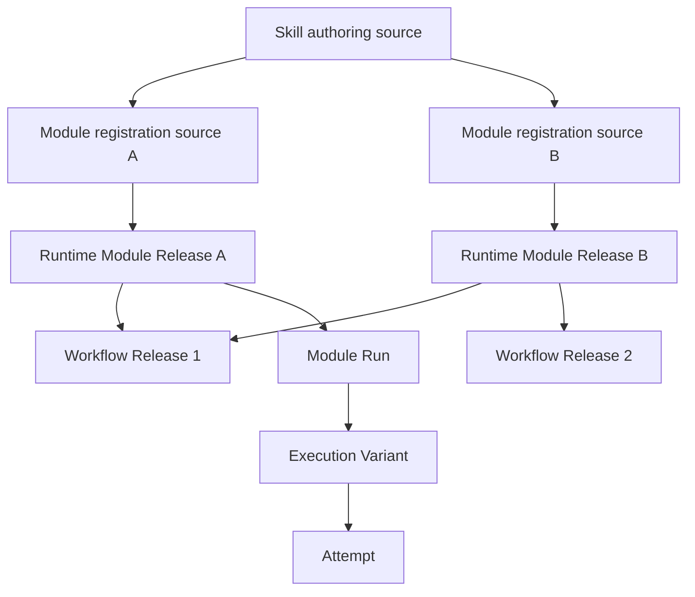
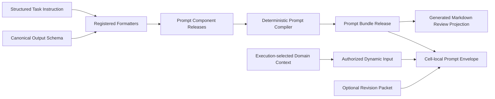
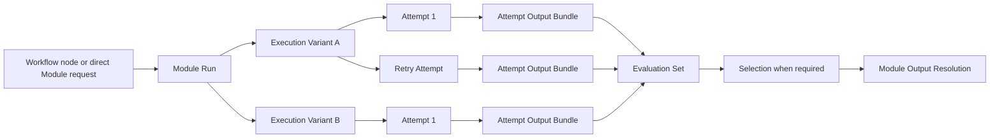

# Agent Runtime Module Registration and Workflow Assembly

**Purpose**: Define how fixed Skill authoring sources become independently
registered Runtime Modules, how Workflow Releases connect Module Releases, how
Prompt and execution configuration are versioned, and how every Module Run is
tested, evaluated, audited, and reproduced.

**Required reader gain**: A reader can register each Module authored under a
Skill independently, run it independently, assemble it into a Workflow without
creating a second Step or Component registry, and identify which facts belong
in Git, PostgreSQL, a Cell-local execution store, or generated inspection.

## 0. Contract Capsule

```yaml
layer: T1
status: proposal
canonical_owner: designDoc/agent_runtime_01_module_contract_and_assembly.md
parent: designDoc/the_agent_runtime.md
scope:
  - fixed Skill-authored Module registration sources
  - Runtime Module identity, release, admission, and direct execution
  - Workflow Release assembly from exact Module Release references
  - Prompt Bundle and Execution Profile release binding
  - Module Run, Execution Variant, Attempt, output, Evaluation, Selection, and Resolution lineage
  - provider-neutral release admission and generated inspection
non_goals:
  - domain content semantics, graph meaning, quality rubric, or terminal business decision
  - Skill authoring quality or Skill lifecycle policy, owned by Skill Governance
  - Principal, Entitlement, authorization decision, delegation, or grant issuance
  - provider SDK, API, CLI, or durable-backend implementation details
  - physical data residency, retention, or canonical domain writes
inputs:
  - designDoc/the_agent_runtime.md
  - designDoc/agent_runtime_00_execution_charter.md
  - designDoc/the_skill_management.md
  - owning T1 Intent Contract and typed Workflow Graph
outputs:
  - runtime_module_release, prompt_bundle_release, and execution_profile_release
  - workflow_release and release_admission_record
  - runtime_release_bundle, runtime_module_plugin, and runtime_release_registry
  - module_run, module_execution_variant, attempt, and module_output_resolution lineage
truth_surfaces:
  - designDoc/agent_runtime_01_module_contract_and_assembly.md
  - src/agent_runtime/contracts/execution_module_definition.py
  - src/agent_runtime/contracts/registry_release_definition.py
  - src/agent_runtime/contracts/registry_package_definition.py
  - src/agent_runtime/registry/registry_release_registration.py
  - src/agent_runtime/registry/registry_plugin_registration.py
  - src/agent_runtime/registry/registry_postgres_persistence.py
  - src/agent_runtime/execution/execution_module_invocation.py
  - Postgres control-plane and Cell-local execution records
generated_projection_surfaces:
  - agent_runtime.inspection.inspection_release_rendering:build_runtime_release_inventory
  - agent_runtime.inspection.inspection_release_rendering:render_runtime_release_markdown
review_gate: design approval before implementation; independent engineering review after implementation
```

## 1. Structure Index

The design uses four distinct views. Each section stays within one view.

| View | Question | Canonical objects |
| --- | --- | --- |
| Definition and release | What can execute? | Runtime Module Release, Prompt Bundle Release, Execution Profile Release, Workflow Release |
| Graph assembly | How are executable units connected? | Workflow node bindings, edges, input mappings, waits, terminal conditions |
| Execution | What happened in one run? | Workflow Execution, Module Run, Execution Variant, Attempt, output, Evaluation, Resolution |
| Persistence and authority | Where does each fact live? | Git authoring source, Postgres registries, Cell-local execution store, generated inspection |

These views interact through immutable references and hashes. They do not
create authority rank. A graph node references a Module Release. A Module Run
records one execution of that release. Neither fact changes the Skill
authoring source recorded only as provenance.

## 2. Canonical Object Model



The cardinality is intentional:

- one Skill may author zero, one, or many Module registration sources;
- every Runtime Module Release is registered, owned, versioned, and admitted
  independently;
- one Runtime Module Release may be referenced by many Workflow Releases;
- one Workflow Release references many Runtime Module Releases;
- one Module Run may have one or many sibling Execution Variants;
- one Execution Variant may have one or many immutable Attempts.

There is no separate Step Registry or Component Registry. `node_id` is a
workflow-local graph-position identifier used only when the same Module appears
more than once or a stable position identity is required.

## 3. Skill-authored Module Registration Contract

### 3.1 Skill role

A Skill is an authoring and operator-facing surface governed by Skill
Governance. It may contain one provider-neutral `SKILL.md`, shared authoring
assets, zero-to-many Module registration sources, and local projections for
supported Agent interfaces. The Skill and its candidate revision grant no
Runtime execution authority. Runtime registers and admits each Module Release
independently.

### 3.2 Module registration manifest

A product-facing Skill declares each executable Module through one fixed
directory and one machine-readable manifest:

```text
.claude/skills/<skill_id>/runtime_modules/<module_id>/
├── module_registration.json
├── prompt.md          # fixed prompt authoring source
├── schemas/
│   ├── input.schema.json
│   └── output.schema.json
└── tests/
```

The Runtime Host Client reads only a Module manifest explicitly selected by one
`runtime_authoring_inventory`. The example path above is a Skill Governance
authoring convention, not a Runtime discovery root. The directory name and
`module_id` must be identical `snake_case` values. `prompt.md` is the
fixed UTF-8 authoring source of the Module's task instruction: registration
reads exactly this file, mints its content into an immutable Prompt Component
release, and compiles the Prompt Bundle from registered components. After
registration the immutable releases are the only production authority —
execution resolves the registered Prompt Bundle and never reads the
repository file. Ambient Markdown, sibling Module files, `SKILL.md` sections,
and strings embedded in Adapter code are not instruction members.

Each Agent Module registration must close three authoring surfaces before the
Runtime compiler accepts it:

1. the inventory-selected Skill projection declares the exact
   `module_id` and explains how a caller reaches the managed Module;
2. the Module owner Design Doc declares the exact `module_id` and explains its
   semantic purpose, boundary, input/output meaning, permissions, and workflow
   position;
3. the fixed Module directory owns the executable manifest, prompt, schemas,
   and tests described above.

The registration preflight verifies the paths and exact identifier closure
deterministically. Independent review judges whether the Skill and Design Doc
explanations are semantically sufficient. Neither surface may duplicate the
model-ready prompt, select a provider, or override immutable release metadata.

The current logical manifest shape is:

```yaml
schema_version: runtime_module_registration_v3
skill_id: opaque-writer
skill_projection_path: examples/runtime_authoring_reference/skills/opaque_writer/SKILL.md
module_id: opaque_writer
module_version: v1
module_kind: agent
owner_contract_ref: contract:opaque_review@v1
owner_contract_path: examples/runtime_authoring_reference/contracts/opaque_review.md
instruction_source_ref: authoring-source:opaque_writer_instruction@v1
input_schema_ref: schema:opaque_writer_input@v1
input_schema_path: schemas/input.schema.json
output_schema_ref: schema:opaque_writer_output@v1
output_schema_path: schemas/output.schema.json
declared_operation_ids: [model_execute]
compatible_transport_kinds: [in_process_test]
behavior_policy_ref: behavior-policy:opaque_behavior@v1
evaluation_policy_ref: evaluation-policy:opaque_evaluation@v1
retry_policy_ref: retry-policy:opaque_retry@v1
entry_policy: workflow_bound
output_resolution_policy: evaluated_single
```

`owner_contract_path` is a repository-relative authoring locator.
`owner_contract_ref` and `instruction_source_ref` are semantic Runtime
identities and remain stable when identical selected bytes move. An Agent
Module also names one `skill_projection_path`. A non-Agent manifest instead
declares its `module_kind`, semantic `executable_ref`, and selected
`executable_member_path`; its Skill projection is optional.
`input_schema_path` and `output_schema_path` are portable paths relative to the
Module directory and must remain inside `schemas/`. The Host Client resolves all
three paths inside the authoring repository, validates their declared
identities, and imports their exact bytes or hashes into immutable Runtime
releases. They are never persisted as production read instructions and are
never resolved by a Module Run.

Every closed Module directory keeps its input and output schema authoring files
inside that Module's `schemas/` directory. Runtime permits the directory only
when every contained file is one of the exact schema paths declared by the
Module registration; an external, undeclared, or unrelated schema entry is
rejected.

`module_id` is the stable executable identity carried by every release of that
Module in the Runtime Release Registry. Skill identity remains authoring-side
provenance and is not part of the Runtime Module Release payload. Prompt
membership is the ordered set of exact Prompt Component Release refs and
hashes. Runtime rejects an
unregistered component, another root-level Markdown authority, a path escaping
the Module directory, or an undeclared file absent from the Module closure.

Changing one Module's instruction, schema, owner, or Runtime policy creates a
new candidate release for that Module and its affected dependencies. Sibling
Modules do not change and are not read merely because they share a Skill.

### 3.2.1 Explicit Runtime authoring inventory

Every consuming product maintains one or more explicit
`runtime_authoring_inventory` files in its own repository. The inventory names
the exact Module, Policy, Execution Profile, Workflow, and Variant Policy
authoring sources selected for one build. It contains local
authoring locators and stable source identities; it is never a Runtime Release,
production Registry, execution input, or model Context.

The minimum inventory shape is:

```yaml
schema_version: runtime_authoring_inventory_v1
inventory_id: research_source_to_evidence
inventory_version: v1
plugin_id: research_source_to_evidence
plugin_version: v1
sources:
  - source_kind: agent_module
    source_id: evidence_router
    manifest_path: modules/evidence_router/module_registration.json
  - source_kind: workflow
    source_id: source_to_evidence
    manifest_path: workflows/source_to_evidence/workflow.json
```

The exact admitted `source_kind` values and type-specific manifest fields are
code-owned. Every `source_id` is unique and the ordered source list is explicit.
The loader does not infer a source kind from a directory or filename.

The loader receives one authoring root and one inventory path. It performs no
repository, Skill, directory, or plugin discovery. Absolute paths, parent
traversal, symlink components, duplicate source identities, missing selected
files, and a selected source whose content or declared identity does not close
fail before compilation. An unselected file cannot enter the source set or
change the build result. A closed Module directory may still reject an
unexpected local member because the Module manifest declares that directory's
complete authoring closure.

The loader output is `runtime_authoring_source_set`. It contains semantic
values, exact content, stable source refs, and content hashes. It contains no
repository path. All subsequent Runtime compilers remain path-free.

The path-bearing `runtime_authoring_inventory` object exists only inside the
loader. Its stable identity is
`runtime-authoring:<inventory_id>@<inventory_version>` and its hash covers the
canonical inventory semantics plus ordered selected content-member refs and
hashes. Runtime identities use semantic refs independent of local paths:

| Selected member | Runtime identity |
| --- | --- |
| Owner contract | `contract:<contract_id>@<contract_version>` |
| Agent instruction | `authoring-source:<source_id>@<source_version>` |
| Deterministic executable | `python:<qualified_symbol>` |
| External service interface | `service:<service_id>@<service_version>` |

The local owner, instruction, executable, and service-descriptor paths are
separate authoring locators. The loader hashes selected bytes and rejects
`repo-file`, `file`, absolute, parent-traversal, or path-derived Runtime refs.
Identical selected bytes and semantic identities therefore produce identical
Releases when moved to another admitted authoring directory.

An Agent Module selects one Skill projection and validates that it declares the
exact `module_id`. A deterministic or external-service Module may omit the
Skill projection. Each non-Agent Module selects one executable member in
addition to its semantic executable ref; deterministic code bytes or an
external-service interface descriptor bind `executable_sha256`.

The fixed Module root may contain a real `tests/` directory as host Software
Delivery evidence. The loader validates that root entry but never traverses or
compiles test files, and they do not enter `runtime_authoring_source_set`, the
inventory hash, or a Runtime Release. Every other unselected repository file is
equally inert. Unexpected executable members outside the declared Module
closure fail.

The v1 authoring inventory admits Agent, deterministic, and external-service
Modules. A `human_task` manifest fails until a later inventory schema defines
its service descriptor contract.

### 3.2.2 Registry-owned Host Client

The Host Client is a public Registry build-plane API exposed through
`agent_runtime.registry`. It is not another Runtime
responsibility, release authority, provider Adapter, product host, or business
Workflow owner. The client exposes three separable operations:

1. load and validate one explicit local authoring inventory;
2. compile its path-free source set through the existing Runtime release
   compilers into one dependency-closed `runtime_module_plugin`; and
3. submit that completed release set to one supplied Runtime Release Store and
   return a content-free registration report.

The Runtime Release Store owns readiness, locking, current authority,
Admission finalization, immutable merge, persistence, and replay. The Host
Client never supplies `recorded_at_utc`, reconciles committed Admissions,
creates a Registry schema, runs a migration, or accepts a database credential
inside a registration request.

`runtime_release_registration_store` has exactly one operation:

```text
register_bundle(runtime_release_bundle, /) -> runtime_release_registry
```

The bundle parameter is positional-only so an in-memory or PostgreSQL store may
use a different concrete parameter name while satisfying the same Protocol.

The registration client submits one completed bundle, then verifies every
expected Release ref and hash against the Registry returned by
`register_bundle`. `runtime_module_plugin` remains the dependency-closed
release-set contract. The weaker `runtime_release_registration_sink` and
`register_runtime_module_plugin` entry retire so
`register_runtime_release_set` is the sole Host Client submission path.
`runtime_module_plugin` is re-exported from `agent_runtime.registry`; the
build-result payload and the client operations therefore share one public
namespace.

`postgres_runtime_release_store` already returns the registered Registry.
`runtime_release_registry.register_bundle` returns itself after a successful
atomic in-memory registration. Both therefore satisfy the same store protocol
without an adapter or second submission path.

The inventory has no Admission-state field. The builder creates `candidate`
Admission Intents for every compiled Release. Production-canary, active,
superseded, and retired transitions remain in the separate Registry admission
workflow after test and review.

Every host product uses this same client and supplies only its own inventory.
The local inventory remains an authoring and recovery source. Registered
Runtime Releases are the sole production authority.

### 3.3 Skill classification and Runtime effect

| Skill class | Module registration rule | Runtime entry |
| --- | --- | --- |
| `primary_agent_development` | May declare a fixed development or governance Module; never a tenant product executor | Direct repository use or an admitted governance/development Workflow |
| `product_agentic` | One or more Agent Module registration sources | Runtime Module or admitted Workflow |
| `product_deterministic` | Usually a workflow-entry projection; deterministic Modules are code-owned | Dagster or Runtime binding selected by product design |
| `product_hybrid` | Every Agent execution is a registered Runtime Module | Fixed outer graph plus Runtime Module execution |
| `projection_only` | Declares no executable Module | Routes to an already admitted Module or Workflow |

A workflow-entry Skill points to `workflow_release_ref`. It does not become an
orchestrator Module merely because it helps a user start the workflow.

### 3.4 Runtime Module kinds

| `module_kind` | Required executable binding | Skill requirement |
| --- | --- | --- |
| `agent` | One exact Prompt Bundle loaded by an Agent Executor Adapter | Authoring-side Skill projection; no Skill field in the Runtime Release |
| `deterministic` | Immutable code entry ref and code-release hash | Optional explanatory Skill projection |
| `human_task` | Immutable human-task service entry ref and service-release hash | Optional task instruction release |
| `external_service` | Immutable Gateway operation entry ref and Gateway-release hash | Optional explanatory Skill projection |

Module kind changes create a new Module identity. They are not release updates
of the same executable contract.

## 4. Runtime Module Release

### 4.1 Stable identity and immutable release

`runtime_module_release` is append-only and binds one stable `module_id`, one
version, and one behavior-complete contract. `release_admission_record` owns its
append-only admission history. `runtime_release_registry` derives the active
release pointer for new bindings. There is no separate mutable Module
registration DTO.

Admission has two stages. `release_admission_intent` is caller-authored,
content-addressed, and contains no commit timestamp. The authoritative Registry
store finalizes it exactly once as `release_admission_record`, assigning
`recorded_at_utc` at the atomic commit and binding the intent hash into the
final record hash. Identical intent replay reuses the committed record and does
not read a new clock value. A caller, compiler, worker, provider, or host may
not assign the Registry store's `recorded_at_utc`.

The logical Module Release contract contains:

```text
module_id
module_version
module_release_ref
module_release_sha256
module_kind
owner_contract_ref and hash
executable_ref and executable_sha256 when module_kind is not agent
input_schema refs/hashes
output_schema refs/hashes
prompt_bundle_release ref/hash when module_kind=agent
declared operation IDs
Behavior Policy ref/hash
Evaluation policy ref/hash
Retry Policy ref/hash
compatible Executor Adapter kinds
entry_policy
release lifecycle
admission state
rollback target
```

Exact field schemas, enums, indexes, and validators are code-owned. Generated
inspection renders them for humans.

A model-backed Module is complete only when these release dimensions are
closed independently:

| Release dimension | Exact Runtime binding |
| --- | --- |
| Behavior | Runtime Module Release |
| Static instructions | Prompt Bundle Release |
| Input contract | Input Schema Asset Release ref and content hash |
| Output contract | Output Schema Asset Release ref and content hash |
| Provider execution | Execution Profile Release selected per Variant |
| Authoring provenance | Owner contract ref/hash; no Skill release dependency or Skill field |
| Runtime policy | Behavior, Evaluation, Retry, entry, and output-resolution refs and hashes |

The dimensions remain separate so a provider or model A/B test can change only
the Execution Profile Release while holding the Module, Prompt Bundle, Schema
Assets, semantic input, and policies constant. A schema change creates a new
Schema Asset Release and recompiles every dependent Module or Prompt Bundle;
it is not a mutable edit to an existing release.

### 4.2 Entry policy

Each Module Release declares one production entry policy:

- `workflow_bound`: production invocation requires an admitted Workflow node
  binding. Test, Evaluation, A/B, and replay purposes may execute the Module in
  isolation under their own authorization and side-effect restrictions.
- `standalone_allowed`: an authorized caller may start a production Module Run
  without inventing a Workflow.

Entry policy is part of the immutable Module Release. A test harness cannot
turn a workflow-bound Module into a standalone product action.

### 4.3 Module release admission

| Admission state | Execution meaning |
| --- | --- |
| `candidate` | Registered for validation; execution blocked outside isolated fixtures |
| `shadow_executable` | Cell-isolated candidate execution; canonical side effects blocked |
| `production_canary` | Limited production scope under explicit release and rollback policy |
| `active` | Eligible for authorized production binding |
| `superseded` | New execution blocked; pinned recovery allowed by policy |
| `retired` | Execution blocked; audit lookup retained |

One code-owned purpose matrix applies to the exact Module Release and each
Module-bound Behavior, Evaluation, and Retry Policy Release before execution
effects: `test` and `evaluation` admit candidate through active; `replay` also
admits superseded; `workflow` and `standalone` admit only production-canary or
active; retired is never executable. Execution consumes this Registry-owned
matrix rather than maintaining a second Policy-specific copy.

Admission is atomic. Activating a release updates the registry's derived active
pointer. Replacing an active release requires the prior active release to be
superseded in the same atomic bundle. An in-flight Module Run remains pinned
to its original release.

### 4.4 Generated Release inventory

The Release inventory is a pure Inspection projection over one immutable
`runtime_release_registry_snapshot` and one content-addressed
`release_inventory_selection`. The selection carries exact Release refs only. It
contains no Principal, Entitlement, Product Authorization decision, grant, or
access-control meaning. An authorized Inspection service may create the
selection after its own current decision, while the projector remains unable
to authorize or widen access. Projection refuses a selected ref that is absent
or resolves in more than one Release family.

The inventory covers all ten current Release families, matching admission
history, and matching active pointers. It preserves useful non-content Runtime
configuration and dependency metadata while excluding Prompt text, Schema
bodies, owner-contract bodies, task inputs, outputs, credentials, and provider
transcripts. Every array uses a canonical order. JSON and Markdown are
discardable and rebuildable; neither becomes Registry authority.
Admission history matches projected releases by exact
`(ReleaseSubjectKind, release_ref)`. The declaration order of the Registry-owned
`release_admission_state` enum is the single lifecycle rank used to derive the
latest state; Inspection does not maintain a second rank table.

## 5. Prompt and Skill Release Management

### 5.1 System of record

Managed execution uses the following authority split:

| Fact | System of record |
| --- | --- |
| Product and architecture intent | Design Doc |
| Schema authoring file, validator, compiler, and seed declaration | Code and Git |
| Skill and Module instruction candidate | Skill Management authoring workflow |
| Registered Schema Asset, Prompt Component, Module, Prompt Bundle, Execution Profile, and Workflow release | Runtime Release Registry, persisted through its deployment-bound store |
| Active release pointer and admission state | Runtime Release Registry, persisted through its deployment-bound store |
| Local `.claude/skills/<skill_id>/runtime_modules/<module_id>` files | Registration manifest plus generated human-review and recovery projections; no post-registration authority |
| Local `.claude/skills/*/SKILL.md` files | Skill authoring candidate; never duplicate Module prompt text or override a registered release |
| Local `.agents/skills/*/SKILL.md` files | Codex host-interface projections; never own Module registration or duplicate Module prompt text |
| Authorized dynamic task input and final provider request | Cell-local execution store |
| Shared execution ledger | IDs, refs, hashes, status, timing, and usage only |

Runtime never reads a mutable working-tree Skill, prompt, or schema file as
production authority after the target Module enters `managed`.

The Git Module directory is a registration manifest plus generated review and
recovery projections. Prompt Component, Prompt Bundle, and Schema Asset
Releases admitted to the Runtime Release Registry are the immutable registered
records and sole production execution authority. The configured persistence
adapter stores those records in the deployment-supplied Runtime namespace;
physical PostgreSQL ownership does not transfer release semantics to the host.
`SKILL.md`, Runtime code, and Adapter code contain no duplicate model-ready
Context or schema body. A registered hash mismatch requires a new release;
Runtime never reconciles persisted authority by rereading Git during execution.

Registration makes the PostgreSQL release canonical within its recorded
lifecycle state. Admission controls where that release may execute; it does not
return authority to the Git candidate.

Registration and update tooling reads the current Runtime Release Registry
first. It resolves the registered Module, Prompt Bundle, Schema Assets, and
Execution Profiles as the version baseline, then accepts a structured proposed
change from the owning registration workflow and computes new immutable
component and bundle releases. Regenerating a Git review projection from the
registered result is planned update tooling; today the repository file remains
the authoring source that the next registration reads. A missing, stale, or
edited local file cannot replace registered content, because execution
resolves only registered releases.

The Primary Agent participates only in authoring, review, registration, and
release update. A production execution resolves the immutable Module Release,
Prompt Bundle, Execution Profile, and authorized input closure directly from
Runtime authorities. It does not ask the Primary Agent to rediscover the Skill,
recheck its prose, or rebuild the Prompt for each run. A semantic instruction
change returns to the authoring and registration path and creates new immutable
release records before it can affect production.

### 5.2 Prompt Components and Prompt Bundle

A Prompt is managed as ordered immutable component releases and one compiled
bundle rather than one mutable string.



`prompt_component_release` stores one exact model-ready static body,
component kind, media type, Formatter identity and version, source-member refs
and hashes, content hash, and release hash. The initial kinds are
`task_instruction` and `output_constraint`.

`prompt_bundle_release` stores the ordered component refs and release hashes,
compiler version, complete compiled static body, body hash, and release hash.
Neither record contains tenant data, user query, entitled search result,
Source content, prior draft, credential, or provider session. Runtime
inspection reads the registered rows; it never opens a Markdown path.

An Expertise, Lens, tenant policy, retrieved knowledge selection, or other
execution-selected domain context is not a Prompt Component. Its owning domain
persists and versions it, then the authorized Runtime caller resolves the exact
body and supplies it as a hashed `module_input_binding` after routing. It is
frozen in the Module input closure and final Prompt Envelope for that Run. It
does not require a specialized Module or Prompt Bundle release.

`prompt_envelope` binds the exact Prompt Bundle, authorized dynamic inputs,
revision packet when present, output-constraint mode, tool policy, and final
application-controlled provider text for one Execution Variant. It is stored
inside the execution's Cell because it may contain protected customer content.
Shared telemetry stores its ref and hash rather than its body.

For text-based provider transports, the Prompt Envelope body is the complete
application-controlled provider text, not an instruction fragment or a recipe
for rebuilding that text. Runtime commits it before the Attempt starts; the
selected Executor sends the same UTF-8 body unchanged. No Adapter may add a
private text prefix, suffix, file instruction, output instruction, or revision
instruction after the Prompt Envelope hash is frozen. Prompt Bundle members
and structured input views remain useful decompositions, but they are not
substitutes for the recorded final text.

The complete invocation is larger than the Prompt Envelope whenever the
Execution Profile uses provider-native tools or output constraints. Runtime
therefore exposes the Prompt Envelope together with the exact submitted tool
definitions, output-schema projection, and their transport locations. A UI
must not label the Prompt Envelope alone as the complete model context.

The Module declares a deterministic `module_input_projection` between its
Runtime-private input closure and its provider request. The private closure
retains refs, hashes, release identities, authorization evidence, scope, and
lineage. The projection produces semantic inline segments, registered Gateway
capabilities, and exceptional managed attachments selected by the frozen
`input_delivery_plan`. It contains only semantic content and the minimum
semantic IDs needed to produce the answer. Provider-readable workspaces do not
contain Runtime input manifests or governed research directories.

The projection first creates one complete `model_semantic_context` independent
of transport. Inline and Gateway delivery are alternative projections of that
same semantic context; a Gateway cannot expose a different raw domain object or
let the model choose which required semantic slots exist. Each Module declares
which slots are `required_complete`. Inline places every required slot in the
Prompt Envelope. Gateway exposes every required slot through exact read tools,
records the model-visible responses, and fails Attempt completion when any
required slot was skipped or only partially read. Pagination may transport an
oversized required slot, but it cannot convert complete-context work into
selective retrieval.

Output-shape rendering removes schema-control annotations such as `$id`. The
exact registered schema remains private Runtime authority and validates every
returned object. Each Execution Profile pins exactly one
`output_constraint_mode`:

| Mode | Application-controlled Prompt | Native provider field | Intended use |
| --- | --- | --- | --- |
| `prompt_only_json` | Contains one task-plane schema projection | Disabled | controlled Prompt-level cross-provider Evaluation |
| `native_structured_output` | Contains no schema projection | Contains one provider-compatible schema projection | production reliability and full-stack Evaluation |

Both modes use the same canonical Module schema and the same deterministic
task-plane projection. Runtime rejects an invocation that places the schema in
both locations or neither location. For `native_structured_output`, the Adapter
maps the projection to the provider's actual interface, such as Claude SDK
`output_format` or Codex CLI `--output-schema`. Unsupported provider
composition keywords may be omitted from the provider projection only because
Runtime still validates the committed output against the complete canonical
Module schema and all registered dynamic domain constraints.

Provider projection is Adapter-owned code, not a second domain schema. When a
native interface requires every object property to be present, the Adapter may
project a canonical optional property as required and nullable. Before output
commit, the same Adapter removes only its synthetic optional-null placeholders
and validates the result against the unchanged canonical Module schema. An
unsupported schema shape fails conformance before provider invocation; the
Adapter never asks a Module owner to rewrite business semantics around one
provider's schema subset.

`prompt_only_json` freezes the same Prompt Envelope bytes across compared
providers when input delivery is also held constant. It disables native
structured-output controls so the application-controlled text is the only
application-supplied output-shape instruction. This is a controlled
Prompt-level comparison, not proof that provider-owned hidden context is
identical.
`native_structured_output` intentionally evaluates the complete provider
execution stack. Provider-generated hidden instructions or grammar compilation
remain provider behavior and must not be represented as byte-identical
cross-provider context.

For a text-only Module with `execution_mode = tool_free`, the projection is
fully inline: the Prompt Envelope contains the static instructions, complete
authorized semantic input bodies, and output requirement. Its Executor exposes
no shell, filesystem, app, browser, computer-use, image, multi-agent, search, or
network capability and parses the final response directly. Admission fails
before invocation if the complete request exceeds the frozen inline budget. It
does not stage input files or request a writable output file. Prompt
prohibitions are not substitutes for these executable controls.

An `agent` profile may give the provider exact admitted tools and one
isolated Attempt root. Runtime may keep small semantic inputs inline; governed
research reads and searches use registered PG-backed Gateway operations. A
Gateway-delivered required input still exposes the complete registered semantic
slot, not the source table row, Runtime manifest, or an open-ended search result. The
Agent writes only under its writable work root. It may write an initial
candidate, read it, revise it, and validate it inside the same invocation. The
Attempt root is not an ambient repository read surface, PG connection, or
Runtime audit surface. Only the declared final submission enters output
validation.

When Evaluation compares one-pass generation with within-invocation Agent
self-revision, both sibling Variants begin from the same byte-identical
`module_input_closure`, Prompt Bundle, output contract, provider, model, and
effort. The experiment must also state whether input delivery is held constant.
When the closure fits inline, one Variant may be `tool_free` and the other
`agent`; the treatment measures the complete execution-mode effect. For a long
closure, both Variants use the same Gateway-read Agent delivery plan and differ only
in the explicit draft-reread-revise behavior. Runtime records each Variant's
initial request, delivery plan, observed Gateway reads, output, latency,
usage, tool observations, and workspace observations. It does not represent
one Agent invocation as two model calls.

Network is orthogonal to both modes. The profile pins `denied`, `gateway_only`,
or `direct_sandboxed`; a Module needing external verification may use a
network-capable Agent profile, while a Module whose full corpus is already
frozen remains offline.

This separation is asymmetric by design: Runtime can always prove which exact
objects produced a task projection, while the model cannot see or reproduce
control-plane identifiers it does not need.

### 5.3 Provider projection

Skill and Prompt releases remain provider-neutral. An admitted Executor
Adapter translates one frozen Prompt Envelope into the provider request shape.
The Execution Variant pins the Adapter revision and the exact translated
request hash. A local Codex or Claude Skill projection may be distributed for
development, but that projection does not replace the Postgres release or
authorize execution.

### 5.4 Update meaning

| Change | Required new release or record |
| --- | --- |
| Shared Skill guidance changes | Skill review candidate only; no Runtime release unless a Module prompt changes |
| One Module instruction changes | Affected Prompt Component, Prompt Bundle, and Module Release |
| Input JSON Schema changes | Input Schema Asset Release plus every dependent Runtime Module Release |
| Output JSON Schema changes | Output Schema Asset Release plus every dependent Prompt Bundle and Runtime Module Release |
| Operation, Context, Evaluation, retry, entry, or output-resolution contract changes | Runtime Module Release |
| Provider, model, effort, Adapter, or tool implementation changes | Execution Profile Release and new Execution Variant |
| Dynamic task input changes | Module Run |
| Workflow node, edge, loop, wait, or terminal condition changes | Workflow Release |

An active Prompt, Skill, Module, profile, or Workflow Release is never patched
in place.

## 6. Workflow Release and Graph Assembly

### 6.1 Workflow authority

The owning T1 defines graph meaning. Runtime validates identity, closure,
release compatibility, and edge legality while treating Module and outcome
semantics as opaque.

`workflow_release` binds:

```text
workflow identity and version
workflow contract version, distinct from the release version
owning Intent Contract ref/hash
graph ref/hash
exact Runtime Module Release refs/hashes
workflow-local node bindings
input-mapping refs/hashes
legal edges, loops, waits, and terminal conditions
authorization manifest ref/hash
execution release ref/hash
lifecycle and admission
```

### 6.2 Graph node binding

A graph node is a workflow-local position, not another registered executable.
`node_kind=module` binds one exact Runtime Module Release. `node_kind=control`
represents a non-executable wait or routing position owned by the exact domain
graph. A control node has no Module ref, Prompt, provider, lifecycle, or second
Registry.

The bindings are deliberately small:

```yaml
node_id: write
node_kind: module
module_release_ref: runtime-module:opaque_writer@v1
module_release_sha256: <sha256>
input_mapping_ref: runtime-input-map:opaque_writer@v1
input_mapping_sha256: <sha256>

---
node_id: awaiting_external_decision
node_kind: control
module_release_ref: null
module_release_sha256: null
input_mapping_ref: null
input_mapping_sha256: null
```

Module purpose, instructions, schemas, permissions, Context, Executor,
Evaluation, retry defaults, and Prompt are resolved from the Module Release and
are not copied into a Module node. Control-node meaning and legal transitions
come from the exact graph ref/hash bound by the Workflow Release.

When a Module appears once and its identity is sufficient, `node_id` may equal
a stable local alias. When it appears multiple times, distinct local node IDs
bind the same Module Release. `node_id` has no independent lifecycle or
Registry.

### 6.3 Workflow shape


Wait and routing positions are `control` nodes rather than fake executable
Modules. Terminal outcomes remain terminal edges. A real human-task service is
a `module` node bound to a `human_task` Module Release. A PM decision that
arrives through authorized external-event ingress remains a control wait and
event transition.

### 6.4 One-Module Workflow

A one-Module Workflow is valid when it owns an independent product trigger,
authorization, lifecycle, terminal output, and workflow-level evidence. An
independent Engineering Project Review is one example. A Source Verifier
embedded in Source-to-Evidence remains a Module in that parent workflow even
though test and Evaluation tools can invoke it independently.

## 7. Module Execution Model



### 7.1 Module Run

`module_run` is the independently testable logical work unit. It binds:

- exact Module Release;
- execution purpose: `workflow`, `standalone`, `evaluation`, `test`, or
  `replay`;
- parent Workflow Execution and local node ID when present;
- tenant, Cell, authorization closure, and data scope;
- immutable input refs and `module_input_closure` hash;
- required output and Evaluation policy;
- creation and terminal status lineage.

A different input closure creates a new Module Run. A retry does not.

#### 7.1.1 Canonical execution-record ownership

`agent_runtime.contracts.execution` is the only public schema owner for the
Module Run, Execution Variant, Attempt start, terminal Attempt, output bundle,
Evaluation, Selection, and Module Output Resolution record families. The
Execution Kernel creates and commits those records. Adapters return normalized
invocation observations; they do not define Runtime ledger records. Inspection
code joins committed records and registered releases; it does not define a
second execution model.

The normalized identity boundary is:

| Record | Own fields | Joined authority |
| --- | --- | --- |
| `module_run` | run ID, request ID and hash, origin discriminator, execution purpose, exact Module Release ref and hash, input package ref and hash, input-closure hash, isolated-scope ref and hash, optional Workflow origin group, authorization-context-binding ref and hash, Runtime Release ref and hash, `recorded_at_utc` | Module semantics and output policy come from the pinned Module Release; tenant, Cell, and Principal identity come from the pinned authorization binding |
| isolated `module_execution_variant` | Module Run ID, Variant ID, arm key, replicate index, exact Execution Profile ref and hash, optional Prompt Envelope ref and hash, input-closure hash, `recorded_at_utc` | provider, model, reasoning, adapter, tools, network, workspace, timeout, and output mode come from the pinned Execution Profile; Behavior, Evaluation, and Retry Policy authority comes from the pinned Module Release and its exact Policy refs/hashes; the isolated record has no retry-budget field |
| Workflow `workflow_module_execution_variant` | Workflow Execution ID, Module Run ID, Variant ID, Module ID, exact Execution Profile and Adapter identity, Prompt and input-closure hashes, entitlement snapshot hash, execution modes, derived Retry Policy `max_attempts` projection, `recorded_at_utc` | the same Module/Profile authority applies; `max_attempts` is a validated execution projection used for Workflow Attempt ordinal enforcement and inspection, never a second Policy authority |
| `attempt_started` | Module Run ID, Variant ID, Attempt ID, parent Attempt, ordinal, exact invocation-request hash, claim-token hash, timeout, `recorded_at_utc` | execution and authorization identity are reached through the parent Module Run and Variant |
| `attempt` | Module Run ID, Variant ID, Attempt ID, terminal infrastructure status, output-bundle ref and hash, bounded failure classification and diagnostic ref and hash, interval timestamps, `recorded_at_utc` | model calls, tool calls, and usage remain separate Attempt-scoped child records |

For `origin_kind=workflow_graph`, `workflow_execution_id`, `workflow_node_id`,
and `module_dispatch_id` are all present. They are all absent for a root direct
Module Run. No record fabricates a Workflow identity for direct test,
Evaluation, replay, or standalone execution.

`module_run_result` is a non-persisted service response assembled from those
committed records. It may make a direct invocation convenient for a caller, but
it is not another ledger schema or source of truth.

### 7.2 Execution Variant

One `module_execution_variant` freezes every behavior-affecting execution fact
that may vary without changing the logical Module contract:

- Execution Profile Release;
- provider, model, effort, Executor Adapter and revision;
- Prompt Bundle and Prompt Envelope hashes;
- execution mode, frozen input delivery plan, tool, network, sandbox, timeout,
  and output-constraint mode;
- on Workflow-origin Variants only, derived Retry Policy `max_attempts` for
  ordinal enforcement and inspection, validated against the pinned Module
  Retry Policy rather than treated as Variant-owned authority; isolated
  Variants carry no retry-budget field;
- output-normalization release when required;
- authorization binding and Runtime version.

Provider or model A/B creates sibling Variants under the same Module Run. Each
Variant receives the byte-identical Module input closure and canonical output
schema. Variants never share mutable provider workspaces.

Changing the Module contract, Skill instructions, static Prompt Bundle, input
closure, or authorization scope creates a new Module Release, Module Run, or
Workflow Execution at the appropriate boundary rather than mutating a Variant.

### 7.3 Attempt

An Attempt is one immutable invocation try under one Variant. Retry appends an
Attempt. A committed provider call, external search, tool operation, or side
effect is not repeated during replay.

A Workflow retry requires a contiguous parent under the same Workflow
Execution, Module Run, and Variant, with both committed start and terminal
facts. An active parent cannot start a concurrent retry. A completed parent
cannot parent a new-dispatch retry because its Resolution is already
authoritative; replay returns the committed invocation instead. Failed,
cancelled, or terminalized-orphan parents may supply the contiguous retry
lineage selected by the durable caller, subject to the registered Retry Policy
budget.

Runtime code creates Module Run, Variant, Attempt, output, Context, operation,
usage, and failure records. Agents never author their own audit or billing
logs.

Usage, tool-call, authorization, and failure metadata are derived by Runtime
code from the Adapter result and enforcing Gateway observations. The Agent
returns semantic output only. A field that Runtime already knows from the
request, registered release, active claim, or provider response must never be
requested from the model and copied back into the ledger.

The Attempt exists once the provider invocation begins, regardless of whether
the returned body satisfies the Module output contract. Parsing,
normalization, schema validation, and dynamic domain validation are Attempt
finalization stages. A failure in any of them commits a failed Attempt with
provider usage, observed Gateway calls, and a bounded Cell-local diagnostic
reference. It cannot erase the invocation or leave only an outer Workflow
failure.

Output repair appends another Attempt under the same Variant. Runtime may add a
registered repair packet containing the exact validation finding and allowed
semantic values. The repair cannot change the frozen input closure, Prompt
Bundle, Execution Profile, provider, model, or authorization context. A change
to any of those facts creates the corresponding new Variant or Module Run.

### 7.4 Evaluation and Resolution

Each Module Release declares one output-resolution policy:

- `direct_single`;
- `evaluated_single`;
- `selected`.

Multiple eligible Variants require complete Evaluation coverage and immutable
Selection. `module_output_resolution_record` is the sole Runtime authority for
passing one execution output to the next Module or returning it to the caller.
It grants no domain admission, Artifact readiness, publication permission, or
canonical-write authority.

## 8. Direct Module Execution API

The public Runtime service exposes one execution operation. The code-owned
request schema carries all exact refs and hashes:

```python
run_module(
    request: ModuleExecutionRequest,
    *,
    release_registry: RuntimeReleaseRegistry,
    adapters: AgentExecutionAdapterRegistry,
    artifact_host: ModuleArtifactHost,
    ledger: ModuleExecutionLedger,
    authority: ModuleExecutionAuthority | None,
)
```

These `PascalCase` names are Python projections. Their canonical contract IDs
remain `module_execution_request`, `runtime_release_registry`,
`agent_execution_adapter_registry`, `module_artifact_host`,
`module_execution_ledger`, and `module_execution_authority`. `authority`
carries the `agent_runtime_09` execution authorization controller, context
binding, and Product operation authorization port; it is required whenever the
Module declares a protected operation and admissible as absent only for the
operation-free `in_process` Test/Evaluation conjunction defined in
`agent_runtime_08`. `artifact_host` is the Cell-local content boundary through
which the kernel alone commits authoritative outputs after the fenced
finalization re-check.

The service performs these ordered safety operations because changing their
order changes authority or replay behavior:

1. resolve the exact admitted Module Release and entry policy;
2. validate authorization before resolving protected inputs;
3. validate the input package and Module input closure;
4. create the Module Run and requested Execution Variants;
5. assemble and persist Cell-local Prompt Envelopes;
6. commit each protected-operation intent and carry the execution authorization context;
7. bind a Product grant only when the action is registered as high risk;
8. execute through admitted Executor Adapters or resource Gateways;
9. commit decision/effect observations, Attempts, outputs, usage, Evaluation, Selection, and Resolution;
10. return immutable output refs and lineage.

Workflow orchestration, module test, Evaluation, A/B, and replay all call this
same service. Direct provider invocation has no conformant ledger path.

## 9. Authorization and Data Boundary

Three different controls participate in one execution and must not be
collapsed:

| Control | Question | Owner |
| --- | --- | --- |
| Product authorization | May this Product Principal start this Workflow or Module and request this resource operation? | Product Authorization |
| Data Access Gateway | Which governed PG-backed objects may enter this exact execution input or dynamic retrieval result? | Enforcing data service under Data Governance |
| Execution capability profile | What may the provider process do after the task context has been assembled? | Runtime Execution Profile plus admitted Adapter |

The Module Release declares required operation classes and its semantic input
schema. Product Authorization decides whether a Principal may invoke the Module
and protected operations. The Data Access Gateway resolves only authorized
objects into the Module input closure. The Execution Profile pins provider,
model, reasoning, `execution_mode`, `tool_policy`, `network_policy`, sandbox,
timeout, and output-constraint mode. Behavior, Evaluation, and Retry Policies
remain bound to the Module Release.
Skill text, Module metadata, graph membership, test status, or output quality
never grants any of these permissions.

Runtime validates authorization before protected artifact resolution. Every
Module Run is pinned to one tenant, Cell, initiating Product Principal,
authenticated workload actor, execution authorization context, data scope, and
input package. A changed Entitlement or widened data scope requires a new
authorized execution.

Canonical Sources, Evidence, drafts, and background materials are normally
resolved from their governed PG services before provider invocation. Runtime
freezes the exact refs, hashes, schemas, and semantic values in
`module_input_closure`, then compiles only model-relevant semantic content into
an exact delivery plan. Small closed content is inlined. Large closed text,
documents, bounded packages, and broad background retrieval use an admitted
`gateway_only` profile and an entitlement-filtered PG-backed Gateway. Exact
binary objects may use managed attachments only when the registered read API
cannot carry them. The Agent does not receive a raw PG credential or scan an
ambient local knowledge folder. Required inputs are never silently truncated
to fit a model window.

Global control-plane registries contain platform and product instruction
releases only. Tenant Sources, evidence, drafts, search results, final Prompt
Envelopes, provider outputs, and credentials stay in Cell-local governed
storage. Shared telemetry contains bounded refs, hashes, timings, usage, and
failure classifications.

## 10. Postgres Logical Registry

This section defines Runtime-owned logical schemas and write semantics, not
database infrastructure ownership. Runtime publishes the schema releases,
migrations, validators, and stores. A deployment host supplies a connection
factory or Proxy binding, externally resolved credential handle, and fixed
schema namespace. The namespace is admitted deployment configuration and
cannot be supplied or changed by a Module, Workflow Execution, Agent, or task
request. The same rule applies to the Cell-local execution store.

The control-plane schema contains these code-owned table families:

```text
schema_asset_release
prompt_component_release
prompt_bundle_release
behavior_policy_release
evaluation_policy_release
retry_policy_release
execution_variant_policy_release
execution_profile_release
runtime_module_release
workflow_release
workflow_node_binding
workflow_edge
workflow_parallel_group_binding
release_admission
active_release_pointer
registry_schema_installation
```

The Registry schema is installed only by explicit administrator
`create_schema`. Ordinary load, exact query, and registration require the exact
supported table fingerprint plus a `ready` installation record and perform no
DDL. Persisted restoration creates a fresh Registry and verifies immutable
record hashes, dependency closure, admission transitions, and active pointers
without rerunning current Schema or Policy semantic validation. It cannot
merge or admit new content; new registration remains the only new-content path
and always uses the packaged JSON Schema validator.

The Cell-local execution schema contains:

```text
workflow_execution
workflow_execution_profile_selection
module_run
module_execution_variant
attempt
prompt_envelope
execution_output
evaluation_run
evaluation_set
selection
module_output_resolution
context_event
usage_event
```

The exact physical schema is implementation-owned. Required invariants are:

- immutable release and execution rows;
- unique stable identity and version pairs plus exact release hashes;
- atomic active-pointer promotion and prior active-release supersession;
- atomic registration that locks the Registry, loads current PG authority,
  merges and validates one candidate bundle, and persists the complete result
  in the same transaction;
- authoritative-store finalization of admission intents; after Release closure
  succeeds, the PostgreSQL store invokes its database clock once inside the
  transaction and never accepts a caller or process clock;
- exact ref and hash validation when loading every dependency;
- no `latest` resolution inside a pinned Workflow Execution or Module Run;
- every Agent node resolves its Module from the exact Workflow node binding and
  its profile from one hash-bound execution profile selection;
- Cell isolation and fail-closed authorization before content reads;
- deterministic generated inspection from the persisted Release Registry.

## 11. Release Admission Workflow

Release admission preserves this order:


1. The host selects one exact Runtime authoring inventory under its own Skill,
   Design, and Software Delivery authority.
2. The Runtime Host Client loads only the selected source closure and erases
   physical paths before compilation.
3. The path-free Module compiler validates that Module's exact owner, imports
   exact input and output content as immutable Schema Asset Releases, and
   validates operations, Context, Evaluation, entry policy, Prompt, and Schema
   closure.
4. The Prompt compiler creates immutable Prompt Bundle Releases from the same
   registered output Schema Asset projection.
5. The Registry-owned registration client submits one dependency-closed
   `runtime_release_bundle` from the completed `runtime_module_plugin`. The
   Runtime Release Store, composed with the
   deployment-supplied PostgreSQL binding, locks registration, loads the
   complete current Registry, merges and validates the bundle, and persists the
   result atomically without changing active pointers merely because a
   candidate exists. A caller cannot replace the store with a partial in-memory
   Registry, select another target schema, or request schema creation in the
   registration call.
6. Test and Evaluation run each Module directly in isolated execution scopes
   with representative authorized data. Review inspects the compiled static
   instructions, dynamic semantic inputs, output shape, and exact final
   provider request; source files alone are insufficient release evidence.
   A model-backed Module must produce one valid real-provider output under its
   candidate profile before its downstream Module is evaluated. Deterministic
   fixtures and schema tests establish conformance but do not establish model
   behavior quality.
7. Shadow workflows bind exact candidate Module Releases and run graph,
   authorization, replay, Context, telemetry, and output-resolution tests.
8. Release admission atomically activates accepted Module and Workflow
   Releases. A Module cannot enter `production_canary` or `active` unless both
   exact input and output Schema Asset bodies are registered and hash-closed.
9. Product routing moves to the managed entry.
10. Skill Governance retires legacy direct execution while preserving managed
    Skill and local development projections.

Failure at any gate leaves the current active releases unchanged.

## 12. Conformance Package

Every managed model-backed Workflow Release binds one provider-neutral
`workflow_release_conformance_manifest`. It is an index of immutable refs and
hashes rather than a prompt or a second workflow definition.

The manifest covers:

```text
intent
workflow_graph
module_release_index
module_input_projection_index
artifact_schema_index
module_source_provenance_index
prompt_bundle_index
execution_profile_index
evaluation_binding_index
authorization_manifest
context_and_data_boundary
telemetry_contract
recovery_and_replay_policy
test_and_evaluation_suite
release_admission_evidence
```

Each Module Run receives only its declared `module_input_projection`: the exact
authorized task materials, operations, and prior outputs required by that
Module. Registering a complete workflow package does not authorize copying all
materials into every Agent context.

## 13. Provider-Neutral Registration Example

The distribution includes one closed authoring reference under
`examples/runtime_authoring_reference/`. It demonstrates a non-Agent transform,
one Agent writer, a non-Agent sink, exact policies and schemas, and one Workflow
without importing a host Skill tree or business contract. Hosts build their own
inventories through the same public interfaces while retaining ownership of
their task semantics and Workflow topology.


The reference is executable conformance material rather than a second
registration path. Its inventory is consumed by the same Host Client and
compiler used for every external domain plugin.

## 14. Risks and Required Controls

| Risk | Failure signal | Required control |
| --- | --- | --- |
| Skill becomes execution authority | Runtime starts a Skill path without an admitted Module Release | Module Release and authorization are mandatory for every invocation |
| Skill and Prompt become two editable truths | Adapter Prompt differs from the registered Module prompt | Deterministic Prompt compiler and exact member hashes |
| Shared Skill leaks irrelevant instructions | Writer receives verifier or debater instructions | Single-Module source loading and Prompt Bundle membership validation |
| Active release mutates | The same release ID loads different bytes | Append-only releases and content-addressed validation |
| Workflow adopts latest Module | Replay changes behavior after a Module promotion | Exact Module Release refs in every Workflow Release and execution |
| Global Prompt release store receives customer content | Source or draft text appears in a control-plane row | Static release validator plus Cell-local Prompt Envelope storage |
| Model receives Runtime bookkeeping | Provider prompt or readable input contains refs, hashes, release/schema identity, Entitlement evidence, tenant/Cell, execution, or billing fields | Declared task-plane projection, no provider-readable manifest, and representative-data prompt inspection |
| A/B arms share mutable context | One provider workspace affects a sibling Variant | Variant-scoped Context identity and isolation tests |
| Direct execution bypasses product entry policy | A workflow-bound Module runs as a production product action | Purpose and entry-policy validation before Module Run creation |
| Module count expands without governance | Duplicate Modules differ only by names | Semantic-owner and release-hash comparison before Module admission |
| One Module update causes sibling release churn | An unchanged sibling Module is rebuilt | Single-Module loading and reuse of byte-identical Module Releases |

## 15. Canonical Runtime Vocabulary

Canonical object names are `snake_case` across Design Docs, serialized
discriminators, schemas, persistence, generated inspection, and cross-language
adapter contracts. Runtime-owned filenames, directories, variables, functions,
fields, table names, event names, and stable IDs follow the same rule. Python
classes use `PascalCase` only as language-native projections of these canonical
objects. They never define a second platform vocabulary.

The only admitted execution hierarchy is:

```text
workflow_release
  -> runtime_module_release
    -> module_run
      -> module_execution_variant
        -> attempt
```

All public contracts, registries, codecs, persistence rows, adapters, generated
inspection, and product workflows use this hierarchy. Runtime admission fails
when any executable surface bypasses an exact Module Release, creates a Module
Run outside `run_module()`, or makes output consumable without an exact
`module_output_resolution_record`.

## 16. Completion Gates

The design is implemented only when all of the following hold:

- one Skill authors at least two independently admitted Modules;
- each registered Module runs directly through `run_module()` with complete
  authorization, Prompt, Context, usage, output, and Attempt lineage;
- one Workflow Release chains those exact Module Releases and exercises a
  revision loop;
- the same Module Release is reused by a second Workflow or standalone test;
- Codex and Claude profiles execute as sibling Variants with isolated Context;
- Prompt Bundle and Schema Asset releases load from Postgres, while dynamic
  Prompt Envelopes remain Cell-local;
- missing Prompt Bundle, schema, operation declaration,
  authorization, or release hash fails closed;
- replay never resolves `latest` or repeats a committed provider call;
- generated inspection reproduces the active Module, Prompt,
  profile, Workflow, admission, and active-release bindings;
- deterministic inspection proves that `runtime_release_registry` is the only
  Module, Workflow, admission, and active-release registration authority.

## References

- [Agent Runtime Contract](the_agent_runtime.md)
- [Agent Runtime Execution Charter](agent_runtime_00_execution_charter.md)
- [Agent Execution Adapter Contract](agent_runtime_08_agent_execution_adapter_contract.md)
- [Authorization Integration Contract](agent_runtime_09_authorization_integration_contract.md)
- [Skill Governance](the_skill_management.md)
