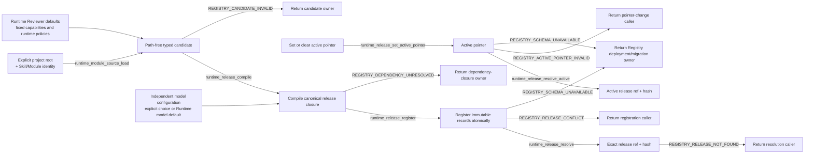

# Agent Runtime Release Registry

## 0. Intent Capsule

```yaml
layer: T2
status: candidate
canonical_owner: designDoc/agent_runtime_01_module_contract_and_assembly.md
parent: designDoc/agent_runtime_00_execution_charter.md
owned_system_object: Runtime Release Registry
scope:
  - explicit authoring-time Module source loading from a caller-supplied project root
  - path-free Runtime release candidate compilation
  - Runtime-owned Reviewer defaults and independent model configuration resolution
  - immutable Schema, Prompt, Policy, Profile, Module, and Workflow releases
  - dependency-closed atomic registration
  - one optional active pointer per Module or Workflow subject
  - exact ref-and-hash release resolution
non_goals:
  - ambient or production-time repository discovery, Skill lifecycle, or editable authoring-source governance
  - Module Run, Attempt, Evaluation execution, Selection, Outcome, or Resolution
  - provider invocation, durable coordination, execution Ledger, or Inspection rendering
  - persistent-store product selection, credential handling, connection pooling, or physical deployment
  - business Workflow meaning, role semantics, prompt quality, or domain decisions
inputs:
  - explicit authoring root plus exact Skill and Module identity for authoring-time loading
  - repository-independent typed candidate content
  - exact dependency release refs and SHA-256 hashes
  - Module-or-Workflow-subject-bound set-or-clear active-pointer request
outputs:
  - immutable Runtime release closure
  - atomic Registry registration result
  - active-pointer change result
  - exact resolved release or stable Registry failure
truth_surfaces:
  - designDoc/agent_runtime_01_module_contract_and_assembly.md
  - code-owned Runtime release records and Registry contracts
  - authoritative Runtime Registry store
runtime_triggers:
  - release candidate compilation
  - dependency-closed bundle registration
  - set, clear, or resolve active pointer
  - exact release retrieval
downstream_consumers:
  - Execution, Invocation, Ledger, Inspection, and Durability T2 capabilities
  - host registration adapters and Software Delivery
open_decisions: []
review_gate: independent design_contract_reviewer review and accountable Registry owner decision before implementation
runtime_surface_ledger: generated from registered immutable release records and active pointers
verification_hooks:
  - canonical payload/hash and dependency-closure tests
  - atomic registration, replay, conflict, and active-pointer tests
  - exact ref/hash retrieval and active-pointer tests
  - selected persistent-store binding parity tests
```

## 1. Primary System Flow



## 2. User Intent

Runtime Release Registry 让任何宿主以 repository-independent content 注册可复现的 Module 与 Workflow，
同时保证 Prompt、Schema、Policy、Profile 和 dependency identity 在执行前已经固定。Registry 只决定
“什么 release 存在并可被引用”，不决定业务 owner、产品资格或一次执行是否被授权。

Reviewer author 提供审核指令和相关契约文件即可使用 Runtime 的标准 Reviewer 底座，不必逐个组装
Policy、工具或执行器参数。宿主提供明确存储和本机资源，不决定 Reviewer 的默认能力。

## 3. Reader Gain

- Module Author 能判断哪些 bytes 和 dependencies 决定一个 Module release identity。
- Workflow Designer 能用 exact Module refs 组装 Workflow，不创建第二个 Step/Component Registry。
- Host Integrator 能从 editable source 生成 path-free candidate，并在注册后停止读取 authoring tree。
- Reviewer Author 能区分必须提供的审核定义、Runtime 自动提供的默认能力和独立的模型选择。
- Runtime Maintainer 能判断 compilation、registration、active pointer 和 resolution 的边界。
- Engineering Reviewer 能为每条 ref/hash edge 找到 canonical hash domain 和 false-green test。

## 4. Capability and Operation

本 T2 拥有一个 `Runtime Release Registry`。它在 authoring time 提供一个显式 source loader，
对所有 release family 执行三项共同 capability，并对 Module/Workflow 提供一项入口选择
capability：

1. 从 caller 显式提供的 project root 和 exact Skill/Module identity 读取固定 authoring source，
   返回 path-free content；
2. 把 typed candidate 编译为 canonical immutable release closure；
3. 原子注册 closure 中的全部 records；
4. 按 exact ref 和 SHA-256 解析任意 registered release；
5. 只对 Module/Workflow subject 设置、清除和解析 active pointer。

`Module.from_registration(...)` 与 `ModuleReviewer.from_registration(...)` 是 Runtime 发布的显式
authoring-time API。它们只在 caller 传入 project root 和 exact identities 时读取固定 source，
不扫描 sibling Module、不发现 ambient repository、不在 import time 运行。Loader 返回的
`module_registration_source` 包含 content 和不可变 identity，不把 project path 带入 candidate、release
或 production Registry。Compilation、registration 和 production Execution 都不从 authoring path
重新加载 Module 定义。Invocation 按已解析执行能力读取授权项目材料的规则由 T2 08 定义；
该能力不参与 Registry source discovery，也不把项目中的可变 Skill 文件当作已注册 Module prompt。

## 5. Immutable Release Model

Registry 管理以下 release families：

| Release family | Stable content |
| --- | --- |
| Schema Asset | canonical JSON Schema identity、document 与 hash |
| Prompt Component | typed instruction/context component 与 ordered source-member hashes |
| Prompt Bundle | ordered Prompt Component release refs/hashes |
| Behavior Policy | Runtime context-isolation 与 behavior mechanics；标准 Reviewer 由 Runtime 提供确定默认 |
| Evaluation Policy | 执行用途准入机制，与业务审核标准、输出 Evaluation 分开 |
| Retry Policy | 有界技术尝试规则；默认上限及失败处理来自同一版本化 Runtime 规则 |
| Execution Variant Policy | Module/Workflow position 到 exact Execution Profile 的 binding |
| Execution Profile | 独立模型选择与 Module 固定能力解析后的不可变执行配置；保存完整生效值及来源，不成为 Reviewer 工具权限的定义者 |
| Runtime Module | executable contract、owner、I/O Schema、Prompt/Policy refs、固定能力与 Runtime 默认底座依赖、entry 与 output-resolution policy |
| Workflow | workflow-local node/edge graph 和 exact Module release refs |

每个 release 的 `release_ref` 与 `release_sha256` 绑定同一个 canonical payload。Timestamp、active pointer、
provider session、authoring source path 和 current store location 不参与 immutable identity。
生效能力和模型配置的引用与内容参与执行配置的校验；宿主实际路径、一次任务的材料位置和凭据
不成为可移植 Module 的来源身份。相同 ref/hash replay 幂等；相同 ref 不同 hash 永久冲突。

## 6. Module and Prompt Closure

Agent Module release 绑定：

- stable `module_id` 与 version；
- exact owner Design ref/hash；
- input/output Schema refs/hashes；
- one Prompt Bundle ref/hash；
- Behavior、Evaluation 和 Retry Policy refs/hashes；
- declared operation IDs 与 compatible transport kinds；
- 适用的固定执行能力与 Runtime 默认规则的准确依赖；
- `workflow_bound` 或 `standalone_allowed` entry policy；
- `direct_single`、`evaluated_single` 或 `selected` output-resolution policy。

Prompt authoring source 在 compilation 时成为 immutable Prompt Component/Bundle release。生产 Execution
从 Registry 取得固定 Module prompt，不从可变 Skill 文件重新组装它。项目 Agent 是否发现和读取
项目 Skill，由 T2 08 的显式工具、上下文与资源配置决定；所读内容是任务材料。
`source_skill_id` 只作为 stable provenance；Skill candidate version、hash 和 lifecycle 不进入 Module
release identity。

模型选择和完整 Execution Profile 与 Execution Variant Policy 都不进入 Module release hash。
Module 自身的固定能力及默认规则依赖进入其定义闭包；改变模型不会改变这组能力。
Execution Variant Policy 是
独立 immutable release：它绑定一个 exact Workflow 或 standalone Module origin release，并把该 origin 的
exact positions 绑定到 exact Execution Profile releases。同一个 Module/Workflow 可拥有多份 Variant Policy，
以比较不同 Profile 而不改变 origin release。Provider/model/profile 改变形成新的 Profile release 和新的
Variant Policy release；Module/Workflow content 未变时不制造新的 origin release。Behavior、Evaluation、
Retry 和 Variant Policy 都是 Runtime execution mechanics，不表达 Product Authorization 或业务规则。

完整执行配置显式保存生效工具和约束，并能追溯到 Module 能力及所用默认规则。省略 authoring
参数表示由 Runtime 解析默认，不表示在执行时隐含开工具。工具、资源与参数映射由 T2 08 执行；
Registry 验证定义、默认来源与模型选择的闭包，不导入 Provider SDK 或宿主配置。

Registry 在 Variant Policy registration 时验证 exact origin release 与全部 exact Profile bindings 已注册且
hash 匹配。Execution T2 在运行时选择一份 exact registered Variant Policy，并负责确认其 origin ref/hash
等于本次解析出的 Module/Workflow target；不匹配是 Execution target failure，不是新的 Registry operation。

### 6.1 Module 与 Reviewer 默认底座

通用 Module 保存任务含义和显式执行契约。ModuleReviewer 是该 authoring 契约的 Reviewer 特化，
不是另一个 Runtime 子系统。它自动使用 Runtime 发布的标准 Reviewer 底座；其他角色不会因为共用
Module 基类而获得 Reviewer 的工具或策略。

默认底座包含独立上下文、读取、搜索、受限 Shell、审核材料只读、私有 scratch、关闭工具网络和
有界技术重试。通用审核结果格式由既有 Review Contract 提供；业务 prompt、checklist、完整输入输出
schema 和结果含义继续属于 subject owner。Runtime 不替作者补写审核内容。

默认能力与策略由 Runtime 随软件发布并版本化。不同 Reviewer 可以引用同一底座的准确版本，
不按宿主或 Reviewer 名称复制一套配置。第一次编译时解析并冻结这些依赖；之后的默认升级不改变
已注册定义或进行中的执行。源码里显式的有效限制继续生效，不能以使用默认底座为理由删除。

标准 Reviewer 的重试上限沿用既有有界规则，首次尝试包含在上限中。具体数值、默认参数和可查询
引用由发布代码及其 docstring 给出，并有测试保证，不由 Skill、宿主或 SDK 临时填值。修改该规则
需要新默认规则版本及受影响 Module 的新定义；注册调用者不负责逐项组装 Policy records。

### 6.2 模型配置与默认能力分离

独立模型配置只表达 provider、transport、model、推理及与模型执行相关的参数。调用者省略模型选择时，
使用 Runtime 随包提供并经过验证的标准 Reviewer 模型预设；模型预设的具体值及版本由代码公开。
已明确选择的其他模型不会因该缺省规则被替换。宿主名、active pointer 或相邻项目配置不能决定此默认。

编译器将固定 Module 能力与独立模型配置合成为精确 Execution Profile，再形成所需位置的 Variant。
即使现有 Profile record 同时保存模型和工具字段，也必须区分两者的来源：更换模型只改变模型选择及
相应执行配置，不能重新定义权限。超时等共同执行预算来自固定规则；模型配置不得突破该预算。
Adapter 无法满足所需能力时返回不相容，不降级成无工具、不扩大权限，也不自动改用其他 provider。

### 6.3 默认能力与显式操作声明

原生工具能力和受保护操作 ID 属于不同的声明维度。Registry 校验它们的对应关系，而不是将两个
字符串集合直接要求相等，或通过“没有非模型操作”这一特例绕过判断。

仅声明模型调用的 Reviewer 可以使用已冻结的默认原生能力。另行声明 repository_read、
repository_search、sandbox_command_execute 或领域操作的 Module，仍受这些操作的授权、材料和
命令限制。Invocation 必须验证所选工具能执行这些限制；默认 Shell 不能绕过受限命令入口。
不存在等价绑定、缺少必要约束或操作未知时拒绝，不删声明、不把名称相近视为等价。

transport 兼容声明仍属于 Module source。增加 claude_cli 必须先由 source owner 修订并审核完整
source，再编译新 Module release；它不是模型 override，也不能由注册或验收 Agent 临时补入。
一个样例成功不证明其他 transport 或其他操作组合已经支持。

### 6.4 用途准入与历史兼容

Evaluation Policy 表达执行用途限制，不保存 Reviewer 的质量标准，也不替代运行后的输出 Evaluation。
标准 Reviewer 的 authoring 入口不要求作者选择 module_candidate 或 deterministic_candidate。
新定义的正常用途由 entry policy 和 Execution request 决定，不仅因为它是 Reviewer 就附加“仅候选测试”
限制；纯代码测试和模型候选测试由明确的测试请求及相应执行检查区分。

已有 source 或 release 显式固定的候选用途策略保持原解释及限制。Runtime 能解析的既有策略由
公共 authoring 入口取得准确依赖；不能为了省参而重写其引用或升级成更宽的用途。新标准默认与旧
显式限制的区别必须进入兼容测试。仅添加 transport 的 source 修订保留其原 Policy、prompt 和 schema。

已有 release 的内容、身份和历史解释保持不变。缺少新能力来源或无法执行其边界的旧组合可以继续
按原合同读取，但不得获得新默认权限；不相容执行在 Provider 前拒绝。显式空工具配置继续表示无工具。
迁移采用新的定义和绑定，不原地补写历史 records，也不因软件安装自动切换日常 active pointer。

公开文档从真实接口导出必填参数、默认来源、返回、错误和副作用。精确默认依赖必须可查询，但
可查询字段不是都要手工提供的构造参数。源缺件、定义冲突和 Adapter 不相容分别保留原有错误边界。

### 6.5 Execution Profile 注册入口的环境准备说明

面向使用者的 Execution Profile 注册/准备入口必须同时说明其模型配置与宿主环境参数。
调用者提供一个明确的环境 root，入口按发布代码给出的固定约定准备本地配置和运行目录，或消费
已准备的资源；需要时接受明确凭据位置。Reviewer 注册调用同一能力时可传递这些参数，不要求
使用者先自行拼装一套环境对象。

入口的 docstring 与命令行帮助必须说明 root 的含义、派生目录的默认位置、配置读取和目录创建的
时机、已有内容与冲突处理、凭据提供方式，以及返回和错误。宿主配置只描述实际连接和资源，
不成为 Reviewer 默认工具或模型预设的第二来源。具体目录和参数在代码定义并自动导出，Skill
只引用该入口，不另外维护它的默认值。

注册准备协调宿主的资源接口，Registry 核心仍只编译、验证和写入 release closure，不拥有凭据
生命周期或数据库部署。建立本地运行目录不自动授权建立 PostgreSQL 实例、创建或迁移 schema。
凭据只能交给所需的可信 adapter，不进入 prompt、CLI argv、模型环境或公开日志。环境 root 不等于
模型可读范围；本地配置、回执和临时状态也不是另一个 Release Store。

## 7. Workflow Assembly

Workflow release 只引用 exact Module release refs/hashes。每个 `node_id` 是 workflow-local graph position，
用于区分同一 Module 的多次出现；它不成为可独立注册的 Step 或 Component。

Workflow candidate 定义 module/control node、typed edge、input mapping、branch、loop、wait 和 terminal
condition。Compiler 校验所有 referenced release、node identity、edge target、parallel join 和 terminal
closure。Workflow graph 不包含 Skill path、provider session、current authorization decision 或 execution
state。

Module 可在 Test、Evaluation、Replay 或允许的 standalone purpose 中独立执行；这些 execution purposes
属于 Execution T2，不改变 Registry release 或 active-pointer law。

宿主交付单节点审核入口时，用公开 Workflow 编译与注册接口消费准确 Module 结果，形成属于该
Workflow 和节点的 Variant。该流程消费 Runtime 已解析默认，不在宿主重写底座或建立环境 Profile
选择服务。注册结果必须包含或能够精确解析下一次调用所需的完整依赖；调用者不能在注册完成后还要
手工补另一份执行 bundle。standalone Variant 与 Workflow Variant 不可互换。

这项宿主组合不改变直接 Module 执行的定义，也不为独立测试伪造 Workflow。采用 Workflow 路径时，
它必须是一份真实编译、注册并被调用的 graph，其授权和输入映射由所属宿主明确提供。

## 8. Active Pointer

Registry 不给 release 保存一套可变 lifecycle state。对每个 Module/Workflow
`(subject_kind, subject_id)`，Registry 只保存零个或一个 active pointer：

```text
active   := active_pointer == release_ref
inactive := registered && active_pointer != release_ref
```

`runtime_release_set_active_pointer` 绑定 exact Module/Workflow subject kind/id 与 exact registered release
ref/hash，并在一个 transaction 中把该 subject 的 pointer 指向目标 release。重复 set 当前 exact target
返回同一 pointer result，不产生写入。`clear` 的 request 同时携带 expected current release ref/hash：pointer
指向该 target 时清除；pointer 已为空时返回同一个 `active_release_ref: null` 成功结果；pointer 指向另一份
release 时返回 `REGISTRY_ACTIVE_POINTER_INVALID`。Pointer 变更不修改任何 immutable release record，也不
修改 release 的 exact dependency closure。

Caller eligibility 由 parent T1 的 host public API access gate 在进入 Runtime 前决定。Registry 不读取或复判
host caller identity，也不把 host denial 改写成 Registry error。

Active pointer 只存在于 Module 或 Workflow subject，并只选择入口 release，不向 dependencies 传播。被选中
的 Module 继续使用自己已固定的 exact Prompt、Schema、Behavior、Evaluation 和 Retry Policy dependencies；
被选中的 Workflow 继续使用 exact Module refs、graph 和 mapping closure。这些 dependency 只需已注册且 hash
匹配。Execution Profile 与 Execution Variant Policy 不属于 Module/Workflow 的 fixed dependency closure。

Workflow/Standalone 由 Execution 通过 `runtime_release_resolve_active` 取得目标。Test/Evaluation/Replay
通过 `runtime_release_resolve` 按 exact ref/hash 取得任意 registered release。需要回到旧 release 时，只把
active pointer 重新指向旧的 immutable release。Execution 对 exact Variant Policy 与 target origin 的运行时
一致性检查遵循 §6 的责任分工；pointer switch 不选择或改写 Variant Policy/Profile。

## 9. Public Interface and Effects

| `interface_id` | Input | Successful output | Effect | Errors |
| --- | --- | --- | --- | --- |
| `runtime_module_source_load` | explicit project root plus exact `skill_id` and `module_id` | one validated, path-free `module_registration_source` | read-only authoring-time file access; no Registry mutation | `REGISTRY_CANDIDATE_INVALID` |
| `runtime_release_compile` | one typed candidate plus exact dependency refs/hashes；Module/Workflow 不含 authoring path，Profile 可含显式资源配置 | canonical immutable release closure | none | `REGISTRY_CANDIDATE_INVALID`, `REGISTRY_DEPENDENCY_UNRESOLVED` |
| `runtime_release_register` | dependency-closed release bundle | exact registered records and canonical catalog snapshot | atomic append of previously absent immutable records | `REGISTRY_DEPENDENCY_UNRESOLVED`, `REGISTRY_RELEASE_CONFLICT`, `REGISTRY_SCHEMA_UNAVAILABLE` |
| `runtime_release_set_active_pointer` | Module/Workflow subject kind/id plus exact registered release ref/hash, or clear plus expected current ref/hash | active-pointer result with exact ref/hash or `active_release_ref: null` | atomically set or clear one pointer; immutable release records unchanged | `REGISTRY_RELEASE_NOT_FOUND`, `REGISTRY_ACTIVE_POINTER_INVALID`, `REGISTRY_HASH_MISMATCH`, `REGISTRY_SCHEMA_UNAVAILABLE` |
| `runtime_release_resolve` | subject kind/id plus exact release ref/hash | exact immutable release | none | `REGISTRY_RELEASE_NOT_FOUND`, `REGISTRY_HASH_MISMATCH`, `REGISTRY_SCHEMA_UNAVAILABLE` |
| `runtime_release_resolve_active` | subject kind/id | exact immutable release selected by the current pointer | none | `REGISTRY_RELEASE_NOT_FOUND`, `REGISTRY_SCHEMA_UNAVAILABLE` |

Compilation helpers for each release family are typed specializations of `runtime_release_compile`，不是新的
parallel Registry。In-memory store 与 deployment-selected persistent store 实现相同 interface 和
transaction semantics；本 Design 不选择 persistent-store 产品。

`canonical catalog snapshot` 是 registration transaction 完成后，对全部 registered release records 和
active pointers 的 deterministic、stable-order、read-only serialization。
它只用于返回注册后的完整 Registry facts、replay comparison 和 test；它不成为第二个 store、mutable
catalog authority 或 Inspection projection。

## 10. Completion, Failure, and Recovery

| `error_code` | Condition | Meaning | Caller action |
| --- | --- | --- | --- |
| `REGISTRY_CANDIDATE_INVALID` | candidate shape、identity、Schema 或 policy field 无效 | 没有编译 release | 修 candidate，冻结新 bytes 后重试 |
| `REGISTRY_DEPENDENCY_UNRESOLVED` | required ref/hash 不存在、未包含于 bundle 或 hash domain 不匹配 | closure 未成立 | 提供 exact dependency closure，不猜附近 release |
| `REGISTRY_RELEASE_CONFLICT` | 同一 release ref 已存在不同 payload/hash | Registry 未改变 | 生成合法新 version/ref；不得覆盖 |
| `REGISTRY_ACTIVE_POINTER_INVALID` | set/clear request 的 subject、target 或 current-pointer precondition 不成立 | pointer 未改变 | 使用 exact subject、release ref/hash 和 current target 重试；不得猜测 latest-like release |
| `REGISTRY_RELEASE_NOT_FOUND` | exact ref/hash 或 active pointer 无可解析 release | 没有返回 release | 返回 caller；不得 fallback 到 latest-like release |
| `REGISTRY_HASH_MISMATCH` | supplied hash 与 stored canonical hash 不同 | release identity 不成立 | 拒绝并重新取得 exact ref/hash |
| `REGISTRY_SCHEMA_UNAVAILABLE` | configured Registry store schema absent、installing、changed 或 unsupported | store 不可安全读写 | 停止当前 register、pointer-change 或 resolve operation；由 Registry deployment/migration owner 修复后，以同一 exact request 重试 |

Registration 与 pointer change 必须分别事务性：任一 dependency、conflict、schema、target 或 current-pointer
validation 失败时不产生部分写入。Crash 后在没有后继 pointer commit 时 replay exact bundle、set 或 clear
request，必须返回相同 records/pointer result；后继 pointer 已指向另一 release 时，旧 clear request 按
current-pointer precondition 返回 `REGISTRY_ACTIVE_POINTER_INVALID`。

Rollback 不删除或改写任何 immutable release。Caller 用 exact ref/hash 把 active pointer 重新指向先前 release；
该 release 的原 dependency closure 保持不变。由于 registration dependency-closed 且 release immutable，
已注册 dependency 不产生单独的 rollback failure；目标 release 无法解析时，pointer 不改变并返回
`REGISTRY_RELEASE_NOT_FOUND`。

## 11. Dependencies and Verification

Allowed dependencies：

- parent T1 domain law 和 Agent Runtime T0；
- Foundation-owned canonical JSON、hash、name、timestamp 和 Schema validation primitives；
- deployment-supplied Registry store interface；
- Timestamp Semantics 对 Registry facts 的 timestamp role 与 comparison law。

Prohibited dependencies：

- host product、business Workflow、domain Skill tree 或 prompt-quality rubric；
- ambient repository discovery、implicit absolute path、sibling repository scan，或 production-time authoring read；
- Invocation、Durability、Ledger 或 Inspection private implementation；
- provider SDK/CLI 和 business database implementation。

最低 verification closure：

1. 每个 release family 的 canonical payload/hash 正负例；
2. exact ref/hash dependency resolution，而非只检查 key 存在；
3. atomic bundle registration、idempotent replay 和 conflict refusal；
4. set/clear active pointer、idempotent replay、exact-target precondition 与 rollback；
5. Module hash 对 Execution Profile 选择独立；
6. Workflow graph、node/edge、wait/loop/terminal closure；
7. in-memory 与 selected persistent store 的 record/transaction parity；
8. source/package boundary test 证明 Runtime 不从 host authoring tree 重新加载已注册 Module；
   显式项目工作区读取另按 T2 08 验证；
9. explicit authoring loader 只读指定 project root 下的固定 Module closure，并返回无 path candidate；
10. public export、Design bundle 和 generated Registry inspection parity。

Reviewer 默认 authoring 还必须验证：省略底座参数得到确定的版本化依赖；不同 prompt 共用同一底座；
模型变化不改变 Module 固定能力；两类操作声明分别有兼容正例与权限冲突负例；transport 修订保留
原业务字节且产生新 Module；历史定义不因默认升级改变；注册结果可直接进入已交付宿主 Workflow
入口，错误 origin/节点/Variant 在执行前拒绝。仅有 Profile 编译成功不证明这条调用路径成立。

## 12. References

- [Agent Runtime Charter](the_charter.md)
- [Agent Runtime T0](the_agent_runtime.md)
- [Agent Runtime Domain Root](agent_runtime_00_execution_charter.md)
- [Invocation](agent_runtime_08_agent_execution_adapter_contract.md)
- [Skill Management](the_skill_management.md)
- [Timestamp Semantics](the_timestamp_semantic.md)
