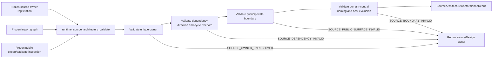
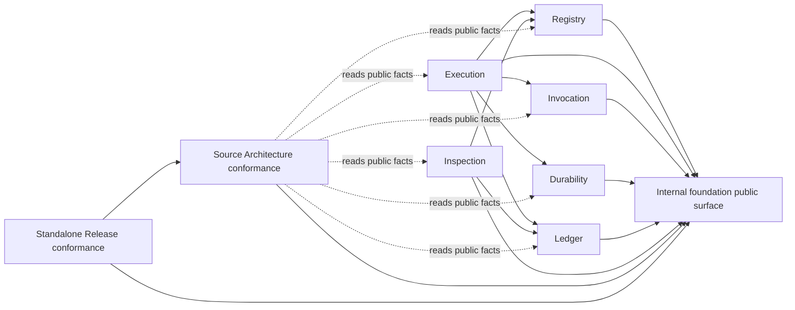

# Agent Runtime Source Architecture

## 0. Intent Capsule

```yaml
layer: T2
status: candidate
canonical_owner: designDoc/agent_runtime_02_product_target_topology.md
parent: designDoc/agent_runtime_00_execution_charter.md
owned_system_object: Runtime source architecture conformance
scope:
  - one primary responsibility owner for each production source unit
  - allowed dependency direction between Runtime responsibilities
  - stable public package surface and private implementation boundary
  - domain-neutral naming and host-dependency exclusion
  - deterministic source-architecture conformance result
non_goals:
  - Registry, Execution, Invocation, Durability, Ledger, or Inspection behavior
  - current source-path inventory, implementation status, or migration progress
  - product deployment topology, tenant isolation, or Agency Platform control plane
  - provider, durable backend, database, framework, or packaging-tool selection
  - release registration, execution, or Software Delivery admission
inputs:
  - frozen code-owned source ownership and Design-owner registration
  - frozen import/dependency graph
  - frozen public export and package-boundary inspection
outputs:
  - Runtime source architecture conformance result
  - exact source/import/public-surface findings with correction owner
truth_surfaces:
  - designDoc/agent_runtime_02_product_target_topology.md
  - code-owned source architecture registration and validators
  - generated source/import/public-surface inspection
runtime_triggers:
  - pre-implementation architecture check
  - pre-release source and package conformance check
downstream_consumers:
  - Runtime responsibility owners
  - Engineering review and Software Delivery gates
open_decisions: []
review_gate: independent design_contract_reviewer review and accountable Source Architecture owner decision before implementation
runtime_surface_ledger: generated from code-owned source registration, import graph, and public exports
verification_hooks:
  - unique source-owner and Design-owner tests
  - allowed dependency and cycle tests
  - public export and private-import tests
  - host/domain dependency exclusion tests
  - clean install/import conformance tests
```

## 1. Primary System Flow



## 2. User Intent

Runtime 源码可以在不改变业务语义的情况下被维护、拆分和独立发布，同时每个 source unit 只有一个
Runtime responsibility owner，跨 responsibility 依赖只经过稳定 public surface。实现便利、当前目录和
host repository 不能反向决定 Runtime authority。

## 3. Reader Gain

- Runtime Maintainer 能判断一个 source unit 属于哪项 Runtime responsibility，以及谁负责修正越界。
- Runtime Module Owner 能只依赖稳定 Runtime public surface，不读取 sibling private implementation。
- Package Maintainer 能判断 clean install 后哪些 exports 必须存在，哪些 host/domain imports 必须消失。
- Engineering Reviewer 能用同一份机械结果发现 duplicate ownership、反向依赖、cycle 和 public-surface drift。

## 4. Capability and Operation

本 T2 拥有一个 `Runtime source architecture conformance` capability。它接收 code 生成的冻结事实，执行：

1. 把每个 production source unit 解析到唯一 primary responsibility 与 owning Design contract；
2. 校验跨 responsibility import/dependency 只沿 parent T1 允许的方向；
3. 校验 stable public export 与 private implementation boundary；
4. 校验 Runtime core 不依赖 host product、domain Skill tree、editable authoring source 或业务数据库实现；
5. 返回 deterministic conformance result，不修改 source 或替 owner 选择迁移方案。

Source unit 的 exact path、language、module system 和 build tool 属于 code truth。Design 只固定必须成立的
ownership、direction、surface 和 isolation result。

### 4.1 Structural Ownership Cutover

本 candidate 是 target T2 02 的唯一 Source Architecture owner。Predecessor 02 的 product deployment、
Dedicated Cell、pooled tier、credential domain、tenant data placement 和 durable-backend product admission
属于 Agency Platform、Data Governance 或 Software Delivery，不进入 Runtime T2 02。其保留或退役由真实
owner 另行决定；本 candidate 不复制这些 peer contracts。

## 5. Source Ownership

每个 production source unit 必须有且只有一个 primary owner：Registry、Execution、Invocation、Durability、
Ledger、Inspection、Source Architecture 或 Standalone Release。Owner registration 同时解析到 exact Design
contract ref；一个 source unit 不能用多个 owner refs 表示“共享负责”。

Source Architecture validator、source registration、import/public-surface inspection 和 internal foundation
primitives 归本 T2 02；standalone package builder、package inspection 和 release-conformance source 归 T2 05。
T2 05 消费本 T2 的 passing `source_architecture_conformance_result`，再判断 package unit、clean install 和 Design
bundle closure。Public export 无 owner、缺失、重复、private re-export 或无法从 frozen package inspection
解析时，由本 T2 返回 `SOURCE_PUBLIC_SURFACE_INVALID`；T2 05 不把它改写为 package failure。

Provider-neutral canonical serialization、hash、name 和 Schema-validation primitive 可以标为 internal
foundation。其 source primary owner 与 Design owner 分别是 Source Architecture 和本 T2 02。Foundation 只
提供无业务状态的 deterministic primitive，不成为第七项 Runtime responsibility，也不能拥有 release、
execution、provider、durability、ledger 或 inspection behavior。

Generated file 继承其 canonical source 的 owner。Generator、generated output 和 parity gate 必须可解析到
同一个 semantic owner；generated output 不能成为第二份 editable authority。

## 6. Dependency Direction

允许的逻辑方向是：



箭头表示左侧 source consumer 依赖右侧 public surface；不是 runtime call sequence。稳定规则是：

- Registry、Execution、Invocation、Durability、Ledger、Inspection、Source Architecture 和 Standalone
  Release 都可以依赖 internal foundation public surface；foundation 不反向依赖任何责任；
- Registry 不依赖 Invocation、Durability、Ledger、Inspection 或 host authoring discovery；
- Invocation、Durability 和 Ledger 不读取 Execution private implementation；Execution 通过公开 contract
  调度它们；
- Ledger 不依赖 provider/tool-specific result type；它接收 Runtime-owned typed facts；
- Inspection 只读取 Registry 与 Ledger public facts；不依赖 Execution、Invocation 或 Durability private state；
- Source Architecture 与 Standalone Release 只读公开 facts 做 conformance，不进入 work-plane call graph；
- 任意 source import cycle 都是 conformance failure，不能用 lazy import、runtime patch 或 re-export 隐藏。

## 7. Public and Private Surface

Runtime package root 只导出宿主与 domain plugin 实际需要的 stable、domain-neutral interfaces、types 和
builders。一个 export 的 owner、Design contract 与 compatibility obligation 必须可从 code-owned registration
解析；README、测试 import 或当前调用次数不能单独创建 public authority。

Sibling responsibility 只能 import 对方 public surface。Private source 可以在同一 owner 内重构，不承担跨
responsibility compatibility。Re-export 不得绕过 owner、制造第二个 canonical path，或把 host/domain symbol
带入 Runtime root。

Clean installed package 必须在没有 repository root、editable finder、host source tree 或 generated build
workspace 的环境中解析所有 public exports。检测到 ambient authoring tree 只能失败，不能 fallback。

## 8. Naming and Host Isolation

Runtime core identifier 描述 Runtime responsibility 或 provider-neutral role，不编码 project、tenant、domain、
repository layout 或当前 vendor。Provider/backend-specific implementation 只能位于显式 adapter/binding
surface，并实现 provider-neutral public contract。

Runtime production source 不扫描、读取或解析 host Skill folder、Design folder、manifest prose 或 sibling
repository。Host adapter 在 Runtime 边界外把受治理 source 编译成 repository-independent candidate，再通过
Registry public interface 提交。

## 9. Public Interface and Effects

| `interface_id` | Input | Successful output | Effect | Errors |
| --- | --- | --- | --- | --- |
| `runtime_source_architecture_validate` | frozen source-owner/Design-owner registration, import graph, public exports, and package-boundary inspection | `source_architecture_conformance_result` bound to exact input hashes | none; read-only validation | `SOURCE_ARCHITECTURE_INPUT_INVALID`, `SOURCE_OWNER_UNRESOLVED`, `SOURCE_DEPENDENCY_INVALID`, `SOURCE_PUBLIC_SURFACE_INVALID`, `SOURCE_BOUNDARY_INVALID` |

该 interface 是 build/review/release gate，不是 Runtime execution operation。它只能报告 exact evidence 和
correction owner，不能编辑 source、重写 Design 或准入 software release。

## 10. Completion, Failure, and Recovery

| `error_code` | Condition | Meaning | Caller action |
| --- | --- | --- | --- |
| `SOURCE_ARCHITECTURE_INPUT_INVALID` | required frozen registration、import graph、export inspection 或 input hash 缺失/不一致 | 未形成可信 conformance result | 重新生成完整冻结输入后重跑 |
| `SOURCE_OWNER_UNRESOLVED` | source unit 无 owner、有多个 primary owner、Design owner 不可解析，或 generated/source owner 不一致 | ownership closure 失败 | 返回真实 Runtime/Design owner，修 registration 或 source boundary |
| `SOURCE_DEPENDENCY_INVALID` | import/dependency 反向、越过 public surface、形成 cycle，或 conformance capability 进入 work-plane graph | dependency direction 失败 | 由 importing owner 改用 public contract 或移动 source；不得加 shim 隐藏 |
| `SOURCE_PUBLIC_SURFACE_INVALID` | public export 无 owner、缺失、重复、经 private re-export 绕路，或 clean install 无法解析 | package public contract 失败 | 返回 export owner；修 canonical export 或 package closure |
| `SOURCE_BOUNDARY_INVALID` | Runtime core 依赖 host/domain/editable authoring source，或 neutral core identity 编码 project/vendor | product boundary 失败 | 返回 importing/naming owner；移到 host adapter 或 provider binding |

Completion 要求所有 production source units 唯一归属、import graph 无 cycle 且只沿允许方向、public exports
解析到唯一 owner、clean install 无 ambient dependency，并且 conformance result 绑定 exact input hashes。

Recovery 只修 source、registration、public export 或 generated inspection，再对新冻结输入重跑。旧 failure
不能靠忽略 path、缩小扫描范围或添加兼容 shim 变成 pass。

## 11. Dependencies and Verification

Allowed dependencies：

- parent T1 responsibility/dependency law；
- Runtime-owned code registration and generated source/import/export inspection；
- package metadata and clean installed public export inspection；
- canonical deterministic serialization/hash/name/Schema primitives。

Prohibited dependencies：

- peer T2 private implementation as validation authority；
- host product、domain Skill、business database、provider session 或 repository memory；
- editable prose token、directory proximity 或 current import success as semantic ownership evidence；
- Software Delivery verdict、Reviewer prose 或 test count as Design authority。

最低 verification closure：

1. every production source unit has exactly one primary owner and one Design owner；
2. missing、duplicate、wrong-Design and generated-owner mismatch negatives；
3. allowed-edge positives and reverse-edge/cycle/private-import negatives；
4. public export canonicality、missing/duplicate/re-export negatives；
5. clean wheel/install/import without repository or editable finder；
6. host/domain authoring-tree import and discovery negatives；
7. provider-specific binding replacement without neutral-core import change；
8. deterministic same-input result and exact-hash drift detection。

## 12. References

- [Agent Runtime Charter](the_charter.md)
- [Agent Runtime T0](the_agent_runtime.md)
- [Agent Runtime Domain Root](agent_runtime_00_execution_charter.md)
- [Registry](agent_runtime_01_module_contract_and_assembly.md)
- [Standalone Release Conformance](agent_runtime_05_delivery_roadmap.md)
- [Design Doc Management](the_design_doc_management.md)
