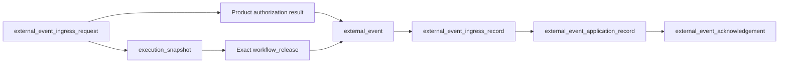
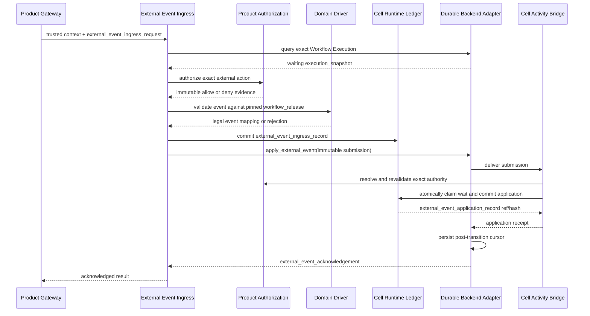

# Authorized External Event Ingress Contract

**Purpose**: Define the single Runtime boundary that accepts an externally
authorized action for a waiting Workflow Execution and applies one legal event
to its exact pinned `workflow_release`.

**Required reader gain**: A reader can distinguish authorization of an
external action, domain validation of a graph transition, durable acceptance of
an event intent, application of that event, and backend acknowledgement. The
reader can implement the boundary without importing a user interface, human
role, content-quality rule, or provider callback secret into Runtime.

## 0. Contract Capsule

```yaml
layer: T1
status: proposal
canonical_owner: designDoc/agent_runtime_03_authorized_external_event_ingress.md
parent: designDoc/the_agent_runtime.md
scope:
  - trusted external-action intake for a waiting Workflow Execution
  - exact Product Authorization evidence binding
  - domain validation against the execution-pinned Workflow Release
  - durable ingress, application, and acknowledgement identities
  - optimistic concurrency, idempotency, replay, and reconciliation
non_goals:
  - authentication, browser, form, notification, or human-task interface design
  - Principal, Entitlement, policy, delegation, or grant issuance
  - content-quality evaluation or revision policy
  - publication or another canonical side effect
  - durable-backend implementation internals
inputs:
  - designDoc/the_agent_runtime.md
  - designDoc/agent_runtime_00_execution_charter.md
  - designDoc/agent_runtime_07_temporal_durable_adapter_contract.md
  - designDoc/agent_runtime_09_authorization_integration_contract.md
  - designDoc/product_authorization_00_service_and_persistence_contract.md
outputs:
  - external_event_ingress_request
  - external_event
  - external_event_ingress_record
  - external_event_application_record
  - external_event_acknowledgement
implementation_surfaces:
  - src/agent_runtime/contracts/registry_workflow_definition.py
  - src/agent_runtime/execution/execution_event_ingestion.py
  - tests/test_agent_runtime_external_event_ingress.py
review_gate: design review, deterministic contract tests, and independent engineering review
```

## 1. Authority Boundary

This contract connects four peer authorities. It owns their interaction order.

| Decision or record | Canonical owner | Runtime ingress responsibility |
| --- | --- | --- |
| Authenticated subject and trusted request context | Identity and Session plus Product Gateway | Consume trusted server-side context; reject caller-selected tenant, Cell, or Principal expansion |
| External-action allow or deny, execution Principal, and validity | Product Authorization | Resolve exact immutable decision evidence; issue no authority |
| Legal event type, current wait policy, target state, and graph edge | Owning domain contract and exact `workflow_release` | Invoke the registered Domain Driver and verify structural closure |
| Cursor, waiting state, event delivery, and durable acknowledgement | Durable Backend Adapter | Use `apply_external_event`; preserve content-free durable state |
| Ingress and application evidence | Agent Runtime | Commit immutable ref-and-hash records with single-writer and idempotency law |

Authorization and domain legality are independent predicates. Product
Authorization may allow an action that is illegal in the current graph state.
A legal graph edge may exist for a Principal who lacks authority. Runtime
creates an `external_event` only after both predicates pass.

No PM, reviewer, approver, browser, form, or Agent persona exists at this
boundary. A product may present any interface upstream as long as the Gateway
submits the same typed request and immutable decision Artifact reference.

## 2. Object Model



The records have distinct meanings:

| Object | Meaning | It does not prove |
| --- | --- | --- |
| `external_event_ingress_request` | One typed caller intention with a stable idempotency identity and caller-seen execution token | Authorization, domain legality, delivery, or application |
| `external_event` | One content-free event derived from exact authorization and the pinned graph | Durable acceptance or cursor movement |
| `external_event_ingress_record` | The Cell Runtime ledger accepted one immutable outbox intent | Backend delivery or graph application |
| `external_event_application_record` | One Cell-local serializable claim won and applied the waiting transition | Later workflow completion or domain artifact acceptance |
| `external_event_acknowledgement` | The durable backend persisted the post-application cursor and returns the exact application identity | A second authority decision |

Exact dataclass fields, canonical serialization, hash bodies, database columns,
and validators are code-owned. Every implementation must preserve the logical
closures in §2.1 through §2.4.

### 2.1 Request closure

The request closes over:

- one stable `ingress_request_id` and `idempotency_key`;
- one exact `workflow_execution_id`;
- the caller-seen execution snapshot ref, hash, and transition sequence;
- expected domain state and requested event type;
- the decision Artifact ref and hash.

Tenant, Cell, and actor Principal come only from trusted server-side request
context. The caller cannot supply a target state or graph edge.

### 2.2 Event authority closure

The event binds:

- the exact request identity and content hash;
- the exact Product external-action request and decision refs and hashes;
- the exact `execution_authorization_context_binding` ref and hash;
- the exact waiting execution snapshot and transition sequence;
- the exact `workflow_release`, graph, and wait-policy refs and hashes;
- the domain-derived target state and event type;
- the decision Artifact ref and hash;
- the decision validity and required current-status evidence.

The event contains no Entitlement body, policy statement, credential, Source
content, free-text decision body, or provider session.

### 2.3 Ingress and application closure

The ingress record repeats the complete event identity and authority closure so
the Cell ledger can reconstruct the accepted intent without a caller payload or
durable-backend history.

The application record additionally binds:

- the exact ingress record ref and hash;
- the pre-application execution snapshot;
- the current authorization-binding status evidence;
- the current execution-control fence;
- the exact wait claim and post-transition snapshot lineage;
- the durable backend and backend execution identities.

The application record is written in the same serializable Cell transaction
that claims the wait transition. An ingress receipt cannot substitute for this
record.

### 2.4 Time semantics

Each persisted Product, Runtime, Cell, and backend record receives its own
owning-ledger commit time. Cross-system validity checks use the execution-pinned
distributed-clock profile and the conservative predicate defined by the
Timestamp Semantic Contract. A bare comparison between Product and Cell wall
clock values is insufficient.

## 3. Interaction Protocol



The required order is:

1. Resolve trusted request context and the caller-seen execution token.
2. Resolve the exact Workflow Execution and require `runtime_status=waiting`.
3. Resolve the exact admitted `workflow_release` from the Runtime Release
   Registry. Never resolve `latest` inside the execution.
4. Obtain Product Authorization's exact external-action result. A deny ends the
   request without an event or graph effect.
5. Ask the Domain Driver to validate the event type against the pinned wait
   policy and derive the only legal target state.
6. Commit one immutable `external_event_ingress_record` before contacting the
   durable backend.
7. Call the backend's acknowledged `apply_external_event` operation with only
   the event and ingress refs and hashes.
8. In the Cell Activity Bridge, resolve the Product records again, require a
   currently valid execution binding and open control fence, require the
   caller-seen snapshot token to equal the current wait, and atomically commit
   `external_event_application_record` with the wait claim.
9. Return success only after the backend persists and returns the exact
   post-transition acknowledgement.

The Activity Bridge repeats authorization validation because authority may
expire or be invalidated after ingress commit and before application. It does
not repeat the policy decision with a new identity or broaden the action.

## 4. Idempotency and Reconciliation

One logical external action keeps the same `ingress_request_id`,
`idempotency_key`, request hash, event ID, and ingress record across transport
retries. A second real action receives new identities even when its business
fields are identical.

| Observed state | Required behavior |
| --- | --- |
| Product response lost | Resolve or retry the exact Product request identity; return the original decision |
| Ingress record exists and application is absent | Revalidate current authority and wait ownership, then resubmit the same immutable event |
| Application exists and backend response is lost | Return the original application and acknowledged snapshot; create no second transition |
| Same idempotency identity with different content | Fail closed as an idempotency conflict |
| Authority expired or invalidated before application | Preserve ingress as non-consumable audit evidence; apply no transition |
| Workflow left and returned to the same named state | Reject the stale caller token because snapshot identity or transition sequence changed |

The reconciler anti-joins ingress records to application records. It never
updates an ingress row, mints replacement authority, retries a business action
under new scope, or invents a transition to repair a conflict.

## 5. Failure Contract

| Condition | Result | Workflow effect |
| --- | --- | --- |
| Missing trusted context | Reject before Product Authorization | None |
| Tenant, Cell, Principal, execution, release, or hash mismatch | Reject and audit | None |
| Execution is not waiting | Reject as stale or illegal | None |
| Caller-seen snapshot or transition sequence differs | Reject as `stale_external_action` | None |
| Product decision is deny, expired, invalidated, or unresolvable | Reject with bounded reason and immutable evidence ref | None |
| Event type is absent from the pinned wait policy | Reject as illegal domain request | None |
| Caller attempts to select target state | Reject as scope expansion | None |
| Ingress already committed with identical content | Return or continue the original lineage | At most one transition |
| Application already committed with identical content | Return the original acknowledgement | No second transition |
| Competing wait claim, closed control fence, or authorization loss | Preserve ingress and fail closed | None |
| Backend unavailable after ingress commit | Retry exact submission or reconcile | None until exact application succeeds |

Runtime failure never fabricates a domain `blocked` state. Runtime preserves
the last committed domain state and records a bounded infrastructure outcome.

## 6. Security and Isolation Invariants

1. Caller payloads cannot expand tenant, Cell, Principal, execution, event,
   resource, or target-state scope.
2. Product Authorization decisions are resolved by exact immutable ref and
   hash. Runtime neither interprets Entitlements nor issues grants.
3. Domain Driver cannot turn a denial into an event. Durable Backend cannot
   infer permission from a legal graph edge.
4. The exact `workflow_release` and graph hash are pinned for the execution.
5. Durable history contains bounded identities, refs, hashes, states, and
   timings. It contains no customer content, credentials, policy bodies, or
   provider callback secrets.
6. Only the Cell Activity Bridge writes the application record, and only the
   acknowledged backend operation moves the durable cursor.
7. Authorization invalidation and cancellation serialize against the same
   execution-control fence used by event application.

## 7. Verification Contract

The conformance suite must cover:

- allow, deny, expiry, invalidation, and authorization-service failure;
- stale state, stale snapshot, same-state ABA, stale graph, and stale release;
- cross-Principal, cross-tenant, and cross-Cell reuse;
- forged target state, event type, decision Artifact, and authority hash;
- identical retry before and after application;
- conflicting idempotency reuse;
- crash after ingress commit, after application commit, and after backend
  cursor persistence;
- lost Product, backend, and caller responses;
- competing wait claims and execution-control-fence races;
- content and secret absence from shared Runtime and durable records;
- exact `workflow_release` lookup with no `latest` resolution.

Tests use opaque domain states and typed event mappings. Content-quality
fixtures provide no evidence for this contract.

## References

- [Agent Runtime Contract](the_agent_runtime.md)
- [Agent Runtime Execution Charter](agent_runtime_00_execution_charter.md)
- [Temporal Durable Adapter Contract](agent_runtime_07_temporal_durable_adapter_contract.md)
- [Authorization Integration Contract](agent_runtime_09_authorization_integration_contract.md)
- [Product Authorization Design](product_authorization_00_service_and_persistence_contract.md)
- [Timestamp Semantic Contract](the_timestamp_semantic.md)
