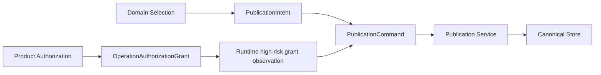

# Publication Transaction Contract

**Purpose**: Define the isolated, idempotent transaction that writes one already-selected immutable artifact to a canonical target after domain publication intent and product authorization have both been established.

**Required reader gain**: A reader can implement publication without importing client interaction, content evaluation, workflow orchestration, or authorization-policy ownership into the Publication Service.

## 0. Contract Capsule

```yaml
layer: T1
status: proposal
canonical_owner: designDoc/agent_runtime_04_publication_transaction_contract.md
parent: designDoc/the_agent_runtime.md
scope:
  - PublicationIntent, Product-issued OperationAuthorizationGrant binding, PublicationCommand, and PublicationOutcome boundaries
  - isolated execution identity and credential
  - independent validation of domain intent and operation authorization
  - artifact-hash verification
  - compare-and-set canonical write
  - idempotency and partial-write recovery
non_goals:
  - content creation, review, evaluation, or selection
  - client interaction or human decision capture
  - principal, role, entitlement, or policy semantics
  - workflow cursor, wait, retry, or recovery
  - canonical artifact schema owned by each domain
inputs:
  - designDoc/the_agent_runtime.md
  - designDoc/agent_runtime_09_authorization_integration_contract.md
  - designDoc/product_authorization_00_service_and_persistence_contract.md
adjacent_engineering_contracts:
  - designDoc/agent_runtime_00_execution_charter.md
  - designDoc/agent_runtime_01_module_contract_and_assembly.md
  - designDoc/agent_runtime_02_product_target_topology.md
outputs:
  - PublicationIntent and Product-grant consumption boundary
  - PublicationCommand schema
  - PublicationOutcome schema
  - publication state machine and recovery contract
truth_surfaces:
  - designDoc/agent_runtime_04_publication_transaction_contract.md
planned_truth_surfaces:
  - src/agent_runtime/side_effects/publication.py
  - tests/test_agent_runtime_publication.py
runtime_triggers: none
downstream_consumers:
  - domain publication dispatchers
  - Agent Runtime authorization coordinator
  - Publication Service and canonical-store adapters
open_decisions: none
review_gate: document self-review before handoff; engineering-project-review after implementation commit
runtime_surface_ledger: proposed only; planned publication implementation and test paths are not admitted
verification_hooks: none; no implementation or conformance test is admitted for this proposal
```

## 1. Ownership Boundary

Publication Service performs one controlled side effect. It does not decide which content is correct, which artifact should be selected, whether a principal may request an action, or which workflow state follows.

The upstream domain contract produces a `PublicationIntent` bound to an
immutable `Selection`, source artifact hash, canonical target, and expected
version. Product Authorization issues an `OperationAuthorizationGrant` for the
exact publication request and intent hash. Runtime commits the matching
protected-operation intent and records the opaque grant reference before
dispatch. Runtime does not convert a decision into a grant or mint publication
authority.

The Publication Dispatcher creates a `PublicationCommand` only when both records exist. Publication Service verifies the intent, grant, source, and target before it executes the write. It cannot broaden the write set or alter content.

For this operation the Publication Service is the target Policy Enforcement
Point. Product Authorization issues or introspects the grant but does not
consume the protected side effect. The Publication Service atomically consumes
the grant token plus command idempotency key in its own transaction ledger.



## 2. Typed Records

```python
@dataclass(frozen=True)
class PublicationIntent:
    publication_intent_ref: str
    workflow_execution_id: str
    selection_ref: str
    source_artifact_ref: str
    source_artifact_sha256: str
    canonical_target: str
    expected_canonical_version: str | None
    domain_contract_version: str
    recorded_at_utc: str


@dataclass(frozen=True)
class PublicationCommand:
    command_id: str
    workflow_execution_id: str
    selection_ref: str
    publication_intent_ref: str
    publication_intent_sha256: str
    operation_authorization_grant_id: str
    operation_authorization_grant_sha256: str
    authorization_request_sha256: str
    source_artifact_ref: str
    source_artifact_sha256: str
    canonical_target: str
    expected_canonical_version: str | None
    idempotency_key: str
    contract_version: str
    recorded_at_utc: str


@dataclass(frozen=True)
class PublicationOutcome:
    command_id: str
    status: Literal["committed", "already_committed", "conflict", "failed"]
    selection_ref: str
    publication_intent_sha256: str
    operation_authorization_grant_id: str
    operation_authorization_grant_sha256: str
    idempotency_key: str
    source_artifact_sha256: str
    canonical_target: str
    preimage_ref: str | None
    postimage_ref: str | None
    canonical_version: str | None
    recorded_at_utc: str
```

The Product-issued grant additionally binds issuer, audience, execution
Principal, tenant, Cell, Workflow Execution/Module Run/Execution Variant/Attempt lineage, action
`canonical.publish`, publication-intent hash, logical target-scope version/hash,
request hash, validity, unique grant-token ID, and the same idempotency key as
the command. Its signed proof or opaque-introspection handle travels only in the
secure service envelope and is never written into the Runtime or durable
backend ledger.

The idempotency key is derived from `workflow_execution_id + publication_intent_sha256 + source_artifact_sha256 + canonical_target`. It is not supplied by a client or Agent.

## 3. Publication Transaction

```mermaid
sequenceDiagram
    participant DISPATCH as Publication Dispatcher
    participant SERVICE as Publication Service
    participant INTENTS as Publication Intent Store
    participant ARTIFACTS as Immutable Artifact Repository
    participant AUTHZ as Product Authorization Introspection
    participant CANONICAL as Canonical Store
    participant LEDGER as Publication Ledger

    DISPATCH->>SERVICE: PublicationCommand
    SERVICE->>LEDGER: Reserve idempotency key
    LEDGER-->>SERVICE: New or existing transaction state
    SERVICE->>INTENTS: Read intent ref and verify intent hash, Selection, source, target, version
    INTENTS-->>SERVICE: Verified immutable PublicationIntent
    SERVICE->>AUTHZ: Verify issuer/proof or introspect opaque grant
    AUTHZ-->>SERVICE: Valid grant facts; no side-effect consumption
    SERVICE->>LEDGER: Atomically consume grant token for command/idempotency key
    LEDGER-->>SERVICE: New consumption or same-command replay
    SERVICE->>ARTIFACTS: Read and hash source artifact
    ARTIFACTS-->>SERVICE: Immutable artifact + verified hash
    SERVICE->>CANONICAL: Compare-and-set expected version
    CANONICAL-->>SERVICE: Preimage, postimage, canonical version
    SERVICE->>LEDGER: Commit PublicationOutcome
    SERVICE-->>DISPATCH: Outcome ref
```

## 4. Transaction States

| State | Meaning | Permitted successor |
| --- | --- | --- |
| `reserved` | Idempotency key is owned by one command | `intent_verified`, `failed` |
| `intent_verified` | Intent hash, Selection, source, target, and expected version match the command | `grant_verified`, `failed` |
| `grant_verified` | Product grant proof is current and bound to the exact request/intent/target; Publication Service has atomically consumed the token for this command | `source_verified`, `failed` |
| `source_verified` | Source ref and content hash match the command and intent | `write_started`, `failed` |
| `write_started` | Canonical compare-and-set was issued | `committed`, `reconciling` |
| `reconciling` | Process lost certainty after issuing the write | `committed`, `conflict`, `failed` |
| `committed` | Canonical version and postimage are recorded | terminal |
| `conflict` | Expected canonical version did not match | terminal |
| `failed` | No canonical commit occurred or recovery proved failure | terminal |

## 5. Recovery Rules

1. A retry first reads the Publication Ledger by idempotency key.
2. `committed` returns the existing outcome without another canonical write.
3. `write_started` enters reconciliation and queries the Canonical Store before retrying.
4. A matching canonical postimage completes the existing transaction.
5. A different canonical version returns `conflict`; it never overwrites the newer value.
6. Missing intent, Selection mismatch, source-hash mismatch, grant or Runtime observation
   mismatch, untrusted issuer/audience/proof, expiry, conflicting grant-token
   consumption, target-scope mismatch, or contract-version mismatch fails
   before write.
7. Backend workflow retry guarantees do not replace this transaction state machine.

## 6. Isolation Invariants

1. Publication Service uses a deployment identity and credential unavailable to Agent workers, client applications, and the Durable Workflow Orchestrator.
2. Only a typed `PublicationCommand` carrying an immutable domain intent,
   Product-issued operation grant, and committed Runtime protected-operation
   observation is accepted.
3. Publication Service never invokes a model, search provider, Agent execution adapter, or evaluator.
4. Canonical Store rejects writes from every non-publication principal.
5. Publication Ledger, preimage, postimage, and outcome are sufficient to reconcile a crash at every transaction boundary.

## 7. Verification Contract

The implementation test suite must cover duplicate command, conflicting
duplicate, Selection mismatch, intent-hash mismatch, source-hash mismatch,
missing or expired grant, missing Runtime observation, issuer/audience/proof mismatch,
conflicting single-use grant consumption, target-scope version/hash mismatch,
stale expected version, crash before write, crash after write before ledger
commit, canonical conflict, credential isolation, and exact replay of a
committed command.
