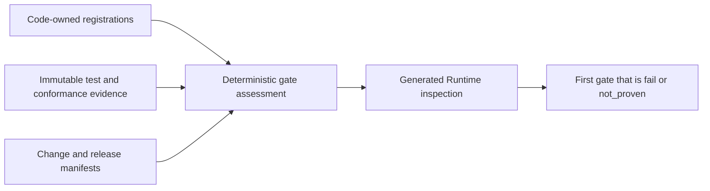
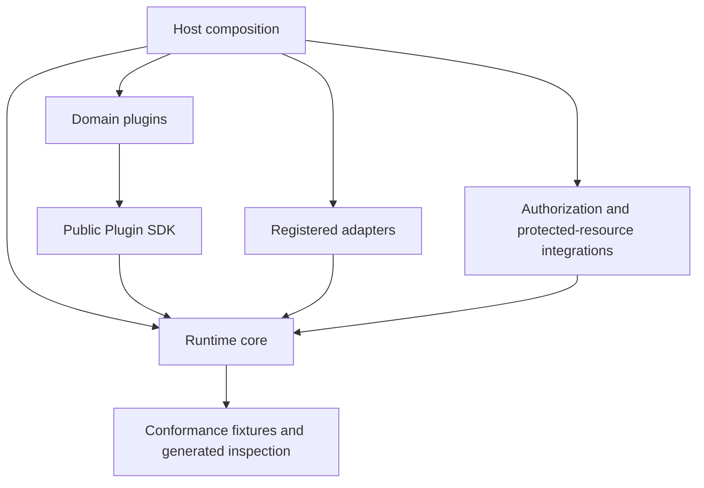
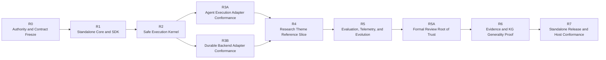

# Agent Runtime Delivery Contract and Roadmap

**Purpose**: Define the dependency order, parallel work boundaries, and
measurable release gates for delivering Agent Runtime as a standalone,
business-neutral infrastructure product.

**Required reader gain**: A reader can identify the next unproven delivery gate,
start a bounded work package, and verify its exit without relying on chat
history, a manually maintained implementation inventory, or a concrete model,
provider, or durable backend.

## 0. Contract Capsule

```yaml
layer: T1
status: active_draft
canonical_owner: designDoc/agent_runtime_05_delivery_roadmap.md
parent: designDoc/the_software_delivery.md
scope:
  - target Runtime distribution and module boundaries
  - dependency-ordered delivery gates and measurable exit criteria
  - bounded parallel workstreams and acceleration rules
  - first-domain vertical slice and second-domain generality proof
  - standalone release and Agency Platform host-conformance handoff
non_goals:
  - current implementation, admission, backend, provider, model, profile, or deployment status
  - domain roles, graph meaning, content-quality rules, or business terminal decisions
  - product topology, user interface, entitlement policy, or data-placement policy
  - sprint history, staffing plan, or session handoff log
governing_t0_portfolio: host-supplied adjacent authority; not owned by this package
inputs:
  - adjacent authority references declared by designDoc/the_agent_runtime.md
  - Agent Runtime T1 specialization set resolved from designDoc/the_agent_runtime.md
outputs:
  - stable gate order and exit criteria
  - work-package dependency and merge boundaries
  - release-evidence requirements
truth_surfaces:
  - designDoc/agent_runtime_05_delivery_roadmap.md
  - src/agent_runtime/registry/registry_architecture_registration.py
  - src/agent_runtime/inspection/inspection_architecture_rendering.py
  - tools/build_agent_runtime_design_contract_bundle.py
runtime_triggers: none
downstream_consumers:
  - Runtime implementation and adapter workstreams
  - domain plugin owners
  - Contract Assurance and Software Delivery gates
open_decisions: []
review_gate: design self-review, Contract Assurance conformance, and Software Delivery admission
runtime_surface_ledger: mutable implementation and gate status is code-owned and generated; absence of evidence means not_proven
verification_hooks:
  - deterministic Runtime inspection and registry validation
  - gate-scoped contract, conformance, isolation, recovery, and release evidence
```

## 1. Delivery Outcome and Authority Inputs

The target is an independently publishable Runtime that registers domain-owned
plugins, executes their opaque graphs through replaceable adapters, and records
complete execution, evaluation, recovery, and release lineage. An Agency
Platform may compose the Runtime, but the standalone package does not import
the host product or any business domain.

The host supplies its admitted T0 portfolio. This standalone package records
adjacent authority references without importing the host's registry or generated
projections. Each peer T0 contributes only its owned system-wide constraint:

| Peer T0 | Delivery constraint |
| --- | --- |
| Agency Platform | Owns host composition, Workflow Control Plane, and product delivery placement. |
| Agent Runtime | Owns the portable Agent execution substrate and extension contracts. |
| Product Authorization | Decides workflow eligibility, exact execution authority, and protected operations. |
| Task Routing | Selects one logical product or domain owner without selecting an executable target. |
| Artifact Graph | Owns cross-workflow Artifact identity, lineage, dependency, and readiness. |
| Data Governance | Owns placement, isolation, lifecycle, migration, and recovery constraints. |
| Timestamp Semantics | Owns time-field, clock, calendar, and freshness law. |
| Design Doc Management | Owns approved Intent lifecycle. |
| Contract Audit | Owns external Independent Review evidence. |
| Software Delivery | Owns software change and release admission. |

Compatibility pointers carry no delivery authority. A host T0 portfolio change
is accepted through that host's authority process, then evaluated here as a
change to the first affected Runtime gate.

## 2. Status and Evidence Ownership

This document owns gate meaning, dependency order, and exit criteria. It does
not own the mutable answer to whether a gate currently passes.



The generated assessment must bind the gate criteria version, source revision,
required evidence references, observed evidence references, verdict, and
`recorded_at_utc`. Allowed verdicts are `pass`, `fail`, and `not_proven`.
Missing, stale, mismatched, or non-reproducible evidence resolves to
`not_proven`. Markdown, comments, issue labels, or a prior review narrative
cannot promote a gate.

Concrete registrations, adapter selections, releases, admission states,
versions, test commands, and current readiness belong to code-owned registries,
immutable evidence, and generated inspection. Until the inspection can project
a fact, the roadmap makes no positive implementation claim about it.

The package-owned architecture and surface inventory is inspectable without
Prompt or tenant content through:

```bash
python -m agent_runtime.inspection.inspection_release_rendering --format surface-json --pretty
python -m agent_runtime.inspection.inspection_release_rendering --format surface-markdown
```

## 3. Target Distribution Boundary

The target separates portable core, public SDK, registered extensions, domain
plugins, and host composition. Physical package names and release-unit
membership remain Software Delivery registration facts. Diagram arrows mean
that the source loads or depends on the target through a public contract.



Core owns portable execution mechanics. The SDK exposes domain registration.
Adapters implement replaceable service-provider interfaces. Domain plugins own
business semantics. Host composition selects compatible releases and
integrates external authorization and protected-resource services.

### 3.1 Architecture convergence order

Runtime completion is a hard cutover, not the accumulation of compatibility
layers. Code convergence follows this order:

1. Register every shipped file in the canonical architecture map defined by
   `agent_runtime_06`; reject cross-layer imports and unclassified files.
2. Separate repository candidate compilation from production Release Registry
   loading. Production loads PostgreSQL authority; only registration tooling
   reads local Skill, Prompt, contract, or Schema paths.
3. Make registration one atomic `load current -> merge candidate -> validate ->
   persist` transaction. A partial candidate snapshot can never replace global
   active pointers.
4. Remove the predecessor Workflow registry, authorization records, topology
   snapshot, execution path, backend contracts, inspection commands, package-
   initializer re-exports, and tests only after their target Release and
   Execution equivalents pass the same behavioral cases.
5. Reduce the public package to one release model, one execution object model,
   one adapter port family, one normalized failure taxonomy, and one inspection
   model. The shadow `ModuleExecutor` seam must retire into the canonical
   `AuthorizedAgentExecutionAdapter` DTOs before production admission.
   Duplicate names retained only for import compatibility remain a failed
   completion gate.
6. Run standalone packaging, PostgreSQL concurrency, Temporal recovery,
   provider conformance, authorization isolation, Prompt and Schema drift,
   Inspector no-Git-read, and representative domain vertical-slice tests.
7. Regenerate implementation status and conduct an independent architecture
   review. Any `predecessor_nonconformant` surface or unresolved authority,
   durability, isolation, or public-API blocker prevents release.

This order distinguishes necessary migration work from local cleanup. A
failure is fixed at its owning abstraction. It is not hidden by adding a new
DTO, Registry, Service, fallback lookup, or documentation-only exception.

## 4. Gate Dependency Graph



### Hard-cutover verification matrix

The Module model is admitted atomically. The
release change set cannot close until all rows below pass. Test selection and
current results are code-owned evidence; this table defines the required
classes and their failure meaning.

| Test class | Required proof |
| --- | --- |
| Removed-surface scan | Forbidden former symbols are absent from active source, public imports, Registries, generated inspection, built wheel, and product Runtime packages. |
| Contract construction | Every Prompt Bundle, Execution Profile, Module Release, Workflow Release, admission, Module Run, Variant, Attempt, outcome, and resolution accepts valid exact-hash input. |
| Contract rejection | Missing, mutable, duplicate, stale, unhashed, cross-release, unknown, extra-field, and wrong-type inputs fail closed. |
| Graph closure | Linear, branch, fan-out, fan-in, loop, external wait, and terminal graphs validate; unreachable nodes, missing routes, forged targets, and ambiguous outcome routes fail. |
| Registration and release | Independent Module sources from one Skill, Module reuse across workflows, atomic promotion, supersession, rollback, duplicate registration, and dependency closure behave deterministically. |
| Execution lineage | Standalone and graph-bound Module Runs record sibling Variants, Attempt-start-before-call, terminal Attempts, outputs, usage, evaluation, Selection, and resolution. |
| Idempotency and recovery | Duplicate request, payload collision, crash before/after provider call, response loss, stale claim, late result, replay, cancellation, and retry never duplicate a committed effect. |
| Authorization and isolation | Missing or stale decision, grant mismatch, invalidation, cross-tenant, cross-Cell, cross-execution, and entitlement change fail closed. |
| Prompt and context boundary | Static release material remains global; authorized dynamic material remains Cell-local; sibling Variants and incompatible providers never share opaque context. |
| Adapter conformance | Every admitted model and durable adapter preserves exact refs, normalized failures, unknown usage fields, and domain blindness. |
| Persistence | Postgres round trip, append-only conflict, transaction rollback, concurrent promotion, restart recovery, and historical-row migration preserve identity. |
| Packaging and architecture | Clean install imports without domain or provider extras; dependency-direction, secret, content-leak, and public-API checks pass. |
| Product workflows | Research Theme, Source-to-Evidence, and Evidence-to-Thesis each execute their registered graph, including revision loops and external waits, through exact Module Releases. |
| Durable integration | The Temporal two-Cell fixture proves start reconciliation, update acknowledgement, replay, namespace isolation, and pinned-release recovery. |

No test class may be represented by one positive fixture alone. Each contract
boundary requires at least one accepted case and one rejection case; identity,
authorization, isolation, persistence, and recovery boundaries require the
specific adversarial cases listed above.

### Gate R0: Authority and Contract Freeze

Exit evidence proves all of the following:

- the code-owned registered T0 portfolio validates, every Gate R0 candidate is
  explicit, and every compatibility path is
  non-authoritative;
- Agent Runtime T0 and its T1 specializations assign each public identity,
  lifecycle record, adapter seam, authorization interaction, data boundary,
  and clock rule to one canonical owner;
- package dependency direction contains no Runtime-to-domain or
  Runtime-to-host dependency;
- internal conformance has no unresolved authority or public-contract blocker;
- an independent architecture review has a frozen input manifest, immutable
  output, and no unresolved authority or public-contract blocker. Before the
  formal Runtime reviewer is admitted, this evidence is explicitly classified
  as `bootstrap_advisory` rather than formal Runtime evidence.

The independent reviewer is a logical capability. Its provider, model,
execution profile, transport, and context settings are resolved from code and
bound to the immutable review execution. This document selects none of them.
The same architecture subject must be reviewed again through the admitted
Runtime reviewer before a production release gate can close.

### Gate R1: Standalone Core and Plugin SDK

Exit evidence proves all of the following:

- a clean environment installs and imports Runtime core without a host, domain
  plugin, concrete provider adapter, durable backend, or database client;
- source and wheel dependency checks find zero business-domain imports in core;
- registry validation is deterministic, duplicate-safe, version-aware, and
  fail-closed;
- an opaque synthetic plugin passes manifest, graph closure, graph projection,
  registration, and generated-inspection tests;
- host composition loads core, adapters, and plugins explicitly. Discovery
  alone grants no execution authority.

### Gate R2: Safe Execution Kernel

Exit evidence proves all of the following:

- Workflow Execution, Module Run, Module Execution Variant, Attempt,
  `attempt_output_bundle`, `execution_output_ref`, Evaluation, Selection, and
  Module Output Resolution
  lineage is immutable and queryable;
- start admission, backend-start receipt, Module dispatch, Attempt start,
  invocation commit, output resolution, checkpoint, and acknowledgement obey
  one tested commit order;
- every dynamic read, model, tool, search, context, publication, and protected
  effect is preceded by exact Product Authorization evidence and Runtime-local
  binding; Runtime never interprets Entitlement policy;
- tenant, Cell, execution data scope, authorization closure, and clock profile
  remain pinned, while invalidation fences new work, quarantines late output,
  closes context, and prevents resume of the old execution;
- crash-window, duplicate, replay, stale-claim, cancellation, and missing pinned
  release tests preserve at-most-once committed effects and reconstructable
  lineage;
- compatible context may resume inside one Variant, while incompatible or
  cross-provider work reconstructs from exact authorized input refs, including
  admitted Artifact Graph `artifact_instance` refs when applicable, plus the
  resolved prior `execution_output_ref`, in a new Variant.

### Gate R3A: Agent Execution Adapter Conformance

Exit evidence proves all of the following for each admitted adapter release:

- one frozen Variant-bound request produces one immutable terminal result and
  normalized failure classification;
- resolved provider, model profile, adapter revision, context event, tool
  activity, and available input, output, cache-read, and cache-creation usage
  are recorded automatically; unavailable values remain `unknown`;
- no adapter chooses a domain edge, writes domain state, performs canonical
  publication, or authors its own audit record;
- sibling Variants can use different admitted adapters without sharing opaque
  provider context and can be evaluated independently;
- authorization invalidation and late-result races fail closed before output
  resolution.

### Gate R3B: Durable Backend Adapter Conformance

Exit evidence proves all of the following for each admitted adapter release:

- backend history contains only permitted identities, references, hashes,
  cursors, timers, dispositions, and bounded failures;
- start reconciliation, dispatch, retry, external wait, acknowledged event,
  cancellation, invalidation, and recovery preserve Runtime identity and
  append-only commit order;
- response-loss and crash tests resolve one backend execution and one committed
  start receipt or fail closed;
- two isolated Cell fixtures reject cross-Cell namespace, authorization,
  artifact, and clock-evidence reuse;
- the adapter makes no business transition decision and adds no domain type to
  Runtime core.

`agent_runtime_07_temporal_durable_adapter_contract.md` specializes this gate
for one concrete durable backend. Temporal is an extension implementation, not
core law or a mandatory product selection. Its current admission state is
visible only through code-owned registration and generated inspection.

### Gate R4: Research Theme Reference Slice

Exit evidence proves all of the following:

- the Research Theme plugin owns every role, state, graph edge, artifact kind,
  content rubric, revision rule, and terminal business meaning;
- one complete write, independent verification and review, revision loop,
  external wait, authorized continuation, and submit-ready terminal path runs
  through the public Runtime contracts;
- every registered Module can run and be evaluated independently, and sibling Variants share
  an identical input closure;
- domain approval, Runtime output resolution, Product Authorization, and
  canonical publication remain separate decisions;
- the slice writes only to its admitted store and introduces no Theme value or
  dependency into Runtime core.

### Gate R5: Evaluation, Telemetry, and Module Evolution

Exit evidence proves all of the following:

- evaluator isolation, candidate-by-evaluator coverage, veto handling,
  immutable Selection, and output-resolution enforcement work for every
  registered selection policy;
- one generated trace reconstructs execution, context, authorization, model and
  tool activity, tokens, execution outputs, evaluations, failures, recovery, and
  terminal status without Agent-authored logging or protected-body leakage;
- a Module Release can run as a canary, roll back, and preserve or recover
  pinned in-flight executions without in-place mutation;
- entitlement-aware query, operator control, and user interface services
  consume Runtime projections through Agency Platform boundaries rather than
  entering Runtime core.

### Gate R5A: Formal Review Root of Trust

Exit evidence proves all of the following:

- the exact minimum Runtime, reviewer Module, capability binding, and
  assurance evidence bundle is frozen under the code-owned
  `genesis_runtime_reviewer_v1` profile;
- deterministic standalone, authorization, isolation, replay, package, and
  evidence-reference checks pass for that bundle;
- an independent frozen external review and authenticated accountable-owner
  decision produce one append-only `bootstrap_admission_record`;
- the bootstrap scope cannot admit a business workflow, domain Artifact,
  ordinary Runtime release, or a second genesis bundle;
- the bootstrap-admitted reviewer produces normal Runtime evidence for one
  distinct successor reviewer release and its binding, while producing no
  evidence for its own release or binding;
- the successor software release, Runtime reviewer Module, and capability
  binding complete their separate ordinary admission paths;
- the admitted successor produces normal Runtime evidence for every
  bootstrap-admitted surface and the frozen architecture subject, including
  the genesis reviewer release and binding; and
- a terminal `bootstrap_closure_record` binds the complete cross-review evidence
  set and permanently disables the genesis path before Gate R6 begins.

The external review used at Gate R0 remains `bootstrap_advisory`. Gate R5A is a
separate, narrowly scoped root-of-trust ceremony; it cannot retroactively label
that advisory output as formal Runtime evidence.

### Gate R6: Evidence and Knowledge Graph Generality Proof

Exit evidence proves all of the following:

- an Evidence and Knowledge Graph workflow registers and executes through the
  same SDK without importing, inheriting, or naming Research Theme types;
- its graph shape, input assembly, aggregation behavior, artifacts, evaluators,
  and terminal semantics are materially different from the first domain;
- the unchanged Runtime conformance suite covers its execution, authorization,
  context, evaluation, telemetry, recovery, and release lineage;
- every abstraction promoted into Runtime core is justified by both domain
  plugins or by an opaque synthetic conformance requirement.

### Gate R7: Standalone Release and Host Conformance

Exit evidence proves all of the following:

- independently versioned Runtime, SDK, adapter, and plugin release units pass
  clean-install, public-API compatibility, upgrade, rollback, and pinned
  execution recovery tests;
- release evidence includes dependency closure, licence and vulnerability
  checks, software bill of materials, provenance, signatures, secret and
  content-leak checks, canary results, and rollback readiness;
- the frozen architecture subject has a formal independent-review evidence
  reference produced by the admitted Runtime reviewer and accepted under its
  Contract Assurance profile;
- two-Cell host fixtures prove routing, capability binding, authorization,
  storage, backend namespace, clock, and observability isolation through public
  interfaces;
- the standalone repository and distributions contain no host-product or
  business-domain dependency.

Dedicated-Cell production readiness, pooled multi-tenant scale, authentication
federation, customer administration, billing, service-level objectives,
incident response, and user-facing delivery remain Agency Platform release
horizons. Passing this gate does not claim those product horizons are ready.

## 5. Parallel Workstreams and Acceleration Rules

| Workstream | Exclusive primary scope | Starts after | Admission dependency |
| --- | --- | --- | --- |
| Core and SDK | Public contracts, registry, plugin SDK, synthetic fixtures, inspection | Gate R0 | Gate R1 |
| Execution safety | Persistence order, authorization binding, context, recovery, isolation | Gate R1 public contract freeze | Gate R2 |
| Agent adapters | Agent Execution Adapter implementations and conformance | Gate R2 interface freeze | Gate R3A |
| Durable adapters | Durable Backend Adapter implementations and conformance | Gate R2 interface freeze | Gate R3B |
| Domain plugins | Domain graph, driver, schemas, artifacts, evaluators, and store binding | Gate R1 SDK freeze | Gates R4 and R6 respectively |
| Evaluation and operations | Evaluation mechanics, telemetry export, release and update controls | Gate R2 record freeze | Gate R5 |
| Assurance bootstrap | Genesis profile, reviewer bundle, bootstrap admission and closure | Gate R5 execution evidence | Gate R5A |
| Packaging and host conformance | Release units, clean-install fixtures, compatibility, two-Cell host tests | Gate R1 | Gate R7 |

Delivery follows six acceleration rules:

1. Public identity and persistence ordering form the serial trunk. One owner
   merges those contracts before dependent work rebases.
2. Agent adapter and durable adapter work proceed in parallel after Gate R2.
   Neither lane changes the shared records locally.
3. Domain teams may build against the frozen SDK and synthetic adapters while
   shared infrastructure is incomplete. Formal admission waits for the gates
   named in the table.
4. The second domain may prepare its own graph and schemas early. It cannot
   promote a new shared Runtime abstraction until the first slice provides a
   real comparison surface.
5. A blocked workstream proposes the smallest public-contract change to the
   canonical owner. It does not create a compatibility type with new behavior.
6. Every merge regenerates inspection and runs the smallest complete gate-scoped
   evidence set. Broader release claims wait for their registered denominator.

## 6. Deterministic Re-entry

After context compaction or a maintainer handoff:

1. Resolve adjacent T0 lifecycle and admission facts from the composing host's
   authority surfaces; do not infer them from this package.
2. Read `the_agent_runtime.md` and this roadmap for stable intent and gate
   definitions.
3. Generate Runtime inspection from the code-owned registries and immutable
   evidence sources.
4. Select the first dependency-eligible gate whose verdict is `fail` or
   `not_proven`.
5. Read only the T1 specialization and code area that own the failed criterion,
   then open one bounded work package.

Chat plans, terminal history, old implementation tables, and provider sessions
are never re-entry authority. When inspection and prose disagree about mutable
state, inspection governs and the stale prose is removed.
