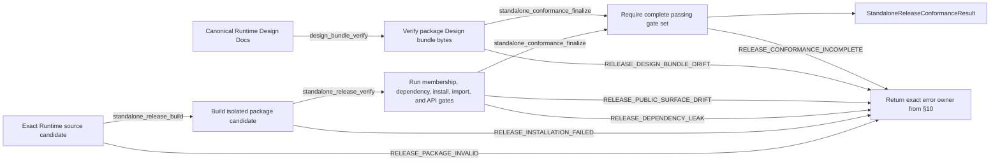

# Agent Runtime Standalone Release Conformance

## 0. Intent Capsule

```yaml
layer: T2
status: candidate
canonical_owner: designDoc/agent_runtime_05_delivery_roadmap.md
parent: designDoc/agent_runtime_00_execution_charter.md
owned_system_object: standalone Runtime release conformance
scope:
  - independently installable Agent Runtime distribution boundary
  - wheel/package membership and dependency isolation
  - public Python API and Runtime-owned Design bundle parity
  - clean-environment installation and import conformance
  - deterministic release-unit evidence for Software Delivery
non_goals:
  - production deployment, rollout, rollback, release admission, or mutable delivery status
  - Runtime execution, Attempt, Ledger, Invocation, Durability, or protected-operation ordering
  - host application, business Workflow, domain Skill, Entitlement, or governed data implementation
  - package index, build backend, operating system, database, or provider product selection
inputs:
  - exact Runtime source candidate and approved package boundary
  - canonical Runtime Design Docs and generated bundle manifest
  - declared public API and dependency constraints
outputs:
  - deterministic standalone release conformance result
  - exact package membership, dependency, Design-bundle, API, install, and import evidence
truth_surfaces:
  - designDoc/agent_runtime_05_delivery_roadmap.md
  - package configuration and code-owned public-surface registrations
  - generated Runtime Design Contract bundle manifest
  - reproducible package and clean-install test evidence
runtime_triggers:
  - Runtime release-unit candidate freeze
  - package membership, dependency, public API, or Design bundle change
  - Software Delivery request for standalone conformance evidence
downstream_consumers:
  - Software Delivery
  - Runtime maintainers and host integrators
open_decisions: []
review_gate: independent design_contract_reviewer review and accountable standalone-release owner decision before implementation
runtime_surface_ledger: generated from exact package candidate and deterministic conformance results
verification_hooks:
  - package membership and forbidden dependency scan
  - clean installation and import smoke
  - public export and source-architecture parity
  - Design Contract bundle byte parity
```

## 1. Primary System Flow



## 2. User Intent

Agent Runtime 能够作为独立产品安装和复用，而不是依赖 Trading Platform、某个业务 Workflow、editable
Skill tree、sibling repository 或开发机 ambient path 才能运行。Standalone conformance 为 Software
Delivery 提供精确证据，但不替它作发布、部署或回滚决定。

## 3. Reader Gain

- Package Maintainer 能判断哪些文件、dependencies、Design bundle 和 public exports 必须进入 release unit。
- Host Integrator 能在空环境安装 Runtime，并只使用公开 API 注册和执行 capability。
- Runtime Maintainer 能定位 package leak、missing member、stale generated bundle 或 API drift。
- Software Delivery Owner 能消费 exact conformance result，而无需把 README 或当前工作树当作 release evidence。
- Engineering Reviewer 能复现同一 package candidate 的完整 gates。

## 4. Capability and Operation

本 T2 只拥有 `standalone Runtime release conformance`。它验证一个 exact source candidate 是否能形成：

1. 内容闭合、无未声明文件的 Runtime package；
2. 不依赖 host product 或 sibling repository 的安装单元；
3. 与 code-owned public-surface registration 一致的公开 API；
4. 与 canonical Runtime Design Docs 字节一致的 packaged Design bundle；
5. 可在 clean environment 中安装、import 和执行最小公开 smoke 的 release-unit evidence。

它不发布 package，不选择版本号，不批准 deployment，也不记录 mutable roadmap 或当前完成百分比。

### 4.1 Structural Ownership Cutover

本 candidate 是 standalone distribution、package membership、Design bundle 和 clean-install conformance
语义的唯一 target owner。它吸收：

- predecessor 05 中仍有效的 release-unit gate meaning，但不吸收 roadmap、status 或 Software Delivery
  admission；
- predecessor 06 中仍有效的 standalone package、public API、Design bundle、install/import 和 dependency
  isolation meaning，但不吸收 Attempt、Execution、Invocation、Durability、Ledger 或 protected-operation
  semantics。

Target T2 02 只拥有 source/import/public-surface architecture conformance，并向本 T2 提供
owner-qualified source-architecture result；它不拥有 package membership 或 standalone release result。
Target T2 06 只拥有 Inspection。05、02、06 的 target candidates 必须作为同一 Design-set cutover
去除 predecessor 重叠后分别 admission。本 candidate 不能在旧 02/06 的同名 ownership claims 仍 active
时单独成为 Current；该约束保留 predecessor/successor coverage，但不让本 T2 修改 peer candidate。

## 5. Package Boundary

Runtime release unit 只包含 Runtime-owned package source、必要 metadata、typed resources 和 generated
Design bundle。Host registration sources、business Workflow plugins、domain Skills、tests、review artifacts、
local credential、database files、provider sessions 和 temporary workspaces 不进入 production package。

Runtime 自有的注册与 evaluation 操作 Skill 属于随包资源。它们说明如何使用 Runtime 的公开能力，
与同一发行包的 CLI 和使用文档共同交付；宿主业务 Skill 与业务 Reviewer source 仍在包边界之外。
操作 Skill 的来源在 Runtime 产品中维护，宿主安装内容取自该发行包，不成为另一份通用操作方法的
独立来源。它们作为数据资源交付，不作为 Runtime 执行 Module 注册。

Runtime core import graph不得依赖 host product namespace、business domain namespace、editable
`.claude/skills`、absolute user path、repository-relative sibling import 或 undeclared optional dependency。
Provider、durable backend 和 persistent store 通过公开 adapter/binding interface 进入。

Build tooling、tests 和 migration tools 可以位于 repository，但只有 package manifest 明确声明的 Runtime
source/resources 进入 release unit。File proximity 不创建 package membership。

## 6. Public Surface and Design Bundle

Public API 由 code-owned export/conformance registration 唯一声明。Root package、sub-package `__all__`、
architecture manifest、documentation 与 tests 必须投影同一 symbol set；手写 README 不能增加 API。

操作 Skill 说明任务、所需材料、公开入口及如何判断结果，并引用同版本 CLI help、runbook 和
自动导出的接口说明。准确参数、默认值、效果、退出码与错误由公开代码合同和 docstring 定义，
Skill 不另维护配置表或宣称尚未交付的命令。随包说明与实际入口不一致时，由其内容或代码负责人
修正原来源，再通过既有构建工具更新发行内容。

Runtime-owned canonical Design Docs 由唯一 builder 复制 exact bytes 到 package Design bundle，并生成
deterministic manifest，至少记录 source path、package path、owner、content SHA-256、external authority
references 和 bundle hash。Generated bundle 不可手工编辑。

External authority docs 不进入 Runtime package。Manifest 只记录它们的 typed reference；missing allowlist、
unresolved relative link 或把 host-owned Design 打包成 Runtime-owned contract 都是 conformance failure。

## 7. Clean Installation and Host Independence

Clean-install gate 在没有 repository root、editable install、sibling checkout、ambient `PYTHONPATH`、
project Skill discovery 或 development credential 的环境中：

1. 安装 exact package artifact；
2. import `agent_runtime` 与 declared public sub-packages；
3. 核实 imported files 来自安装 artifact；
4. 读取 packaged Design bundle 和 manifest；
5. 用公开 contracts 构建最小 in-memory Registry/Execution smoke；
6. 证明 host product 与 domain package均不是 required dependency。

可选 provider/database/durability integration 不属于最低 clean-install gate，除非 package metadata 声明
对应 extra。Extra 缺失必须产生明确 unavailable result，不能 fallback 到开发仓。

在明确 root 的环境中使用 Runtime 工具前，入口共用轻量、确定性的 setup/check，确认必要本地
环境已就绪。首次使用时准备 `.runtime` 并将随包操作 Skill 接入宿主已有发现位置；已就绪时快速
继续，缺项或资源版本变化时仅补齐必要内容。使用者无需另执行 Skill 安装命令，具体参数与效果由
现有工具的 docstring 和 help 说明。普通 Python 包安装和 import 不猜测 Workspace，也不按偶然 cwd
修改项目。Runtime 内核的独立可用性仍不依赖 Skill discovery。

该自检只访问数量固定的必要本地资源，不扫描 Workspace、遍历注册历史、启动模型或重新安装软件。
Module、Workflow、输入、模型能力与实际所需的数据库或 Provider 条件继续由相应操作检查；
未要求这些资源的操作不因 setup 增加依赖。纯文件检查工具没有环境 root 时不推断一个待初始化环境。

setup 只准备本产品本地环境与操作资源，不注册业务 Module、不执行模型、不创建数据库、不改变模型配置，
也不把凭据写入 Skill。重复接入不产生重复内容；升级只更新可确认由本产品管理的资源。
同名用户内容或本地修改造成冲突时，保留冲突内容并报告具体位置，由调用者决定后再继续。
其他 Skill、无关项目内容和已有 `.runtime` 定义保持不变；必要的发现接入只修改其明确相关部分。

相应安装验证覆盖首次接入后的可发现性、Skill 与 CLI 的同版本一致性、就绪路径无重复写入、可识别资源升级、
冲突报告及无关内容保留。这些结果纳入同一 package artifact 的安装与包内容检查；只有文件存在
不能证明目标 Agent 已能发现和使用操作入口。真实模型调用和业务注册验收由能力验证与宿主使用
任务负责，不成为基本 clean-install 检查的生产服务依赖。

## 8. Conformance Evidence

`StandaloneReleaseConformanceResult` 绑定：

- exact source/candidate ref 与 hash；
- built artifact ref 与 SHA-256；
- package membership manifest 与 hash；
- resolved dependency set；
- public export/conformance manifest result；
- Design bundle manifest 与 parity result；
- clean install/import command plan 与 result；
- forbidden host/domain/path scan result；
- pass/fail 和 exact failure codes。

该 result 只由 `standalone_conformance_finalize` 组装并封存。Finalize 输入是同一 package artifact
hash 上的 package membership、dependency、public surface、clean install/import 和 Design bundle parity
results。所有 required results 必须存在、绑定相同 candidate/artifact，并且通过；Design bundle parity
缺失或失败时不能产生 passing conformance result。Finalize 写入一个 immutable evidence artifact，不修改
package、Design bundle 或任何 gate result。

该 result 是不可变 evidence artifact，不是 release admission、deployment state、progress tracker 或新的
Software Delivery record。任何 candidate bytes、build configuration 或 declared dependency 变化都会产生
新的 conformance subject。

## 9. Public Interface and Effects

| `interface_id` | Input | Successful output | Effect | Errors |
| --- | --- | --- | --- | --- |
| `standalone_release_build` | exact Runtime source candidate and package configuration | content-addressed package artifact plus membership manifest | writes only declared build output | `RELEASE_PACKAGE_INVALID` |
| `standalone_release_verify` | exact package artifact, public-surface contract and isolated command plan | deterministic conformance gate set | writes immutable conformance evidence | `RELEASE_PACKAGE_INVALID`, `RELEASE_DEPENDENCY_LEAK`, `RELEASE_INSTALLATION_FAILED`, `RELEASE_PUBLIC_SURFACE_DRIFT` |
| `design_bundle_verify` | canonical Runtime Design set, packaged bundle and bundle manifest | byte-parity result | none | `RELEASE_DESIGN_BUNDLE_DRIFT` |
| `standalone_conformance_finalize` | exact package artifact hash plus complete package/dependency/API/install/import and Design-bundle results | one immutable `StandaloneReleaseConformanceResult` | writes only final conformance evidence | `RELEASE_CONFORMANCE_INCOMPLETE` |

## 10. Completion, Failure, and Recovery

| `error_code` | Condition | Meaning | Caller action |
| --- | --- | --- | --- |
| `RELEASE_PACKAGE_INVALID` | membership missing/extra, metadata invalid, build non-reproducible, or artifact hash mismatch | no conforming release unit | return package owner; rebuild from corrected exact candidate |
| `RELEASE_DEPENDENCY_LEAK` | package/import graph requires forbidden host、domain、sibling、ambient path or undeclared dependency | standalone boundary failed | return owning source/dependency boundary; remove leak rather than add fallback |
| `RELEASE_INSTALLATION_FAILED` | exact artifact cannot clean-install/import or resolves to repository/editable source | installation result absent | return package/build owner with exact command evidence |
| `RELEASE_PUBLIC_SURFACE_DRIFT` | exports、registration、manifest、docs or tests disagree | public API is not deterministic | return public-surface owner; regenerate declared projections |
| `RELEASE_DESIGN_BUNDLE_DRIFT` | packaged doc/manifest differs from canonical bytes, owner or external-ref closure | Design bundle cannot ship | regenerate through the sole builder; never hand-edit package projection |
| `RELEASE_CONFORMANCE_INCOMPLETE` | required result missing、failed、stale、bound to different candidate/artifact, or Design parity absent | no final conformance result | return exact failed/missing gate to its owner; rerun finalize only after complete same-hash closure |

Failure produces no conformance pass and authorizes no publish/deploy. Recovery creates a new exact package candidate or
regenerates declared projections, then reruns every affected gate. Previously failed artifacts remain evidence only.
Rollback of a published/deployed release belongs to Software Delivery and consumes previously passing Runtime
conformance evidence; this T2 does not operate rollback.

## 11. Dependencies and Verification

Allowed dependencies：

- Agent Runtime Charter、T0 与 T1 domain boundary；
- parent §9 T2 family 02 的 owner-qualified source ownership/import/naming conformance result；
- Registry public release contracts needed for the minimal smoke；
- Execution T2 public request/result contracts needed for the minimal smoke；
- code-owned package/public-surface/Design-bundle builders；
- Software Delivery request and result-consumption boundary。

Prohibited dependencies：

- host application、business Workflow、domain Skill or governed data implementation；
- production provider/database/durability backend for base conformance；
- mutable roadmap、manual status table or README-only completion claim；
- direct edit of generated Design bundle or public manifest。

最低 verification closure：

1. exact package file-set positive/negative test；
2. forbidden import/path/domain token test with live positive rejection control；
3. clean wheel/package installation and import-origin equality；
4. public root/subpackage export parity；
5. architecture source registration and package membership parity；
6. canonical Design bytes、document manifest、external refs 与 bundle hash parity；
7. missing optional extra returns explicit unavailable result；
8. repeated build from same inputs yields byte-identical artifact or declared reproducible hash domain；
9. artifact remains usable without repository、sibling checkout、Skill discovery or ambient credentials。

## 12. References

- [Agent Runtime Charter](the_charter.md)
- [Agent Runtime T0](the_agent_runtime.md)
- [Agent Runtime Domain Root](agent_runtime_00_execution_charter.md)
- [Registry](agent_runtime_01_module_contract_and_assembly.md)
- [Target Source Architecture candidate](agent_runtime_02_product_target_topology.md)
- [Software Delivery](the_software_delivery.md)
