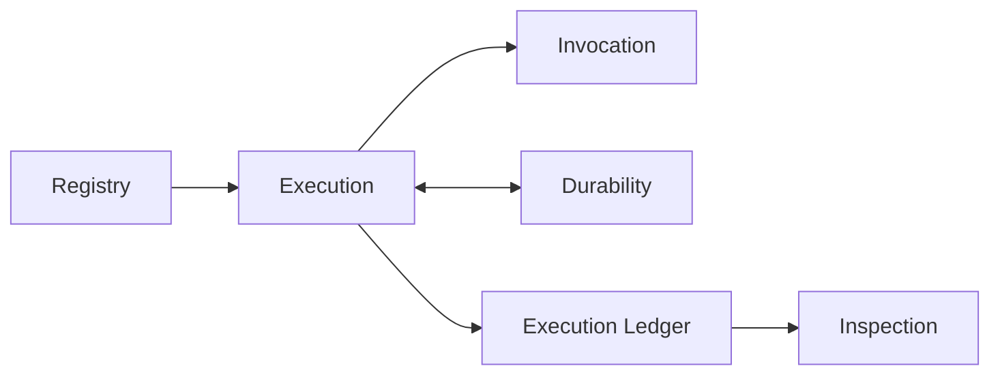
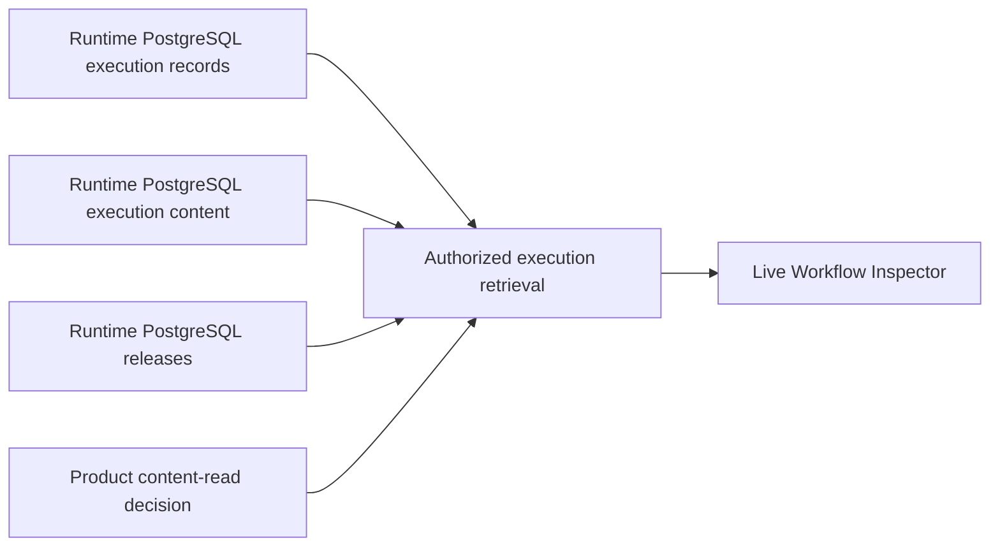
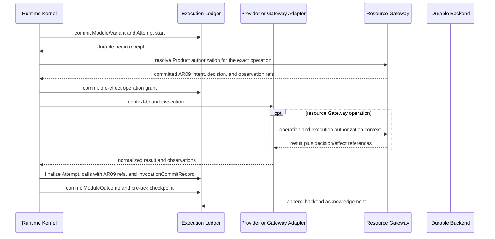

# Agent Runtime Standalone Package and Execution Lifecycle Contract

**Purpose**: Define the independently publishable Runtime package, its
three-axis architecture registration, its inspection surface, and its
append-only execution lifecycle.

**Required reader gain**: A maintainer can identify what every top-level source
module and file does, find its canonical Design Contract, install Runtime in a
different product, inspect formal Workflow records through the live Inspector,
and prove the commit order around invocation and recovery.

## 0. Contract Capsule

```yaml
layer: T1
status: proposal
canonical_owner: designDoc/agent_runtime_06_standalone_package_and_lifecycle_contract.md
parent: designDoc/the_agent_runtime.md
scope:
  - standalone public namespace and distribution boundary
  - responsibility-based source modules and three-part code naming
  - source-file to Design Contract ownership
  - PostgreSQL-backed live Workflow Inspector
  - durable backend start receipt
  - append-only Attempt lifecycle and active claim
  - protected-operation observation ordering
  - invocation finalization and stale-result handling
  - Outcome checkpoint and backend acknowledgement
  - persistence compare-and-commit requirements
non_goals:
  - domain roles, graphs, artifacts, prompts, or quality verdicts
  - Temporal implementation, owned by agent_runtime_07
  - Claude SDK or Codex CLI mechanics, owned by agent_runtime_08
  - Product Authorization policy, Entitlement state, or grant issuance
inputs:
  - designDoc/the_agent_runtime.md
  - designDoc/the_timestamp_semantic.md
  - designDoc/agent_runtime_09_authorization_integration_contract.md
outputs:
  - agent_runtime public package boundary
  - registry_architecture_registration
  - live read-only Workflow Inspector contract
  - backend start, Attempt, invocation, Outcome, checkpoint, and acknowledgement lifecycle
  - protected-operation observation lifecycle
  - persistence compare-and-commit protocol
truth_surfaces:
  - pyproject.toml
  - src/agent_runtime/README.md
  - src/agent_runtime/registry/registry_architecture_registration.py
  - src/agent_runtime/contracts/
  - src/agent_runtime/registry/
  - src/agent_runtime/execution/
  - src/agent_runtime/invocation/
  - src/agent_runtime/durability/
  - src/agent_runtime/ledger/
  - src/agent_runtime/inspection/
  - tests/test_agent_runtime_packaging_boundary.py
  - tests/test_runtime_architecture_validation.py
  - tests/test_agent_runtime_execution_records.py
  - tests/test_agent_runtime_inspection_interface.py
generated_projection_surfaces:
  - agent_runtime.inspection.inspection_architecture_rendering:build_runtime_architecture_projection
  - agent_runtime.inspection.inspection_architecture_rendering:render_runtime_architecture_markdown
runtime_triggers: none
open_decisions: []
review_gate: contract review followed by clean-wheel and lifecycle conformance tests
verification_hooks:
  - ./.venv/bin/python -m pytest tests/test_agent_runtime_packaging_boundary.py tests/test_runtime_architecture_validation.py tests/test_agent_runtime_execution_records.py tests/test_agent_runtime_inspection_interface.py -q
future_release_gate:
  - python -m agent_runtime.inspection.inspection_http_serving
```

## 1. Portable Product Boundary

Agent Runtime is an independently installable infrastructure product. A host
repository supplies its own domain semantics, which never become part of
Runtime package identity.



The canonical import namespace is `agent_runtime.*`. Runtime has no required
domain plugin or Product host dependency. Provider SDKs and Temporal remain
optional integrations. PostgreSQL is required by a production deployment
because registered releases and formal execution records cannot be rebuilt
from an in-memory process after failure.

## 2. Architecture Axes and Naming

Architecture is registered through three independent axes. Membership on one
axis never implies membership on another. A logical responsibility and its
primary source directory may share an identifier as a naming convention
without merging the two axes.

### 2.1 Logical responsibilities

| Logical responsibility | Owns | Canonical Design Contract |
| --- | --- | --- |
| `registry` | Release compilation, validation, registration, activation, and exact retrieval | `agent_runtime_01` |
| `execution` | Workflow initiation and advancement, Module invocation coordination, Cell-local staging, Evaluation, Resolution, checkpoint, and recovery | `agent_runtime_00` and `agent_runtime_06` |
| `invocation` | Prompt assembly plus registered model and tool invocation | `agent_runtime_08` |
| `durability` | Acknowledged commands, waits, retries, replay, and recovery | `agent_runtime_07` |
| `ledger` | Authoritative execution lineage, Attempts, usage, outcomes, and Resolution facts | `agent_runtime_06` |
| `inspection` | Authorized read models and Workflow Inspector rendering | `agent_runtime_06` |

### 2.2 Physical source organization

Physical directories are `contracts`, `registry`, `execution`, `invocation`,
`durability`, `ledger`, `inspection`, and `testing`. `contracts/` and
`testing/` are supporting directories, not logical responsibilities. A file in
`contracts/` retains the owning logical responsibility as its filename prefix.

### 2.3 Implementation bindings

Database engines, durable backends, provider SDKs and CLIs, and renderers are
concrete technologies. Each registered binding names exactly one logical
responsibility, one technology, and the exact implementation source files.
The generated architecture projection enumerates the current binding set.
Technology names cannot appear in the logical-responsibility registry.

Every source file uses:

```text
module_subject_nominalized_action.py
```

The module identifies responsibility, the subject identifies what is acted on,
and the final term names the action as a noun. A filename must remain meaningful
outside its directory. Language-native type names use the same three semantic
terms in `PascalCase`; public functions and serialized names remain
`snake_case`.

The package-level directory map is stable. Exact source filenames, logical
owners, physical directories, Design Contract owners, and migration-debt paths
are generated from `registry_architecture_registration`; this contract does not
maintain a second hand-written file inventory.

```text
agent_runtime/
  README.md
  design_contract/
  contracts/
  registry/
  execution/
  invocation/
  durability/
  ledger/
  inspection/
  testing/
```

The code-owned `registry_architecture_registration` maintains distinct record
types for logical responsibilities, physical directories, implementation
bindings, and source-file mappings. Repository validation fails on mixed axes,
an unregistered or misplaced file, a technology registered as a logical
responsibility, a cross-responsibility binding, a missing contract, duplicate
disposition, or stale debt path.

The logical call and committed-fact flow is:


Every node is a logical responsibility. Arrows mean Runtime calls or committed
fact flow; they do not mean source imports, directory containment, or
implementation selection.

Import dependency topology is a separate source-architecture view. Until a
dedicated code-owned import policy and AST validator are admitted, this
three-axis registry does not claim or enforce a complete intra-Runtime import
direction.

Only `registry_authoring_inventory_loading` may read explicitly selected local
authoring files. `registry_authoring_release_building` and
`registry_release_compilation` accept path-free content values. Production
Execution reads admitted releases. Invocation and Durability
implementations cannot choose releases or Workflow edges. Inspection reads
registered and committed Runtime facts and cannot mutate them.

### 2.4 Migration debt

Every remaining predecessor source file is enumerated in
`RUNTIME_MIGRATION_DEBT_PATHS` and excluded from target implementation.
Structural package initializers may temporarily re-export predecessor symbols
for existing callers. Those exports are compatibility-only, cannot be used by
new integrations, and retire with the owning debt entry.

This repository is still an unreleased `0.x.dev` extraction (`0.2.0.dev0`
at this revision) with no tagged
public package predecessor. Compatibility applies only to symbols explicitly
exported by the current package initializers; it does not preserve the former
host repository's physical `postgres`, `provider`, or `review` package layout.
Before the first standalone release is pinned, the host migration gate must
scan and replace those vendored import paths with the registered `registry`,
`invocation`, `inspection`, and `ledger` surfaces. The standalone wheel must
not be presented as an in-place upgrade until that consumer migration passes.

The Runtime defines no backward-compatibility or predecessor record variants as
part of its contract. Any `Legacy*` record type is migration-debt scaffolding
only, carries no contract obligation, and retires with its debt entry before the
first standalone release; new integrations target the current record contract
exclusively.

## 3. Published and Operated Interfaces

Every Runtime release contains:

| Published surface | Content |
| --- | --- |
| `README.md` | Product purpose, module map, registration, execution, PostgreSQL, Temporal, provider, and Inspector quick starts |
| Design Contract bundle | Generated, hash-bound copies of Runtime-owned T0 and T1 contracts |
| Python API and JSON schemas | Public definitions and callable Runtime operations |
| Registry Host Client | Explicit inventory load, path-free release build, authoritative-store registration, and content-free report |
| PostgreSQL migrations | Release, execution, content, and query indexes owned by Runtime |
| Workflow Inspector | Read-only web assets and query endpoints over formal PostgreSQL records |

Canonical Design Contracts remain in the repository `designDoc/` surface.
Software Delivery generates the packaged `design_contract/` directory and
fails when its manifest hashes differ. The packaged copy is never edited by
hand.

### 3.1 Pure Registry Release inventory

The Registry Release inventory is a pure, content-free projection over an
immutable `runtime_release_registry_snapshot` and
`release_inventory_selection`. The selection is a content-addressed set of exact
Release refs and grants no access. The projector performs no Registry read,
mutation, Product Authorization call, execution, or persistence operation.

An authorized Inspection service may supply a selection after its own current
access decision. That service remains the access-control owner. Slice 2F proves
selection and disclosure discipline only; persistent storage-level filtering,
Principal confinement, authorization currency, content access, pagination,
execution detail, and export remain outside this pure projector.

The mixed `WorkflowRuntimeRegistry` and Durable Backend inventory surface in
`inspection_release_rendering.py`, its concrete Temporal descriptor dependency,
Architecture wrappers, and file-local CLI are retired. The underlying Workflow
Registry and Durability contracts are unchanged. Architecture projection remains owned by
`inspection_architecture_rendering.py`. Host composition and backend selection
remain outside Runtime Release inspection.

### 3.2 Live Workflow Inspector

The primary Review interface is a live read-only application. Its HTML is an
application shell and contains no embedded Workflow Execution data.



This diagram is a production deployment data-flow view. Its nodes name bound
record stores and retrieval services; its arrows mean authorized data flow.

The Inspector lists every Workflow Execution allowed by the caller's current
Product grant. Selecting an execution loads its exact registered Workflow graph
and all committed Module Run, Variant, Attempt, retry, failure, Prompt, input,
output, usage, Evaluation, Selection, Resolution, Context, and recovery
records. Repeated graph nodes remain separate Module Run occurrences.

Prompt, input, output, tool, and failure bodies require an exact content-read
decision. Metadata remains visible only to the degree authorized by the trace
grant. A content hash mismatch is an integrity failure, not a redaction.

The page cannot start, retry, cancel, approve, publish, or alter an execution.
It does not write demo data when starting. A Product host may embed or proxy the
Runtime page after authentication, but it does not own another execution or
review schema.

An offline execution snapshot may exist later as an explicit export. It is not
the primary interface, a release requirement, or a second persisted truth.

### 3.3 External Authority and Integration Boundary

The Product host supplies an admitted Workflow binding and execution
authorization context. Runtime never reads Product Entitlement bodies.
`execution_authorization_coordination` obtains or validates current Product
decisions. `execution_operation_resolution` exposes exact Runtime-owned intent
and binding references to the enforcing Resource Gateway; the Gateway, not
Runtime, retrieves authorized product data. External Product Authorization and
Data Access components own those decisions and data policies.

Provider integration receives one exact admitted invocation and returns a
normalized result. Temporal coordinates durable Workflow progress using
references only. PostgreSQL owns Runtime facts. None of those implementations
may choose domain routing, change a release, or reinterpret a quality verdict.

Public serialized values reject ambiguous Python-only forms: IDs, refs, hashes,
and tokens require exact strings; integers reject booleans and floats; booleans
require exact booleans; usage numbers reject non-finite values; immutable
collections validate member type and uniqueness.

## 4. Durable Backend Start Receipt

After a durable adapter creates or resolves a backend execution, Runtime is the
sole writer of `BackendStartReceiptRecord`. It binds:

- Workflow Execution and durable backend identity;
- backend execution reference;
- exact start request identity;
- execution admission and authorization context references;
- backend start idempotency key; and
- ledger-assigned recorded time.

The same Workflow Execution and start request return the same logical receipt.
Changed request, authorization context, or backend reference conflicts. If the
backend creates work but the response or receipt commit is lost, Runtime repeats
the same idempotent start or uses the adapter reconciliation operation. It does
not create another backend identity.

## 5. Append-Only Attempt Lifecycle

### 5.1 Execution model invariants

The append-only lifecycle rests on a fixed model of what is deterministic and
what is not.

**Determinism boundary.** Only a Module's upstream inputs are deterministic and
content-addressed — the input package and Prompt Envelope are pinned by SHA-256.
Model output is non-deterministic: it is committed once and frozen as the
authoritative Outcome. Every retry, recovery, and durable replay returns the
committed Outcome and never re-invokes the model. Determinism holds over
recorded facts and control flow, never over model re-execution.

**Single-step variant comparison and single resolved Outcome.** Variant (A/B)
comparison is scoped to one dispatch fanning out over a single pinned upstream
input. A dispatch resolves to exactly one committed `ModuleOutcome` under its
`output_resolution_policy` (`direct_single` or `evaluated_single`); non-selected
variant outputs are recorded as stale. The control plane never branches on
variant comparison — it carries one resolved Outcome per dispatch.

**Bounded execution and single-source reconstruction.** A Workflow Execution's
whole committed history — its control facts plus the modest per-call observation
records — is bounded, on the order of tens of records, because dispatches are
bounded and each resolves to one Outcome. The execution ledger validates each
appended batch by reconstructing the reference state from all of that one
Execution's own committed facts; reconstruction is linear and needs no in-process
or cross-execution cache. Any caching or storage plane split is a non-contractual
optimization, unnecessary at this scale, and must never change which committed
facts are authoritative.

**Authority versus evidence.** Control facts (claims, admissions,
`ModuleOutcome`s, external-event applications, finalizations) are authoritative:
they determine the execution's state. Observation facts (model-call, tool-call,
and usage records) are evidence — the per-run, per-variant payload for
evaluation, recorded immutably and read back through the same trace. Both are
normalized atomic records in one ledger; a denormalized read view is the
sanctioned way to serve variant comparison, not a second storage plane.

`inspection_execution_projecting.build_runtime_execution_inspection`
mechanically rebuilds that denormalized view from one immutable
`RuntimeExecutionTrace` plus its optional registered `WorkflowRelease`. It
persists nothing, accepts no tenant or status overrides, and makes no Product
authorization decision. Live and offline Inspector surfaces consume this same
Runtime-owned projection; a host supplies only authenticated request context,
current read authorization, deployment wiring, and separately authorized
content dereference.

**Idempotency identity.** Idempotent convergence is keyed on a stable content
hash of an operation's identity fields; a conflicting retry converges on the
already-committed fact and is not re-compared field by field. Clock-derived and
staging timestamps (`recorded_at_utc` and equivalents) never participate in
idempotency identity. Replay lookups sit above the authority gates by design:
a replay reads the committed content-free result without re-authorizing the
execution, because committed facts are read facts — access to the referenced
content stays governed by the inspection authorization surface, and no replay
can re-invoke a provider or mint new records.

**Single execution kernel and purpose-scoped authority.** One canonical
adapter contract — `AuthorizedAgentExecutionAdapter` consuming an
`AuthorizedAgentExecutionRequest` and returning an `AgentExecutionResult` —
carries every Module invocation, including in-process test doubles. Execution
purpose selects the authority source, never a second code path. A Module that
declares a model operation requires committed authorization evidence — the
execution authorization context binding, protected-operation intent, Product
operation decision, and Gateway authorization observation of
`agent_runtime_09` — resolved and validated before the provider transport is
entered, under `test` and `evaluation` purposes as much as under production
purposes; a host-registered test authority changes where the evidence comes
from, not whether it exists. Empty authorization evidence is admissible only
for the conjunction of `test`/`evaluation` purpose, `in_process` transport
family, zero declared operations, and no provider, model, or tool callable.
Finalization of provider results follows section 7: the committed
execution-authorization fence is re-read inside the same atomic commit that
would make outputs authoritative — an open fence commits outputs with the
completed Attempt; a closed fence commits a failed Attempt that preserves
usage evidence while staged outputs stay unreferenced and no resolution is
recorded. A request never fabricates a Workflow Execution identity: it carries
either the Workflow Execution ID or the isolated Module scope, exactly one of
the two.

### 5.2 Attempt records and active claim

One provider, tool, or Gateway invocation has an immutable start record and at
most one immutable terminal Attempt record.

`AttemptStartedRecord` binds:

- Workflow Execution when present, dispatch, Module Run, Variant, and Attempt;
- parent Attempt and ordinal;
- exact request and input closure;
- execution profile and execution authorization context;
- active claim-token hash and timeout; and
- ledger-assigned `recorded_at_utc`.

The terminal record uses `period_start_at_utc` and `period_end_at_utc` for the
Attempt interval and its own `recorded_at_utc` for terminal-record commit. The
only terminal statuses are `completed`, `failed`, and `cancelled`.

An orphaned start remains visible. Recovery appends an orphan disposition,
invalidates provider context created by the orphan, and may create a new
Attempt ordinal. It never overwrites or silently reuses the first Attempt.

The begin transaction creates one active claim for:

```text
Workflow Execution + dispatch + Module Run + Variant + Attempt + request identity
```

Finalization must present the same claim token. A second live claim for the same
logical dispatch fails unless the registered retry policy has terminalized the
prior claim.

## 6. Protected-Operation Ordering

Every provider, model, tool, search, data read, external send, publication, and
protected-context invocation follows this order:



The operation intent exists before the external callable is entered. A resource
Gateway obtains or validates the current Product Authorization decision and
returns its reference. If the admitted action is high risk, the intent also
binds the required `OperationGrant` reference and the Gateway returns its
terminal disposition.

Ordinary operations require decision evidence but no single-use grant. The
execution ledger fails finalization when a required decision, pre-materialized
input reference, effect observation, or high-risk grant disposition is absent
or belongs to another execution lineage.

`run_workflow_module()` is the public workflow-bound composition of this
lifecycle. Its `WorkflowModuleExecutionRequest` carries the durable dispatch,
graph-position, Module Run, frozen input closure, and one Variant. The
`WorkflowModuleLedgerRecorder` writes the formal Module/Variant, Attempt claim,
operation, output, call, usage, invocation-commit, and output-resolution rows.
If the same dispatch already has an `InvocationCommitRecord`, Runtime
reconstructs the committed result and does not call the Provider again. Formal
tool-call rows carry immutable request and response content refs, so Gateway
Attempts replay with the same provider-neutral tool observations. If a process
dies after atomic invocation finalization but before the separate direct-output
resolution commit, replay derives that resolution only from the committed
Attempt output bundle and appends the missing row before returning.

`WorkflowExecutionLedgerRecorder` owns the surrounding Workflow facts that are
not one provider Attempt: it atomically records the Workflow Execution and its
frozen input members, appends deterministic derived outputs with their exact
source-artifact refs, and commits every Domain Outcome with its local recovery
checkpoint. A domain Runtime Services adapter calls this interface; it does
not construct ledger rows or maintain a second execution trace.

## 7. Invocation Finalization

`finalize_attempt(expected_claim_token, batch)` performs one
compare-and-commit:

1. validate the active claim and exact Attempt start;
2. recheck execution, Cell, authorization context, input closure, profile,
   Variant, and dispatch state;
3. verify immutable output bytes already exist;
4. verify required authorization and effect observations;
5. append the terminal Attempt, output bundle, execution output references,
   calls, source usage, context events, and `InvocationCommitRecord` atomically;
   and
6. close the active claim and return an immutable receipt.

`InvocationCommitRecord` proves that an invocation result is durable. A crash
after this record and before domain Outcome commit reconstructs the same result
without repeating the provider, tool, Gateway operation, or side effect.

Output bodies reach immutable content-addressed storage before their references
are committed. An unreferenced staged blob is non-authoritative and excluded
from inspection. The current `0.2.0.dev0` PostgreSQL adapter retains that blob;
a future controlled-retention migration may delete it only after proving that no
committed record references it. A committed output reference with missing bytes
is a failed transaction.

## 8. Crash, Stale Result, and Recovery

Recovery follows the highest committed boundary:

| Highest boundary | Required recovery | Prohibited behavior |
| --- | --- | --- |
| Attempt start without invocation commit | Orphan or terminalize; retry may create the next Attempt ordinal | Treat staged output as committed |
| Invocation commit without Module Outcome | Reconstruct committed invocation and continue evaluation or resolution | Repeat provider, tool, Gateway, or protected operation |
| Module Outcome and checkpoint without backend acknowledgement | Return committed Outcome and append only missing acknowledgement | Create another Attempt or domain effect |

If finalization observes a newer claim, invalid authorization context, changed
input closure, terminal dispatch, or cancellation, Runtime quarantines the late
result. It preserves trustworthy usage and call audit, appends a bounded stale
disposition, invalidates new provider context, and does not publish normal
downstream output.

## 9. Outcome and Backend Acknowledgement

`CheckpointRecord` is the local pre-ack commit boundary. It binds the exact
committed Outcome and output resolution when output flows downstream.

`BackendAcknowledgementRecord` separately acknowledges a Module Outcome,
external event, or cancellation. There is no mutable
`backend_acknowledged` boolean. Identical replay is idempotent; changed authority
identity, snapshot, transition sequence, or hash conflicts.

## 10. Persistence Protocol

The portable store exposes typed lifecycle operations:

```python
class RuntimeExecutionRecordStore(Protocol):
    def commit_backend_start_receipt(self, record): ...
    def get_backend_start_receipt(self, workflow_execution_id): ...
    def begin_attempt(self, batch): ...
    def commit_protected_operation_intent(self, batch): ...
    def commit_operation_observation(self, batch): ...
    def finalize_attempt(self, claim, batch): ...
    def orphan_attempt(self, claim, batch): ...
    def commit_outcome(self, batch): ...
    def acknowledge_backend(self, record): ...
    def get_committed_invocation(self, workflow_execution_id, dispatch_id): ...
    def load_trace(self, workflow_execution_id): ...
```

An internal generic batch primitive may exist, but production callers use typed
operations so ordering and compare-and-commit cannot be bypassed accidentally.
Exact method signatures and record fields are code-owned.

## 11. Admission and Conformance Tests

The package and lifecycle suites prove:

- clean wheel and optional-dependency isolation;
- external opaque plugin registration and execution;
- backend response-loss and receipt-commit-loss reconciliation;
- Attempt start uniqueness, orphan closure, and next ordinal;
- protected-operation intent precedes the external callable;
- missing decision or required high-risk grant proves zero protected effect;
- ordinary authorized operation succeeds without a single-use grant;
- finalization replay, stale claim rejection, and missing-output failure;
- all three crash windows avoid duplicate invocation or effect;
- Outcome and pre-ack checkpoint atomicity;
- append-only backend acknowledgement; and
- content-leak scans over shared records and backend payloads.

Code-owned schemas, PostgreSQL implementations, Runtime architecture
registration, generated architecture reports, and tests are the current
implementation truth. Historical
predecessor fields cannot be resolved as executable authority after migration.

The standalone repository conformance suite proves one domain-neutral Runtime authoring
reference case. The case is repository example and conformance material, not a
built-in business Workflow or production release. It demonstrates the same
public Host Client used by consuming products: explicit local inventory,
path-free build, immutable registration, exact verification, and replay. A
host-specific parser, repository scan, per-Workflow registrar, or fixed Skill
root fails standalone conformance.

## References

- [Agent Runtime](the_agent_runtime.md)
- [Execution Charter](agent_runtime_00_execution_charter.md)
- [Authorization Integration](agent_runtime_09_authorization_integration_contract.md)
- [Temporal Durable Adapter](agent_runtime_07_temporal_durable_adapter_contract.md)
- [Agent Execution Adapter](agent_runtime_08_agent_execution_adapter_contract.md)
- [Timestamp Semantics](the_timestamp_semantic.md)
