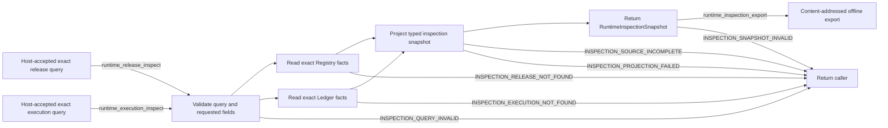

# Agent Runtime Inspection

## 0. Intent Capsule

```yaml
layer: T2
status: candidate
canonical_owner: designDoc/agent_runtime_06_standalone_package_and_lifecycle_contract.md
parent: designDoc/agent_runtime_00_execution_charter.md
owned_system_object: Runtime inspection projection
scope:
  - host-accepted read-only views of Runtime release and execution facts
  - deterministic projection from Registry and Ledger truth
  - current snapshot and content-addressed offline export
  - query validity, source completeness, and projection failure boundary
non_goals:
  - release registration, active-pointer mutation, or execution control
  - Workflow/Module dispatch, provider invocation, retry, recovery, or cancellation
  - business data, domain artifact, authorization-policy, or publication ownership
  - UI framework, renderer, database, transport, or export-format product selection
inputs:
  - host-accepted exact inspection query
  - Registry release/active-pointer facts and Ledger execution facts
  - registered projection specification
outputs:
  - Runtime inspection snapshot
  - optional content-addressed offline inspection export
truth_surfaces:
  - designDoc/agent_runtime_06_standalone_package_and_lifecycle_contract.md
  - authoritative Registry and Ledger records
  - code-owned inspection projection specifications
runtime_triggers:
  - host-accepted release inspection query
  - host-accepted execution inspection query
  - offline export request over an exact inspection snapshot
downstream_consumers:
  - Runtime operators, host integrations, Software Delivery, and security review
open_decisions: []
review_gate: independent design_contract_reviewer review and accountable Inspection owner decision before implementation
runtime_surface_ledger: Inspection emits projections only; Registry and Ledger remain systems of record
verification_hooks:
  - query-scope and field-projection tests
  - Registry/Ledger source completeness and consistency tests
  - deterministic projection and offline-export hash tests
  - no-write and incomplete-source failure tests
```

## 1. Primary System Flow



## 2. User Intent

Runtime Operator 能在不读取数据库私有结构、不修改 execution、不依赖 provider session 的情况下，还原
一个 release 或 execution 的权威状态和 lineage。Inspection 服务透明度，但不成为新的 Registry、
Ledger 或业务事实 authority。

## 3. Reader Gain

- Runtime Operator 能查询 release、active pointer、Attempt、usage、failure、Outcome 和 Resolution。
- Host Integrator 能消费稳定 typed snapshot，而不解析 Runtime store。
- Security Reviewer 能判断 query 请求了哪些字段、projection 实际返回了哪些字段。
- Runtime Maintainer 能区分 source fact、current snapshot、offline export 和 renderer binding。
- Engineering Reviewer 能证明 projection deterministic、read-only、complete，且不会隐藏 missing、conflicting
  或 uncommitted source facts。

## 4. Capability and Operation

本 T2 拥有一个 `Runtime inspection projection` capability。它完成：

1. 验证 host-accepted inspection query 的 shape、exact identity 和 requested fields；
2. 按 exact identity 读取 Registry、Ledger 或两者的闭合 facts；
3. 通过 registered projection specification 生成 typed snapshot；
4. 需要时把 exact snapshot 生成 content-addressed offline export。

Inspection 不执行 command、不改变 active pointer、不推进 Workflow、不重试 Attempt、不确认业务 effect。
HTML、JSON、CLI、API 或其他 renderer/transport 是 replaceable binding。

### 4.1 Structural Ownership Cutover

本 candidate 是 target T2 06 的唯一 Inspection owner。Predecessor 06 中：

- standalone package、public API、Design bundle、install/import 和 dependency-isolation meaning 由 target
  T2 05 接收；
- Attempt、Outcome、Resolution 和 committed execution facts 由 T2 04 Ledger 接收；
- retry/replay/recovery 由 T2 07 Durability 接收；
- Context/provider finalization 由 T2 08 Invocation 接收；
- protected-operation ordering 与 invalidation fence 由 T2 09 接收；
- execution state advancement 和 backend acknowledgement 由 T2 10 Execution 接收。

06 只保留 read-only inspection/projection meaning。05 与 06 target candidates 必须在同一 Design-set
cutover 中移除 predecessor overlap；本 candidate 不修改 peer candidate。

## 5. Inspection Object Model

`RuntimeInspectionSnapshot` 至少绑定：

- snapshot type 和 projection-spec ref/hash；
- query ref/hash；
- source Registry/Ledger record refs、hashes 和 authoritative observation boundary；
- release、execution、Module Run、Variant、Attempt、Outcome 或 Resolution identity；
- requested fields、projected fields 和 applied redaction disposition；
- source completeness result；
- canonical snapshot hash。

Snapshot 是某一 exact source closure 的 immutable returned value，不是新的 persistent store。Current
inspection 通过重新解析 authoritative facts 返回新 snapshot document/hash；不会修改先前返回值。Observed
time 记录观察边界，不参与被观察 release/execution identity。

`OfflineInspectionExport` 绑定 exact snapshot document/hash、registered renderer/export spec、media type、
payload hash 和 generated-at time。Inspection 只返回 export payload/hash；是否保存、删除或重建由 host 决定。

## 6. Release Inspection

Release inspection 可读取 exact release、dependency refs/hashes、active pointer、owner contract、
Prompt/Schema/Policy/Profile/Workflow closure 和 conformance refs。

按 stable subject kind/id 的 current query 必须同时返回所观察的 active-pointer source facts。Exact ref/hash
query 可以返回任意 registered release；它不改变 active pointer，也不授予 execution。

## 7. Execution Inspection

Execution inspection 可读取 Workflow Execution、Module Run、Variant、Attempt、input closure、selected
release/Profile、authorization binding、provider result、usage、failure、retry relation、checkpoint、Outcome
和 Resolution refs。

Inspection 只展示 Ledger 已提交 facts。Provider session、Temporal history、workspace file 或 live process
不能替代缺失 Ledger record。尚未 committed 的 effect 不能投影为完成；source conflict 返回失败而不是猜测
顺序。

工具日志视图按准确 Module Run、Variant 和 Attempt 展示实际调用，逐次提供工具身份、完整参数、实际
结果、可观察状态及对应原始事件位置。原始 CLI 返回日志通过同一受控读取入口取得；展示分页或摘要
不替代已保存正文。失败、拒绝、超时、中断与后续重试均可区分，不只展示最后一次成功结果。

视图分别标明 Gateway 授权操作和 Provider 原生调用。日志只是执行事实，不能把原生事件提升为 grant
或外部批准。Provider 格式由 Invocation 解析，Inspection 使用 Runtime 提供的统一结果；Portable 只
定义其审核所需的事实与接受规则，宿主不另行转换工具日志。

普通自测读取 Runtime 的当次内存 Ledger 和私有内容，沿用相同的日志投影，明确无持久化的保存边界；
持久查询读取已经提交的对应 Ledger 和内容存储。日志不完整、正文缺失、格式不受支持、hash 不符或
未获私有内容读取许可，都须明确返回，不能以空工具列表或猜测结果掩盖。原文仅按 §8 的查询范围和
披露规则返回，日志读取不增加执行或存储权限。

## 8. Query Scope and Redaction

Host public API access gate 在 query 进入 Runtime 前决定 caller eligibility；host denial 保留 host owner，
不成为 Inspection error。Inspection 只执行 host-accepted query 中明确给出的 snapshot type、subject scope
和 requested field set，不扩大 query，也不读取未请求 field。

Redaction disposition 是 projection fact：它说明哪些 registered field classes 被允许、遮蔽或省略，但不
复制 credential、secret、domain data 或 peer policy。既有 export 的 custody/retention 由其 host owner 管理。

## 9. Public Interface and Effects

| `interface_id` | Input | Successful output | Effect | Errors |
| --- | --- | --- | --- | --- |
| `runtime_release_inspect` | host-accepted exact release/subject query, requested fields, and projection spec | `RuntimeInspectionSnapshot` | reads Registry facts and returns a projection; no persistent write | `INSPECTION_QUERY_INVALID`, `INSPECTION_RELEASE_NOT_FOUND`, `INSPECTION_SOURCE_INCOMPLETE`, `INSPECTION_PROJECTION_FAILED` |
| `runtime_execution_inspect` | host-accepted exact execution query, requested fields, and projection spec | `RuntimeInspectionSnapshot` | reads Ledger facts and returns a projection; no persistent write | `INSPECTION_QUERY_INVALID`, `INSPECTION_EXECUTION_NOT_FOUND`, `INSPECTION_SOURCE_INCOMPLETE`, `INSPECTION_PROJECTION_FAILED` |
| `runtime_inspection_export` | exact snapshot document/hash plus renderer/export spec | `OfflineInspectionExport` payload/hash | returns replaceable export; no persistent write | `INSPECTION_SNAPSHOT_INVALID`, `INSPECTION_PROJECTION_FAILED` |

## 10. Completion, Failure, and Recovery

| `error_code` | Condition | Meaning | Caller action |
| --- | --- | --- | --- |
| `INSPECTION_QUERY_INVALID` | query shape、identity、snapshot type or requested field set unsupported | no facts read or returned | return caller to correct the exact query; do not broaden or guess scope |
| `INSPECTION_RELEASE_NOT_FOUND` | exact release or subject query has no Registry result | no release snapshot | return caller; do not select latest-like identity |
| `INSPECTION_EXECUTION_NOT_FOUND` | execution identity has no Ledger closure | no execution snapshot | return caller; verify exact identity |
| `INSPECTION_SOURCE_INCOMPLETE` | required Registry/Ledger facts missing、conflicting or uncommitted | no trustworthy snapshot | return Registry/Ledger owner with missing refs; never synthesize completion |
| `INSPECTION_SNAPSHOT_INVALID` | export input snapshot document cannot reproduce supplied canonical hash | no export produced | return caller to provide the exact snapshot document/hash |
| `INSPECTION_PROJECTION_FAILED` | projection/export spec unresolved or deterministic rendering fails | no snapshot/export produced | return Inspection implementation owner; source facts remain unchanged |

Completion requires a valid host-accepted query、complete exact source closure、registered projection spec、deterministic
snapshot hash and no write to Registry/Ledger/Execution or an Inspection store. Export completion additionally requires
exact snapshot document/hash binding and payload hash；host persistence is outside this interface。

Recovery fixes query、source closure or projection implementation and creates a new snapshot/export. It never
edits authoritative source facts or silently reuses a failed partial output.

## 11. Dependencies and Verification

Allowed dependencies：

- parent T1 domain boundary；
- Registry T2 public exact-release and active-pointer query results；
- Ledger T2 public execution-fact query results；
- code-owned projection specifications and replaceable renderer/export adapters。

Prohibited dependencies：

- Registry/Ledger private store layout or write interface；
- Execution、Invocation or Durability control interface；
- provider session、Temporal history or workspace as authority；
- business data schema、domain artifact body、credential or secret；
- UI/renderer technology as Design authority。

最低 verification closure：

1. exact/invalid query、subject-scope 与 field-projection cases；
2. exact Registry release/active-pointer snapshot；
3. exact Ledger execution/Attempt/Outcome/Resolution snapshot；
4. missing、conflicting、uncommitted source negatives；
5. snapshot deterministic replay and content hash；
6. current query produces new snapshot without mutating predecessor；
7. offline export hash/parity and rebuildability；
8. no-write guards for Registry、Ledger and Execution stores；
9. renderer/transport replacement does not change snapshot semantics。

## 12. References

- [Agent Runtime Charter](the_charter.md)
- [Agent Runtime T0](the_agent_runtime.md)
- [Agent Runtime Domain Root](agent_runtime_00_execution_charter.md)
- [Registry](agent_runtime_01_module_contract_and_assembly.md)
- [Standalone Release Conformance](agent_runtime_05_delivery_roadmap.md)
- [Timestamp Semantics](the_timestamp_semantic.md)
