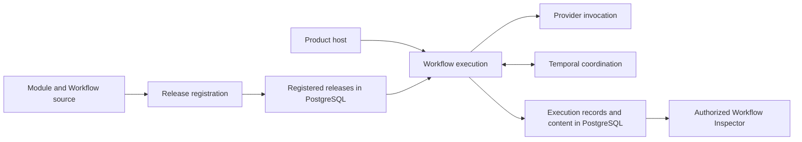
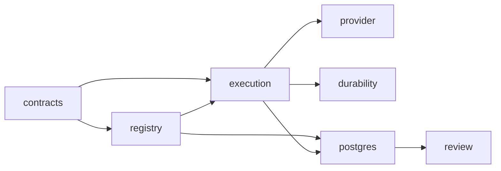
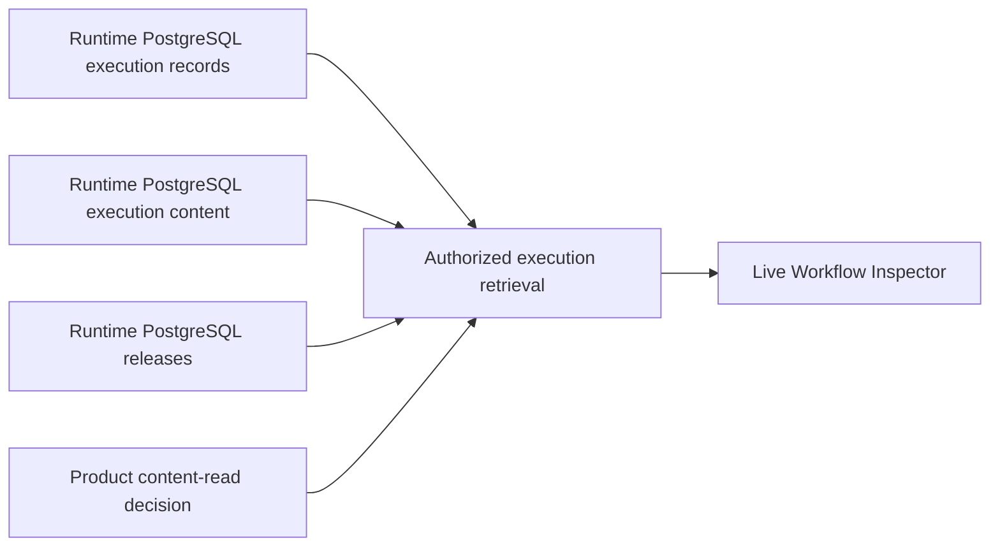
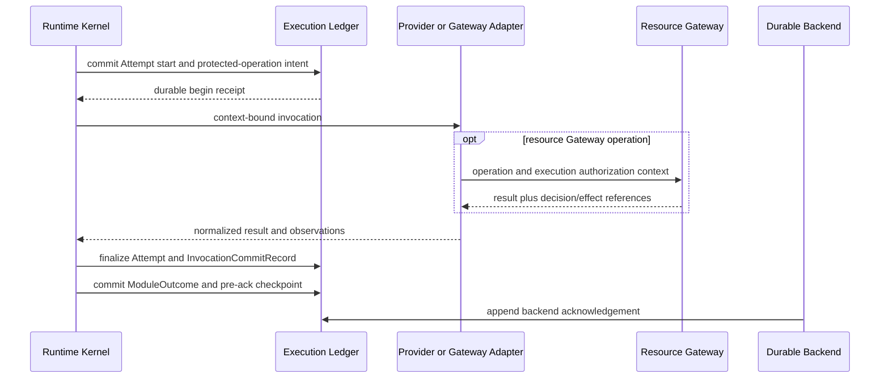

# Agent Runtime Standalone Package and Execution Lifecycle Contract

**Purpose**: Define the independently publishable Runtime package, its
responsibility-based source structure, its PostgreSQL-backed review surface,
and its append-only execution lifecycle.

**Required reader gain**: A maintainer can identify what every top-level source
module and file does, find its canonical Design Contract, install Runtime in a
different product, inspect formal Workflow records through the live Inspector,
and prove the commit order around invocation and recovery.

## 0. Contract Capsule

```yaml
layer: T1
status: proposal
canonical_owner: designDoc/agent_runtime_06_standalone_package_and_lifecycle_contract.md
parent: designDoc/the_agent_runtime.md
scope:
  - standalone public namespace and distribution boundary
  - responsibility-based source modules and three-part code naming
  - source-file to Design Contract ownership
  - PostgreSQL-backed live Workflow Inspector
  - durable backend start receipt
  - append-only Attempt lifecycle and active claim
  - protected-operation observation ordering
  - invocation finalization and stale-result handling
  - Outcome checkpoint and backend acknowledgement
  - persistence compare-and-commit requirements
non_goals:
  - domain roles, graphs, artifacts, prompts, or quality verdicts
  - Temporal implementation, owned by agent_runtime_07
  - Claude SDK or Codex CLI mechanics, owned by agent_runtime_08
  - Product Authorization policy, Entitlement state, or grant issuance
inputs:
  - designDoc/the_agent_runtime.md
  - designDoc/the_timestamp_semantic.md
  - designDoc/agent_runtime_09_authorization_integration_contract.md
outputs:
  - agent_runtime public package boundary
  - registry_architecture_registration
  - live read-only Workflow Inspector contract
  - backend start, Attempt, invocation, Outcome, checkpoint, and acknowledgement lifecycle
  - protected-operation observation lifecycle
  - persistence compare-and-commit protocol
truth_surfaces:
  - pyproject.toml
  - src/agent_runtime/README.md
  - src/agent_runtime/registry/registry_architecture_registration.py
  - src/agent_runtime/contracts/
  - src/agent_runtime/registry/
  - src/agent_runtime/execution/
  - src/agent_runtime/provider/
  - src/agent_runtime/durability/
  - src/agent_runtime/postgres/
  - src/agent_runtime/review/
  - tests/test_agent_runtime_packaging_boundary.py
  - tests/test_runtime_architecture_validation.py
  - tests/test_agent_runtime_execution_records.py
  - tests/test_agent_runtime_review_interface.py
generated_projection_surfaces:
  - designDoc/generated/agent_runtime_surface_status.md
runtime_triggers: none
open_decisions: []
review_gate: contract review followed by clean-wheel and lifecycle conformance tests
verification_hooks:
  - ./.venv/bin/python -m pytest tests/test_agent_runtime_packaging_boundary.py tests/test_runtime_architecture_validation.py tests/test_agent_runtime_execution_records.py tests/test_agent_runtime_review_interface.py -q
future_release_gate:
  - python -m agent_runtime.review.review_http_serving
```

## 1. Portable Product Boundary

Agent Runtime is an independently installable infrastructure product. The
`trading_platform` repository is one host; Research, Digestion, Trade, and
other domain semantics are not part of Runtime package identity.



The canonical import namespace is `agent_runtime.*`. Runtime has no required
domain plugin or Product host dependency. Provider SDKs and Temporal remain
optional integrations. PostgreSQL is required by a production deployment
because registered releases and formal execution records cannot be rebuilt
from an in-memory process after failure.

## 2. Source Modules and Naming

The target package is organized by product responsibility and must not expose
`release_control`, `ports`, `adapters`, bare `persistence`, or `inspection` as
top-level concepts. During migration, every remaining predecessor file and
package is enumerated in code-owned `RUNTIME_MIGRATION_DEBT_PATHS`; none is
presented as target implementation. Structural package initializers may
temporarily re-export those predecessor symbols for existing callers, but the
exports are compatibility-only and must retire with the owning debt entry.
New Runtime or plugin code imports target contracts from their explicit
three-part modules.

| Product module | Responsibility | Canonical Design Contract |
| --- | --- | --- |
| `registry` | Release compilation, validation, registration, activation, and exact retrieval | `agent_runtime_01` |
| `execution` | Workflow initiation, Module invocation, portable execution-record contracts, Cell-local staging, Attempt recording, Evaluation, output Resolution, checkpoint, and recovery | `agent_runtime_00` and `agent_runtime_06` |
| `provider` | Prompt assembly and Claude, Codex, or future provider invocation | `agent_runtime_08` |
| `durability` | Temporal Workflow coordination, acknowledged commands, replay, and recovery | `agent_runtime_07` |
| `postgres` | Production PostgreSQL persistence for Runtime releases, execution records, and recorded content | Contract owning the persisted fact |
| `review` | Authorized execution retrieval and live Workflow Inspector rendering | `agent_runtime_06` |

`contracts/` and `testing/` are supporting physical source directories, not
additional product modules. A contracts file keeps the owning product module
as the first filename term; the architecture registration records the separate
physical `source_directory_id`. Tests follow the same logical owner in their
registration metadata.

The `execution` module owns the portable `RuntimeExecutionRecordStore`
protocol, Cell-local staging, and in-memory conformance implementations. The
`postgres` module owns production PostgreSQL implementations of release,
execution-record, and recorded-content persistence. This is an interface-to-
implementation dependency, not shared ownership of canonical Runtime facts.

Every source file uses:

```text
module_subject_nominalized_action.py
```

The module identifies responsibility, the subject identifies what is acted on,
and the final term names the action as a noun. A filename must remain meaningful
outside its directory. Language-native type names use the same three semantic
terms in `PascalCase`; public functions and serialized names remain
`snake_case`.

The package-level directory map is stable. Exact source filenames, logical
owners, physical directories, Design Contract owners, and migration-debt paths
are generated from `registry_architecture_registration`; this contract does not
maintain a second hand-written file inventory.

```text
agent_runtime/
  README.md
  design_contract/
  contracts/
  registry/
  execution/
  provider/
  durability/
  postgres/
  review/
  testing/
```

The code-owned `registry_architecture_registration` assigns every target Python
file to one logical product module, one physical source directory, and one
canonical Design Contract. Repository validation scans the full Runtime source
tree and requires every Python file to be either target, structural package
plumbing, or explicit migration debt. It fails on an unregistered or misplaced
file, missing contract, generic or nonconforming filename, duplicate
disposition, or stale debt path.

The allowed dependency direction is:



Diagram nodes are logical product owners; a file physically stored under
`contracts/` remains part of its registered logical owner. Arrows point from an
imported dependency toward the module allowed to import it.

Only `registry_release_compilation` may read editable Module authoring files.
Production Execution reads admitted PostgreSQL releases. Provider and Temporal
code cannot choose releases or Workflow edges. Review code reads registered and
committed Runtime facts and cannot mutate them.

## 3. Published and Operated Interfaces

Every Runtime release contains:

| Published surface | Content |
| --- | --- |
| `README.md` | Product purpose, module map, registration, execution, PostgreSQL, Temporal, provider, and Inspector quick starts |
| Design Contract bundle | Generated, hash-bound copies of Runtime-owned T0 and T1 contracts |
| Python API and JSON schemas | Public definitions and callable Runtime operations |
| PostgreSQL migrations | Release, execution, content, and query indexes owned by Runtime |
| Workflow Inspector | Read-only web assets and query endpoints over formal PostgreSQL records |

Canonical Design Contracts remain in the repository `designDoc/` surface.
Software Delivery generates the packaged `design_contract/` directory and
fails when its manifest hashes differ. The packaged copy is never edited by
hand.

### 3.1 Live Workflow Inspector

The primary Review interface is a live read-only application. Its HTML is an
application shell and contains no embedded Workflow Execution data.



The Inspector lists every Workflow Execution allowed by the caller's current
Product grant. Selecting an execution loads its exact registered Workflow graph
and all committed Module Run, Variant, Attempt, retry, failure, Prompt, input,
output, usage, Evaluation, Selection, Resolution, Context, and recovery
records. Repeated graph nodes remain separate Module Run occurrences.

Prompt, input, output, tool, and failure bodies require an exact content-read
decision. Metadata remains visible only to the degree authorized by the trace
grant. A content hash mismatch is an integrity failure, not a redaction.

The page cannot start, retry, cancel, approve, publish, or alter an execution.
It does not write demo data when starting. A Product host may embed or proxy the
Runtime page after authentication, but it does not own another execution or
review schema.

An offline execution snapshot may exist later as an explicit export. It is not
the primary interface, a release requirement, or a second persisted truth.

### 3.2 External Authority and Integration Boundary

The Product host supplies an admitted Workflow binding and execution
authorization context. Runtime never reads Product Entitlement bodies.
`execution_authorization_coordination` obtains or validates current Product
decisions. `execution_operation_resolution` exposes exact Runtime-owned intent
and binding references to the enforcing Resource Gateway; the Gateway, not
Runtime, retrieves authorized product data. External Product Authorization and
Data Access components own those decisions and data policies.

Provider integration receives one exact admitted invocation and returns a
normalized result. Temporal coordinates durable Workflow progress using
references only. PostgreSQL owns Runtime facts. None of those implementations
may choose domain routing, change a release, or reinterpret a quality verdict.

Public serialized values reject ambiguous Python-only forms: IDs, refs, hashes,
and tokens require exact strings; integers reject booleans and floats; booleans
require exact booleans; usage numbers reject non-finite values; immutable
collections validate member type and uniqueness.

## 4. Durable Backend Start Receipt

After a durable adapter creates or resolves a backend execution, Runtime is the
sole writer of `BackendStartReceiptRecord`. It binds:

- Workflow Execution and durable backend identity;
- backend execution reference;
- exact start request identity;
- execution admission and authorization context references;
- backend start idempotency key; and
- ledger-assigned recorded time.

The same Workflow Execution and start request return the same logical receipt.
Changed request, authorization context, or backend reference conflicts. If the
backend creates work but the response or receipt commit is lost, Runtime repeats
the same idempotent start or uses the adapter reconciliation operation. It does
not create another backend identity.

## 5. Append-Only Attempt Lifecycle

One provider, tool, or Gateway invocation has an immutable start record and at
most one immutable terminal Attempt record.

`AttemptStartedRecord` binds:

- Workflow Execution when present, dispatch, Module Run, Variant, and Attempt;
- parent Attempt and ordinal;
- exact request and input closure;
- execution profile and execution authorization context;
- active claim-token hash and timeout; and
- ledger-assigned `recorded_at_utc`.

The terminal record uses `period_start_at_utc` and `period_end_at_utc` for the
Attempt interval and its own `recorded_at_utc` for terminal-record commit. The
only terminal statuses are `completed`, `failed`, and `cancelled`.

An orphaned start remains visible. Recovery appends an orphan disposition,
invalidates provider context created by the orphan, and may create a new
Attempt ordinal. It never overwrites or silently reuses the first Attempt.

The begin transaction creates one active claim for:

```text
Workflow Execution + dispatch + Module Run + Variant + Attempt + request identity
```

Finalization must present the same claim token. A second live claim for the same
logical dispatch fails unless the registered retry policy has terminalized the
prior claim.

## 6. Protected-Operation Ordering

Every provider, model, tool, search, data read, external send, publication, and
protected-context invocation follows this order:



The operation intent exists before the external callable is entered. A resource
Gateway obtains or validates the current Product Authorization decision and
returns its reference. If the admitted action is high risk, the intent also
binds the required `OperationGrant` reference and the Gateway returns its
terminal disposition.

Ordinary operations require decision evidence but no single-use grant. The
execution ledger fails finalization when a required decision, pre-materialized
input reference, effect observation, or high-risk grant disposition is absent
or belongs to another execution lineage.

## 7. Invocation Finalization

`finalize_attempt(expected_claim_token, batch)` performs one
compare-and-commit:

1. validate the active claim and exact Attempt start;
2. recheck execution, Cell, authorization context, input closure, profile,
   Variant, and dispatch state;
3. verify immutable output bytes already exist;
4. verify required authorization and effect observations;
5. append the terminal Attempt, output bundle, execution output references,
   calls, source usage, context events, and `InvocationCommitRecord` atomically;
   and
6. close the active claim and return an immutable receipt.

`InvocationCommitRecord` proves that an invocation result is durable. A crash
after this record and before domain Outcome commit reconstructs the same result
without repeating the provider, tool, Gateway operation, or side effect.

Output bodies reach immutable content-addressed storage before their references
are committed. An unreferenced staged blob may be garbage-collected. A committed
output reference with missing bytes is a failed transaction.

## 8. Crash, Stale Result, and Recovery

Recovery follows the highest committed boundary:

| Highest boundary | Required recovery | Prohibited behavior |
| --- | --- | --- |
| Attempt start without invocation commit | Orphan or terminalize; retry may create the next Attempt ordinal | Treat staged output as committed |
| Invocation commit without Module Outcome | Reconstruct committed invocation and continue evaluation or resolution | Repeat provider, tool, Gateway, or protected operation |
| Module Outcome and checkpoint without backend acknowledgement | Return committed Outcome and append only missing acknowledgement | Create another Attempt or domain effect |

If finalization observes a newer claim, invalid authorization context, changed
input closure, terminal dispatch, or cancellation, Runtime quarantines the late
result. It preserves trustworthy usage and call audit, appends a bounded stale
disposition, invalidates new provider context, and does not publish normal
downstream output.

## 9. Outcome and Backend Acknowledgement

`CheckpointRecord` is the local pre-ack commit boundary. It binds the exact
committed Outcome and output resolution when output flows downstream.

`BackendAcknowledgementRecord` separately acknowledges a Module Outcome,
external event, or cancellation. There is no mutable
`backend_acknowledged` boolean. Identical replay is idempotent; changed authority
identity, snapshot, transition sequence, or hash conflicts.

## 10. Persistence Protocol

The portable store exposes typed lifecycle operations:

```python
class RuntimeExecutionRecordStore(Protocol):
    def commit_backend_start_receipt(self, record): ...
    def get_backend_start_receipt(self, workflow_execution_id): ...
    def begin_attempt(self, batch): ...
    def commit_protected_operation_intent(self, batch): ...
    def commit_operation_observation(self, batch): ...
    def finalize_attempt(self, claim, batch): ...
    def orphan_attempt(self, claim, batch): ...
    def commit_outcome(self, batch): ...
    def acknowledge_backend(self, record): ...
    def get_committed_invocation(self, workflow_execution_id, dispatch_id): ...
    def load_trace(self, workflow_execution_id): ...
```

An internal generic batch primitive may exist, but production callers use typed
operations so ordering and compare-and-commit cannot be bypassed accidentally.
Exact method signatures and record fields are code-owned.

## 11. Admission and Conformance Tests

The package and lifecycle suites prove:

- clean wheel and optional-dependency isolation;
- external opaque plugin registration and execution;
- backend response-loss and receipt-commit-loss reconciliation;
- Attempt start uniqueness, orphan closure, and next ordinal;
- protected-operation intent precedes the external callable;
- missing decision or required high-risk grant proves zero protected effect;
- ordinary authorized operation succeeds without a single-use grant;
- finalization replay, stale claim rejection, and missing-output failure;
- all three crash windows avoid duplicate invocation or effect;
- Outcome and pre-ack checkpoint atomicity;
- append-only backend acknowledgement; and
- content-leak scans over shared records and backend payloads.

Code-owned schemas, PostgreSQL implementations, Runtime architecture
registration, generated architecture reports, and tests are the current
implementation truth. Historical
predecessor fields cannot be resolved as executable authority after migration.

## References

- [Agent Runtime](the_agent_runtime.md)
- [Execution Charter](agent_runtime_00_execution_charter.md)
- [Authorization Integration](agent_runtime_09_authorization_integration_contract.md)
- [Temporal Durable Adapter](agent_runtime_07_temporal_durable_adapter_contract.md)
- [Agent Execution Adapter](agent_runtime_08_agent_execution_adapter_contract.md)
- [Timestamp Semantics](the_timestamp_semantic.md)
