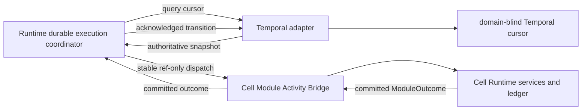
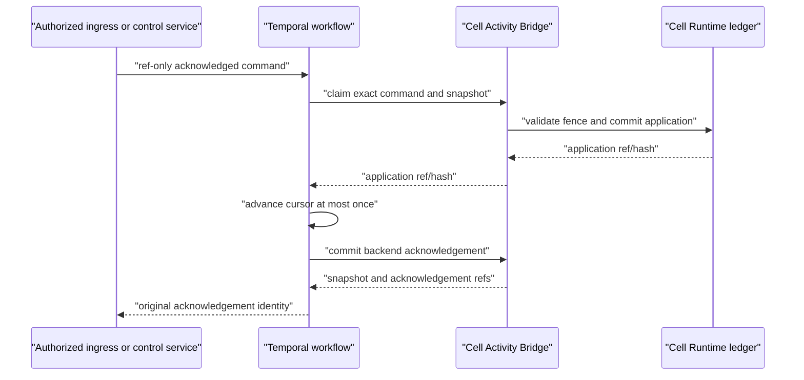

# Agent Runtime Temporal Durable Adapter Contract

**Purpose**: Define the domain-neutral Temporal mapping of the canonical Agent
Runtime durable-backend protocol.

**Required reader gain**: A maintainer can implement or audit Temporal workflow
start, dispatch, acknowledged external commands, recovery, and replay without
learning domain meaning or placing customer content in Temporal history.

## 0. Intent Capsule

```yaml
layer: T1
status: proposal
canonical_owner: designDoc/agent_runtime_07_temporal_durable_adapter_contract.md
parent: designDoc/the_agent_runtime.md
scope:
  - Temporal mapping of the canonical durable-backend protocol
  - deterministic workflow and Cell-local Activity Bridge boundary
  - acknowledged external event, cancellation, and authorization invalidation
  - retry, checkpoint, recovery, replay, and worker replacement
  - ref-only Temporal history
  - two-Cell conformance
non_goals:
  - domain graph meaning, quality rules, or Artifact bodies
  - provider execution mechanics
  - Product Authorization policy or grant issuance
  - canonical publication
  - current backend selection, deployment, or admission state
inputs:
  - designDoc/the_agent_runtime.md
  - designDoc/agent_runtime_00_execution_charter.md
  - designDoc/agent_runtime_03_authorized_external_event_ingress.md
  - designDoc/agent_runtime_06_standalone_package_and_lifecycle_contract.md
  - designDoc/agent_runtime_09_authorization_integration_contract.md
outputs:
  - temporal_durable_execution_adapter
  - temporal_durable_execution_workflow
  - durable_execution_coordinator
  - cell_module_activity_bridge
  - temporal_history_codec
  - temporal_conformance_contract
truth_surfaces:
  - src/agent_runtime/contracts/durability_backend_definition.py
  - src/agent_runtime/durability/durability_workflow_coordination.py
  - src/agent_runtime/durability/durability_backend_registration.py
  - src/agent_runtime/durability/durability_temporal_coordination.py
  - src/agent_runtime/testing/durability_temporal_conformance.py
  - src/agent_runtime/registry/registry_graph_projection.py
  - src/agent_runtime/contracts/registry_release_definition.py
  - src/agent_runtime/registry/registry_release_registration.py
verification_hooks:
  - public durable-contract tests
  - real Temporal two-Cell integration
  - target Workflow Release cursor integration
  - authorized Source-to-Evidence crash-before-ack recovery integration
  - deterministic replay and ref-only history scan
review_gate: durable conformance, history leakage audit, and independent engineering review
open_decisions: []
```

## 1. Ownership Boundary

Agent Runtime owns the durable protocol, Runtime status, cursor invariants,
acknowledgement meaning, and execution lineage. Temporal implements scheduling,
history, timers, retry, acknowledged commands, worker coordination, and replay.

Temporal does not own:

- domain states or legal edges;
- Module, provider, or Evaluation semantics;
- Product Authorization policy or permission;
- customer content, Prompt Envelopes, or provider output;
- canonical writes or Artifact admission.



The Temporal cursor never imports a domain plugin or reads a Cell store. The
coordinator passes one stable ref-only dispatch to the host-composed Activity
Bridge. The bridge resolves the pinned execution and enters ordinary Runtime
services outside Temporal replay.

## 2. Canonical Durable Interface

The canonical backend protocol is code-owned in
`src/agent_runtime/contracts/durability_backend_definition.py`. It reuses the
target host commands from `execution_host_definition.py` and the backend cursor
records from `durability_execution_definition.py`; it does not declare another
start request, execution ref, event, cancellation, or snapshot type family.
Temporal consumes these exact type identities without renaming fields or
adding authority.

The adapter provides these logical operations:

| Operation | Required result |
| --- | --- |
| `start` | Exact backend execution ref for one pinned Workflow Execution |
| `apply_external_event` | Acknowledgement bound to one committed external-event application and snapshot |
| `query` | Latest bounded execution snapshot |
| `request_cancellation` | Acknowledgement bound to one committed cancellation closure and snapshot |
| `apply_authorization_invalidation` | Acknowledgement bound to one committed invalidation closure and snapshot |
| `recover` | The same authoritative snapshot after worker or client loss |
| `list_events` | Bounded backend events mapped to Runtime execution identity |

A native Temporal Signal is not a Runtime acknowledgement. A public free-text
cancel operation is forbidden. Native termination is a separate break-glass
operator action and remains incomplete until Runtime closure evidence exists.

Exact DTO fields, hashes, codecs, persistence rows, and Python projections are
code truth. Canonical cross-language record names use `snake_case`.

## 3. Start and Binding

A start request pins one exact:

- Workflow Execution and `workflow_release`;
- execution-scoped, per-node `execution_profile_selection`;
- execution authorization binding and start-admission record;
- input package and data scope;
- graph projection and hash;
- injected durable execution binding;
- Runtime and adapter release;
- backend namespace and task queue selected by trusted host configuration;
- transition and dispatch safety ceiling.

Customer content and credentials are absent.

Start identity is the Workflow Execution ID plus the canonical request hash.
Exact retry returns the same backend execution. Reusing the execution ID with a
different request hash, release, admission record, Cell, or backend binding
fails closed.

Runtime acknowledges start only after the canonical backend-start receipt is
committed in the Cell ledger. Backend-response loss, receipt-commit loss, and
caller-response loss must converge on one backend execution and one receipt.

The Workflow Execution pins its Temporal workflow type, adapter release,
namespace, and task queue. No in-flight execution resolves `latest` or
switches backend.

## 4. Deterministic Workflow

The deterministic workflow stores only bounded control state and follows this
loop:

```text
validate pinned start identity
load the ref-only graph projection
start or recover the exact Temporal cursor
while the cursor is nonterminal and the call safety bound is open:
    query the backend-authoritative cursor
    derive one stable module_dispatch_request
    call the Cell Module Activity Bridge
    resolve and compare the committed module_outcome
    return on wait or retryable failure
    acknowledge a legal transition through the Temporal Update
    verify the returned execution_snapshot against the exact graph projection
return the terminal execution_snapshot
```

Replay performs no database read, provider call, authorization request, Tool
call, search, publication, or domain mutation. Any value needed for
deterministic branching is already in history as a bounded canonical field.

Coordinator or worker retry is infrastructure metadata. It is never a Runtime
Attempt ID and cannot authorize another provider invocation or protected
effect.

### 4.1 Durable parallel groups

A Workflow Release may bind a control node to one immutable parallel group.
The group declares two or more ordinary Module nodes, one `all_required` join
target, and exactly one completion outcome route from the control node. No
ordinary edge may enter a branch or bypass the group. Parallelism is therefore
Workflow graph authority, not a Prompt instruction or a hidden product-driver
detail.

The backend cursor remains at the parallel control node while Runtime derives
one stable dispatch identity per branch. Branch Module Runs, Variants, Attempts,
outputs, usage, failures, and retry lineage remain ordinary Runtime records.
After every required branch has one committed successful outcome targeting the
declared join, Runtime applies one idempotent group-completion event and advances
the backend cursor once. Temporal history never stores model content.

Successful branch outcomes may be reused after coordinator or worker recovery
only while the Workflow Release, group binding, frozen execution input,
entitlement snapshot, Module Release, and Execution Profile selection remain
identical. A retryable technical failure advances only that branch's stable
retry sequence; it does not rerun successful siblings. Recovery scans committed
retry identities under a bounded Runtime safety ceiling and fails closed if the
history exceeds that ceiling. A coordinator call whose dispatch budget cannot
admit the group's outstanding fan-out fails loudly before partial dispatch;
`dispatch_limit` is reserved for a call that can make later progress. Parallel
branches may not enter an external wait. A workflow requiring a wait places it
after the join or models it outside the parallel group. If a bridge nevertheless
commits a branch result that cannot enter the declared join, the coordinator
returns auditable `blocked` progress with that committed outcome; replay returns
the same progress and does not trap the execution behind a repeated exception.
A same-round sibling dispatch exception remains visible to the caller; replay
then short-circuits on the committed blocking result without redispatching that
sibling. A committed non-joinable result also takes precedence over sibling
retry-scan exhaustion. The host may then cancel or repair through an explicitly
authorized operation.

The first admitted join policy is `all_required`. Runtime dispatches every
branch and collects every committed outcome before returning a semantic result;
it does not short-circuit because one branch's business artifact contains a
negative verdict. Business aggregation remains an explicit downstream Module
or deterministic service. Runtime interprets only technical disposition and
the declared join target.

## 5. Cell Module Activity Bridge

The Runtime-owned `cell_module_activity_bridge` protocol is domain-neutral. A
domain plugin supplies the adapter that binds the protocol to its driver and
frozen Workflow Execution. The bridge:

1. resolves the exact Cell and Workflow Execution from trusted host
   configuration;
2. validates current authorization, control fence, snapshot, graph, release,
   and dispatch-admission closure;
3. invokes the domain-blind Runtime dispatch service;
4. returns only a locally committed `module_outcome` ref, hash, disposition,
   and bounded control fields;
5. writes no cursor state directly.

The coordinator may call `dispatch` concurrently for branches in one registered
parallel group. A bridge must isolate dispatch-local mutable state and make
shared ledger or provider-session access concurrency-safe. Runtime enforces an
explicit per-group concurrency ceiling; this ceiling bounds technical fan-out
and does not change graph authority or branch membership.

The Runtime Module path owns Module Run, Variant, Attempt, output, Evaluation,
Selection, Resolution, usage, Context, and protected-operation lineage. Host
re-entry reuses the stable dispatch identity and committed result. It does not
create a new business Attempt merely because an outcome acknowledgement was
lost.

## 6. Acknowledged External Commands

External event, cancellation, and authorization invalidation use acknowledged
Temporal Updates or an equivalent acknowledged command primitive. Each command
has one immutable command identity, request hash, caller-seen snapshot token,
authorization evidence, and Cell-local application record.

The ordering is:



A command is admissible only when its expected snapshot, transition sequence,
wait or control state, graph, execution, Cell, and authorization closure still
match. A leave-and-return to the same named state cannot pass with an old
snapshot token.

Exact replay returns the original application, snapshot, and acknowledgement.
Same identity with different content fails as an idempotency conflict.

Cancellation and authorization invalidation change Runtime status, preserve
the last committed domain state, quarantine late results, close provider
Context, and reconcile issued grants or effects. They do not fabricate a
domain transition. Restored permission starts a newly authorized Workflow
Execution.

The Temporal cancellation path is a typed acknowledged Update. It stores the
exact cancellation identity and reason Artifact ref, changes only
`runtime_status_id`, returns the resulting `execution_snapshot`, and permits
exact replay of the same Update identity. Native free-text cancellation is not
part of the Runtime backend protocol.

## 7. Ref-only Temporal History

Allowed history values are:

- bounded execution, release, graph, state, dispatch, event, and snapshot IDs;
- opaque refs and SHA-256 hashes;
- graph adjacency and terminal markers;
- bounded status, reason, retry, sequence, timer, and acknowledgement fields;
- ref-only command and application projections.

Forbidden history values are:

- Source, Evidence, Prompt, Draft, revision packet, or provider output bodies;
- search or semantic-query results;
- Entitlement, policy, grant-proof, or Principal-profile bodies;
- credentials, tokens, endpoints, private key material, or callback secrets;
- Python import paths for domain drivers or stores;
- raw exception, cancellation, or operator prose;
- arbitrary dictionaries outside canonical codecs.

History scans use private sentinels and exact-key schema validation. A denylist
alone is insufficient.

## 8. Crash and Replay

| Failure window | Required recovery |
| --- | --- |
| Before backend accepts start | Retry exact start identity |
| After backend accepts start, before receipt commit | Resolve backend execution by exact identity, then commit the missing receipt |
| After receipt commit, before caller acknowledgement | Return the existing receipt and backend ref |
| Before local invocation commit | Reconcile provider and protected-effect identity before any new business Attempt |
| After invocation commit, before Module outcome | Reconstruct Resolution and outcome from committed output |
| After Module outcome, before cursor movement | Reuse the outcome and advance at most once |
| After command application, before cursor movement | Application owns the claim; apply once |
| After cursor movement, before backend acknowledgement | Append only the missing acknowledgement |
| Worker restart or replay | Resolve the same pinned execution and perform no replay-time side effect |

Missing Runtime outcome is not evidence that no provider or protected effect
occurred. Orphan reconciliation precedes any replacement Attempt.

## 9. Isolation and Versioning

Each Dedicated Cell uses a distinct namespace, task queue, persistence binding,
worker identity, credential domain, and history-retention policy. A pooled
deployment must prove tenant-aware routing and cross-tenant negatives before
admission.

A behavior-changing durable workflow or codec update creates a new immutable
adapter and workflow release. Compatible workers may drain pinned histories.
Incompatible histories remain on their original worker set or migrate through
an explicit, tested conversion. They are never replayed against an incompatible
workflow type.

## 10. Conformance and Admission

Temporal adapter admission requires:

- canonical DTO and exact-key codec tests;
- one generic cursor, durable coordinator, and Activity Bridge protocol for
  opaque synthetic and domain-owned graphs;
- two independent synthetic Cells;
- loop, retry, wait, nonterminal event, terminal event, cancellation, and
  invalidation paths;
- worker crash after local effect commit without duplicate effect;
- start, dispatch, command, cursor, and acknowledgement crash-window tests;
- exact retry and conflicting-replay negatives;
- stale snapshot, illegal edge, forged graph, and cross-Cell negatives;
- long-wait and worker-version recovery;
- deterministic replay with zero Cell, provider, authorization, or Gateway
  calls;
- serialized-history sentinel and secret leakage scan;
- generated inspection parity and independent engineering review.

A conformance harness, dependency probe, or successful SDK import is evidence
only. It does not establish production admission. Current implementation,
selected-candidate status, release binding, and commands come from code-owned
registries and generated inspection.

## 11. Code Truth and Adjacent Contracts

Code owns exact records, protocol signatures, workflow and Activity names,
current implementation, backend descriptor, admission state, and inspection.
This document owns Temporal mapping and durable invariants only.

The current target-model slice projects one exact `workflow_release` from the
Runtime Release Registry into a domain-blind Temporal cursor. Terminal release
edges converge on a Runtime-owned `completed` control state, not a fake Module.
A real Temporal dev-server test proves exact start retry, conflicting-start
rejection, candidate/test admission, acknowledged updates, terminal recovery,
deterministic replay, and ref-only history. The exact-key start codec rejects
unlisted nested fields before they can enter history. The older
`workflow_runtime_registration` adapter remains a predecessor compatibility
surface and is not the target registration authority.

The Runtime now implements the domain-neutral durable execution coordinator and
the Source-to-Evidence plugin implements its Cell Module Activity Bridge. A real
Temporal test interrupts execution after the Router outcome is committed but
before cursor acknowledgement, then proves stable-dispatch replay, exactly-once
model invocation, terminal recovery, ref-only history, usage observation, and
grant-bound shadow Evidence admission. The Workflow Execution also freezes one
hash-bound `execution_profile_selection`; Module and profile resolution follows
the exact node bindings rather than a stable-ID or latest-release lookup.

This is a shadow conformance slice. Runtime outcomes and Cell artifacts still
use in-memory stores in this host composition, and Evidence writes remain in
the isolated shadow admission store. Production admission remains blocked on
durable PostgreSQL Runtime trace and usage binding, production Evidence write
binding, remaining failure-window tests, and independent engineering review.

The mixed durable-backend and Workflow composition inventory formerly emitted
by `inspection_release_rendering.py` is retired; Durability-owned contracts and
the Workflow Registry remain unchanged.
Durability conformance uses Durability-owned Adapter descriptors and evidence;
the Registry Release inventory neither selects nor describes a durable
backend.

Adjacent ownership:

- `agent_runtime_00` owns portable execution and recovery semantics.
- The host platform owns product deployment topology and Cell placement.
- `agent_runtime_03` owns authorized external-event ingress.
- `agent_runtime_06` owns standalone lifecycle and backend-start receipt.
- `agent_runtime_09` owns authorization binding, fencing, and invalidation.
- Data Governance owns persistence placement and retention.
- Timestamp Semantic owns timestamp roles and clock validity.

## References

- [Agent Runtime](the_agent_runtime.md)
- [Execution Charter](agent_runtime_00_execution_charter.md)
- [Authorized External Event Ingress](agent_runtime_03_authorized_external_event_ingress.md)
- [Standalone Lifecycle](agent_runtime_06_standalone_package_and_lifecycle_contract.md)
- [Authorization Integration](agent_runtime_09_authorization_integration_contract.md)
