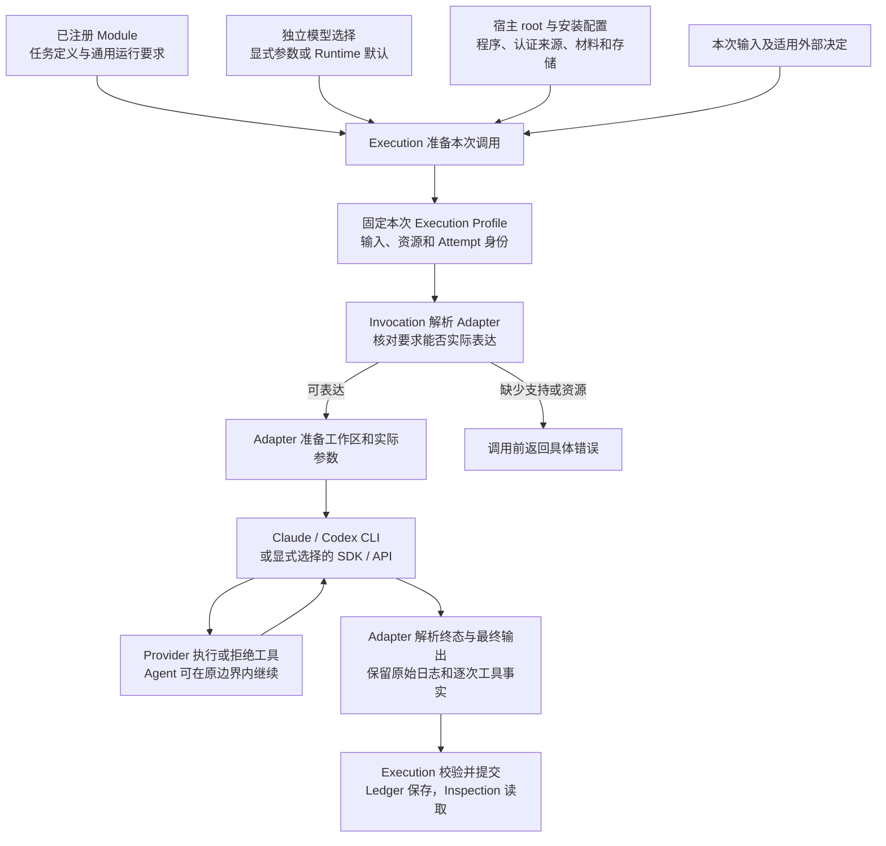

# Agent Runtime Environment, Execution Profile and Provider Adaptation

本文是 Runtime 运行环境、Execution Profile 和 Provider 适配的统一设计入口。它说明一次调用的
参数从哪里来、怎样成为 Claude 或 Codex 的实际配置，以及执行结果和日志怎样返回 Runtime。
实际接口、默认值、支持组合和验证结果由发布代码及其随包文档提供；设计中描述一种能力不表示所有
Adapter 都已经实现它。

## 0. Intent Capsule

Invocation 消费已解析的 Module、Execution Profile、本次输入和宿主资源，准备环境并执行一次
Provider invocation，返回输出、实际运行信息、工具记录和失败。Execution 拥有 Attempt 生命周期
与最终提交，Registry 拥有不可变定义，宿主提供程序、认证来源和资源，Provider 执行所配置的工具限制。

本合同同时适用于普通 Module 和 ModuleReviewer。后者只在定义端提供默认运行要求。本文不决定
业务审核结论、Workflow 路由、生产授权政策、数据库内容或软件发布，也不建立 Profile 选择服务、
第二套日志服务或底层系统调用监控。

## 1. Primary System Flow

工具执行期间的循环属于同一次 Provider invocation。它不自动创建 Runtime Attempt，也不改变已经
确定的权限。Runtime 在启动前准备边界；运行中的工具拒绝由 Provider 或实际资源执行方处理。

## 2. User Intent

调用者通过 Runtime 的同一公共入口运行已注册 Module，无需为 Claude、Codex 或不同 Reviewer
分别拼装启动脚本。模型选择、工具能力和宿主资源可以分别说明，并在调用前成为可追溯的实际配置。
配置要反映 Provider 与宿主真实能够执行的限制；一次被正确阻止的工具操作可以由 Agent 处理，
不因这个正常拒绝就让整个 Attempt 失去输出资格。

## 3. Reader Gain

- Module Owner 能区分任务定义、默认运行要求、模型选择和一次任务的资源。
- Host Integrator 能知道 root 与 `.runtime` 提供什么，以及什么时候需要认证或持久存储。
- Adapter Maintainer 能沿同一条配置转换路径实现不同参数组合，并准确表达两种 CLI 的差异。
- Runtime Maintainer 能区分工具结果、Provider 终态、有效输出与业务结论，并从同一入口取回真实日志。

## 4. Capability and Operation

| 处理对象 | 负责人 | 交接结果 |
| --- | --- | --- |
| 任务 instruction、完整输入输出 schema、语义完成条件 | Module / domain owner | 已注册定义；不携带 Provider 启动参数 |
| 通用 Module 运行要求与 Reviewer 默认环境 | Runtime 定义端 | 固定能力与 Policy 依赖；下游消费同一通用合同 |
| 本次模型、Profile、Variant 与 Attempt | Execution，Registry 保存已确定的 release | 完整执行配置与身份；Invocation 不再次选择 |
| 程序、依赖、认证来源、材料和可用存储 | 宿主与对应资源 owner | 明确安装配置及本次可用资源 |
| 配置转换、进程调用、事件与输出解析 | Invocation / Provider Adapter | 实际请求、结果和可观察事实 |
| 工具权限与资源限制的执行 | 所选 Provider、沙箱或资源 Gateway | 操作结果或拒绝；不把拒绝改成许可 |
| 最终提交、恢复、事实保存与读取 | Execution、Durability、Ledger、Inspection | 按原职责提交和展示结果 |

Provider Adapter 是技术绑定，不是新的 Agent 角色。Runtime core 不 import 宿主业务、Reviewer
实现或领域数据库；领域操作通过已经提供的公开资源接口执行。真实外部许可、grant 和执行 fence
仍由授权集成合同及其所属 owner 决定。

## 5. Configuration Sources and Execution Profile

### 5.1 输入与参数归属

| 参数类别 | 来源与默认规则 | 进入哪里 |
| --- | --- | --- |
| instruction、输入输出 schema、任务完成条件 | Module 的固定定义 | Prompt 和结果校验；Profile 不改写其含义 |
| execution mode、工具、输入交付、workspace、工具网络、上下文与预算要求 | 通用 Module 运行要求；ModuleReviewer 构造时提供 Runtime 默认 | 解析后的 Profile 和实际资源准备 |
| provider、transport、model、effort 及模型参数 | 调用者的显式选择；省略项使用 Runtime 随包公开的模型默认 | 本次 Profile；不反向改变 Module 能力 |
| root、CLI executable、认证来源、依赖、运行目录、可用 stores | 宿主安装配置；明确的本次资源参数按公共接口覆盖对应宿主项 | 宿主资源解析与实际调用记录 |
| 本次任务正文、材料和已提供的逻辑请求身份 | 本次请求 | 固定输入与执行记录；任务正文不能作为配置覆盖 |

Runtime 公开参数必须说明省略值、显式空值、允许覆盖的范围和失败行为。这里不规定一个“所有字段
后写覆盖前写”的通用合并器：模型覆盖不能修改工具，材料路径不能变成授权，存储配置不能进入模型。
同一语义参数在准备阶段解析一次，后续阶段消费同一结果。

### 5.2 Profile 的含义

Execution Profile 是已经解析的执行配置快照，保存模型、Adapter、工具、网络、工作区、上下文、
预算和输出方式的完整生效值。Module 运行要求回答需要什么能力；Profile 回答这一次选择了什么
执行组合；宿主资源回答这个组合实际使用哪些程序、文件和连接。三者联合构成实际 invocation。

普通 Module 显式声明自己的运行要求。ModuleReviewer 继承相同构造与执行合同，只提供一套
Runtime 发布的默认环境。Portable Reviewer source 提供任务身份、归属、prompt、schema 与相关
任务文件，不声明 transport、模型或工具配置。定义导出不检查本机 CLI，也不选择本次 Profile。

新的调用准备采用本次显式模型选择或 Runtime 默认，不把 root、环境名称、相邻项目或历史保存的
Profile 当作模型选择规则。已有低层接口明确传入的准确 Profile / Variant 继续按该绑定执行；读取
旧记录和重放已提交结果保持原内容，不补入新的 Reviewer 默认。

模型与能力分别变化：更换模型不修改 Module；更改 Module 的固定能力形成新定义。Profile 或
其他影响执行行为的配置改变，按 Registry 和 Execution 的既有版本及 Variant 规则记录，不能覆盖
旧记录或在正在运行的 Attempt 内切换。实际 CLI 安装版本和 Adapter revision 分别记录。

### 5.3 独立的能力维度

工具清单、工具网络、文件可读范围、可写范围和输入交付分别表达。允许 Shell 不等于允许联网，
允许读取不等于允许写入，agent mode 不等于启用全部工具。空工具清单表示明确关闭任务工具。
Provider 用于完成结构化响应的技术输出机制与访问文件、网络的任务工具分别识别。

| 维度 | 本合同的含义 |
| --- | --- |
| tool_free | 完整输入内联；不向模型开放文件、Shell、搜索、应用、额外网络或可写工作区 |
| agent | 在明确的工具与资源范围内自主执行；工具集合可以为空 |
| workspace none | 不提供模型可写任务目录；Provider 自身必要运行缓存另行隔离 |
| 私有草稿 | 只写本次允许的草稿与临时结果；材料和依赖保持只读 |
| 显式项目工作区 | 读取或修改本次明确提供的项目范围；不由宿主 root 隐含授予 |
| network denied | 工具不能使用额外网络；Provider 自身完成模型调用的连接另行配置 |
| gateway_only | 网络操作仅经明确的受控接口；原生 Shell 不因此拥有通用网络 |
| direct_sandboxed | 按明确的目标及协议范围配置工具网络；所选实现须能表达这些限制 |

这些是可组合的语义维度，不是要求 Adapter 只实现几个固定套餐。具体类型、枚举和值域由代码
合同定义。组合不受支持时指出不能表达的要求，保留其余合法组合；不自动开放权限、换模型或换 Provider。

## 6. Host Environment and Preparation

### 6.1 root 与 .runtime

宿主 root 是 Runtime 配置与本地注册内容的定位入口。基于 root 的公开操作先复用轻量 setup：
`.runtime` 不存在时创建，存在时读取和使用其中的 Runtime 内容；随包操作 Skill 通过同一 setup
接入宿主发现位置。已准备环境只做必要本地检查，不额外运行模型、扫描整个项目或连接生产数据库。
CLI 帮助和纯定义构造不初始化环境。

`.runtime` 可保存可复用的宿主参数及已注册定义。Module 与 Workflow 分开保存；单节点 Workflow
仍属于 Workflow。定义的版本存取与执行目标选择由 Registry 和 Execution 各自的公共合同处理，
不在环境准备或 Adapter 中另定规则。Invocation 消费 Execution 已经按本次用途选定的准确目标；
Profile 准备和实际调用固定同一结果，不重新从 root、latest 或其他指针选择版本。

宿主配置保存程序、依赖、运行资源和可用存储的定位信息；凭据通过对应可信接口或明确的私有位置
提供。Provider 认证只交给 Provider 的认证机制，PG 凭据只交给对应存储接口。秘密不进入 Profile
正文、prompt、argv 或共享日志。root 不自动授权建库、迁移 schema、保存执行数据或读取项目全集。

具体配置文件名、键、schema / table、默认目录与 CLI 选项由当前公开代码和帮助导出。本文不创造
一个新的环境配置服务，也不要求为目录、临时文件和凭据建立跨资源的通用管理框架。

### 6.2 实际资源与上下文来源

调用准备区分宿主配置目录、Provider 私有状态、本次模型可见材料、可写工作区和日志目的地。
它们可以由同一个 Runtime 进程管理，但读写用途不能混用。模型看不到 Provider 登录状态、Runtime
私有 Ledger、其他 Attempt 的材料或未授权凭据；只读材料的全文可能被模型读取，准入时按此处理。

项目指令、Skills、Plugins、hooks、MCP、环境变量和历史会话都可能改变模型行为。准备时明确本次
是否加载以及允许的来源，Adapter 使用 Provider 实际支持的开关和隔离方式实现。默认独立审核
不加载 ambient 项目和个人上下文；明确要求项目工作的普通 Agent 可以读取已授权项目入口和 Skills。
关闭自动发现不等于禁止读取已明确交付的 Skill 文件。

MCP 必须绑定本次明确提供的服务与权限。Provider 的 MCP 配置语法不等于 Runtime 已具备对应
跨进程桥，也不能把 SDK 的内存 callback 直接当成 CLI 服务。缺少所需桥接能力时准确报告；已有
不需要 MCP 的合法路径继续可用，不为调用它们先建设额外服务。

### 6.3 轻量检查与能力验证

每次调用检查实际程序可解析、必要资源存在、Profile 与 Adapter 的参数及能力相容，并准备本次
工作区和配置。认证失败保留 Provider 环境错误，不变成缺少生产授权。检查只针对本次需要的资源，
不在每次请求前重复完整模型 smoke、全仓扫描或全组合验证。

Adapter 开发、发布或依赖兼容性改变时，通过对应测试核对参数是否真正生效，包括初始化内容与
允许、拒绝的代表性操作。一次 help 或退出码检查只能说明对应事实，不能证明隔离效果。
若 Provider 的管理设置或实际环境与请求冲突，保留冲突，不静默覆盖成更宽配置。

### 6.4 限制执行与观测的边界

Runtime 将已声明限制配置到可信的 Provider、沙箱或资源接口，运行中的拒绝由这些实际执行方
负责。工具被拒绝说明这次操作未获准进入或未能执行；它可以作为工具结果交回 Agent。Runtime
不要求 CLI 暴露全部内部判断或每一次 OS 拒绝，也不从 stderr 文本推断未经证明的原因。

可写目录限制不自动构成读取隔离；关闭 Web 工具不自动限制 Shell 的联网。若任务明确要求的
某项隔离无法通过已交付机制实现，调用前报告不支持。运行中取得可靠证据表明实际权限被扩大、
限制失效或冻结材料被改变，则按 §13 拒收输出。这与被正确阻止的工具尝试是两个不同结果。

## 7. Request, Input and Context

### 7.1 公共请求

Adapter 的公共 execute 接口消费已经准备好的请求与 request-bound host，返回 AgentExecutionResult。
请求使用既有 Execution 身份、准确 Module / Profile / Adapter、完整输入与 Prompt Envelope、输出
schema、本次资源，以及所需的执行边界信息。具体签名与字段由公开类型和 docstring 定义。
不向调用者另开放一条原始 CLI flags 或 settings 的任意透传入口。

Execution 在调用前产生真实 Attempt-start 记录；临时自测也使用同一执行身份和日志合同。外部
受保护操作按授权集成合同携带真实决定；普通自测使用明确测试资源，不伪造生产批准、grant 或
allow-all 服务。Provider 登录、宿主调用资格和业务资源授权分别处理。

### 7.2 输入交付和输出约束

Runtime 固定完整任务输入和实际发送的 Prompt 内容，Adapter 不在记录后私自追加任务语义。
模型可见任务材料与 Runtime 控制信息分开。允许模型探索一个目录，不等于已经把该目录全文作为
冻结输入交付；实际读取内容按 Provider 可取得的事件记录。

inline、Gateway、attachment、hybrid 和显式 workspace 按实际资源与任务完整性要求选择。
必须完整交付的内容不静默截断、摘要或替换为模型自行挑选的片段；分页 Gateway 还须按所属合同
核对完整分页覆盖。Provider context limit 无法满足任务时，返回输入不足或预算问题，由任务 owner
决定分块或其他方案；Adapter 不设计业务工作流。

原生结构化输出由 Adapter 转换 schema，返回后仍验证 Module 的完整 canonical schema。
prompt_only_json 和 native_structured_output 显式选择，不因其中一种不可用自动切换。
生产用途保留 native_structured_output 默认；prompt_only_json 作为明确选择的 Evaluation Variant
使用，不自动推广为生产配置。原生输出与 prompt 中的重复 schema 约束须按公开编译规则处理。
Provider 特有的 schema 转换不产生新的业务 Module，转换行为随 Adapter 版本记录。

### 7.3 Context 与重复执行

stateless、create、resume 和 reconstruct 使用既有 Context 合同。新请求不从 CLI 的“最近会话”
或宿主历史自动续接。Native resume 需要同一任务与执行配置的兼容依据；跨模型、Provider 或隔离
范围的继续工作，从允许的输入、已解析输出和连续性材料重建，不复制不透明会话目录。

已提交请求的重放读取原日志与结果，不再选择模型或启动 Provider。模型或输入改变按既有规则
形成新的执行身份。无持久存储的自测可以返回完整内存记录，但不承诺进程退出后的恢复。
工具内部重试、Runtime 新 Attempt 和同一请求的结果重放分别记录。

## 8. Tools, Domain Operations and Provider Bindings

### 8.1 原生工具与普通 Module

read、search、shell 是逻辑能力，Adapter 将它们映射为所选 Provider 实际提供的工具。
不同 Provider 不必暴露相同工具名称，也不能只因名称相似就宣称能力等价。Shell 中的常用读取、
差异和测试命令复用 Shell，不逐条建立 Runtime 工具；子进程仍受已经配置的资源边界约束。

标准 Reviewer 的 Runtime 默认环境允许读取、搜索和受限 Shell，审核材料只读，临时工作区可写，
工具网络关闭，上下文独立。普通 Module 也可以明确使用这些能力和自己的非审核输出 schema。
Engineering 的合法本地操作要求通过 Runtime 统一解释，不能因非模型 operation ID 或工具名不同
而排除，也不能为了执行成功删除原有操作要求。

### 8.2 必做命令、限制命令与领域许可

必做命令属于任务完成要求，真实命令结果交给所属 validator 判断。只允许某些命令则是额外权限
限制，需要实际可执行的约束。二者分别表达；通用 Reviewer 默认不附加固定命令白名单。
以 commit 为审核对象时，仍提供准确冻结文件树、只读源文件、必要依赖与临时测试目录，并核对
被审源内容一致。材料被实际修改与修改尝试被拒绝分别处理。

真实领域或 Gateway operation 保留原 Module 声明、请求身份和外部权限。受控资源在必要许可
成立前不进入 callable。拒绝保留原 owner 与原因，按所属 Workflow 合同成为工具结果或执行失败；
它本身不使所有 Runtime Attempt 自动失效。执行授权被撤销、fence 关闭或调用身份错误仍会阻止
对应执行继续。原生工具 trace 不伪装成逐次授权 receipt。

### 8.3 SDK / API 与 Provider Skill

SDK / API 通过同一请求和结果合同表达自身能力。可用的 before-tool callback 或 hook 可以实现
逐次约束，但不成为 CLI 必须模拟的共同接口。Callback 正常拒绝工具与整体执行失效同样分开；
需要双向控制流的 SDK 必须保持它自己的实际生命周期。

Provider Skill packaging 只将准确的已提供 Skill 内容转换为 Provider 输入，不改变其语义。
这与项目 Agent 读取明确授权的项目 Skill 是不同输入方式。无对应 packaging 或操作桥接时明确
报告缺失能力；Adapter 不自动退回另一种 transport。

## 9. Claude CLI Adaptation

ClaudeAdapter 按规范化字段和已准备资源组合 `claude -p`，而不是按 Reviewer 名称选择脚本。
下表是参数转换的设计对应关系；准确参数、settings 结构和支持版本由同一 Adapter 的代码与测试
维护，运行前以所选安装版本为准。

| Runtime 要求 | Claude CLI 转换位置 | 必须保留的区别 |
| --- | --- | --- |
| 模型与推理 | `--model`、`--effort` | 独立于工具与资源；记录请求值及可得的实际响应身份 |
| 任务工具集合 | `--tools`；空集合显式传空值；read/search/shell 映射 Read/Grep/Bash | `--allowedTools` 表达免询问许可，不等于限定可用工具全集 |
| 文件范围与 Shell | permissions 与 sandbox filesystem 配置、cwd 和明确目录 | 文件工具和 Bash 子进程分别落实对应限制；允许目录不证明材料只读 |
| 工具网络 | sandbox network 配置及关闭未选的网络工具 | Provider 自身连接另行处理；不允许隐式 unsandboxed 逃逸 |
| 项目与个人上下文 | 明确的 settings sources、Skill / plugin / hook / MCP 开关和私有状态 | 独立审核关闭 ambient 来源；项目工作只加载明确范围 |
| 输出模式 | `--json-schema` 或显式 prompt JSON；事件使用 stream-json | 原生输出返回后仍做 canonical schema 校验 |
| 一次性运行与恢复 | `-p`、会话持久化选项、明确的兼容 resume 输入 | 不用最近会话自动续接；会话记录不替代 Runtime 日志 |

工具选择与文件、网络隔离要一起落实。Claude CLI 的工具可用性参数和 sandbox 参数分别承担
相应限制；安全模式与 MCP 等组合可能互相影响，只有实际支持的组合才能由 Adapter 声明。
代表性语法依据是 [Claude CLI reference](https://code.claude.com/docs/en/cli-usage)、
[settings](https://code.claude.com/docs/en/configuration) 和
[sandboxing](https://code.claude.com/docs/en/sandboxing)。

Adapter 收集初始化事件、工具请求和结果、最终 result、stdout 与 stderr。Bash 的错误可能只有
工具失败正文，没有可靠的底层权限原因；保留原结果即可。结构化 permission denial 也是一次
拒绝事实，不自动变成 Runtime 整次失败。若 CLI 自身终止或返回执行失败，则按实际终态处理。

## 10. Codex CLI Adaptation

Codex 通过相同规范化请求进入其 Adapter，实际转换为 `codex exec`。它可以采用与 Claude 不同
的工具实现、配置和事件格式；共同部分是请求意义和结果合同，而非相同的 CLI flags。

| Runtime 要求 | Codex CLI 转换位置 | 必须保留的区别 |
| --- | --- | --- |
| 模型与推理 | `--model` / `-m` 与 `model_reasoning_effort` | 按已选模型语法转换；不通过模型选择增加权限 |
| 任务工具集合 | 所选版本的工具 feature、MCP 与其他能力配置 | 关闭 Shell 不等于关闭所有其他工具；Read/Grep 名称不直接移植 |
| 文件范围 | cwd、sandbox / permission 配置与明确可写目录 | read-only 与 workspace-write 不能单独证明只可读取本次材料 |
| 工具网络 | sandbox 网络配置，并分别限制 web、apps、MCP 等额外入口 | 某一类工具的网络开关不代表所有工具都被限制 |
| 非交互权限处理 | approval 配置与实际资源限制 | 不等待无人响应的确认；禁止自动扩大本次既定权限 |
| 项目及个人上下文 | 独立状态与明确 config、项目指令、Skills、plugins、hooks 来源 | 仅跳过 user config 或 rules 不证明所有 ambient 内容已消失 |
| 输出与日志 | `--json`、`--output-schema`、最终响应输出及 stderr | 事件用于归一记录，最终内容仍验证原 schema |
| 一次性运行与恢复 | `--ephemeral` 或明确的兼容 resume | 不从 `--last` 自动选择历史；完整执行重试归 Execution |

这些参数分工参见 [Codex exec](https://learn.chatgpt.com/docs/developer-commands#codex-exec) 与
[Configuration Reference](https://learn.chatgpt.com/docs/config-file/config-reference)。官方提供参数
不等于当前 Runtime Adapter 已经接通或验证该能力。对于严格材料读取隔离、受控 MCP 等请求，
代码必须如实说明当前支持范围；不能仅因 CLI 提供 workspace-write 就宣称满足整个 Profile。

Codex 的命令失败、工具错误、turn failure、进程退出和最终响应分别记录。Agent 处理一个工具
错误后继续形成有效输出，仍可完成本次 Attempt；CLI 未形成合法终态、执行中断或输出无效则按
§13 处理。Adapter 不依赖 Provider 私有内部状态推导未返回的信息。

## 11. Output and Execution Records

### 11.1 四种结果分别判断

| 结果层次 | Runtime 保存和判断什么 |
| --- | --- |
| 单次工具调用 | 请求、真实结果或错误，以及能取得的调用身份；失败后可在同一 invocation 内继续 |
| Provider invocation | 实际程序、配置、进程及 Provider 终态；退出 0 不代替其他检查 |
| Runtime Attempt | 合法返回、原 schema 与必要的结构性完成检查、执行身份和结果提交条件 |
| 业务任务 | Module / Workflow owner 定义的结论；有效 non_pass 或 blocked 不等于技术故障 |

Adapter 返回 infrastructure result，不自行批准业务结果、选择 Workflow edge 或选择 A/B winner。
输出只有经 Execution 的校验与提交后才成为 Runtime 结果；多 Variant 的 Evaluation、Selection
和 Resolution 保持原职责。文件修改、Provider 成功与产物被业务接受不互相替代。

### 11.2 原始日志与统一工具记录

Runtime 通过同一日志接口提供实际 stdout、stderr、已收到的公开 Provider 事件，以及标准化的
逐次工具请求和结果。标准化记录关联准确 Attempt、Provider 调用 ID 和原始事件位置；并行或乱序
结果不能互相覆盖。工具失败与后续重试分别保留，不由模型补写审计记录。

未知的内部退出码、时间、权限原因、token 分量或工具结果明确保持未知。Provider 未返回的信息
不从模型描述或普通错误文本补造。CLI 总体输出、Runtime 实际发送的请求、已交付材料和工具
实际读取是不同观察；不把它们合称为 Provider 全部隐藏上下文或完整内部推理。

用量按 Provider 口径归一：input_tokens 包含缓存输入总量，cache_read_tokens 和
cache_creation_tokens 是可空子集，不再次累加。未提供的用量保持未知，不作为零或估算账单。

日志清理前保存已采集内容；超时、取消、解析失败与工具拒绝也返回这些记录。流中断、截断、缺失、
记录失败和脱敏造成的差异明确标注。原始受保护内容仅供有访问资格的调用者读取；共享记录保留
身份、引用、用量和有界分类，凭据等秘密脱敏。原始日志与脱敏展示分别标明，不能同时声称字节
完全一致。缺失日志是否影响完成，按本次明确的证据要求判断，不能用摘要冒充完整记录。

### 11.3 存储、恢复与版本

有明确授权的持久存储时，由 Ledger 和对应内容存储保存记录；没有持久存储时，自测可返回内存
结果和日志。注册定义持久化与执行日志持久化是两件事。显式要求持久化而保存失败时报告该失败，
不把内存结果称为已经保存。PG schema 与 table 由存储实现定义，Invocation 不维护另一套数据库。

实际 Provider、模型、CLI 版本、Adapter revision、执行配置和输入随调用记录。兼容的 CLI 安装
升级供后续调用使用，不改写旧 Profile 或旧日志。参数转换行为改变时更新 Adapter 版本及对应
绑定；运行中的 Attempt 不自动切换。只保留会话文件或模型摘要不能替代已提交执行记录的重放。

## 12. Public Interface and Effects

以下接口沿用当前职责名称。准确 Python 签名、字段、默认值和返回类型由公开代码与 docstring
定义并自动导出，Design 不维护另一套可执行接口定义。

| 接口 | 输入和输出 | 可观察影响与失败 |
| --- | --- | --- |
| resolve_execution_adapter | 已解析的准确 Profile / Adapter 和所需能力，返回适用实现 | 不调用模型；缺绑定或能力时返回具体缺口 |
| probe_execution_adapter | 已选 Adapter 和宿主依赖，返回检查结果 | 只执行明确的依赖检查；模型 smoke 单独授权 |
| prepare_registered_invocation_context | 固定定义、输入、Profile、Attempt 与本次资源，返回准备结果 | 加载和验证本次内容；不另选模型或历史 Profile |
| execute_agent_attempt | 同一准备结果及 request-bound host，返回 AgentExecutionResult | 启动所选 Provider，保留输出、用量、工具与失败 |
| read_authorized_input / authorize_operation | 准确输入 handle 或操作请求，返回允许内容或真实许可结果 | 拒绝未获准操作；保留原 owner；不自动推导整次失败 |
| stage_output_bytes | 声明的输出及 bytes，返回暂存引用 | 不提交权威结果；存储失败保留所属错误 |
| normalize_provider_result | Provider 实际结果和 canonical schema，返回规范化输出或失败 | 不形成业务判断，不补造缺失事实 |
| prepare_provider_skill_package | 准确 Skill 内容与显式 packaging 选择，返回 Provider 输入 | 确定性转换；缺支持时明确拒绝 |

宿主入口与 Skill 只消费这些 Runtime 能力，不另维护模型启动器或日志解析器。操作手册引用自动
导出的 CLI / API 文档；Runtime CLI 与 Portable CLI 保留各自用途。代码库的
`docs/agent_runtime_reviewer_api.md` 提供公开 API，`docs/agent_runtime_claude_native_tools.md`
说明原生工具入口；这两个现有名称不限制通用 Module 的适用范围。它们与本文件分开随软件交付，
不复制进独立 Design bundle；生成内容必须和代码一致。

## 13. Completion, Failure, and Recovery

### 13.1 正常拒绝与执行失败

| 观察到的情况 | 本次处理 |
| --- | --- |
| 工具报错、路径无权访问、网络被拒绝或 Provider 正常拒绝一次操作 | 保存真实工具结果；Agent 可在相同边界内继续；不自动使 Attempt failed |
| 调用前无法表达所需工具或隔离，或必要资源缺失 | 不启动 Provider，返回能力或环境错误 |
| CLI / Provider 整体失败、超时、取消或无合法最终输出 | 返回对应 failed / cancelled 结果，保留已有日志与用量 |
| 可靠证据显示实际越界效果、权限被扩大、冻结材料被修改，或执行身份失效 | 拒绝接受输出，按实际原因记录执行失效；不掩盖已发生效果 |
| 外部授权失效、fence 关闭或资源 owner 要求终止 | 按原授权合同停止或隔离结果，保留真正的失败 owner |
| 输出通过技术校验，但业务结论是 non_pass / blocked | 保留有效业务结果，不用技术重试追求通过 |

因此，“拒绝一次工具”与“Runtime 无法继续接受本次结果”没有自动等价关系。明确的
permission_denied 事件也先按它表示的作用范围处理；Provider 宣布整个 invocation 失败时才按其
整体终态处理。Runtime 不新增全量 OS 拒绝检测承诺，不把全部 Bash 错误作为安全违规。

### 13.2 错误含义与后续动作

| 既有错误族 / 错误码 | 含义 | 调用者动作 |
| --- | --- | --- |
| ADAPTER_BINDING_UNAVAILABLE | 程序、Adapter 或必要依赖不可用 | 修复明确依赖，不自动替换 Provider |
| ADAPTER_CAPABILITY_UNSUPPORTED | 所选实现不能表达请求的能力或 schema | 调整被授权的执行选择，或交给 Adapter owner 实现 |
| ADAPTER_REQUEST_INVALID / input_too_large | 输入、绑定或预算无法形成合法请求 | 修正准确输入或由任务 owner 决定交付方案；不静默裁剪 |
| ADAPTER_POLICY_VIOLATION | 实际执行边界失效、可靠观察到的越界效果或受保护对象漂移 | 拒收本次输出并保留事实；正常工具拒绝不归入此整次失败 |
| ADAPTER_OUTPUT_INVALID | 最终输出无法解析或不满足原 schema / 必要结构性完成条件 | 保存失败及 Provider 用量，交由既有 repair policy 决定后续 |
| ADAPTER_CONFORMANCE_FAILED | Adapter 违反调用、结果或必要记录合同 | 返回实现 owner；不把故障包装为业务结论 |
| authentication、quota、rate_limit、transport、provider、timeout、cancelled | Provider 或进程的实际失败类别 | 保留实际作用范围及可得重试依据，不从包装异常猜测 |

操作级拒绝可继续使用该资源接口已有错误码，其作用范围仍是当前操作。外层 execute 只有在
整次执行条件失效时才形成 terminal failed result。未知原因保持 unknown；调用前的配置错误、
运行中工具错误、Ledger 保存失败与外部授权结果不混为一种错误。

### 13.3 Retry 与最终提交

Adapter 管理一次 Provider invocation，不暗中重新启动完整 Module。CLI 内部的工具调整和重试
保留在同一 Attempt；Execution 按既有 Retry Policy 决定是否增加新的 Attempt，次数包括首次。
新 Attempt 保持原配置和任务，使用独立工作资源；更换模型、输入或权限是新的明确执行选择。

Execution 在最终提交时验证身份、必要输出条件及适用 fence。已提交结果通过原记录重放；
进程崩溃后尚未确认的效果不假定为未发生。Durability 与 Ledger 保留既有恢复职责，Invocation
不另建请求回执、全局恢复服务或并行日志。

## 14. Dependencies and Verification

本合同消费 Runtime T1 的职责、Registry 的准确定义、授权集成的真实边界、Ledger 的记录接口及
任务 owner 的完成条件。它不重新定义这些相邻系统。设计重整保持原 release/hash、Context 隔离、
输出 Resolution 和外部授权含义；新的执行语义通过后续代码及版本化交付落实，不改写历史结果。

验证按实际支持的参数和资源组合进行，并区分代码检查、模拟执行与真实 Provider 证据：

1. 普通无工具 Module 能经公共入口执行，且无隐含工具、网络或 ambient 上下文；普通 Agent
   使用允许的工具与自己的输出 schema。ModuleReviewer 最后验证同一路径上的默认环境。
2. 显式模型选择与 Runtime 默认分别验证；更换模型不改变工具能力；root 与历史 Profile 不决定
   新调用模型。准备结果和实际执行消费同一份已解析配置。
3. 工具集合、只读材料、可写目录、网络、输出模式与允许的上下文组合，均核对真实转换；未知或
   不支持组合在 Provider 前返回具体缺口，不以 Provider 身份或 Reviewer 名称一概拒绝。
4. 正例证明允许的读取、搜索、Shell 命令和临时写入能执行；负例证明被禁止的效果被阻止。
   工具拒绝后允许 Agent 继续形成有效输出，并在日志中保留那次失败。
5. 普通命令错误不被解析成权限原因；结构化工具拒绝不自动使整次失败；实际材料漂移、边界失效、
   Provider 终止和外部 fence 关闭分别证明正确的停止或拒收行为。
6. 验证任务必需命令的真实结果、对应候选和覆盖情况；另有命令白名单要求时独立验证其限制。
   日志缺少必要内部结果时明确未能证明，不用模型自报替代。
7. 工具并发、乱序、错误、重试、超时和取消均保留准确原始事件与统一记录；未知信息不补造，
   脱敏与日志不完整明确标记，存储失败不冒充持久化成功。
8. 相同请求重放不调用 Provider；配置改变不覆盖旧记录。无 PG 自测、明确持久化和真实外部
   资源分别验证，不为普通自测要求生产授权。
9. CLI 安装或 Adapter 转换升级后，检查实际输入、初始化、代表性工具和输出；正式支持范围来自
   相应测试与文档。unsupported、unavailable、not_run 和 failed 保留原义。

本设计的独立审查只判断目标、职责和可实施性；文稿通过不证明尚未实现的 CLI 组合已经通过测试，
也不替代代码审核或部署。具体实现顺序由后续 CodeDesign 拆分，现有可用能力与待交付能力在随包
文档中清楚区分。

## 15. References

- [Runtime Domain Root](agent_runtime_00_execution_charter.md)
- [Runtime Registry](agent_runtime_01_module_contract_and_assembly.md)
- [Agent Runtime](the_agent_runtime.md)
- [External Authority Integration](agent_runtime_09_authorization_integration_contract.md)
- [Execution Inspection](agent_runtime_06_standalone_package_and_lifecycle_contract.md)
- [Durability](agent_runtime_07_temporal_durable_adapter_contract.md)
- [Agent Capability Verification](agent_runtime_11_agent_capability_verification.md)
- [Design Doc Management](the_design_doc_management.md)
- [Timestamp Semantics](the_timestamp_semantic.md)
- [Claude CLI reference](https://code.claude.com/docs/en/cli-usage)
- [Claude settings](https://code.claude.com/docs/en/configuration)
- [Claude sandboxing](https://code.claude.com/docs/en/sandboxing)
- [Codex developer commands](https://learn.chatgpt.com/docs/developer-commands#codex-exec)
- [Codex configuration](https://learn.chatgpt.com/docs/config-file/config-reference)
