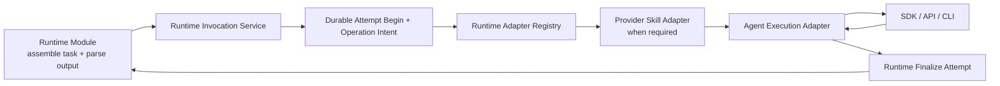
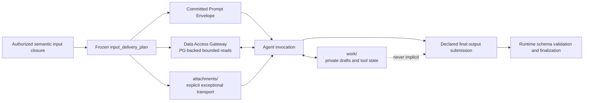
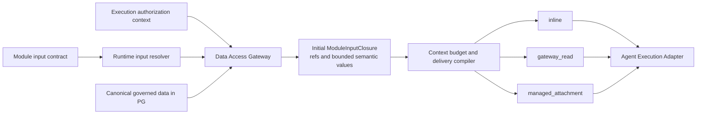

# Agent Runtime Agent Execution Adapter Contract

**Purpose**: define the portable provider protocol and admission requirements
for SDK, API, CLI, and provider-facing Skill-backed Agent execution.

**Required reader gain**: a maintainer can implement Claude Agent SDK, Codex
CLI, or a future model adapter without importing a domain workflow, choosing a
graph edge, inventing authorization, or making provider context the only
continuity authority.

## 0. Contract Capsule

```yaml
layer: T1
status: proposal
canonical_owner: designDoc/agent_runtime_08_agent_execution_adapter_contract.md
scope:
  - provider-neutral execution request, result, failure, and context records
  - tool-free and Agent execution capability modes
  - Attempt workspace and network-policy enforcement boundaries
  - adapter descriptor, registry, admission, and dependency probe
  - pre-operation authorization host callback
  - Claude Agent SDK, Claude Skill, and Codex CLI adapter requirements
  - Module Run-level sibling Execution Variants and provider A/B isolation
  - provider telemetry, usage, failure, and content-boundary normalization
non_goals:
  - domain prompt semantics, output interpretation, or quality verdicts
  - durable workflow orchestration, owned by agent_runtime_07
  - product entitlement policy or canonical publication
  - domain Module registration and graph meaning
inputs:
  - designDoc/the_agent_runtime.md
  - designDoc/agent_runtime_00_execution_charter.md
  - designDoc/agent_runtime_01_module_contract_and_assembly.md
  - designDoc/agent_runtime_06_standalone_package_and_lifecycle_contract.md
  - designDoc/agent_runtime_09_authorization_integration_contract.md
outputs:
  - AuthorizedAgentExecutionAdapter protocol
  - ProviderSkillAdapter protocol
  - provider request/result/failure/context DTOs
  - adapter registry and descriptor contract
  - Claude Agent SDK, Claude Skill, and Codex CLI conformance requirements
  - Module Execution Variant A/B contract
  - execution-mode, Attempt-workspace, and network-policy contract
truth_surfaces:
  - src/agent_runtime/contracts/invocation_adapter_definition.py
  - src/agent_runtime/invocation/invocation_codex_module_invocation.py
  - src/agent_runtime/execution/execution_module_invocation.py
runtime_triggers: none
downstream_consumers:
  - Agent Runtime invocation and evaluation services
  - provider adapter implementers
  - Module Execution Variant and evaluator Attempt execution
  - provider conformance and clean-wheel suites
open_decisions: none
review_gate: provider conformance, data-leakage, lifecycle-order, and clean-wheel tests
runtime_surface_ledger:
  - "active DTO/protocol baseline: src/agent_runtime/contracts/invocation_adapter_definition.py"
  - "canonical Codex CLI execution adapter: src/agent_runtime/invocation/invocation_codex_module_invocation.py"
  - "authorization-enforcing execution kernel: src/agent_runtime/execution/execution_module_invocation.py"
verification_hooks:
  - ./.venv/bin/python -m pytest tests/test_agent_runtime_public_adapter_contracts.py -q
  - ./.venv/bin/python -m pytest tests/test_agent_runtime_native_structured_output.py -q
  - ./.venv/bin/python -m pytest tests/test_agent_runtime_tool_session.py -q
```

## 1. Adapter Boundary

An Agent Execution Adapter invokes one frozen Module Execution Variant Attempt. A
Provider Skill Adapter deterministically packages one admitted provider-neutral
Skill release for that execution adapter. Neither is an Agent role, workflow
node, graph runner, evaluator, domain writer, or Skill semantic owner.



Runtime Modules own task-plane prompt bundles, allowed evidence, output-slot
meaning, and output parsing. Skill Governance owns the provider-neutral Skill
artifact and lifecycle. Runtime owns execution identity, authorization-context
propagation, protected-operation observations, provider packaging, context,
usage, failure normalization, and
lifecycle ordering. The Agent Execution Adapter owns provider transport; the
Provider Skill Adapter owns only deterministic translation from an admitted
Skill release to the exact provider-facing package pinned to the Variant.

Current Research Theme adapters and `src.external_agents` are migration
consumers. They cannot donate domain-bound DTOs or become Runtime dependencies.

The adapter registry consumes only the exact Runtime Module Release, execution
profile, Skill release when applicable, and adapter releases pinned at Workflow
Execution admission. An Agent Execution Adapter never reads a Skill authoring
document. A Provider Skill Adapter may read only the admitted immutable Skill
release supplied by Runtime; it cannot discover an arbitrary repository Skill,
resolve a `WorkflowExecutionBinding`, reinterpret Skill semantics, or treat a
provider session as proof that host admission succeeded. Those host-side
decisions precede Runtime admission under `agent_runtime_10`.

## 2. Public Protocol

```python
class AuthorizedAgentExecutionAdapter(Protocol):
    @property
    def descriptor(self) -> AgentExecutionAdapterDescriptor: ...

    def execute(
        self,
        request: AuthorizedAgentExecutionRequest,
        host: AuthorizedAgentExecutionHost,
    ) -> AgentExecutionResult: ...
```

The adapter is resolved by exact adapter ID and revision frozen in the Module Execution
Variant. Class names and module paths do not determine public identity.

### 2.1 Descriptor

`AgentExecutionAdapterDescriptor` binds:

```text
adapter_contract_version
adapter_id
adapter_revision
provider_id
transport_family: sdk | api | cli | in_process
transport_kind: exact registered transport, e.g. claude_agent_sdk | codex_cli | in_process_test
runtime_package_id
runtime_package_version
supported_context_modes
supported_read_isolation_modes
supported_execution_modes
supported_input_delivery_modes
supported_network_policies
supported_output_constraint_modes
supports_dynamic_operation_authorization
admission_state
```

Transport identity is two layers used consistently across the repository:
`transport_family` is the bounded mechanism class, and `transport_kind` is the
exact registered transport that Execution Profiles and Module
`compatible_transport_kinds` name. `in_process` exists so that a synthetic
test double never claims an SDK, API, or CLI mechanism.

Dependency discovery is an explicit probe. Discovery or import success never
grants execution authority.

### 2.2 Request

`AuthorizedAgentExecutionRequest` contains:

- complete Workflow Execution when applicable, Module Run, Execution Variant, and Attempt identity;
- exact Module Release ref/hash and Execution Profile ID/ref/hash;
- committed Attempt-begin receipt plus execution authorization context and
  protected-operation intent refs;
- exact Product operation-decision evidence for every invocation and, only for
  an operation classified as high risk, the paired single-use grant and grant-
  binding refs/hashes;
- authorized `ExecutionInputRef` bindings with ref, hash, schema, media type,
  `logical_name`, and, only for explicitly file-backed input, a Cell-local
  read-only path or stream handle;
- exact Cell-local Prompt Envelope ref/hash;
- exact frozen `input_delivery_plan` ref/hash;
- the Module Release's canonical output-schema ref/hash;
- immutable input-closure hash, data-use purpose, request hash, and idempotency
  key.

#### 2.2.1 Execution scope

The request carries exactly one execution scope: the Workflow Execution ID
when the invocation belongs to a durable Workflow Execution, or the isolated
Module scope ref/hash for a direct `test`/`evaluation` Module Run. A caller
never fabricates a Workflow Execution identity for an isolated run. Inside
`agent_runtime_09` authority records, whose `workflow_execution_id` field
predates this split, the field carries the execution scope identity: the
Workflow Execution ID for workflow scopes, or the deterministic identity
derived from the isolated scope ref for isolated scopes. Splitting the AR09
record contracts themselves is scheduled with the Module-model cutover, before
any authorization record persists beyond process memory.

The `attempt_begin_receipt_ref` of a Test/Evaluation Module Run derives from
the committed Attempt-start record: the ref names the Attempt and the hash is
computed over that record's canonical content, so the receipt resolves to
Runtime-committed evidence rather than a fabricated placeholder.

#### 2.2.2 Authorization evidence closure

Every authorization evidence field resolves to one committed
`agent_runtime_09` authority record. The request transports references and
hashes only; it never restates or reinterprets the authority content.

| Request field group | Canonical authority owner |
| --- | --- |
| `execution_authorization_binding_ref`/`_sha256` | `ExecutionAuthorizationContextBinding` |
| `protected_operation_intent_ref`/`_sha256` | `ProtectedOperationIntent` |
| `product_operation_decision_ref`/`_sha256` | `ProductOperationDecision` |
| `gateway_authorization_observation_ref`/`_sha256` | `GatewayAuthorizationObservation` binding the decision to the intent |
| `operation_grant_ref`/`_sha256` + `grant_disposition_ref` | Product-issued `OperationGrant` and its Gateway disposition, present only for an operation classified high risk |

Each group is present completely or not at all, and the groups form a
dependency chain: a grant requires the operation-decision groups, and the
operation-decision groups require the execution authorization binding. A
Module that declares a model operation requires the binding and
operation-decision groups under every purpose, including `test` and
`evaluation`; a host-registered test authority changes where the evidence
comes from, not whether it exists. Empty evidence is admissible only for the
conjunction of `test`/`evaluation` purpose, `in_process` transport family,
zero declared operations, and no provider, model, or tool callable. A provider
adapter must refuse a model invocation request whose evidence groups are
absent.

Provider/model, execution mode, tool, timeout, sandbox, network, Context, and output-normalizer
facts resolve from the pinned Execution Profile, Module Release, and Cell-local
Prompt Envelope. The Adapter receives no mutable profile snapshot or `latest`
lookup.

Prompt and input content may cross the in-process adapter boundary inside an
authorized Cell. It is never serialized into the shared ledger or durable
backend history.

A `local_handle` is an opaque key into a request-bound Cell table. It may use a
relative, human-readable label, but an Adapter or host must never pass it to a
filesystem API as a path or use it to escape the authorized input/output table.

### 2.3 Result

`AgentExecutionResult` returns only infrastructure facts:

```text
terminal_status: completed | failed | cancelled
resolved_provider/model/runtime facts
output submissions keyed by opaque output-slot ID
model and tool operation observations bound to Product decision, execution authorization context, and effect refs
input/output/cache-read/cache-creation tokens, each nullable
AdapterContextResult
AgentExecutionFailure | null
cell-local trace ref/hash
```

The Adapter normalizes `input_tokens` to total input including cached input.
`cache_read_tokens` and `cache_creation_tokens` remain optional subset
breakdowns. A consumer compares `input_tokens` directly across providers and
never adds either cache field to it. This mapping is required because Claude
reports uncached input separately from cache reads and writes, while OpenAI
reports cached input as a subset of total input.

For a tool-free text Module, the final provider response is the output body.
Runtime hashes it, validates declared slots, writes the content-addressed blob,
and finalizes the Attempt without a writable provider workspace. Agent
execution may use an Attempt workspace as a private drafting and tool surface.
The Agent may write a candidate, read it, revise it, and validate it inside the
same invocation. A workspace file is not automatically a Module input, output,
Context record, execution log, or domain artifact. Only the declared final
output submitted through the Adapter can be finalized. The Adapter does not
write domain state or choose the next graph edge.

### 2.4 Execution capability modes

Execution mode, semantic-input delivery, Attempt-workspace policy, and network
policy are separate profile dimensions. A writable draft workspace never
implies a Gateway capability.

| `execution_mode` | Input delivery | Provider capabilities | Output path |
| --- | --- | --- | --- |
| `tool_free` | `inline` only; admission fails before invocation when the frozen semantic projection exceeds the profile's input budget | No shell, filesystem, browser, app, search, network, or writable workspace capability | Final provider response |
| `agent` | Exact frozen `input_delivery_plan`: `inline`, `gateway_read`, `managed_attachment`, or `hybrid` | At most one Attempt-local draft workspace unless the exact Profile separately declares Gateway tools or attachments | Declared final response or declared output slot after Runtime validation |

The immutable Execution Profile carries `semantic_input_delivery_mode`,
`attempt_workspace_policy`, and `gateway_access_reasons[]`. The ordinary
closed-package Agent Profile is `inline + own_draft_read_write + denied` with
empty `gateway_access_reasons` and Gateway `tool_policy`. The Agent may reread
and revise only its own drafts; it receives no PG, repository, ambient
filesystem, search, browser, or network capability.

Claude SDK may auto-approve built-in reads before its ordinary
`can_use_tool` callback. The Claude Adapter therefore installs a `PreToolUse`
hook over every Profile-visible workspace tool and resolves each path against
the Attempt root before execution. The hook also keeps the SDK bidirectional
control stream alive through the terminal Result, so permissioned writes do
not encounter a prematurely closed stream. Any hook denial taints the Attempt;
the model cannot recover it into a successful Runtime output.

`agent` does not imply network access. `network_policy` is pinned
independently in the same Execution Profile:

| `network_policy` | Meaning | Required enforcement |
| --- | --- | --- |
| `denied` | The provider process has no network access | Sandbox or transport-level denial |
| `gateway_only` | The Agent may use only registered Runtime or host-provided network operations | Each operation crosses the registered Gateway and produces an authorization-bound observation or receipt |
| `direct_sandboxed` | The provider sandbox may establish direct outbound connections within an exact admitted egress boundary | Immutable destination/protocol/credential boundary, Cell-local trace, and profile-specific security admission |

A Module receives model-visible Gateway tools only when its registered task
requires entitlement-specific semantic search, external verification or web
search, an input set that cannot be frozen before invocation, on-demand access
to a knowledge base that exceeds the context budget, or authorized Reviewer
exploration outside the frozen Package. Those Profiles use `gateway_only` or,
only when a provider cannot support a Gateway, an explicitly admitted
`direct_sandboxed` profile. Context overflow alone never causes an in-flight
fallback: admission selects an explicit Gateway Variant or fails
`input_too_large` before provider invocation.

Code accepts only these corresponding reason IDs:

```text
entitlement_specific_semantic_search
external_fact_verification
unfrozen_input_set
oversized_knowledge_retrieval
authorized_package_external_exploration
```

A Gateway delivery mode with no reason, or an inline Profile with any Gateway
reason or tool, fails release validation.

### 2.5 Attempt workspace boundary

An Attempt workspace is an execution resource created for one exact
`(workflow_execution_id, module_run_id, variant_id, attempt_id)` tuple.



The boundary is enforced as follows:

- Runtime creates one isolated Attempt root. `work/` is the Agent's writable
  cwd. Declared file outputs, when used, have a separate bounded output root.
  Governed research text is never staged there; it arrives through the frozen
  inline context or an explicitly registered Gateway capability.
- `attachments/` exists only when the Module declares a provider-required
  binary or non-queryable attachment. Each attachment is one exact authorized
  object and is read-only to the provider. It is a transport exception, not a
  local knowledge-search surface.
- The Attempt root does not contain a repository checkout, raw PG connection,
  credential file, authorization table, Runtime ledger, or undeclared prior
  Attempt state.
- The Agent may create, read, replace, and validate its own drafts only under
  `work/`.
  This permits genuine within-invocation self-review without a second model
  call or a Runtime-created draft tool.
- Workspace access never grants access to another Variant or Attempt. A new
  Attempt receives a new workspace. Re-entry of the same exact Attempt may
  recover its existing workspace only when a Runtime-authored identity marker
  matches the Attempt, Module Run, Variant, Module Release, Execution Profile,
  and Prompt Envelope closure. This allows the Agent to reread its own drafts
  after infrastructure interruption without admitting another Attempt's state.
  An unowned non-empty directory or a marker mismatch fails closed.
- Workspace contents remain Cell-local and ephemeral by default. Runtime
  records file-operation observations and hashes when supported, but the Agent
  never writes its own audit, usage, authorization, or billing records.
- Cleanup occurs after declared outputs and required trace payloads are
  committed, or after failure handling preserves the bounded diagnostic
  evidence required by policy.

Network capability does not enlarge the workspace filesystem boundary, and a
writable workspace does not grant network capability.

Read-only is an integrity control, not a confidentiality control. Once an
attachment is exposed, the Agent must be treated as capable of reading every
byte in it. Runtime never stages an entitlement-visible corpus, tenant
directory, research package directory, search index, or cache root. A local
recursive search returning governed research data is a security failure.

### 2.6 Authorized input resolution

An Agent never chooses between reading canonical knowledge from PG or scanning
an ambient local folder. The owning Module declares its semantic input schema
and accepted delivery modes. Runtime resolves the governed objects through the
enforcing data service, freezes the semantic input closure, and compiles one
deterministic `input_delivery_plan` before invocation.



The rules are:

- the domain Module input schema defines which Source, draft, Evidence,
  background package, prior review, or other semantic objects are required;
- the Data Access Gateway enforces which PG-backed objects may enter this
  execution; Runtime does not grant itself a raw database credential;
- refs, hashes, schemas, authorization evidence, and storage coordinates remain
  Runtime control-plane facts unless the task semantically requires one of
  them;
- `inline` is selected only when the complete projected request fits the
  profile's conservative input budget after reserving system, tool, output, and
  provider overhead;
- `gateway_read` is admitted only for a Profile whose Module needs one of the
  explicit Gateway cases in section 2.4. It is not the default merely because
  execution mode is `agent`;
- `managed_attachment` is reserved for an exact binary or provider-required
  attachment that cannot be consumed through the registered read API;
- `hybrid` keeps short task instructions, an input index, and critical excerpts
  inline while all further governed content comes through Gateway reads;
- every Gateway query is filtered by the execution authorization context and
  Module permission. Returned blocks become observed dynamic inputs of that
  Attempt;
- each Module first freezes one transport-independent
  `model_semantic_context`; every slot declared `required_complete` must be
  delivered in full whether the plan chooses inline or Gateway. Gateway may
  page a required slot but may not replace it with selective retrieval, raw
  storage rows, or a model-chosen subset;
- Runtime never silently truncates a required input to fit a provider window.
  If no delivery mode supported by both the Module and Adapter can carry the
  input, the Variant fails `input_too_large` before provider invocation;
- `direct_sandboxed` network never permits bypassing the Data Access Gateway to
  read governed PG data.

Package-contained governed background may be projected into the complete
frozen inline context. Exploration outside that Package always uses mediated
retrieval. The Gateway caps query and response size, filters every result by
the execution authorization context, records the returned object refs and
hashes, and prevents corpus-wide enumeration. Workspace file tools apply only
to the Agent's own work root and never provide governed research search. An
Adapter with no before-tool callback cannot mount a corpus as a substitute.

A required Gateway object that can exceed the provider's inline tool-result
limit uses an ordered cursor contract. Each response is independently bounded,
returns the next cursor or null, and is recorded as a separate observed dynamic
input. The Gateway session rejects skipped, repeated, or out-of-order pages;
Attempt completion fails unless the terminal null cursor was observed. A
provider-side overflow file is not an admitted delivery mode and cannot count
as a successful read.

The delivery plan is behavior-affecting Variant state. It binds every inline
segment, Gateway capability, managed attachment ref/hash/media type, budget
calculation, and Adapter capability. A retry reuses the same frozen plan; a
different plan is a sibling Variant, not a silent fallback.

The logical record contains:

```text
input_delivery_plan_id
input_delivery_plan_sha256
module_input_closure_sha256
budget_policy_ref + budget_policy_sha256
estimated_static_tokens
reserved_output_tokens
reserved_provider_overhead_tokens
inline_bindings[]
gateway_capability_bindings[]
managed_attachment_bindings[]
delivery_mode: inline | gateway_read | managed_attachment | hybrid
```

Estimation is an admission guard, not authoritative provider usage. Actual
provider-reported input and cache tokens remain usage facts recorded after the
call. The compiler chooses only among delivery modes declared by the Module and
supported by the exact Adapter release.

Gateway access changes when content enters the model context; it does not remove
the provider context limit. An Agent can read a long Source or package in
bounded blocks, keep working notes under `work/`, and request exact blocks again
as needed. If a
Module's completeness rule requires more simultaneous or cumulative context
than the profile can process reliably, the owning domain must register a
chunking, map-reduce, or hierarchical review graph. Runtime never invents a
summary or drops files to make the call fit.

Runtime owns input resolution, transport, and lineage. The domain Module owns
the semantic completeness rule. For example, a source-fidelity verifier may
require the pinned Source plus a candidate output, while a broader report
reviewer may require the frozen report package, candidate draft, and prior
review packets. Those shapes and any required-read coverage rule belong to
their domain schemas, not this provider adapter contract.

The Adapter proves Gateway completeness by retaining every exact model-visible
request and response and invoking the Module's completion validator before
accepting provider output. A successful tool call alone is insufficient when a
required semantic slot is absent or an ordered cursor has not reached its
terminal response.

The Inspector distinguishes four facts instead of labeling all of them "full
prompt": the exact initial provider request, the authorized input closure, the
managed attachments when present, and the observed Gateway reads.
Authorized operators may inspect the corresponding Cell-local content; shared
telemetry retains only refs, hashes, sizes, and bounded observations.

## 3. Failure Contract

`AgentExecutionFailure` uses bounded classes:

```text
authentication
authorization
quota
rate_limit
timeout
dependency_unavailable
transport
provider
schema
policy_violation
context_unavailable
cancelled
unknown
```

It also carries retry disposition, failure scope, optional retry-after value,
and a Cell-local detail ref/hash. Raw provider exceptions, stdout, stderr,
assistant excerpts, tool arguments, and source content do not enter the shared
failure record.

Failure delivery has a fixed boundary:

| Condition | Delivery |
| --- | --- |
| Expected provider failure: timeout, quota, rate limit, auth, transport, provider error, cancellation | `AgentExecutionResult` with `failed`/`cancelled` status and a typed `AgentExecutionFailure`, preserving usage and the bounded Cell-local trace |
| Provider returned an unparsable or schema-violating output | Same typed failed result; usage and trace preserved |
| Adapter raised an exception or returned an invalid result type before any dynamic tool authorization, or after exact tool-observation closure | Adapter conformance failure: the kernel records a bounded failed Attempt and no authoritative output exists |
| Adapter raised an exception after dynamic tool authorization but before exact tool-observation closure | `AttemptToolReconciliationRequiredError`: the durable Attempt-start remains active; Runtime or Durability reconciles the potentially effected operation before orphaning, terminalizing, or retrying the Attempt |
| Admission, authorization, or fence rejection | Kernel-owned fact recorded before or after the provider boundary; never disguised as a provider failure |
| Runtime staging, ledger, or finalization failure | Kernel/ledger failure that propagates; an adapter must not swallow or reclassify it |

Auth, authorization, quota, missing dependency, and systemic schema failures
stop the affected runner or batch according to registered policy. A model
failure never becomes a domain `blocked` or quality verdict inside the adapter.
Failure normalization examines the provider's bounded final body as well as
the SDK exception. A quota or session-limit response remains `quota` even when
an SDK wrapper raises a misleading transport/protocol exception. It is not
blindly retried until a new authorization or quota window is available.

Provider completion and Attempt finalization are separate boundaries. If the
provider returns a final body that cannot be parsed or normalized into the
declared Module output, Runtime still finalizes a failed Attempt. The failed
Attempt retains provider usage, observed Gateway calls, and a Cell-local,
bounded raw-response diagnostic ref. Shared projections contain only the
failure class and diagnostic ref/hash. A parsing exception raised before these
records commit is an Adapter conformance failure.

A repair is a new Attempt under the same Module Run and Variant. A registered,
bounded repair policy may supply the exact validation finding and the allowed
semantic values needed to correct the output. It cannot silently change the
provider, model profile, Prompt Bundle, input closure, or authorization
context. Exhaustion produces a terminal failed disposition with every Attempt
preserved.

## 4. Runtime Authorization Host

`AuthorizedAgentExecutionHost` is the adapter's only Runtime surface: a
request-bound input table, an output staging area whose contents become
authoritative only through Runtime finalization, and a narrow callback for
operations discovered during an SDK session:

```python
class AuthorizedAgentExecutionHost(Protocol):
    def read_authorized_input(self, local_handle: str) -> bytes: ...

    def stage_output_bytes(
        self, submission: OutputSubmission, content: bytes
    ) -> None: ...

    def authorize_operation(
        self, request: ProviderOperationIntent
    ) -> AuthorizedOperationReceipt: ...
```

Staged bytes are not outputs. Runtime validates, hashes, and commits them only
inside the fenced finalization of section 10; an adapter that bypasses the
host to write authoritative state is non-conformant. The Gateway capability
slice admits `authorize_operation` only for an exact `gateway_read +
gateway_only` Profile tool that is also declared by the Module Release. Every
other capability, action, resource, execution identity, or authorization-
context hash fails closed. The callback's authority is independent of the
model-invocation evidence already bound to the request.

The host resolves the provider intent against the immutable execution
authorization context, Module Run, Variant, Attempt, admitted Module
declaration, resource, action, deadline, and idempotency key. It commits the
trusted operation intent and calls the enforcing Gateway. The Gateway obtains or
validates the current Product Authorization decision and returns a bounded
receipt. When the resource manifest classifies the action as high risk, the
receipt additionally proves the Product-issued grant and Gateway disposition.
Only then may the adapter approve the tool call.

The admitted Gateway tool session separates authorization from resource
execution. For each provider callback it first builds one exact
`ProviderOperationIntent`; the Adapter passes that intent to
`authorize_operation`; and the session's resource `invoke` operation requires
the returned `AuthorizedOperationReceipt`. The first Gateway slice requires
the intent's capability and action IDs to equal the selected Profile tool name
and the Module's declared operation ID. The bounded provider resource ID is
projected into the Stack-A `gateway-resource:` reference namespace. A denial,
closed fence, mismatched lineage, or missing receipt proves that the resource
callable was never entered. A refused callback taints the Attempt, so an SDK
or Adapter that catches the callback exception cannot later finalize a
successful output. The session returns Runtime-authored request/response
observations; the Adapter result carries those observations into the terminal
Attempt.

An adapter cannot call Product Authorization, construct a grant, or access a
resource credential. After-the-fact provider events cannot be promoted to
canonical `ToolCallRecord`s by minting post-hoc authority.

## 5. Context Portability

`AdapterContextRequest` supports only:

```text
stateless
create
resume
reconstruct
```

It binds context ref, compatibility hash, context type, resume mode, read
isolation, parent Variant when allowed, exact authorized reconstruction input
refs, and the resolved prior `ExecutionOutputRef` when applicable.
`AdapterContextResult` reports create/resume/reconstruct/invalidate/close
disposition and an opaque context ref.

Native resume is admitted only when the complete Variant compatibility contract
matches. Cross-provider, cross-model, cross-Cell, cross-authorization-binding,
or sibling A/B execution reconstructs from exact authorized input refs,
including admitted Artifact Graph `ArtifactInstance` refs when applicable, the
resolved prior `ExecutionOutputRef`, continuity state, and the typed task or
revision packet. It never copies an opaque workspace.

Provider transcript is an optimization, not business state, evidence, or the
only recovery source.

## 6. Adapter Registry

The code-owned execution-profile registry and the adapter registry are
separate. An execution-profile entry maps one opaque `execution_profile_id` to
the exact provider, model, reasoning level, transport, adapter revision,
runtime version, execution mode, semantic-input delivery mode, Attempt-workspace
policy, Gateway tool policy, network policy, timeout, context policy,
input-budget policy, and normalization release. The admitted Runtime
registration pins the entry ref/hash. Generated
inspection projects the current map; a Design Doc or Skill authoring
surface never becomes a
parallel source for those concrete values.

```python
class ExecutionProfileRegistry:
    def register(self, profile_spec) -> None: ...
    def resolve(self, profile_id, profile_sha256) -> ExecutionProfileSpec: ...
    def inspect(self) -> tuple[ExecutionProfileSpec, ...]: ...
```

Registration is immutable and duplicate-safe. Reusing an ID with different
bytes fails closed. A profile update creates a new release/hash; it does not
mutate a pinned Variant.

```python
class AgentExecutionAdapterRegistry:
    def register(self, descriptor, factory) -> None: ...
    def resolve(self, adapter_id, adapter_revision) -> AuthorizedAgentExecutionAdapter: ...
    def probe(self, adapter_id, adapter_revision) -> AdapterProbeResult: ...
```

Registration is explicit and duplicate-safe. Host composition loads provider
packages. Domain plugins reference admitted execution-profile IDs and opaque
Module Release refs; they do not import provider implementations.

Resolution is exact on `(adapter_id, adapter_revision)` and validates, before
any provider invocation, that the descriptor's transport kind and supported
execution modes, input delivery modes, network policies, and output-constraint
modes cover the exact Execution Profile. A missing adapter, wrong revision, or
capability mismatch is a zero-invocation failure.

Adapter selection inside the admitted Runtime registration resolves by
`(module_release_ref, execution_profile_id)` and exact adapter revision. This is not
a host `WorkflowExecutionBinding`. One Module Release may therefore have multiple
profiles and sibling provider Variants.

## 7. Sibling Variant and A/B Contract

A Module Run freezes one `ModuleInputClosure`. Each behavior-changing configuration is a
new sibling Variant with:

```text
arm_key
replicate_index
parent_variant_id | null
complete execution profile hash
```

Provider, model, SDK/API/CLI, runtime version, adapter revision, `PromptBundle`,
execution mode, input delivery plan, output-constraint mode, tool policy,
network policy, Context policy, effort, or timeout changes create a new Variant.
Every sibling Variant remains bound to the same canonical Module output-schema
hash. Provider-native schema projection and inverse normalization belong to the
exact Adapter revision. They do not create a domain Module, business Workflow,
or additional contract layer. After Adapter admission, a behavior-changing
projection update therefore creates a new Adapter revision and sibling Variant
before comparison. Pre-admission conformance work may retain failed and repaired
Attempts under one candidate Variant, but that Variant is ineligible for
production promotion until the final Adapter bytes and conformance evidence are
frozen.
Changing the
canonical Module output schema creates a new Module Release;
it cannot be represented as a sibling Variant under the existing Module Run.
`arm_key` is opaque; Runtime does not interpret labels such as control,
challenger, Claude, or Codex.

### 7.1 Output-constraint comparison modes

An Execution Profile pins one of two modes:

```text
prompt_only_json
native_structured_output
```

`prompt_only_json` is the controlled Prompt-level comparison mode. The shared
Runtime formatter places one provider-neutral task-plane schema projection in
the Prompt Envelope. Every Adapter disables its provider-native
structured-output surface. A cross-provider comparison qualifies as controlled
Prompt-level A/B only when the Prompt Envelope bytes, input-delivery plan, tool
contract, context budget, Module Release, output-schema hash, and all task-shaping
non-provider fields are equal. Provider, model, transport, and Adapter identity
remain disclosed arm differences, so Runtime does not claim byte-identical
provider-owned hidden context. Any additional execution difference makes it a
broader stack comparison.

`native_structured_output` is the production reliability mode. The shared
formatter omits the schema from the Prompt Envelope. The Adapter submits one
provider-compatible schema projection through the native transport field. The
Runtime inspection surface displays both the exact Prompt Envelope and the
submitted native schema projection. It also states that provider-generated
hidden system instructions are outside Runtime byte-level observability.

The provider projection is a fail-closed compiler owned by the Adapter. For
example, an interface that requires all object properties to appear may receive
canonical optional properties as required nullable properties. The inverse
projection removes only Adapter-created optional-null placeholders. The
Adapter then validates the normalized object against the complete canonical
Module schema before committing an output. Unsupported schema shapes fail
before provider invocation. Conformance tests cover every admitted schema
shape and retain the canonical schema hash, submitted projection, Adapter
revision, and validation result for inspection.

Production registration defaults to `native_structured_output` for Claude
Agent SDK, Claude CLI, and Codex CLI Execution Profiles. A production Workflow
selection must not default to `prompt_only_json`, and an Adapter must not fall
back to it when native constraint delivery fails or is unsupported.
`prompt_only_json` remains available only as an explicitly selected Evaluation
Variant whose trace identifies that mode. Promotion of such a Variant requires
registration of a production profile using `native_structured_output` and a
new full-stack Evaluation under that production profile.

The Adapter must fail before provider invocation when the selected mode cannot
be represented by its exact SDK, API, or CLI revision. It must also reject a
Prompt Envelope that already contains the schema marker while
`native_structured_output` is selected. Final output validation always uses the
complete canonical Module schema, independent of either provider mechanism.

The frozen execution-profile selection is the only provider choice consumed by
workflow execution. Domain drivers resolve the selected profile through the
Runtime service and must not import a default provider/model map. Therefore an
A/B arm can change provider or transport without changing domain graph logic,
Module semantics, or the input closure.

Sibling Variants have isolated Attempt histories, provider contexts when used,
output workspaces only when explicitly declared, outputs, evaluation inputs,
and source usage observations. A
multi-Variant Module Run must
declare `selection_policy=selected`; downstream workflow consumption requires
a closed `EvaluationSet`, one immutable Selection over the complete evaluated
candidate set, and one `ModuleOutputResolutionRecord`. Single-Variant Module Runs follow
their registered `direct_single` or `evaluated_single` policy and also produce a
`ModuleOutputResolutionRecord`. Completion time, latest file, current provider
context, an unresolved `ExecutionOutputRef`, or a single EvaluationResult cannot
select a winner.

## 8. Claude Agent SDK Adapter

The Claude SDK adapter is the normal product path when a Module requires
Claude execution.

It must:

- derive model, effort, sandbox, tools, max turns, and context policy only from
  the frozen profile;
- use the Runtime host callback before approving each dynamic SDK tool;
- keep file reads/writes inside admitted input and Attempt workspace roots;
- classify SDK Result, stream, authentication, quota, timeout, tool, policy,
  and context failures into the bounded taxonomy;
- preserve all unavailable provider source-usage components as null;
- return raw Module output only through declared output slots;
- avoid importing a domain package or formal-review module.

Domain-specific MCP tools remain host-provided capabilities. Their request and
result content remain Cell-local; the provider package sees only registered
operation metadata and callback handles.

## 9. Codex CLI Adapter

Codex CLI is admitted only through an explicit profile where process isolation
is intentional. A fallback is an explicit selection of another admitted
profile as a new sibling Variant; the current Variant and Attempt never switch
provider automatically.

It must:

- resolve binary and version during preflight;
- use shell-free process invocation, an Attempt-local cwd, the exact
  profile-pinned execution mode and network policy, a bounded environment,
  process-group timeout, and cleanup;
- parse structured JSON events for usage, context, and bounded status;
- preserve unknown token and cache-usage values as null;
- resume only the Runtime-supplied compatible context ref;
- store raw stdout/stderr/tool payloads only in governed Cell-local trace
  payloads.

Codex CLI has no reliable before-each-tool authorization callback. A toolful
profile is therefore admitted only when Product Authorization allows one exact
`provider_sandbox_execute` resource window whose tool, filesystem, network,
`ExecutionInputPackage`/`ModuleInputClosure` manifests, model-data-use,
`expiry_at_utc`, and output boundaries are immutable. That decision does not
authorize search, export, publication, canonical mutation, or an action that
requires a separate Gateway decision or high-risk grant. If the profile cannot
remain inside that composite boundary,
it is no-tools or unadmitted. Raw CLI file events are trace observations, not
independently authorized canonical tool operations.

The current Codex Agent-workspace adapter release implements
`agent + denied` for conformance testing but is not admitted through the public
kernel. Codex `workspace-write` constrains writes, not all ambient reads, so it
does not prove the Runtime's `own_draft_read_write` read boundary. Admission
requires a new adapter or sandbox revision that can enforce and demonstrate
Attempt-only reads. `gateway_only` and `direct_sandboxed` likewise require a
new adapter revision with matching enforcement and conformance evidence;
changing only prose or a prompt cannot enable them.

The public Test/Evaluation kernel admits capability profiles in dependency
order. Its current bounded set is:

1. `tool_free + inline + workspace none + denied` for Claude and Codex;
2. `agent + inline + own_draft_read_write + denied`, with no Gateway tool
   policy, for the exact Claude SDK inline-draft adapter revision; and
3. `agent + gateway_read + workspace none + gateway_only`, with a non-empty
   exact Gateway tool policy and admitted access reason, for the Claude SDK
   adapter whose before-operation callback can enforce the Runtime receipt.

`hybrid`, `managed_attachment`, `direct_sandboxed`, a Gateway-plus-draft
combination, Codex workspace, and Codex Gateway tools remain unadmitted.
Production purposes remain behind their separate start and release-admission
gate.

## 10. Provider-generated Audit Boundary

Runtime code, not the Agent, creates Attempt, call, tool, context, source usage,
search, authorization, and failure records. These usage records are provider or
resource observations only. Runtime creates no rate, charge, invoice, or other
authoritative billing object.

Shared records contain identities, refs, hashes, bounded classes, durations,
and provider-reported token or resource quantities when available. The
following stay Cell-local:

- prompt and response bodies;
- tool arguments and results;
- stdout, stderr, exception detail, and assistant excerpts;
- private Source content and entitlement-specific search results;
- provider session transcript.

Stale-output checks rerun immediately before finalization. A stale result cannot
overwrite a newer Attempt, Variant, EvaluationSet, Selection,
ModuleOutputResolutionRecord, or terminal dispatch. The re-check reads the
committed execution-authorization fence inside the same atomic commit that
would make outputs authoritative: an open fence commits outputs with the
completed Attempt; a closed fence commits a failed Attempt that preserves
usage evidence while staged outputs stay unreferenced and no resolution is
recorded.

## 11. Admission Tests

Shared provider tests use an opaque synthetic Module and fake clock.

- adapter cannot execute without a durable begin receipt, execution
  authorization context, and committed protected-operation intent;
- Attempt-begin or operation-intent commit failure proves the provider callable was never entered;
- started, failed, completed, cancelled, orphaned, and stale lifecycles;
- auth, quota, rate limit, timeout, dependency, schema, policy, context, and
  unknown failure normalization;
- invalid or non-JSON provider completion still commits one failed Attempt with
  usage, observed Gateway calls, and a bounded Cell-local response diagnostic;
- bounded output repair creates a new Attempt under the same Variant, exposes
  the exact validation finding, and never switches provider or model profile;
- dynamic SDK operation receives a Gateway decision before permission approval,
  plus a bounded grant when its action is high risk;
- tool-free denial of tools, workspace, and network;
- deterministic inline-budget admission and pre-invocation `input_too_large`;
- long Source and package pagination through PG-backed Gateway reads, response
  bounds, authorization filtering, replay, and observed-result hashes;
- managed-attachment read-only enforcement and byte-for-byte hash verification
  before and after invocation;
- Agent-workspace isolation, within-invocation draft reread and revision,
  timeout cleanup, and JSON usage;
- independent network-policy tests for `denied`, `gateway_only`, and
  `direct_sandboxed`, including fail-closed admission when the adapter cannot
  enforce the selected policy;
- every nullable provider source-usage component preserves provider truth;
- private sentinels in prompt, output, stderr, and tool args are absent from
  shared ledger and logs;
- sibling Claude/Codex Variants consume a byte-identical `ModuleInputClosure` and share no
  context or workspace;
- sibling Variants either emit the same canonical output schema directly or use
  an admitted, Variant-pinned normalization release;
- multi-Variant downstream access fails without closed EvaluationSet,
  immutable Selection, and exact ModuleOutputResolutionRecord;
- model-backed evaluator calls pass through an admitted adapter Attempt and
  their EvaluationResults reference the producing Attempt;
- provider wheels import without Runtime host, Theme, or `src.external_agents`;
- provider wheels neither import nor parse a host Product Workflow Registry or
  `WorkflowExecutionBinding` registry;
- fresh-install synthetic execution passes from an unrelated directory.

Real provider smoke tests are separately marked, opt-in, and never replace
deterministic conformance tests.

## 12. Adjacent Contracts

- Runtime T0 boundary: [`the_agent_runtime.md`](the_agent_runtime.md)
- Standalone lifecycle: [`agent_runtime_06_standalone_package_and_lifecycle_contract.md`](agent_runtime_06_standalone_package_and_lifecycle_contract.md)
- Product Authorization integration: [`agent_runtime_09_authorization_integration_contract.md`](agent_runtime_09_authorization_integration_contract.md)
- Host workflow execution binding and admission are supplied by the host platform through the public Runtime interface.
