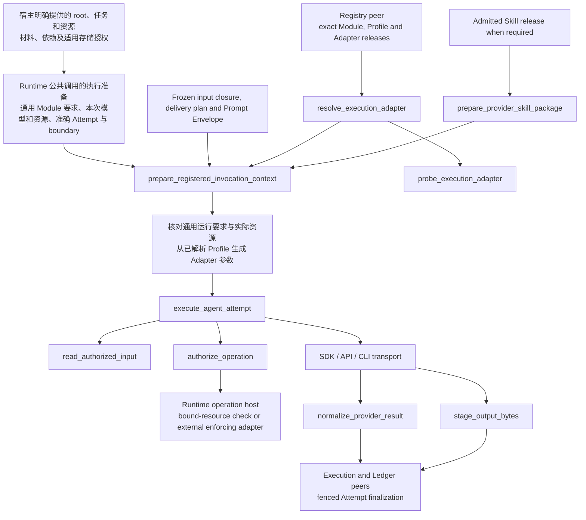
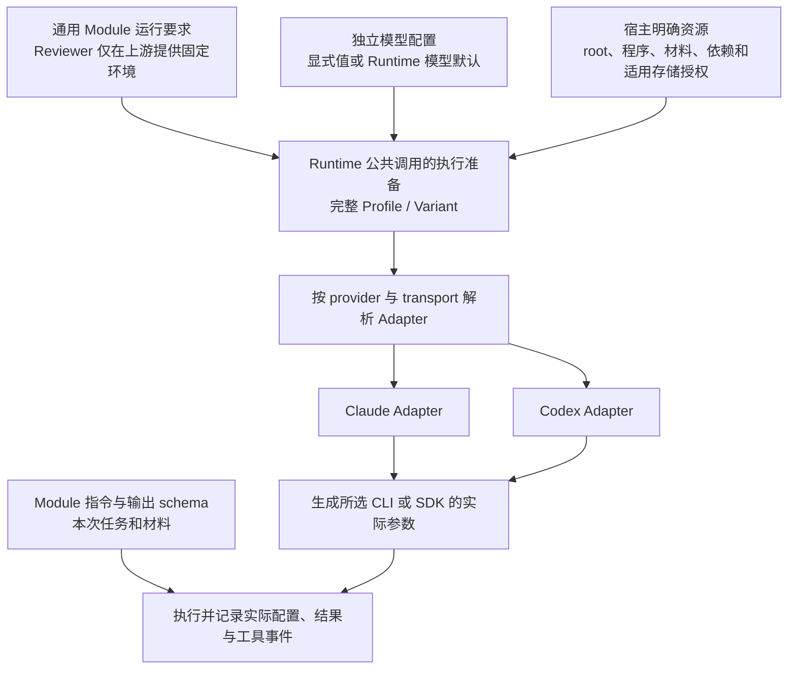

# Agent Runtime Agent Execution Adapter Contract

本文规定调用能力的目标职责与资源边界。实际可用的入口、Adapter 组合和验证结果由发布代码、测试与随包文档说明；文中出现一种能力不代表当前所有 Provider 都已支持它。

## 0. Intent Capsule

```yaml
layer: T2
status: candidate
canonical_owner: designDoc/agent_runtime_08_agent_execution_adapter_contract.md
parent: designDoc/agent_runtime_00_execution_charter.md
owned_system_object: provider-neutral Attempt invocation
scope:
  - shared Module invocation requirements and exact provider-neutral request, result, failure and context contracts
  - Runtime-hosted self-test and external execution boundary consumption
  - adapter descriptor, exact resolution, capability validation and dependency probe
  - frozen input delivery, Attempt workspace, tool and network enforcement
  - deterministic provider Skill packaging when required by a release
  - provider transport, schema projection, usage normalization and isolated Variant comparison
non_goals:
  - domain prompt meaning, output acceptance, Reviewer verdict or graph selection
  - execution scheduling, durable orchestration, Ledger authority or release admission
  - host API access, Product Authorization policy, grant issuance or credential custody
  - domain database schema, SQL, canonical write or business workflow composition
  - mutable provider support inventory, current deployment state or SDK/source layout
inputs:
  - exact admitted Module and its general execution requirements, resolved Execution Profile and Adapter, and applicable Skill release references
  - committed Attempt-begin receipt and T2 09 execution boundary result
  - complete frozen Module input closure, Prompt Envelope and input delivery plan
  - explicit request-bound input/output handles and permitted execution resources
  - owner-qualified operation/effect receipts where the selected boundary requires them
outputs:
  - prepared exact invocation context and compatible Adapter resolution
  - bounded provider result, normalized output submission, usage, failure and context observation
  - exact input delivery and tool observations for Runtime finalization
truth_surfaces:
  - designDoc/agent_runtime_08_agent_execution_adapter_contract.md
  - code-owned invocation contracts, Adapter descriptors and exact release bindings
  - committed Runtime Attempt, input, tool, context, usage and output records
  - generated Runtime inspection
runtime_triggers:
  - invocation of a frozen Module Variant Attempt
  - Adapter dependency or conformance probe
  - provider Skill packaging requested by an exact release
  - context resume or reconstruction within declared compatibility
downstream_consumers:
  - Execution, Registry, Ledger, Durability and Inspection
  - provider Adapter implementers and host integrators
  - Agent Capability Verification and Software Delivery
open_decisions: []
review_gate: independent design_contract_reviewer review and accountable Invocation owner decision before implementation
runtime_surface_ledger: generated from Runtime-owned invocation and Attempt facts
verification_hooks:
  - exact binding, input completeness and zero-invocation rejection
  - self-test without production authorization evidence
  - workspace, tool, network and cross-Variant isolation
  - output normalization, failure, recovery and source-usage conformance
```

## 1. Primary System Flow



图中的具名 operation 在 §12 定义。本 capability 组装 Context、执行 provider transport 并归一化
观察；Execution 拥有 Attempt 生命周期和最终结果，Ledger 拥有 committed facts。自测与外部执行
进入同一 invocation 边界，区别由 T2 09 的已验证 boundary 表达，不从空授权字段推断。

## 2. User Intent

Module owner 可以独立测试同一份已注册能力，也可以由业务无关的 Runtime 通过不同 provider 执行它。
普通自测使用 Runtime 测试宿主提供的受限资源，无需生产授权 client 或伪造 approval；外部受保护操作
仍使用真实外部决定。Provider 的工具、workspace、网络与输出能力受 Module 固定能力、完整生效
Profile 和本次资源绑定共同约束。Runtime 公共调用统一解析执行配置；ModuleReviewer 只在定义端提供
固定默认环境，普通 Module 使用同一调用合同，选择模型不改变任务的运行要求或资源权限。

## 3. Reader Gain

- Runtime Maintainer 能追踪 release、输入、boundary、Attempt 与输出之间的闭包，区分调用完成和结果提交。
- Adapter Maintainer 能实现 SDK、API 或 CLI transport，同时判断哪些不兼容必须在调用 provider 前拒绝。
- Module Owner 能判断 inline、Gateway、attachment 或显式项目工作区怎样交付输入，以及 Variant 比较保持了哪些条件。
- Host Integrator 能从 §6.3 取得统一调用边界：提供 root、任务和本次明确资源，由 Runtime 完成模型、Adapter 和执行配置解析及日志返回。
- Security Reviewer 能核对自测资源隔离、外部权限交接、工具拒绝、迟到输出和私有内容去向。

## 4. Capability and Operation

Agent Execution Adapter 调用一个冻结的 Module Variant Attempt。Provider Skill Adapter 仅在 release
要求时，把一份已准入的 provider-neutral Skill release 确定性打包为 provider 输入。两者都不是
Agent role、Workflow node、Reviewer semantic owner 或 domain writer。

| Concern | Accountable owner | Invocation boundary |
| --- | --- | --- |
| task prompt、允许的语义证据、output meaning 与完成规则 | Module/domain owner | 消费已注册语义与 output schema，不判断业务质量 |
| Skill artifact 与写作方法 | Skill Management | provider Skill packaging 转换 exact admitted bytes；项目 Agent 的 Skill 发现按 §10.4 显式配置 |
| release、模型选择与本次 Profile | Registry、Execution | Runtime 公共调用先解析目标和运行配置；Invocation 消费准确结果并核对实际 Adapter，不重读 source 作选择 |
| 自测资源或外部 authority boundary | T2 09 与其绑定的可信宿主 | 消费 boundary/fence 结果，不签发生产许可 |
| provider transport、Context、输入交付与归一化 | Invocation | 实现本 T2 的有界调用 |
| 实际外部效果与数据库权限 | enforcing adapter 与所属 external/data owner | 通过 request-bound host 交接，保留其结果 owner |
| Attempt 状态、恢复、事实提交与检查 | Execution、Durability、Ledger、Inspection | 提供 observations 与 staged output，不自行创建最终权威结果 |

Provider package 不 import host product、domain workflow、业务数据库或 formal-review implementation。
宿主加载 provider package，domain plugin 只引用公开 Runtime contract 和 exact release。Adapter 不解析
host Workflow Registry 或 WorkflowExecutionBinding，也不把 provider session 当作 host admission 证据。
Host API access 在进入 Runtime 前由所属宿主处理；本合同的前提来自 Runtime T1 和 T2 09。

## 5. Request and Result Contract

### 5.1 Public protocol and exact request

公开的 AuthorizedAgentExecutionAdapter.execute 消费 AuthorizedAgentExecutionRequest 与
AuthorizedAgentExecutionHost，返回 AgentExecutionResult。Authorized 表示请求已经具备适用的
Runtime boundary，不表示每次调用都需要 Product Authorization。ProviderSkillAdapter 只提供
exact admitted Skill 到 provider package 的确定性转换。

Request 必须闭合：

- Workflow Execution（适用时）、Module Run、Variant 与 Attempt identity；
- exact Module release、Execution Profile、Adapter identity/revision 与 canonical output schema refs/hashes；
- committed Attempt-begin receipt，以及 §5.2 指定的 execution boundary evidence；
- ExecutionInputRef 的 ref/hash/schema/media type/logical name；只有明确 file-backed 的输入才有受限只读 handle；
- 完整 frozen input closure、Prompt Envelope 和 input_delivery_plan 的 exact refs/hashes；
  显式项目工作区还绑定 Profile 声明的资源范围，实际读取按 §7.2 记录；
- data-use purpose、request identity/hash 和 idempotency identity；
- 兼容 Context 请求、request-bound input/output handles，以及调用前已成立的适用 operation receipts。

请求恰有一个 execution scope：Workflow 内使用对应 Workflow Execution identity，直接 Test/Evaluation
使用独立 Module scope ref/hash。不得伪造 Workflow Execution 来容纳独立测试；旧 DTO 字段如何映射
由 Code Design 和版本化 code contract 处理，不在 Design 中固定历史字段重用。

Attempt-begin receipt 必须解析到已提交的 Attempt-start record，hash 来自其 canonical content。
临时测试 Ledger 也必须先产生真实 begin record，不能用占位 receipt。Module release、Profile、Prompt
与 schema 均精确解析，不接收 mutable profile snapshot、latest lookup 或 SDK 隐式默认值。

local_handle 是 request-bound table 的 opaque key。即使它可读起来像相对路径，也不能直接交给
filesystem API；host 只能解析该请求允许的输入或输出。

### 5.2 Self-test and external boundary evidence

| Boundary | Required evidence | Invocation behavior |
| --- | --- | --- |
| Runtime-hosted self-test | T2 09 验证的 exact self-test boundary、可信测试宿主资源、begin receipt、registered capability 与输入闭包 | 无需生产 authorization context、Product decision 或 grant；仍执行全部资源与输出约束 |
| External protected execution | T2 09 的 exact external boundary、已提交的适用 protected-operation intent、调用前可验证的外部决定和 required grant refs | 缺失任何适用前置证据均拒绝；实际 effect 与 terminal grant disposition 通过执行后结果返回 |
| Operation-free in-process test double | exact Test/Evaluation scope、begin receipt、输入/输出约束；无 provider/model/tool callable，零 declared operations | 只测试对应 deterministic path，不声称 SDK/API/CLI 或真实模型能力 |

Boundary kind 由可信 Runtime 入口提供，并必须与 purpose、资源和 Adapter capability 相容。没有外部
evidence 不等于 self-test，填入 test purpose 也不能获得生产资源。需要的 ref/hash 成组存在并精确一致。
Self-test evidence 记录资源检查，不伪装成生产 context/status 或 allow-all Product decision。

外部证据的主体与记录继续由 T2 09 解释：execution boundary、protected intent、owner-qualified
grant 适用性声明、decision/effect observation，以及适用 grant disposition。Invocation 只携带和核对
引用。前置 receipt 只证明本次操作已获准进入；实际 effect 和 terminal grant disposition 在效果发生后
成为观察，不能成为同一次效果开始前的输入。Grant 依赖对应 intent 与外部决定，外部 operation 依赖
有效的 external boundary；数据库权限
只属于实际 database operation，不能成为所有 model invocation 的全局前提。

### 5.3 Result and output submission

AgentExecutionResult 只返回 infrastructure facts：

```text
terminal_status: completed | failed | cancelled
resolved provider/model/runtime identities
output submissions keyed by opaque output-slot ID
model/tool observations bound to the applicable execution boundary
input/output/cache-read/cache-creation tokens, each nullable
AdapterContextResult
AgentExecutionFailure | null
private trace ref/hash
```

Reviewer 共同格式由 Registry T2 §6.1 的 Runtime 专用 source 检查入口保证；Invocation 对所有 Module
使用准确注册的完整输出 schema，不再以 Reviewer 身份增加结果字段要求。

input_tokens 归一为包含 cached input 的总输入量；cache_read_tokens 与 cache_creation_tokens
仅为可空的子集明细，消费方不再次加到 input_tokens。Adapter 必须对其 pinned transport 的 provider
usage 口径进行转换，保留无法取得的分量为 null，不能把未知量变成零或编造成本。

Tool-free text Module 使用最终 provider response 作为待提交 output body，不要求可写 provider
workspace。Agent execution 可以在 Profile 明确允许的私有草稿或项目工作区内读写和验证；
文件变化是实际效果，不自动成为已接受的 Module output 或已发布 domain artifact。
只有 declared final submission 才能进入 Runtime 的 hash、slot 和 canonical schema 验证。
文件修改范围由任务 owner 授权，Runtime 记录实际差异；Adapter 不决定文档内容、发布领域结果或选择 graph edge。

## 6. Profile, Descriptor and Adapter Resolution

### 6.1 Orthogonal capabilities

Execution mode、semantic-input delivery、workspace policy、network policy、output constraint 与
execution boundary kind 是独立约束。可写 workspace 不表示允许 Gateway，agent mode 不表示联网，
self-test 不表示跳过 profile conformance。

| execution_mode | Input delivery | Provider-visible capability | Output |
| --- | --- | --- | --- |
| tool_free | inline；超出 frozen budget 时在调用前拒绝 | 无 shell、filesystem、browser、app、search、工具网络或可写 workspace | final provider response |
| agent | exact frozen inline、gateway_read、managed_attachment、hybrid 或显式项目工作区 | 已解析 Profile 保存的 Module 工具能力及 boundary 允许的文件、附件和网络范围 | declared final response 或经验证的 output slot |

完整 Execution Profile 保存已经解析的模型、工具、上下文、工作区、网络、预算和输出配置。
其中模型选择由 Runtime 公共调用独立解析，工具及安全规则来自 Module 的通用运行要求，具体资源
来自本次绑定。ModuleReviewer 在上游提供固定环境后，也使用这一份通用合同；后续调用不要求
Reviewer 类型或专用默认字段。本文后续所称 Profile 均为这一完整执行快照。工具清单为空表示没有模型工具；来源不完整、含义不明或 Adapter 不能落实
限制时，在调用 Provider 前拒绝。执行器声明支持范围，不能扩大已冻结能力。
执行器类名、agent mode、可写 workspace 或加载项目规则，均不能额外开启 Shell 或其他工具。

这项执行检查同样适用于既有 Profile。历史内容可按原合同读取，但依赖隐含工具权限的旧配置
不能继续执行；调用者应明确注册满足本节要求的新 Profile。显式无工具的合法配置不受此限制。

Adapter 将生效工具 ID 解析为对应 Provider 原生能力或注册操作。原生 Shell、文件编辑和
Skill 发现必须有明确的已解析来源；其中一个开启不代表另一个也开启。注册的领域/Gateway operation
还须符合 Module 的 declared operations 及相应权限；原生工具不能代替领域操作的许可。
工具 ID 与实际参数的映射由 Adapter code 定义，不能因名字相近直接当作同一工具。

私有草稿与项目工作区使用不同的资源范围；两者都遵守上述显式工具选择。私有草稿工具只能
操作当前 Attempt 的草稿，不能因此读取项目、搜索私有语料或连接数据库。

| network_policy | Model/tool resource boundary | Required enforcement |
| --- | --- | --- |
| denied | 不提供额外网络能力；只允许执行声明 model call 所需的固定 provider transport | provider transport 与模型可用工具分离，其余 egress 拒绝 |
| gateway_only | 模型只能使用注册的 Runtime/host network operations | 每次 operation 经过有界 host/Gateway 并形成适用 boundary 的 receipt |
| direct_sandboxed | 仅可进入 exact admitted egress window | 固定 destination/protocol/credential scope、私有 trace 与 profile-specific conformance |

固定 provider transport 由 Adapter/宿主处理登录与连接，不把 provider credential 交给模型，也不能
借该连接提供浏览、任意 HTTP 或其他未声明操作。外部受保护效果仍需所属 owner 的真实决定。

Gateway reasons 对应以下稳定用途，code-owned binding 保存其 exact IDs：

```text
entitlement_specific_semantic_search
external_fact_verification
unfrozen_input_set
oversized_knowledge_retrieval
authorized_package_external_exploration
```

Gateway delivery 必须有真实任务需要与 admitted reason；inline Profile 不能携带 Gateway reason 或
gateway_operation。原生工具的执行方法按 §10.4，输入与资源范围按 §7；以 repository commit 为
受审对象时，同时遵守 §10.3 的冻结和只读要求。命令白名单是独立限制，仅在本次任务或 Profile
明确要求时绑定并强制执行 Sandbox Command Plan。两节共同约束同一次执行，不是互斥入口。
原生工具不会因为由 CLI 提供就成为 Gateway，也不能把普通 Shell 记录当作逐次 Gateway 许可。

### 6.2 Descriptor and registry contract

AgentExecutionAdapterDescriptor 必须唯一标识 Adapter contract、adapter_id/revision、provider、
runtime package binding、transport_family 与 exact transport_kind，并声明支持的 Context/read isolation、
execution modes、input delivery、workspace/network policies、output constraints、boundary kinds、
dynamic-operation enforcement 与 operation binding kinds。字段和当前支持清单属于 code truth。

transport_family 区分 sdk、api、cli、in_process；transport_kind 标明本次 Profile/Adapter 选定的 exact
transport，由 Runtime 解析。Synthetic in-process double 不能声称真实 SDK、API 或 CLI 能力。

ExecutionProfileRegistry 与 Adapter registry 分离。前者提供 immutable Profile register/resolve/inspect，
后者登记 descriptor/factory 并提供 exact resolve 与 explicit dependency probe。重复相同身份和字节可
复用，身份相同而字节不同必须拒绝。Host composition 显式加载 provider package；import/probe 成功
不授予 execution authority。

调用前，以 exact Module release、Profile ref/hash 和 Adapter revision 解析唯一实现，并验证
descriptor 覆盖所需 transport、boundary、input、workspace、tool、network、Context 和 output
capability。缺少支持声明不能当作兼容；不兼容时 provider invocation count 必须为零。
新调用按 Module 的通用运行要求、准确 Profile/Adapter 能力和实际资源判断，不要求 Portable source
声明 transport，也不使用旧 source 清单否决新调用。旧 payload/hash 保真读取与已提交执行的回放
遵守 Registry 合同；缺少要求时只能使用已有明确事实，不能补入当前 Reviewer 默认。
Adapter 行为变化通过相应 revision 和 Variant 表达，不能回写已冻结 Profile 或自动换 provider。

### 6.3 配置归属与固定执行方法

#### 6.3.1 固定能力、模型选择与实际参数

Module 定义明确任务和通用运行要求；ModuleReviewer 只在该定义的构造端提供固定默认环境。
Runtime 公共调用接收 root、任务输入、本次材料与依赖及适用存储授权，内部完成目标解析、模型和
Adapter 选择、Profile/Variant 构造、调用与日志返回。宿主提供事实和资源，不另建配置组装器。

省略模型选择时，Runtime 使用随包公开的当前预设；普通 Module 的工具能力仍来自其明确要求。
Adapter 消费已经固定的执行快照，不再向 SDK、ambient 环境或 source 索取默认。低层 kernel 与
授权端口继续服务于同一公共调用，不因角色特化再建一套 runner。



同一 Module 的任务含义和运行要求保持稳定。Claude 和 Codex 可以用不同原生参数表达相同的
逻辑能力；具体 Adapter 不支持某项边界时按 §6.2 拒绝。模型可选择不等于所有模型组合都已可执行。

| 内容 | 由谁提供 | Runtime 固定执行什么 |
| --- | --- | --- |
| 固定 instruction、输入输出 schema、任务完成含义 | Module owner 的已注册 source | 解析完整内容，按原 schema 校验；Profile 不改写任务含义 |
| 工具、网络、隔离、workspace 与执行预算 | 通用 Module 运行要求；Reviewer 在上游由 Runtime 固定环境提供 | 核对完整能力及 Policy 一致性；保留真实操作的授权与资源约束，不因模型选择增删权限 |
| provider、transport、model、推理及模型执行参数 | 独立模型选择；省略时使用 Runtime 发布的模型预设 | 校验与固定能力相容，解析准确 Adapter；不自动换模型或降档 |
| 项目入口加载、Skill 发现与文件操作边界 | 对应 Module 的明确能力契约及本次资源 | 按通用能力落实；普通无工具 Module 仍无工具，角色名称本身不授予权限 |
| CLI 路径、认证来源、Python 等依赖、运行状态根、stores | 宿主安装配置 | 解析实际依赖，隔离秘密；不从其他会话、项目 scratch 或业务配置猜测 |
| 本次任务、材料及既有调用标识 | 当前请求 | 绑定输入与执行记录；任务正文不能覆写 Profile 或变成启动参数 |
| 配置转换、隔离、进程启动和终止、结果校验、记录与导出 | Runtime 固定代码 | 同一入口复用；结果、失败和公开日志均可按执行记录取得 |

Reviewer 固定环境由 Runtime 随软件提供；模型预设与 Module 定义分别更新。默认环境在构造时成为
同一通用运行要求，后续消费者只核对这份要求和实际生效值。执行快照不成为第二份可编辑权限配置。超出 Module 固定预算或实现支持范围时拒绝，不能
悄悄截短材料、减少能力或开放更大资源范围。

#### 6.3.2 Reviewer 默认能力及受限操作

标准 Reviewer 默认允许读取、搜索和受限 Shell。常用阅读、差异及测试命令经 Shell 使用，不逐条
创建 Runtime 工具。审核材料只读，临时测试写入私有 scratch；工具网络关闭，环境规则、历史会话、
Skills、Plugins 和 hooks 不自动载入。Provider 连接和可信 Runtime 的存储连接不会变成模型网络权限。

逻辑 read/search/shell 到 Provider 工具的映射由 Adapter 固定代码实现。标准原生工具窗口不要求逐条
命令白名单，但 Module 或本次任务已要求 exact commands 时，必须继续执行 §10.3 的限制。

普通 Module 可以明确要求与 Reviewer 相同的读取、搜索和 Shell 能力，并使用自己的非审核输出
schema。Engineering 的合法本地操作要求由 Runtime 统一解释和迁移，不能因存在非模型操作 ID
或工具名称不同而被排除，也不要求 Portable 再声明技术配置。

原生工具若触及任务明确限制的资源或命令，必须通过等价受控绑定，或由受验证的整体窗口落实
同一边界。仅将旧 operation ID 改名为 Read/Grep/Bash 不构成等价证明；真实领域操作继续受其
所属授权和资源边界约束，默认 Bash 不授予额外领域权限。

无法实现限制的组合在调用前拒绝。Runtime 不能删掉非模型操作以进入原生工具特例，也不能用
“另一个 Reviewer 只声明模型调用”作为开放该组合的理由。具体操作映射和约束保真由测试证明，
原生事件记录仍不是逐次授权凭据。

不同 Reviewer prompt 在上游使用同一固定环境，其共用定义和执行行为来自 Module；宿主不各自维护可变权限配置。模型或
Adapter 变化沿用 Registry 的版本边界；Module 运行要求改变则需要新 Module 定义。旧 release 不被
新默认补写或提权。样例只消费这些同一入口，不形成另一套启动参数权威。

#### 6.3.3 CLI 更新与可复用执行

CLI 或 SDK 的实际安装版本由宿主提供，与 Profile 版本及 Adapter revision 分开。一个 Adapter revision
可以支持多个经过兼容验证的 CLI 或 SDK 版本。仅更新兼容的安装版本，不要求重写 Module、Profile
或创建新 Adapter；若参数转换或执行行为需要修改，再更新 Adapter revision 并按 §6.2 绑定。

每次运行先确定实际程序、版本及生效参数，并在该次执行中保持不变。升级供后续运行使用，不把新旧
程序混入正在执行的 Attempt。实际程序版本、Adapter revision、Profile 和生效配置进入执行记录；
同一个 Profile 的两次运行若使用了不同 CLI，记录仍应显示该差异，比较条件继续遵守 §9.2。
兼容验证覆盖该配置要用的参数、工具、资源边界、输出与日志，结果写进现有测试和 runbook。
尚未验证或已知不支持的组合按现有 capability 检查处理，不以“能启动”推定支持。

工具权限与文件权限共同生效。允许 Shell 时，Shell 启动的 Python、读取和写入仍受相同文件限制。
源码只读不证明命令白名单；要求 exact commands 的任务必须有相应 code enforcement。
项目规则加载不自动开启 Skill 发现；关闭自动发现也不等于禁止读取已经授权的 Skill 文件。
工具网络与 Runtime 自己的 Provider 连接、PG 记录连接分别约束，后两者不自动授予模型网络能力。

CLI 参数表、依赖安装和实际命令由随包 runbook 与 sample 提供。样例与 Runtime 复用相同配置转换，
不能各维护一套参数。支持清单、参数名、数值及验证事实由代码和测试提供，本节不复制本机配置。

## 7. Frozen Inputs, Delivery and Workspace

### 7.1 Semantic completeness and delivery plan

Module schema 决定必需的语义对象与完整性规则。宿主提交冻结输入，或通过其受控 data-access
adapter 解析已声明的对象；Runtime 只取得有界内容和引用，不连接业务数据库或扫描环境目录。
普通自测可直接使用测试宿主提供的 exact fixture/input，不要求先经过生产数据服务。本次明确提供的
冻结文件、相对路径与必要只读依赖由 Runtime 公共调用交给同一资源边界；root 或任务 JSON 中的
路径文字本身不产生读取权限。相关参数和材料编码在公共代码合同中定义，不由宿主临时拼装输入目录。

Module 先冻结任务正文及声明为完整输入的 transport-independent model_semantic_context。
显式项目工作区的允许读取范围与已经交付的内容分别记录；允许读取目录不等于目录全文已冻结。
所有 required_complete slot
必须完整交付；Gateway 可以分页，但不能以 selective retrieval、raw storage row 或模型自行挑选的
子集替代该 slot。Runtime 不静默截断、摘要或删除输入以适应 provider window。

input_delivery_plan 是 behavior-affecting Variant state，至少闭合：

```text
plan identity/hash and ModuleInputClosure hash
budget policy ref/hash
estimated static tokens
reserved output tokens and provider overhead
exact inline bindings
Gateway capability bindings
managed attachment refs/hashes/media types
delivery_mode: inline | gateway_read | managed_attachment | hybrid | workspace
```

编译预算先预留 system、tool、output 和 provider overhead，再选择 Module 与 Adapter 共同支持的
delivery。估算只是 admission guard，不是 provider usage。无合法模式能够完整承载时返回
input_too_large，发生在 provider invocation 前。Retry 复用原 plan；换 plan 是 sibling Variant，
不是当前 Attempt 的自动 fallback。

### 7.2 Delivery modes and mediated reads

| Delivery | Rule |
| --- | --- |
| inline | 完整 projected request 在保守预算内；冻结 Package 的语义背景可完整内联 |
| gateway_read | 仅在存在 §6.1 的 admitted Gateway reason 时启用；不因 agent mode 自动启用 |
| managed_attachment | 精确 binary 或 provider-required non-queryable attachment，不能替代知识库搜索 |
| hybrid | 短任务指令、input index 和 critical excerpts 内联；其余 required content 通过 Gateway 完整读取 |
| workspace | 冻结任务指令；按明确 Profile 读取项目规则、Skills 和任务材料，记录实际入口及文件读取；不冒充全目录冻结输入 |

每次 Gateway query 受 Module operation 和本次 execution boundary 约束。外部数据库操作仍经
project data-access adapter 的当前权限检查，测试资源操作则按已验证的测试范围执行。返回块成为该
Attempt 的 observed dynamic inputs，保留 exact model-visible request/response、object refs/hashes
和大小。Gateway 限制查询与响应大小，禁止 corpus-wide enumeration。direct_sandboxed 也不能绕过
受控 data-access adapter 读取 governed database。

超过 inline tool-result limit 的 required object 使用 ordered cursor：每页有界并返回 next cursor
或 terminal null；每页独立记录，跳页、重复或乱序均拒绝，未读取 terminal null 不能完成 Attempt。
Provider 自动生成的 overflow file 不是已准入 delivery，也不能证明读取完成。

Workspace file tools 按 §10.4 访问明确授权的项目材料；以 repository commit 为受审对象时，
另外遵守 §10.3 的冻结、只读与前后核验要求。是否采用命令白名单不由“文件只读”推定。
Provider 实际读取的文件与返回内容属于 observed inputs，保留可取得的公开证据；无法取得的内容明确
标为缺失。声明了完整输入要求的任务仍须交付全部所需内容。私有语料库、数据库和范围外探索
继续使用所属数据入口，不能用本地目录挂载替代数据访问控制。

Gateway 不消除 provider context limit。Agent 可保留私有工作笔记并重复读取合法块；若 domain
completeness 要求仍超出可可靠处理的上下文，domain owner 必须提供明确的 chunking、map-reduce 或
hierarchical graph，Runtime 不发明语义压缩策略。输出接受前，调用 Module 已声明的 completion validator
核对 required slot 和分页覆盖；单次 tool call 成功不足以证明输入完整。

### 7.3 Attempt workspace

普通 Attempt workspace 绑定 exact execution scope、Module Run、Variant 与 Attempt。Runtime 创建
独立 root，work/ 只供私有草稿；declared file outputs（适用时）使用独立 bounded output root。
这些是隔离角色，具体路径由 code-owned workspace contract 提供。

- Governed semantic text 通过 frozen inline 或 Gateway 交付，不把 corpus、tenant directory、search index
  或 cache root 挂入 workspace。attachments/ 只承载精确、只读的例外输入。
- 普通 root 不含 ambient repository、raw database connection、credential、authorization table、Ledger
  或未声明的 prior Attempt state。§10.3 的 frozen checkout 与 §10.4 的显式项目工作区另外绑定，
  不改变普通 draft policy。
- Agent 可以在自己的 work root 创建、读取、替换和验证草稿，从而在同一次 invocation 内自检。
- 新 Attempt 使用新 workspace。恢复同一 Attempt 时，Runtime-authored identity marker 必须精确匹配
  Attempt、Module Run、Variant、Module release、Profile、Prompt Envelope 与 execution boundary。
  Unowned non-empty root 或 marker mismatch 均拒绝，不能读取 sibling workspace。
- Workspace 默认私有、临时。Agent 不写自己的 audit、usage、authorization 或 billing records。
  输出和必要 trace 提交后才清理；失败时先保存 policy 要求的有界诊断。
- Read-only 只保护完整性，不保证保密。公开给模型的 attachment 必须按其可读取全部内容来准入，
  并在调用前后核对 exact bytes/hash。

网络权限不能扩大 filesystem 范围，workspace 写权限不能扩大网络范围。Path escape、symlink escape、
越界读取或拒绝的工具调用必须阻断，并使本 Attempt 不再能提交成功输出。

## 8. Request-bound Host and Tool Operations

AuthorizedAgentExecutionHost 提供 request-bound input table、output staging 和窄 operation callback：

```python
class AuthorizedAgentExecutionHost(Protocol):
    def read_authorized_input(self, local_handle: str) -> bytes: ...
    def stage_output_bytes(self, submission: OutputSubmission, content: bytes) -> None: ...
    def authorize_operation(self, request: ProviderOperationIntent) -> AuthorizedOperationReceipt: ...
```

Host method 名称不改变 §5.2 的 boundary 区分。Receipt 证明该次操作已通过适用的 gate；自测 receipt
记录测试范围检查，不装填虚构 Product decision、grant 或外部 authorization observation。
Adapter 不能仅凭模型提供的 intent 调用 resource callable。

每次 registered dynamic operation 先构建精确 ProviderOperationIntent，闭合 Module/Run、Variant、
Attempt、Profile capability/action、resource、boundary、deadline 与 idempotency。Host 验证该 operation
同时被 Module 和 Profile 声明，并由 exact Adapter 解析为正确 binding kind。

- 测试资源 operation：host 依据 T2 09 的 self-test binding 与实际资源限制作检查，不调用生产 PA。
- 外部 protected operation：host 消费 T2 09 的 boundary、intent、grant 适用性和前置 evidence，
  enforcing adapter 验证当前权限和适用 grant，再形成可进入本次操作的 receipt。实际 effect observations
  在 resource invocation 后返回，不能反过来作为前置许可。PA 只在数据库权限所需处参与。
- Provider 原生文件、Shell 和发现工具：先解析并冻结 Module 能力，再按私有草稿或项目工作区的资源
  权限执行，不生成伪造的外部 decision。可写路径不会自动开启这些工具。
- 无可靠 per-tool callback 的工具使用经过验证的整体受限窗口；固定命令审核按 §10.3，
  普通项目任务按 §10.4。原生 trace 是效果观察，不能作为逐次批准。

Resource session 只有取得与 intent 精确一致的 AuthorizedOperationReceipt 后才能进入 callable。
Capability/action 与选定 Profile tool、Module declared operation 的映射必须唯一；具体 resource
reference namespace 由 code-owned binding 表达，不从 provider 文本猜测。拒绝、fence 关闭、lineage
不匹配或缺 receipt 时必须证明 callable 未进入。Callback denial 会 taint Attempt；即使 SDK 捕获异常，
也不能在后面产出成功结果。

Session 返回 Runtime-authored request/response observations，Adapter 将其带入 terminal result。
Adapter 不直接调用 Product Authorization，不构造 grant，不读取 resource credential；事后 provider
events 不能被提升为批准或 canonical ToolCallRecord。Staged bytes 只在 Execution 的 fenced finalization
中被验证、hash 并提交，Adapter 不得绕过 host 写权威状态。

## 9. Context and Sibling Variants

### 9.1 Context portability

AdapterContextRequest 只支持 stateless、create、resume、reconstruct。它固定 context ref、
compatibility hash、context type、resume mode、read isolation、允许时的 parent Variant、exact
reconstruction input refs 和适用的 resolved prior ExecutionOutputRef。AdapterContextResult 返回
create/resume/reconstruct/invalidate/close disposition 与 opaque context ref。

Native resume 仅在完整 Variant compatibility 相等时可用。跨 provider、model、隔离 scope、boundary
或 sibling A/B 必须从 exact admitted inputs、resolved prior output、continuity state 与 typed revision
packet 重建；不能拷贝 opaque workspace。Provider transcript 只是优化，不是业务状态、唯一证据或
唯一恢复源。改变 Adapter 或 provider 不能悄悄改变原输入、授权范围或数据用途。

### 9.2 Controlled comparisons and output constraints

一个 Module Run 固定同一 ModuleInputClosure。每个 behavior-changing configuration 创建 sibling
Variant，绑定 arm_key、replicate_index、适用 parent_variant_id 和完整 Profile hash。Provider、
model、SDK/API/CLI、runtime/Adapter revision、PromptBundle、execution/input/output mode、tools、
network、Context、effort 或 timeout 改变都不能混入原 Variant。arm_key 是 opaque label。

所有 sibling 使用同一 canonical Module output-schema hash。Provider-native schema projection 与
inverse normalization 属于 exact Adapter revision，不创建新的 domain Module 或 Workflow。准入后的
projection 行为变化要求新 Adapter revision 与 sibling Variant。Pre-admission conformance 可以保存失败
与修复 Attempts，但最终 bytes 和 conformance evidence 冻结前不可用于 production promotion。

| output_constraint_mode | Contract |
| --- | --- |
| prompt_only_json | Runtime formatter 在 Prompt Envelope 中放一份 provider-neutral schema projection；Adapter 禁用 native schema surface |
| native_structured_output | formatter 不重复嵌入 schema；Adapter 通过 native transport 发送 exact provider-compatible projection |

Controlled Prompt-level A/B 还要求 Prompt Envelope bytes、input_delivery_plan、tool contract、budget、
Module release、schema hash 和所有其他 task-shaping non-provider fields 相等。Provider、model、
transport 与 Adapter identity 是公开的 arm differences；hidden provider context 不在 Runtime
byte-level observability 内。额外差异使比较成为 broader-stack comparison，不得继续声称受控 Prompt A/B。

Native projection 是 Adapter-owned fail-closed compiler。例如 canonical optional property 可以按
provider contract 转成 required nullable property；inverse projection 只移除 Adapter 自己生成的 optional-null
占位。归一后仍用完整 canonical Module schema 验证。Unsupported schema shape 在调用前拒绝，
inspection 保留 canonical hash、native projection、Adapter revision 和 validation result。

Production Profile 默认使用 native_structured_output；不能因 native surface 不可用自动退回
prompt_only_json。后者仅作为显式 Evaluation Variant 使用；推广为 production 需要新的 native Profile
registration 与该 Profile 下完整 stack Evaluation。Native mode 同时遇到 Prompt 中已有 schema marker
时拒绝，避免双重约束。Canonical schema 改变必须生成新 Module release，不能作为原 Run 的 sibling。

Sibling 的 Attempt history、Context、workspace、outputs、evaluation inputs 和 usage observations 全部
隔离。多 Variant Run 的下游消费继续由 Execution 的 selected policy、closed EvaluationSet、
immutable Selection 与 ModuleOutputResolutionRecord 控制；单 Variant 的 direct_single 或
evaluated_single 结果由 Execution 的对应规则处理，Adapter 不自行创建 resolution。完成先后、latest file、provider context、未 resolved output ref 或
单个 EvaluationResult 都不能由 Adapter 用来选 winner。

## 10. Provider Enforcement Requirements

### 10.1 SDK and provider Skill bindings

每份 SDK/API/Skill-backed binding 都必须从 frozen Profile 派生 model、effort、tools、turn limit、
timeout、Context 与网络策略，禁止使用环境默认值扩权。Provider Skill packaging 只能读取 Runtime
提供的 admitted immutable Skill release；不能发现仓库 Skills、加载 ambient hooks/memory/plugins
或重新解释其语义。

上述限制针对 provider Skill packaging。项目 Agent 是否加载项目入口和发现 Skills，另按 §10.4
的显式 Profile 与资源权限执行；两种输入方式不能在实现中混用。

Claude SDK binding 的 workspace file tools 必须在执行前被逐项约束；普通 can_use_tool callback
若不能覆盖 SDK 自动批准的读取，必须使用能覆盖该读取的 before-tool hook（如其 PreToolUse
能力）或等价受验证的隔离。Hook 对每个路径解析 Attempt root；在 terminal Result 前保持必要的
bidirectional control stream，避免写工具因控制流过早关闭而失效。任何 hook denial 都 taint Attempt。

SDK Result、stream、authentication、quota、timeout、tool、policy 与 Context failure 归入 §13 的
taxonomy。Domain MCP 是 host 提供的注册 capability，provider 只见 operation metadata 与 scoped
callback handle；其请求/结果仍留在私有内容边界。Provider package 不 import domain 或 Reviewer 实现。

### 10.2 CLI bindings

CLI 只在显式 Profile 选择下运行。Preflight 解析 exact binary/version 与 capability，使用 shell-free
process invocation、独立 Attempt 状态、Profile 指定的合法 cwd、bounded environment、
process-group timeout 和 cleanup。
这里的 exact binary/version 固定本次实际执行程序；兼容的安装版本如何更新，遵守 §6.3.3，
不把一个已经测过的 CLI 版本写成所有 Profile 永久唯一的版本。
结构化事件用于解析 usage、Context 与 bounded status；unknown token/cache values 保留 null。
Resume 仅使用 Runtime 提供的 compatible ref；stdout/stderr/tool payloads 只进入私有 trace。

若某 CLI revision 不能可靠执行 before-each-tool gate，就不能声明逐次 Gateway enforcement。
Filesystem write confinement 也不能证明 read confinement；只提供 workspace-write 而允许 ambient reads
的机制不足以满足 own_draft_read_write。Gateway、direct egress、draft 或 hybrid 是否可用，必须由
exact revision 的 descriptor 与 conformance evidence 证明，不能从 CLI 名称、提示词或 prose 推断。
不满足时采用已经显式选择的 no-tools Profile，或拒绝该 Variant；当前 Attempt 不自动换 Profile。

### 10.3 Frozen repository review and composite execution window

本节规定以 repository commit 为受审对象时的材料保护。使用原生工具的工程 Reviewer 同时遵守
§10.4 的执行方法。它可以使用 Adapter 支持的原生能力或显式注册的 provider_sandbox_operation，
具体工具来自 Module 能力与显式操作的解析结果。完整 Profile 和本次资源绑定共同限定工具、文件、网络、冻结对象及输出范围；
这些限制必须能实际执行，不从“Reviewer”名称或 sandbox 名称推定权限。

普通 Runtime 自测使用 §5.2 的 self-test boundary，由可信测试宿主提供该资源窗口。
外部受保护执行的决定来自 T2 09 绑定的真实 external/resource owner，并保留其适用 grant；
PA 只在实际数据库权限检查中参与。
任何整体窗口都不能代替另一个效果所需的 Gateway 检查、数据许可或 grant。

Repository review input 固定一个 immutable commit ref/hash，以及由该 commit 派生、源码只读的
独立 checkout。只开放明确的材料与运行依赖，临时测试输出写入指定范围；不开放 ambient repository、
sibling checkout 或 credential。以冻结文稿而非 commit 为对象的计划审核，使用文稿的准确内容与
只读边界，不要求未来的 implementation commit。Runtime 必须交付任务实际需要的冻结文件结构与
只读运行依赖，使必需测试针对准确候选执行；scratch 新建样例不能替代这一结果。

文件保护与命令限制分别适用：

| Module 固定能力与本次任务的命令要求 | 必须落实的限制 |
| --- | --- |
| 允许在授权资源范围内运行一般检查 | 使用明确工具清单，并强制执行文件、网络、进程和资源限制；不强加固定命令白名单 |
| 只允许指定的 exact commands | 另外绑定 Sandbox Command Plan，由代码强制白名单；无法做到时在 Provider 调用前拒绝 |

两种配置都保留同样的冻结对象、源码只读与前后核验要求。当前 Reviewer Module 已声明的命令
要求继续适用，不能为了使用原生 Shell 而删去。只读目录或 prompt 中的禁令均不能替代命令白名单。
必做命令与“只准运行这些命令”分别表达：前者要求有真实完成证据，后者还要求代码限制其他命令。

调用前后都验证 immutable commit object 与被审源文件的内容一致性。Test-generated files 可存在于
允许的临时输出范围，但不能修改被审 commit 的源内容或自动成为 review evidence；subject drift
使 Attempt 无法成功，结果只能引用已声明并被验证的测试输出。检查 commit object 未变本身不足以
证明工作区里被读取的源文件未变。

支持 before-tool callback 的 Adapter 可对同一 operation ID 逐次执行约束；否则必须证明整个窗口
封闭。两者保持同一 Reviewer Module meaning 与 prompt。Inspection 分开展示 operation ID/binding
kind、self-test resource binding 或 external boundary ref、frozen subject 和适用的 command plan，
以及 Gateway 的 per-call receipts；CLI file events 仍只是 trace observations。

### 10.4 显式项目工作区与原生工具

项目 Agent 可在明确授权的项目中读取规则、发现 Skills、运行现成代码，并修改指定任务文件。
工程 Reviewer 可复用相同执行能力；审 repository commit 时遵守 §10.3 的材料保护，再按本次任务
和固定能力决定是否附加命令白名单。只读配置不要求两套执行器。评价 Agent 使用独立
输入与上下文；明确声明无工具的 Module 保持无工具。角色名不直接授予权限，Reviewer 类型的默认
环境在定义端形成通用运行要求，之后由统一公共调用解析并由 Invocation 执行。

调用前，Runtime 根据通用运行要求、准确 Profile 和本次资源准备环境，核对实际工具清单、项目入口与依赖，
并验证读写和网络限制。Provider 私有状态、登录、原始运行日志和评价材料均置于模型无法越界访问
的位置。同一 Runtime 进程负责创建、清理和记录这些资源，调用者不需要逐轮补写启动或日志脚本。

Agent 通过允许的工具自主读取 Skill 并调用所需代码。Runtime 不把任务内自检、独立 Reviewer
调用或评分顺序硬塞进 Adapter，也不替 Agent 补做遗漏的动作。任务内再次调用 Runtime 时，仍使用
该项目明确提供的正常入口及其权限；需要网络或 PG 访问时，必须有对应配置与真实验证。

允许修改的目标保留实际文件差异；只读审核材料保留前后内容一致性证据。文件操作成功、CLI
退出成功、合法 Reviewer 结论和任务完成分别记录。原生 Shell 的命令失败按真实结果保留；
已识别的权限拒绝或越界仍按 §13 处理，不能借“原生工具”豁免隔离要求。
同一个可写项目资源不能被隔离的并行 Variant 共同修改；并行测试需要各自独立的可写范围。

固定执行方法覆盖实际参数、上下文隔离、公开事件、结果解析、超时和进程清理。
日志上限触发时明确记录证据不完整，保留实际失败，不以静默截断的摘要冒充完整轨迹。
工具不可用、权限无法落实或输入缺失时返回相应失败，不自动更换配置。每种能力按 exact
Adapter revision 验证；一份可用样例不能证明其他模型、工具组合或联网方式都已支持。

## 11. Audit and Content Boundary

Runtime code 生成 Attempt、call、tool、Context、source usage、search、boundary 和 failure records。
模型不写这些记录；Adapter 也不创建 rate、charge、invoice 或 billing authority。

Adapter 采集该次 CLI 实际返回的 stdout、stderr 和全部可观察公开事件，保留原始字节及其所属 Attempt。
解析后的工具记录与原始日志同时可回读，解析结果不替代原文。工具请求和结果按 Provider 调用 ID 对应，
保留真实参数、返回内容和错误，以及原始事件位置；并行、乱序返回和失败后的新 Attempt 不互相覆盖。
Provider 没有返回的退出码、时间或结果保持未知，不从模型描述补造。

任务要求执行必需命令时，Runtime 提供与本次输入、候选和 Attempt 相符的真实命令执行事实，
subject validator 判断必做项是否完成及结果是否满足要求。完整工具日志不自动证明命令覆盖；
模型自报、命令子串或外层 CLI 成功也不能替代内部命令结果。缺少必要事实时保留未能证明的结果，
不伪造 exit/stdout/stderr，不要求 Portable 解析 Provider 事件或配置工具。具体事实采集与匹配由
Runtime 公共代码合同实现，并复用现有日志及记录路径。

正常完成、解析失败、工具拒绝、超时和用户中断，都须在临时资源清理前交出已经采集的日志。
记录上限、流读取或保存失败、缺失事件及脱敏造成的差异必须显式说明，不能把部分内容标作完整日志。
字节已经丢失或从未收到时，恢复不生成虚构内容；无持久存储的进程退出或机器故障不承诺跨进程恢复。
一次工具失败与日志不完整分别记录，保持原有 Attempt 接受和权限规则。

原生工具事件是调用事实，Gateway 记录还具有各自真实授权依据。统一日志读取可以展示两者，但必须
区分来源；原生调用不获得伪造 grant，也不因为名称相同就成为 canonical Gateway ToolCallRecord。
日志格式、Provider 解析和读取实现随 Runtime 发布，宿主及 Portable 消费接口而不维护另一套转换规则。

共享记录只包含 identities、refs/hashes、bounded classes、durations 和可得的 provider quantities。
Prompt/response、tool arguments/results、stdout/stderr、exception detail、assistant excerpts、
private input 与 session transcript 均保留在请求绑定的私有存储中。普通自测的私有存储由 Runtime
测试宿主提供；外部保存必须有显式 binding 和必要 credential，不能从业务环境配置自动选择。
存储创建、保留、证据导出和清理继续由 Ledger/测试宿主控制，Invocation 不接管 connection 或 credential。

Inspection 分别显示 initial provider request、authorized/frozen input closure、managed attachments 与
observed Gateway reads、项目入口与原生文件读取，不把它们混称为完整 prompt。
公开 Provider 事件、实际配置、结果和失败由固定代码保存，私有 reasoning 不作为审核证据。
只有具备对应访问资格的 operator 可以查看
私有内容；共享 telemetry 不泄漏内容。

Provider completion 与 Attempt finalization 分离。Execution 在同一 atomic commit 内重新检查 T2 09
的当前 fence、适用的 protected-time evidence 和输出新鲜度。合格结果才可成为 authoritative output；
closed fence、stale Attempt/Variant 或其他失效使 Attempt 失败或输出隔离，仍保存 usage 和有界诊断，
staged bytes 保持未被结果引用。它们不能覆盖较新的 Attempt、EvaluationSet、Selection、resolution
或 terminal dispatch。Invocation 返回观察，不自行重开 fence 或提交成功。

## 12. Public Interface and Effects

| interface_id | Owner | Input | Successful output | Effect | error_code |
| --- | --- | --- | --- | --- | --- |
| resolve_execution_adapter | Invocation | exact Module/Profile/Adapter identity 与 required capabilities | compatible exact Adapter | 仅解析；不调用 provider | ADAPTER_BINDING_UNAVAILABLE、ADAPTER_CAPABILITY_UNSUPPORTED |
| probe_execution_adapter | Invocation | exact descriptor 与受限 host dependency binding | bounded probe result | 显式依赖检查；不授予 invocation authority | ADAPTER_BINDING_UNAVAILABLE |
| prepare_provider_skill_package | Invocation | exact admitted Skill 与 selected provider packaging binding | immutable provider package ref/hash | 确定性转换；不读取 authoring tree | ADAPTER_REQUEST_INVALID、ADAPTER_CAPABILITY_UNSUPPORTED |
| prepare_registered_invocation_context | Invocation | exact request、release/input/Profile、begin receipt 与 T2 09 boundary | frozen prepared Context | 校验闭包并确定性加载输入，不调用 provider | ADAPTER_REQUEST_INVALID、ADAPTER_CAPABILITY_UNSUPPORTED、input_too_large；boundary failure 保留 T2 09 owner |
| execute_agent_attempt | Invocation | prepared Context、exact Adapter 与 request-bound host | AgentExecutionResult | 执行声明的 invocation，检查资源与前后 subject 一致性，返回 observations | ADAPTER_POLICY_VIOLATION 按 §13 typed failed result；ADAPTER_CONFORMANCE_FAILED；expected provider failures 按 §13 typed result |
| read_authorized_input | Invocation | request-bound opaque handle | exact permitted bytes | 有界只读；不把 handle 当 path | ADAPTER_REQUEST_INVALID、ADAPTER_POLICY_VIOLATION |
| stage_output_bytes | Invocation | declared OutputSubmission 与 bytes | staged submission ref | 仅 staging，不产生 authoritative output | ADAPTER_REQUEST_INVALID；storage failure 保留 Ledger/host owner |
| authorize_operation | Invocation | exact ProviderOperationIntent 与适用 boundary | matching AuthorizedOperationReceipt | 经 Runtime operation host 检查，在 receipt 前不进入 resource callable | ADAPTER_POLICY_VIOLATION；external/boundary failure 保留 owner |
| normalize_provider_result | Invocation | exact provider observation、canonical schema 与 pinned normalizer | normalized output 或 typed failed result | 归一 usage、Context、failure 与 output；不批准业务结果 | ADAPTER_OUTPUT_INVALID、ADAPTER_CONFORMANCE_FAILED |

Registry 的 release registration、T2 09 的 binding/fence 操作、Gateway 的 effect 和 Execution 的
finalization 都是 peer 接口。本表不复制它们的内部 error 或 permission decision。

## 13. Completion, Failure, and Recovery

AgentExecutionFailure 的 bounded class 集合保持：

```text
authentication
authorization
quota
rate_limit
timeout
dependency_unavailable
transport
provider
schema
policy_violation
context_unavailable
cancelled
unknown
```

它同时携带 retry disposition、failure scope、可选 retry-after 和私有 detail ref/hash。Adapter 检查
provider 的 bounded final body 及 SDK exception；quota/session-limit 不因 wrapper 报 transport error
而被误分类，也不盲目重试。Raw exception、stdout/stderr、工具参数或输出正文不进入共享 failure。

| error_code | Owner | Condition | Meaning | Caller action |
| --- | --- | --- | --- | --- |
| ADAPTER_BINDING_UNAVAILABLE | Invocation | exact Adapter 或所需 dependency 无法解析 | 没有可调用的 exact binding | 修复所属 binding/environment；不自动换 provider |
| ADAPTER_CAPABILITY_UNSUPPORTED | Invocation | descriptor 不覆盖 Profile/boundary/delivery/tool/network/Context/output 要求，或 native schema 无法表达 | 本 Variant 不可调用，invocation count 为零 | 返回 Profile/Adapter owner；改配置需新 admitted binding/Variant |
| ADAPTER_REQUEST_INVALID | Invocation | request/ref/hash/schema/begin receipt、input/output handle 或封装不一致 | 无法构成合法调用或 staging | 修复精确输入；不制造 begin 或 authority evidence |
| input_too_large | Invocation | 完整所需输入无法在所有共同支持的 delivery 中满足 frozen budget | provider 未被调用 | Module owner 明确分块/更换已声明方案，生成新 Variant |
| ADAPTER_POLICY_VIOLATION | Invocation | 工具、workspace、network、command 或资源越界；callback denial 或冻结 subject drift | 拒绝尚未发生的效果，或阻止已发生调用的输出被接受；Attempt 不可成功 | 拒绝当前操作，保留真实调用事实和有界诊断；execute_agent_attempt 内按本节形成 typed failed result；修复 resource/Profile/subject |
| ADAPTER_OUTPUT_INVALID | Invocation | provider body 不可解析、slot/schema/normalization 或 required-input coverage 不满足 | 没有可推进 output，但保留已发生的调用事实 | 形成 typed failed result，按有界 repair policy 决定新 Attempt |
| ADAPTER_CONFORMANCE_FAILED | Invocation | Adapter 抛出未归一异常、返回错误类型、遗漏必须保留的 usage/trace，或破坏 lifecycle ordering | Adapter 未履约，不存在 authoritative output | Execution 记录 bounded failed Attempt，返回 Adapter owner |

execute_agent_attempt 检测到资源越界、callback denial 或调用前后的 frozen subject drift 时，必须
返回 terminal_status=failed 的 AgentExecutionResult，其 AgentExecutionFailure 类别为
policy_violation，原因码为 ADAPTER_POLICY_VIOLATION。调用前发现则不进入 provider；调用后发现则
拒绝接受本次输出，保留已发生的 usage、tool observations 与私有诊断，不伪造未发生的用量，也不重复
或抹去已发生的效果。即使 provider 自报成功，tainted Attempt 也只能返回该 typed failure。
这属于正常的 policy enforcement result；Adapter 未执行检查、吞掉拒绝或无法形成合法结果时，才是
ADAPTER_CONFORMANCE_FAILED。Execution 仍负责最终记录和输出资格，Adapter 不自行提交权威状态。
read_authorized_input 或 authorize_operation 自身仍以对应 error_code 拒绝，不用 AgentExecutionResult
替换 bytes 或 receipt 返回类型。执行中的拒绝由外层 execute_agent_attempt 归一为上述失败结果；
准备阶段的拒绝则保持对应前置错误，由 Execution 记录且不进入 provider。

Expected authentication、quota、rate_limit、timeout、transport、provider error 与 cancellation 返回
failed/cancelled AgentExecutionResult，并保留 usage 与私有 trace。Provider 登录失败属于
authentication/environment，不是缺失生产 PA。Admission、external authorization 或 fence rejection
保留 Runtime/外部 owner，不能伪装成 provider failure；staging、Ledger 或 finalization failure 继续传播，
Adapter 不吞掉或改分类。

Provider completion 即使不是合法 JSON，也必须形成 failed Attempt，保留 provider usage、observed
tool calls 与有界 raw-response diagnostic ref。解析异常逃出而使这些记录丢失属于 conformance failure。
Auth、authorization、quota、missing dependency 与 systemic schema failure 按注册 policy 停止对应
runner/batch；Adapter 不把基础设施失败变成 domain blocked 或质量 verdict。

Repair 是同一 Run/Variant 下的新 Attempt。只有注册的 bounded repair policy 可提供 exact validation
finding 与允许的修复输入，不能更换 provider、Profile、PromptBundle、input closure 或 boundary。
Exhaustion 产生 terminal failure，并保留全部 Attempts。相同 Attempt 的基础设施恢复继续验证 §7.3
marker 与 §9 compatibility，不能把已 committed provider effect 当作新调用重复执行。

Adapter 只报告一次尝试的结果及是否可重试，不在内部重新启动另一轮完整 Reviewer。Execution 按
固定 Retry Policy 决定新 Attempt，Durability 只协调其已确定的重试身份。CLI 内部的一次工具失败
仍属于当前 Attempt；有效的 Reviewer non_pass/blocked 是业务判断，不是技术重试条件。

## 14. Dependencies and Verification

| Dependency | Required input | Returned result |
| --- | --- | --- |
| Runtime T1 | invocation delegation、自测与外部入口边界 | bounded Attempt invocation contract |
| Registry | exact Module/Profile/schema/Adapter/Skill release closure | conformance observations，不修改 release |
| T2 09 | validated resource/external boundary、operation receipts、fence 与适用时间判定结果 | invocation/operation observations，不解释 permission |
| Execution、Durability、Ledger、Inspection | Attempt identity、begin/finalization/recovery 与事实访问合同 | bounded result、usage、trace 和 Context observations |
| Module/domain owner 与 data-access owner | semantic completeness、completion validator 与 bounded data result | exact input delivery observations |
| Agent Capability Verification | owner-qualified case/runbook 与测试资源 | 本 Adapter 的可重现 conformance result |

类型、实际参数、Profile/Adapter 支持组合、资源验证、schema projection 与结果归一化在代码中定义，
随包文档和已有 Inspection 展示其可追溯事实，不另建平行 API 或要求每项能力增加投影对象。
文档中的能力不证明当前 SDK/CLI revision 已支持它；定义与纯编译先独立验证，随后 source、注册、
公共调用和 Adapter 的迁移分别取得证据，消费者未接通的中间结果不能宣称已可部署或运行。
兼容迁移遵守既有 release 与记录保真规则。

Conformance 使用 opaque synthetic Module 和可控 test clock，覆盖下列稳定要求；test double 结果与
真实 provider evidence 分开：

- 无 begin receipt、缺失或冲突 boundary、错误 release/input/Profile 时 provider callable 不进入；
- 普通 self-test 的真实 model invocation 不构造生产 context、Product decision、grant 或 allow-all stub；
- external protected path 的适用 evidence 缺失、伪造 test purpose 或越界资源均在效果前拒绝；
- begin/必要 intent commit 失败时零调用，started/failed/completed/cancelled/orphaned/stale 路径有完整事实；
- invalid/non-JSON completion 仍保存 failed Attempt、usage、tool observations 和 bounded diagnostics；
- bounded output repair 使用新 Attempt，保持 Profile、输入、Prompt 和 boundary；
- dynamic operation 先取得 matching receipt，外部 required grant 仍由真实 owner 验证，拒绝后不可成功；
- tool_free 拒绝工具、workspace 和额外网络，inline 超预算在调用前返回 input_too_large；
- 工具清单、项目规则加载、Skill 发现和读写范围从可追溯到 Module 的已解析 Profile 生效；执行器不能隐含开启工具；
- 项目工作区能读规则、运行声明允许的原生工具并写准确目标；只读材料和运行状态受实际保护；
- Gateway 分页覆盖、query/response bounds、权限/资源过滤、replay 与 exact hashes 可重现；
- attachment 只读且前后 hash 一致，workspace draft 可重读/修改但不能逃逸或读取 sibling/ambient state；
- 每个 network policy、operation binding kind、CLI composite window 都有独立 enforcement 和失败用例；
- repository review 验证 exact commit/checkout、工具限制、前后 subject 一致性和显式测试输出；
  命令白名单有明确要求时另外验证 exact command enforcement，不能从只读测试推定；
- 所有未知 usage 分量为 null，cached input 不重复计数，私有 sentinels 不进入共享日志/Ledger；
- sibling Provider Variants 使用相同 frozen input 且不共享 Context/workspace，归一输出通过相同 canonical schema；
- native projection 和 inverse normalization 覆盖所有 admitted schema shapes，unsupported shape 零调用；
- 多 Variant 下游访问依赖 Execution 的 closed evaluation/selection/resolution，evaluator 也经过正式 Adapter Attempt；
- provider package 在独立安装和无关工作目录可执行 synthetic conformance，不 import host/domain 或 host Workflow Registry。

本次交付的每条通用调用路径首先用普通 Module 和非审核输出 schema 验证，再验证 ModuleReviewer
固定环境沿同一路径生效。普通无工具、非 Agent 和真实领域操作的边界分别保持；下游不要求 Reviewer
类型或专用字段，合法 Engineering 操作与未知领域操作有明确不同结果。

公共入口还须证明冻结仓库读取、只读依赖、scratch、必要测试及命令组合真实工作；日志中的命令事实
绑定正确任务与 Attempt，缺证据、错对象、漏跑或失败不能被自报通过覆盖。新调用不临时扩充旧
transport 清单，也不以它否决已有明确能力依据的通路。参数探针、纯编译或 scratch 样例不替代完整
执行证据；这些验证按各层实际实现顺序完成，不要求定义层先交付后续调用结果。

代表性 capability family 包括 tool_free inline、Agent private draft、mediated Gateway、显式项目工作区，
以及精确受限 repository review。每种 family 都只能在 exact descriptor 与实测 enforcement 同时满足时准入；
hybrid、attachment、direct egress 或多能力组合也不能仅因已有单项能力而视为可用。Production purpose
继续经过其独立 start 与 release gate。Real-provider smoke 是显式 opt-in 的环境测试，不替代 deterministic
conformance；unsupported、unavailable、not_run 与 failed 必须如实保留。

## 15. References

- [Runtime Domain Root](agent_runtime_00_execution_charter.md)
- [Agent Runtime](the_agent_runtime.md)
- [External Authority Integration](agent_runtime_09_authorization_integration_contract.md)
- [Standalone Release Conformance](agent_runtime_05_delivery_roadmap.md)
- [Durability](agent_runtime_07_temporal_durable_adapter_contract.md)
- [Agent Capability Verification](agent_runtime_11_agent_capability_verification.md)
- [Data Governance](the_data_governance.md)
- [Skill Management](the_skill_management.md)
- [Timestamp Semantics](the_timestamp_semantic.md)
- [Design Doc Management](the_design_doc_management.md)
